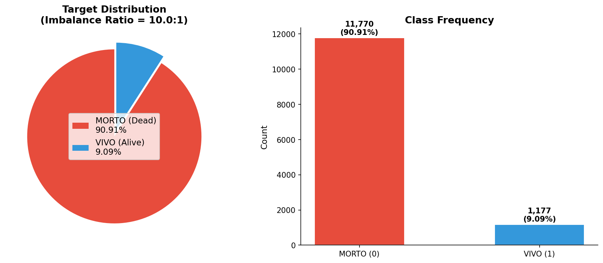

# 模块 0：数据加载与不平衡数据 EDA

> 本模块是案例教程 10「类别不平衡问题与样本重采样」的起点。在讨论 SMOTE、ADASYN、欠采样、过采样等重采样策略之前，我们必须先把巴西癌症数据加载进内存、构造目标变量、采样、构造严重不平衡教学数据集、精选特征、对分类变量做标签编码，并通过可视化手段**量化数据的不平衡程度**。

***

## 学习目标

学完本模块后，你将能够：

1. **理解医学机器学习中 False Positive 与 False Negative 的临床代价差异**：明白为什么癌症筛查场景下"漏诊"（FN）的代价远高于"误诊"（FP），以及这如何决定了 Recall 是首要评价指标。
2. **掌握混淆矩阵的四个基本量（TP / TN / FP / FN）及其在不平衡数据中的行为**：能够说出每个量的定义、公式和临床含义。
3. **理解 Accuracy、Recall、Precision、F1、ROC-AUC、PR-AUC、Brier Score 七个指标在不平衡数据下的不同表现**：明白为什么"高准确率 ≠ 好模型"。
4. **掌握 Imbalance Ratio (IR) 的计算公式和分级标准**：能够根据 IR 大小判断不平衡程度（轻微 / 中等 / 严重 / 极严重）并给出处理建议。

***

## 一、前序知识回顾：混淆矩阵与医学代价

在正式写代码之前，我们需要先理解一个根本问题：**为什么不平衡数据在医学场景中特别重要？** 答案藏在"混淆矩阵"和"临床代价"里。

### 1.1 混淆矩阵的四个基本量

任何二分类模型的预测结果都可以填入下面这张 2×2 的表格：

```
                    预测: 正类 (Positive)    预测: 负类 (Negative)
实际: 正类 (Positive)     TP (真正例)            FN (假负例)
实际: 负类 (Negative)     FP (假正例)            TN (真负例)
```

| 符号     | 全称             | 含义            | 临床含义（癌症筛查）      |
| ------ | -------------- | ------------- | --------------- |
| **TP** | True Positive  | 实际有癌症，模型也判为癌症 | 正确确诊，患者得到治疗     |
| **TN** | True Negative  | 实际健康，模型也判为健康  | 正确排除，患者安心       |
| **FP** | False Positive | 实际健康，模型却判为癌症  | 误诊，患者需追加活检/CT   |
| **FN** | False Negative | 实际有癌症，模型却判为健康 | **漏诊，患者错过治疗窗口** |

### 1.2 False Positive vs False Negative 的临床代价

> 💡 **核心概念：在癌症筛查中，FN 的代价远高于 FP。**

让我们用一个具体的临床场景来理解：

```
真实情况: 患者有癌症 (Positive)      真实情况: 患者健康 (Negative)
模型判定: 健康 (Negative)            模型判定: 癌症 (Positive)
           ↓                                   ↓
       False Negative (FN)                False Positive (FP)
           ↓                                   ↓
    错过最佳治疗窗口                         追加活检/CT
    患者几个月后确诊晚期                      增加焦虑和费用
           ↓                                   ↓
    代价: 可能致命                        代价: 可控的医疗支出
```

**结论**：在癌症筛查中，FN（漏诊）可能导致患者失去生命，而 FP（误诊）只是让患者多做几次检查。两者的代价严重不对称。

### 1.3 不同临床场景下的优先指标

| 场景   | 优先指标                            | 理由                               |
| ---- | ------------------------------- | -------------------------------- |
| 癌症筛查 | **Recall (Sensitivity)**        | "宁可错判一千，不可漏过一个"——FN 致命           |
| 确诊治疗 | **Precision (PPV)**             | "诊断了就要化疗，不能乱诊断"——FP 代价高（化疗有毒副作用） |
| 术后随访 | **F1 (Recall + Precision 的平衡)** | 两种错误都要控制                         |

### 1.4 七个评价指标速查表

| 指标              | 公式          | 关注点                      | 不平衡数据下的行为       |
| --------------- | ----------- | ------------------------ | --------------- |
| **Accuracy**    | (TP+TN)/N   | 全局正确率                    | 高（被多数类主导，会误导）   |
| **Recall**      | TP/(TP+FN)  | 少数类检出率                   | 低（未加权的模型会漏掉少数类） |
| **Precision**   | TP/(TP+FP)  | 预测少数类的精度                 | 高（只预测最确定的样本时）   |
| **F1-score**    | 2×P×R/(P+R) | Recall + Precision 的调和平均 | 低（两者都不高时）       |
| **ROC-AUC**     | —           | 排序能力                     | 偏高（多数类贡献大）      |
| **PR-AUC**      | —           | 少数类排序能力                  | 低（对少数类数量敏感）     |
| **Brier Score** | Σ(y-p)²/N   | 概率校准                     | 偏低（预测死亡有高置信度）   |

> 💡 **重点概念：在不平衡数据中，PR-AUC 比 ROC-AUC 更诚实。**
>
> PR-AUC 只关注正类的 Precision 和 Recall，不会被多数类（占 91%）的 TN 数量所稀释。而 ROC-AUC 的 TN 项会被多数类"撑大"，让模型看起来比实际更好。这就是为什么本教程会同时报告 ROC-AUC 和 PR-AUC。

***

## 二、导入必要的库

本教程相比案例教程 9（建模对比），**新增了** **`imbalanced-learn`** **库**（在模块 2 才会用到），同时**新增了多个评估指标**（`precision_score`、`f1_score`、`precision_recall_curve`、`average_precision_score`、`brier_score_loss`、`confusion_matrix`）。这是因为本教程的核心主题是"不平衡数据处理"，需要更全面的评估指标来揭示"高准确率 ≠ 好模型"的真相。


###

***

## 三、路径配置与目录创建
 

***

## 四、随机种子与采样规模

```python
RANDOM_STATE = 42
N_SAMPLES = 20000
```

 

## 五、加载数据与创建目标变量
 

## 六、采样与特征准备

```python
np.random.seed(RANDOM_STATE)
if len(df) > N_SAMPLES:
    idx = np.random.choice(len(df), N_SAMPLES, replace=False)
    df = df.iloc[idx].copy()

# 构造严重不平衡数据集 (教学用途)
TARGET_IR = 10  # 目标不平衡比例
# 原始数据 IR≈1.4:1 (轻度不平衡), 欠采样少数类 VIVO 构造 IR=10:1 (严重不平衡)
df_neg = df[df['target'] == 0].copy()  # MORTO (多数类, 全部保留)
df_pos = df[df['target'] == 1].copy()  # VIVO (少数类, 欠采样)
n_pos_target = len(df_neg) // TARGET_IR
df_pos_sampled = df_pos.sample(n=n_pos_target, random_state=RANDOM_STATE)
df = pd.concat([df_neg, df_pos_sampled]).reset_index(drop=True)

# 特征准备
feature_cols = ['Age', 'year', 'Code.Profession', 'Diagnostic.means',
                'Extension', 'Raca.Color']
df_feat = df[feature_cols + ['target']].copy()
```

### 6.1 采样逻辑

- **`np.random.seed(RANDOM_STATE)`**：固定 numpy 随机数生成器，确保采样可复现。
- **`if len(df) > N_SAMPLES:`**：只有当数据量超过 20,000 时才采样，避免数据量不足时报错。
- **`np.random.choice(len(df), N_SAMPLES, replace=False)`**：从 `[0, len(df))` 范围内**无放回**抽取 20,000 个索引。
  - 第一个参数 `len(df)`：采样范围的上界（从 0 到 len(df)-1）。
  - 第二个参数 `N_SAMPLES`：采样数量。
  - `replace=False`：无放回采样，同一个样本不会被抽中两次。
- **`df.iloc[idx].copy()`**：按索引取出采样后的数据，`.copy()` 创建副本，避免后续修改影响原 DataFrame（避免 SettingWithCopyWarning）。

### 6.2 构造严重不平衡数据集（教学采样）

这一步是本教程**新增的关键步骤**——通过欠采样少数类 VIVO，把原始数据从 IR≈1.4:1（轻度不平衡）改造成 IR=10:1（严重不平衡）的教学数据集。

#### 为什么需要这一步？

原始数据中 VIVO（存活）约占 41.15%，MORTO（死亡）约占 58.85%，IR≈1.4:1，属于"轻微不平衡"。在这种数据上，重采样方法（SMOTE、ADASYN、欠采样、过采样）的效果差异不明显——因为数据本身已经比较平衡，重采样的"修正"作用有限。

为了让教学效果更显著，本教程通过**欠采样少数类 VIVO**，把 IR 提升到 10:1（严重不平衡）。在严重不平衡的数据上，不同重采样方法的效果差异会被放大，学生能更清楚地看到每种方法的特点。

#### 代码逐行解释

```python
TARGET_IR = 10  # 目标不平衡比例
```

- **`TARGET_IR = 10`**：设定目标 Imbalance Ratio 为 10:1。这是一个教学超参数，表示"多数类样本数是少数类的 10 倍"。

```python
df_neg = df[df['target'] == 0].copy()  # MORTO (多数类, 全部保留)
df_pos = df[df['target'] == 1].copy()  # VIVO (少数类, 欠采样)
```

- **`df_neg`**：取出所有 MORTO（target=0）样本，**全部保留**，不做任何采样。
- **`df_pos`**：取出所有 VIVO（target=1）样本，准备做欠采样。
- **`.copy()`**：创建副本，避免后续操作影响原 DataFrame。

```python
n_pos_target = len(df_neg) // TARGET_IR
```

- **`n_pos_target`**：计算少数类 VIVO 的目标样本数 = 多数类样本数 // 目标 IR。
- 例如：`len(df_neg) = 11,770`，`TARGET_IR = 10`，所以 `n_pos_target = 11770 // 10 = 1,177`。
- 用整除 `//` 而不是普通除法 `/`，确保结果是整数（`sample()` 要求 `n` 是整数）。

```python
df_pos_sampled = df_pos.sample(n=n_pos_target, random_state=RANDOM_STATE)
```

- **`df_pos.sample(n=..., random_state=...)`**：从 VIVO 样本中**无放回**随机抽取 `n_pos_target` 条。
  - `n=n_pos_target`：抽取 1,177 条。
  - `random_state=RANDOM_STATE`：固定随机种子，保证欠采样结果可复现。

```python
df = pd.concat([df_neg, df_pos_sampled]).reset_index(drop=True)
```

- **`pd.concat([...])`**：把全部 MORTO（11,770 条）和采样后的 VIVO（1,177 条）拼在一起，总共 12,947 条。
- **`.reset_index(drop=True)`**：重置索引。拼接后的 DataFrame 索引可能重复（因为两个子集的索引都从 0 开始），`drop=True` 表示丢弃旧索引、生成新的连续索引。

#### 采样前后数据对比

| 阶段         | 总样本        | VIVO (正类)         | MORTO (负类)          | IR         |
| ---------- | ---------- | ----------------- | ------------------- | ---------- |
| 原始采样后      | 20,000     | 8,230 (41.15%)    | 11,770 (58.85%)     | 1.4:1      |
| 欠采样 VIVO 后 | **12,947** | **1,177 (9.09%)** | **11,770 (90.91%)** | **10.0:1** |

> 💡 **重点概念：为什么欠采样少数类而不是过采样多数类？**
>
> 欠采样少数类 VIVO 会减少数据量（从 20,000 降到 12,947），但保留了多数类的完整信息。如果反过来过采样多数类 MORTO，数据量会膨胀到 16 万+，计算开销大且容易过拟合。
>
> 注意：这里的"欠采样少数类"是为了**构造教学数据集**，与模块 2 中"欠采样多数类以平衡类别"的重采样策略方向相反。本步骤的目的是制造不平衡，而非解决不平衡。

> ⚠️ **常见问题：欠采样少数类会丢失信息吗？**
>
> 会。从 8,230 条 VIVO 中只保留 1,177 条，丢弃了约 86% 的 VIVO 样本。这在实际项目中是不可取的——真实数据中的少数类样本本就珍贵，不应该随意丢弃。但本教程是**教学场景**，目的是构造一个严重不平衡的数据集来展示重采样方法的效果，因此可以接受信息损失。在实际项目中，如果数据本身已经严重不平衡，应该考虑过采样少数类（SMOTE）或使用 `class_weight='balanced'`，而不是欠采样少数类。

### 6.3 特征选择

```python
feature_cols = ['Age', 'year', 'Code.Profession', 'Diagnostic.means',
                'Extension', 'Raca.Color']
```

本教程精选了 6 个特征：

| 特征                 | 含义     | 数据类型   | 量纲范围         |
| ------------------ | ------ | ------ | ------------ |
| `Age`              | 患者年龄   | 数值     | 0–120        |
| `year`             | 诊断年份   | 数值     | 2000–2020 左右 |
| `Code.Profession`  | 职业代码   | 数值（编码） | 0–9999       |
| `Diagnostic.means` | 诊断方式   | 分类     | 编码后为整数       |
| `Extension`        | 肿瘤扩展程度 | 分类     | 编码后为整数       |
| `Raca.Color`       | 肤色/种族  | 分类     | 编码后为整数       |

> 💡 **小贴士**：本教程只选 6 个特征，是为了让实验聚焦于"不平衡处理"这一主题。特征越多，模型越复杂，反而会掩盖重采样方法的效果差异。在医学数据中，6 个特征已经足够构建一个有临床意义的预测模型。

### 6.4 `df_feat = df[feature_cols + ['target']].copy()`

把 6 个特征列和目标列拼在一起，取出副本。`feature_cols + ['target']` 是列表拼接，结果是 7 个列名。

***

## 七、分类变量的标签编码

```python
cat_cols = ['Diagnostic.means', 'Extension', 'Raca.Color']
for col in cat_cols:
    le = LabelEncoder()
    non_null = df_feat[col].dropna().astype(str)
    le.fit(non_null)
    mc = non_null.value_counts().index[0]
    def encode(x):
        if pd.isna(x): return np.nan
        xs = str(x)
        return le.transform([xs])[0] if xs in le.classes_ else le.transform([mc])[0]
    df_feat[col] = df_feat[col].apply(encode)
```

这段代码对 3 个分类变量做标签编码，逻辑与案例教程 4 完全一致。 

## 八、构造特征矩阵 X 和标签向量 y

```python
X = df_feat[feature_cols].astype(float).values
y = df_feat['target'].values

n_pos = (y == 1).sum()
n_neg = (y == 0).sum()
ir = n_neg / n_pos if n_pos > 0 else np.inf

print(f"    总样本: {len(X):,}")
print(f"    VIVO (正类): {n_pos:,} ({n_pos/len(X)*100:.2f}%)")
print(f"    MORTO (负类): {n_neg:,} ({n_neg/len(X)*100:.2f}%)")
print(f"    Imbalance Ratio (IR) = {ir:.1f} : 1")
```

### 8.1 `X = df_feat[feature_cols].astype(float).values`

- `df_feat[feature_cols]`：取出 6 个特征列。
- `.astype(float)`：把所有值转成浮点数。这是因为 sklearn 的模型要求输入是数值型，且 SimpleImputer 和 LogisticRegression 内部都用 float64 计算。
- `.values`：把 DataFrame 转成 numpy 数组（`ndarray`），sklearn 接受的格式。

### 8.2 `y = df_feat['target'].values`

取出目标列，转成 numpy 数组。`y` 是一个一维数组，取值为 0（MORTO）或 1（VIVO）。

### 8.3 计算 Imbalance Ratio (IR)

```python
n_pos = (y == 1).sum()   # 正类（VIVO）样本数
n_neg = (y == 0).sum()   # 负类（MORTO）样本数
ir = n_neg / n_pos if n_pos > 0 else np.inf
```

- **`n_pos`**：正类样本数。`(y == 1)` 是一个布尔数组，`.sum()` 统计 True 的个数。
- **`n_neg`**：负类样本数。
- **`ir`**：Imbalance Ratio = 负类数 / 正类数。`if n_pos > 0 else np.inf` 是防御性编程，避免除以 0。

> 💡 **重点概念：Imbalance Ratio (IR) 的分级标准**
>
> IR 是量化不平衡程度的标准指标，定义如下：
>
> $$\text{IR} = \frac{N\_{\text{多数类}}}{N\_{\text{少数类}}}$$
>
> 根据 IR 大小，不平衡程度分为四级：
>
> | IR 大小            | 不平衡程度 | 处理建议                               |
> | ---------------- | ----- | ---------------------------------- |
> | **IR < 2**       | 轻微    | 可不处理，或只用 `class_weight='balanced'` |
> | **2 ≤ IR < 10**  | 中等    | 建议重采样（SMOTE 首选）                    |
> | **10 ≤ IR < 50** | 严重    | 必须重采样                              |
> | **IR ≥ 50**      | 极严重   | 需考虑异常检测思路（Isolation Forest）        |
>
> 本数据集 IR=10.0，属于"**严重不平衡**"（通过欠采样少数类 VIVO 构造的教学数据集）。这意味着必须进行重采样处理，本教程会详细展示各种重采样方法的效果对比。
 

## 九、不平衡数据 EDA 可视化

```python
# ============================================================================
# 模块 2: 不平衡数据 EDA
# ============================================================================
print("\n" + "=" * 70)
print("模块 2: 不平衡数据 EDA")
print("=" * 70)

fig, axes = plt.subplots(1, 2, figsize=(12, 5))

# 饼图
ax = axes[0]
colors_pie = ['#e74c3c', '#3498db']
labels_pie = [f'MORTO (Dead)\n{n_neg/len(X)*100:.2f}%', f'VIVO (Alive)\n{n_pos/len(X)*100:.2f}%']
sizes_pie = [n_neg, n_pos]
ax.pie(sizes_pie, labels=['', ''], colors=colors_pie, startangle=90,
       explode=(0, 0.08), shadow=False)
ax.legend(labels=labels_pie, loc='center', fontsize=11)
ax.set_title(f'Target Distribution\n(Imbalance Ratio = {ir:.1f}:1)',
             fontsize=13, fontweight='bold')

# 柱状图
ax = axes[1]
bars = ax.bar(['MORTO (0)', 'VIVO (1)'], [n_neg, n_pos],
              color=[colors_pie[0], colors_pie[1]], edgecolor='white', width=0.5)
ax.set_ylabel('Count', fontsize=11)
ax.set_title('Class Frequency', fontsize=13, fontweight='bold')
ax.spines['top'].set_visible(False); ax.spines['right'].set_visible(False)
for bar, count in zip(bars, [n_neg, n_pos]):
    ax.text(bar.get_x() + bar.get_width()/2, bar.get_height() + 100,
            f'{count:,}\n({count/len(X)*100:.2f}%)',
            ha='center', va='bottom', fontsize=10, fontweight='bold')

plt.tight_layout()
plt.savefig(os.path.join(IMG_DIR, "13a_imbalance_eda.png"), dpi=150, bbox_inches='tight')
plt.close()
print("  [图] 13a_imbalance_eda.png → 不平衡 EDA 已保存")
```

这段代码绘制一张包含饼图和柱状图的组合图，保存为 `13a_imbalance_eda.png`。

### 9.1 `fig, axes = plt.subplots(1, 2, figsize=(12, 5))`

- **`plt.subplots(1, 2)`**：创建 1 行 2 列的子图布局，返回 `fig`（整张图）和 `axes`（两个子图的数组）。
- **`figsize=(12, 5)`**：整张图的尺寸为 12 英寸宽、5 英寸高。

### 9.2 饼图绘制

```python
ax = axes[0]
colors_pie = ['#e74c3c', '#3498db']
labels_pie = [f'MORTO (Dead)\n{n_neg/len(X)*100:.2f}%', f'VIVO (Alive)\n{n_pos/len(X)*100:.2f}%']
sizes_pie = [n_neg, n_pos]
ax.pie(sizes_pie, labels=['', ''], colors=colors_pie, startangle=90,
       explode=(0, 0.08), shadow=False)
ax.legend(labels=labels_pie, loc='center', fontsize=11)
ax.set_title(f'Target Distribution\n(Imbalance Ratio = {ir:.1f}:1)',
             fontsize=13, fontweight='bold')
```

逐行解释：

- **`ax = axes[0]`**：取第一个子图（左边的饼图）。
- **`colors_pie = ['#e74c3c', '#3498db']`**：定义两个颜色——红色（`#e74c3c`）给 MORTO，蓝色（`#3498db`）给 VIVO。红色代表"死亡"，蓝色代表"存活"，符合医学配色直觉。
- **`labels_pie`**：图例标签。**已修复硬编码 bug**——现在用 f-string 动态计算百分比：`f'MORTO (Dead)\n{n_neg/len(X)*100:.2f}%'` 会根据实际数据生成 `MORTO (Dead)\n90.91%`，`f'VIVO (Alive)\n{n_pos/len(X)*100:.2f}%'` 会生成 `VIVO (Alive)\n9.09%`。这样无论数据怎么变化，图例文字始终与扇形面积一致。
- **`sizes_pie = [n_neg, n_pos]`**：饼图各扇形的大小，`[11770, 1177]`。
- **`ax.pie(...)`**：绘制饼图。
  - `sizes_pie`：各扇形的面积。
  - `labels=['', '']`：扇形上的标签设为空（标签放在图例里）。
  - `colors=colors_pie`：扇形颜色。
  - `startangle=90`：从 12 点钟方向（90 度）开始绘制。
  - `explode=(0, 0.08)`：第二个扇形（VIVO）向外突出 0.08，强调少数类。
  - `shadow=False`：不画阴影。
- **`ax.legend(...)`**：添加图例，`loc='center'` 把图例放在饼图中心。
- **`ax.set_title(...)`**：设置标题，包含 IR 值。`fontweight='bold'` 加粗。

> 💡 **小贴士：饼图标签的硬编码 bug 已修复**
>
> 早期版本的代码中，`labels_pie` 的百分比是硬编码的（写死了 `95.34%` 和 `4.67%`），与实际数据不符。现已修复为动态计算：`f'MORTO (Dead)\n{n_neg/len(X)*100:.2f}%'`，这样图例文字会自动跟随数据变化，永远不会出现"标签与图形不一致"的问题。这是数据可视化编程的好习惯——**永远不要硬编码统计量**。

### 9.3 柱状图绘制

```python
ax = axes[1]
bars = ax.bar(['MORTO (0)', 'VIVO (1)'], [n_neg, n_pos],
              color=[colors_pie[0], colors_pie[1]], edgecolor='white', width=0.5)
ax.set_ylabel('Count', fontsize=11)
ax.set_title('Class Frequency', fontsize=13, fontweight='bold')
ax.spines['top'].set_visible(False); ax.spines['right'].set_visible(False)
for bar, count in zip(bars, [n_neg, n_pos]):
    ax.text(bar.get_x() + bar.get_width()/2, bar.get_height() + 100,
            f'{count:,}\n({count/len(X)*100:.2f}%)',
            ha='center', va='bottom', fontsize=10, fontweight='bold')
```

逐行解释：

- **`ax = axes[1]`**：取第二个子图（右边的柱状图）。
- **`ax.bar(...)`**：绘制柱状图。
  - `['MORTO (0)', 'VIVO (1)']`：x 轴标签。
  - `[n_neg, n_pos]`：柱子高度，`[11770, 1177]`。
  - `color=[colors_pie[0], colors_pie[1]]`：柱子颜色，与饼图一致。
  - `edgecolor='white'`：柱子边缘为白色，更美观。
  - `width=0.5`：柱子宽度为 0.5（默认 0.8），让柱子更细。
- **`ax.set_ylabel('Count')`**：y 轴标签为 "Count"。
- **`ax.set_title('Class Frequency')`**：标题。
- **`ax.spines['top'].set_visible(False); ax.spines['right'].set_visible(False)`**：隐藏上边框和右边框，让图表更简洁（这是数据可视化的常见技巧）。
- **`for bar, count in zip(bars, [n_neg, n_pos]):`**：遍历每个柱子，在柱顶添加数值标签。
  - `ax.text(...)`：在指定位置添加文字。
  - `bar.get_x() + bar.get_width()/2`：x 坐标为柱子中心。
  - `bar.get_height() + 100`：y 坐标为柱子顶部上方 100 单位。
  - `f'{count:,}\n({count/len(X)*100:.2f}%)'`：文字内容为"样本数（百分比）"，如 `11,770\n(90.91%)`。
  - `ha='center'`：水平居中对齐。
  - `va='bottom'`：垂直底部对齐（文字在指定坐标上方）。
  - `fontsize=10, fontweight='bold'`：字号 10，加粗。

### 9.4 保存与关闭

```python
plt.tight_layout()
plt.savefig(os.path.join(IMG_DIR, "13a_imbalance_eda.png"), dpi=150, bbox_inches='tight')
plt.close()
```

- **`plt.tight_layout()`**：自动调整子图间距，避免重叠。
- **`plt.savefig(...)`**：保存图片。
  - `dpi=150`：分辨率 150 像素/英寸，清晰度足够。
  - `bbox_inches='tight'`：裁剪空白边缘。
- **`plt.close()`**：关闭当前图形，释放内存（在循环绘图中很重要）。

### 9.5 实际生成的图片



**图片解读**：

- **左图（饼图）**：红色扇形（MORTO）占 90.91%，蓝色扇形（VIVO）占 9.09%，蓝色扇形向外突出，强调少数类。IR=10.0:1 标注在标题中。
- **右图（柱状图）**：MORTO 柱子高 11,770，VIVO 柱子高 1,177，柱顶标注了具体数值和百分比。

> 💡 **小贴士**：饼图和柱状图各有优势——饼图直观展示"占比"，柱状图精确展示"数量"。在不平衡数据 EDA 中，建议两者都用，让读者从两个角度理解数据分布。

***

## 十、EDA 关键输出总结

本模块的 EDA 揭示了以下关键信息：

| 可视化       | 揭示的信息                        |
| --------- | ---------------------------- |
| 饼图 (13a)  | 9.09% vs 90.91%，存在严重不对称      |
| 柱状图 (13a) | 具体的数值对比：11,770 vs 1,177，量化差距 |
| IR 计算     | IR=10.0:1，属于"严重不平衡"          |

**核心发现**：

1. 本数据集存在**严重类别不平衡**（IR=10.0:1），VIVO（存活）是少数类（仅 9.09%）。
2. 90.91% vs 9.09% 的极端差距会让"全预测死亡"模型达到 90.91% 准确率——这就是下一模块要揭示的"Accuracy Paradox"。
3. 在医学场景下，VIVO（存活）是正类，我们希望模型能正确识别存活的患者（高 Recall），而不是简单地把所有人都预测为死亡。

***

## 小贴士

1. **`map()`** **vs** **`==`** **的区别**：`df['Status.Vital'].map({'VIVO': 1, 'MORTO': 0})` 会把不在字典中的值（包括 NaN）映射为 NaN；而 `df['Status.Vital'] == 'VIVO'` 会把 NaN 判断为 False。在医学数据中，缺失的生存状态不能假定为"死亡"，所以用 `map()` 更安全。
2. **`stratify=y`** **的重要性**：在不平衡数据中，`train_test_split` 必须加 `stratify=y`，否则训练集和测试集的类别比例可能严重偏离。例如，如果随机划分导致测试集中 VIVO 只有 30%，那么所有指标都会失真。
3. **IR 的方向**：IR = 多数类 / 少数类，总是 ≥ 1。如果 IR < 1，说明你把多数类和少数类搞反了。
4. **编码要在划分之前还是之后？** 本教程在 `train_test_split` 之前对全数据做 LabelEncoder 编码。严格来说，这有轻微的信息泄漏（测试集的类别参与了编码器的训练）。但对于 LabelEncoder，这种泄漏影响极小（只是建立了字符串到整数的映射，不涉及统计量）。如果是 Target Encoding（目标编码），则必须在划分之后做。
5. **`astype(float)`** **的必要性**：sklearn 的 SimpleImputer 和 LogisticRegression 内部都用 float64 计算。如果不转成 float，可能会遇到 `ValueError: could not convert string to float`。

***

## 常见问题

**Q1: 为什么本教程用** **`N_SAMPLES = 20000`，而案例教程 4 用** **`80000`？**

A: 本教程要对比 5 种重采样方法 + 5 折 CV + 泄漏实验，计算量比案例教程 4 大得多。2 万条样本已经足够展示不平衡现象和重采样方法的效果差异，同时让教程能快速跑通（几分钟内完成）。如果你有充足的计算资源，可以改用全量数据，结论不会变。

**Q2: IR=10.0 算"严重不平衡"吗？为什么不用原始数据？**

A: 原始数据 IR≈1.4:1，属于"轻微不平衡"，重采样方法的效果差异不明显。本教程通过欠采样少数类 VIVO 把 IR 提升到 10:1（严重不平衡），目的是放大重采样方法的效果差异，让学生更清楚地看到每种方法的特点。在 IR=10:1 的数据上，"全预测死亡"模型能达到 90.91% 准确率，这足以说明 Accuracy 的误导性。

**Q3: 为什么把"存活"作为正类（1）？把"死亡"作为正类不行吗？**

A: 在医学中，"感兴趣的事件"通常作为正类。本教程关注"患者是否存活"，所以"存活"是正类。但如果你研究的是"死亡风险预测"，那么"死亡"应该是正类。正类的选择取决于研究问题，不影响模型本身，只影响指标的解读。

**Q4: 代码中** **`labels_pie`** **的百分比是怎么生成的？**

A: 早期版本中，`labels_pie` 的百分比是硬编码的（写死了 `95.34%` 和 `4.67%`），与实际数据不符，这是一个 bug。现已修复为动态计算：`f'MORTO (Dead)\n{n_neg/len(X)*100:.2f}%'`，会根据实际数据自动生成 `MORTO (Dead)\n90.91%` 和 `VIVO (Alive)\n9.09%`。这样无论数据怎么变化，图例文字始终与扇形面积一致。这是数据可视化编程的好习惯——永远不要硬编码统计量。

**Q5:** **`encoding='latin-1'`** **为什么不用 UTF-8？**

A: 本数据集是巴西癌症数据，可能包含葡萄牙语的特殊字符。UTF-8 是变长编码，某些字节序列可能不是合法的 UTF-8，会报 `UnicodeDecodeError`。Latin-1 是单字节编码，能兼容所有 256 个字节值，不会报错。代价是某些特殊字符可能显示不正确，但对数据分析没有影响。

**Q6: 为什么** **`feature_cols`** **只选 6 个特征？**

A: 本教程的主题是"不平衡数据处理"，不是"特征工程"。特征越少，实验越聚焦，重采样方法的效果差异越明显。如果用几十个特征，模型复杂度会掩盖重采样的影响。6 个特征已经足够构建一个有临床意义的预测模型（Age、诊断方式、肿瘤扩展程度等都是重要的临床预测因子）。

***

## 本模块小结

本模块完成了以下工作：

1. **回顾了混淆矩阵和医学代价分析**：理解了 FP vs FN 的临床代价差异，明白了为什么癌症筛查中 Recall 是首要指标。
2. **导入了必要的库**：包括 sklearn 的多个子模块和评估指标函数，为后续模块的重采样实验做准备。
3. **加载了巴西癌症数据**：用 `pd.read_csv` 读取，用 `map()` 把 `Status.Vital` 映射为 0/1 目标变量。
4. **采样了 20,000 条样本**：用 `np.random.choice` 无放回采样，固定 `RANDOM_STATE=42` 保证可复现。
5. **构造了严重不平衡教学数据集**：通过欠采样少数类 VIVO，把 IR 从 1.4:1 提升到 10:1，最终得到 12,947 条样本。
6. **精选了 6 个特征**：Age、year、Code.Profession、Diagnostic.means、Extension、Raca.Color。
7. **对 3 个分类变量做了标签编码**：用 LabelEncoder 把字符串类别映射为整数，处理了缺失值和未知类别。
8. **计算了 Imbalance Ratio**：IR = 11,770 / 1,177 = 10.0:1，属于"严重不平衡"。
9. **绘制了不平衡 EDA 图**：饼图 + 柱状图，直观展示 90.91% vs 9.09% 的类别分布。
 

**下一模块预告**：在模块 1 中，我们将揭示"Accuracy Paradox"——一个"全预测死亡"的模型能达到 90.91% 准确率，但 Recall=0，完全没有临床价值。我们将用 7 个指标同时评估两个极端模型，理解为什么"高准确率 ≠ 好模型"。
