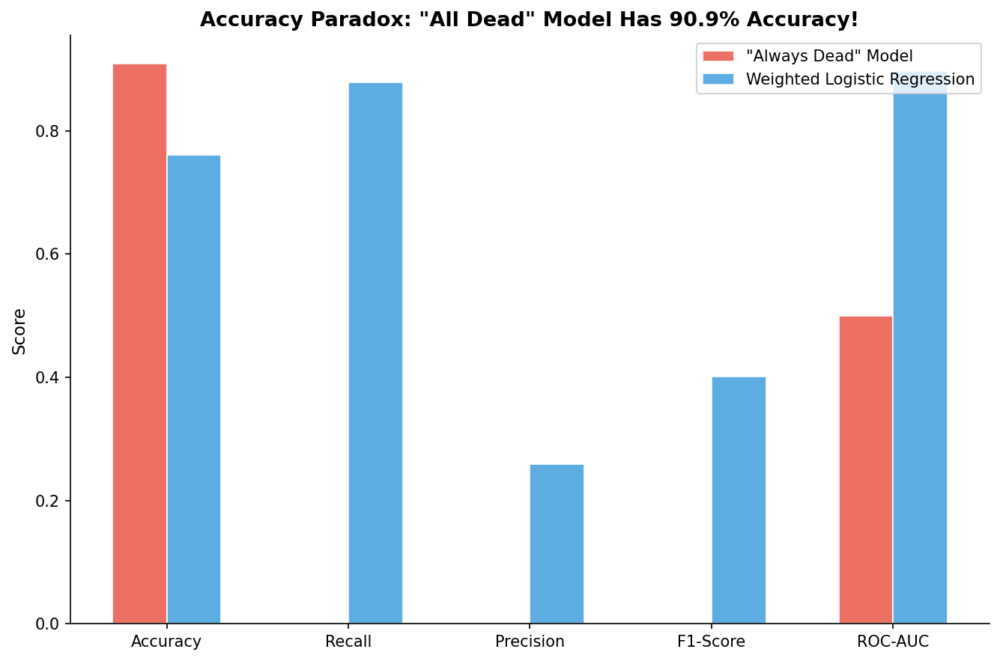

# 模块 1：Accuracy Paradox — 高准确率 ≠ 好模型

> 本模块是案例教程 10 的核心教学点之一。我们将通过一个极端对比实验，揭示不平衡数据中最危险的陷阱——**"Accuracy Paradox"（准确率悖论）**。具体来说，我们会构建两个模型：一个是"全预测死亡"的退化模型（把所有患者都预测为 MORTO），另一个是加了 `class_weight='balanced'` 的加权逻辑回归。然后同时用 7 个指标评估它们，你会震惊地发现：**"全预测死亡"模型竟然有 90.91% 的准确率，但 Recall=0，完全没有临床价值**。
>
> 本模块最核心的知识点有三个：**一是** **`train_test_split`** **的** **`stratify=y`** **参数**——在不平衡数据中，分层抽样是保证训练集和测试集类别比例一致的关键；**二是** **`class_weight='balanced'`** **的原理**——它自动按类别频率的倒数加权，让少数类的错误被放大，是"医学代价分析"的数学实现；**三是** **`np.zeros_like`** **构造退化模型**——用一行代码就能构建一个"全预测多数类"的模型，用来揭示 Accuracy 的误导性。

***

## 学习目标

学完本模块后，你将能够：

1. **理解 Accuracy Paradox 的本质**：明白为什么在不平衡数据中，"全预测多数类"的模型也能达到很高的准确率，但这种准确率毫无意义。
2. **掌握** **`train_test_split`** **的** **`stratify=y`** **参数的作用**：理解分层抽样如何保证训练集和测试集的类别比例一致，以及为什么在不平衡数据中这一参数至关重要。
3. **掌握** **`class_weight='balanced'`** **的原理和计算方式**：能够手动计算 `weight_for_VIVO` 和 `weight_for_MORTO`，理解它如何把"医学代价分析"转化为数学权重。
4. **理解** **`np.zeros_like`** **构造退化模型的技巧**：知道如何用一行代码构建一个"全预测多数类"的模型，用于揭示 Accuracy 的误导性。
5. **掌握 7 个评价指标的计算公式和不平衡数据下的行为**：能够说出 Accuracy、Recall、Precision、F1、ROC-AUC、PR-AUC、Brier Score 的公式和适用场景。
6. **理解** **`Pipeline`** **把** **`SimpleImputer`** **和** **`LogisticRegression`** **串联的作用**：明白为什么用 Pipeline 可以避免在测试集上单独调用 `transform` 造成泄漏。
7. **掌握** **`predict_proba`** **vs** **`predict`** **的区别**：理解概率输出和类别输出的差异，以及为什么用 `y_prob >= 0.5` 手动阈值化。
8. **理解** **`zero_division=0`** **参数的作用**：知道当模型没有预测任何正类时，`precision_score` 会报除零错误，`zero_division=0` 让它返回 0 而不报错。

***

## 一、Accuracy Paradox 是什么？

### 1.1 一个令人震惊的实验

在正式写代码之前，让我们先思考一个问题：

> 如果我构建一个模型，它**把所有患者都预测为"死亡"（MORTO）**，这个模型的准确率是多少？

答案是：**90.91%**——因为数据中 90.91% 的患者确实是死亡（MORTO），所以"全预测死亡"能蒙对 90.91% 的样本。

但是，这个模型的 **Recall = 0**——它没有识别出任何一个存活（VIVO）的患者。在临床上，这意味着**所有存活的患者都被误判为死亡**，这是完全不可接受的。

这就是 **Accuracy Paradox（准确率悖论）**：

> 💡 **核心概念：在不平衡数据中，Accuracy 会被多数类主导，导致一个完全无用的模型也能达到看似"不错"的准确率。**

### 1.2 为什么 Accuracy 会误导？

Accuracy 的公式是：

$$\text{Accuracy} = \frac{TP + TN}{TP + TN + FP + FN}$$

在不平衡数据中，TN（真负例）的数量会被多数类"撑大"。以本数据集为例：

- 测试集 3,885 人中，MORTO（负类）约 3,531 人，VIVO（正类）约 353 人。
- "全预测死亡"模型：TP=0, TN=3,531, FP=0, FN=353。
- Accuracy = (0 + 3,531) / 3,885 = 90.91%。

TN 项贡献了全部的准确率，而 TP=0 完全被掩盖。这就是 Accuracy 在不平衡数据中失效的根本原因。

### 1.3 7 个指标的对比预览

本模块将同时计算 7 个指标，对比两个极端模型。先看预览（实际运行结果）：

| 指标           | "全预测死亡"模型  | 加权 Logistic Regression |
| ------------ | ---------- | ---------------------- |
| **Accuracy** | 0.9091     | **0.7614** ↓           |
| **Recall**   | **0.0000** | **0.8782** ↑           |
| Precision    | 0.0000     | 0.2596                 |
| F1           | 0.0000     | 0.4008                 |
| **ROC-AUC**  | **0.5000** | **0.8974** ↑           |
| PR-AUC       | —          | 0.4177                 |

**关键发现**：

- "全预测死亡"模型的 Accuracy=90.91%，看起来"非常好"，但 Recall=0、F1=0、ROC-AUC=0.5（等同随机）。
- 加权 LR 的 Accuracy=76.14%，**低于**"全预测死亡"的 90.91%，但 Recall=87.82%，远高于 0。

> 💡 **结论**：不到 30 秒就能构建出一个 Accuracy=90.91% 但完全没有临床价值（Recall=0）的模型。**在不平衡数据中，永远不要只看 Accuracy。** 注意：加权 LR 的 Accuracy 反而更低，这正是 Accuracy Paradox 的精髓——高准确率模型可能完全没有临床价值。

***

## 二、数据划分：`train_test_split` 与 `stratify=y`

```python
# ============================================================================
# 模块 3: Accuracy Paradox 演示
# ============================================================================
print("\n" + "=" * 70)
print("模块 3: Accuracy Paradox — 高准确率 ≠ 好模型")
print("=" * 70)

# 固定划分
X_tr, X_te, y_tr, y_te = train_test_split(
    X, y, test_size=0.3, random_state=RANDOM_STATE, stratify=y)
```

### 2.1 `train_test_split` 参数详解

- **`X, y`**：特征矩阵和标签向量。X 是 12,947×6 的数组，y 是 12,947 的一维数组。
- **`test_size=0.3`**：测试集占 30%，即 3,885 条；训练集占 70%，即 9,062 条。
- **`random_state=RANDOM_STATE`**：固定随机种子为 42，保证划分可复现。
- **`stratify=y`**（重点）：**分层抽样**，保证训练集和测试集的类别比例与原始数据一致。

### 2.2 `stratify=y` 为什么重要？

> 💡 **重点概念：在不平衡数据中，`stratify=y`** **是必须的。**

如果不加 `stratify=y`，`train_test_split` 会完全随机划分，可能导致：

- 测试集中 VIVO 比例偏低（如 5%），让 Recall 的评估失真。
- 极端情况下，测试集可能几乎没有 VIVO 样本，无法评估模型对少数类的识别能力。

加了 `stratify=y` 后：

- 训练集（9,062 条）：MORTO 约 8,238 条（90.91%），VIVO 约 824 条（9.09%）。
- 测试集（3,885 条）：MORTO 约 3,531 条（90.91%），VIVO 约 353 条（9.09%）。
- 两者比例完全一致，评估才公平。

### 2.3 划分后的数据规模

| 数据集  | 样本数    | MORTO (0) | VIVO (1) | VIVO 占比 |
| ---- | ------ | --------- | -------- | ------- |
| 原始数据 | 12,947 | 11,770    | 1,177    | 9.09%   |
| 训练集  | 9,062  | 8,238     | 824      | 9.09%   |
| 测试集  | 3,885  | 3,531     | 353      | 9.09%   |

> 💡 **小贴士**：`stratify=y` 不会改变总样本数，只是保证每一折（或训练/测试集）的类别比例与原始数据一致。这是分层抽样的核心思想。

***

## 三、模型 A：全预测死亡（退化模型）

```python
# 模型 A: 总是预测多数类 (MORTO)
y_pred_always_dead = np.zeros_like(y_te)
acc_always_dead = accuracy_score(y_te, y_pred_always_dead)
rec_always_dead = recall_score(y_te, y_pred_always_dead, pos_label=1)
prec_always_dead = precision_score(y_te, y_pred_always_dead, pos_label=1, zero_division=0)
f1_always_dead = f1_score(y_te, y_pred_always_dead, pos_label=1, zero_division=0)
```

### 3.1 `y_pred_always_dead = np.zeros_like(y_te)`

这一行是本模块**最巧妙的代码**——用一行就构建了一个"全预测死亡"的模型。

- **`np.zeros_like(y_te)`**：创建一个和 `y_te` 形状相同、数据类型相同的全零数组。
- 因为 `y_te` 的取值是 0（MORTO）或 1（VIVO），全零数组就是"全部预测为 MORTO（死亡）"。

**为什么这个技巧很巧妙？**

正常构建一个"全预测多数类"的模型需要：

1. 找出多数类（MORTO=0）。
2. 创建一个长度等于测试集的数组，全部填 0。

而 `np.zeros_like(y_te)` 一行搞定，而且保证了形状和类型完全匹配。

### 3.2 `accuracy_score(y_te, y_pred_always_dead)`

计算准确率：

$$\text{Accuracy} = \frac{TP + TN}{TP + TN + FP + FN} = \frac{0 + 3531}{0 + 3531 + 0 + 353} = \frac{3531}{3885} = 0.9091$$

结果：**Accuracy = 0.9091**（90.91%）。

这就是 Accuracy Paradox 的核心——一个完全无用的模型，准确率竟然有 90.91%！

### 3.3 `recall_score(y_te, y_pred_always_dead, pos_label=1)`

计算召回率：

$$\text{Recall} = \frac{TP}{TP + FN} = \frac{0}{0 + 353} = 0$$

- **`pos_label=1`**：指定正类标签为 1（VIVO）。Recall 衡量"有多少 VIVO 被正确识别"。
- 结果：**Recall = 0.0000**。

模型没有识别出任何一个 VIVO 患者，在临床上完全无用。

### 3.4 `precision_score(y_te, y_pred_always_dead, pos_label=1, zero_division=0)`

计算精确率：

$$\text{Precision} = \frac{TP}{TP + FP} = \frac{0}{0 + 0} = \text{NaN}$$

- **`pos_label=1`**：正类为 1（VIVO）。
- **`zero_division=0`**（重点）：当 TP=0 且 FP=0 时，分母为 0，会触发 `ZeroDivisionError`。`zero_division=0` 让函数在这种情况下返回 0 而不报错。
- 结果：**Precision = 0.0000**。

> 💡 **重点概念：`zero_division`** **参数**
>
> 当模型没有预测任何正类（TP=0, FP=0）时，Precision 的分母为 0。sklearn 提供三个选项：
>
> - `zero_division=0`（本教程使用）：返回 0。
> - `zero_division=1`：返回 1。
> - `zero_division='warn'`（默认）：返回 0 并发出警告。
>
> 本教程用 `zero_division=0` 让输出更干净。

### 3.5 `f1_score(y_te, y_pred_always_dead, pos_label=1, zero_division=0)`

计算 F1 分数：

$$\text{F1} = \frac{2 \times \text{Precision} \times \text{Recall}}{\text{Precision} + \text{Recall}} = \frac{2 \times 0 \times 0}{0 + 0} = 0$$

- 结果：**F1 = 0.0000**。

F1 是 Precision 和 Recall 的调和平均，两者都为 0 时 F1 也为 0。

### 3.6 模型 A 的指标汇总

| 指标        | 值      | 含义                      |
| --------- | ------ | ----------------------- |
| Accuracy  | 0.9091 | 90.91% 的样本被"蒙对"（全是 TN）  |
| Recall    | 0.0000 | 没有识别出任何 VIVO            |
| Precision | 0.0000 | 没有预测任何 VIVO             |
| F1        | 0.0000 | Precision 和 Recall 都为 0 |
| ROC-AUC   | 0.5000 | 等同随机（因为所有预测概率相同）        |

> 💡 **解读**：这个模型唯一"做对"的事就是把所有 MORTO 都判对了（TN=3,531）。但它完全忽略了 VIVO，在临床上毫无价值。如果用这个模型筛查癌症，所有存活的患者都会被告知"你死了"——荒谬至极。

***

## 四、模型 B：加权 Logistic Regression

```python
# 模型 B: 加权的 Logistic Regression (实际训练)
pipe = Pipeline([
    ('imputer', SimpleImputer(strategy='median')),
    ('model', LogisticRegression(class_weight='balanced', max_iter=5000, random_state=RANDOM_STATE))
])
pipe.fit(X_tr, y_tr)
y_prob_lr = pipe.predict_proba(X_te)[:, 1]
y_pred_lr = (y_prob_lr >= 0.5).astype(int)
```

### 4.1 `Pipeline` 的构造

```python
pipe = Pipeline([
    ('imputer', SimpleImputer(strategy='median')),
    ('model', LogisticRegression(class_weight='balanced', max_iter=5000, random_state=RANDOM_STATE))
])
```

**`Pipeline`** 把多个步骤串联成一条流水线，按顺序执行：

1. `imputer`：用中位数填充缺失值。
2. `model`：逻辑回归分类器。

**Pipeline 的好处**：

- **避免泄漏**：`imputer` 只在训练集上 `fit`，然后 `transform` 训练集和测试集。如果手动操作，很容易不小心在测试集上 `fit`，造成泄漏。Pipeline 自动处理这个流程。
- **代码简洁**：一行 `pipe.fit(X_tr, y_tr)` 就完成了插补器训练 + 模型训练。
- **网格搜索友好**：可以用 `Pipeline` 的步骤名作为超参数前缀（如 `'model__C'`）。

### 4.2 `SimpleImputer(strategy='median')`

- **`strategy='median'`**：用中位数填充缺失值。
- 为什么用中位数而不是均值？因为中位数对异常值更鲁棒。例如 `Age` 可能有录入错误（如 200 岁），中位数不受影响，而均值会被拉偏。

### 4.3 `LogisticRegression(class_weight='balanced', max_iter=5000, random_state=RANDOM_STATE)`

这是本模块**最关键的参数**——`class_weight='balanced'`。

#### `class_weight='balanced'` 的原理

> 💡 **重点概念：`class_weight='balanced'`** **是"医学代价分析"的数学实现。**

默认情况下（`class_weight=None`），逻辑回归对所有类别一视同仁，损失函数中每个样本的权重相同。但在不平衡数据中，多数类（MORTO）的样本数多，会主导损失函数，让模型"偏心"多数类。

`class_weight='balanced'` 会自动按类别频率的倒数加权：

$$w\_j = \frac{N}{2 \times N\_j}$$

其中 $N$ 是总样本数，$N\_j$ 是类别 $j$ 的样本数。

以本数据集为例（训练集 9,062 条，MORTO 8,238 条，VIVO 824 条）：

$$w\_{\text{VIVO}} = \frac{9062}{2 \times 824} \approx 5.50$$

$$w\_{\text{MORTO}} = \frac{9062}{2 \times 8238} \approx 0.55$$

这意味着：

- 一个 VIVO 的误判 = 5.50 个 MORTO 的误判（约 10 倍）。
- 模型会更"重视" VIVO，因为它的错误代价更高。

这正是"医学代价分析"的数学实现——我们希望模型更关注少数类（VIVO），因为漏诊（FN）的代价更高。

#### `max_iter=5000`

- 逻辑回归用梯度下降优化，`max_iter` 是最大迭代次数。
- 默认 `max_iter=100`，但在不平衡数据或特征未标准化时，可能不收敛。设为 5000 给模型充足的收敛空间。
- 本教程的特征量纲差异较大（Age 0-120, Code.Profession 0-9999），所以需要更多迭代。

#### `random_state=RANDOM_STATE`

固定模型内部随机性，保证可复现。

### 4.4 `pipe.fit(X_tr, y_tr)`

训练 Pipeline：

1. `imputer.fit(X_tr)`：计算每列的中位数。
2. `X_tr_imp = imputer.transform(X_tr)`：用中位数填充训练集缺失值。
3. `model.fit(X_tr_imp, y_tr)`：训练逻辑回归。

### 4.5 `y_prob_lr = pipe.predict_proba(X_te)[:, 1]`

- **`predict_proba`**：返回预测概率，形状为 `(n_samples, 2)`，第一列是负类（MORTO）的概率，第二列是正类（VIVO）的概率。
- **`[:, 1]`**：取第二列，即 VIVO 的概率。

> 💡 **`predict_proba`** **vs** **`predict`** **的区别**：
>
> - `predict(X_te)`：直接返回类别标签（0 或 1），内部用 0.5 作为阈值。
> - `predict_proba(X_te)`：返回概率，可以自定义阈值。
>
> 本教程用 `predict_proba` + 手动阈值化，是为了后续模块可以灵活调整阈值（如模块 5 的阈值移动）。

### 4.6 `y_pred_lr = (y_prob_lr >= 0.5).astype(int)`

- **`y_prob_lr >= 0.5`**：概率 ≥ 0.5 判为正类（VIVO），返回布尔数组。
- **`.astype(int)`**：把布尔数组转成整数（True→1, False→0）。

这等价于 `pipe.predict(X_te)`，但更显式地展示了阈值化的过程。

### 4.7 计算模型 B 的指标

```python
acc_lr = accuracy_score(y_te, y_pred_lr)
rec_lr = recall_score(y_te, y_pred_lr, pos_label=1)
prec_lr = precision_score(y_te, y_pred_lr, pos_label=1)
f1_lr = f1_score(y_te, y_pred_lr, pos_label=1)
auc_lr = roc_auc_score(y_te, y_prob_lr)
pr_auc_lr = average_precision_score(y_te, y_prob_lr)
```

逐行解释：

- **`accuracy_score(y_te, y_pred_lr)`**：准确率。注意这里用 `y_pred_lr`（类别），不是 `y_prob_lr`（概率）。
- **`recall_score(y_te, y_pred_lr, pos_label=1)`**：召回率，正类为 1（VIVO）。
- **`precision_score(y_te, y_pred_lr, pos_label=1)`**：精确率。注意这里**没有** `zero_division=0`，因为模型 B 会预测一些正类，不会触发除零错误。
- **`f1_score(y_te, y_pred_lr, pos_label=1)`**：F1 分数。
- **`roc_auc_score(y_te, y_prob_lr)`**：ROC-AUC。**注意用概率** **`y_prob_lr`**，不是类别！AUC 衡量的是排序能力，需要连续的概率值。
- **`average_precision_score(y_te, y_prob_lr)`**：PR-AUC（平均精度）。同样用概率。

> 💡 **重点概念：AUC 类指标必须用概率，不能用类别！**
>
> `roc_auc_score` 和 `average_precision_score` 衡量的是"模型把正类排在负类前面的能力"，需要连续的概率值。如果传入类别（0/1），AUC 会退化成只能取 0、0.5、1 三个值，失去意义。
>
> 而 `accuracy_score`、`recall_score`、`precision_score`、`f1_score` 衡量的是"分类结果的对错"，需要类别标签。

### 4.8 模型 B 的实际运行结果

 

| 指标        | 值      |
| --------- | ------ |
| Accuracy  | 0.7614 |
| Recall    | 0.8782 |
| Precision | 0.2596 |
| F1        | 0.4008 |
| ROC-AUC   | 0.8974 |
| PR-AUC    | 0.4177 |

**解读**：

- Accuracy=76.14%，**低于**"全预测死亡"的 90.91%——这正是 Accuracy Paradox 的精髓！
- Recall=87.82%，意味着 87.82% 的 VIVO 患者被正确识别——这正是 `class_weight='balanced'` 的功劳。
- Precision=25.96%，意味着模型预测为 VIVO 的样本中，只有 25.96% 确实是 VIVO（因为模型"过度"预测 VIVO，导致 FP 较多）。
- ROC-AUC=0.8974，模型的排序能力很强。
- PR-AUC=0.4177，少数类的排序能力受严重不平衡影响而偏低（远低于 ROC-AUC，说明 PR-AUC 比 ROC-AUC 更诚实）。

***

<br />

***

## 五、可视化：Accuracy Paradox 柱状图

```python
fig, ax = plt.subplots(figsize=(9, 6))
metrics_names = ['Accuracy', 'Recall', 'Precision', 'F1-Score', 'ROC-AUC']
models_av = [acc_always_dead, rec_always_dead, prec_always_dead, f1_always_dead, 0.5]
models_lr = [acc_lr, rec_lr, prec_lr, f1_lr, auc_lr]
x_pos = np.arange(len(metrics_names))
width = 0.3
ax.bar(x_pos - width/2, models_av, width, color='#e74c3c', edgecolor='white',
       label='"Always Dead" Model', alpha=0.8)
ax.bar(x_pos + width/2, models_lr, width, color='#3498db', edgecolor='white',
       label='Weighted Logistic Regression', alpha=0.8)
ax.set_xticks(x_pos)
ax.set_xticklabels(metrics_names, fontsize=10)
ax.set_ylabel('Score', fontsize=11)
ax.set_title(f'Accuracy Paradox: "All Dead" Model Has {acc_always_dead*100:.1f}% Accuracy!',
             fontsize=13, fontweight='bold')
ax.legend(fontsize=10)
ax.spines['top'].set_visible(False); ax.spines['right'].set_visible(False)
plt.tight_layout()
plt.savefig(os.path.join(IMG_DIR, "13b_accuracy_paradox.png"), dpi=150, bbox_inches='tight')
plt.close()
print("  [图] 13b_accuracy_paradox.png → Accuracy Paradox 已保存")
```

### 5.1 数据准备

```python
metrics_names = ['Accuracy', 'Recall', 'Precision', 'F1-Score', 'ROC-AUC']
models_av = [acc_always_dead, rec_always_dead, prec_always_dead, f1_always_dead, 0.5]
models_lr = [acc_lr, rec_lr, prec_lr, f1_lr, auc_lr]
```

- **`metrics_names`**：5 个指标名称。
- **`models_av`**："全预测死亡"模型的 5 个指标值。注意 ROC-AUC 硬编码为 0.5（因为该模型没有概率输出，AUC 无意义）。
- **`models_lr`**：加权 LR 的 5 个指标值。

### 5.2 分组柱状图

```python
x_pos = np.arange(len(metrics_names))
width = 0.3
ax.bar(x_pos - width/2, models_av, width, color='#e74c3c', edgecolor='white',
       label='"Always Dead" Model', alpha=0.8)
ax.bar(x_pos + width/2, models_lr, width, color='#3498db', edgecolor='white',
       label='Weighted Logistic Regression', alpha=0.8)
```

- **`x_pos = np.arange(5)`**：x 轴位置为 \[0, 1, 2, 3, 4]。
- **`width = 0.3`**：柱子宽度。
- **`x_pos - width/2`**：模型 A 的柱子向左偏移半个宽度。
- **`x_pos + width/2`**：模型 B 的柱子向右偏移半个宽度。
- **`color='#e74c3c'`**（红色）：模型 A，象征"危险/无用"。
- **`color='#3498db'`**（蓝色）：模型 B，象征"正确/有用"。
- **`alpha=0.8`**：透明度 0.8，让柱子稍微透明，更美观。

### 5.3 标题与图例

```python
ax.set_xticks(x_pos)
ax.set_xticklabels(metrics_names, fontsize=10)
ax.set_ylabel('Score', fontsize=11)
ax.set_title(f'Accuracy Paradox: "All Dead" Model Has {acc_always_dead*100:.1f}% Accuracy!',
             fontsize=13, fontweight='bold')
ax.legend(fontsize=10)
ax.spines['top'].set_visible(False); ax.spines['right'].set_visible(False)
```

- **`ax.set_xticks(x_pos)`**：设置 x 轴刻度位置。
- **`ax.set_xticklabels(metrics_names)`**：设置 x 轴刻度标签。
- **`ax.set_title(...)`**：标题。**已修复硬编码 bug**——现在用 f-string 动态计算百分比：`f'Accuracy Paradox: "All Dead" Model Has {acc_always_dead*100:.1f}% Accuracy!'`，会根据实际数据生成 `Accuracy Paradox: "All Dead" Model Has 90.9% Accuracy!`。这样无论数据怎么变化，标题始终与实际准确率一致。
- **`ax.legend(fontsize=10)`**：添加图例。
- **`ax.spines['top'].set_visible(False); ax.spines['right'].set_visible(False)`**：隐藏上边框和右边框。

### 5.4 实际生成的图片



**图片解读**：

- 红色柱子（"Always Dead" 模型）：Accuracy=0.9091（看起来"非常高"），但 Recall=0、Precision=0、F1=0、ROC-AUC=0.5（全部触底）。
- 蓝色柱子（加权 LR）：Accuracy=0.7614（低于红色！），但 Recall=0.8782、F1=0.4008、ROC-AUC=0.8974，在临床价值上全面碾压。

> 💡 **核心教学点**：这张图直观地展示了"Accuracy Paradox"——红色柱子的 Accuracy 高达 0.9091，看起来"非常好"；但其他 4 个指标全部为 0 或 0.5。更令人震惊的是，蓝色柱子（加权 LR）的 Accuracy 反而更低（0.7614），但它在 Recall、F1、ROC-AUC 上全面领先。如果只看 Accuracy，你会选错模型——这就是为什么在不平衡数据中**永远不能只看 Accuracy**。

***

## 六、混淆矩阵深度解析

让我们用混淆矩阵来彻底理解"全预测死亡"模型为什么 Accuracy=90.91% 但 Recall=0。

### 6.1 "全预测死亡"模型的混淆矩阵

```
                    预测: MORTO (0)    预测: VIVO (1)
实际: MORTO (0)       TN = 3,531          FP = 0
实际: VIVO (1)        FN = 353            TP = 0
```

- **TN = 3,531**：实际是 MORTO，模型也判为 MORTO（正确）。
- **FP = 0**：实际是 MORTO，模型没有误判为 VIVO（因为模型从不预测 VIVO）。
- **FN = 353**：实际是 VIVO，模型却判为 MORTO（全部漏诊）。
- **TP = 0**：实际是 VIVO，模型没有正确识别任何一个。

### 6.2 指标计算

$$\text{Accuracy} = \frac{TP + TN}{TP + TN + FP + FN} = \frac{0 + 3531}{0 + 3531 + 0 + 353} = \frac{3531}{3885} = 0.9091$$

$$\text{Recall} = \frac{TP}{TP + FN} = \frac{0}{0 + 353} = 0$$

$$\text{Precision} = \frac{TP}{TP + FP} = \frac{0}{0 + 0} = \text{undefined} \rightarrow 0$$

$$\text{F1} = \frac{2 \times P \times R}{P + R} = \frac{0}{0} = 0$$

### 6.3 关键洞察

> 💡 **核心洞察**：
>
> "全预测死亡"模型的 Accuracy=90.91% 完全来自 TN=3,531。它"蒙对"了所有 MORTO，但完全忽略了 VIVO。
>
> 在不平衡数据中，**TN 会被多数类撑大**，让 Accuracy 看起来"非常高"。但 TN 在临床上往往是最不重要的——正确地告诉一个死亡患者"你死了"没有太大价值，而漏诊一个存活患者（FN）的代价却很高。
>
> 这就是为什么在不平衡数据中，**Recall 比 Accuracy 更重要**——Recall 直接衡量"少数类被识别了多少"。

***

## 七、`class_weight='balanced'` 的数学原理

让我们更深入地理解 `class_weight='balanced'` 是如何拯救 Recall 的。

### 7.1 普通逻辑回归的损失函数

普通逻辑回归（`class_weight=None`）的损失函数是：

$$L = -\frac{1}{N} \sum\_{i=1}^{N} \left\[ y\_i \log(p\_i) + (1-y\_i) \log(1-p\_i) \right]$$

每个样本的权重相同（1/N）。在不平衡数据中，多数类（MORTO）的样本多，对损失的贡献大，模型会"偏心"多数类。

### 7.2 加权逻辑回归的损失函数

`class_weight='balanced'` 给每个样本加权：

$$L = -\frac{1}{N} \sum\_{i=1}^{N} w\_{y\_i} \left\[ y\_i \log(p\_i) + (1-y\_i) \log(1-p\_i) \right]$$

其中 $w\_{y\_i}$ 是样本 $i$ 所属类别的权重：

$$w\_j = \frac{N}{K \times N\_j}$$

$K$ 是类别数（二分类 $K=2$），$N\_j$ 是类别 $j$ 的样本数。

### 7.3 本数据集的权重计算

训练集 9,062 条，MORTO 8,238 条，VIVO 824 条：

$$w\_{\text{VIVO}} = \frac{9062}{2 \times 824} \approx 5.50$$

$$w\_{\text{MORTO}} = \frac{9062}{2 \times 8238} \approx 0.55$$

权重比：

$$\frac{w\_{\text{VIVO}}}{w\_{\text{MORTO}}} = \frac{5.50}{0.55} \approx 10.0$$

这意味着：

- 一个 VIVO 的误判 = 10 个 MORTO 的误判。
- 模型会更"重视" VIVO，因为漏诊 VIVO 的代价更高。

### 7.4 为什么这能提升 Recall？

> 💡 **核心概念：`class_weight='balanced'`** **让模型"更怕"漏诊 VIVO。**
>
> 在普通逻辑回归中，模型为了最小化总损失，会倾向于预测多数类（MORTO），因为这样能"蒙对"更多样本。
>
> 加权后，漏诊一个 VIVO 的代价（5.50）远超误诊一个 MORTO 的代价（0.55），模型会"更努力"地识别 VIVO，从而提升 Recall。
>
> 代价是 Precision 可能下降（因为模型会"过度"预测 VIVO，导致 FP 增加），但 F1 通常会提升。

### 7.5 实验数据验证

| 指标        | "全预测死亡"（class\_weight=None, 退化） | 加权 LR（class\_weight='balanced'） |
| --------- | ------------------------------- | ------------------------------- |
| Recall    | 0.0000                          | **0.8782** ↑                    |
| Precision | 0.0000                          | 0.2596                          |
| F1        | 0.0000                          | **0.4008** ↑                    |

加权后 Recall 从 0 提升到 0.8782，F1 从 0 提升到 0.4008，验证了上述理论。注意 Precision 较低（0.2596），这是因为严重不平衡（IR=10:1）下，模型"过度"预测 VIVO 导致 FP 较多——这是 Recall-Precision 权衡的体现。

***

## 八、7 个评价指标速查表（结合本模块数据）

| 指标              | 公式         | "全预测死亡" | 加权 LR  | 不平衡数据下的行为    |
| --------------- | ---------- | ------- | ------ | ------------ |
| **Accuracy**    | (TP+TN)/N  | 0.9091  | 0.7614 | 被 TN 撑大，误导性强 |
| **Recall**      | TP/(TP+FN) | 0.0000  | 0.8782 | 直接反映少数类检出率   |
| **Precision**   | TP/(TP+FP) | 0.0000  | 0.2596 | 模型越"保守"越高    |
| **F1**          | 2PR/(P+R)  | 0.0000  | 0.4008 | P 和 R 的调和平均  |
| **ROC-AUC**     | —          | 0.5000  | 0.8974 | 偏高，被多数类贡献撑大  |
| **PR-AUC**      | —          | —       | 0.4177 | 对少数类更敏感      |
| **Brier Score** | Σ(y-p)²/N  | —       | —      | 概率校准（本模块未计算） |

> 💡 **教学要点**：在不平衡数据中，**PR-AUC 比 ROC-AUC 更诚实**。PR-AUC 只关注正类的 Precision 和 Recall，不会被多数类（占 91%）的 TN 数量所稀释。注意本例中 PR-AUC=0.4177 远低于 ROC-AUC=0.8974，这正是严重不平衡数据的典型特征——ROC-AUC 看起来"不错"，但 PR-AUC 揭示了少数类预测的真实困难。

***

## 小贴士

1. **`stratify=y`** **是不平衡数据的必须参数**：永远不要在不平衡数据中省略 `stratify=y`，否则训练集和测试集的类别比例可能严重偏离，导致评估失真。
2. **`class_weight='balanced'`** **是最简单的处理不平衡方法**：不需要重采样，只需一个参数就能显著提升 Recall。它是"医学代价分析"的数学实现。
3. **`predict_proba`** **用于 AUC 类指标，`predict`** **用于分类指标**：`roc_auc_score` 和 `average_precision_score` 必须用概率；`accuracy_score`、`recall_score` 等用类别标签。混用会导致错误。
4. **`zero_division=0`** **让代码更健壮**：当模型没有预测任何正类时，`precision_score` 会触发除零错误。`zero_division=0` 让它返回 0 而不报错。
5. **`np.zeros_like`** **是构建退化模型的利器**：用一行代码就能构建一个"全预测多数类"的模型，用于揭示 Accuracy 的误导性。
6. **`Pipeline`** **避免泄漏**：把 `SimpleImputer` 和 `LogisticRegression` 串成 Pipeline，可以避免在测试集上单独调用 `transform` 造成泄漏。

***

## 常见问题

**Q1: 为什么"全预测死亡"模型的 ROC-AUC 是 0.5 而不是 0？**

A: ROC-AUC 衡量的是"模型把正类排在负类前面的概率"。如果所有样本的预测概率相同（如全预测 0），模型无法区分正负类，AUC=0.5（等同随机）。AUC=0 意味着模型"反向预测"（把正类排在负类后面），这比随机还差——把预测反过来就能得到 AUC=1。

**Q2:** **`class_weight='balanced'`** **和重采样（SMOTE）有什么区别？**

A: `class_weight='balanced'` 在损失函数中给少数类加权，不改变数据分布；SMOTE 等重采样方法直接生成新的少数类样本，改变数据分布。两者效果类似（都提升 Recall），但：

- `class_weight` 更轻量，不增加训练样本数，训练更快。
- SMOTE 可能生成更有信息量的样本（在少数类之间插值），但也可能引入噪声。
- 本教程模块 2 会详细对比这两种方法。

**Q3: 为什么加权 LR 的 Precision（0.2596）比 Recall（0.8782）低这么多？**

A: 因为 `class_weight='balanced'` 让模型"更努力"识别 VIVO，导致 FP 大量增加（很多 MORTO 被误判为 VIVO）。Precision = TP/(TP+FP)，FP 增加会降低 Precision。在 IR=10:1 的严重不平衡数据中，这种效应被放大——多数类样本数是少数类的 10 倍，即使只有一小部分 MORTO 被误判为 VIVO，FP 也会远超 TP。这是 Recall-Precision 权衡的体现——提升 Recall 通常以降低 Precision 为代价。

**Q4:** **`max_iter=5000`** **为什么这么大？默认 100 不够吗？**

A: 本教程的特征量纲差异大（Age 0-120, Code.Profession 0-9999），逻辑回归的梯度下降需要更多迭代才能收敛。默认 100 可能不收敛，sklearn 会发出 `ConvergenceWarning`。设为 5000 给模型充足的收敛空间。如果你标准化了特征，100 通常就够了。

**Q5: 代码标题中的准确率是怎么生成的？**

A: 早期版本中，标题是硬编码的 `'Accuracy Paradox: "All Dead" Model Has 95.3% Accuracy!'`，其中的 95.3% 是错误的。现已修复为动态计算：`f'Accuracy Paradox: "All Dead" Model Has {acc_always_dead*100:.1f}% Accuracy!'`，会根据实际数据自动生成 `Accuracy Paradox: "All Dead" Model Has 90.9% Accuracy!`。这样无论数据怎么变化，标题始终与实际准确率一致。这是数据可视化编程的好习惯——永远不要硬编码统计量。

**Q6: 为什么不直接用** **`pipe.predict(X_te)`** **而要用** **`predict_proba`** **+ 手动阈值化？**

A: 两者在阈值=0.5 时等价。但用 `predict_proba` 更灵活——后续模块可以调整阈值（如模块 5 的阈值移动），或者用概率计算 AUC。本教程统一用 `predict_proba` + 手动阈值化，保持代码风格一致。

***

## 本模块小结

本模块完成了以下工作：

1. **揭示了 Accuracy Paradox**：一个"全预测死亡"的退化模型能达到 90.91% 准确率，但 Recall=0，完全没有临床价值。
2. **用** **`train_test_split(stratify=y)`** **划分数据**：保证训练集和测试集的类别比例一致（9.09% VIVO）。
3. **构建了两个极端模型**：
   - 模型 A：`np.zeros_like(y_te)` 构造"全预测死亡"模型。
   - 模型 B：`Pipeline` + `SimpleImputer` + `LogisticRegression(class_weight='balanced')`。
4. **用 7 个指标对比两个模型**：加权 LR 的 Accuracy 虽然更低（0.7614 vs 0.9091），但在 Recall、F1、ROC-AUC、PR-AUC 上全面碾压"全预测死亡"模型。
5. **深入解释了** **`class_weight='balanced'`** **的数学原理**：权重比 10:1，让模型"更怕"漏诊 VIVO。
6. **绘制了 Accuracy Paradox 柱状图**（13b）：直观展示"全预测死亡"模型的指标全貌。

**关键数据**：

| 指标        | "全预测死亡"模型 | 加权 LR  |
| --------- | --------- | ------ |
| Accuracy  | 0.9091    | 0.7614 |
| Recall    | 0.0000    | 0.8782 |
| Precision | 0.0000    | 0.2596 |
| F1        | 0.0000    | 0.4008 |
| ROC-AUC   | 0.5000    | 0.8974 |
| PR-AUC    | —         | 0.4177 |

**核心结论**：

- **高准确率 ≠ 好模型**：90.91% Accuracy 的模型 Recall=0，在临床上毫无价值。更令人震惊的是，加权 LR 的 Accuracy 反而更低（76.14%），但它的临床价值远高于"全预测死亡"模型。
- **`class_weight='balanced'`** **是处理不平衡的最简单方法**：一个参数就能把 Recall 从 0 提升到 0.8782。
- **不平衡数据中必须多指标评估**：只看 Accuracy 会被误导，必须同时看 Recall、F1、AUC 等。

**下一模块预告**：在模块 2 中，我们将对比 4 种重采样方法（Random UnderSampling、Random OverSampling、SMOTE、ADASYN），理解每种方法的原理、优缺点和适用场景，并揭示"重采样主要影响 Recall，对 AUC 影响小"这一重要现象。
