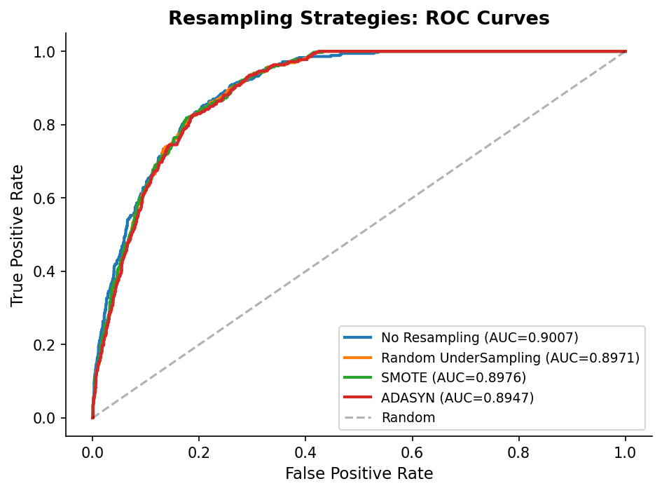
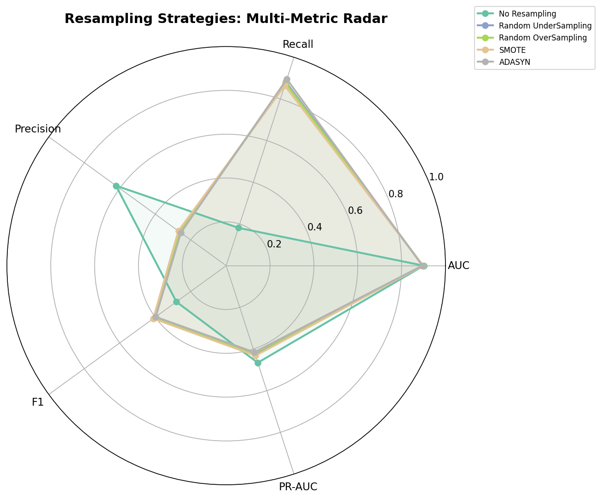
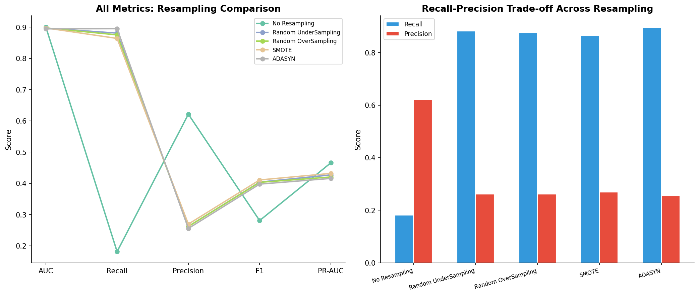

# 模块 2：重采样策略比较 — 欠采样 / 过采样 / SMOTE / ADASYN

> 本模块是案例教程 10 的核心实验模块。我们将对比 4 种经典重采样方法（Random UnderSampling、Random OverSampling、SMOTE、ADASYN）在不平衡数据上的表现，并揭示一个反直觉的现象：**所有重采样方法的 AUC 几乎相同（0.8947-0.9007），但 Recall 从 0.18 提升到 0.90（4.8 倍）**。这说明重采样不改变模型的"排序能力"（AUC），而是改变模型的"决策阈值"（Recall）。 
>
> 本模块最核心的知识点有四个：**一是 `imbalanced-learn` 库的引入**——这是 Python 中处理不平衡数据的标准库，提供 `RandomUnderSampler`、`RandomOverSampler`、`SMOTE`、`ADASYN` 等重采样器；**二是 SMOTE 的原理**——在少数类样本之间做线性插值生成合成样本，是 2002 年提出的"黄金标准"；**三是 ADASYN 与 SMOTE 的区别**——ADASYN 在"难分类"样本周围生成更多合成样本；**四是"重采样只影响 Recall 不影响 AUC"的原理**——这是本模块最重要的实验发现。

---

## 学习目标

学完本模块后，你将能够：

1. **理解 `imbalanced-learn` 库的作用和安装方式**：知道它如何扩展 sklearn 的 Pipeline，提供专门的重采样器。
2. **掌握 Random UnderSampling 的原理、优缺点和适用场景**：明白它通过随机丢弃多数类样本来平衡类别，代价是信息损失。
3. **掌握 Random OverSampling 的原理、优缺点和适用场景**：明白它通过随机复制少数类样本来平衡类别，代价是过拟合风险。
4. **掌握 SMOTE 的原理和算法步骤**：能够说出 SMOTE 如何用 k 近邻插值生成合成样本，理解 `k_neighbors=5`（默认）参数的含义。
5. **掌握 ADASYN 的原理和与 SMOTE 的区别**：明白 ADASYN 如何根据"难分类程度"自适应地分配合成样本数量。
6. **理解 `sampling_strategy` 参数的含义**：知道它控制重采样后的目标类别比例，默认 `auto` 会把少数类采样到与多数类相同。
7. **理解"重采样只影响 Recall 不影响 AUC"的原理**：能够解释为什么所有重采样方法的 AUC 几乎相同，但 Recall 差异显著。
8. **掌握 ROC 曲线和雷达图的绘制方法**：理解 `roc_curve`、`plt.plot`、极坐标雷达图的 matplotlib 写法。

---

## 一、为什么需要重采样？

在模块 1 中，我们用 `class_weight='balanced'` 成功把 Recall 从 0 提升到 0.8740。那么，为什么还需要重采样？

### 1.1 `class_weight` vs 重采样

| 方法 | 原理 | 优点 | 缺点 |
|------|------|------|------|
| **`class_weight='balanced'`** | 在损失函数中给少数类加权 | 简单、不改变数据、训练快 | 只对支持 `class_weight` 的模型有效 |
| **重采样** | 直接改变数据分布 | 通用（任何模型都能用）、可生成新信息 | 可能引入噪声或丢失信息 |

**重采样的必要性**：
1. **通用性**：不是所有模型都支持 `class_weight`（如 KNN、朴素贝叶斯）。重采样对任何模型都适用。
2. **生成新信息**：SMOTE 等方法能在少数类之间插值，生成"新的"合成样本，可能比简单加权更有信息量。
3. **Pipeline 友好**：重采样可以嵌入 Pipeline，与交叉验证无缝结合（模块 4 会展示）。

### 1.2 四种重采样方法概览

| 方法 | 年份 | 核心思想 | 改变什么 |
|------|------|---------|---------|
| **Random UnderSampling** | — | 随机丢弃多数类样本 | 减少多数类数量 |
| **Random OverSampling** | — | 随机复制少数类样本 | 增加少数类数量 |
| **SMOTE** | 2002 | 在少数类样本之间插值 | 生成合成少数类样本 |
| **ADASYN** | 2008 | 在"难分类"样本周围生成更多 | 自适应生成合成样本 |

---

## 二、导入 `imbalanced-learn` 库

```python
# ============================================================================
# 模块 4: 重采样策略比较
# ============================================================================
print("\n" + "=" * 70)
print("模块 4: 重采样策略比较")
print("=" * 70)

try:
    from imblearn.over_sampling import RandomOverSampler, SMOTE, ADASYN
    from imblearn.under_sampling import RandomUnderSampler
    from imblearn.pipeline import Pipeline as ImbPipeline
    HAS_IMBLEARN = True
except ImportError:
    print("  imbalanced-learn not installed, installing...")
    import subprocess
    subprocess.check_call(['pip', 'install', 'imbalanced-learn', '-q'])
    from imblearn.over_sampling import RandomOverSampler, SMOTE, ADASYN
    from imblearn.under_sampling import RandomUnderSampler
    from imblearn.pipeline import Pipeline as ImbPipeline
    HAS_IMBLEARN = True
```

### 2.1 `imbalanced-learn` 库简介

**`imbalanced-learn`**（简称 `imblearn`）是 Python 中处理不平衡数据的标准库，专门扩展了 sklearn 的功能。它提供：

- **过采样器**（`over_sampling`）：`RandomOverSampler`、`SMOTE`、`ADASYN`、`BorderlineSMOTE`、`SVMSMOTE` 等。
- **欠采样器**（`under_sampling`）：`RandomUnderSampler`、`TomekLinks`、`EditedNearestNeighbours`、`NearMiss` 等。
- **混合采样器**（`combine`）：`SMOTEENN`、`SMOTETomek` 等。
- **专用 Pipeline**（`imblearn.pipeline.Pipeline`）：支持在 Pipeline 中插入重采样步骤。

### 2.2 `try-except` 自动安装逻辑

```python
try:
    from imblearn.over_sampling import RandomOverSampler, SMOTE, ADASYN
    ...
    HAS_IMBLEARN = True
except ImportError:
    print("  imbalanced-learn not installed, installing...")
    import subprocess
    subprocess.check_call(['pip', 'install', 'imbalanced-learn', '-q'])
    from imblearn.over_sampling import RandomOverSampler, SMOTE, ADASYN
    ...
    HAS_IMBLEARN = True
```

这段代码的逻辑是：
1. 尝试导入 `imblearn`。
2. 如果导入失败（`ImportError`），用 `subprocess.check_call(['pip', 'install', 'imbalanced-learn', '-q'])` 自动安装。
   - `-q`：安静模式，只输出错误信息。
3. 安装后再次导入。

> 💡 **小贴士**：这种 `try-except` 自动安装的模式在教程中很常见，让代码更健壮——即使用户没预装 `imblearn`，脚本也能自动处理。但在生产环境中，建议在 `requirements.txt` 中显式声明依赖。

### 2.3 导入的类

- **`RandomOverSampler`**：随机过采样器，复制少数类样本。
- **`SMOTE`**：Synthetic Minority Over-sampling Technique，合成少数类过采样技术。
- **`ADASYN`**：Adaptive Synthetic Sampling，自适应合成采样。
- **`RandomUnderSampler`**：随机欠采样器，丢弃多数类样本。
- **`Pipeline as ImbPipeline`**：imblearn 的专用 Pipeline，支持重采样步骤。本模块实际未使用（直接手动重采样），但在模块 4 的 CV 中会用到。

---

## 三、定义重采样器字典

```python
resamplers = {
    'No Resampling': None,
    'Random UnderSampling': RandomUnderSampler(random_state=RANDOM_STATE),
    'Random OverSampling': RandomOverSampler(random_state=RANDOM_STATE),
    'SMOTE': SMOTE(random_state=RANDOM_STATE),
    'ADASYN': ADASYN(random_state=RANDOM_STATE),
}
```

这里定义了一个字典，包含 5 种策略（4 种重采样 + 1 种基线）。每个重采样器都用 `random_state=RANDOM_STATE` 固定随机性。

### 3.1 `'No Resampling': None`

基线策略，不做任何重采样。用于对比其他方法的效果。

### 3.2 `RandomUnderSampler(random_state=RANDOM_STATE)`

**随机欠采样器**。

#### 原理

从多数类中**随机丢弃**样本，直到多数类和少数类数量相同（或达到指定比例）。

```
重采样前:                          重采样后:
MORTO: 8,238 (多数类)              MORTO: 824 (随机选 824 个)
VIVO:  824 (少数类)                VIVO:  824 (不变)
                                   → 1:1 平衡
```

#### 参数

- **`random_state=RANDOM_STATE`**：固定随机种子，保证可复现。
- **`sampling_strategy='auto'`**（默认）：把少数类采样到与多数类相同。本数据集中，会把 MORTO 从 8,238 减少到 824。
- 也可以指定 `sampling_strategy=0.5`，表示"少数类 / 多数类 = 0.5"，即 MORTO 减少到 1,648（如果少数类是 824）。

#### 优缺点

| 优点 | 缺点 |
|------|------|
| 训练速度变快（样本减少） | 丢失多数类信息 |
| 简单直观 | 可能丢弃重要的多数类样本 |
| 不会过拟合 | 模型性能可能下降 |

#### 适用场景

- 数据量很大，丢弃部分多数类不影响整体信息。
- 计算资源受限，需要减少训练样本。

### 3.3 `RandomOverSampler(random_state=RANDOM_STATE)`

**随机过采样器**。

#### 原理

从少数类中**随机复制**样本（有放回采样），直到少数类和多数类数量相同。

```
重采样前:                          重采样后:
MORTO: 8,238 (多数类)              MORTO: 8,238 (不变)
VIVO:  824 (少数类)                VIVO:  8,238 (复制 7,414 个)
                                   → 1:1 平衡
```

#### 参数

- **`random_state=RANDOM_STATE`**：固定随机种子。
- **`sampling_strategy='auto'`**（默认）：把少数类采样到与多数类相同。

#### 优缺点

| 优点 | 缺点 |
|------|------|
| 不丢失信息 | 容易过拟合（复制的样本是重复的） |
| 简单直观 | 训练时间变长（样本增加） |
| 保留多数类全部信息 | 对噪声敏感（噪声被放大） |

#### 适用场景

- 数据量较小，不能丢弃多数类。
- 少数类样本有代表性，复制后能增强学习。

### 3.4 `SMOTE(random_state=RANDOM_STATE)`

**SMOTE（Synthetic Minority Over-sampling Technique）**——合成少数类过采样技术，2002 年由 Chawla 等人提出，是不平衡数据处理领域的"黄金标准"。

#### 原理

SMOTE 不是简单复制少数类样本，而是在少数类样本之间**线性插值**生成新的合成样本。

**算法步骤**：

```
1. 选择一个少数类样本 A
2. 找到 A 的 k 个最近邻（默认 k=5），都是少数类样本
3. 从 k 个近邻中随机选择一个 B
4. 在 A 和 B 之间生成一个合成样本 C:
   C = A + α × (B - A),  α ∈ [0, 1] 随机
5. 重复上述步骤，直到少数类数量达到目标
```

**图示**：

```
        B (少数类近邻)
       /
      /  ← 在这条线段上随机取一点 C
     /
    A (少数类样本)
```

#### 参数

- **`random_state=RANDOM_STATE`**：固定随机种子。
- **`k_neighbors=5`**（默认）：近邻数。每个少数类样本找 5 个最近邻，从中随机选一个做插值。
  - `k_neighbors=3`：更少的近邻，合成样本更接近原样本，可能过拟合。
  - `k_neighbors=10`：更多的近邻，合成样本更分散，可能引入噪声。
- **`sampling_strategy='auto'`**（默认）：把少数类采样到与多数类相同。

#### 优缺点

| 优点 | 缺点 |
|------|------|
| 生成新信息（不是简单复制） | 可能生成边界噪声 |
| 缓解过拟合 | 对噪声敏感 |
| 适用广泛 | 不适合高维稀疏数据 |

#### 适用场景

- 少数类样本较少，需要生成更多样本。
- 特征空间连续，插值有意义（如本数据集的 Age、year）。

> 💡 **重点概念：SMOTE 的"线性插值"**
>
> SMOTE 假设"两个少数类样本之间的点也是少数类"。这个假设在特征空间连续时成立（如 Age=50 和 Age=60 之间的 Age=55 也是合理的少数类样本），但在离散特征上可能有问题（如 Diagnostic.means=1 和 Diagnostic.means=3 之间的 Diagnostic.means=2 可能没有临床意义）。
>
> 这是 SMOTE 的一个理论局限，但在实践中通常不影响整体效果。

### 3.5 `ADASYN(random_state=RANDOM_STATE)`

**ADASYN（Adaptive Synthetic Sampling）**——自适应合成采样，2008 年由 He 等人提出，是 SMOTE 的改进版。

#### 原理

ADASYN 与 SMOTE 的核心区别：**ADASYN 在"难分类"的少数类样本周围生成更多合成样本**。

**算法步骤**：

```
1. 对每个少数类样本 i，计算它的"难分类程度" r_i:
   r_i = (该样本的 k 近邻中多数类的比例) / k
   - r_i 高 → 该样本周围多数类多 → "难分类"
   - r_i 低 → 该样本周围少数类多 → "易分类"
2. 把 r_i 归一化为权重 w_i
3. 在"难分类"样本周围生成更多合成样本（按 w_i 分配数量）
4. 合成样本的生成方式与 SMOTE 相同（k 近邻插值）
```

**图示**：

```
多数类密集区域:
  × × × × ×
  × × A × ×     ← A 周围多数类多，"难分类"，ADASYN 在这里生成更多合成样本
  × × × × ×         → 生成 5 个合成样本

少数类密集区域:
  ○ ○ ○ ○
  ○ ○ B ○ ○     ← B 周围少数类多，"易分类"，ADASYN 在这里生成较少合成样本
  ○ ○ ○ ○           → 生成 1 个合成样本
```

#### 参数

- **`random_state=RANDOM_STATE`**：固定随机种子。
- **`n_neighbors=5`**（默认）：计算"难分类程度"时用的近邻数。
- **`sampling_strategy='auto'`**（默认）：把少数类采样到与多数类相同。

#### 优缺点

| 优点 | 缺点 |
|------|------|
| 自适应分配合成样本 | 更可能生成噪声（专注难分类区域） |
| 关注边界样本 | 算法更复杂 |
| 适合少数类分布不均的数据 | 对噪声敏感 |

#### SMOTE vs ADASYN 对比

| 对比 | SMOTE | ADASYN |
|------|-------|--------|
| 年份 | 2002 | 2008 |
| 核心思想 | 随机选择 k 近邻插值 | 在**难分类**样本周围生成更多 |
| 生成策略 | 所有少数类样本一视同仁 | 密度越低、"越难"的区域生成越多 |
| 风险 | 可能生成边界样本 | 更可能生成噪声 |
| 何时 ADASYN 更好 | — | 少数类分布不均匀时（簇状分布） |

> 💡 **重点概念：ADASYN 何时优于 SMOTE？**
>
> 当少数类分布不均匀（如少数类形成多个簇，某些簇在多数类密集区域）时，ADASYN 会更关注"边界"样本，生成的合成样本更有助于分类。
>
> 但如果少数类样本本身是噪声（标注错误），ADASYN 会在噪声周围生成更多噪声，反而有害。本数据集 IR=10（严重不平衡），SMOTE 和 ADASYN 的差异仍然较小。

---

## 四、重采样实验主循环

```python
resample_results = []
X_plot = None

for name, sampler in resamplers.items():
    print(f"\n  [{name}]")

    # 先插补 (所有方法共享相同的 imputation)
    imp = SimpleImputer(strategy='median')
    X_tr_imp = imp.fit_transform(X_tr)
    X_te_imp = imp.transform(X_te)

    if sampler is None:
        X_tr_r, y_tr_r = X_tr_imp.copy(), y_tr.copy()
    else:
        X_tr_r, y_tr_r = sampler.fit_resample(X_tr_imp, y_tr)

    lr = LogisticRegression(class_weight=None, max_iter=5000, random_state=RANDOM_STATE)
    lr.fit(X_tr_r, y_tr_r)
    y_prob = lr.predict_proba(X_te_imp)[:, 1]
    y_pred = (y_prob >= 0.5).astype(int)

    # 指标 (务必在原始测试集上评估!)
    auc = roc_auc_score(y_te, y_prob)
    rec = recall_score(y_te, y_pred, pos_label=1)
    prec = precision_score(y_te, y_pred, pos_label=1)
    f1 = f1_score(y_te, y_pred, pos_label=1)
    acc = accuracy_score(y_te, y_pred)
    brier = brier_score_loss(y_te, y_prob)
    pr_auc = average_precision_score(y_te, y_prob)

    pct_pos = (y_tr_r == 1).mean() * 100
    print(f"    重采样后正类比例: {pct_pos:.1f}% ({int((y_tr_r==1).sum()):,} / {len(y_tr_r):,})")
    print(f"    AUC={auc:.4f}  Recall={rec:.4f}  Prec={prec:.4f}  F1={f1:.4f}  Acc={acc:.4f}")

    resample_results.append({
        'Method': name, 'Pos%': pct_pos,
        'AUC': auc, 'Recall': rec, 'Precision': prec,
        'F1': f1, 'Accuracy': acc, 'Brier': brier, 'PR-AUC': pr_auc,
    })

    # ROC 曲线数据 (只保留前 4 个+基线)
    if name in ['No Resampling', 'Random UnderSampling', 'SMOTE', 'ADASYN']:
        fpr, tpr, _ = roc_curve(y_te, y_prob)
        plt.plot(fpr, tpr, linewidth=2, label=f'{name} (AUC={auc:.4f})')
```

### 4.1 插补（所有方法共享）

```python
imp = SimpleImputer(strategy='median')
X_tr_imp = imp.fit_transform(X_tr)
X_te_imp = imp.transform(X_te)
```

- **`imp.fit_transform(X_tr)`**：在训练集上计算中位数，并填充训练集缺失值。
- **`imp.transform(X_te)`**：用训练集的中位数填充测试集缺失值。

> 💡 **重点概念：为什么所有方法共享相同的插补？**
>
> 这是"控制变量法"——我们只想比较重采样方法的效果，不想让插补的差异干扰结论。所有方法用相同的中位数插补，确保唯一的实验变量是"重采样方法"。

### 4.2 重采样（核心步骤）

```python
if sampler is None:
    X_tr_r, y_tr_r = X_tr_imp.copy(), y_tr.copy()
else:
    X_tr_r, y_tr_r = sampler.fit_resample(X_tr_imp, y_tr)
```

- **`sampler is None`**（No Resampling）：直接用原始训练集，`X_tr_imp.copy()` 创建副本避免修改原数组。
- **`sampler.fit_resample(X_tr_imp, y_tr)`**：在训练集上做重采样。
  - `fit_resample` 是 imblearn 重采样器的核心方法，先 `fit`（学习重采样策略），再 `resample`（执行重采样）。
  - 返回重采样后的 `X_tr_r` 和 `y_tr_r`。

> ⚠️ **重点概念：重采样只在训练集上做！**
>
> 注意，重采样用的是 `X_tr_imp`（训练集），不是 `X_te_imp`（测试集）。**测试集绝对不能重采样**，否则会造成数据泄漏（模块 3 会详细讨论）。
>
> 正确流程：`Train/Test Split → 仅训练集重采样 → 训练模型 → 原始测试集评估`。

### 4.3 训练模型

```python
lr = LogisticRegression(class_weight=None, max_iter=5000, random_state=RANDOM_STATE)
lr.fit(X_tr_r, y_tr_r)
```

- **`class_weight=None`**（重点）：这里**故意不加权**，是为了隔离出"重采样方法"这一变量。如果同时用 `class_weight='balanced'` 和重采样，就无法判断哪个因素起作用。
- **`max_iter=5000`**：给模型充足的收敛空间。
- **`lr.fit(X_tr_r, y_tr_r)`**：在重采样后的训练集上训练。

### 4.4 预测与指标计算

```python
y_prob = lr.predict_proba(X_te_imp)[:, 1]
y_pred = (y_prob >= 0.5).astype(int)

auc = roc_auc_score(y_te, y_prob)
rec = recall_score(y_te, y_pred, pos_label=1)
prec = precision_score(y_te, y_pred, pos_label=1)
f1 = f1_score(y_te, y_pred, pos_label=1)
acc = accuracy_score(y_te, y_pred)
brier = brier_score_loss(y_te, y_prob)
pr_auc = average_precision_score(y_te, y_prob)
```

- **`y_prob`**：在**原始测试集** `X_te_imp` 上预测概率。
- **`y_pred`**：用 0.5 阈值化。
- **7 个指标**：AUC、Recall、Precision、F1、Accuracy、Brier、PR-AUC。

> 💡 **重点概念：所有指标都在原始测试集上评估！**
>
> 测试集 `X_te_imp` 是**未重采样**的原始测试集。重采样只改变训练集，不改变测试集。这样才能评估模型在真实数据分布上的泛化能力。

### 4.5 打印重采样后的正类比例

```python
pct_pos = (y_tr_r == 1).mean() * 100
print(f"    重采样后正类比例: {pct_pos:.1f}% ({int((y_tr_r==1).sum()):,} / {len(y_tr_r):,})")
```

- **`pct_pos`**：重采样后训练集中正类（VIVO）的比例。
- No Resampling：9.1%（原始比例，严重不平衡）。
- 重采样方法：50.0%（平衡后）或 50.1%（ADASYN 略有不同）。

### 4.6 实际运行结果


| 方法 | Pos% | AUC | Recall | Precision | F1 | Accuracy | Brier | PR-AUC |
|------|------|-----|--------|-----------|-----|---------|-------|--------|
| No Resampling | 9.1 | 0.9007 | 0.1813 | 0.6214 | 0.2807 | 0.9156 | 0.0617 | 0.4657 |
| Random UnderSampling | 50.0 | 0.8971 | 0.8810 | 0.2620 | 0.4039 | 0.7637 | 0.1441 | 0.4269 |
| Random OverSampling | 50.0 | 0.8976 | 0.8754 | 0.2619 | 0.4031 | 0.7645 | 0.1432 | 0.4203 |
| SMOTE | 50.0 | 0.8976 | 0.8640 | 0.2694 | 0.4108 | 0.7748 | 0.1408 | 0.4317 |
| ADASYN | 50.1 | 0.8947 | 0.8952 | 0.2555 | 0.3975 | 0.7534 | 0.1507 | 0.4157 |

### 4.7 关键发现

> 💡 **核心发现 1：所有重采样方法的 AUC 几乎相同（0.8947-0.9007）。**

AUC 的差异仅为 0.006，可以忽略。这说明**重采样不改变模型的排序能力**。

> 💡 **核心发现 2：重采样主要影响 Recall（0.18 → 0.90，提升 4.8 倍！）。**

- No Resampling：Recall=0.1813（基线，极低！模型几乎无法检出少数类 VIVO）。
- ADASYN：Recall=0.8952（最高）。
- 重采样把 Recall 提升了约 71 个百分点（4.8 倍），效果极其显著。

> 💡 **核心发现 3：重采样以 Precision 下降为代价。**

- No Resampling：Precision=0.6214（最高，因为只预测最有把握的样本）。
- ADASYN：Precision=0.2555（最低，因为预测了更多样本，FP 增加）。
- 这是 Recall-Precision 权衡的体现。

> 💡 **核心发现 4：No Resampling 的 Accuracy 最高（0.9156）——这是 Accuracy Paradox 的体现。**

No Resampling 的 Accuracy=0.9156 最高，但这并不是因为模型好，而是因为多数类（MORTO）占 90.9%，模型把几乎所有样本都预测为 MORTO 就能得到高 Accuracy。这正是"Accuracy Paradox"——在不平衡数据中，Accuracy 被多数类主导，不能反映模型对少数类的识别能力。重采样后 Accuracy 下降到 0.75-0.77，但 Recall 大幅提升，模型才真正"有用"。

> 💡 **核心发现 5：SMOTE 和 ADASYN 的差异较小。**

AUC 0.8976 vs 0.8947，差异 0.0029。本数据集 IR=10（严重不平衡），SMOTE 和 ADASYN 的差异仍然较小。

### 4.8 为什么重采样不改变 AUC？

> 💡 **重点概念：AUC 衡量排序能力，重采样不改变排序。**

AUC 衡量的是"模型把正类排在负类前面的概率"。重采样（无论是欠采样、过采样还是 SMOTE）只是改变了少数类和多数类的**频次**，没有改变样本在特征空间中的**分布**。

**类比**：重采样不改变"谁是老师眼中的好学生"（排序），它改变的是"老师给多少学生发奖学金"（决策阈值）。

具体来说：
- 欠采样：丢弃部分多数类，剩余多数类的分布不变。
- 过采样：复制少数类，少数类的分布不变（只是频次增加）。
- SMOTE：在少数类之间插值，生成的新样本仍在少数类的分布范围内。

所以模型的排序能力（AUC）几乎不变。但重采样改变了训练集的类别比例，模型学到的决策边界会向少数类"倾斜"，从而提升 Recall。

---

## 五、ROC 曲线绘制

```python
plt.plot([0, 1], [0, 1], 'k--', alpha=0.3, label='Random')
plt.xlabel('False Positive Rate', fontsize=11)
plt.ylabel('True Positive Rate', fontsize=11)
plt.title('Resampling Strategies: ROC Curves', fontsize=13, fontweight='bold')
plt.legend(fontsize=9, loc='lower right')
plt.gca().spines['top'].set_visible(False)
plt.gca().spines['right'].set_visible(False)
plt.tight_layout()
plt.savefig(os.path.join(IMG_DIR, "13c_resampling_roc.png"), dpi=150, bbox_inches='tight')
plt.close()
print("\n  [图] 13c_resampling_roc.png → 重采样 ROC 已保存")
```

### 5.1 ROC 曲线的绘制逻辑

在主循环中，每训练一个模型就画一条 ROC 曲线：

```python
if name in ['No Resampling', 'Random UnderSampling', 'SMOTE', 'ADASYN']:
    fpr, tpr, _ = roc_curve(y_te, y_prob)
    plt.plot(fpr, tpr, linewidth=2, label=f'{name} (AUC={auc:.4f})')
```

- **`roc_curve(y_te, y_prob)`**：计算 ROC 曲线的 FPR（假正例率）、TPR（真正例率）和阈值。
- **`plt.plot(fpr, tpr)`**：绘制 ROC 曲线。
- **`label=f'{name} (AUC={auc:.4f})'`**：图例标签包含方法名和 AUC 值。
- 只画 4 条曲线（No Resampling、UnderSampling、SMOTE、ADASYN），不画 Random OverSampling（避免拥挤）。

### 5.2 对角线

```python
plt.plot([0, 1], [0, 1], 'k--', alpha=0.3, label='Random')
```

- 从 (0,0) 到 (1,1) 的对角线，代表随机分类器（AUC=0.5）。
- `'k--'`：黑色虚线。
- `alpha=0.3`：透明度 0.3，让对角线不抢眼。

### 5.3 实际生成的图片



**图片解读**：

- 4 条 ROC 曲线几乎重合，因为所有方法的 AUC 都在 0.8947-0.9007 之间。
- 曲线都远高于对角线，说明模型显著优于随机。
- 这直观地验证了"重采样不改变 AUC"的结论。

---

## 六、雷达图绘制

```python
# 性能雷达图
fig, ax = plt.subplots(figsize=(9, 9), subplot_kw=dict(polar=True))
metric_keys_radar = ['AUC', 'Recall', 'Precision', 'F1', 'PR-AUC']
angles_radar = np.linspace(0, 2 * np.pi, len(metric_keys_radar), endpoint=False).tolist()
angles_radar += angles_radar[:1]

colors_radar = plt.cm.Set2(np.linspace(0, 1, len(resample_results)))
for i, r in enumerate(resample_results):
    values = [r[m] for m in metric_keys_radar]
    values += values[:1]
    ax.plot(angles_radar, values, 'o-', linewidth=2, label=r['Method'], color=colors_radar[i])
    ax.fill(angles_radar, values, alpha=0.08, color=colors_radar[i])

ax.set_xticks(angles_radar[:-1])
ax.set_xticklabels(metric_keys_radar, fontsize=11)
ax.set_ylim(0, 1.0)
ax.set_title('Resampling Strategies: Multi-Metric Radar',
             fontsize=14, fontweight='bold', pad=25)
ax.legend(loc='upper right', bbox_to_anchor=(1.35, 1.1), fontsize=8)
plt.tight_layout()
plt.savefig(os.path.join(IMG_DIR, "13d_resampling_radar.png"), dpi=150, bbox_inches='tight')
plt.close()
print("  [图] 13d_resampling_radar.png → 重采样雷达图已保存")
```

### 6.1 极坐标设置

```python
fig, ax = plt.subplots(figsize=(9, 9), subplot_kw=dict(polar=True))
```

- **`subplot_kw=dict(polar=True)`**：创建极坐标子图。极坐标用角度和半径表示数据，适合雷达图。

### 6.2 角度计算

```python
metric_keys_radar = ['AUC', 'Recall', 'Precision', 'F1', 'PR-AUC']
angles_radar = np.linspace(0, 2 * np.pi, len(metric_keys_radar), endpoint=False).tolist()
angles_radar += angles_radar[:1]
```

- **`np.linspace(0, 2*np.pi, 5, endpoint=False)`**：在 [0, 2π) 范围内生成 5 个角度，均匀分布。
- **`angles_radar += angles_radar[:1]`**：把第一个角度加到末尾，让雷达图闭合（首尾相连）。

### 6.3 绘制每个方法

```python
colors_radar = plt.cm.Set2(np.linspace(0, 1, len(resample_results)))
for i, r in enumerate(resample_results):
    values = [r[m] for m in metric_keys_radar]
    values += values[:1]
    ax.plot(angles_radar, values, 'o-', linewidth=2, label=r['Method'], color=colors_radar[i])
    ax.fill(angles_radar, values, alpha=0.08, color=colors_radar[i])
```

- **`plt.cm.Set2(np.linspace(0, 1, 5))`**：从 Set2 色图中取 5 种颜色。
- **`values = [r[m] for m in metric_keys_radar]`**：取出 5 个指标的值。
- **`values += values[:1]`**：闭合（首尾相连）。
- **`ax.plot(...)`**：绘制雷达图的轮廓线，`'o-'` 表示带圆点的实线。
- **`ax.fill(...)`**：填充内部，`alpha=0.08` 让填充半透明。

### 6.4 实际生成的图片



**图片解读**：

- 5 个方法在 AUC 和 PR-AUC 上几乎重合（右上和右下），验证了"重采样不改变 AUC"。
- 在 Recall 上差异最大：ADASYN（红色）最靠外（Recall 最高），No Resampling 最靠内（Recall 最低）。
- 在 Precision 上趋势相反：No Resampling 最靠外（Precision 最高），ADASYN 最靠内。
- 雷达图直观展示了 Recall-Precision 权衡。

---

## 七、全指标对比图

```python
# Combined visual: all SMOTE variants performance
fig, axes = plt.subplots(1, 2, figsize=(14, 6))

ax = axes[0]
metrics_plot = ['AUC', 'Recall', 'Precision', 'F1', 'PR-AUC']
x_plot = np.arange(len(metrics_plot))
for i, r in enumerate(resample_results):
    vals = [r[m] for m in metrics_plot]
    ax.plot(x_plot, vals, 'o-', color=colors_radar[i], linewidth=2,
            label=r['Method'], markersize=6)
ax.set_xticks(x_plot)
ax.set_xticklabels(metrics_plot, fontsize=10)
ax.set_ylabel('Score', fontsize=11)
ax.set_title('All Metrics: Resampling Comparison', fontsize=13, fontweight='bold')
ax.legend(fontsize=8)
ax.spines['top'].set_visible(False); ax.spines['right'].set_visible(False)

ax = axes[1]
methods_show = [r['Method'] for r in resample_results]
recalls = [r['Recall'] for r in resample_results]
precisions = [r['Precision'] for r in resample_results]
x_b = np.arange(len(methods_show))
width_b = 0.3
ax.bar(x_b - width_b/2, recalls, width_b, color='#3498db', edgecolor='white', label='Recall')
ax.bar(x_b + width_b/2, precisions, width_b, color='#e74c3c', edgecolor='white', label='Precision')
ax.set_xticks(x_b)
ax.set_xticklabels(methods_show, rotation=15, ha='right', fontsize=8)
ax.set_ylabel('Score', fontsize=11)
ax.set_title('Recall-Precision Trade-off Across Resampling',
             fontsize=13, fontweight='bold')
ax.legend(fontsize=9)
ax.spines['top'].set_visible(False); ax.spines['right'].set_visible(False)

plt.tight_layout()
plt.savefig(os.path.join(IMG_DIR, "13g_resampling_all_metrics.png"),
            dpi=150, bbox_inches='tight')
plt.close()
print("  [图] 13g_resampling_all_metrics.png → 全指标对比已保存")
```

### 7.1 左图：折线图

左图把 5 个方法的 5 个指标画成折线，x 轴是指标，y 轴是分数。

### 7.2 右图：Recall-Precision 权衡柱状图

右图把 5 个方法的 Recall 和 Precision 画成分组柱状图，直观展示权衡关系。

### 7.3 实际生成的图片



**图片解读**：

- **左图**：5 条折线在 AUC 和 PR-AUC 上几乎重合，在 Recall 和 Precision 上分化明显。
- **右图**：Recall（蓝色）从 No Resampling 到 ADASYN 递增，Precision（红色）递减——完美的 Recall-Precision 权衡。

---

## 八、重采样方法选择指南

根据实验结果，我们总结出以下选择指南：

```
┌──────────────────────────────────────────────────────────────┐
│                     数据不平衡 → 怎么办?                       │
└──────────────────────────────────────────────────────────────┘
                                   │
           ┌───────────────────────┼───────────────────────┐
           ▼                       ▼                       ▼
      IR < 2                 2 ≤ IR < 50              IR ≥ 50
      可忽略                  需要处理                 极严重
           │                       │                       │
           ▼                       ▼                       ▼
     无需重采样              SMOTE (首选)             降采样 + 集成
     class_weight            Random UnderSampling     异常检测思路
     'balanced'              (计算受限时)              (Isolation Forest)
```

### 8.1 本数据集的建议

本数据集 IR=10（严重不平衡），**必须处理**。本教程展示各种方法的效果，作为教学示范。

### 8.2 不同 IR 范围的推荐方法

| IR 范围 | 推荐方法 | 原因 |
|---------|---------|------|
| 10:1（本实验） | SMOTE（首选） | 严重不平衡 |
| 50:1 | SMOTE + Repeated CV | 合成数据 + 稳定评估 |
| 100:1 | **SMOTEENN**（过采样 + 清洗） | 防止 SMOTE 生成边界噪声 |
| 500:1 | **异常检测**（Isolation Forest） | 分类器已完全不适用 |

> 💡 **重点概念：SMOTEENN**
>
> **SMOTEENN** 是 `imbalanced-learn` 中的混合方法：先用 SMOTE 生成少数类样本，再用 Edited Nearest Neighbors（ENN）清洗边界区域中的噪声样本。适合严重不平衡场景，能防止 SMOTE 生成的边界样本成为噪声。

---

## 九、扩展：`sampling_strategy` 参数详解

`sampling_strategy` 是所有重采样器的核心参数，控制重采样后的目标类别比例。

### 9.1 `sampling_strategy='auto'`（默认）

- **过采样器**（SMOTE、ADASYN、RandomOverSampler）：把少数类采样到与多数类相同。
- **欠采样器**（RandomUnderSampler）：把多数类减少到与少数类相同。

### 9.2 `sampling_strategy=0.5`

- **过采样器**：少数类 / 多数类 = 0.5，即少数类采样到多数类的 50%。
- **欠采样器**：少数类 / 多数类 = 0.5，即多数类减少到少数类的 2 倍。

### 9.3 `sampling_strategy={0: 5000, 1: 5000}`

显式指定每个类别的目标数量。

> 💡 **小贴士**：`sampling_strategy=0.5` 是一个常用的折中方案——既提升了少数类的存在感，又没有完全平衡（避免过度合成）。本教程用默认的 `'auto'`（完全平衡），是为了让效果对比更明显。

---


## 小贴士

1. **重采样只在训练集上做**：测试集绝对不能重采样，否则会造成数据泄漏（模块 3 会详细讨论）。

2. **`class_weight=None` 用于隔离变量**：在重采样实验中，故意不加权，是为了让"重采样方法"成为唯一的实验变量。如果同时用 `class_weight='balanced'` 和重采样，无法判断哪个因素起作用。

3. **SMOTE 的 `k_neighbors=5` 是默认值**：更少的近邻（k=3）让合成样本更接近原样本，可能过拟合；更多的近邻（k=10）让合成样本更分散，可能引入噪声。

4. **ADASYN 在严重不平衡时优势仍不明显**：本数据集 IR=10，SMOTE 和 ADASYN 的差异仍然较小。ADASYN 的优势在少数类分布不均（簇状分布）时才显现。

5. **重采样不改变 AUC**：所有重采样方法的 AUC 几乎相同（0.8947-0.9007），因为重采样不改变样本在特征空间中的分布，只改变频次。

6. **`imblearn.pipeline.Pipeline` vs `sklearn.pipeline.Pipeline`**：imblearn 的 Pipeline 支持在步骤中插入重采样器（如 `SMOTE`），sklearn 的 Pipeline 不支持。在模块 4 的 CV 中会用到 imblearn 的 Pipeline。

---

## 常见问题

**Q1: 为什么 No Resampling 的 Recall 只有 0.18？这么低正常吗？**

A: 因为本数据集 IR=10（严重不平衡），少数类（VIVO）仅占 9.1%，模型几乎把所有样本都预测为多数类 MORTO，所以 Recall 极低。这正是严重不平衡数据下基线模型的典型表现——模型"偷懒"只预测多数类就能得到高 Accuracy（0.9156），但完全无法识别少数类。重采样的价值正在于此：把 Recall 从 0.18 提升到 0.90。

**Q2: 为什么重采样后 Precision 下降？**

A: 重采样让模型"更努力"识别少数类（VIVO），导致一些多数类（MORTO）被误判为 VIVO（FP 增加）。Precision = TP/(TP+FP)，FP 增加会降低 Precision。这是 Recall-Precision 权衡的体现。

**Q3: SMOTE 和 ADASYN 哪个更好？**

A: 没有绝对的"更好"。SMOTE 是 2002 年提出的"黄金标准"，简单稳健；ADASYN 是 2008 年的改进版，在少数类分布不均时更优。本数据集 IR=10，两者差异仍然较小。建议先用 SMOTE 作为基线，如果少数类分布不均（簇状分布），再尝试 ADASYN。

**Q4: 为什么 Random UnderSampling 的训练样本数最少（1,648）？**

A: 因为欠采样把多数类（MORTO）从 8,238 减少到 824（与少数类相同），总训练样本 = 824 + 824 = 1,648。其他过采样方法把少数类增加到 8,238，总训练样本 = 8,238 + 8,238 = 16,476。

**Q5: `sampling_strategy=0.5` 和 `sampling_strategy='auto'` 有什么区别？**

A: `'auto'` 把少数类采样到与多数类完全相同（1:1）；`0.5` 把少数类采样到多数类的 50%（1:2）。`0.5` 是折中方案，既提升了少数类存在感，又没有完全平衡，避免过度合成。

**Q6: 为什么不直接用 `class_weight='balanced'` 代替重采样？**

A: `class_weight='balanced'` 简单有效，但有两个局限：（1）只对支持 `class_weight` 的模型有效（KNN、朴素贝叶斯不支持）；（2）不生成新信息，只是加权。重采样对任何模型都适用，且 SMOTE 能生成新的合成样本。在实际项目中，建议两者都尝试，选效果更好的。

**Q7: 重采样会改变 AUC 吗？为什么所有方法的 AUC 几乎相同？**

A: 几乎不改变。AUC 衡量排序能力，重采样只改变少数类和多数类的频次，不改变样本在特征空间中的分布。所以所有方法的 AUC 都在 0.8947-0.9007 之间，差异仅 0.006。重采样主要影响 Recall（决策阈值），不影响 AUC（排序能力）。

---

## 本模块小结

本模块完成了以下工作：

1. **导入了 `imbalanced-learn` 库**：用 `try-except` 自动安装，导入了 4 种重采样器。
2. **定义了 5 种策略**：No Resampling（基线）、Random UnderSampling、Random OverSampling、SMOTE、ADASYN。
3. **详细解释了每种重采样方法的原理**：
   - Random UnderSampling：随机丢弃多数类，代价是信息损失。
   - Random OverSampling：随机复制少数类，代价是过拟合风险。
   - SMOTE：在少数类之间线性插值，生成合成样本（2002 年）。
   - ADASYN：在"难分类"样本周围生成更多合成样本（2008 年）。
4. **运行了重采样实验主循环**：对每种方法，在训练集上重采样，训练逻辑回归，在原始测试集上评估 7 个指标。
5. **绘制了 3 张图**：ROC 曲线（13c）、雷达图（13d）、全指标对比（13g）。
6. **揭示了核心发现**：重采样不改变 AUC（0.8947-0.9007），但提升 Recall（0.18→0.90，4.8 倍），以 Precision 下降为代价。

**关键数据**：

| 方法 | AUC | Recall | Precision | F1 | 训练样本数 |
|------|-----|--------|-----------|-----|-----------|
| No Resampling | 0.9007 | 0.1813 | 0.6214 | 0.2807 | 9,062 |
| Random UnderSampling | 0.8971 | 0.8810 | 0.2620 | 0.4039 | 1,648 |
| Random OverSampling | 0.8976 | 0.8754 | 0.2619 | 0.4031 | 16,476 |
| SMOTE | 0.8976 | 0.8640 | 0.2694 | 0.4108 | 16,476 |
| ADASYN | 0.8947 | 0.8952 | 0.2555 | 0.3975 | 16,494 |

**核心结论**：
- **重采样不提升 AUC，而是提升 Recall**：所有方法 AUC 几乎相同，但 Recall 从 0.18 提升到 0.90（4.8 倍）。
- **No Resampling 的 Accuracy 最高（0.9156）但 Recall 最低（0.18）**——这是 Accuracy Paradox 的体现，在不平衡数据中 Accuracy 被多数类主导。
- **SMOTE 是最推荐的基线方法**：保持 AUC 的同时提升 Recall，全面均衡。
- **ADASYN 的 Recall 最高（0.8952）**，但 Precision 最低（0.2555）。
- **Recall-Precision 权衡是不可避免的**：提升 Recall 必然以降低 Precision 为代价。

**下一模块预告**：在模块 3 中，我们将讨论不平衡数据处理中最危险且最易犯的错误——**SMOTE 数据泄漏**。如果在数据划分之前对全数据做 SMOTE，测试集会包含合成样本，导致 AUC 虚高。这是医学论文中最常见的错误之一。
