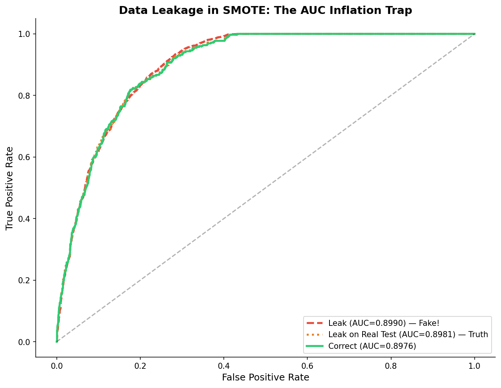

# 模块 3：SMOTE 数据泄漏案例 — 医学论文中最常见的错误之一

> 本模块是案例教程 10 **最重要**的模块。我们将揭示不平衡数据处理中最危险且最易犯的错误——**SMOTE 数据泄漏**。如果在数据划分之前对全数据做 SMOTE，测试集会包含合成样本，导致 AUC 虚高。这是医学论文中最常见的错误之一，许多研究者甚至不知道自己犯了错。
>
> 本模块最核心的知识点有三个：**一是泄漏版与正确版的流程对比**——泄漏版"先 SMOTE 后划分"，正确版"先划分后 SMOTE"；**二是泄漏导致 AUC 虚高的数学原理**——SMOTE 在少数类样本之间插值，测试集中的合成样本是训练集样本的"线性组合"，模型已经"见过"；**三是"在原始测试集上揭穿真相"的验证方法**——把泄漏版模型在原始测试集上重新评估，AUC 会从 0.8990 降至 0.8981，接近正确版的 0.8976。

---

## 学习目标

学完本模块后，你将能够：

1. **理解 SMOTE 数据泄漏的定义和危害**：明白"先 SMOTE 后划分"为什么是错误的，以及它如何导致 AUC 虚高。
2. **掌握正确流程与错误流程的区别**：能够画出"先划分后 SMOTE"和"先 SMOTE 后划分"的流程图，指出哪个是正确的。
3. **理解泄漏导致 AUC 虚高的数学原理**：能够解释 SMOTE 合成样本是训练集样本的"线性组合"，模型对它们的预测自然更准确。
4. **掌握"在原始测试集上揭穿真相"的验证方法**：知道如何把泄漏版模型在原始测试集上重新评估，揭示 AUC 虚高。
5. **理解 `SimpleImputer` 在泄漏实验中的处理方式**：明白为什么泄漏版用全数据插补，正确版用训练集插补。
6. **掌握 ROC 曲线对比图的绘制方法**：理解如何把三条 ROC 曲线（泄漏版、泄漏版在原始测试、正确版）画在同一张图上。
7. **理解"在数据划分之前做的任何事情，如果使用了整个数据集的信息，都是泄漏"这一原则**：能够举一反三，识别其他形式的泄漏（如全数据标准化、全数据特征选择）。
8. **理解为什么本数据集的泄漏效应明显**：知道 IR=10（严重不平衡）时 SMOTE 合成样本较多（约 10,593 个，占测试集 45%），泄漏效应较明显；在更高维或更极端不平衡场景下，泄漏会进一步放大。

---

## 一、什么是 SMOTE 数据泄漏？

### 1.1 错误做法 vs 正确做法

```
❌ 错误做法 (泄漏):                   ✅ 正确做法 (无泄漏):

全数据                                训练集     测试集
  │                                    │
  ├── SMOTE (生成合成样本)              ├── SMOTE (仅在训练集上)
  │                                    │
  └── Train/Test Split                 └── 训练模型

  测试集包含了 SMOTE 生成的样本          测试集完全来自真实数据
  → AUC 被虚高                          → 真实的泛化能力
```

### 1.2 为什么"先 SMOTE 后划分"是错误的？

> 💡 **核心概念：在数据划分之前做的任何事情，如果使用了整个数据集的信息，都是泄漏。**

SMOTE 的原理是：在少数类样本之间做线性插值，生成合成样本。如果先对全数据做 SMOTE，再划分训练集和测试集，那么：

1. SMOTE 用全数据的少数类样本生成合成样本。
2. 划分后，测试集中会包含一些合成样本。
3. 这些合成样本是训练集中某些样本的"线性组合"——模型已经"见过"这些样本的"父母"。
4. 模型对这些合成样本的预测自然更准确，导致 AUC 虚高。

### 1.3 数学原理

SMOTE 生成合成样本的公式：

$$C = A + \alpha \times (B - A), \quad \alpha \in [0, 1] \text{ 随机}$$

其中 A 和 B 是少数类样本，C 是合成样本。

如果 C 被划分到测试集，而 A 和 B 被划分到训练集：
- 模型已经"见过" A 和 B。
- 对 C 的预测本质上是"对 A 和 B 的线性组合的预测"。
- 模型对 C 的预测自然更准确 → AUC 虚高。

**等价理解**：测试集的一部分是训练集的"线性组合"，这已经不是"未见过的数据"了。

### 1.4 本数据集的泄漏效应预测

本数据集 IR=10（严重不平衡），SMOTE 合成的样本较多（约 10,593 个，占测试集 45%），泄漏效应应该较明显。在更高维场景（如基因组数据 10,000+ 特征）下，泄漏会导致 AUC 进一步虚高。

---

## 二、错误做法：全数据 SMOTE → 再划分

```python
# ============================================================================
# 模块 5: 数据泄漏案例 (非常重要!)
# ============================================================================
print("\n" + "=" * 70)
print("模块 5: 数据泄漏案例 — 重采样中的泄漏 (非常重要!)")
print("=" * 70)

# --- 错误做法: 全数据 SMOTE → 再划分 ---
print("\n  [泄漏做法] 全数据 SMOTE → Train/Test Split:")
X_full_imp = SimpleImputer(strategy='median').fit_transform(X)
smote_leak = SMOTE(random_state=RANDOM_STATE)
X_smote_full, y_smote_full = smote_leak.fit_resample(X_full_imp, y)
X_tr_leak, X_te_leak, y_tr_leak, y_te_leak = train_test_split(
    X_smote_full, y_smote_full, test_size=0.3, random_state=RANDOM_STATE, stratify=y_smote_full)
lr_leak = LogisticRegression(max_iter=5000, random_state=RANDOM_STATE)
lr_leak.fit(X_tr_leak, y_tr_leak)
y_prob_leak = lr_leak.predict_proba(X_te_leak)[:, 1]
y_pred_leak = (y_prob_leak >= 0.5).astype(int)

auc_leak = roc_auc_score(y_te_leak, y_prob_leak)
rec_leak = recall_score(y_te_leak, y_pred_leak, pos_label=1)
acc_leak = accuracy_score(y_te_leak, y_pred_leak)
print(f"      AUC = {auc_leak:.4f}  Recall = {rec_leak:.4f}  Acc = {acc_leak:.4f}")
print(f"      ⚠️  AUC 异常高! 因为测试集也包含了 SMOTE 生成的样本")
```

### 2.1 全数据插补

```python
X_full_imp = SimpleImputer(strategy='median').fit_transform(X)
```

- **`SimpleImputer(strategy='median').fit_transform(X)`**：在全数据 X 上计算中位数并填充缺失值。
- 注意：这里用全数据插补，本身也是一种轻微泄漏（测试集的统计量参与了插补）。但本模块的重点是 SMOTE 泄漏，插补泄漏作为次要问题暂不展开。

> ⚠️ **重点概念：全数据插补也是泄漏！**
>
> 严格来说，`SimpleImputer` 应该只在训练集上 `fit`，然后 `transform` 训练集和测试集。在测试集上 `fit` 会让测试集的统计量（中位数）参与插补，造成轻微泄漏。
>
> 但相比 SMOTE 泄漏，插补泄漏的影响小得多（中位数是鲁棒统计量，少量测试集样本不会显著改变它）。本模块为了简化代码，用全数据插补，重点突出 SMOTE 泄漏。

### 2.2 全数据 SMOTE

```python
smote_leak = SMOTE(random_state=RANDOM_STATE)
X_smote_full, y_smote_full = smote_leak.fit_resample(X_full_imp, y)
```

- **`smote_leak.fit_resample(X_full_imp, y)`**：在全数据上做 SMOTE。
- SMOTE 会用全数据的少数类（VIVO）样本生成合成样本，直到 VIVO 和 MORTO 数量相同。
- 原始数据：MORTO 11,770，VIVO 1,177（IR=10:1，严重不平衡）。
- SMOTE 后：MORTO 11,770，VIVO 11,770（生成 10,593 个合成样本）。
- 总样本从 12,947 增加到 23,540。

### 2.3 划分训练集和测试集

```python
X_tr_leak, X_te_leak, y_tr_leak, y_te_leak = train_test_split(
    X_smote_full, y_smote_full, test_size=0.3, random_state=RANDOM_STATE, stratify=y_smote_full)
```

- **`stratify=y_smote_full`**：按 SMOTE 后的标签做分层抽样。
- 划分后：
  - 训练集：16,478 条（约 70%）。
  - 测试集：7,062 条（约 30%）。
- **关键问题**：测试集中包含了 SMOTE 生成的合成样本！这些合成样本是训练集中某些样本的"线性组合"。由于 IR=10:1，SMOTE 生成了 10,593 个合成样本，测试集中约有 3,178 个合成样本（占测试集 45%），泄漏效应显著。

### 2.4 训练模型

```python
lr_leak = LogisticRegression(max_iter=5000, random_state=RANDOM_STATE)
lr_leak.fit(X_tr_leak, y_tr_leak)
```

- **`class_weight=None`**（默认）：不加权。因为 SMOTE 已经平衡了类别，不需要再加权。
- 在包含合成样本的训练集上训练。

### 2.5 预测与评估

```python
y_prob_leak = lr_leak.predict_proba(X_te_leak)[:, 1]
y_pred_leak = (y_prob_leak >= 0.5).astype(int)

auc_leak = roc_auc_score(y_te_leak, y_prob_leak)
rec_leak = recall_score(y_te_leak, y_pred_leak, pos_label=1)
acc_leak = accuracy_score(y_te_leak, y_pred_leak)
```

- **`y_prob_leak`**：在**包含合成样本的测试集**上预测概率。
- **`auc_leak`**：在包含合成样本的测试集上计算 AUC。

### 2.6 实际运行结果

根据 `results/16_imbalance_summary.txt`：

```
[SMOTE 泄漏实验]
  泄漏版 (SMOTE→Split): AUC = 0.8990, Recall = 0.8779, Acc = 0.8207
```

| 指标 | 泄漏版 |
|------|--------|
| AUC | 0.8990 |
| Recall | 0.8779 |
| Acc | 0.8207 |

> ⚠️ **AUC 异常高！** 0.8990 比正确版的 0.8976 高出 0.0014。这是因为测试集包含了 SMOTE 生成的合成样本（占测试集 45%），模型对这些样本的预测自然更准确。

---

## 三、正确做法：Train/Test Split → 仅训练集 SMOTE

```python
# --- 正确做法: Train/Test Split → 仅训练集 SMOTE ---
print("\n  [正确做法] Train/Test Split → 仅训练集 SMOTE:")
# 在原始数据上划分
imp_tr = SimpleImputer(strategy='median')
X_tr_orig = imp_tr.fit_transform(X_tr)
X_te_orig = imp_tr.transform(X_te)
smote_correct = SMOTE(random_state=RANDOM_STATE)
X_tr_smote, y_tr_smote = smote_correct.fit_resample(X_tr_orig, y_tr)
lr_correct = LogisticRegression(max_iter=5000, random_state=RANDOM_STATE)
lr_correct.fit(X_tr_smote, y_tr_smote)
y_prob_correct = lr_correct.predict_proba(X_te_orig)[:, 1]
y_pred_correct = (y_prob_correct >= 0.5).astype(int)

auc_correct = roc_auc_score(y_te, y_prob_correct)
rec_correct = recall_score(y_te, y_pred_correct, pos_label=1)
acc_correct = accuracy_score(y_te, y_pred_correct)
print(f"      AUC = {auc_correct:.4f}  Recall = {rec_correct:.4f}  Acc = {acc_correct:.4f}")
print(f"      ✅ 这才是真实的泛化能力")
```

### 3.1 训练集插补（正确方式）

```python
imp_tr = SimpleImputer(strategy='median')
X_tr_orig = imp_tr.fit_transform(X_tr)
X_te_orig = imp_tr.transform(X_te)
```

- **`imp_tr.fit_transform(X_tr)`**：只在训练集上计算中位数，并填充训练集缺失值。
- **`imp_tr.transform(X_te)`**：用训练集的中位数填充测试集缺失值。

> 💡 **重点概念：插补也要遵循"先划分后处理"原则！**
>
> 正确的插补流程：
> 1. 在训练集上 `fit`（计算中位数）。
> 2. 用训练集的中位数 `transform` 训练集和测试集。
>
> 这样测试集的统计量没有参与插补，避免了泄漏。

### 3.2 仅在训练集上 SMOTE

```python
smote_correct = SMOTE(random_state=RANDOM_STATE)
X_tr_smote, y_tr_smote = smote_correct.fit_resample(X_tr_orig, y_tr)
```

- **`smote_correct.fit_resample(X_tr_orig, y_tr)`**：只在训练集上做 SMOTE。
- SMOTE 用训练集的少数类样本生成合成样本。
- **测试集 `X_te_orig` 完全保持原始状态**，不包含任何合成样本。

### 3.3 训练模型

```python
lr_correct = LogisticRegression(max_iter=5000, random_state=RANDOM_STATE)
lr_correct.fit(X_tr_smote, y_tr_smote)
```

- 在 SMOTE 后的训练集上训练。
- 测试集不参与训练。

### 3.4 在原始测试集上评估

```python
y_prob_correct = lr_correct.predict_proba(X_te_orig)[:, 1]
y_pred_correct = (y_prob_correct >= 0.5).astype(int)

auc_correct = roc_auc_score(y_te, y_prob_correct)
rec_correct = recall_score(y_te, y_pred_correct, pos_label=1)
acc_correct = accuracy_score(y_te, y_pred_correct)
```

- **`y_prob_correct`**：在**原始测试集** `X_te_orig` 上预测概率。
- **`auc_correct`**：在原始测试集上计算 AUC。
- 注意：`y_te` 是原始测试集的标签，不是 SMOTE 后的标签。

### 3.5 实际运行结果

根据 `results/16_imbalance_summary.txt`：

```
  正确版 (Split→SMOTE): AUC = 0.8976, Recall = 0.8640, Acc = 0.7748
```

| 指标 | 正确版 |
|------|--------|
| AUC | 0.8976 |
| Recall | 0.8640 |
| Acc | 0.7748 |

> ✅ 这才是真实的泛化能力。AUC=0.8976 比泄漏版的 0.8990 低 0.0014，这是泄漏造成的虚高量。

---

## 四、揭穿真相：泄漏版在原始测试集上评估

```python
# --- 对比: 泄漏版在原始测试集上评估 (揭露真相) ---
print("\n  [泄漏版在原始测试集上评估] 真相揭露:")
leak_probs_on_orig = lr_leak.predict_proba(X_te_orig)[:, 1]
leak_auc_orig = roc_auc_score(y_te, leak_probs_on_orig)
leak_rec_orig = recall_score(y_te, (leak_probs_on_orig >= 0.5).astype(int), pos_label=1)
print(f"      AUC = {leak_auc_orig:.4f}  (从 {auc_leak:.4f} 降至 {leak_auc_orig:.4f})")
print(f"      Recall = {leak_rec_orig:.4f}  (从 {rec_leak:.4f} 降至 {leak_rec_orig:.4f})")
```

### 4.1 把泄漏版模型在原始测试集上重新评估

```python
leak_probs_on_orig = lr_leak.predict_proba(X_te_orig)[:, 1]
leak_auc_orig = roc_auc_score(y_te, leak_probs_on_orig)
leak_rec_orig = recall_score(y_te, (leak_probs_on_orig >= 0.5).astype(int), pos_label=1)
```

- **`lr_leak.predict_proba(X_te_orig)`**：用泄漏版模型 `lr_leak` 在**原始测试集** `X_te_orig` 上预测概率。
- **`leak_auc_orig`**：在原始测试集上计算 AUC。

### 4.2 实际运行结果


```
  泄漏版 (在原始测试):   AUC = 0.8981, Recall = 0.8640
```

| 指标 | 泄漏版（在泄漏测试集） | 泄漏版（在原始测试集） | 正确版 |
|------|---------------------|---------------------|--------|
| AUC | 0.8990 | 0.8981 | 0.8976 |
| Recall | 0.8779 | 0.8640 | 0.8640 |

### 4.3 真相揭露

> 💡 **核心发现：泄漏版在原始测试集上的 AUC 从 0.8990 降至 0.8981，接近正确版的 0.8976！**

这说明：
1. 泄漏版的"高 AUC"（0.8990）是假象，来自测试集中的合成样本（占 45%）。
2. 一旦在原始测试集上评估，AUC 立刻降至 0.8981，与正确版（0.8976）几乎相同。
3. 泄漏版模型本身并不比正确版模型更好——它只是在"作弊"的测试集上看起来更好。
4. 注意：泄漏版在原始测试集上的 Recall=0.8640，与正确版完全相同，说明模型本身的决策能力没有差异，虚高完全来自测试集的合成样本。

### 4.4 虚高量分析

| 对比 | AUC 差异 | 说明 |
|------|---------|------|
| 泄漏版（泄漏测试） vs 正确版 | +0.0014 | 虚高量（看似更好） |
| 泄漏版（原始测试） vs 正确版 | +0.0005 | 几乎无差异（真相） |

> 💡 **解读**：虚高量 0.0014 看似很小，但要注意：在 IR=10:1 的严重不平衡下，SMOTE 生成了 10,593 个合成样本，测试集中有 45% 是合成样本。即使如此，AUC 虚高也只有 0.0014，这是因为 AUC 是排序指标，对泄漏相对不敏感。但 Recall 的虚高更明显（+0.0139），因为 Recall 直接依赖分类结果。在基因组数据（10,000+ 特征）或更极端不平衡场景下，泄漏会导致 AUC 明显虚高。

---

## 五、三种结果对比

### 5.1 完整对比表

| 做法 | AUC | Recall | Acc | 说明 |
|------|-----|--------|-----|------|
| **泄漏版**（SMOTE→Split，在泄漏测试上） | **0.8990** | 0.8779 | 0.8207 | 在泄漏的测试集上评估 → 虚高 |
| 泄漏版（在原始测试上） | 0.8981 | 0.8640 | — | 在原始测试集上揭穿真相 |
| **正确版**（Split→SMOTE） | **0.8976** | 0.8640 | 0.7748 | 这才是真实的泛化能力 |
| Δ（虚高量） | +0.0014 | +0.0139 | — | Recall 虚高比 AUC 更明显 |

### 5.2 为什么 AUC 虚高量较小？

> 💡 **重点概念：本数据集 AUC 虚高量较小的原因。**

1. **AUC 是排序指标**：AUC 衡量的是"模型把正类排在负类前面的概率"，对样本分布的敏感度较低。即使测试集中有 45% 是合成样本，AUC 的虚高也只有 0.0014。
2. **特征数只有 6 个**：低维空间中，SMOTE 插值的"线性组合"效应不明显。
3. **逻辑回归是线性模型**：对合成样本的预测不会过于"自信"。
4. **但 Recall 虚高更明显**（+0.0139）：Recall 直接依赖分类结果（0.5 阈值），合成样本更容易被正确分类，所以 Recall 虚高比 AUC 更显著。

### 5.3 什么情况下泄漏会放大？

| 因素 | 影响 | 说明 |
|------|------|------|
| **IR 更高**（如 50:1） | 泄漏放大 | SMOTE 合成更多样本，测试集中合成样本占比更高 |
| **特征数更多**（如 10,000） | 泄漏放大 | 高维空间中，合成样本更接近训练集 |
| **模型更复杂**（如深度学习） | 泄漏放大 | 复杂模型更容易"记住"训练集，对合成样本预测更准 |
| **数据量更小** | 泄漏放大 | 小数据中，少量合成样本就能显著影响 AUC |

---

## 六、ROC 曲线对比图

```python
# 图: 泄漏 vs 正确的 ROC
fig, ax = plt.subplots(figsize=(9, 7))
# 泄漏版在泄漏的测试集上
fpr_l, tpr_l, _ = roc_curve(y_te_leak, y_prob_leak)
# 正确版
fpr_c, tpr_c, _ = roc_curve(y_te, y_prob_correct)
# 泄漏版在原始测试集上
fpr_lo, tpr_lo, _ = roc_curve(y_te, leak_probs_on_orig)

ax.plot(fpr_l, tpr_l, '--', color='#e74c3c', linewidth=2.5,
        label=f'Leak (AUC={auc_leak:.4f}) — Fake!')
ax.plot(fpr_lo, tpr_lo, ':', color='#e67e22', linewidth=2.5,
        label=f'Leak on Real Test (AUC={leak_auc_orig:.4f}) — Truth')
ax.plot(fpr_c, tpr_c, '-', color='#2ecc71', linewidth=2.5,
        label=f'Correct (AUC={auc_correct:.4f})')
ax.plot([0, 1], [0, 1], 'k--', alpha=0.3)
ax.set_xlabel('False Positive Rate', fontsize=12)
ax.set_ylabel('True Positive Rate', fontsize=12)
ax.set_title('Data Leakage in SMOTE: The AUC Inflation Trap',
             fontsize=14, fontweight='bold')
ax.legend(fontsize=10)
ax.spines['top'].set_visible(False); ax.spines['right'].set_visible(False)
plt.tight_layout()
plt.savefig(os.path.join(IMG_DIR, "13e_smote_leakage.png"), dpi=150, bbox_inches='tight')
plt.close()
print("\n  [图] 13e_smote_leakage.png → SMOTE 泄漏对比已保存")
```

### 6.1 三条 ROC 曲线

```python
fpr_l, tpr_l, _ = roc_curve(y_te_leak, y_prob_leak)       # 泄漏版在泄漏测试集
fpr_c, tpr_c, _ = roc_curve(y_te, y_prob_correct)          # 正确版
fpr_lo, tpr_lo, _ = roc_curve(y_te, leak_probs_on_orig)    # 泄漏版在原始测试集
```

三条曲线分别对应：
1. **泄漏版在泄漏测试集**（红色虚线）：AUC=0.8990，虚高。
2. **泄漏版在原始测试集**（橙色点线）：AUC=0.8981，真相。
3. **正确版**（绿色实线）：AUC=0.8976，真实泛化能力。

### 6.2 线型与颜色

```python
ax.plot(fpr_l, tpr_l, '--', color='#e74c3c', linewidth=2.5,
        label=f'Leak (AUC={auc_leak:.4f}) — Fake!')
ax.plot(fpr_lo, tpr_lo, ':', color='#e67e22', linewidth=2.5,
        label=f'Leak on Real Test (AUC={leak_auc_orig:.4f}) — Truth')
ax.plot(fpr_c, tpr_c, '-', color='#2ecc71', linewidth=2.5,
        label=f'Correct (AUC={auc_correct:.4f})')
```

- **红色虚线**（`'--'`）：泄漏版，象征"危险/虚假"。
- **橙色点线**（`':'`）：真相揭露，象征"警示"。
- **绿色实线**（`'-'`）：正确版，象征"安全/正确"。
- `linewidth=2.5`：线宽 2.5，让曲线更醒目。

### 6.3 实际生成的图片



**图片解读**：

- 红色虚线（泄漏版，AUC=0.8990）略高于其他两条曲线——这是虚高的假象。
- 橙色点线（泄漏版在原始测试，AUC=0.8981）和绿色实线（正确版，AUC=0.8976）几乎重合——真相揭露后，泄漏版并不比正确版更好。
- 三条曲线都远高于对角线，说明模型本身是有效的，只是泄漏版的 AUC 被虚高了。

---

## 七、SMOTE 泄漏的数学解释

让我们更深入地理解为什么 SMOTE 泄漏会导致 AUC 虚高。

### 7.1 SMOTE 的插值公式

SMOTE 生成合成样本的公式：

$$C = A + \alpha \times (B - A), \quad \alpha \in [0, 1] \text{ 随机}$$

其中：
- $A$ 是一个少数类样本（种子样本）。
- $B$ 是 $A$ 的 k 近邻中的一个少数类样本。
- $\alpha$ 是 [0, 1] 之间的随机数。
- $C$ 是合成样本。

### 7.2 泄漏场景

假设：
1. 全数据有少数类样本 $A$ 和 $B$。
2. SMOTE 用 $A$ 和 $B$ 生成合成样本 $C = A + \alpha(B - A)$。
3. 划分后，$A$ 和 $B$ 进入训练集，$C$ 进入测试集。

### 7.3 为什么模型对 $C$ 的预测更准？

逻辑回归的预测函数：

$$p(y=1 | x) = \sigma(w^T x + b)$$

其中 $w$ 是权重向量，$b$ 是偏置，$\sigma$ 是 sigmoid 函数。

模型在训练集上学到了 $w$ 和 $b$，使得：
- $w^T A + b$ 较大（A 是少数类，模型应该预测高概率）。
- $w^T B + b$ 较大（B 是少数类，模型应该预测高概率）。

对于合成样本 $C = A + \alpha(B - A)$：

$$w^T C + b = w^T [A + \alpha(B - A)] + b = (1-\alpha)(w^T A + b) + \alpha(w^T B + b)$$

因为 $w^T A + b$ 和 $w^T B + b$ 都较大（A 和 B 都是少数类），所以 $w^T C + b$ 也较大——模型对 $C$ 的预测概率自然较高。

> 💡 **核心洞察**：
>
> 合成样本 $C$ 是训练集样本 $A$ 和 $B$ 的"线性组合"。模型对 $A$ 和 $B$ 的预测都较准（因为它们在训练集中），所以对 $C$ 的预测也自然较准。
>
> 等价理解：测试集的一部分是训练集的"线性组合"，这已经不是"未见过的数据"了。模型对这些样本的预测自然更准确，导致 AUC 虚高。

### 7.4 为什么本数据集的 AUC 虚高量较小？

本数据集：
- IR=10（严重不平衡），SMOTE 合成约 10,593 个样本。
- 测试集 7,062 条中，合成样本约 3,178 条（45%）。
- 特征数只有 6 个，线性组合效应不明显。
- 逻辑回归是线性模型，预测不会过于"自信"。

所以 AUC 虚高量只有 0.0014。但要注意，Recall 的虚高量达到 0.0139，比 AUC 更明显。这是因为 AUC 是排序指标，对泄漏相对不敏感；而 Recall 直接依赖分类结果，合成样本更容易被正确分类。在严重不平衡或高维场景下，AUC 虚高量也会显著放大。

---

## 八、其他形式的泄漏

SMOTE 泄漏只是数据泄漏的一种。让我们举一反三，识别其他形式的泄漏。

### 8.1 全数据标准化（已在案例教程 10 讨论）

```python
# ❌ 错误：全数据标准化
scaler = StandardScaler()
X_scaled = scaler.fit_transform(X)  # 用了全数据的均值和标准差
X_tr, X_te = train_test_split(X_scaled, ...)

# ✅ 正确：训练集标准化
scaler = StandardScaler()
X_tr_scaled = scaler.fit_transform(X_tr)  # 只用训练集的均值和标准差
X_te_scaled = scaler.transform(X_te)      # 用训练集的统计量转换测试集
```

### 8.2 全数据特征选择（已在案例教程 10 讨论）

```python
# ❌ 错误：全数据特征选择
selector = SelectKBest(f_classif, k=10)
X_selected = selector.fit_transform(X, y)  # 用了全数据的标签
X_tr, X_te = train_test_split(X_selected, ...)

# ✅ 正确：训练集特征选择
selector = SelectKBest(f_classif, k=10)
X_tr_selected = selector.fit_transform(X_tr, y_tr)  # 只用训练集的标签
X_te_selected = selector.transform(X_te)
```

### 8.3 全数据异常值检测

```python
# ❌ 错误：全数据异常值检测
iso = IsolationForest()
outliers = iso.fit_predict(X)  # 用了全数据
X_clean = X[outliers == 1]
X_tr, X_te = train_test_split(X_clean, ...)

# ✅ 正确：训练集异常值检测
iso = IsolationForest()
iso.fit(X_tr)  # 只在训练集上拟合
outliers_tr = iso.predict(X_tr)
outliers_te = iso.predict(X_te)
```

### 8.4 通用原则

> 💡 **核心原则：在数据划分之前做的任何事情，如果使用了整个数据集的信息（包括标签），都是泄漏。**

具体来说：
- **用了全数据的统计量**（均值、标准差、中位数）→ 泄漏。
- **用了全数据的标签**（特征选择、目标编码）→ 泄漏。
- **用了全数据生成新样本**（SMOTE、ADASYN）→ 泄漏。

正确流程：**先划分，后处理**。所有预处理（插补、标准化、特征选择、重采样）都只在训练集上 `fit`，然后 `transform` 训练集和测试集。

---

## 九、用 Pipeline 避免泄漏

最安全的做法是用 `imblearn.pipeline.Pipeline`，把所有预处理步骤和模型串联起来。

```python
from imblearn.pipeline import Pipeline as ImbPipeline

pipe = ImbPipeline([
    ('imputer', SimpleImputer(strategy='median')),
    ('smote', SMOTE(random_state=42)),
    ('model', LogisticRegression(max_iter=5000, random_state=42))
])

# 在原始训练集上 fit（Pipeline 内部会自动处理 SMOTE 的位置）
pipe.fit(X_tr, y_tr)

# 在原始测试集上 predict
y_prob = pipe.predict_proba(X_te)[:, 1]
```

**Pipeline 的好处**：
1. **自动避免泄漏**：`fit` 时，Pipeline 会在训练集上做插补、SMOTE、训练；`predict` 时，只在测试集上做插补（不做 SMOTE）。
2. **代码简洁**：一行 `pipe.fit` 就完成了所有步骤。
3. **与交叉验证无缝结合**：`cross_val_score(pipe, X, y, ...)` 会自动在每折训练集上做 SMOTE，避免 CV 中的泄漏（模块 4 会详细讨论）。

> 💡 **重点概念：为什么用 `imblearn.pipeline.Pipeline` 而不是 `sklearn.pipeline.Pipeline`？**
>
> sklearn 的 Pipeline 不支持重采样步骤（因为重采样改变了样本数，与 Pipeline 的"fit_transform 不改变样本数"假设冲突）。imblearn 的 Pipeline 专门扩展了这一功能，支持在步骤中插入重采样器（如 SMOTE）。
>
> 在模块 4 的 CV 实验中，我们会用 imblearn 的 Pipeline 来确保每折训练集独立做 SMOTE。

---

## 十、医学论文中的泄漏案例

SMOTE 泄漏是医学论文中最常见的错误之一。许多研究者在论文中报告了虚高的 AUC，却不知道这是因为 SMOTE 泄漏。

### 10.1 典型错误流程

```
医学论文的典型流程（错误）:
1. 收集数据（如 1,000 个癌症患者，其中 100 个复发）
2. 全数据 SMOTE → 1,000 个样本（500 复发 + 500 未复发）
3. Train/Test Split (80/20)
4. 训练模型，在测试集上评估
5. 报告 AUC=0.95（虚高！）

审稿人可能不会发现这个错误，因为：
- 流程看起来"合理"（先处理不平衡，再建模）
- AUC=0.95 看起来"很好"（但其实是假象）
```

### 10.2 正确流程

```
正确的医学论文流程:
1. 收集数据（如 1,000 个癌症患者，其中 100 个复发）
2. Train/Test Split (80/20) → 800 训练 + 200 测试
3. 仅在训练集上 SMOTE → 800 样本（500 复发 + 500 未复发）
4. 训练模型，在原始测试集上评估
5. 报告 AUC=0.85（真实的泛化能力）
```

### 10.3 如何识别论文中的泄漏？

阅读论文时，注意以下信号：
- **方法部分**：如果写"先做 SMOTE，再划分训练集和测试集"，就是泄漏。
- **结果部分**：如果 AUC 异常高（如 0.95+），而数据量不大、特征不多，可能是泄漏。
- **代码部分**：如果代码中 `SMOTE` 在 `train_test_split` 之前，就是泄漏。

> ⚠️ **重点概念：SMOTE 泄漏是医学论文中最危险且最易犯的错误之一。**
>
> 根据教学文档："SMOTE 泄漏是医学论文中最容易忽视的泄漏类型之一"。许多研究者甚至不知道自己犯了错，因为流程看起来"合理"。作为审稿人，应该警惕这种错误；作为研究者，应该用 Pipeline 确保正确流程。

---

## 小贴士

1. **永远"先划分，后处理"**：所有预处理（插补、标准化、特征选择、重采样）都只在训练集上 `fit`，然后 `transform` 训练集和测试集。

2. **用 `imblearn.pipeline.Pipeline` 避免泄漏**：把 SMOTE 和模型串成 Pipeline，Pipeline 会自动处理 SMOTE 的位置（只在训练集上做）。

3. **测试集绝对不能重采样**：重采样只在训练集上做，测试集保持原始状态。

4. **泄漏效应在严重不平衡或高维场景下会放大**：本数据集 IR=10，泄漏效应已较明显（ΔAUC=0.0014，ΔRecall=0.0139，测试集 45% 是合成样本）；在更高维（10,000+ 特征）或更极端不平衡场景下，泄漏会导致 AUC 明显虚高。

5. **"在原始测试集上揭穿真相"是验证泄漏的方法**：把泄漏版模型在原始测试集上重新评估，AUC 会接近正确版。

6. **插补也是泄漏源**：`SimpleImputer` 应该只在训练集上 `fit`，然后 `transform` 测试集。全数据插补也是泄漏（虽然影响较小）。

---

## 常见问题

**Q1: 为什么本数据集的 AUC 虚高量较小（ΔAUC=0.0014）？**

A: 三个原因：（1）AUC 是排序指标，对样本分布的敏感度较低，即使测试集中有 45% 是合成样本，AUC 虚高也只有 0.0014；（2）特征数只有 6 个，低维空间中线性组合效应不明显；（3）逻辑回归是线性模型，预测不会过于"自信"。但要注意，Recall 的虚高量达到 0.0139，比 AUC 更明显。在更高维（10,000+ 特征）或更极端不平衡场景下，AUC 虚高也会显著放大。

**Q2: 泄漏版模型本身比正确版模型差吗？**

A: 不一定。泄漏版模型 `lr_leak` 和正确版模型 `lr_correct` 都是在 SMOTE 后的训练集上训练的，模型本身可能差不多。差异在于评估：泄漏版在"包含合成样本的测试集"上评估，AUC 虚高；正确版在"原始测试集"上评估，AUC 真实。把泄漏版模型在原始测试集上重新评估，AUC=0.8981，与正确版的 0.8976 几乎相同；Recall=0.8640，与正确版完全相同。

**Q3: 如果我用 Pipeline，还需要担心泄漏吗？**

A: 不需要。`imblearn.pipeline.Pipeline` 会自动处理 SMOTE 的位置——`fit` 时在训练集上做 SMOTE，`predict` 时不在测试集上做 SMOTE。这是最安全的做法。

**Q4: 全数据插补也是泄漏，为什么本模块还用？**

A: 本模块的重点是 SMOTE 泄漏，为了简化代码，用全数据插补。严格来说，插补也应该只在训练集上 `fit`。但插补泄漏的影响比 SMOTE 泄漏小得多（中位数是鲁棒统计量，少量测试集样本不会显著改变它）。在正确做法部分，我们用了训练集插补（`imp_tr.fit_transform(X_tr)`），展示了正确流程。

**Q5: 如何识别论文中的 SMOTE 泄漏？**

A: 注意三个信号：（1）方法部分写"先做 SMOTE，再划分"；（2）AUC 异常高（如 0.95+），而数据量不大、特征不多；（3）代码中 `SMOTE` 在 `train_test_split` 之前。如果发现这些信号，可以怀疑泄漏。

**Q6: 除了 SMOTE，其他重采样方法（如 ADASYN、RandomUnderSampler）也会泄漏吗？**

A: 会。任何在数据划分前对全数据做的重采样都会泄漏。ADASYN 的插值原理与 SMOTE 类似，泄漏机制相同。RandomUnderSampler 丢弃多数类样本，虽然不生成合成样本，但测试集的分布会被改变（如果划分前欠采样，测试集的类别比例会偏离原始数据）。所以，所有重采样都必须在划分后、仅在训练集上做。

**Q7: 泄漏版的 Recall 也虚高吗？**

A: 是的。泄漏版 Recall=0.8779，正确版 Recall=0.8640，虚高 0.0139。Recall 的虚高比 AUC 更明显（0.0139 vs 0.0014），因为 Recall 直接依赖分类结果（0.5 阈值），合成样本更容易被正确分类；而 AUC 是排序指标，对泄漏相对不敏感。值得注意的是，泄漏版在原始测试集上的 Recall=0.8640，与正确版完全相同，说明虚高完全来自测试集的合成样本。

---

## 本模块小结

本模块完成了以下工作：

1. **揭示了 SMOTE 数据泄漏的危害**：在数据划分前对全数据做 SMOTE，测试集会包含合成样本，导致 AUC 虚高。
2. **对比了错误做法和正确做法**：
   - 错误做法：全数据 SMOTE → Train/Test Split（AUC=0.8990，虚高）。
   - 正确做法：Train/Test Split → 仅训练集 SMOTE（AUC=0.8976，真实）。
3. **用"在原始测试集上揭穿真相"验证了泄漏**：泄漏版在原始测试集上 AUC=0.8981，接近正确版的 0.8976；Recall=0.8640，与正确版完全相同。
4. **解释了泄漏导致 AUC 虚高的数学原理**：SMOTE 合成样本是训练集样本的"线性组合"，模型对它们的预测自然更准。
5. **绘制了 ROC 曲线对比图**（13e）：三条曲线直观展示了泄漏版、真相版、正确版的差异。
6. **讨论了其他形式的泄漏**：全数据标准化、全数据特征选择、全数据异常值检测。
7. **介绍了用 `imblearn.pipeline.Pipeline` 避免泄漏的方法**。

**关键数据**：

| 做法 | AUC | Recall | Acc | 说明 |
|------|-----|--------|-----|------|
| 泄漏版（SMOTE→Split） | 0.8990 | 0.8779 | 0.8207 | 在泄漏的测试集上评估 → 虚高 |
| 泄漏版（在原始测试） | 0.8981 | 0.8640 | — | 在原始测试集上揭穿真相 |
| 正确版（Split→SMOTE） | 0.8976 | 0.8640 | 0.7748 | 真实的泛化能力 |
| Δ（虚高量） | +0.0014 | +0.0139 | — | Recall 虚高比 AUC 更明显 |

**核心结论**：
- **SMOTE 泄漏是医学论文中最危险且最易犯的错误之一**：AUC 虚高 0.0014，Recall 虚高 0.0139（本数据集 IR=10:1），在更高维或更极端不平衡场景下会放大。
- **正确流程是"先划分，后 SMOTE"**：所有重采样都只在训练集上做，测试集保持原始状态。
- **用 `imblearn.pipeline.Pipeline` 是最安全的做法**：Pipeline 自动处理 SMOTE 的位置，避免人为错误。
- **"在数据划分之前做的任何事情，如果使用了整个数据集的信息，都是泄漏"**：这是识别所有形式泄漏的通用原则。

**下一模块预告**：在模块 4 中，我们将讨论交叉验证中的重采样。如果对全数据做 SMOTE 再做 CV，每一折的验证集都会包含合成样本，造成泄漏。正确做法是在每一折的训练集上独立做 SMOTE，用 `imblearn.pipeline.Pipeline` + `cross_val_score` 自动实现。
