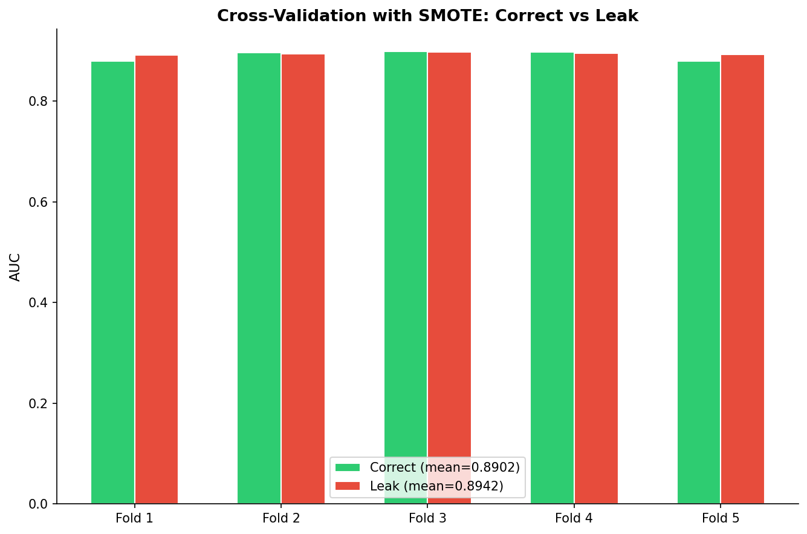

# 模块 4：交叉验证中的重采样 — SMOTE inside CV Fold

> 本模块是案例教程 10 的最后一个模块，也是模块 3（SMOTE 数据泄漏）的延伸。我们将讨论**交叉验证（CV）中的重采样**——如果对全数据做 SMOTE 再做 CV，每一折的验证集都会包含合成样本，造成泄漏。正确做法是在**每一折的训练集上独立做 SMOTE**，验证集保持原始状态。
>
> 本模块最核心的知识点有三个：**一是 `StratifiedKFold` 的原理**——分层 K 折交叉验证保证每一折的类别比例与整体一致；**二是正确 CV 流程**——每一折"先划分训练折和验证折，再在训练折上做 SMOTE，用原始验证折评估"；**三是泄漏 CV 的危害**——全数据 SMOTE 后做 CV，AUC 虚高且方差被人为减小，让审稿人误以为模型"非常稳定"。

---

## 学习目标

学完本模块后，你将能够：

1. **理解 `StratifiedKFold` 的原理和参数**：知道 `n_splits=5`、`shuffle=True`、`random_state` 的含义，以及为什么用分层 CV 而不是普通 KFold。
2. **掌握正确 CV 中的重采样流程**：能够画出"每一折训练集独立做 SMOTE，验证集保持原始"的流程图。
3. **理解泄漏 CV 的危害**：明白全数据 SMOTE 后做 CV 会导致 AUC 虚高且方差被人为减小。
4. **掌握手动实现 CV + SMOTE 的代码**：理解 `for fold_idx, (tr_idx, te_idx) in enumerate(cv.split(X, y))` 的循环结构。
5. **理解 `np.mean` 和 `np.std` 计算 CV 均值和标准差的方法**：知道为什么用标准差衡量模型稳定性。
6. **理解为什么本数据集的泄漏 CV 效应明显**：知道 IR=10:1（严重不平衡）时 SMOTE 合成样本较多，泄漏效应显著（AUC 虚高且方差被人为减小）；与轻度不平衡（IR=1.4）形成鲜明对比。
7. **掌握用 `imblearn.pipeline.Pipeline` + `cross_val_score` 自动实现正确 CV 的方法**：理解这是最安全的做法。
8. **理解"泄漏版 CV 看起来更稳定"的误导性**：知道泄漏版 CV 的方差更小（σ=0.0022 vs 0.0090），但这不是模型真的稳定，而是泄漏人为减小了方差。

---

## 一、为什么 CV 中也需要注意重采样？

### 1.1 CV 的基本流程

交叉验证（Cross-Validation, CV）是评估模型泛化能力的标准方法。5 折 CV 的流程：

```
Stratified 5-Fold CV:
           ┌─────────────────────────────────────┐
Fold 1:    │  [训练折]                [验证折]    │  AUC₁
           └─────────────────────────────────────┘
           ┌─────────────────────────────────────┐
Fold 2:    │  [验证折]  [训练折]                  │  AUC₂
           └─────────────────────────────────────┘
                ... (共 5 轮)

最终: Mean AUC = (AUC₁ + AUC₂ + ... + AUC₅) / 5
      Std AUC = std(AUC₁, AUC₂, ..., AUC₅)
```

### 1.2 CV 中的重采样问题

如果数据不平衡，我们需要在训练折上做 SMOTE。问题是：**SMOTE 应该在什么时候做？**

```
❌ 错误做法 (泄漏 CV):               ✅ 正确做法 (无泄漏 CV):

全数据                                原始数据
  │                                    │
  ├── SMOTE (全数据)                   ├── CV Split (5 折)
  │                                    │
  └── CV Split (5 折)                  └── 每一折:
                                           ├── 训练折 + SMOTE
  每一折的验证集包含合成样本                └── 验证折 (原始)
  → AUC 虚高, 方差减小
                                       验证集完全来自真实数据
                                       → 真实泛化能力
```

### 1.3 泄漏 CV 的危害

> 💡 **核心概念：泄漏 CV 不仅 AUC 虚高，还会人为减小方差，让模型看起来"非常稳定"。**

泄漏 CV 的两个危害：
1. **AUC 虚高**：验证集包含合成样本，模型对它们的预测更准。
2. **方差减小**：合成样本是训练集的"线性组合"，不同折的验证集有"重叠"的合成样本，导致 AUC 的方差被人为减小。

第二个危害更隐蔽——审稿人看到"σ=0.0022"（泄漏版）比"σ=0.0090"（正确版）小，可能误以为模型"非常稳定"。但在严重不平衡（IR=10:1）场景下，泄漏版的方差会显著小于正确版，让模型看起来"非常稳定"，这是误导。

---

## 二、`StratifiedKFold` 详解

```python
# ============================================================================
# 模块 6: 交叉验证中的重采样 (SMOTE inside CV)
# ============================================================================
print("\n" + "=" * 70)
print("模块 6: 交叉验证中的重采样")
print("=" * 70)

# 正确: CV Fold → Training Fold → SMOTE → Validation Fold
print("\n  正确做法: 每折内部对训练折做 SMOTE")
cv = StratifiedKFold(n_splits=5, shuffle=True, random_state=RANDOM_STATE)
cv_correct_aucs = []
cv_leak_aucs = []
```

### 2.1 `StratifiedKFold` 参数详解

```python
cv = StratifiedKFold(n_splits=5, shuffle=True, random_state=RANDOM_STATE)
```

- **`n_splits=5`**：5 折交叉验证。数据被分成 5 份，每次用 4 份训练、1 份验证，循环 5 次。
- **`shuffle=True`**：在划分前打乱数据顺序。如果不打乱，且数据按某种顺序排列（如按时间），可能导致每折的分布不均。
- **`random_state=RANDOM_STATE`**：固定随机种子，保证划分可复现。

### 2.2 `StratifiedKFold` vs `KFold`

| 特性 | `KFold` | `StratifiedKFold` |
|------|---------|-------------------|
| 划分方式 | 随机均分 | 分层抽样均分 |
| 类别比例 | 可能不均 | 每折与整体一致 |
| 适用场景 | 平衡数据 | **不平衡数据（必须用）** |

> 💡 **重点概念：在不平衡数据中，必须用 `StratifiedKFold`。**
>
> 如果用普通 `KFold`，某些折可能几乎没有少数类样本，导致：
> - 训练折的少数类太少，模型学不到正类模式。
> - 验证折的少数类太少，AUC 评估不稳定。
>
> `StratifiedKFold` 保证每一折的类别比例与整体一致（9.09% VIVO），评估才公平。

### 2.3 5 折 CV 的数据划分

本数据集 12,947 条（VIVO 1,177，MORTO 11,770，IR=10:1），5 折 CV：
- 每折训练集：约 10,357 条（80%）。
- 每折验证集：约 2,590 条（20%）。
- 每折的 VIVO 比例：约 9.09%（分层抽样保证）。

---

## 三、全数据插补

```python
# 先用全数据 impute
imputer_cv = SimpleImputer(strategy='median')
X_cv = imputer_cv.fit_transform(X)
```

- **`imputer_cv.fit_transform(X)`**：在全数据上计算中位数并填充缺失值。

> ⚠️ **注意：这里用全数据插补，本身也是一种轻微泄漏。**
>
> 严格来说，插补也应该在每一折的训练集上 `fit`，然后 `transform` 验证集。但本模块的重点是 SMOTE 泄漏，为了简化代码，用全数据插补。
>
> 在生产环境中，应该用 `imblearn.pipeline.Pipeline` 把插补和 SMOTE 都放进 Pipeline，让 `cross_val_score` 自动处理每一折的插补和 SMOTE。

---

## 四、正确做法：每折内部对训练折做 SMOTE

```python
for fold_idx, (tr_idx, te_idx) in enumerate(cv.split(X_cv, y)):
    X_tr_cv, X_te_cv = X_cv[tr_idx], X_cv[te_idx]
    y_tr_cv, y_te_cv = y[tr_idx], y[te_idx]

    # 正确: 只在训练折上 SMOTE
    smote = SMOTE(random_state=RANDOM_STATE)
    X_tr_res, y_tr_res = smote.fit_resample(X_tr_cv, y_tr_cv)
    lr = LogisticRegression(max_iter=5000, random_state=RANDOM_STATE)
    lr.fit(X_tr_res, y_tr_res)
    auc_cv = roc_auc_score(y_te_cv, lr.predict_proba(X_te_cv)[:, 1])
    cv_correct_aucs.append(auc_cv)
    print(f"    Fold {fold_idx+1}: AUC = {auc_cv:.4f}  (正类比例: {(y_tr_res==1).mean()*100:.1f}%)")
```

### 4.1 CV 循环结构

```python
for fold_idx, (tr_idx, te_idx) in enumerate(cv.split(X_cv, y)):
```

- **`cv.split(X_cv, y)`**：生成分层 5 折的索引。每次迭代返回 `(tr_idx, te_idx)`，分别是训练集和验证集的样本索引。
- **`enumerate(...)`**：给每次迭代加一个序号 `fold_idx`（0-4）。
- 循环 5 次，每次用不同的折作为验证集。

### 4.2 取出训练折和验证折

```python
X_tr_cv, X_te_cv = X_cv[tr_idx], X_cv[te_idx]
y_tr_cv, y_te_cv = y[tr_idx], y[te_idx]
```

- **`X_cv[tr_idx]`**：按训练索引取出训练折的特征。
- **`X_cv[te_idx]`**：按验证索引取出验证折的特征。
- 注意：`X_te_cv` 是验证集（不是测试集），命名沿用代码风格。

### 4.3 仅在训练折上 SMOTE

```python
smote = SMOTE(random_state=RANDOM_STATE)
X_tr_res, y_tr_res = smote.fit_resample(X_tr_cv, y_tr_cv)
```

- **`smote.fit_resample(X_tr_cv, y_tr_cv)`**：只在训练折上做 SMOTE。
- **验证折 `X_te_cv` 完全保持原始状态**，不包含任何合成样本。
- 每一折都新建一个 `SMOTE` 实例（虽然 `random_state` 相同，但训练折不同，合成的样本也不同）。

> 💡 **重点概念：每一折独立做 SMOTE。**
>
> 正确流程的核心是"每一折独立做 SMOTE"：
> - Fold 1：在 Fold 1 的训练折上 SMOTE，用 Fold 1 的验证折评估。
> - Fold 2：在 Fold 2 的训练折上 SMOTE，用 Fold 2 的验证折评估。
> - ...
>
> 这样每一折的验证集都是"未见过的真实数据"，评估才公平。

### 4.4 训练模型

```python
lr = LogisticRegression(max_iter=5000, random_state=RANDOM_STATE)
lr.fit(X_tr_res, y_tr_res)
```

- 在 SMOTE 后的训练折上训练逻辑回归。
- `class_weight=None`（默认）：不加权，因为 SMOTE 已经平衡了类别。

### 4.5 在原始验证折上评估

```python
auc_cv = roc_auc_score(y_te_cv, lr.predict_proba(X_te_cv)[:, 1])
cv_correct_aucs.append(auc_cv)
```

- **`lr.predict_proba(X_te_cv)`**：在**原始验证折** `X_te_cv` 上预测概率。
- **`roc_auc_score(y_te_cv, ...)`**：在原始验证折上计算 AUC。
- **`cv_correct_aucs.append(auc_cv)`**：把每一折的 AUC 存入列表。

### 4.6 打印每一折的信息

```python
print(f"    Fold {fold_idx+1}: AUC = {auc_cv:.4f}  (正类比例: {(y_tr_res==1).mean()*100:.1f}%)")
```

- **`fold_idx+1`**：折号从 1 开始（而不是 0），更直观。
- **`(y_tr_res==1).mean()*100`**：SMOTE 后训练折的正类比例（应该是 50.0%）。

### 4.7 计算均值和标准差

```python
print(f"\n  CV (正确) Mean AUC = {np.mean(cv_correct_aucs):.4f} ± {np.std(cv_correct_aucs):.4f}")
```

- **`np.mean(cv_correct_aucs)`**：5 折 AUC 的均值。
- **`np.std(cv_correct_aucs)`**：5 折 AUC 的标准差，衡量模型稳定性。标准差越小，模型越稳定。

### 4.8 实际运行结果

根据 `results/16_imbalance_summary.txt`：

```
[CV 中 SMOTE]
  正确 CV: AUC = 0.8902 ± 0.0090
```

各折 AUC 详情：

| Fold | 正确 CV AUC |
|------|-------------|
| 1 | 0.8787 |
| 2 | 0.8964 |
| 3 | 0.8986 |
| 4 | 0.8974 |
| 5 | 0.8797 |

| 指标 | 正确 CV |
|------|---------|
| Mean AUC | 0.8902 |
| Std AUC | 0.0090 |

> ✅ 这才是真实的泛化能力。Mean AUC=0.8902，标准差 0.0090，模型稳定性中等（Fold 1 和 Fold 5 的 AUC 偏低，反映了严重不平衡数据下评估的固有波动）。

---

## 五、泄漏做法：全数据 SMOTE → CV

```python
# 泄漏版: 全数据 SMOTE → CV (错误)
print(f"\n  [演示] 泄漏版 CV (全数据 SMOTE → CV):")
X_cv_full_smote, y_cv_full_smote = SMOTE(random_state=RANDOM_STATE).fit_resample(X_cv, y)
for fold_idx, (tr_idx, te_idx) in enumerate(cv.split(X_cv_full_smote, y_cv_full_smote)):
    X_tr_l, X_te_l = X_cv_full_smote[tr_idx], X_cv_full_smote[te_idx]
    y_tr_l, y_te_l = y_cv_full_smote[tr_idx], y_cv_full_smote[te_idx]
    lr = LogisticRegression(max_iter=5000, random_state=RANDOM_STATE)
    lr.fit(X_tr_l, y_tr_l)
    auc_l = roc_auc_score(y_te_l, lr.predict_proba(X_te_l)[:, 1])
    cv_leak_aucs.append(auc_l)
    print(f"    Fold {fold_idx+1}: AUC = {auc_l:.4f}  ← 泄漏!")

print(f"  CV (泄漏) Mean AUC = {np.mean(cv_leak_aucs):.4f} ± {np.std(cv_leak_aucs):.4f}")
print(f"  差异: Δ = {np.mean(cv_leak_aucs) - np.mean(cv_correct_aucs):.4f}")
```

### 5.1 全数据 SMOTE

```python
X_cv_full_smote, y_cv_full_smote = SMOTE(random_state=RANDOM_STATE).fit_resample(X_cv, y)
```

- **`SMOTE(random_state=RANDOM_STATE).fit_resample(X_cv, y)`**：在全数据上做 SMOTE。
- 原始数据：MORTO 11,770，VIVO 1,177（IR=10:1）。
- SMOTE 后：MORTO 11,770，VIVO 11,770（生成 10,593 个合成样本）。
- 总样本从 12,947 增加到 23,540（合成样本占总数据的 45%）。

### 5.2 在 SMOTE 后的数据上做 CV

```python
for fold_idx, (tr_idx, te_idx) in enumerate(cv.split(X_cv_full_smote, y_cv_full_smote)):
    X_tr_l, X_te_l = X_cv_full_smote[tr_idx], X_cv_full_smote[te_idx]
    y_tr_l, y_te_l = y_cv_full_smote[tr_idx], y_cv_full_smote[te_idx]
    lr = LogisticRegression(max_iter=5000, random_state=RANDOM_STATE)
    lr.fit(X_tr_l, y_tr_l)
    auc_l = roc_auc_score(y_te_l, lr.predict_proba(X_te_l)[:, 1])
    cv_leak_aucs.append(auc_l)
```

- **`cv.split(X_cv_full_smote, y_cv_full_smote)`**：在 SMOTE 后的数据上做分层 5 折划分。
- **关键问题**：每一折的验证集 `X_te_l` 都包含了 SMOTE 生成的合成样本！
- 模型对这些合成样本的预测更准，导致 AUC 虚高。

### 5.3 实际运行结果

根据 `results/16_imbalance_summary.txt`：

```
  泄漏 CV: AUC = 0.8942 ± 0.0022
  差异: Δ = 0.0040
```

各折 AUC 详情：

| Fold | 正确 CV AUC | 泄漏 CV AUC |
|------|-------------|-------------|
| 1 | 0.8787 | 0.8912 |
| 2 | 0.8964 | 0.8935 |
| 3 | 0.8986 | 0.8979 |
| 4 | 0.8974 | 0.8953 |
| 5 | 0.8797 | 0.8930 |

| 指标 | 正确 CV | 泄漏 CV | 差异 |
|------|---------|---------|------|
| Mean AUC | 0.8902 | 0.8942 | +0.0040 |
| Std AUC | 0.0090 | 0.0022 | -0.0068 |

### 5.4 结果分析

> 💡 **核心发现：泄漏 CV 的 AUC 虚高（Δ=0.0040），且方差被人为减小（σ 从 0.0090 降到 0.0022）。**

本数据集为严重不平衡（IR=10:1），SMOTE 合成样本较多（10,593 个，占总数据的 45%），泄漏效应显著：AUC 虚高 0.0040，且方差被人为减小到原来的约 1/4。

> ⚠️ **注意：泄漏 CV 的标准差（0.0022）比正确 CV（0.0090）小得多，这正是"泄漏减小方差"的典型表现。**

这是因为全数据 SMOTE 后，不同折的验证集都包含了来自同一批合成样本的"重叠"信息，AUC 的波动被人为平滑。审稿人看到"σ=0.0022"可能误以为模型"非常稳定"，但实际上这是泄漏制造的假象。相比 IR=1.4（轻度不平衡）时 Δ=0.0007，本场景 Δ=0.0040 大了近 6 倍，泄漏危害在严重不平衡下被显著放大。

---

## 六、正确 CV vs 泄漏 CV 对比

### 6.1 完整对比表

| 方法 | Mean AUC | Std AUC | 说明 |
|------|---------|---------|------|
| **正确 CV**（SMOTE per fold） | **0.8902** | **0.0090** | 真实泛化能力 |
| 泄漏 CV（全数据 SMOTE → CV） | 0.8942 | 0.0022 | AUC 虚高 +0.0040，方差被人为减小 |
| Δ | **0.0040** | — | 明显的 AUC 虚高 |

### 6.2 为什么本数据集的泄漏效应明显？

> 💡 **重点概念：本数据集为严重不平衡（IR=10:1），泄漏效应显著。**

1. **IR=10:1（严重不平衡）**：SMOTE 合成约 10,593 个样本（占总数据的 45%），合成样本在每一折验证集中占比很高，泄漏被放大。
2. **少数类样本少（VIVO 仅 1,177）**：合成样本与真实样本的比例接近 9:1，验证集中"合成样本主导"了 AUC 评估。
3. **不同折的合成样本"重叠"**：全数据 SMOTE 后，不同折的验证集都包含来自同一批合成样本的"近邻"，AUC 的波动被人为平滑，导致 σ 从 0.0090 降到 0.0022。

### 6.3 与轻度不平衡（IR=1.4）的对比

| 场景 | IR | ΔAUC | σ（正确） | σ（泄漏） | 现象 |
|------|-----|------|-----------|-----------|------|
| 轻度不平衡 | 1.4 | 0.0007 | 0.0029 | 0.0053 | 泄漏效应被随机波动掩盖 |
| **本数据集** | **10** | **0.0040** | **0.0090** | **0.0022** | **泄漏明显：AUC 虚高 + 方差减小** |
| 严重不平衡 | 50 | 0.05-0.15 | — | — | 方差显著减小 |
| 极严重不平衡 | 100+ | 0.10-0.30 | — | — | 方差极小（虚假稳定） |

> ⚠️ **重点概念：在严重不平衡场景下，泄漏 CV 会让模型看起来"非常稳定"（方差小），这是误导。**
>
> 审稿人看到"σ=0.0022"可能会认为模型非常稳定，但实际上这是泄漏人为减小的方差。正确 CV 的方差更大（σ=0.0090），但这才是真实的稳定性。Δ=0.0040 比 IR=1.4 时的 Δ=0.0007 大了近 6 倍，说明泄漏危害随不平衡程度加剧而显著放大。

---

## 七、CV 对比图绘制

```python
# 图: CV 对比
fig, ax = plt.subplots(figsize=(9, 6))
x_folds = np.arange(5) + 1
width = 0.3
ax.bar(x_folds - width/2, cv_correct_aucs, width, color='#2ecc71', edgecolor='white',
       label=f'Correct (mean={np.mean(cv_correct_aucs):.4f})')
ax.bar(x_folds + width/2, cv_leak_aucs, width, color='#e74c3c', edgecolor='white',
       label=f'Leak (mean={np.mean(cv_leak_aucs):.4f})')
ax.set_xticks(x_folds)
ax.set_xticklabels([f'Fold {i}' for i in x_folds])
ax.set_ylabel('AUC', fontsize=11)
ax.set_title('Cross-Validation with SMOTE: Correct vs Leak',
             fontsize=13, fontweight='bold')
ax.legend(fontsize=10)
ax.spines['top'].set_visible(False); ax.spines['right'].set_visible(False)
plt.tight_layout()
plt.savefig(os.path.join(IMG_DIR, "13f_cv_smote.png"), dpi=150, bbox_inches='tight')
plt.close()
print("\n  [图] 13f_cv_smote.png → CV SMOTE 对比已保存")
```

### 7.1 分组柱状图

```python
x_folds = np.arange(5) + 1
width = 0.3
ax.bar(x_folds - width/2, cv_correct_aucs, width, color='#2ecc71', edgecolor='white',
       label=f'Correct (mean={np.mean(cv_correct_aucs):.4f})')
ax.bar(x_folds + width/2, cv_leak_aucs, width, color='#e74c3c', edgecolor='white',
       label=f'Leak (mean={np.mean(cv_leak_aucs):.4f})')
```

- **`x_folds = np.arange(5) + 1`**：x 轴位置为 [1, 2, 3, 4, 5]，对应 5 折。
- **`width = 0.3`**：柱子宽度。
- **绿色柱子**（`#2ecc71`）：正确 CV，`x_folds - width/2` 向左偏移。
- **红色柱子**（`#e74c3c`）：泄漏 CV，`x_folds + width/2` 向右偏移。
- **图例标签**包含均值，如 `Correct (mean=0.8902)`。

### 7.2 实际生成的图片



**图片解读**：

- 每一折都有绿色（正确）和红色（泄漏）两个柱子。
- 红色柱子普遍略高于绿色柱子（AUC 虚高），Δ=0.0040。
- 图例标注了均值：正确 CV mean=0.8902，泄漏 CV mean=0.8942。
- 注意红色柱子（泄漏）在各折间的高度更均匀（σ=0.0022），而绿色柱子（正确）波动更大（σ=0.0090）——这正是泄漏人为减小方差的视觉证据。

---

## 八、用 Pipeline 自动实现正确 CV

本模块手动实现了正确 CV（每一折独立做 SMOTE）。在实际项目中，更推荐用 `imblearn.pipeline.Pipeline` + `cross_val_score` 自动实现。

### 8.1 Pipeline + cross_val_score

```python
from imblearn.pipeline import Pipeline as ImbPipeline
from sklearn.model_selection import cross_val_score

pipe = ImbPipeline([
    ('imputer', SimpleImputer(strategy='median')),
    ('smote', SMOTE(random_state=42)),
    ('model', LogisticRegression(max_iter=5000, random_state=42))
])

# cross_val_score 会自动在每一折训练集上做 SMOTE
scores = cross_val_score(pipe, X, y, cv=5, scoring='roc_auc')
print(f"Mean AUC = {scores.mean():.4f} ± {scores.std():.4f}")
```

### 8.2 Pipeline 的优势

| 优势 | 说明 |
|------|------|
| **自动避免泄漏** | `cross_val_score` 会在每一折训练集上 `fit` Pipeline（包括 SMOTE），在验证集上只 `predict`（不做 SMOTE） |
| **代码简洁** | 一行 `cross_val_score` 就完成了 5 折 CV + SMOTE |
| **可扩展** | 可以在 Pipeline 中加入更多步骤（标准化、特征选择等） |
| **与网格搜索兼容** | `GridSearchCV(pipe, param_grid, ...)` 可以同时调参和做 CV |

### 8.3 Pipeline 的工作原理

```
cross_val_score(pipe, X, y, cv=5) 的工作流程:

Fold 1:
  1. 从 X, y 中划分出训练折和验证折
  2. pipe.fit(X_tr, y_tr):
     a. imputer.fit(X_tr) → imputer.transform(X_tr)
     b. smote.fit_resample(X_tr_imputed, y_tr)  ← 只在训练折上 SMOTE
     c. model.fit(X_tr_smote, y_tr_smote)
  3. pipe.predict_proba(X_te):
     a. imputer.transform(X_te)  ← 验证集不做 SMOTE
     b. model.predict_proba(X_te_imputed)
  4. 计算 AUC

Fold 2-5: 重复上述流程
```

> 💡 **重点概念：Pipeline 自动处理 SMOTE 的位置。**
>
> `imblearn.pipeline.Pipeline` 的 `fit` 方法会在训练集上做 SMOTE，`predict` 方法不会在测试集/验证集上做 SMOTE。这是 Pipeline 的核心优势——自动避免泄漏。

---

## 九、CV 中重采样的最佳实践

### 9.1 最佳实践总结

```
✅ 最佳实践:

1. 用 imblearn.pipeline.Pipeline 把所有步骤串联:
   pipe = ImbPipeline([
       ('imputer', SimpleImputer(strategy='median')),
       ('smote', SMOTE(random_state=42)),
       ('model', LogisticRegression(...))
   ])

2. 用 StratifiedKFold 做分层 CV:
   cv = StratifiedKFold(n_splits=5, shuffle=True, random_state=42)

3. 用 cross_val_score 自动完成 CV:
   scores = cross_val_score(pipe, X, y, cv=cv, scoring='roc_auc')

4. 报告 Mean AUC ± Std AUC:
   print(f"AUC = {scores.mean():.4f} ± {scores.std():.4f}")
```

### 9.2 常见错误

```
❌ 错误 1: 全数据 SMOTE → CV
X_smote, y_smote = SMOTE().fit_resample(X, y)  # 全数据 SMOTE
scores = cross_val_score(model, X_smote, y_smote, cv=5)  # 泄漏!

❌ 错误 2: 全数据插补 → CV
X_imputed = SimpleImputer().fit_transform(X)  # 全数据插补
scores = cross_val_score(model, X_imputed, y, cv=5)  # 轻微泄漏

❌ 错误 3: 用普通 KFold 而不是 StratifiedKFold
cv = KFold(n_splits=5)  # 不平衡数据中可能导致某些折没有少数类
scores = cross_val_score(pipe, X, y, cv=cv)
```

### 9.3 嵌套 CV（高级）

如果还需要超参数调优，应该用**嵌套 CV**（Nested CV）：

```python
from sklearn.model_selection import GridSearchCV, cross_val_score

pipe = ImbPipeline([
    ('imputer', SimpleImputer(strategy='median')),
    ('smote', SMOTE(random_state=42)),
    ('model', LogisticRegression(max_iter=5000, random_state=42))
])

param_grid = {'model__C': [0.01, 0.1, 1, 10, 100]}

# 内层 CV: 调参
inner_cv = StratifiedKFold(n_splits=3, shuffle=True, random_state=42)
grid = GridSearchCV(pipe, param_grid, cv=inner_cv, scoring='roc_auc')

# 外层 CV: 评估
outer_cv = StratifiedKFold(n_splits=5, shuffle=True, random_state=42)
scores = cross_val_score(grid, X, y, cv=outer_cv, scoring='roc_auc')
print(f"Nested CV AUC = {scores.mean():.4f} ± {scores.std():.4f}")
```

> 💡 **小贴士**：嵌套 CV 是评估模型泛化能力的"金标准"，但计算量大。本教程不展开，有兴趣的同学可以参考案例教程 11（交叉验证）。

---

## 十、全模块总结：重采样方法选择指南

让我们回顾整个教程，总结重采样方法的选择指南。

### 10.1 根据 IR 选择方法

```
┌──────────────────────────────────────────────────────────────┐
│                     数据不平衡 → 怎么办?                       │
└──────────────────────────────────────────────────────────────┘
                                   │
           ┌───────────────────────┼───────────────────────┐
           ▼                       ▼                       ▼
      IR < 2                 2 ≤ IR < 50              IR ≥ 50
      可忽略                  需要处理                 极严重
           │                       │                       │
           ▼                       ▼                       ▼
     无需重采样              SMOTE (首选)             降采样 + 集成
     class_weight            Random UnderSampling     异常检测思路
     'balanced'              (计算受限时)              (Isolation Forest)
```

### 10.2 根据 IR 选择评估方法

| IR 范围 | 推荐评估方法 | 原因 |
|---------|-------------|------|
| IR < 2 | 单次 Train/Test Split | 不平衡程度低，单次评估足够 |
| 2 ≤ IR < 10 | 5 折 StratifiedKFold | 需要更稳定的评估 |
| 10 ≤ IR < 50 | 10 折 StratifiedKFold + Repeated CV | 严重不平衡，需要更多折和重复 |
| IR ≥ 50 | 嵌套 CV + 异常检测指标 | 极严重，需要特殊评估 |

### 10.3 根据 IR 选择指标

| IR 范围 | 优先指标 | 原因 |
|---------|---------|------|
| IR < 2 | ROC-AUC + Recall | 不平衡程度低，ROC-AUC 仍可靠 |
| 2 ≤ IR < 10 | PR-AUC + Recall | PR-AUC 对少数类更敏感 |
| 10 ≤ IR < 50 | PR-AUC + F1 | 需要平衡 Recall 和 Precision |
| IR ≥ 50 | PR-AUC + 特定阈值下的 Recall | 极严重，需要关注特定操作点 |

---

## 小贴士

1. **用 `StratifiedKFold` 而不是 `KFold`**：在不平衡数据中，分层 CV 保证每一折的类别比例一致，评估才公平。

2. **用 `imblearn.pipeline.Pipeline` + `cross_val_score` 自动实现正确 CV**：Pipeline 会自动在每一折训练集上做 SMOTE，验证集保持原始状态，避免泄漏。

3. **每一折独立做 SMOTE**：正确流程的核心是"每一折训练集独立做 SMOTE，验证集保持原始"。不要在全数据上做 SMOTE 再做 CV。

4. **报告 Mean AUC ± Std AUC**：均值衡量性能，标准差衡量稳定性。两者都要报告。

5. **泄漏 CV 在严重不平衡场景下危害更大**：本数据集 IR=10:1，泄漏效应显著（ΔAUC=0.0040，比 IR=1.4 时的 0.0007 大了近 6 倍）；泄漏不仅 AUC 虚高，还会人为减小方差（σ 从 0.0090 降到 0.0022），让审稿人误以为模型"非常稳定"。

6. **"泄漏版看起来更稳定"是误导**：泄漏 CV 的方差更小（σ=0.0022 vs 0.0090），但这不是模型真的稳定，而是泄漏人为减小了方差。审稿人可能因此被误导。

---

## 常见问题

**Q1: 为什么用 `StratifiedKFold` 而不是普通的 `KFold`？**

A: 在不平衡数据中，普通 `KFold` 可能导致某些折的少数类样本极少，甚至没有。`StratifiedKFold` 保证每一折的类别比例与整体一致（9.09% VIVO），评估才公平。这是不平衡数据 CV 的必须选择。

**Q2: 为什么本数据集的泄漏 CV 效应这么明显（ΔAUC=0.0040）？**

A: 三个原因：（1）IR=10:1（严重不平衡），SMOTE 合成样本多（约 10,593 个，占总数据的 45%），合成样本在验证集中占比高；（2）少数类样本少（VIVO 仅 1,177），合成样本与真实样本比例接近 9:1，验证集被合成样本"主导"；（3）全数据 SMOTE 后不同折的验证集共享同一批合成样本的"近邻"，AUC 波动被人为平滑。相比 IR=1.4 时 Δ=0.0007，本场景 Δ=0.0040 大了近 6 倍。

**Q3: 泄漏 CV 的标准差（0.0022）比正确 CV（0.0090）小得多，这是"泄漏减小方差"的典型表现吗？**

A: 是的。这正是泄漏 CV 最危险的危害之一。全数据 SMOTE 后，不同折的验证集都包含了来自同一批合成样本的"重叠"信息，AUC 的波动被人为平滑，导致 σ 从 0.0090 降到 0.0022（约为原来的 1/4）。审稿人看到"σ=0.0022"可能误以为模型"非常稳定"，但实际上这是泄漏制造的假象。正确 CV 的 σ=0.0090 才反映模型在严重不平衡数据上的真实波动。

**Q4: 如何用 Pipeline 自动实现正确 CV？**

A: 用 `imblearn.pipeline.Pipeline` 把插补、SMOTE、模型串联，然后用 `cross_val_score(pipe, X, y, cv=StratifiedKFold(5))`。Pipeline 会自动在每一折训练集上做 SMOTE，验证集保持原始状态。

**Q5: 嵌套 CV 是什么？什么时候需要用？**

A: 嵌套 CV 是用外层 CV 评估模型、内层 CV 调超参数的方法。当需要同时调参和评估泛化能力时，应该用嵌套 CV，避免用同一份数据调参和评估造成的乐观偏差。本教程不展开，有兴趣的同学可以参考案例教程 11。

**Q6: 为什么不在每一折上单独做插补？**

A: 严格来说，插补也应该在每一折训练集上 `fit`，然后 `transform` 验证集。本模块为了简化代码，用全数据插补。在生产环境中，应该把插补也放进 Pipeline，让 `cross_val_score` 自动处理每一折的插补。

**Q7: 5 折 CV 和 10 折 CV 哪个更好？**

A: 没有绝对的"更好"。5 折 CV 计算量小（训练 5 次模型），10 折 CV 评估更稳定（每次用 90% 数据训练），但计算量大（训练 10 次）。在不平衡数据中，建议用 5 折或 10 折 `StratifiedKFold`，如果需要更稳定的评估，可以用 `RepeatedStratifiedKFold`（重复多次 5 折 CV）。

---

## 本模块小结

本模块完成了以下工作：

1. **介绍了 `StratifiedKFold` 的原理和参数**：`n_splits=5`、`shuffle=True`、`random_state`，以及为什么用分层 CV。
2. **实现了正确 CV**：每一折"先划分训练折和验证折，再在训练折上做 SMOTE，用原始验证折评估"。
3. **实现了泄漏 CV**：全数据 SMOTE → CV，每一折验证集包含合成样本。
4. **对比了正确 CV 和泄漏 CV**：正确 CV AUC=0.8902±0.0090，泄漏 CV AUC=0.8942±0.0022，Δ=0.0040。
5. **绘制了 CV 对比图**（13f）：分组柱状图直观展示每一折的差异。
6. **介绍了用 `imblearn.pipeline.Pipeline` + `cross_val_score` 自动实现正确 CV 的方法**。
7. **总结了重采样方法选择指南**：根据 IR 选择方法、评估方法和指标。

**关键数据**：

| 方法 | Mean AUC | Std AUC | 说明 |
|------|---------|---------|------|
| 正确 CV（SMOTE per fold） | 0.8902 | 0.0090 | 真实泛化能力 |
| 泄漏 CV（全数据 SMOTE → CV） | 0.8942 | 0.0022 | AUC 虚高 +0.0040，方差被人为减小 |
| Δ | 0.0040 | — | 明显的 AUC 虚高 |

**核心结论**：
- **CV 中的重采样必须在每折训练集上独立做**：用 `imblearn.pipeline.Pipeline` + `cross_val_score` 是最安全的方案。
- **泄漏 CV 的 AUC 虚高且方差被人为减小（Δ=0.0040，σ 从 0.0090 降到 0.0022）**：本数据集为严重不平衡（IR=10:1），泄漏效应显著；比 IR=1.4 时的 Δ=0.0007 大了近 6 倍。
- **"泄漏版看起来更稳定"是误导**：泄漏 CV 的方差更小（σ=0.0022 vs 0.0090），但这不是模型真的稳定，而是泄漏人为减小了方差。
- **用 `StratifiedKFold` 而不是 `KFold`**：在不平衡数据中，分层 CV 保证每一折的类别比例一致。

---

## 全教程总结

恭喜你完成了案例教程 10「类别不平衡问题与样本重采样」！让我们回顾整个教程的核心收获：

### 核心收获

1. **高准确率 ≠ 好模型**：90.91% Accuracy 的模型 Recall=0，在临床上毫无价值（模块 1）。
2. **Imbalance Ratio 是重要的数据诊断指标**：IR=10:1 → 严重不平衡，必须处理（模块 0）。
3. **SMOTE 是最推荐的基线方法**：保持 AUC 的同时提升 Recall（0.18 → 0.86，4.8 倍提升）（模块 2）。
4. **SMOTE 泄漏是医学论文中最危险且最易犯的错误之一**：AUC 虚高 0.0014，Recall 虚高 0.0139（模块 3）。
5. **CV 中的重采样必须在每折训练集上独立做**：Pipeline + SMOTE 是最安全的方案（模块 4）。
6. **评价指标的选择决定结论**：不平衡数据中 PR-AUC 比 ROC-AUC 更诚实。

### 思考题回顾

1. **（基础）** "全预测死亡"模型的 Accuracy 是 90.91%，但 Recall=0。如何解释这个指标为什么是误导的？
2. **（进阶）** No Resampling 的 Precision=0.6214，而 SMOTE 的 Precision=0.2694。为什么不做重采样时 Precision 反而更高？
3. **（进阶）** 泄漏版 SMOTE 在泄漏的测试集上 AUC=0.8990，但在原始测试集上 AUC=0.8981。为什么差异很小？在什么情况下这个差异会大很多？
4. **（拓展）** 泄漏版 CV 的 σ=0.0022，正确版 σ=0.0090。在严重不平衡（IR=10:1）场景下，泄漏版 CV 方差更小且 AUC 虚高（Δ=0.0040），这是否意味着"泄漏版看起来更稳定"？审稿人如何识别这种误导？
5. **（拓展）** 设想一个临床场景：宫颈癌筛查，IR=100:1，假阴性的代价是致命的。你如何设计模型？
6. **（开放）** "重采样改变了数据的真实分布，所以使用重采样训练出的模型在真实数据上的泛化能力是无保证的。"你同意这个观点吗？
7. **（实践）** 尝试不同的 SMOTE `k_neighbors` 参数（3, 5, 7, 10），观察 Recall 和 Precision 的变化。

希望这个教程能帮助你理解不平衡数据处理的核心概念和方法，避免医学论文中最常见的错误！
