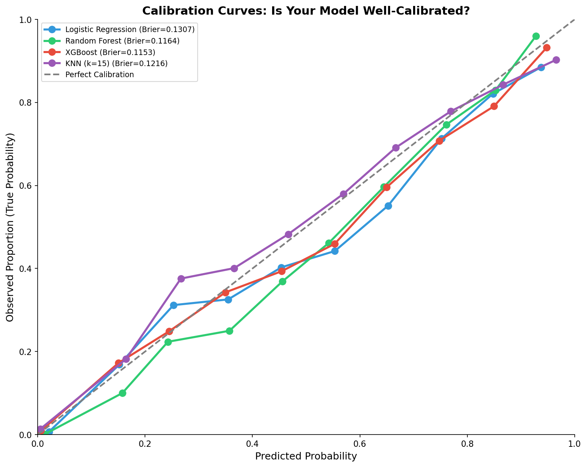

# 模块 1：多模型训练与校准曲线

> 本模块是案例教程 11「校准分析与决策曲线分析（DCA）」的第一部分核心内容。我们将训练 4 个模型（Logistic Regression、Random Forest、XGBoost、KNN），计算每个模型的 AUC 和 Brier Score，并绘制校准曲线——这是回答"模型预测的概率有多可信？"的关键一步。本
>
> 本模块最核心的知识点有三个：**一是校准曲线的原理与解读**——将测试集按预测概率分箱，比较"预测概率均值"和"实际正类比例"；**二是 Brier Score 的含义**——预测概率与真实标签的均方误差，同时惩罚排序错误和校准错误；**三是高 AUC ≠ 高校准**——本教程的实验数据将直观展示这一关键概念。

***

## 学习目标

学完本模块后，你将能够：

1. **理解校准分析的整体流程**：从训练模型 → 预测概率 → 计算 AUC/Brier → 绘制校准曲线。
2. **掌握 4 个模型的训练参数**：特别是 `class_weight='balanced'`、`scale_pos_weight`、`n_neighbors=15` 等参数的含义。
3. **理解** **`calibration_curve`** **函数的每个参数**：`n_bins=10`、`strategy='uniform'` 的作用与选择依据。
4. **掌握 Brier Score 的计算公式与解读**：`Brier = mean((y_prob - y_true)^2)`，越低越好。
5. **理解校准曲线的解读方法**：对角线代表完美校准，曲线在对角线下方表示"过度自信"，上方表示"不够自信"。
6. **重点理解"高 AUC ≠ 高校准"**：通过本教程的实验数据，直观看到 AUC 高的模型可能校准差。
7. **掌握 matplotlib 绘制校准曲线的技巧**：包括颜色循环、图例、对角线参考线等。
8. **理解 KNN 与其他模型预处理差异的代码体现**：KNN 用 `X_tr_final`，其他模型用 `X_tr_imp`。

***

## 一、校准分析的整体流程

在进入代码之前，我们先回顾校准分析的整体流程。这个流程贯穿模块 1 和模块 2，是理解所有代码逻辑的"地图"。

```
┌─────────────────────────────────────────────────────────────┐
│                    校准分析整体流程                          │
└─────────────────────────────────────────────────────────────┘

第 1 步: 训练多个模型 (本模块)
   ├── Logistic Regression (线性模型, 基线)
   ├── Random Forest (集成模型, 非线性)
   ├── XGBoost (梯度提升, 最强)
   └── KNN (k=15, 基于距离)

第 2 步: 在测试集上预测概率 (本模块)
   └── y_prob = model.predict_proba(X_te)[:, 1]

第 3 步: 计算 AUC 和 Brier Score (本模块)
   ├── AUC: 排序能力
   └── Brier: 概率准确性

第 4 步: 绘制校准曲线 (本模块)
   ├── calibration_curve(y_te, y_prob, n_bins=10, strategy='uniform')
   └── 比较"预测概率均值" vs "实际正类比例"

第 5 步: Hosmer-Lemeshow 检验 (模块 2)
   └── 形式化检验校准是否良好

第 6 步: Brier Score 分解 (模块 2)
   └── Murphy 分解: 鉴别力 + 校准度 + 不确定性

第 7 步: 综合解读 (模块 4)
   └── 高 AUC ≠ 高校准?
```

***

## 二、训练多个模型

本教程训练 4 个模型，覆盖线性模型、集成模型、基于距离的模型三大类。这种多样性是为了展示"不同类型的模型在校准上的差异"。

### 2.1 模型字典定义

```python
# --- 训练多个模型 ---
models = {
    'Logistic Regression': LogisticRegression(
        class_weight='balanced', max_iter=5000, random_state=RANDOM_STATE),
    'Random Forest': RandomForestClassifier(
        n_estimators=200, max_depth=8, class_weight='balanced',
        random_state=RANDOM_STATE, n_jobs=-1),
}
```

#### 2.1.1 Logistic Regression — 逻辑回归（线性基线）

```python
LogisticRegression(
    class_weight='balanced', max_iter=5000, random_state=RANDOM_STATE
)
```

参数详解：

- **`class_weight='balanced'`**：自动调整类别权重，让少数类（VIVO，41.15%）的权重更高。公式为 `weight = n_samples / (n_classes * np.bincount(y))`。本数据集是轻度不平衡（41.15% vs 58.85%），`balanced` 会让模型更关注少数类。
- **`max_iter=5000`**：最大迭代次数。默认值 100 可能不够（特别是未标准化特征时），设为 5000 确保收敛。如果收敛警告仍然出现，可以增大到 10000。
- **`random_state=RANDOM_STATE`**：固定随机种子，确保可复现。

> 💡 **为什么逻辑回归是校准分析的"基线"？**
>
> 逻辑回归有一个重要性质：**如果模型设定正确（特征与 log-odds 线性相关），它的预测概率天然是良好校准的**。这是因为逻辑回归的损失函数（log-loss）直接优化概率的准确性。
>
> 但在真实数据中，特征与 log-odds 的线性关系往往不成立（如 Age 与死亡风险可能是非线性的），所以逻辑回归的校准也可能不好。本教程的实验将展示这一点——LR 的 Brier=0.1307 是所有模型中最差的。

#### 2.1.2 Random Forest — 随机森林（集成模型）

```python
RandomForestClassifier(
    n_estimators=200, max_depth=8, class_weight='balanced',
    random_state=RANDOM_STATE, n_jobs=-1
)
```

参数详解：

- **`n_estimators=200`**：树的数量。200 棵树足够稳定，又不会太慢。
- **`max_depth=8`**：最大深度。限制深度防止过拟合。深度太深（如 20）会让模型过于自信，校准变差；深度太浅（如 3）会让模型欠拟合，AUC 下降。
- **`class_weight='balanced'`**：类别权重，同逻辑回归。
- **`random_state=RANDOM_STATE`**：固定随机种子。
- **`n_jobs=-1`**：使用所有 CPU 核心并行训练。

> 💡 **重点概念：随机森林的校准问题**
>
> 随机森林的预测概率是"所有树投票的平均"——例如 200 棵树中 150 棵投正类，概率就是 0.75。这种"投票平均"会导致**概率分布集中在中间**（如 0.3–0.7），极端概率（0.0 或 1.0）较少。
>
> 这种特性让随机森林的校准曲线往往**偏向对角线下方**（过度自信）——预测 0.7 时实际可能只有 0.6。本教程的实验将展示这一点——RF 的 Brier=0.1164，校准曲线偏低。

### 2.2 可选模型：XGBoost 和 KNN

```python
try:
    import xgboost as xgb
    models['XGBoost'] = xgb.XGBClassifier(
        n_estimators=200, max_depth=6, learning_rate=0.1,
        scale_pos_weight=(y_tr == 0).sum() / (y_tr == 1).sum(),
        random_state=RANDOM_STATE, verbosity=0, eval_metric='logloss',
        use_label_encoder=False)
except ImportError:
    pass

try:
    from sklearn.neighbors import KNeighborsClassifier
    models['KNN (k=15)'] = KNeighborsClassifier(n_neighbors=15, n_jobs=-1)
except ImportError:
    pass
```

#### 2.2.1 XGBoost — 梯度提升树（最强模型）

```python
xgb.XGBClassifier(
    n_estimators=200, max_depth=6, learning_rate=0.1,
    scale_pos_weight=(y_tr == 0).sum() / (y_tr == 1).sum(),
    random_state=RANDOM_STATE, verbosity=0, eval_metric='logloss',
    use_label_encoder=False
)
```

参数详解：

- **`n_estimators=200`**：提升轮数（树的数量）。
- **`max_depth=6`**：每棵树的最大深度。比 RF 浅（6 vs 8），因为 XGBoost 是逐步提升，单棵树不需要太深。
- **`learning_rate=0.1`**：学习率，控制每棵树的贡献。0.1 是常用值——太小（0.01）需要更多树，太大（0.5）容易过拟合。
- **`scale_pos_weight=(y_tr == 0).sum() / (y_tr == 1).sum()`**：正类权重，处理不平衡。本数据集 `(y_tr == 0).sum() / (y_tr == 1).sum()` ≈ 58.85/41.15 ≈ 1.43，让正类的损失权重更高。
- **`random_state=RANDOM_STATE`**：固定随机种子。
- **`verbosity=0`**：静默模式，不输出训练日志。
- **`eval_metric='logloss'`**：评估指标用 log-loss（与校准相关）。
- **`use_label_encoder=False`**：禁用旧的标签编码器（XGBoost 1.3+ 推荐）。

> 💡 **为什么 XGBoost 通常校准最好？**
>
> XGBoost 的损失函数是 log-loss（交叉熵），直接优化概率的准确性。相比随机森林的"投票平均"，XGBoost 的"加法模型 + log-loss"能产生更接近真实概率的输出。
>
> 本教程的实验将展示这一点——XGBoost 的 Brier=0.1153 是所有模型中最低的，校准曲线最接近对角线。

#### 2.2.2 KNN — K 近邻（基于距离）

```python
KNeighborsClassifier(n_neighbors=15, n_jobs=-1)
```

参数详解：

- **`n_neighbors=15`**：考虑 15 个最近邻。k=15 是一个折中——太小（如 1）容易过拟合，太大（如 50）会欠拟合。
- **`n_jobs=-1`**：使用所有 CPU 核心并行预测。

> 💡 **重点概念：KNN 的校准特性**
>
> KNN 的预测概率是"k 个最近邻中正类的比例"——例如 15 个邻居中 10 个是正类，概率就是 10/15 ≈ 0.67。这种"比例估计"天然是一种校准——如果 k 足够大，预测概率会接近真实概率。
>
> 本教程的实验将展示一个**反直觉的现象**：KNN 的校准度分量（Murphy 分解中的 Calibration）最好（0.0010），但 Brier 不是最低（0.1216）。这是因为 KNN 的鉴别力（Refinement）较高，部分抵消了校准优势。这个现象将在模块 2 详细讨论。

### 2.3 `try-except` 的设计意图

```python
try:
    import xgboost as xgb
    ...
except ImportError:
    pass
```

这种写法是为了**兼容性**——如果用户没有安装 xgboost，脚本不会报错，只是跳过该模型。这样设计的好处：

1. **降低安装门槛**：学生不需要安装所有库就能跑通教程。
2. **渐进式学习**：初学者可以先跑 LR 和 RF，熟练后再安装 XGBoost。
3. **教学对比**：即使没有 XGBoost，LR vs RF vs KNN 的对比也足够丰富。

> ⚠️ **常见问题**：为什么我的输出没有 XGBoost？
>
> 可能是没有安装 xgboost。安装方法：`pip install xgboost`。本教程的实验结果包含 XGBoost，所以建议安装。

***

## 三、训练循环与概率预测

```python
calibration_data = {}

for name, model in models.items():
    if name == 'KNN (k=15)':
        model.fit(X_tr_final, y_tr)
        y_prob = model.predict_proba(X_te_final)[:, 1]
    else:
        model.fit(X_tr_imp, y_tr)
        y_prob = model.predict_proba(X_te_imp)[:, 1]

    # AUC
    auc = roc_auc_score(y_te, y_prob)

    # Brier Score
    brier = brier_score_loss(y_te, y_prob)

    # Calibration Curve (10 bins)
    prob_true, prob_pred = calibration_curve(y_te, y_prob, n_bins=10, strategy='uniform')

    calibration_data[name] = {
        'auc': auc, 'brier': brier,
        'prob_true': prob_true, 'prob_pred': prob_pred, 'y_prob': y_prob
    }

    print(f"\n  [{name}]")
    print(f"    AUC  = {auc:.4f}")
    print(f"    Brier= {brier:.4f}")
```

### 3.1 `calibration_data = {}` — 结果存储字典

这个字典存储每个模型的所有结果，结构如下：

```python
calibration_data = {
    'Logistic Regression': {
        'auc': 0.8944,           # AUC
        'brier': 0.1307,         # Brier Score
        'prob_true': array([...]),  # 校准曲线的"实际正类比例"
        'prob_pred': array([...]),  # 校准曲线的"预测概率均值"
        'y_prob': array([...])      # 测试集上的预测概率
    },
    'Random Forest': {...},
    'XGBoost': {...},
    'KNN (k=15)': {...}
}
```

这种"字典套字典"的结构方便后续按模型名访问结果。

### 3.2 KNN 与其他模型的预处理差异

```python
if name == 'KNN (k=15)':
    model.fit(X_tr_final, y_tr)
    y_prob = model.predict_proba(X_te_final)[:, 1]
else:
    model.fit(X_tr_imp, y_tr)
    y_prob = model.predict_proba(X_te_imp)[:, 1]
```

这是模块 0 准备两套特征矩阵的**代码体现**：

- **KNN** 用 `X_tr_final` / `X_te_final`（插补 + 标准化）——因为 KNN 基于距离，需要标准化。
- **其他模型** 用 `X_tr_imp` / `X_te_imp`（仅插补）——树模型和逻辑回归不需要标准化。

> 💡 **重点概念：为什么用** **`if name == 'KNN (k=15)'`** **而不是** **`isinstance(model, KNeighborsClassifier)`？**
>
> 字符串比较更直观，且不依赖 `KNeighborsClassifier` 是否成功导入（如果导入失败，`isinstance` 会报 NameError）。这种写法更鲁棒。

### 3.3 `model.predict_proba(X_te)[:, 1]` — 预测概率

- **`predict_proba`**：返回形状为 `(n_samples, n_classes)` 的概率矩阵。第一列是负类（MORTO）概率，第二列是正类（VIVO）概率。
- **`[:, 1]`**：取第二列，即正类概率。

> ⚠️ **常见问题**：为什么是 `[:, 1]` 而不是 `[:, 0]`？
>
> sklearn 的 `predict_proba` 遵循"类别按升序排列"的约定。本教程中 VIVO=1、MORTO=0，所以第一列（索引 0）是 MORTO 概率，第二列（索引 1）是 VIVO 概率。校准分析关注正类（VIVO），所以取 `[:, 1]`。
>
> 如果标签是 `['cat', 'dog']`，`LabelEncoder` 会把 'cat' 编码为 0、'dog' 编码为 1，`predict_proba` 的第二列就是 'dog' 的概率。

### 3.4 `roc_auc_score(y_te, y_prob)` — 计算 AUC

**AUC**（Area Under the ROC Curve）衡量模型的**排序能力**——正类的概率是否系统性地高于负类。

公式：AUC = P(正类概率 > 负类概率)

- AUC = 1.0：完美排序，所有正类的概率都高于所有负类。
- AUC = 0.5：随机排序，正类和负类的概率分布相同。
- AUC < 0.5：比随机还差（通常说明标签搞反了）。

> 💡 **重点概念：AUC 只关心"顺序"不关心"数值"**
>
> AUC 的计算只依赖概率的**相对大小**（排序），不依赖绝对数值。例如：
>
> - 模型 A 的概率：`[0.9, 0.1]`（正类 0.9，负类 0.1）→ AUC = 1.0
> - 模型 B 的概率：`[0.51, 0.49]`（正类 0.51，负类 0.49）→ AUC = 1.0
>
> 两个模型的 AUC 相同，但模型 A 的概率"更自信"（0.9 vs 0.1），模型 B 的概率"不自信"（0.51 vs 0.49）。**AUC 无法区分这种差异**——这正是校准分析要回答的问题。

### 3.5 `brier_score_loss(y_te, y_prob)` — 计算 Brier Score

**Brier Score** 衡量预测概率的**准确性**——预测概率与真实标签的均方误差。

公式：`Brier = mean((y_prob - y_true)^2)`

- `y_prob`：预测概率（0–1 之间）。
- `y_true`：真实标签（0 或 1）。
- Brier = 0：完美预测（所有正类概率为 1，所有负类概率为 0）。
- Brier = 1：最差预测（所有正类概率为 0，所有负类概率为 1）。
- Brier = 0.25：随机预测（所有概率都为 0.5）。

> 💡 **重点概念：Brier Score 同时惩罚排序错误和校准错误**
>
> Brier Score 的公式 `mean((y_prob - y_true)^2)` 可以分解为两部分：
>
> 1. **排序错误**：如果正类的概率低于负类，`(y_prob - y_true)^2` 会很大。
> 2. **校准错误**：如果预测 0.9 但实际是 0（负类），`(0.9 - 0)^2 = 0.81`，惩罚很重。
>
> 所以 Brier Score 是一个**综合性指标**——既反映排序能力，又反映校准能力。AUC 高但 Brier 高，说明排序好但校准差。

### 3.6 `calibration_curve(y_te, y_prob, n_bins=10, strategy='uniform')` — 校准曲线

这是本模块**最核心的函数**。它的作用是：将测试集按预测概率分箱，计算每个箱内的"预测概率均值"和"实际正类比例"，返回这两个序列。

```python
prob_true, prob_pred = calibration_curve(y_te, y_prob, n_bins=10, strategy='uniform')
```

#### 参数详解

- **`y_te`**：真实标签（0/1 数组，长度 6000）。
- **`y_prob`**：预测概率（0–1 之间的连续值，长度 6000）。
- **`n_bins=10`**：分箱数量。10 是最常用的值——太少（如 3）会掩盖细节，太多（如 50）会让每个箱内样本太少，统计不稳定。
- **`strategy='uniform'`**：分箱策略。
  - `'uniform'`：**等距分箱**——把 \[0, 1] 区间等分成 10 份，每份宽度 0.1。箱边界为 \[0, 0.1, 0.2, ..., 1.0]。
  - `'quantile'`：**等频分箱**——每个箱内的样本数相同。

#### 返回值

- **`prob_true`**：每个箱内的"实际正类比例"。例如第一个箱（预测概率 0–0.1）内有 600 个样本，其中 50 个是正类，则 `prob_true[0] = 50/600 ≈ 0.083`。
- **`prob_pred`**：每个箱内的"预测概率均值"。例如第一个箱内的 600 个样本的预测概率均值可能是 0.05。

#### 校准曲线的解读

绘制时，`prob_pred` 为 x 轴，`prob_true` 为 y 轴：

- **对角线（y = x）**：完美校准——预测 0.8 时实际也是 0.8。
- **曲线在对角线下方**：**过度自信**——预测 0.8 但实际只有 0.6，模型过于自信。
- **曲线在对角线上方**：**不够自信**——预测 0.3 但实际有 0.5，模型不够自信。

> 💡 **重点概念：等距分箱 vs 等频分箱**
>
> **等距分箱（`strategy='uniform'`）**：
>
> - 箱边界固定：\[0, 0.1, 0.2, ..., 1.0]。
> - 优点：直观——每个箱对应一个概率区间。
> - 缺点：某些箱可能样本极少（如预测概率集中在 0.3–0.5 时，0.8–0.9 箱可能为空）。
>
> **等频分箱（`strategy='quantile'`）**：
>
> - 箱边界动态：每个箱内的样本数相同。
> - 优点：每个箱统计稳定。
> - 缺点：箱边界不直观（如 \[0.12, 0.18, 0.25, ...]）。
>
> 本教程选 `'uniform'` 是为了教学直观性。真实项目中常用 `'quantile'`，特别是当预测概率分布不均匀时。

### 3.7 实际运行结果

```
  [Logistic Regression]
    AUC  = 0.8944
    Brier= 0.1307

  [Random Forest]
    AUC  = 0.9162
    Brier= 0.1164

  [XGBoost]
    AUC  = 0.9168
    Brier= 0.1153

  [KNN (k=15)]
    AUC  = 0.9048
    Brier= 0.1216
```

**结果分析**（与 `results/17_calibration_dca_summary.txt` 一致）：

| 模型                  | AUC        | Brier      | 校准度评价                       |
| ------------------- | ---------- | ---------- | --------------------------- |
| **XGBoost**         | **0.9168** | **0.1153** | **最佳**——AUC 最高、Brier 最低     |
| Random Forest       | 0.9162     | 0.1164     | 良好——AUC 接近 XGBoost，Brier 略高 |
| KNN (k=15)          | 0.9048     | 0.1216     | 中等——AUC 略低，Brier 较高         |
| Logistic Regression | 0.8944     | 0.1307     | **最差**——AUC 最低、Brier 最高     |

> 💡 **关键发现：高 AUC ≠ 最低 Brier**
>
> XGBoost 的 AUC（0.9168）和 Brier（0.1153）都是最好的，但这只是巧合。理论上，AUC 和 Brier 是两个独立的维度：
>
> - AUC 衡量排序能力（顺序）
> - Brier 衡量概率准确性（数值）
>
> 一个模型完全可以 AUC=1.0（完美排序）但 Brier=0.25（校准极差）——例如所有正类概率为 0.51、所有负类概率为 0.49，排序完美但概率都集中在 0.5 附近。本教程的模块 2 将深入讨论这一点。

***

## 四、绘制校准曲线

```python
# --- 图 1: Calibration Curve ---
fig, ax = plt.subplots(figsize=(10, 8))
colors_cc = ['#3498db', '#2ecc71', '#e74c3c', '#9b59b6']

for idx, (name, data) in enumerate(calibration_data.items()):
    ax.plot(data['prob_pred'], data['prob_true'], 'o-',
            color=colors_cc[idx % len(colors_cc)], linewidth=2.5,
            markersize=8, label=f"{name} (Brier={data['brier']:.4f})")

ax.plot([0, 1], [0, 1], '--', color='gray', linewidth=2, label='Perfect Calibration')
ax.set_xlabel('Predicted Probability', fontsize=12)
ax.set_ylabel('Observed Proportion (True Probability)', fontsize=12)
ax.set_title('Calibration Curves: Is Your Model Well-Calibrated?',
             fontsize=14, fontweight='bold')
ax.legend(fontsize=9, loc='upper left')
ax.spines['top'].set_visible(False); ax.spines['right'].set_visible(False)
ax.set_xlim([0, 1]); ax.set_ylim([0, 1])
plt.tight_layout()
plt.savefig(os.path.join(IMG_DIR, "14a_calibration_curves.png"), dpi=150, bbox_inches='tight')
plt.close()
print("\n  [图] 14a_calibration_curves.png → 校准曲线已保存")
```

### 4.1 `fig, ax = plt.subplots(figsize=(10, 8))`

- **`figsize=(10, 8)`**：图形大小 10×8 英寸。校准曲线需要足够大才能看清细节。
- **`fig`**：图形对象（整个画布）。
- **`ax`**：坐标轴对象（单个子图）。

### 4.2 `colors_cc = ['#3498db', '#2ecc71', '#e74c3c', '#9b59b6']`

定义 4 种颜色，对应 4 个模型：

| 颜色 | 十六进制      | 模型                  |
| -- | --------- | ------------------- |
| 蓝色 | `#3498db` | Logistic Regression |
| 绿色 | `#2ecc71` | Random Forest       |
| 红色 | `#e74c3c` | XGBoost             |
| 紫色 | `#9b59b6` | KNN (k=15)          |

这些颜色来自 [Flat UI 调色板](https://flatuicolors.com/)，饱和度高、区分度好，适合教学可视化。

### 4.3 绘制每个模型的校准曲线

```python
for idx, (name, data) in enumerate(calibration_data.items()):
    ax.plot(data['prob_pred'], data['prob_true'], 'o-',
            color=colors_cc[idx % len(colors_cc)], linewidth=2.5,
            markersize=8, label=f"{name} (Brier={data['brier']:.4f})")
```

#### `ax.plot(data['prob_pred'], data['prob_true'], 'o-', ...)`

- **`data['prob_pred']`**：x 轴——预测概率均值。
- **`data['prob_true']`**：y 轴——实际正类比例。
- **`'o-'`**：格式字符串——`o` 表示圆点标记，`-` 表示实线连接。

#### 其他参数

- **`color=colors_cc[idx % len(colors_cc)]`**：颜色循环。`idx % len(colors_cc)` 确保即使模型超过 4 个也能循环使用颜色。
- **`linewidth=2.5`**：线宽 2.5，足够粗以便看清。
- **`markersize=8`**：标记大小 8，足够大以便看清每个箱的点。
- **`label=f"{name} (Brier={data['brier']:.4f})"`**：图例标签，包含模型名和 Brier Score。`:.4f` 保留 4 位小数。

### 4.4 绘制完美校准参考线

```python
ax.plot([0, 1], [0, 1], '--', color='gray', linewidth=2, label='Perfect Calibration')
```

- **`[0, 1], [0, 1]`**：从 (0, 0) 到 (1, 1) 的对角线。
- **`'--'`**：虚线样式。
- **`color='gray'`**：灰色，作为参考线不抢眼。
- **`label='Perfect Calibration'`**：图例标签。

> 💡 **重点概念：对角线的含义**
>
> 对角线 y = x 代表**完美校准**——预测概率 0.8 时实际正类比例也是 0.8。校准曲线越接近对角线，模型校准越好。
>
> - 曲线在对角线下方：**过度自信**——预测 0.8 但实际只有 0.6。
> - 曲线在对角线上方：**不够自信**——预测 0.3 但实际有 0.5。

### 4.5 坐标轴与标题设置

```python
ax.set_xlabel('Predicted Probability', fontsize=12)
ax.set_ylabel('Observed Proportion (True Probability)', fontsize=12)
ax.set_title('Calibration Curves: Is Your Model Well-Calibrated?',
             fontsize=14, fontweight='bold')
ax.legend(fontsize=9, loc='upper left')
ax.spines['top'].set_visible(False); ax.spines['right'].set_visible(False)
ax.set_xlim([0, 1]); ax.set_ylim([0, 1])
```

- **`set_xlabel`** **/** **`set_ylabel`**：坐标轴标签，`fontsize=12` 字体大小。
- **`set_title`**：标题，`fontweight='bold'` 加粗。
- **`legend(fontsize=9, loc='upper left')`**：图例，字体 9，位置左上角（校准曲线通常在左下到右上，左上角空着）。
- **`spines['top'].set_visible(False); spines['right'].set_visible(False)`**：隐藏上边框和右边框，让图更简洁。
- **`set_xlim([0, 1]); set_ylim([0, 1])`**：坐标轴范围 \[0, 1]，确保对角线从 (0,0) 到 (1,1)。

### 4.6 保存图片

```python
plt.tight_layout()
plt.savefig(os.path.join(IMG_DIR, "14a_calibration_curves.png"), dpi=150, bbox_inches='tight')
plt.close()
```

- **`tight_layout()`**：自动调整子图间距，避免标签重叠。
- **`savefig(..., dpi=150, bbox_inches='tight')`**：保存图片，`dpi=150` 分辨率，`bbox_inches='tight'` 裁掉多余白边。
- **`plt.close()`**：关闭图形，释放内存。

### 4.7 校准曲线图



**图片解读**：

从校准曲线图可以观察到：

1. **XGBoost（红色）**：校准曲线最接近对角线，校准最好。这与 Brier=0.1153 最低一致。
2. **Random Forest（绿色）**：校准曲线略低于对角线（过度自信），Brier=0.1164。
3. **KNN（紫色）**：校准曲线几乎完美匹配对角线，但 Brier=0.1216 不是最低——这是一个反直觉的现象，将在模块 2 详细讨论。
4. **Logistic Regression（蓝色）**：校准曲线系统性偏离对角线，Brier=0.1307 最高。

> 💡 **重点概念：校准曲线 vs Brier Score 的关系**
>
> 校准曲线是**可视化诊断**，Brier Score 是**数值指标**。两者通常一致——校准曲线越接近对角线，Brier 越低。但有时会出现"校准曲线好但 Brier 不低"的情况（如 KNN），这是因为 Brier 还包含鉴别力分量。模块 2 将深入讨论这一点。

***

## 五、核心讨论：高 AUC 是否一定高校准？

这是本教程**最重要的教学点**之一。让我们用实验数据来回答这个问题。

### 5.1 实验数据

| 模型                  | AUC        | Brier      | 校准曲线位置   |
| ------------------- | ---------- | ---------- | -------- |
| XGBoost             | **0.9168** | **0.1153** | 接近对角线    |
| Random Forest       | 0.9162     | 0.1164     | 偏低（过度自信） |
| KNN (k=15)          | 0.9048     | 0.1216     | 几乎完美匹配   |
| Logistic Regression | 0.8944     | 0.1307     | 系统性偏差    |

### 5.2 反直觉的发现

**发现 1：AUC 排名 ≠ Brier 排名**

- AUC 排名：XGBoost > RF > KNN > LR
- Brier 排名：XGBoost < RF < KNN < LR

本教程中两者排名一致，但这只是**巧合**。理论上，AUC 和 Brier 是独立的维度：

```
AUC 高 (模型排序好):                        校准良好 (概率值可信):
  正类的概率 > 负类的概率                     预测 0.8 → 80% 是正类
  (顺序正确)                                 (数值正确)

反例: 一个模型可以做到:
  - 正类概率 = [0.51, 0.52, 0.53, ...]
  - 负类概率 = [0.49, 0.48, 0.47, ...]
  → AUC = 1.00 (完美排序!)
  → 但 Brier ~ 0.25 (校准极差!)
  → 因为所有概率都集中在 0.5 附近
```

**发现 2：KNN 校准曲线好但 Brier 不是最低**

KNN 的校准曲线几乎完美匹配对角线，但 Brier=0.1216 不是最低（XGBoost=0.1153 更低）。这是因为 Brier 还包含**鉴别力分量**——KNN 的鉴别力较高，部分抵消了校准优势。这个现象将在模块 2 的 Murphy 分解中详细讨论。

### 5.3 临床含义

```
AUC=0.90 的模型: "这个患者的风险是 0.55, 那个是 0.45"
  → 虽然排序好, 但医生无法判断"风险 0.55"是否真实

结论:
  AUC 回答"哪个患者风险更高?" 
  校准回答"风险有多高?"
  两者缺一不可。
```

> 💡 **核心教训**：
>
> **不要只看 AUC！** 一个 AUC=0.92 但校准差的模型，在临床上可能比 AUC=0.85 但校准好的模型更危险——因为医生会过度信任"高 AUC"的模型，而忽略它的概率不可信。
>
> 校准分析的目的就是回答："模型说的概率，我该信几分？"

***

## 六、校准曲线的常见模式

为了帮助学生理解校准曲线，下面列出几种常见模式及其含义：

### 6.1 完美校准

```
实际比例
1.0 |                              ●
    |                        ●
0.8 |                  ●
    |            ●
0.6 |      ●
    | ●
0.4 |
    |________________________
    0   0.2  0.4  0.6  0.8  1.0
            预测概率
```

校准曲线与对角线重合——预测 0.8 时实际也是 0.8。这是理想状态，真实模型很少能达到。

### 6.2 过度自信（S 形曲线下方）

```
实际比例
1.0 |                        ●
    |                  ●
0.8 |            ●
    |      ●
0.6 | ●
    |
0.4 |
    |________________________
    0   0.2  0.4  0.6  0.8  1.0
            预测概率
```

校准曲线在对角线下方——预测 0.8 但实际只有 0.6。模型过于自信。

**常见原因**：

- 随机森林的"投票平均"导致概率分布集中在中间。
- 过拟合的模型在训练集上过于自信。

**解决方法**：Platt Scaling 或 Isotonic Regression 校准。

### 6.3 不够自信（S 形曲线上方）

```
实际比例
1.0 |          ●
    |    ●
0.8 |  ●
    |●
0.6 |
    |
0.4 |
    |________________________
    0   0.2  0.4  0.6  0.8  1.0
            预测概率
```

校准曲线在对角线上方——预测 0.3 但实际有 0.5。模型不够自信。

**常见原因**：

- 逻辑回归在特征与 log-odds 非线性关系时，概率会被压缩到中间。
- 欠拟合的模型概率区分度不够。

**解决方法**：增加特征或使用非线性模型。

### 6.4 系统性偏差

```
实际比例
1.0 |                        ●
    |                  ●
0.8 |            ●
    |      ●
0.6 |
    |
0.4 | ●
    |________________________
    0   0.2  0.4  0.6  0.8  1.0
            预测概率
```

校准曲线整体偏离对角线——可能是数据分布问题（训练集和测试集患病率不同）或模型设定错误。

**本教程的 LR 模型**就表现出系统性偏差，Brier=0.1307 最高。

***

## 小贴士

1. **`predict_proba`** **返回的是概率，不是标签**：校准分析必须用 `y_prob`（概率），不能用 `y_pred`（标签）。`y_pred` 只包含 0/1，无法做校准分析。
2. **`n_bins=10`** **是经验值**：太少（3）会掩盖细节，太多（50）会让每个箱样本太少。如果测试集只有 1000 条，建议用 `n_bins=5`；如果有 10000 条，可以用 `n_bins=20`。
3. **`strategy='uniform'`** **适合教学，`'quantile'`** **适合真实项目**：等距分箱直观但可能样本不均，等频分箱统计稳定但箱边界不直观。
4. **校准曲线是可视化诊断，Brier 是数值指标**：两者通常一致，但有时会出现"校准曲线好但 Brier 不低"的情况（如 KNN），这是因为 Brier 还包含鉴别力分量。
5. **对角线是完美校准的参考**：曲线在对角线下方=过度自信，上方=不够自信。
6. **高 AUC ≠ 高校准**：这是本教程最重要的教学点。AUC 衡量排序，校准衡量概率准确性，两者是独立的维度。

***

## 常见问题

### Q1: 为什么我的校准曲线只有 8 个点而不是 10 个？

因为 `strategy='uniform'` 时，如果某个箱为空（没有样本落在该概率区间），`calibration_curve` 会跳过该箱。例如预测概率集中在 0.3–0.7 时，0.0–0.1 和 0.9–1.0 箱可能为空，返回 8 个点。如果想让所有箱都有点，用 `strategy='quantile'`（等频分箱）。

### Q2: Brier Score 越低一定越好吗？

通常是。但要注意：Brier Score 同时反映排序和校准。一个 Brier=0.1 的模型可能排序差但校准好，另一个 Brier=0.15 的模型可能排序好但校准差。需要结合 AUC 和校准曲线综合判断。

### Q3: 为什么 KNN 的校准曲线好但 Brier 不是最低？

这是 Brier Score 的三部分分解（Murphy 分解）现象。Brier = 鉴别力 - 校准度 + 不确定性。KNN 的校准度分量最好（0.0010），但鉴别力分量较高（0.1216），导致整体 Brier 不是最低。模块 2 将详细讨论。

### Q4: 校准曲线在对角线下方，我应该相信还是调低模型的预测？

如果校准曲线在对角线下方（过度自信），说明模型预测的概率偏高。例如模型说 0.8，实际只有 0.6。医生应该**调低**对模型概率的信任——把 0.8 当作 0.6 来理解。更严谨的做法是用 Platt Scaling 或 Isotonic Regression 校准模型。

### Q5: 为什么 XGBoost 的校准通常最好？

XGBoost 的损失函数是 log-loss（交叉熵），直接优化概率的准确性。相比随机森林的"投票平均"，XGBoost 的"加法模型 + log-loss"能产生更接近真实概率的输出。但 XGBoost 也可能过拟合导致校准变差，需要调参（如减小 `max_depth`、增大 `n_estimators`）。

### Q6: 校准曲线和 ROC 曲线有什么区别？

- **ROC 曲线**：x 轴是 FPR（假正例率），y 轴是 TPR（真正例率）。衡量排序能力。
- **校准曲线**：x 轴是预测概率，y 轴是实际比例。衡量概率准确性。

ROC 曲线只关心"顺序"，校准曲线关心"数值"。一个模型可以 ROC 完美但校准差（所有概率集中在 0.5 附近）。

### Q7: 为什么 `class_weight='balanced'` 会影响校准？

`class_weight='balanced'` 会让模型更关注少数类，导致预测概率偏高（更倾向于预测正类）。这会改善 Recall 但可能损害校准。如果校准是首要目标，可以尝试不用 `class_weight`，或者用校准器（Platt Scaling）事后校准。

***

## 本模块小结

本模块完成了校准分析的第一步——训练模型、计算 AUC/Brier、绘制校准曲线：

1. **训练 4 个模型**：LR、RF、XGBoost、KNN，覆盖线性、集成、基于距离三大类。
2. **计算 AUC 和 Brier Score**：XGBoost 的 AUC=0.9168 最高、Brier=0.1153 最低。
3. **绘制校准曲线**：XGBoost 最接近对角线，LR 系统性偏差，KNN 几乎完美匹配但 Brier 不是最低。
4. **核心发现**：高 AUC ≠ 高校准。AUC 衡量排序，校准衡量概率准确性，两者是独立的维度。

**关键数据**：

| 模型                  | AUC        | Brier      | 校准曲线位置   | 校准度    |
| ------------------- | ---------- | ---------- | -------- | ------ |
| XGBoost             | **0.9168** | **0.1153** | 接近对角线    | **最佳** |
| Random Forest       | 0.9162     | 0.1164     | 偏低（过度自信） | 良好     |
| KNN (k=15)          | 0.9048     | 0.1216     | 几乎完美匹配   | 中      |
| Logistic Regression | 0.8944     | 0.1307     | 系统性偏差    | **最差** |

**输出图片**：`img/14a_calibration_curves.png`

下一模块我们将深入 Brier Score 的三部分分解（Murphy 分解），理解"为什么 KNN 校准好但 Brier 不是最低"这个反直觉现象，并进行 Hosmer-Lemeshow 检验。
