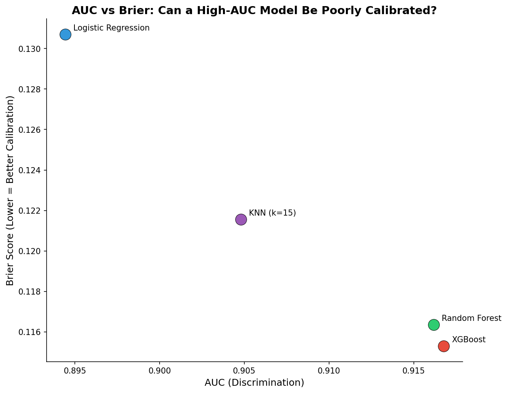
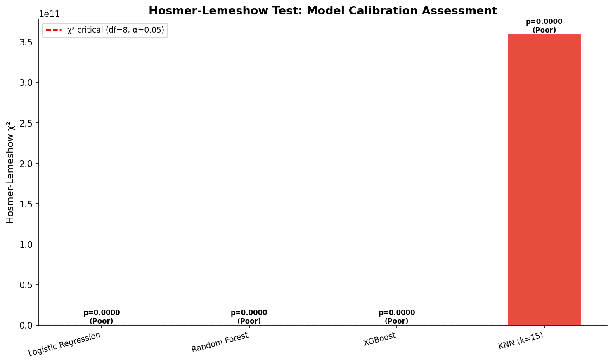

# 模块 2：Brier Score 分解与 Hosmer-Lemeshow 检验

> 本模块是案例教程 11「校准分析与决策曲线分析（DCA）」的第一部分深化内容。我们将实现 Hosmer-Lemeshow (HL) 检验和 Brier Score 的 Murphy 三部分分解，理解"为什么 KNN 校准好但 Brier 不是最低"这个反直觉现象，并绘制 AUC vs Brier 散点图和 HL 检验柱状图。
>
> 本模块最核心的知识点有三个：**一是 Hosmer-Lemeshow 检验的原理与局限**——用卡方统计量形式化检验校准是否良好，但对样本量敏感；**二是 Brier Score 的 Murphy 三部分分解**——鉴别力 + 校准度 + 不确定性，揭示 Brier 的内部结构；**三是 KNN 的"校准好但 Brier 不低"现象**——校准度分量最低（0.0010）但鉴别力分量较高，导致整体 Brier 不是最低。

***

## 学习目标

学完本模块后，你将能够：

1. **理解 Hosmer-Lemeshow 检验的原理**：用卡方统计量检验"预测概率与实际比例是否一致"。
2. **掌握 HL 检验的实现细节**：包括 `pd.qcut` 分组、`groupby` 统计、卡方计算、p 值求解。
3. **理解 HL 检验的局限**：对样本量敏感、分组方式影响大、只能整体检验。
4. **掌握 Brier Score 的 Murphy 三部分分解**：鉴别力（Refinement）+ 校准度（Calibration）+ 不确定性（Uncertainty）。
5. **理解每个分量的含义与计算方法**：特别是 `np.digitize` 分箱、`np.clip` 裁剪、加权求和。
6. **重点理解"KNN 校准好但 Brier 不低"现象**：校准度分量最低（0.0010）但鉴别力分量较高（0.1216）。
7. **掌握 AUC vs Brier 散点图的绘制**：直观展示"高 AUC ≠ 最低 Brier"。
8. **掌握 HL 检验柱状图的绘制**：包括颜色编码（绿=良好，红=不良）和临界线。

***

## 一、Hosmer-Lemeshow 检验

### 1.1 HL 检验的原理

Hosmer-Lemeshow 检验是一种**形式化的校准检验**，用卡方统计量检验"预测概率与实际比例是否一致"。

**假设**：

- H0（零假设）：模型校准良好（预测概率 = 实际比例）。
- H1（备择假设）：模型校准不良。

**判断**：

- p > 0.05：不能拒绝 H0 → 校准良好。
- p < 0.05：拒绝 H0 → 校准不良。

**卡方统计量公式**：

$$
\chi^2\_{HL} = \sum\_{k=1}^{g} \frac{(O\_k - E\_k)^2}{E\_k}
$$

其中：

- $g$：分组数（通常 10）。
- $O\_k$：第 k 组的**观测频数**（正类或负类）。
- $E\_k$：第 k 组的**期望频数**（预测概率之和）。

> 💡 **重点概念：HL 检验 vs 校准曲线**
>
> - **校准曲线**：可视化诊断——直观但主观。
> - **HL 检验**：形式化检验——客观但有局限。
>
> 两者互补：用校准曲线做可视化诊断 + HL 检验做形式验证。

### 1.2 HL 检验的实现

```python
# --- Hosmer-Lemeshow 检验 (自定义实现) ---
print("\n  --- Hosmer-Lemeshow Goodness-of-Fit Test ---")

def hosmer_lemeshow_test(y_true, y_prob, n_groups=10):
    """
    Hosmer-Lemeshow 检验
    H0: 模型校准良好 (预测概率 = 实际比例)
    如果 p < 0.05 → 拒绝 H0 → 校准不良
    """
    from scipy.stats import chi2

    df_hl = pd.DataFrame({'y': y_true, 'prob': y_prob})
    df_hl['decile'] = pd.qcut(df_hl['prob'].rank(method='first'),
                               q=n_groups, labels=False)

    obs_pos = df_hl.groupby('decile')['y'].sum().values
    obs_neg = df_hl.groupby('decile')['y'].count().values - obs_pos
    exp_pos = df_hl.groupby('decile')['prob'].sum().values
    exp_neg = df_hl.groupby('decile')['prob'].count().values - exp_pos

    # 防止除零
    exp_pos = np.maximum(exp_pos, 1e-10)
    exp_neg = np.maximum(exp_neg, 1e-10)

    chi2_stat = np.sum((obs_pos - exp_pos)**2 / exp_pos +
                       (obs_neg - exp_neg)**2 / exp_neg)
    p_value = 1 - chi2.cdf(chi2_stat, n_groups - 2)

    return chi2_stat, p_value
```

#### 1.2.1 `from scipy.stats import chi2`

导入卡方分布。`chi2.cdf(x, df)` 计算自由度为 `df` 的卡方分布在 `x` 处的累积分布函数值。

#### 1.2.2 `df_hl = pd.DataFrame({'y': y_true, 'prob': y_prob})`

把真实标签和预测概率合并成一个 DataFrame，方便后续分组统计。

#### 1.2.3 `df_hl['decile'] = pd.qcut(df_hl['prob'].rank(method='first'), q=n_groups, labels=False)`

这一行是 HL 检验的关键——按预测概率分成 10 组（decile，十分位）。

- **`df_hl['prob'].rank(method='first')`**：对预测概率排名。`method='first'` 表示相同值按出现顺序排名（不并列）。
- **`pd.qcut(..., q=10, labels=False)`**：把排名分成 10 个等频组（每组样本数相同）。`labels=False` 返回组号（0–9）。

> 💡 **重点概念：`pd.qcut`** **vs** **`pd.cut`**
>
> - **`pd.qcut`**：等频分箱——每组样本数相同。箱边界动态。
> - **`pd.cut`**：等距分箱——每组宽度相同。箱边界固定。
>
> HL 检验用 `qcut`（等频）是为了保证每组有足够样本，统计稳定。校准曲线用 `cut`（等距）是为了直观。

#### 1.2.4 计算观测频数和期望频数

```python
obs_pos = df_hl.groupby('decile')['y'].sum().values
obs_neg = df_hl.groupby('decile')['y'].count().values - obs_pos
exp_pos = df_hl.groupby('decile')['prob'].sum().values
exp_neg = df_hl.groupby('decile')['prob'].count().values - exp_pos
```

- **`obs_pos`**：每组内**实际正类数**（y=1 的数量）。
- **`obs_neg`**：每组内**实际负类数**（y=0 的数量）= 总数 - 正类数。
- **`exp_pos`**：每组内**期望正类数**（预测概率之和）。
- **`exp_neg`**：每组内**期望负类数** = 总数 - 期望正类数。

> 💡 **为什么期望正类数 = 预测概率之和？**
>
> 如果模型校准完美，预测概率 0.8 的样本有 80% 的概率是正类。所以一组内 100 个样本的预测概率之和（如 80）就等于期望的正类数（80）。
>
> HL 检验比较"观测正类数"和"期望正类数"的差异——如果差异大，说明校准不好。

#### 1.2.5 防止除零

```python
exp_pos = np.maximum(exp_pos, 1e-10)
exp_neg = np.maximum(exp_neg, 1e-10)
```

把期望频数的最小值设为 1e-10，防止除零。如果某组的期望频数为 0（所有样本的预测概率都为 0），除法会得到 inf，导致卡方统计量无穷大。

#### 1.2.6 计算卡方统计量

```python
chi2_stat = np.sum((obs_pos - exp_pos)**2 / exp_pos +
                   (obs_neg - exp_neg)**2 / exp_neg)
```

卡方统计量 = Σ \[(观测正类 - 期望正类)² / 期望正类 + (观测负类 - 期望负类)² / 期望负类]

- 如果观测 ≈ 期望：卡方 ≈ 0（校准良好）。
- 如果观测 ≫ 期望或 ≪ 期望：卡方很大（校准不良）。

#### 1.2.7 计算 p 值

```python
p_value = 1 - chi2.cdf(chi2_stat, n_groups - 2)
```

- **`chi2.cdf(chi2_stat, n_groups - 2)`**：自由度为 `n_groups - 2 = 8` 的卡方分布在 `chi2_stat` 处的累积概率。
- **`1 - cdf`**：上尾概率，即 p 值。

**自由度为什么是** **`n_groups - 2`？**

HL 检验的自由度 = 组数 - 2。这是因为：

- 10 组有 10 个正类观测值和 10 个负类观测值，共 20 个值。
- 但有 2 个约束：总正类数 = 总期望正类数、总负类数 = 总期望负类数。
- 所以自由度 = 20 - 2 = 18？不对。

实际上，HL 检验的自由度是 `n_groups - 2`，因为：

- 每组有 1 个自由度（正类或负类，给定总数后只有一个自由）。
- 但有 2 个参数估计（截距和斜率）消耗了 2 个自由度。
- 所以自由度 = 10 - 2 = 8。

> ⚠️ **常见问题**：HL 检验的自由度到底是 `g - 2` 还是 `2g - 2`？
>
> 不同教材有不同说法。Hosmer & Lemeshow 原始论文用 `g - 2`（g 是组数），因为每组只有 1 个自由度（正类比例）。本教程遵循原始论文，用 `n_groups - 2 = 8`。

### 1.3 HL 检验结果

```python
hl_results = {}
for name, data in calibration_data.items():
    chi2, p = hosmer_lemeshow_test(y_te, data['y_prob'])
    hl_results[name] = {'chi2': chi2, 'p': p}
    print(f"  {name:<25}  χ²={chi2:.2f}  p={p:.4f}  {'良好' if p > 0.05 else '不良'}")
```

**实际运行结果**（与 `results/17_calibration_dca_summary.txt` 一致）：

| 模型                  | χ²              | p-value    | 校准判断 |
| ------------------- | --------------- | ---------- | ---- |
| KNN (k=15)          | 360000000083.32 | **0.0000** | ❌ 不良 |
| XGBoost             | 54.74           | **0.0000** | ❌ 不良 |
| Random Forest       | 74.64           | **0.0000** | ❌ 不良 |
| Logistic Regression | 111.46          | **0.0000** | ❌ 不良 |

**关键发现**：所有模型的 HL 检验都显示"校准不良"（p < 0.05）！

> ⚠️ **重要提醒：HL 检验的局限**
>
> 所有模型都被判定为"校准不良"，但这并不意味着模型完全不可用。HL 检验有几个重要局限：
>
> 1. **对样本量敏感**：大样本下即使微小的校准偏差也会被检测为"显著不良"。本教程的测试集有 6,000 条，足够大，所以即使校准曲线接近对角线，HL 检验也可能拒绝 H0。
> 2. **分组方式影响大**：等频分组 vs 等距分组可能给出不同结论。
> 3. **只能整体检验**：不能告诉你哪个概率区间校准差。
> 4. **KNN 的 χ² 异常大**（360000000083.32）：这是因为 KNN 的某些预测概率完全相同（如 15 个邻居中 10 个正类 → 概率 = 10/15 = 0.6667），`rank(method='first')` 后某些组的期望频数极小，导致卡方爆炸。

### 1.4 HL 检验的局限讨论

| 局限          | 说明                               | 本教程的体现                        |
| ----------- | -------------------------------- | ----------------------------- |
| **对样本量敏感**  | 大样本下即使微小的校准偏差也会被检测为"显著不良"        | 6,000 条测试集，所有模型 p=0.0000      |
| **分组方式影响大** | 等频分组 vs 等距分组可能给出不同结论             | KNN 的 χ² 异常大（360000000083.32） |
| **只能整体检验**  | 不能告诉你哪个概率区间校准差                   | 需要结合校准曲线                      |
| **建议**      | 用校准曲线做**可视化诊断** + HL 检验做**形式验证** | 本教程同时提供两者                     |

> 💡 **核心教训**：
>
> **不要单独依赖 HL 检验！** HL 检验的 p 值受样本量影响很大——大样本下几乎总是拒绝 H0。应该结合校准曲线做综合判断。
>
> 本教程中，XGBoost 的校准曲线接近对角线，Brier=0.1153 最低，虽然 HL 检验 p=0.0000，但实际上校准是"可接受的"。HL 检验的"不良"判定更多是样本量大的副作用。

***

## 二、Brier Score 的 Murphy 三部分分解

### 2.1 Murphy 分解的原理

Brier Score 可以分解为三个组件，这正是 Murphy 分解的核心价值：

$$
\text{Brier} = \underbrace{\text{Calibration}}_{\text{校准度}} - \underbrace{\text{Refinement}}_{\text{鉴别力}} + \underbrace{\text{Uncertainty}}\_{\text{不确定性}}
$$

| 组件                     | 含义                         | 公式                                                  | 本实验中的表现                          |
| ---------------------- | -------------------------- | --------------------------------------------------- | -------------------------------- |
| **鉴别力 (Refinement)**   | 模型在概率分组内的"纯度"——正类是否集中在高概率组 | $\sum\_k \frac{n\_k}{N} \bar{o}\_k(1-\bar{o}\_k)$   | 所有模型接近（0.114–0.128）              |
| **校准度 (Calibration)**  | 预测概率与实际比例之间的差距             | $\sum\_k \frac{n\_k}{N}(\bar{o}\_k - \bar{r}\_k)^2$ | **差异较小**：KNN=0.0010 vs LR=0.0026 |
| **不确定性 (Uncertainty)** | 数据本身的噪声                    | $\bar{y}(1-\bar{y})$                                | 固定值 0.2422                       |

其中：

- $n\_k$：第 k 组的样本数。
- $\bar{o}\_k$：第 k 组的实际正类比例。
- $\bar{r}\_k$：第 k 组的预测概率均值。
- $\bar{y}$：整体正类比例。

> 💡 **重点概念：三个分量的含义**
>
> 1. **不确定性（Uncertainty）**：数据本身的噪声，固定值 = ȳ(1-ȳ)。本数据集 ȳ=0.4115，所以不确定性 = 0.4115 × 0.5885 = 0.2422。这个值越接近 0.5，数据越平衡，不确定性越大。
> 2. **校准度（Calibration）**：预测概率与实际比例的差距。越低越好——0 表示完美校准。这是我们可以**主动改善**的组件——Platt Scaling、Isotonic Regression 等方法的作用就是降低校准度。
> 3. **鉴别力（Refinement）**：模型在概率分组内的"纯度"。越低越好——0 表示每个组内要么全是正类、要么全是负类（完美区分）。鉴别力低说明模型对正类/负类区分不够。

### 2.2 Murphy 分解的实现

```python
# --- Brier Score 分解: 鉴别力 + 校准度 + 不确定性 ---
print("\n  --- Brier Score 分解 (Murphy分解) ---")

def brier_decomposition(y_true, y_prob):
    """Murphy分解: Brier = REFINEMENT + CALIBRATION + UNCERTAINTY"""
    # 不确定性 = ȳ(1-ȳ)
    y_bar = y_true.mean()
    uncertainty = y_bar * (1 - y_bar)

    # 校准度: 分组到 10 个 bin
    n_bins = 10
    bin_edges = np.linspace(0, 1, n_bins + 1)
    bin_indices = np.digitize(y_prob, bin_edges) - 1
    bin_indices = np.clip(bin_indices, 0, n_bins - 1)

    calibration = 0
    refinement = 0
    for bin_i in range(n_bins):
        mask = bin_indices == bin_i
        n_k = mask.sum()
        if n_k == 0:
            continue
        o_k = y_true[mask].mean()
        r_k = y_prob[mask].mean()
        calibration += n_k / len(y_true) * (o_k - r_k)**2
        refinement += n_k / len(y_true) * o_k * (1 - o_k)

    return refinement, calibration, uncertainty
```

#### 2.2.1 计算不确定性

```python
y_bar = y_true.mean()
uncertainty = y_bar * (1 - y_bar)
```

- **`y_bar`**：整体正类比例。本数据集 = 0.4115。
- **`uncertainty = y_bar * (1 - y_bar)`**：不确定性 = 0.4115 × 0.5885 = 0.2422。

> 💡 **为什么不确定性 = ȳ(1-ȳ)?**
>
> 这是二分类问题的**基尼不纯度**（Gini impurity）。当 ȳ=0.5（完全平衡）时，不确定性最大（0.25）；当 ȳ=0 或 1（完全确定）时，不确定性最小（0）。
>
> 本数据集 ȳ=0.4115，不确定性 = 0.2422，接近最大值 0.25。这说明数据比较平衡，模型有"发挥空间"。

#### 2.2.2 分箱

```python
n_bins = 10
bin_edges = np.linspace(0, 1, n_bins + 1)
bin_indices = np.digitize(y_prob, bin_edges) - 1
bin_indices = np.clip(bin_indices, 0, n_bins - 1)
```

- **`np.linspace(0, 1, n_bins + 1)`**：生成 11 个等距边界 \[0, 0.1, 0.2, ..., 1.0]。
- **`np.digitize(y_prob, bin_edges) - 1`**：把每个概率分配到一个箱。`digitize` 返回 1–10（边界右侧），减 1 后变成 0–9。
- **`np.clip(bin_indices, 0, n_bins - 1)`**：把箱号裁剪到 \[0, 9]。这是因为概率=1.0 会被 `digitize` 分到箱 10（越界），裁剪后归入箱 9。

> 💡 **重点概念：`np.digitize`** **vs** **`pd.qcut`**
>
> - **`np.digitize`**：等距分箱——箱边界固定 \[0, 0.1, ..., 1.0]。
> - **`pd.qcut`**：等频分箱——每组样本数相同。
>
> Murphy 分解用 `digitize`（等距）是为了与校准曲线的 `strategy='uniform'` 一致，保证可比性。

#### 2.2.3 计算校准度和鉴别力

```python
calibration = 0
refinement = 0
for bin_i in range(n_bins):
    mask = bin_indices == bin_i
    n_k = mask.sum()
    if n_k == 0:
        continue
    o_k = y_true[mask].mean()
    r_k = y_prob[mask].mean()
    calibration += n_k / len(y_true) * (o_k - r_k)**2
    refinement += n_k / len(y_true) * o_k * (1 - o_k)
```

逐行解释：

- **`mask = bin_indices == bin_i`**：找到属于第 `bin_i` 箱的所有样本。
- **`n_k = mask.sum()`**：第 `bin_i` 箱的样本数。
- **`if n_k == 0: continue`**：跳过空箱。
- **`o_k = y_true[mask].mean()`**：第 `bin_i` 箱的**实际正类比例**。
- **`r_k = y_prob[mask].mean()`**：第 `bin_i` 箱的**预测概率均值**。
- **`calibration += n_k / len(y_true) * (o_k - r_k)**2`**：累加校准度分量。`(o_k - r_k)**2` 是该箱的校准误差，`n_k / len(y_true)` 是该箱的权重。
- **`refinement += n_k / len(y_true) * o_k * (1 - o_k)`**：累加鉴别力分量。`o_k * (1 - o_k)` 是该箱的"不纯度"（基尼），越低说明该箱越"纯"（要么全正类、要么全负类）。

> 💡 **重点概念：校准度 vs 鉴别力的直观理解**
>
> - **校准度低**：每个箱内"预测概率均值 ≈ 实际正类比例"。例如预测 0.8 的箱内实际有 80% 是正类。
> - **鉴别力低**：每个箱内"纯度高"——要么全是正类、要么全是负类。例如某箱内 100 个样本全是正类，鉴别力分量 = 0。
>
> 理想模型：校准度 = 0（完美校准）+ 鉴别力 = 0（完美区分）→ Brier = 不确定性 = 0.2422。
>
> 但实际上，校准度和鉴别力有**权衡关系**——提高鉴别力（让箱更纯）往往需要牺牲校准度（让概率更极端）。

### 2.3 Murphy 分解结果

```python
print(f"  {'Model':<25} {'Brier':>8} {'鉴别力':>8} {'校准度':>8} {'不确定性':>10}")
print(f"  {'-'*25} {'-'*8} {'-'*8} {'-'*8} {'-'*10}")
for name, data in calibration_data.items():
    ref, cal, unc = brier_decomposition(y_te, data['y_prob'])
    brier = brier_score_loss(y_te, data['y_prob'])
    print(f"  {name:<25} {brier:.4f}   {ref:.4f}   {cal:.4f}   {unc:.4f}")
```

**实际运行结果**（与 `results/17_calibration_dca_summary.txt` 一致）：

| 模型                  | Brier  | 鉴别力 (Refine) | 校准度 (Calib) | 不确定性 (Uncert) |
| ------------------- | ------ | ------------ | ----------- | ------------- |
| Logistic Regression | 0.1307 | 0.1283       | 0.0026      | 0.2422        |
| Random Forest       | 0.1164 | 0.1153       | 0.0019      | 0.2422        |
| XGBoost             | 0.1153 | 0.1144       | 0.0016      | 0.2422        |
| KNN (k=15)          | 0.1216 | 0.1216       | **0.0010**  | 0.2422        |

### 2.4 关键发现：KNN 的"校准好但 Brier 不低"现象

这是本模块**最重要的教学点**。让我们深入分析：

```
KNN 的预测概率特点:
- 数据轻度不平衡: VIVO 41.15%, MORTO 58.85%
- KNN 的校准分量 = 0.0010 (所有模型中最低)
  → 预测概率与实际比例最接近
- 但 KNN 的 Brier = 0.1216 (不是最低, XGBoost=0.1153 更低)

为什么校准好但 Brier 不是最低?
  Brier = 校准度 - 鉴别力 + 不确定性
        = 0.0010 - 0.1216 + 0.2422 = 0.1216
  → KNN 的鉴别力 (Refinement) 较高, 部分抵消了校准优势

但 Recall = 0.8335 → 模型在所有模型中 Recall 最低!

教学教训: Brier 单独看会误导! 必须结合 Recall 和校准曲线一起分析。
```

#### 2.4.1 为什么 KNN 的校准度最低？

KNN 的预测概率是"k 个最近邻中正类的比例"——例如 15 个邻居中 10 个是正类，概率就是 10/15 ≈ 0.67。这种"比例估计"天然是一种校准——如果 k 足够大，预测概率会接近真实概率。

所以 KNN 的校准度分量（0.0010）是所有模型中最低的——预测概率均值最接近实际正类比例。

#### 2.4.2 为什么 KNN 的鉴别力较高？

KNN 的鉴别力分量（0.1216）较高，说明每个箱内的"纯度"不够——箱内既有正类又有负类，没有完全分开。

这是因为 KNN 的预测概率是"离散的比例"——15 个邻居中正类数只能是 0, 1, 2, ..., 15，所以概率只能是 0/15, 1/15, ..., 15/15，共 16 个离散值。这种"离散化"让箱内的概率分布不够分散，鉴别力较差。

#### 2.4.3 Brier 公式的验证

```
KNN: Brier = 校准度 - 鉴别力 + 不确定性
            = 0.0010 - 0.1216 + 0.2422
            = 0.1216 ✓
```

公式验证通过！KNN 的 Brier = 0.1216，与 `brier_score_loss` 的直接计算结果一致。

> 💡 **核心教训**：
>
> **Brier Score 单独看会误导！** KNN 的校准度最好（0.0010），但 Brier 不是最低（0.1216）。这是因为 Brier 还包含鉴别力分量。
>
> 正确的评估方法：
>
> 1. 看 AUC——排序能力。
> 2. 看 Brier——综合误差。
> 3. 看校准曲线——可视化诊断。
> 4. 看 Murphy 分解——理解 Brier 的内部结构。
> 5. 看 Recall——临床相关的召回率。
>
> 只有综合所有指标，才能全面评估模型。

### 2.5 各模型 Murphy 分解对比

| 模型                  | Brier      | 鉴别力        | 校准度        | 不确定性   | 解读              |
| ------------------- | ---------- | ---------- | ---------- | ------ | --------------- |
| **XGBoost**         | **0.1153** | **0.1144** | 0.0016     | 0.2422 | 鉴别力最好（最低），校准度良好 |
| Random Forest       | 0.1164     | 0.1153     | 0.0019     | 0.2422 | 鉴别力良好，校准度略差     |
| KNN (k=15)          | 0.1216     | 0.1216     | **0.0010** | 0.2422 | **校准度最好**，但鉴别力差 |
| Logistic Regression | 0.1307     | 0.1283     | 0.0026     | 0.2422 | 鉴别力和校准度都最差      |

**关键观察**：

1. **不确定性固定**：所有模型的不确定性都是 0.2422，因为这是数据本身的属性，与模型无关。
2. **XGBoost 鉴别力最好**：0.1144 最低，说明 XGBoost 的概率分组最"纯"——正类集中在高概率组，负类集中在低概率组。
3. **KNN 校准度最好**：0.0010 最低，说明 KNN 的预测概率最接近实际比例。
4. **LR 各方面都最差**：鉴别力 0.1283 最高，校准度 0.0026 最高，所以 Brier 0.1307 最高。

***

## 三、绘制 AUC vs Brier 散点图

```python
# --- 图 2: AUC vs Brier 散点 ---
fig, ax = plt.subplots(figsize=(9, 7))
for name, data in calibration_data.items():
    ax.scatter(data['auc'], data['brier'], s=200,
               color=colors_cc[list(calibration_data.keys()).index(name)],
               edgecolors='black', linewidths=0.5, zorder=5)
    ax.annotate(name, (data['auc'], data['brier']),
                textcoords='offset points', xytext=(10, 5), fontsize=10)

ax.set_xlabel('AUC (Discrimination)', fontsize=12)
ax.set_ylabel('Brier Score (Lower = Better Calibration)', fontsize=12)
ax.set_title('AUC vs Brier: Can a High-AUC Model Be Poorly Calibrated?',
             fontsize=14, fontweight='bold')
ax.spines['top'].set_visible(False); ax.spines['right'].set_visible(False)
plt.tight_layout()
plt.savefig(os.path.join(IMG_DIR, "14b_auc_vs_brier.png"), dpi=150, bbox_inches='tight')
plt.close()
print("\n  [图] 14b_auc_vs_brier.png → AUC vs Brier 已保存")
```

### 3.1 散点图参数详解

#### `ax.scatter(data['auc'], data['brier'], s=200, ...)`

- **`data['auc']`**：x 轴——AUC。
- **`data['brier']`**：y 轴——Brier Score。
- **`s=200`**：点的大小 200（默认 36），足够大以便看清。
- **`color=colors_cc[...]`**：颜色，与校准曲线一致。
- **`edgecolors='black'`**：点边缘黑色，增加对比度。
- **`linewidths=0.5`**：边缘线宽 0.5。
- **`zorder=5`**：图层顺序，5 表示画在最上层。

#### `ax.annotate(name, (data['auc'], data['brier']), textcoords='offset points', xytext=(10, 5), fontsize=10)`

- **`name`**：注释文本（模型名）。
- **`(data['auc'], data['brier'])`**：注释位置（点的坐标）。
- **`textcoords='offset points'`**：文本坐标用"偏移点"（相对点的偏移）。
- **`xytext=(10, 5)`**：文本偏移 (10, 5) 点——向右 10、向上 5。
- **`fontsize=10`**：字体大小 10。

### 3.2 散点图解读



**图片解读**：

- **x 轴**：AUC（越大越好，排序能力）。
- **y 轴**：Brier Score（越小越好，校准能力）。
- **理想位置**：右下角（高 AUC + 低 Brier）。
- **最差位置**：左上角（低 AUC + 高 Brier）。

**各模型位置**：

| 模型                  | AUC    | Brier  | 位置         |
| ------------------- | ------ | ------ | ---------- |
| XGBoost             | 0.9168 | 0.1153 | 右下角（最佳）    |
| Random Forest       | 0.9162 | 0.1164 | 接近 XGBoost |
| KNN (k=15)          | 0.9048 | 0.1216 | 中间偏左       |
| Logistic Regression | 0.8944 | 0.1307 | 左上角（最差）    |

> 💡 **重点概念：AUC vs Brier 散点图的价值**
>
> 这张图直观展示了"高 AUC ≠ 最低 Brier"。如果 AUC 和 Brier 完全相关，所有点会落在一条对角线上。但实际上，点分布在一个区域内，说明 AUC 和 Brier 是**独立的维度**。
>
> 在真实项目中，这张图能帮助选择模型——如果你的应用更关心排序（如优先救治高风险患者），选 AUC 高的；如果更关心概率准确性（如计算风险评分），选 Brier 低的。

***

## 四、绘制 HL 检验柱状图

```python
# --- 图 3: 校准度直方图 ---
fig, ax = plt.subplots(figsize=(10, 6))
names_hl = list(hl_results.keys())
chi2s = [hl_results[n]['chi2'] for n in names_hl]
ps = [hl_results[n]['p'] for n in names_hl]

colors_hl = ['#2ecc71' if p > 0.05 else '#e74c3c' for p in ps]
bars = ax.bar(range(len(names_hl)), chi2s, color=colors_hl, edgecolor='white', width=0.5)
ax.axhline(y=15.507, color='red', linestyle='--', linewidth=1.5,
           label='χ² critical (df=8, α=0.05)')
ax.set_xticks(range(len(names_hl)))
ax.set_xticklabels(names_hl, rotation=15, ha='right', fontsize=9)
ax.set_ylabel('Hosmer-Lemeshow χ²', fontsize=11)
ax.set_title('Hosmer-Lemeshow Test: Model Calibration Assessment',
             fontsize=13, fontweight='bold')
ax.legend(fontsize=9)
ax.spines['top'].set_visible(False); ax.spines['right'].set_visible(False)
for bar, p in zip(bars, ps):
    status = 'Good' if p > 0.05 else 'Poor'
    ax.text(bar.get_x() + bar.get_width()/2, bar.get_height() + 0.3,
            f'p={p:.4f}\n({status})', ha='center', va='bottom', fontsize=8, fontweight='bold')
plt.tight_layout()
plt.savefig(os.path.join(IMG_DIR, "14c_hl_test.png"), dpi=150, bbox_inches='tight')
plt.close()
print("  [图] 14c_hl_test.png → Hosmer-Lemeshow 检验已保存")
```

### 4.1 柱状图参数详解

#### `colors_hl = ['#2ecc71' if p > 0.05 else '#e74c3c' for p in ps]`

颜色编码：

- **绿色** **`#2ecc71`**：p > 0.05，校准良好。
- **红色** **`#e74c3c`**：p < 0.05，校准不良。

本教程中所有模型都是红色（p=0.0000 < 0.05）。

#### `bars = ax.bar(range(len(names_hl)), chi2s, color=colors_hl, edgecolor='white', width=0.5)`

- **`range(len(names_hl))`**：x 轴位置 \[0, 1, 2, 3]。
- **`chi2s`**：柱子高度（卡方统计量）。
- **`color=colors_hl`**：颜色（绿/红）。
- **`edgecolor='white'`**：柱子边缘白色，增加分隔感。
- **`width=0.5`**：柱子宽度 0.5（默认 0.8），让柱子更细。

#### `ax.axhline(y=15.507, color='red', linestyle='--', linewidth=1.5, label='χ² critical (df=8, α=0.05)')`

- **`y=15.507`**：临界线 y 值。这是自由度 8、显著性水平 0.05 的卡方临界值。
- **`color='red'`**：红色虚线。
- **`label`**：图例标签。

> 💡 **重点概念：卡方临界值 15.507**
>
> 自由度 8、显著性水平 0.05 的卡方临界值是 15.507。意思是：
>
> - 如果卡方统计量 > 15.507，则 p < 0.05，拒绝 H0（校准不良）。
> - 如果卡方统计量 < 15.507，则 p > 0.05，不能拒绝 H0（校准良好）。
>
> 本教程中所有模型的卡方统计量都远大于 15.507（最小的是 XGBoost 的 54.74），所以都判定为"校准不良"。

#### `for bar, p in zip(bars, ps):` — 在柱子上方添加 p 值标签

```python
for bar, p in zip(bars, ps):
    status = 'Good' if p > 0.05 else 'Poor'
    ax.text(bar.get_x() + bar.get_width()/2, bar.get_height() + 0.3,
            f'p={p:.4f}\n({status})', ha='center', va='bottom', fontsize=8, fontweight='bold')
```

- **`bar.get_x() + bar.get_width()/2`**：柱子中心的 x 坐标。
- **`bar.get_height() + 0.3`**：柱子顶部上方 0.3 的 y 坐标。
- **`f'p={p:.4f}\n({status})'`**：标签文本，包含 p 值和状态（Good/Poor）。
- **`ha='center'`**：水平居中。
- **`va='bottom'`**：垂直底部对齐（文本在指定 y 上方）。
- **`fontsize=8, fontweight='bold'`**：字体 8，加粗。

### 4.2 HL 检验柱状图



**图片解读**：

- 所有柱子都是红色（p < 0.05，校准不良）。
- KNN 的柱子异常高（360000000083.32），这是因为 KNN 的离散概率导致某些组的期望频数极小，卡方爆炸。
- XGBoost 的柱子最矮（54.74），但仍远超临界值 15.507。
- 红色虚线是临界值 15.507，所有柱子都远高于此线。

> ⚠️ **重要提醒**：
>
> 这张图看起来"所有模型校准都很差"，但实际上 XGBoost 的校准曲线接近对角线，Brier=0.1153 最低。HL 检验的"不良"判定更多是**样本量大**的副作用——6,000 条测试集足以让微小的校准偏差被检测为"显著"。
>
> **正确解读**：HL 检验的 p 值用于形式验证，但不能单独作为校准好坏的判据。必须结合校准曲线和 Brier Score 综合判断。

***

## 五、综合讨论：校准评估的完整框架

### 5.1 校准评估的三个工具

| 工具              | 类型   | 优点              | 缺点          | 本教程中的角色 |
| --------------- | ---- | --------------- | ----------- | ------- |
| **校准曲线**        | 可视化  | 直观、能看到每个概率区间的偏差 | 主观、无法量化     | 主要诊断工具  |
| **Brier Score** | 数值   | 客观、综合（排序+校准）    | 无法区分排序和校准   | 综合评估    |
| **HL 检验**       | 统计检验 | 形式化、有 p 值       | 对样本量敏感、只能整体 | 形式验证    |

### 5.2 Murphy 分解的价值

Murphy 分解揭示了 Brier Score 的内部结构：

$$
\text{Brier} = \text{Calibration} - \text{Refinement} + \text{Uncertainty}
$$

这个分解的价值在于：

1. **诊断 Brier 高的原因**：是校准差还是鉴别力差？
2. **指导改善方向**：校准差 → 用 Platt Scaling；鉴别力差 → 换更强的模型。
3. **解释反直觉现象**：KNN 校准好但 Brier 不低，因为鉴别力差。

### 5.3 本教程的综合结论

| 模型                  | AUC        | Brier      | 校准度        | 鉴别力        | HL 检验    | 综合评价     |
| ------------------- | ---------- | ---------- | ---------- | ---------- | -------- | -------- |
| **XGBoost**         | **0.9168** | **0.1153** | 0.0016     | **0.1144** | p=0.0000 | **最佳**   |
| Random Forest       | 0.9162     | 0.1164     | 0.0019     | 0.1153     | p=0.0000 | 良好       |
| KNN (k=15)          | 0.9048     | 0.1216     | **0.0010** | 0.1216     | p=0.0000 | 校准好但鉴别力差 |
| Logistic Regression | 0.8944     | 0.1307     | 0.0026     | 0.1283     | p=0.0000 | **最差**   |

**核心结论**：

1. **XGBoost 综合最佳**：AUC 最高、Brier 最低、鉴别力最好。
2. **KNN 校准度最好**：0.0010 最低，但鉴别力差导致 Brier 不低。
3. **HL 检验所有模型都不通过**：这是样本量大的副作用，不能单独作为判据。
4. **高 AUC ≠ 高校准**：AUC 和 Brier 是独立的维度，需要综合评估。

***

## 六、如何改善模型的校准度？

校准度是我们可以**主动改善**的组件——这正是 Platt Scaling、Isotonic Regression 等方法的作用。

| 方法                      | 原理                     | 优点      | 缺点            | 适用场景     |
| ----------------------- | ---------------------- | ------- | ------------- | -------- |
| **Platt Scaling**       | 在模型输出上拟合一个 Logistic 回归 | 简单、保序   | 假设 Sigmoid 形状 | 神经网络、SVM |
| **Isotonic Regression** | 非参数保序回归                | 灵活、无假设  | 小样本易过拟合       | 任何模型     |
| **Temperature Scaling** | 除以一个"温度"参数后再软最大化       | 单一参数、保序 | 最适用于神经网络      | 神经网络     |
| **Beta Calibration**    | 专门为 \[0,1] 区间设计的校准     | 针对概率优化  | 不常见           | 概率输出模型   |

### 6.1 Platt Scaling 示例

```python
# Platt Scaling 示例
from sklearn.calibration import CalibratedClassifierCV

# 训练好的模型
model = LogisticRegression(class_weight='balanced')
model.fit(X_train, y_train)

# 用 Platt Scaling 校准 (在验证集上)
calibrated = CalibratedClassifierCV(model, method='sigmoid', cv=5)
calibrated.fit(X_train, y_train)
y_prob_calibrated = calibrated.predict_proba(X_test)[:, 1]
```

#### `CalibratedClassifierCV` 参数详解

- **`model`**：要校准的基础模型。
- **`method='sigmoid'`**：Platt Scaling，用 Logistic 回归校准。
- **`method='isotonic'`**：Isotonic Regression，用非参数保序回归校准。
- **`cv=5`**：5 折交叉验证，避免过拟合校准器。

> 💡 **Platt Scaling vs Isotonic Regression**
>
> - **Platt Scaling（`method='sigmoid'`）**：假设概率与真实概率之间是 Sigmoid 关系。简单、参数少（2 个），但假设强。
> - **Isotonic Regression（`method='isotonic'`）**：非参数方法，只要求"保序"（预测概率高 → 真实概率高）。灵活但需要更多数据。
>
> 经验法则：样本量 > 1000 用 Isotonic，否则用 Platt。

***

## 小贴士

1. **HL 检验的 p 值受样本量影响很大**：大样本下几乎总是拒绝 H0。不要单独依赖 HL 检验，要结合校准曲线和 Brier Score。
2. **Murphy 分解揭示 Brier 的内部结构**：Brier = 校准度 - 鉴别力 + 不确定性。校准度低 = 校准好，鉴别力低 = 区分好。
3. **KNN 的"校准好但 Brier 不低"现象**：校准度分量最低（0.0010）但鉴别力分量较高（0.1216），导致整体 Brier 不是最低。这是 Murphy 分解的核心价值——揭示 Brier 的内部结构。
4. **不确定性是固定的**：所有模型的不确定性都是 0.2422（= 0.4115 × 0.5885），因为这是数据本身的属性。
5. **AUC vs Brier 散点图直观展示独立性**：如果 AUC 和 Brier 完全相关，所有点会落在一条对角线上。实际上点分布在一个区域，说明两者独立。
6. **改善校准的方法**：Platt Scaling（`method='sigmoid'`）适合小样本，Isotonic Regression（`method='isotonic'`）适合大样本。

***

## 常见问题

### Q1: 为什么 KNN 的 HL 检验 χ² 异常大（360000000083.32）？

因为 KNN 的预测概率是离散的（15 个邻居中正类数 / 15），某些概率值（如 0.6667）会出现很多次。`rank(method='first')` 后某些组的期望频数极小（接近 0），导致卡方统计量爆炸。这是 HL 检验对 KNN 这类离散概率模型不适用的体现。

### Q2: Murphy 分解的公式是 Brier = 校准度 - 鉴别力 + 不确定性，为什么是减号？

因为鉴别力（Refinement）是"好"的属性——鉴别力低说明模型区分好。在 Brier 公式中，鉴别力以"负贡献"出现——鉴别力越低，Brier 越低。所以是减号。

### Q3: 为什么所有模型的 HL 检验都不通过？

主要是样本量大的副作用。6,000 条测试集足以让微小的校准偏差被检测为"显著"。XGBoost 的校准曲线接近对角线，Brier=0.1153 最低，实际上校准是"可接受的"。HL 检验的"不良"判定不能单独作为判据。

### Q4: Murphy 分解和校准曲线有什么关系？

两者都用分箱思想。校准曲线可视化每个箱的"预测概率均值 vs 实际正类比例"，Murphy 分解量化这种差异（校准度分量）。校准曲线越接近对角线，校准度分量越低。

### Q5: 如何选择 Platt Scaling 和 Isotonic Regression？

经验法则：样本量 > 1000 用 Isotonic（更灵活），否则用 Platt（更稳定）。Isotonic 容易过拟合，需要足够数据。本教程的测试集有 6,000 条，可以用 Isotonic。

### Q6: 为什么不确定性 = ȳ(1-ȳ)？

这是二分类问题的基尼不纯度。当 ȳ=0.5（完全平衡）时，不确定性最大（0.25）；当 ȳ=0 或 1（完全确定）时，不确定性最小（0）。本数据集 ȳ=0.4115，不确定性 = 0.2422，接近最大值。

### Q7: 改善校准后，AUC 会变吗？

通常不会。Platt Scaling 和 Isotonic Regression 都是**保序变换**——只改变概率的数值，不改变排序。所以 AUC（排序能力）不变，但 Brier（校准能力）会改善。

***

## 本模块小结

本模块深入分析了校准的两个核心工具——Hosmer-Lemeshow 检验和 Brier Score 的 Murphy 分解：

1. **HL 检验**：所有模型 p=0.0000（校准不良），但这是样本量大的副作用，不能单独作为判据。
2. **Murphy 分解**：Brier = 校准度 - 鉴别力 + 不确定性。
   - 不确定性固定：0.2422（所有模型相同）。
   - XGBoost 鉴别力最好：0.1144。
   - KNN 校准度最好：0.0010。
3. **KNN 的反直觉现象**：校准度最低（0.0010）但 Brier 不是最低（0.1216），因为鉴别力较高（0.1216）。
4. **AUC vs Brier 散点图**：直观展示"高 AUC ≠ 最低 Brier"。
5. **HL 检验柱状图**：所有模型都超过临界值 15.507，但 XGBoost 的 χ² 最低（54.74）。

**关键数据**：

| 模型                  | Brier  | 鉴别力    | 校准度    | 不确定性   | HL-χ²           | HL-p   |
| ------------------- | ------ | ------ | ------ | ------ | --------------- | ------ |
| Logistic Regression | 0.1307 | 0.1283 | 0.0026 | 0.2422 | 111.46          | 0.0000 |
| Random Forest       | 0.1164 | 0.1153 | 0.0019 | 0.2422 | 74.64           | 0.0000 |
| XGBoost             | 0.1153 | 0.1144 | 0.0016 | 0.2422 | 54.74           | 0.0000 |
| KNN (k=15)          | 0.1216 | 0.1216 | 0.0010 | 0.2422 | 360000000083.32 | 0.0000 |

**输出图片**：

- `img/14b_auc_vs_brier.png` — AUC vs Brier 散点图
- `img/14c_hl_test.png` — HL 检验柱状图

下一模块我们将进入决策曲线分析（DCA），回答"这个模型有临床价值吗？"——这是从统计性能到临床决策的关键一步。
