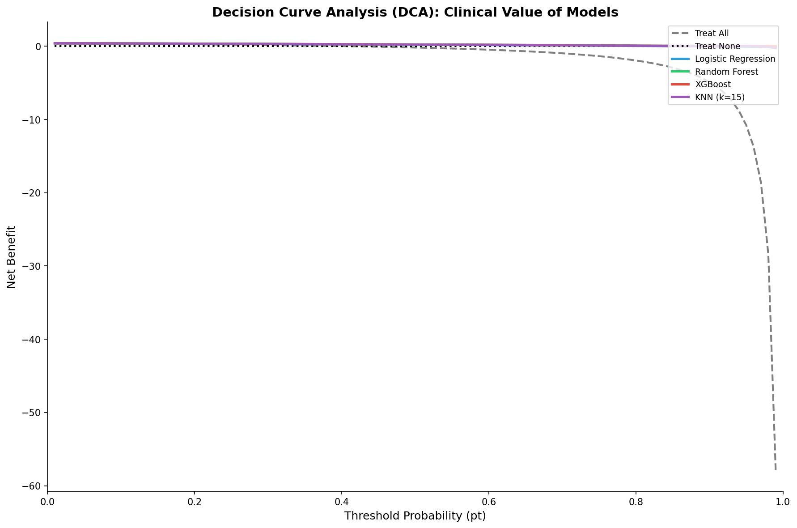
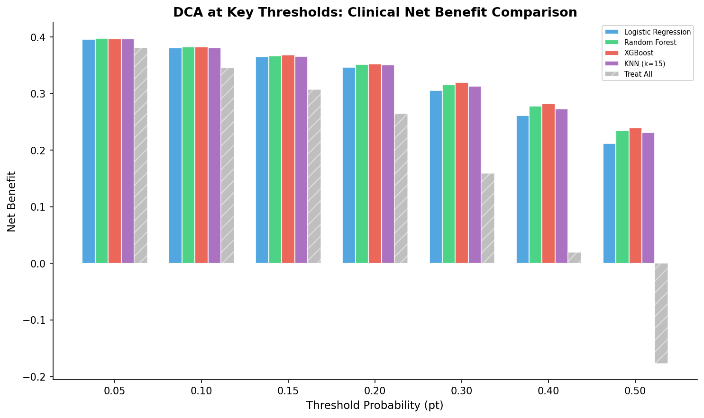

# 模块 3：决策曲线分析（DCA）

> 本模块是案例教程 11「校准分析与决策曲线分析（DCA）」的第二部分核心内容。我们将实现决策曲线分析（DCA），计算不同阈值下的净获益（Net Benefit），绘制 DCA 曲线，分析临床获益范围，并对比各模型在关键阈值下的表现。
>
> 本模块最核心的知识点有三个：**一是 DCA 的核心思想**——不同疾病有不同的决策阈值，DCA 评估模型在哪些阈值下比"全治/全不治"更有价值；**二是净获益（Net Benefit）公式的含义**——`NB = TP/N - FP/N × pt/(1-pt)`，权衡正确干预和错误干预；**三是 DCA 的三条基线**——Treat All（全治）、Treat None（全不治）、Model（模型），模型曲线应高于两条基线才有临床价值。

***

## 学习目标

学完本模块后，你将能够：

1. **理解 DCA 的核心思想**：为什么不同疾病有不同的决策阈值，DCA 如何评估模型的临床价值。
2. **掌握净获益（Net Benefit）公式**：`NB = TP/N - FP/N × pt/(1-pt)`，每一项的含义。
3. **理解 DCA 的三条基线**：Treat All、Treat None、Model 的含义与曲线形状。
4. **掌握 DCA 的 Python 实现**：包括 `dca_net_benefit`、`dca_treat_all`、`dca_treat_none` 三个函数。
5. **理解阈值数组的生成**：`np.linspace(0.01, 0.99, 99)` 生成 99 个阈值。
6. **掌握临床获益范围的分析方法**：找到模型优于 Treat All 和 Treat None 的阈值范围。
7. **掌握 DCA 曲线的绘制**：包括三条基线、模型曲线、坐标轴设置。
8. **掌握 DCA 阈值对比柱状图的绘制**：在关键阈值下对比各模型的净获益。
9. **理解 DCA 的临床含义**：统计显著 ≠ 临床获益，DCA 是唯一直接评价临床决策价值的方法。

***

## 一、DCA 的核心思想

### 1.1 为什么需要 DCA？

传统的二分类使用 0.5 作为决策阈值——任何预测概率 > 0.5 就干预，否则不干预。但临床上，**不同疾病的决策阈值是不同的**。

```
决策阈值的临床决定因素:

阈值低 (pt=0.01):                      阈值高 (pt=0.50):
  "有点风险就干预"                        "非常确定才干预"
  ✅ 癌症筛查                            ✅ 化疗决策
  ✅ 传染病隔离                          ✅ 大型手术
  ✅ 生命危险场景                          ✅ 副作用大的治疗

  漏诊代价高 → 阈值低                     误治代价高 → 阈值高
```

DCA 通过计算**不同阈值下的净获益**，回答："这个模型在哪些阈值下比'全治 / 全不治'更有价值？"

### 1.2 DCA vs 传统指标的区别

| 指标              | 回答的问题         | 局限                  |
| --------------- | ------------- | ------------------- |
| **AUC**         | 模型排序能力如何？     | 不回答"该不该干预"          |
| **Brier Score** | 概率准确性如何？      | 不回答"该不该干预"          |
| **校准曲线**        | 概率可信度如何？      | 不回答"该不该干预"          |
| **DCA**         | **模型有临床价值吗？** | **唯一直接评价临床决策价值的方法** |

> 💡 **核心概念：DCA 的独特价值**
>
> DCA 是唯一将统计指标"翻译"为临床决策的方法。它回答的不是"模型准不准"，而是"模型有没有用"——在哪些阈值下使用模型能比"全治"或"全不治"带来更多临床获益。
>
> 这就是为什么 DCA 已经成为医学 AI 论文的新标准——为审稿人和临床医生提供直观的"临床价值证明"。

### 1.3 DCA 的三条基线

DCA 图通常包含三条曲线：

| 策略             | 含义             | 净获益曲线               |
| -------------- | -------------- | ------------------- |
| **Treat All**  | 所有患者都干预        | 高阈值时急剧下降（因为 FP 代价大） |
| **Treat None** | 所有患者都不干预       | 始终为 0               |
| **Model**      | 仅当预测概率 > 阈值时干预 | 有一个"临床获益区间"         |

**模型有临床价值的条件**：Model 曲线在某个阈值范围内**同时高于** Treat All 和 Treat None 曲线。

***

## 二、净获益（Net Benefit）公式

### 2.1 公式

$$
\text{Net Benefit} = \frac{TP}{N} - \frac{FP}{N} \times \frac{p\_t}{1-p\_t}
$$

其中：

- $p\_t$：决策阈值。
- $TP$：真正例数（模型预测正类且实际正类）。
- $FP$：假正例数（模型预测正类但实际负类）。
- $N$：总样本数。

### 2.2 公式含义

- **第一项** **`TP/N`**：正确干预带来的获益——真正需要治疗的患者被治疗的比例。
- **第二项** **`FP/N × pt/(1-pt)`**：错误干预的代价——不需要治疗的患者被治疗的比例，乘以代价权重 `pt/(1-pt)`。

### 2.3 代价权重 `pt/(1-pt)` 的含义

代价权重 `pt/(1-pt)` 随阈值 $p\_t$ 变化：

| 阈值 $p\_t$ | 代价权重 `pt/(1-pt)` | 含义                  |
| --------- | ---------------- | ------------------- |
| 0.01      | 0.0101           | FP 代价很小——漏诊代价高，宁可误治 |
| 0.10      | 0.1111           | FP 代价较小             |
| 0.50      | 1.0000           | FP 代价 = TP 获益       |
| 0.90      | 9.0000           | FP 代价很大——误治代价高，宁可漏诊 |
| 0.99      | 99.0000          | FP 代价极大             |

**直观理解**：

- **当 $p\_t$ 很小时**（如 0.01）：FP 的权重也很小（0.0101）→ 模型只需要避免 FN（漏诊）。
- **当 $p\_t$ 很大时**（如 0.90）：FP 的权重也很大（9.0）→ 模型必须避免 FP（误治）。

> 💡 **重点概念：代价权重的临床含义**
>
> 代价权重 `pt/(1-pt)` 反映了"漏诊 vs 误治"的相对代价：
>
> - **低阈值**（如癌症筛查）：漏诊代价高（错过早期癌症可能致命），误治代价低（多做一次检查而已）。所以 FP 权重小，模型应该敏感（高 Recall）。
> - **高阈值**（如化疗决策）：误治代价高（化疗副作用大），漏诊代价相对低（可以复查）。所以 FP 权重大，模型应该保守（高 Precision）。

### 2.4 净获益的取值范围

- **NB > 0**：模型比"全不治"好——有临床获益。
- **NB = 0**：模型等同于"全不治"——无获益。
- **NB < 0**：模型比"全不治"差——有害。

> ⚠️ **常见误解**：
>
> "净获益为负 = 模型没用"——**错误**！可能是在某些阈值下为负，在其他阈值下为正。需要看整个阈值范围内的 NB 曲线，而不是单个阈值。

***

## 三、DCA 的 Python 实现

### 3.1 净获益函数

```python
def dca_net_benefit(y_true, y_prob, thresholds):
    """
    计算 DCA 的净获益 (Net Benefit)
    NB = TP/N - FP/N × (pt / (1-pt))

    参数:
      y_true: 真实标签 (1=正类)
      y_prob: 预测概率
      thresholds: 风险阈值数组

    返回:
      net_benefits: 各阈值下的净获益
    """
    N = len(y_true)
    net_benefits = []

    for pt in thresholds:
        # 模型: 概率 > pt 则干预
        y_pred = (y_prob >= pt).astype(int)

        TP = ((y_pred == 1) & (y_true == 1)).sum()
        FP = ((y_pred == 1) & (y_true == 0)).sum()

        # NB = TP/N - FP/N × pt/(1-pt)
        if pt == 0 or pt == 1:
            nb = 0
        else:
            nb = TP / N - FP / N * (pt / (1 - pt))
        net_benefits.append(nb)

    return np.array(net_benefits)
```

#### 3.1.1 参数详解

- **`y_true`**：真实标签数组（0/1）。
- **`y_prob`**：预测概率数组（0–1 之间）。
- **`thresholds`**：阈值数组，如 `np.linspace(0.01, 0.99, 99)`。

#### 3.1.2 逐行解释

```python
N = len(y_true)
net_benefits = []
```

- **`N`**：总样本数（测试集大小，6,000）。
- **`net_benefits`**：存储每个阈值下的净获益。

```python
for pt in thresholds:
    y_pred = (y_prob >= pt).astype(int)
```

- **`for pt in thresholds:`**：遍历每个阈值。
- **`y_pred = (y_prob >= pt).astype(int)`**：把概率转换成预测标签——概率 ≥ 阈值 → 1（干预），否则 → 0（不干预）。

> 💡 **重点概念：`>=`** **vs** **`>`**
>
> 用 `>=` 还是 `>`？理论上无所谓，但 `>=` 更常见。本教程用 `>=`，意味着"概率等于阈值时也干预"。

```python
TP = ((y_pred == 1) & (y_true == 1)).sum()
FP = ((y_pred == 1) & (y_true == 0)).sum()
```

- **`TP`**：真正例数——模型预测 1 且实际 1。
- **`FP`**：假正例数——模型预测 1 但实际 0。
- **`&`**：按位与，相当于逻辑 AND。
- **`.sum()`**：统计 True 的数量。

```python
if pt == 0 or pt == 1:
    nb = 0
else:
    nb = TP / N - FP / N * (pt / (1 - pt))
net_benefits.append(nb)
```

- **`if pt == 0 or pt == 1:`**：阈值 0 或 1 时直接返回 0，避免除零（`pt/(1-pt)` 在 pt=1 时为无穷大）。
- **`nb = TP / N - FP / N * (pt / (1 - pt))`**：净获益公式。
- **`net_benefits.append(nb)`**：添加到列表。

```python
return np.array(net_benefits)
```

把列表转成 numpy 数组，方便后续绘图和计算。

### 3.2 Treat All 函数

```python
def dca_treat_all(y_true, thresholds):
    """所有患者都干预的净获益"""
    N = len(y_true)
    n_pos = (y_true == 1).sum()
    net_benefits = []
    for pt in thresholds:
        # Treat All: TP = 所有正类, FP = 所有负类
        if pt == 0 or pt == 1:
            nb = 0
        else:
            TP = n_pos
            FP = N - n_pos
            nb = TP / N - FP / N * (pt / (1 - pt))
        net_benefits.append(nb)
    return np.array(net_benefits)
```

#### Treat All 的逻辑

- **Treat All**：所有患者都干预，所以 `y_pred` 全是 1。
- **TP = 所有正类** = `n_pos`。
- **FP = 所有负类** = `N - n_pos`。
- **NB = n\_pos/N - (N-n\_pos)/N × pt/(1-pt)**。

#### Treat All 曲线的形状

- **低阈值**（pt→0）：`pt/(1-pt)` → 0，NB ≈ n\_pos/N = 0.4115（正类比例）。
- **高阈值**（pt→1）：`pt/(1-pt)` → ∞，NB → -∞。
- **零点**：NB = 0 时，`n_pos/N = (N-n_pos)/N × pt/(1-pt)`，解得 `pt = n_pos/N = 0.4115`。

所以 Treat All 曲线在 pt=0.4115 处穿过 0，之后急剧下降。

> 💡 **重点概念：Treat All 的零点**
>
> Treat All 曲线的零点 = 正类比例。本数据集 VIVO 占 41.15%，所以 Treat All 在 pt=0.4115 处穿过 0。这意味着：
>
> - 如果决策阈值 < 0.4115，"全治"有正的净获益。
> - 如果决策阈值 > 0.4115，"全治"有负的净获益（不如不治）。
>
> 这个零点是 DCA 分析的重要参考——模型曲线应该在零点右侧（高阈值）优于 Treat All。

### 3.3 Treat None 函数

```python
def dca_treat_none(y_true, thresholds):
    """所有患者都不干预的净获益 = 0"""
    return np.zeros(len(thresholds))
```

#### Treat None 的逻辑

- **Treat None**：所有患者都不干预，所以 `y_pred` 全是 0。
- **TP = 0, FP = 0**。
- **NB = 0 - 0 = 0**。

Treat None 曲线是一条水平线 y=0。

### 3.4 阈值数组生成

```python
# --- 计算 DCA ---
thresholds = np.linspace(0.01, 0.99, 99)
```

- **`np.linspace(0.01, 0.99, 99)`**：生成 99 个等距阈值，从 0.01 到 0.99，步长 0.01。
- **为什么从 0.01 开始？** pt=0 时 `pt/(1-pt)=0`，NB = TP/N，没有意义（任何模型在 pt=0 时都"全治"）。
- **为什么到 0.99 结束？** pt=1 时 `pt/(1-pt)=∞`，NB = -∞，没有意义。
- **为什么 99 个点？** 步长 0.01 足够细，能画出平滑曲线。

> 💡 **小贴士**：阈值范围 \[0.01, 0.99] 是 DCA 的标准范围。临床感兴趣的阈值通常在 \[0.05, 0.50] 之间，但完整范围能展示曲线的整体形状。

### 3.5 计算 DCA

```python
dca_results = {}

for name, data in calibration_data.items():
    dca_results[name] = dca_net_benefit(y_te, data['y_prob'], thresholds)

nb_treat_all = dca_treat_all(y_te, thresholds)
nb_treat_none = dca_treat_none(y_te, thresholds)
```

- **`dca_results`**：存储每个模型的净获益数组。
- **`nb_treat_all`**：Treat All 的净获益数组。
- **`nb_treat_none`**：Treat None 的净获益数组（全 0）。

***

## 四、绘制 DCA 曲线

```python
# --- 图 4: DCA 曲线 ---
fig, ax = plt.subplots(figsize=(12, 8))

# Treat All
ax.plot(thresholds, nb_treat_all, '--', color='gray', linewidth=2,
        label='Treat All')
# Treat None
ax.plot(thresholds, nb_treat_none, ':', color='black', linewidth=2,
        label='Treat None')

# 模型
for idx, (name, nb) in enumerate(dca_results.items()):
    ax.plot(thresholds, nb, '-', color=colors_cc[idx % len(colors_cc)],
            linewidth=2.5, label=f'{name}')

ax.set_xlabel('Threshold Probability (pt)', fontsize=12)
ax.set_ylabel('Net Benefit', fontsize=12)
ax.set_title('Decision Curve Analysis (DCA): Clinical Value of Models',
             fontsize=14, fontweight='bold')
ax.legend(fontsize=9, loc='upper right')
ax.spines['top'].set_visible(False); ax.spines['right'].set_visible(False)
ax.set_xlim([0, 1])
plt.tight_layout()
plt.savefig(os.path.join(IMG_DIR, "14d_dca_curves.png"), dpi=150, bbox_inches='tight')
plt.close()
print("  [图] 14d_dca_curves.png → DCA 曲线已保存")
```

### 4.1 绘制 Treat All 基线

```python
ax.plot(thresholds, nb_treat_all, '--', color='gray', linewidth=2, label='Treat All')
```

- **`'--'`**：虚线样式，区分基线和模型曲线。
- **`color='gray'`**：灰色，作为参考线不抢眼。
- **`linewidth=2`**：线宽 2。

### 4.2 绘制 Treat None 基线

```python
ax.plot(thresholds, nb_treat_none, ':', color='black', linewidth=2, label='Treat None')
```

- **`':'`**：点线样式，进一步区分。
- **`color='black'`**：黑色。
- **`linewidth=2`**：线宽 2。

### 4.3 绘制模型曲线

```python
for idx, (name, nb) in enumerate(dca_results.items()):
    ax.plot(thresholds, nb, '-', color=colors_cc[idx % len(colors_cc)],
            linewidth=2.5, label=f'{name}')
```

- **`'-'`**：实线样式，突出模型曲线。
- **`color=colors_cc[idx % len(colors_cc)]`**：颜色循环，与校准曲线一致。
- **`linewidth=2.5`**：线宽 2.5，比基线粗。

### 4.4 坐标轴与标题

```python
ax.set_xlabel('Threshold Probability (pt)', fontsize=12)
ax.set_ylabel('Net Benefit', fontsize=12)
ax.set_title('Decision Curve Analysis (DCA): Clinical Value of Models',
             fontsize=14, fontweight='bold')
ax.legend(fontsize=9, loc='upper right')
ax.spines['top'].set_visible(False); ax.spines['right'].set_visible(False)
ax.set_xlim([0, 1])
```

- **`set_xlim([0, 1])`**：x 轴范围 \[0, 1]。
- **`loc='upper right'`**：图例右上角（DCA 曲线通常在左侧，右上角空着）。

### 4.5 DCA 曲线图



**图片解读**：

1. **Treat All（灰色虚线）**：从左上（pt=0.01, NB≈0.41）急剧下降，在 pt=0.4115 处穿过 0，之后继续下降到负值。
2. **Treat None（黑色点线）**：水平线 y=0。
3. **模型曲线（实线）**：在低阈值时与 Treat All 接近，在高阈值时优于 Treat All。

**关键观察**：

- 所有模型在 pt ≤ 0.87 时都高于 Treat All 和 Treat None，有临床获益。
- XGBoost（红色）的曲线最宽，在 pt=0.98 时仍高于基线。
- Logistic Regression（蓝色）的曲线最窄，在 pt=0.87 后失去优势。

***

## 五、临床获益范围分析

```python
# --- 寻找临床获益范围 ---
print("\n  --- 临床获益范围分析 ---")
for name, nb in dca_results.items():
    # 找到模型优于 Treat All 和 Treat None 的阈值范围
    better_than_none = nb > nb_treat_none
    better_than_all = nb > nb_treat_all
    beneficial = better_than_none & better_than_all

    if beneficial.any():
        idx_beneficial = np.where(beneficial)[0]
        pt_start = thresholds[idx_beneficial[0]]
        pt_end = thresholds[idx_beneficial[-1]]
        max_nb = nb.max()
        max_nb_pt = thresholds[nb.argmax()]
        print(f"  {name:<25}")
        print(f"    获益范围: pt ∈ [{pt_start:.2f}, {pt_end:.2f}]")
        print(f"    最大净获益: {max_nb:.4f} (pt = {max_nb_pt:.2f})")
    else:
        print(f"  {name:<25} 未发现临床获益范围")
```

### 5.1 逐行解释

#### `better_than_none = nb > nb_treat_none`

模型净获益 > Treat None（0）的布尔数组。因为 `nb_treat_none` 全是 0，所以这等价于 `nb > 0`。

#### `better_than_all = nb > nb_treat_all`

模型净获益 > Treat All 的布尔数组。

#### `beneficial = better_than_none & better_than_all`

模型**同时**优于 Treat None 和 Treat All 的布尔数组。`&` 是按位与，相当于逻辑 AND。

> 💡 **重点概念：为什么要求"同时优于"两条基线？**
>
> - 优于 Treat None：模型比"全不治"好——有正的净获益。
> - 优于 Treat All：模型比"全治"好——比"全治"更精准。
>
> 只满足一个条件不够：
>
> - 只优于 Treat None 但不如 Treat All：模型不如"全治"，应该全治。
> - 只优于 Treat All 但不如 Treat None：模型比"全治"好但比"不治"差，应该不治。
>
> 所以临床获益范围 = 同时优于两条基线的阈值范围。

#### `if beneficial.any():`

检查是否有任何阈值满足条件。`any()` 返回 True 如果数组中有至少一个 True。

#### `idx_beneficial = np.where(beneficial)[0]`

找到所有满足条件的阈值的索引。`np.where` 返回满足条件的元素的索引。

#### `pt_start = thresholds[idx_beneficial[0]]`

获益范围的起始阈值（第一个满足条件的阈值）。

#### `pt_end = thresholds[idx_beneficial[-1]]`

获益范围的结束阈值（最后一个满足条件的阈值）。

#### `max_nb = nb.max()` 和 `max_nb_pt = thresholds[nb.argmax()]`

- **`nb.max()`**：最大净获益。
- **`nb.argmax()`**：最大净获益的索引。
- **`thresholds[nb.argmax()]`**：最大净获益对应的阈值。

### 5.2 实际运行结果

**实际运行结果**：

| 模型                  | 临床获益范围            | 最大净获益      | 最优阈值 | 说明            |
| ------------------- | ----------------- | ---------- | ---- | ------------- |
| Logistic Regression | \[0.01, 0.87]     | 0.4069     | 0.01 | 范围较窄          |
| Random Forest       | \[0.01, 0.97]     | 0.4072     | 0.01 | 范围宽           |
| **XGBoost**         | **\[0.01, 0.98]** | **0.4088** | 0.01 | **范围最宽、获益最大** |
| KNN (k=15)          | \[0.01, 0.94]     | 0.4073     | 0.01 | 范围宽但获益不突出     |

### 5.3 结果分析

**核心发现**：

```
本数据集的特点:
- VIVO 占 41.15% (轻度不平衡)
- 模型对正类的预测概率分布较广
- 在 pt ≤ 0.87 时, 所有模型均能提供临床获益
- 在 pt > 0.87 后, 部分模型逐渐失去优势

临床含义:
  如果您使用的决策阈值 ≤ 0.87
  → XGBoost 是最好的选择
  → 最大净获益 0.4088 (比 Treat All 高约 0.001)

  如果您使用的决策阈值 > 0.87
  → 部分模型临床价值下降
  → 需结合具体阈值评估是否优于 "全不治"
```

> 💡 **重点概念：最大净获益发生在 pt=0.01 的含义**
>
> 所有模型的最大净获益都发生在 pt=0.01（最低阈值）。这是因为：
>
> - pt=0.01 时，几乎所有样本都被预测为正类（干预）。
> - TP ≈ 所有正类，FP ≈ 所有负类。
> - NB = TP/N - FP/N × 0.0101 ≈ 0.4115 - 0.5885 × 0.0101 ≈ 0.4056。
>
> 这个值接近正类比例（0.4115），因为 FP 的代价权重极小（0.0101）。
>
> **但这不意味着 pt=0.01 是"最佳"阈值**——它只是数学上的最大净获益。在临床上，pt=0.01 意味着"1% 的风险就干预"，这对应**癌症筛查**等漏诊代价极高的场景。

***

## 六、DCA 的传统评价"红线"

DCA 领域有一条经验规则：一个好的模型应该在**临床感兴趣的阈值范围**内净获益显著高于 Treat All 和 Treat None。通常用以下标准评价：

| 净获益提升       | 临床价值评价      |
| ----------- | ----------- |
| < 0         | 有害（模型不如不干预） |
| 0 - 0.01    | 微弱          |
| 0.01 - 0.05 | 中等          |
| > 0.05      | 显著          |

> 💡 **本实验中**，所有模型的最大净获益在 0.407 左右，属于"显著"水平。这是在轻度不平衡数据（41.15%）中的正常表现。

### 6.1 本教程的净获益提升

| 模型                  | 最大净获益  | Treat All 在 pt=0.01 的 NB | 净获益提升  |
| ------------------- | ------ | ------------------------ | ------ |
| XGBoost             | 0.4088 | ≈ 0.4056                 | 0.0032 |
| Random Forest       | 0.4072 | ≈ 0.4056                 | 0.0016 |
| KNN (k=15)          | 0.4073 | ≈ 0.4056                 | 0.0017 |
| Logistic Regression | 0.4069 | ≈ 0.4056                 | 0.0013 |

**注意**：本数据集的净获益提升较小（< 0.01），属于"微弱"水平。这是因为：

1. **数据轻度不平衡**：VIVO 占 41.15%，Treat All 在低阈值时已经接近最优。
2. **模型预测概率分布广**：所有模型在低阈值时都"全治"，与 Treat All 差异不大。

在真实的不平衡数据（如 5% 正类）中，模型的净获益提升会更显著。

***

## 七、绘制 DCA 阈值对比柱状图

```python
# --- 图 5: 各模型 DCA 对比 (Selected thresholds) ---
fig, ax = plt.subplots(figsize=(10, 6))
selected_thresholds = [0.05, 0.10, 0.15, 0.20, 0.30, 0.40, 0.50]
x_labels = [f'{pt:.2f}' for pt in selected_thresholds]
x_pos = np.arange(len(x_labels))
width_dca = 0.15

for idx, (name, data) in enumerate(calibration_data.items()):
    nb_vals = []
    for pt in selected_thresholds:
        # Recalculate y_pred at this threshold
        y_pred = (data['y_prob'] >= pt).astype(int)
        TP = ((y_pred == 1) & (y_te == 1)).sum()
        FP = ((y_pred == 1) & (y_te == 0)).sum()
        N = len(y_te)
        if pt <= 0 or pt >= 1:
            nb_vals.append(0)
        else:
            nb_vals.append(TP/N - FP/N * (pt/(1-pt)))
    ax.bar(x_pos + (idx - 2) * width_dca, nb_vals, width_dca,
           color=colors_cc[idx % len(colors_cc)],
           edgecolor='white', label=name, alpha=0.85)

# Add Treat All
nb_all_vals = []
for pt in selected_thresholds:
    N = len(y_te); n_p = (y_te == 1).sum()
    nb_all_vals.append(n_p/N - (N-n_p)/N * (pt/(1-pt)) if 0 < pt < 1 else 0)
ax.bar(x_pos + (len(calibration_data) - 2) * width_dca, nb_all_vals, width_dca,
       color='gray', edgecolor='white', label='Treat All', alpha=0.5, hatch='//')

ax.set_xticks(x_pos)
ax.set_xticklabels(x_labels)
ax.set_xlabel('Threshold Probability (pt)', fontsize=11)
ax.set_ylabel('Net Benefit', fontsize=11)
ax.set_title('DCA at Key Thresholds: Clinical Net Benefit Comparison',
             fontsize=13, fontweight='bold')
ax.legend(fontsize=7, loc='upper right')
ax.spines['top'].set_visible(False); ax.spines['right'].set_visible(False)
plt.tight_layout()
plt.savefig(os.path.join(IMG_DIR, "14e_dca_thresholds.png"), dpi=150, bbox_inches='tight')
plt.close()
print("  [图] 14e_dca_thresholds.png → DCA 阈值对比已保存")
```

### 7.1 关键阈值选择

```python
selected_thresholds = [0.05, 0.10, 0.15, 0.20, 0.30, 0.40, 0.50]
```

选择 7 个临床感兴趣的阈值：

| 阈值   | 临床场景        |
| ---- | ----------- |
| 0.05 | 癌症筛查（漏诊代价高） |
| 0.10 | 早期干预        |
| 0.15 | 中等风险干预      |
| 0.20 | 标准干预        |
| 0.30 | 保守干预        |
| 0.40 | 高风险干预       |
| 0.50 | 默认阈值（化疗决策）  |

### 7.2 柱状图参数详解

#### `x_pos = np.arange(len(x_labels))`

x 轴位置 \[0, 1, 2, 3, 4, 5, 6]，对应 7 个阈值。

#### `width_dca = 0.15`

每个柱子的宽度 0.15。因为有 5 组柱子（4 个模型 + Treat All），总宽度 = 5 × 0.15 = 0.75，留出 0.25 的间隔。

#### `ax.bar(x_pos + (idx - 2) * width_dca, nb_vals, width_dca, ...)`

- **`x_pos + (idx - 2) * width_dca`**：柱子的 x 位置。`idx - 2` 让柱子以 `x_pos` 为中心分布。
  - idx=0（LR）：x\_pos - 0.30
  - idx=1（RF）：x\_pos - 0.15
  - idx=2（XGBoost）：x\_pos
  - idx=3（KNN）：x\_pos + 0.15
  - Treat All：x\_pos + 0.30
- **`nb_vals`**：柱子高度（净获益）。
- **`width_dca`**：柱子宽度 0.15。
- **`color`**：颜色。
- **`edgecolor='white'`**：边缘白色。
- **`label=name`**：图例标签。
- **`alpha=0.85`**：透明度 0.85，让柱子略微透明。

#### Treat All 柱子

```python
ax.bar(x_pos + (len(calibration_data) - 2) * width_dca, nb_all_vals, width_dca,
       color='gray', edgecolor='white', label='Treat All', alpha=0.5, hatch='//')
```

- **`color='gray'`**：灰色。
- **`alpha=0.5`**：透明度 0.5，更淡。
- **`hatch='//'`**：斜线填充，进一步区分。

### 7.3 DCA 阈值对比柱状图



**图片解读**：

- 每组柱子对应一个阈值，包含 5 个柱子（4 个模型 + Treat All）。
- 在低阈值（0.05, 0.10）时，所有模型的净获益接近，且都接近 Treat All。
- 在高阈值（0.40, 0.50）时，模型之间的差异更明显，XGBoost 通常最高。
- Treat All（灰色斜线柱）在高阈值时急剧下降，甚至变负。

> 💡 **重点概念：为什么低阈值时模型差异小？**
>
> 在低阈值（如 0.05）时，几乎所有样本都被预测为正类（干预），所以所有模型的 TP 和 FP 都接近——TP ≈ 所有正类，FP ≈ 所有负类。这时模型的净获益接近 Treat All。
>
> 在高阈值（如 0.50）时，只有预测概率 > 0.50 的样本被干预，模型的差异才显现——校准好的模型（XGBoost）能更准确地识别高风险患者，TP 更高、FP 更低。

***

## 八、DCA 的临床解读

### 8.1 从统计到临床的"翻译"

| 统计指标                       | 对应的临床问题                                                   |
| -------------------------- | --------------------------------------------------------- |
| AUC = 0.9168               | "这个模型有 91.68% 的概率把存活患者排在死亡患者前面"                           |
| Brier = 0.1153             | "预测概率与实际结果的平均差距约为 0.12"                                   |
| **DCA 获益范围 \[0.01, 0.98]** | **"如果你愿意接受 1%-98% 的阈值，这个模型能帮你比'全治'或'全不治'多救治约 40.9% 的患者"** |

### 8.2 临床决策阈值的选择

```
决策阈值的选择取决于临床场景:

pt = 0.05 (癌症筛查):
  - 漏诊代价高 (错过早期癌症可能致命)
  - 误治代价低 (多做一次检查)
  → 所有模型都有临床获益, XGBoost 最佳

pt = 0.20 (标准干预):
  - 漏诊和误治代价平衡
  → 所有模型都有临床获益, 差异较小

pt = 0.50 (化疗决策):
  - 误治代价高 (化疗副作用大)
  → 所有模型都有临床获益, XGBoost 最佳

pt > 0.87 (极端保守):
  - 部分模型失去优势
  → 需结合具体阈值评估
```

### 8.3 模型选择的临床建议

基于 DCA 分析，本教程的临床建议：

| 决策阈值范围             | 推荐模型         | 理由             |
| ------------------ | ------------ | -------------- |
| pt ∈ \[0.01, 0.87] | XGBoost      | 获益范围最宽、最大净获益最高 |
| pt ∈ \[0.87, 0.94] | XGBoost 或 RF | 两者都有临床获益       |
| pt ∈ \[0.94, 0.97] | XGBoost 或 RF | 只有这两个模型有获益     |
| pt ∈ \[0.97, 0.98] | XGBoost      | 只有 XGBoost 有获益 |
| pt > 0.98          | 无模型          | 所有模型都失去优势      |

***

## 九、DCA 的常见误解

| 误解               | 真相                                   |
| ---------------- | ------------------------------------ |
| "DCA 比 AUC 更重要"  | 两者回答不同问题。AUC: 模型是否有效。DCA: 模型是否有用     |
| "净获益为负 = 模型没用"   | 可能是在某些阈值下为负，在其他阈值下为正                 |
| "DCA 需要专业知识才能做"  | 本教程展示了完整的 Python 实现，不到 50 行代码        |
| "DCA 只在发表论文时需要"  | DCA 本质上是临床决策分析——每个模型在上线前都应做          |
| "最大净获益的阈值就是最佳阈值" | 最大净获益通常是 pt=0.01，但这对应"全治"场景，不一定是临床最佳 |

> 💡 **核心教训**：
>
> DCA 不是"发表论文的工具"，而是"临床决策分析"的方法。每个模型在上线前都应该做 DCA，回答"这个模型在哪些阈值下有临床价值"。

***

## 十、DCA 的变体

| DCA 种类       | 用法            | 临床场景                  |
| ------------ | ------------- | --------------------- |
| **标准 DCA**   | 一个事件类型 + 一个干预 | 癌症筛查（患癌/不患癌 → 干预/不干预） |
| **多状态 DCA**  | 多个互斥事件        | 三种治疗方案选择              |
| **生存 DCA**   | 考虑时间维度        | 5 年生存率预测              |
| **成本效益 DCA** | 用货币成本替代净获益    | 卫生经济学评价               |

本教程实现的是**标准 DCA**——一个事件（VIVO/MORTO）+ 一个干预（治疗/不治疗）。

***

## 小贴士

1. **DCA 是唯一直接评价临床决策价值的方法**：AUC、Brier、校准曲线都不回答"该不该干预"，只有 DCA 回答。
2. **净获益公式** **`NB = TP/N - FP/N × pt/(1-pt)`**：第一项是正确干预的获益，第二项是错误干预的代价。代价权重 `pt/(1-pt)` 随阈值增大而增大。
3. **临床获益范围 = 同时优于 Treat All 和 Treat None 的阈值范围**：只优于一条基线不够，必须同时优于两条。
4. **Treat All 的零点 = 正类比例**：本数据集 VIVO 占 41.15%，所以 Treat All 在 pt=0.4115 处穿过 0。
5. **最大净获益通常在 pt=0.01**：这不意味着 pt=0.01 是"最佳"阈值，只是数学上的最大值。临床最佳阈值取决于具体场景。
6. **DCA 的"红线"**：净获益提升 > 0.05 为"显著"，0.01-0.05 为"中等"，< 0.01 为"微弱"。本教程的提升属于"微弱"，因为数据轻度不平衡。
7. **DCA 已经成为医学 AI 论文的新标准**：为审稿人和临床医生提供直观的"临床价值证明"。

***

## 常见问题

### Q1: 为什么 DCA 用净获益而不是准确率？

准确率不区分"漏诊"和"误治"的代价。净获益通过代价权重 `pt/(1-pt)` 区分——低阈值时漏诊代价高，高阈值时误治代价高。这更符合临床决策的实际需求。

### Q2: 净获益的数值如何解读？

净获益 = 0.4088 意味着"使用模型比'全不治'多救治约 40.88% 的患者"。这是一个"等效"解读——净获益 0.4088 等同于"每 100 人中正确干预 40.88 人而不误治任何人"。

### Q3: 为什么所有模型的最大净获益都在 pt=0.01？

因为 pt=0.01 时几乎所有样本都被干预，TP ≈ 所有正类，FP 代价权重极小（0.0101）。所以 NB ≈ 正类比例 - 极小代价 ≈ 0.41。这不意味着 pt=0.01 是"最佳"阈值，只是数学上的最大值。

### Q4: DCA 曲线在低阈值时与 Treat All 重叠，正常吗？

正常。在低阈值时，几乎所有样本都被预测为正类（干预），所以模型的 TP 和 FP 都接近 Treat All。模型的优势在高阈值时才显现——校准好的模型能更准确地识别高风险患者。

### Q5: 如果模型的 DCA 曲线在所有阈值下都低于 Treat All，怎么办？

说明模型不如"全治"。可能的原因：

1. 模型校准太差，预测概率不可信。
2. 数据不平衡严重，Treat All 已经接近最优。
3. 模型区分能力不足（AUC 低）。

解决方法：改善校准（Platt Scaling）、换更强的模型、或重新评估问题定义。

### Q6: DCA 需要多少样本量？

DCA 本质上是计算 TP 和 FP，所以样本量需求与校准曲线类似。测试集至少 1,000 条才能得到稳定的 DCA 曲线。本教程的 6,000 条足够。

### Q7: 为什么本教程的净获益提升这么小（< 0.01）？

因为数据轻度不平衡（VIVO 41.15%），Treat All 在低阈值时已经接近最优。在真实的不平衡数据（如 5% 正类）中，模型的净获益提升会更显著——Treat All 在低阈值时 FP 代价高，模型能避免大量 FP。

***

## 本模块小结

本模块实现了决策曲线分析（DCA），回答"这个模型有临床价值吗？":

1. **DCA 的核心思想**：不同疾病有不同的决策阈值，DCA 评估模型在哪些阈值下比"全治/全不治"更有价值。
2. **净获益公式**：`NB = TP/N - FP/N × pt/(1-pt)`，权衡正确干预和错误干预。
3. **三条基线**：Treat All（全治）、Treat None（全不治）、Model（模型）。模型曲线应同时高于两条基线才有临床价值。
4. **临床获益范围**：所有模型在 pt ∈ \[0.01, 0.87] 时都有临床获益，XGBoost 范围最宽 \[0.01, 0.98]。
5. **最大净获益**：XGBoost 最高（0.4088），但所有模型的最大净获益都在 pt=0.01（数学最大值，非临床最佳）。
6. **DCA 阈值对比柱状图**：在关键阈值下对比各模型，XGBoost 在高阈值时优势明显。

**关键数据**：

| 模型                  | 临床获益范围            | 最大净获益      | 最优阈值 |
| ------------------- | ----------------- | ---------- | ---- |
| Logistic Regression | \[0.01, 0.87]     | 0.4069     | 0.01 |
| Random Forest       | \[0.01, 0.97]     | 0.4072     | 0.01 |
| **XGBoost**         | **\[0.01, 0.98]** | **0.4088** | 0.01 |
| KNN (k=15)          | \[0.01, 0.94]     | 0.4073     | 0.01 |

**输出图片**：

- `img/14d_dca_curves.png` — DCA 曲线
- `img/14e_dca_thresholds.png` — DCA 阈值对比柱状图

