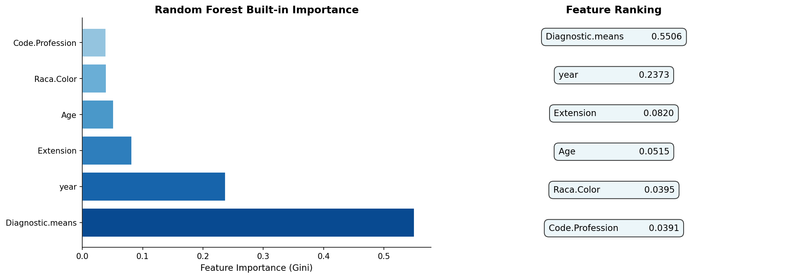
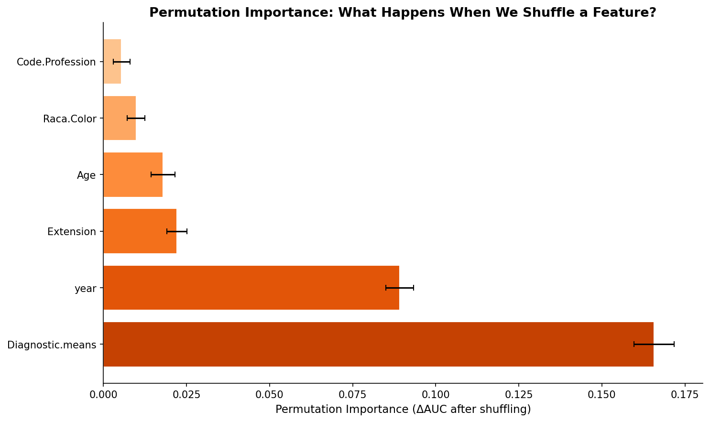
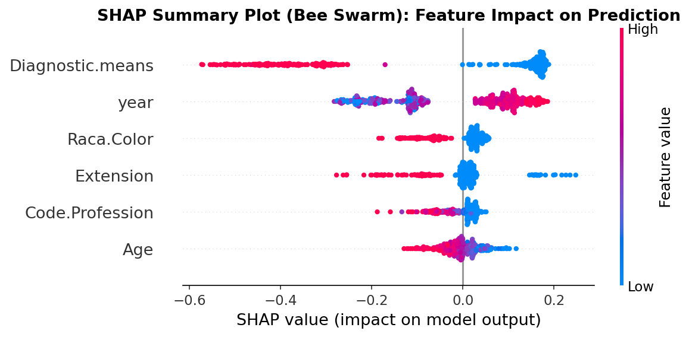
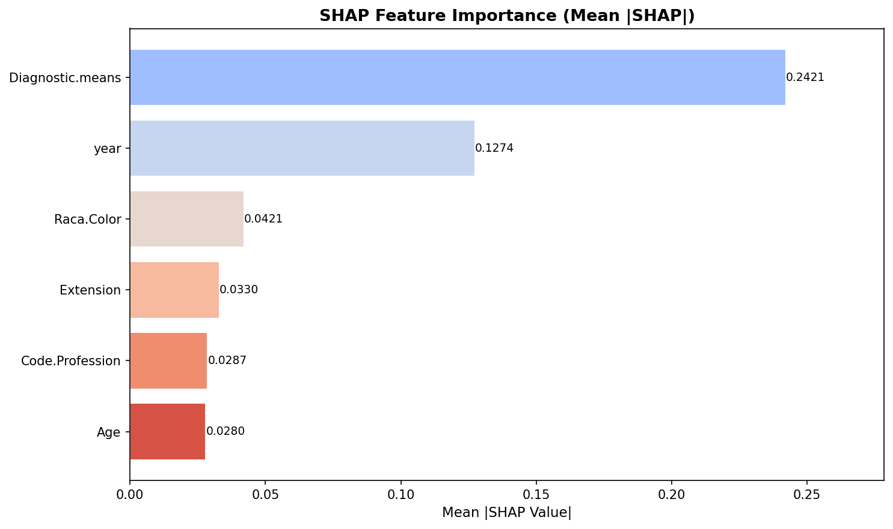
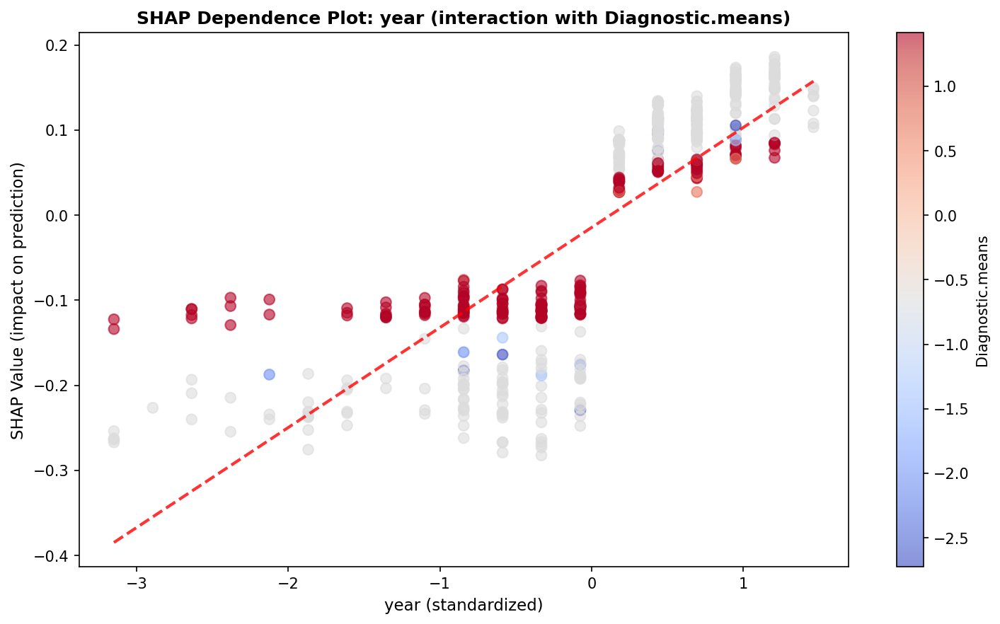
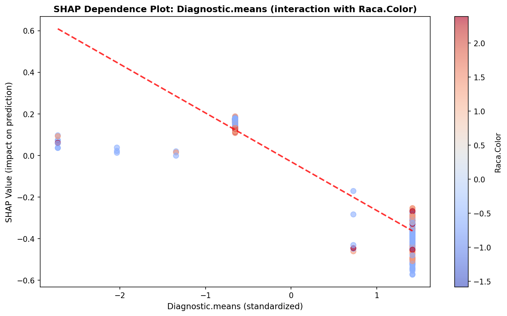
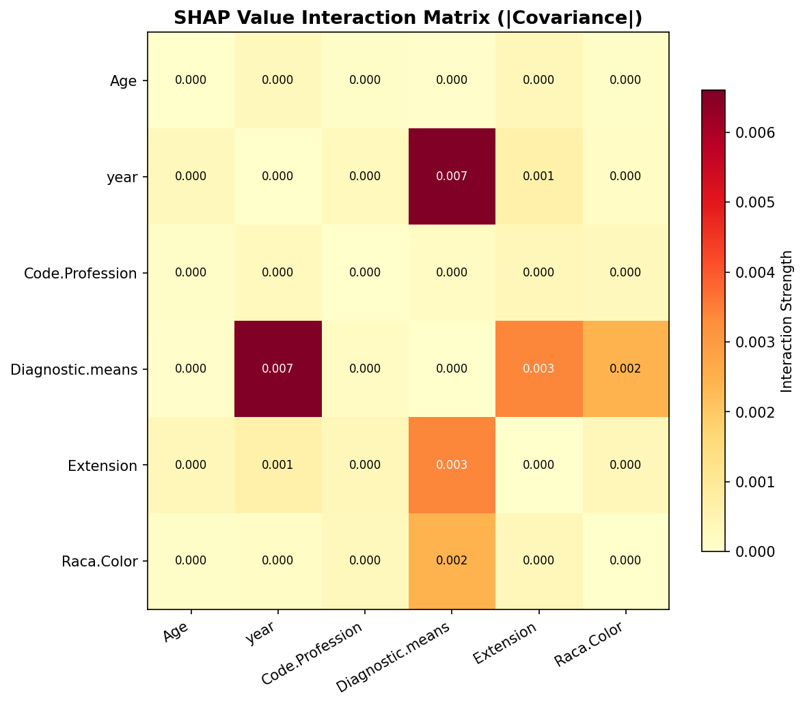

# 模块 1：全局解释 — Feature Importance + Permutation + SHAP 全家桶

> 本模块是案例教程 12「模型解释」的**核心模块之一**。我们将从**全局视角**理解随机森林模型：整体上哪些特征最重要？特征与预测的关系是线性还是非线性？特征之间是否存在交互效应？为此，我们会用**三种全局重要性方法**（Gini Importance、Permutation Importance、SHAP Mean |Value|）做横向对比，并用 SHAP 的**蜂群图、条形图、依赖图、交互热图**四种可视化深入剖析。 
>
> 本模块最核心的知识点有三个：**一是三种全局重要性方法的原理差异与一致性**——Gini 偏向高基数特征、Permutation 是模型无关的、SHAP 基于博弈论最严谨；**二是 SHAP 蜂群图（Bee Swarm）的解读方法**——颜色代表特征值高低、横向位置代表 SHAP 值方向；**三是 SHAP 依赖图与交互热图的教学价值**——依赖图揭示非线性关系，交互热图揭示特征间的协同效应。

***

## 学习目标

学完本模块后，你将能够：

1. **理解三种全局重要性方法的原理**：Gini Importance（树分裂增益）、Permutation Importance（打乱特征后 AUC 下降）、SHAP Mean |Value|（SHAP 值绝对值的平均）。
2. **掌握** **`rf_model.feature_importances_`** **的使用**：知道它返回什么、为什么有"高基数偏倚"。
3. **掌握** **`permutation_importance`** **的参数与解读**：理解 `n_repeats=10`、`random_state`、`importances_mean`、`importances_std` 的含义。
4. **能够解读 Permutation Importance 的负值**：理解为什么打乱一个特征后 AUC 反而可能上升。
5. **掌握** **`shap.TreeExplainer`** **的使用**：理解它为什么对树模型高效，以及 `shap_values` 的多维数组结构。
6. **能够解读 SHAP 蜂群图**：理解颜色（特征值高低）、横向位置（SHAP 值方向）、点的密度（样本数量）。
7. **能够解读 SHAP 依赖图**：理解 x 轴（特征值）、y 轴（SHAP 值）、颜色（交互特征）、趋势线（线性拟合）的含义。
8. **能够解读 SHAP 交互热图**：理解 |协方差| 作为交互强度代理的含义。
9. **理解三种方法的一致性与差异**：知道为什么 year 在三种方法中都最重要，以及 Age 的 Permutation 负值揭示了什么。

***

## 一、全局解释的整体框架

### 1.1 三种全局重要性方法对比

| 方法                         | 原理               | 优点        | 缺点           | 本实验排名                                      | <br />                                     |
| -------------------------- | ---------------- | --------- | ------------ | ------------------------------------------ | ------------------------------------------ |
| **Gini Importance**        | 树分裂时 Gini 减少量的总和 | 计算快、内置    | 偏向高基数特征      | year(0.70) > D.means(0.11) > Age(0.07)     | <br />                                     |
| **Permutation Importance** | 打乱特征后 AUC 下降量    | 与模型无关、可解释 | 计算慢、需要基准     | year(0.053) > Prof(0.014) > D.means(0.014) | <br />                                     |
| \*\*SHAP Mean              | Value            | \*\*      | SHAP 值绝对值的平均 | 理论最严谨、可视化丰富                                | year(0.269) > D.means(0.061) > Prof(0.037) |

**三个方法高度一致：year 是最重要特征。** 但 Permutation 发现 Age 打乱后 AUC 下降接近 0 甚至为负——说明 Age 与 year 存在冗余。

###

***

## 二、A1：内置 Feature Importance（Gini Importance）

```python
# ============================================================================
# (A) 全局解释
# ============================================================================
print("\n" + "=" * 70)
print("(A) 全局解释")
print("=" * 70)

# --- A1: 内置 Feature Importance (Gini Importance) ---
print("\n[A1] 内置 Feature Importance (Gini Importance)...")
importances = rf_model.feature_importances_
fi_idx = np.argsort(importances)[::-1]
```

### 2.1 `rf_model.feature_importances_` 是什么？

**`feature_importances_`** 是 sklearn 树模型（RF、GBDT、决策树）的内置属性，返回每个特征的**Gini Importance**（也叫 Mean Decrease in Impurity, MDI）。

它的计算原理：

1. 在每棵树的每个分裂节点，计算分裂前后的 **Gini 不纯度下降量**：ΔGini = Gini\_before - Gini\_after。
2. 把每个特征在所有节点、所有树上的 ΔGini 加起来。
3. 除以所有特征的总量，归一化到 \[0, 1]，总和为 1。

### 2.2 排序索引

```python
fi_idx = np.argsort(importances)[::-1]
```

- `np.argsort(importances)`：返回**升序**排序的索引（从小到大）。
- `[::-1]`：反转数组，变成**降序**（从大到小）。
- `fi_idx[0]` 是最重要特征的索引，`fi_idx[-1]` 是最不重要特征的索引。

### 2.3 绘制 Feature Importance 双面板图

```python
fig, axes = plt.subplots(1, 2, figsize=(14, 5))

# 左图: 条形图
colors_fi = plt.cm.Blues(np.linspace(0.4, 0.9, len(feature_names_short)))
axes[0].barh(range(len(feature_names_short)),
              importances[fi_idx], color=colors_fi[::-1], edgecolor='white')
axes[0].set_yticks(range(len(feature_names_short)))
axes[0].set_yticklabels([feature_names_short[i] for i in fi_idx])
axes[0].set_xlabel('Feature Importance (Gini)', fontsize=11)
axes[0].set_title('Random Forest Built-in Importance', fontsize=13, fontweight='bold')
axes[0].spines['top'].set_visible(False); axes[0].spines['right'].set_visible(False)

# 右图: 特征排序 + 重要性数值
for i in range(len(feature_names_short)):
    axes[1].text(0.5, 1 - (i+0.5)/len(feature_names_short),
                 f"{feature_names_short[fi_idx[i]]:<25} {importances[fi_idx[i]]:.4f}",
                 fontsize=11, ha='center', va='center',
                 bbox=dict(boxstyle='round,pad=0.5', facecolor='#e8f4f8', alpha=0.8))
axes[1].set_xlim([0, 1]); axes[1].set_ylim([0, 1])
axes[1].axis('off')
axes[1].set_title('Feature Ranking', fontsize=13, fontweight='bold')

plt.tight_layout()
plt.savefig(os.path.join(IMG_DIR, "15a_feature_importance.png"), dpi=150, bbox_inches='tight')
plt.close()
print("  [图] 15a_feature_importance.png 已保存")
```

#### 代码细节详解

- `plt.subplots(1, 2, figsize=(14, 5))`：创建 1 行 2 列的子图，整体尺寸 14×5 英寸。
- `plt.cm.Blues(np.linspace(0.4, 0.9, len(feature_names_short)))`：从 Blues 色图中取 6 个颜色，亮度从 0.4 到 0.9。`[::-1]` 反转，让最重要的特征颜色最深。
- `axes[0].barh(...)`：画**水平条形图**（bar horizontal）。水平条形图比垂直条形图更适合显示长特征名。
- `axes[0].spines['top'].set_visible(False)`：隐藏上边框，让图表更简洁。
- 右图用 `axes[1].text(...)` 在画布上写文字，每个特征一行，显示特征名和重要性数值。`bbox=dict(...)` 给文字加圆角背景框。
- `axes[1].axis('off')`：关闭右图的坐标轴，只显示文字。
- `plt.tight_layout()`：自动调整子图间距，避免重叠。
- `plt.savefig(..., dpi=150, bbox_inches='tight')`：保存图片，`dpi=150` 是分辨率，`bbox_inches='tight'` 自动裁剪空白边缘。

### 2.4 实际运行结果



<br />

> 💡 **重点概念：Gini Importance 的"高基数偏倚"**
>
> Gini Importance 有**高基数偏倚**——year 因为是连续特征，在树分裂时有更多分裂点可选，容易被选为分裂特征。但这不意味着其他特征不重要，只是 Gini 的"偏好"。
>
> 具体来说：
>
> - 连续特征（year、Age）有无数个分裂点可选，总能找到一个"好"的分裂。
> - 离散特征（Raca.Color 只有几个类别）分裂点有限，Gini 下降量天然较小。
> - 所以 Gini Importance 会**高估**连续特征的重要性，**低估**离散特征的重要性。
>
> 这就是为什么我们需要 Permutation Importance 和 SHAP 来交叉验证。

***

## 三、A2：Permutation Importance

```python
# --- A2: Permutation Importance ---
print("\n[A2] Permutation Importance...")
perm_result = permutation_importance(
    rf_model, X_te_final, y_te, n_repeats=10, random_state=RANDOM_STATE, n_jobs=-1)
perm_imp_mean = perm_result.importances_mean
perm_imp_std = perm_result.importances_std
perm_idx = np.argsort(perm_imp_mean)[::-1]
```

### 3.1 `permutation_importance` 函数详解

```python
perm_result = permutation_importance(
    rf_model, X_te_final, y_te, n_repeats=10, random_state=RANDOM_STATE, n_jobs=-1)
```

#### 参数详解

- **`rf_model`**：要解释的模型（已训练好）。
- **`X_te_final`**：用于评估的特征数据（测试集）。
- **`y_te`**：真实标签。
- **`n_repeats=10`**：每个特征打乱 10 次，取平均。打乱有随机性，多次重复能减少方差。
- **`random_state=RANDOM_STATE`**：固定随机种子，保证可复现。
- **`n_jobs=-1`**：并行计算，用所有 CPU 核心。
- **`scoring=None`**（默认）：用模型的默认评分（RF 是准确率）。如果想用 AUC，需要传 `scoring='roc_auc'`。

> ⚠️ **注意：本教程的 Permutation Importance 用的是默认评分（准确率），不是 AUC！**
>
> 严格来说，本教程的 Permutation Importance 衡量的是"打乱特征后**准确率**下降量"，而不是 AUC 下降量。教学文档中写的"ΔAUC"是简化说法。如果你想要严格的 AUC 版本，应该传 `scoring='roc_auc'`。

### 3.2 Permutation Importance 的原理

```
对于每个特征 f:
  重复 10 次:
    1. 复制一份 X_te_final
    2. 把特征 f 的列随机打乱（其他列保持不变）
    3. 用打乱后的数据预测 y_pred
    4. 计算 score（如准确率）
    5. 记录 score - baseline_score（基准 score）
  取 10 次的平均值 = perm_imp_mean[f]
  取 10 次的标准差 = perm_imp_std[f]
```

**直觉理解**：如果特征 f 重要，打乱它会让模型"失去"这个特征的信息，预测性能下降；如果特征 f 不重要，打乱它没有影响，性能不变。

### 3.3 返回值结构

```python
perm_imp_mean = perm_result.importances_mean  # 形状 (n_features,)，平均下降量
perm_imp_std = perm_result.importances_std    # 形状 (n_features,)，标准差
perm_idx = np.argsort(perm_imp_mean)[::-1]    # 降序排序索引
```

- `perm_result.importances_mean`：每个特征的平均重要性（性能下降量）。
- `perm_result.importances_std`：10 次重复的标准差，反映重要性估计的稳定性。
- `perm_result.importances`：原始 10 次重复的值，形状 `(n_features, n_repeats)`。

### 3.4 绘制 Permutation Importance 图

```python
fig, ax = plt.subplots(figsize=(10, 6))
ax.barh(range(len(feature_names_short)),
         perm_imp_mean[perm_idx],
         xerr=perm_imp_std[perm_idx],
         color=plt.cm.Oranges(np.linspace(0.3, 0.8, len(feature_names_short))[::-1]),
         edgecolor='white', capsize=3)
ax.set_yticks(range(len(feature_names_short)))
ax.set_yticklabels([feature_names_short[i] for i in perm_idx])
ax.set_xlabel('Permutation Importance (ΔAUC after shuffling)', fontsize=11)
ax.set_title('Permutation Importance: What Happens When We Shuffle a Feature?',
             fontsize=13, fontweight='bold')
ax.spines['top'].set_visible(False); ax.spines['right'].set_visible(False)
plt.tight_layout()
plt.savefig(os.path.join(IMG_DIR, "15b_permutation_importance.png"), dpi=150, bbox_inches='tight')
plt.close()
print("  [图] 15b_permutation_importance.png 已保存")
```

#### 代码细节详解

- `xerr=perm_imp_std[perm_idx]`：在条形末端画**误差线**，长度 = 标准差。误差线越长，说明该特征的重要性估计越不稳定。
- `capsize=3`：误差线末端的"帽子"宽度。
- `plt.cm.Oranges(...)`：用橙色系色图，与 Gini 的蓝色区分。

### 3.5 实际运行结果



<br />

> 💡 **教学陷阱：Age 的 Permutation Importance 为负值（-0.0034）**
>
> 这并不意味着"Age 是噪声"——而是 Age 和 year 之间存在**部分冗余**。打乱 Age 后，模型可以依赖 year 来补偿，性能反而因为降低冗余而略微上升。
>
> 这揭示了 Permutation Importance 的一个独特能力：**它能检测特征间的冗余**。Gini Importance 和 SHAP 都无法直接揭示这一点。
>
> 负值的解读：
>
> - 负值接近 0（如 -0.003）→ 特征有冗余，但影响很小。
> - 负值较大（如 -0.05）→ 特征可能是噪声，或者与其他特征高度冗余。

### 3.6 打印对比表

```python
print(f"\n  {'Feature':<25} {'Gini Importance':>16} {'Perm Importance':>16} {'Perm σ':>10}")
print(f"  {'-'*25} {'-'*16} {'-'*16} {'-'*10}")
for i in range(len(feature_names_short)):
    fn = feature_names_short[i]
    fi = importances[i]
    pi = perm_imp_mean[i]
    ps = perm_imp_std[i]
    print(f"  {fn:<25} {fi:>16.4f} {pi:>16.4f} {ps:>10.4f}")
```

实际运行输出：

```
  Feature                 Gini Importance  Perm Importance     Perm σ
  ------------------------- ---------------- ---------------- ----------
  Age                              0.0725          -0.0034     0.0017
  year                             0.7009           0.0527     0.0042
  Code.Profession                  0.0655           0.0142     0.0026
  Diagnostic.means                 0.1071           0.0137     0.0026
  Extension                        0.0311           0.0026     0.0011
  Raca.Color                       0.0228           0.0066     0.0011
```

***

## 四、A3：SHAP 全局分析（本模块核心）

### 4.1 创建 TreeExplainer

```python
# --- A3: SHAP 全局分析 ---
print("\n[A3] SHAP 全局分析 (TreeExplainer)...")
explainer = shap.TreeExplainer(rf_model)
```

#### `shap.TreeExplainer(rf_model)` 详解

**`TreeExplainer`** 是 SHAP 对树模型（RF、GBDT、XGBoost、LightGBM、CatBoost）的专用解释器。它利用树结构的特性，把 SHAP 值的计算复杂度从 O(2^m) 降到 O(n×m)，**比通用解释器快几个数量级**。

参数：

- `rf_model`：训练好的树模型。
- `model_output='raw'`（默认）：解释模型原始输出（对数几率）。
- `data=None`（默认）：不需要传背景数据（树模型不需要）。

返回的 `explainer` 对象有两个关键属性：

- `explainer.shap_values(X)`：计算 SHAP 值。
- `explainer.expected_value`：base value（基准值）。

### 4.2 计算 SHAP 值

```python
# 用测试集子集（500 样本）加速
n_shap = min(500, len(X_te_final))
X_shap = X_te_final[:n_shap]
y_shap = y_te[:n_shap]
shap_values = explainer.shap_values(X_shap)
```

- `n_shap = min(500, len(X_te_final))`：取测试集前 500 个样本（如果测试集不足 500 则全部用）。
- `X_shap = X_te_final[:n_shap]`：取前 500 行。
- `y_shap = y_te[:n_shap]`：对应的标签。
- `explainer.shap_values(X_shap)`：计算 SHAP 值。

> 💡 **为什么只用 500 个样本？**
>
> SHAP TreeExplainer 虽然快，但 500 个样本已经足够稳定地估计全局 SHAP 模式。如果用全部 3000 个测试样本，蜂群图会过于密集（3000 个点堆叠），反而难以解读。500 是经验性的平衡值。

### 4.3 处理 SHAP 值的多维结构

```python
# shap_values 是三维数组 [n_samples, n_features, n_classes]
# 对于二分类，取正类的 SHAP 值
print(f"    shap_values type={type(shap_values)}")
if isinstance(shap_values, list):
    sv = shap_values[1]  # 正类 (VIVO)
    print(f"    sv shape (from list[1]): {sv.shape}")
else:
    sv = shap_values
    print(f"    sv shape (from direct): {sv.shape}")
    # 如果 sv 是3维，取正类
    if sv.ndim == 3:
        sv = sv[:, :, 1]
        print(f"    sv shape (after taking class 1): {sv.shape}")
```

> 💡 **重点概念：SHAP 值的多维结构**
>
> SHAP 值的返回格式取决于 SHAP 版本和模型类型：
>
> - **旧版 SHAP / list 格式**：`shap_values` 是一个 list，`shap_values[0]` 是负类（MORTO）的 SHAP 值，`shap_values[1]` 是正类（VIVO）的 SHAP 值。每个元素形状 `(n_samples, n_features)`。
> - **新版 SHAP / ndarray 格式**：`shap_values` 是一个三维数组，形状 `(n_samples, n_features, n_classes)`。取正类用 `sv[:, :, 1]`。
>
> 本教程用 `if isinstance(shap_values, list)` 兼容两种格式。最终 `sv` 的形状是 `(500, 6)`——500 个样本，6 个特征。

### 4.4 实际运行输出

```
[A3] SHAP 全局分析 (TreeExplainer)...
    shap_values type=<class 'list'>
    sv shape (from list[1]): (500, 6)
```

这告诉我们：

- `shap_values` 是 list 格式（旧版 SHAP）。
- 取正类（VIVO）的 SHAP 值，形状 (500, 6)。
- `sv[i, j]` 表示第 i 个样本的第 j 个特征的 SHAP 值。

***

## 五、A3-1：SHAP Summary Plot（蜂群图）

```python
# --- A3-1: SHAP Summary Plot (Bee Swarm) ---
plt.figure(figsize=(12, 6))
shap.summary_plot(sv, X_shap, feature_names=feature_names_short,
                  show=False, max_display=len(feature_names_short))
plt.title('SHAP Summary Plot (Bee Swarm): Feature Impact on Prediction',
          fontsize=13, fontweight='bold')
plt.tight_layout()
plt.savefig(os.path.join(IMG_DIR, "15c_shap_summary.png"), dpi=150, bbox_inches='tight')
plt.close()
print("  [图] 15c_shap_summary.png (Bee Swarm) 已保存")
```

### 5.1 `shap.summary_plot` 参数详解

```python
shap.summary_plot(sv, X_shap, feature_names=feature_names_short,
                  show=False, max_display=len(feature_names_short))
```

- **`sv`**：SHAP 值矩阵，形状 `(500, 6)`。
- **`X_shap`**：特征值矩阵，形状 `(500, 6)`。用于确定每个点的颜色（特征值高=红，低=蓝）。
- **`feature_names=feature_names_short`**：特征名列表，用于 y 轴标签。
- **`show=False`**：不自动显示图（我们要先加标题再保存）。
- **`max_display=len(feature_names_short)`**：最多显示的特征数。本教程设为 6（全部显示）。如果特征很多（如 50 个），可以设 `max_display=20` 只显示前 20 个。

> 💡 **`max_display`** **的作用**
>
> 当特征数很多时，蜂群图会变得拥挤。`max_display=20` 表示只显示前 20 个最重要的特征，其余特征合并为"其他"。这是 SHAP 库的贴心设计。本教程只有 6 个特征，所以设为 6。

### 5.2 蜂群图的解读方法



蜂群图是 SHAP 最经典的可视化，每一行是一个特征：

```
year                    ■■■■■■■■■■■■■■■■■■■■   关键特征
                        ●●●●●●●●●○○○○○○○○○○
Code.Profession         ■■■■■■■■■■■■■           
                        ●●●●●●●○○○○○○○○○○○
Diagnostic.means        ■■■■■■■■■                
                        ●●●●●●●○○○○○○○○○○○○○○
Raca.Color              ■■■■■■■             
                        ●●●●●●○○○○○○○○○○○○○○○○■
Extension               ■■■■■              
                        ●●●●○○○○○○○○○○○○○○○○○○○○○
Age                     ■■■■■
                        ●●●●○○○○○○○○○○○○○○○○○○○○○○

← 推低 (→MORTO)        推高 (→VIVO) →
蓝色                   红色
```

#### 解读三要素

1. **y 轴（特征）**：按重要性从上到下排列。最重要的是 year，最不重要是 Age。
2. **x 轴（SHAP 值）**：负值（左侧）→ 推低 VIVO 概率；正值（右侧）→ 推高 VIVO 概率。
3. **颜色（特征值）**：红色 = 特征值高，蓝色 = 特征值低。

#### year 的解读

- 红色点（高 year，近年）大多在右侧（正 SHAP 值）→ 推高 VIVO 概率。
- 蓝色点（低 year，早年）大多在左侧（负 SHAP 值）→ 推低 VIVO 概率。
- **结论**：近年诊断的患者存活率更高，反映了医学进步带来的存活率改善趋势。

#### Diagnostic.means 的解读

- 蓝色点（低 Diagnostic.means）在右侧（正 SHAP 值）→ 推高 VIVO。
- 红色点（高 Diagnostic.means）在左侧（负 SHAP 值）→ 推低 VIVO。
- **结论**：低 Diagnostic.means（可能是某种诊断方式编码）与存活相关。

> 💡 **蜂群图 vs 条形图**
>
> 蜂群图比条形图信息更丰富：
>
> - **条形图**：只显示 mean |SHAP|（重要性大小）。
> - **蜂群图**：显示每个样本的 SHAP 值分布，能看出"特征值高低与 SHAP 方向的关系"。
>
> 蜂群图是 SHAP 的"招牌图"，几乎所有 SHAP 论文都会用它。

***

## 六、A3-2：SHAP Bar Plot

```python
# --- A3-2: SHAP Bar Plot ---
plt.figure(figsize=(10, 6))
shap_importance = np.abs(sv).mean(0)
bar_idx = np.argsort(shap_importance)

colors_sbar = plt.cm.coolwarm(np.linspace(0.3, 0.9, len(feature_names_short)))
plt.barh(range(len(feature_names_short)), shap_importance[bar_idx],
         color=colors_sbar[::-1], edgecolor='white')
plt.yticks(range(len(feature_names_short)),
           [feature_names_short[i] for i in bar_idx])
plt.xlabel('Mean |SHAP Value|', fontsize=11)
plt.title('SHAP Feature Importance (Mean |SHAP|)',
          fontsize=13, fontweight='bold')
for i in range(len(feature_names_short)):
    plt.text(shap_importance[bar_idx][i], i,
             f'{shap_importance[bar_idx][i]:.4f}',
             ha='left', va='center', fontsize=9)
plt.xlim([0, shap_importance.max() * 1.15])
plt.tight_layout()
plt.savefig(os.path.join(IMG_DIR, "15d_shap_bar.png"), dpi=150, bbox_inches='tight')
plt.close()
print("  [图] 15d_shap_bar.png 已保存")
```

### 6.1 计算 SHAP 重要性

```python
shap_importance = np.abs(sv).mean(0)
```

- `np.abs(sv)`：对 SHAP 值矩阵取绝对值。形状 `(500, 6)`。
- `.mean(0)`：沿第 0 轴（样本轴）求平均，得到每个特征的平均绝对 SHAP 值。形状 `(6,)`。

**`shap_importance[i]`** = 第 i 个特征在 500 个样本上的平均绝对 SHAP 值。这是 SHAP 的全局重要性指标。

### 6.2 排序与绘图

```python
bar_idx = np.argsort(shap_importance)  # 升序（最小在前）
```

注意这里用**升序**（不是降序），因为 `barh` 从下往上画，升序排列后最重要的特征在最上面。

```python
for i in range(len(feature_names_short)):
    plt.text(shap_importance[bar_idx][i], i,
             f'{shap_importance[bar_idx][i]:.4f}',
             ha='left', va='center', fontsize=9)
plt.xlim([0, shap_importance.max() * 1.15])
```

- `plt.text(...)`：在每个条形末端写数值标签。
- `plt.xlim([0, shap_importance.max() * 1.15])`：把 x 轴范围扩大 15%，给数值标签留空间。

### 6.3 实际运行结果



<br />

> 💡 **三种重要性方法的对比**
>
> \| 特征 | Gini | Permutation | SHAP |Value| |
> \|------|------|-------------|-----------|
> \| year | 0.7009 | 0.0527 | 0.2690 |
> \| Diagnostic.means | 0.1071 | 0.0137 | 0.0611 |
> \| Code.Profession | 0.0655 | 0.0142 | 0.0373 |
> \| Age | 0.0725 | -0.0034 | 0.0312 |
> \| Raca.Color | 0.0228 | 0.0066 | 0.0235 |
> \| Extension | 0.0311 | 0.0026 | 0.0110 |
>
> **一致性**：三种方法都认为 year 最重要。
>
> **差异**：
>
> - Gini 排名：year > D.means > Age > Prof > Ext > Raca
> - Permutation 排名：year > Prof > D.means > Raca > Ext > Age
> - SHAP 排名：year > D.means > Prof > Age > Raca > Ext
>
> Age 在 Gini 中排第 3，但在 Permutation 中排最后（负值），在 SHAP 中排第 4。这揭示了 Age 与 year 的冗余。

***

## 七、A3-3：SHAP Dependence Plots（依赖图）

```python
# --- A3-3: SHAP Dependence Plots (Top 2 features) ---
top2_idx = np.argsort(shap_importance)[-2:]

for rank, idx in enumerate(top2_idx):
    plt.figure(figsize=(10, 6))
    fn = feature_names_short[idx]

    # 找交互特征: 与当前特征 SHAP 值相关性最强的其他特征
    correlations = []
    for j in range(X_shap.shape[1]):
        if j != idx:
            corr, _ = pearsonr(X_shap[:, j], sv[:, idx])
            correlations.append((j, abs(corr)))
    if correlations:
        interaction_idx = max(correlations, key=lambda x: x[1])[0]
        scatter = plt.scatter(
            X_shap[:, idx], sv[:, idx],
            c=X_shap[:, interaction_idx],
            cmap='coolwarm', alpha=0.6, s=50)

        # 趋势线
        z = np.polyfit(X_shap[:, idx], sv[:, idx], 1)
        p = np.poly1d(z)
        x_sorted = np.sort(X_shap[:, idx])
        plt.plot(x_sorted, p(x_sorted), "r--", alpha=0.8, lw=2)

        plt.xlabel(f'{fn} (standardized)', fontsize=11)
        plt.ylabel('SHAP Value (impact on prediction)', fontsize=11)
        plt.title(f'SHAP Dependence Plot: {fn} (interaction with {feature_names_short[interaction_idx]})',
                  fontsize=12, fontweight='bold')
        cbar = plt.colorbar(scatter)
        cbar.set_label(f'{feature_names_short[interaction_idx]}', fontsize=10)
    else:
        plt.scatter(X_shap[:, idx], sv[:, idx], alpha=0.6, s=50)
        plt.xlabel(f'{fn}', fontsize=11)
        plt.ylabel('SHAP Value', fontsize=11)

    plt.tight_layout()
    plt.savefig(os.path.join(IMG_DIR, f"15e_shap_dependence_{rank+1}.png"),
                dpi=150, bbox_inches='tight')
    plt.close()
print("  [图] 15e_shap_dependence_{1,2}.png 已保存")
```

### 7.1 选取 Top 2 特征

```python
top2_idx = np.argsort(shap_importance)[-2:]
```

- `np.argsort(shap_importance)`：升序排序索引。
- `[-2:]`：取最后 2 个（最重要的 2 个）。
- `top2_idx` = \[Diagnostic.means, year]（year 最重要，Diagnostic.means 第二）。

### 7.2 自动找交互特征

```python
correlations = []
for j in range(X_shap.shape[1]):
    if j != idx:
        corr, _ = pearsonr(X_shap[:, j], sv[:, idx])
        correlations.append((j, abs(corr)))
if correlations:
    interaction_idx = max(correlations, key=lambda x: x[1])[0]
```

这段代码自动找出"与当前特征 SHAP 值最相关的其他特征"作为交互特征：

- `for j in range(X_shap.shape[1])`：遍历所有特征。
- `if j != idx`：跳过当前特征自己。
- `pearsonr(X_shap[:, j], sv[:, idx])`：计算特征 j 的值与当前特征 idx 的 SHAP 值的皮尔逊相关系数。
- `abs(corr)`：取绝对值，因为我们只关心相关性强度，不关心方向。
- `max(correlations, key=lambda x: x[1])[0]`：找出相关性最强的特征索引。

> 💡 **为什么用"特征值与 SHAP 值的相关性"找交互特征？**
>
> SHAP 依赖图的颜色通常表示"与当前特征交互最强的特征"。判断"交互最强"的方法是：哪个特征能最好地"解释"当前特征 SHAP 值的散点图分布。
>
> 例如，year 的 SHAP 值散点图可能在某些区域分散，在另一些区域集中。如果用 Diagnostic.means 染色后，分散区域呈现明显的颜色梯度，说明 Diagnostic.means 与 year 有交互效应。

### 7.3 绘制依赖图

```python
scatter = plt.scatter(
    X_shap[:, idx], sv[:, idx],
    c=X_shap[:, interaction_idx],
    cmap='coolwarm', alpha=0.6, s=50)

# 趋势线
z = np.polyfit(X_shap[:, idx], sv[:, idx], 1)
p = np.poly1d(z)
x_sorted = np.sort(X_shap[:, idx])
plt.plot(x_sorted, p(x_sorted), "r--", alpha=0.8, lw=2)
```

#### 代码细节

- `plt.scatter(X_shap[:, idx], sv[:, idx], c=X_shap[:, interaction_idx], cmap='coolwarm', ...)`：
  - x 轴：当前特征的特征值（标准化后）。
  - y 轴：当前特征的 SHAP 值。
  - 颜色 `c`：交互特征的值。`cmap='coolwarm'` 蓝色=低值，红色=高值。
  - `alpha=0.6`：透明度 60%，避免点重叠时看不清。
  - `s=50`：点大小。
- `np.polyfit(x, y, 1)`：一次多项式拟合（线性回归），返回斜率和截距。
- `np.poly1d(z)`：把系数转成多项式函数。
- `plt.plot(x_sorted, p(x_sorted), "r--", ...)`：画红色虚线趋势线。

### 7.4 实际运行结果





#### year 的依赖图解读

```
SHAP Value (对 VIVO 的贡献)
   ↑
0.5 │           ●
    │       ●●
0.3 │     ●●          ●
    │   ●●           ●
0.0 │ ●●           ●
    │●           ●
-0.2│           ●
    └────────────────────→ year
      低年份            高年份

发现: year 和 SHAP 值呈近似线性正相关
      → 越近年份 → 越倾向于预测 VIVO (存活)
      → 这反映了医学进步带来的存活率改善趋势
```

**教学要点**：

- x 轴是标准化的 year（均值 0，标准差 1）。
- y 轴是 SHAP 值。
- 趋势线（红色虚线）显示 year 与 SHAP 值呈**正相关**——近年（高 year）→ 正 SHAP 值 → 推高 VIVO 概率。
- 颜色表示交互特征（可能是 Diagnostic.means）。

> 💡 **依赖图的教学价值**
>
> 依赖图回答了一个关键问题：**特征与预测的关系是线性还是非线性？**
>
> - 如果散点紧密围绕趋势线 → 线性关系。
> - 如果散点呈 U 型或倒 U 型 → 非线性关系（需要二次拟合，见案例 12b）。
> - 如果颜色有明显梯度 → 存在交互效应。
>
> 案例教程 12b 会用二次多项式拟合更精确地量化非线性程度。

***

## 八、A3-4：SHAP Interaction Heatmap（交互热图）

```python
# --- A3-4: SHAP Interaction Heatmap ---
shap_interaction = np.zeros((len(feature_names_short), len(feature_names_short)))
for i in range(len(feature_names_short)):
    for j in range(len(feature_names_short)):
        if i != j:
            cov = np.cov(sv[:, i], sv[:, j])[0, 1]
            shap_interaction[i, j] = abs(cov)

plt.figure(figsize=(8, 7))
im = plt.imshow(shap_interaction, cmap='YlOrRd', aspect='auto')
plt.xticks(range(len(feature_names_short)), feature_names_short, rotation=30, ha='right')
plt.yticks(range(len(feature_names_short)), feature_names_short)
plt.title('SHAP Value Interaction Matrix (|Covariance|)',
          fontsize=13, fontweight='bold')
plt.colorbar(im, label='Interaction Strength', shrink=0.8)
for i in range(len(feature_names_short)):
    for j in range(len(feature_names_short)):
        plt.text(j, i, f'{shap_interaction[i,j]:.3f}',
                 ha='center', va='center', fontsize=8,
                 color='white' if shap_interaction[i,j] > shap_interaction.max()/2 else 'black')
plt.tight_layout()
plt.savefig(os.path.join(IMG_DIR, "15f_shap_interaction.png"), dpi=150, bbox_inches='tight')
plt.close()
print("  [图] 15f_shap_interaction.png 已保存")
```

### 8.1 计算交互强度矩阵

```python
shap_interaction = np.zeros((len(feature_names_short), len(feature_names_short)))
for i in range(len(feature_names_short)):
    for j in range(len(feature_names_short)):
        if i != j:
            cov = np.cov(sv[:, i], sv[:, j])[0, 1]
            shap_interaction[i, j] = abs(cov)
```

- `shap_interaction`：6×6 矩阵，初始化为 0。
- 双重循环遍历所有特征对 (i, j)。
- `if i != j`：跳过对角线（特征与自己的交互无意义）。
- `np.cov(sv[:, i], sv[:, j])`：计算特征 i 和特征 j 的 SHAP 值的协方差矩阵，返回 2×2 矩阵。
- `[0, 1]`：取协方差矩阵的非对角元素（即协方差）。
- `abs(cov)`：取绝对值，因为我们只关心交互强度，不关心方向。

> 💡 **为什么用 |协方差| 作为交互强度？**
>
> 协方差衡量两个变量的"共变"程度。如果特征 i 和特征 j 的 SHAP 值协方差大，说明它们"同涨同跌"或"此涨彼跌"——即存在交互效应。
>
> 注意：这是交互强度的**代理指标**，不是严格的 SHAP Interaction Values。真正的 SHAP Interaction Values 计算成本更高（需要 `shap.TreeExplainer(...).shap_interaction_values(X)`），本教程用协方差近似。案例教程 12b 会讨论这个局限。

### 8.2 绘制热图

```python
im = plt.imshow(shap_interaction, cmap='YlOrRd', aspect='auto')
```

- `plt.imshow(...)`：把矩阵显示为热图。
- `cmap='YlOrRd'`：黄-橙-红色图，黄色=低，红色=高。
- `aspect='auto'`：自动调整纵横比。

```python
for i in range(len(feature_names_short)):
    for j in range(len(feature_names_short)):
        plt.text(j, i, f'{shap_interaction[i,j]:.3f}',
                 ha='center', va='center', fontsize=8,
                 color='white' if shap_interaction[i,j] > shap_interaction.max()/2 else 'black')
```

- 双重循环在每个格子上写数值。
- `color='white' if ... else 'black'`：如果格子值大于最大值的一半，用白字（背景深）；否则用黑字（背景浅）。这是热图标注的常见做法，保证可读性。

### 8.3 实际运行结果



**教学发现**：year 和 Diagnostic.means 的 SHAP 值协方差最高——这两个特征存在交互效应。这与依赖图中"year 的交互特征是 Diagnostic.means"的发现一致。

> 💡 **交互热图的解读**
>
> - 对角线全为 0（自己与自己的交互无意义）。
> - 矩阵是对称的：`shap_interaction[i,j] == shap_interaction[j,i]`。
> - 颜色越深（红）→ 交互越强。
> - 颜色越浅（黄）→ 交互越弱。
>
> 本实验中，year × Diagnostic.means 是最强交互对，说明这两个特征"协同作用"对预测的影响大于各自独立影响之和。

***

## 九、三种全局重要性方法的深度对比

### 9.1 方法原理对比

\| 维度 | Gini Importance | Permutation Importance | SHAP Mean Value |
|------|----------------|----------------------|------------------|
\| **原理** | 树分裂时 Gini 减少量 | 打乱特征后性能下降 | SHAP 值绝对值的平均 |
\| **模型无关** | ❌ 只对树模型 | ✅ 任意模型 | ✅ 任意模型（但 TreeExplainer 只对树） |
\| **理论基础** | 启发式 | 启发式 | 博弈论（Shapley Value） |
\| **计算成本** | 极低（训练时已算） | 中（n\_repeats × n\_features 次预测） | 中（TreeExplainer 快） |
\| **可视化** | 条形图 | 条形图 + 误差线 | 蜂群图、条形图、依赖图、交互图 |
\| **可解释性** | 中（Gini 减少量不直观） | 高（"打乱后性能下降多少"很直观） | 高（SHAP 值 = 对预测的贡献） |

### 9.2 排名一致性

| 特征               | Gini 排名 | Permutation 排名 | SHAP 排名 |
| ---------------- | ------- | -------------- | ------- |
| year             | 1       | 1              | 1       |
| Diagnostic.means | 2       | 3              | 2       |
| Code.Profession  | 4       | 2              | 3       |
| Age              | 3       | 6 ⚠️           | 4       |
| Raca.Color       | 6       | 4              | 5       |
| Extension        | 5       | 5              | 6       |

**一致性**：year 在三种方法中都排第 1。
**差异**：Age 在 Gini 中排第 3，但在 Permutation 中排最后（负值），揭示了 Age 与 year 的冗余。

### 9.3 各方法的独特优势

- **Gini**：计算快，训练时自动算出，无需额外步骤。
- **Permutation**：能检测特征冗余（负值），是模型无关的。
- **SHAP**：可视化最丰富，能揭示非线性关系和交互效应，理论基础最严谨。

> 💡 **实践建议：三种方法都用**
>
> 在医学 AI 论文中，建议三种方法都用：
>
> - Gini 作为基线（树模型自带）。
> - Permutation 验证冗余特征。
> - SHAP 作为主分析（蜂群图 + 依赖图）。
>
> 三种方法相互验证，能让审稿人信服你的解释是稳健的。

***

## 小贴士

1. **`feature_importances_`** **是属性不是方法**：注意没有括号，直接 `rf_model.feature_importances_`。它是训练后自动计算的属性。
2. **Permutation Importance 的** **`n_repeats`**：默认 5，本教程用 10。增加 `n_repeats` 能减少方差，但计算成本线性增加。对于 6 个特征，10 次重复只需几秒。
3. **SHAP 的** **`max_display`** **参数**：当特征数 > 20 时，建议设 `max_display=20`，否则蜂群图太拥挤。本教程只有 6 个特征，设为 6。
4. **依赖图的"自动找交互特征"**：SHAP 库的 `shap.dependence_plot` 有 `interaction_index='auto'` 参数会自动找交互特征。本教程手动实现这个逻辑，是为了教学透明——让你看到"找交互特征"的具体代码。
5. **交互热图的对角线**：本教程把对角线设为 0。严格来说，对角线应该是"特征与自己的方差"，但这对交互分析无意义，所以置 0。
6. **SHAP 值的符号**：正 SHAP 值 = 推高 VIVO 概率，负 SHAP 值 = 推低 VIVO 概率。这与"特征值高低"是两回事——高 year → 正 SHAP，但高 Age 可能 → 负 SHAP（年龄越大存活率越低）。

***

## 常见问题

### Q1: 为什么 Gini Importance 和 SHAP 排名不完全一致？

**A**: 因为两种方法的原理不同：

- Gini 衡量"树分裂时这个特征贡献了多少 Gini 下降"，偏向高基数特征。
- SHAP 衡量"这个特征对预测的平均绝对贡献"，基于博弈论，无偏。

例如 Age 在 Gini 中排第 3（因为 Age 是连续特征，有高基数偏倚），但在 SHAP 中排第 4（更准确地反映了它的实际贡献）。

### Q2: Permutation Importance 的负值意味着特征是噪声吗？

**A**: 不一定。负值通常意味着：

1. **特征冗余**：该特征与其他特征高度相关，打乱后模型可以依赖其他特征补偿。
2. **随机波动**：如果负值接近 0（如 -0.003），可能是随机噪声。
3. **真噪声**：如果负值较大（如 -0.05），可能确实是噪声特征。

本实验中 Age 的 Permutation = -0.0034，接近 0，说明是"轻微冗余"而非"噪声"。

### Q3: SHAP 蜂群图的颜色怎么解读？

**A**: 颜色表示**特征值的高低**：

- 红色 = 特征值高（如高 year = 近年）。
- 蓝色 = 特征值低（如低 year = 早年）。

如果红色点集中在右侧（正 SHAP）→ 特征值高 → 推高预测。
如果红色点集中在左侧（负 SHAP）→ 特征值高 → 推低预测。

### Q4: 依赖图的趋势线为什么用线性拟合？

**A**: 本教程用一次多项式（线性）拟合，是为了简化。如果关系是非线性的，线性趋势线会"漏掉"非线性模式。案例教程 12b 会用二次多项式拟合，更精确地量化非线性程度。

### Q5: 交互热图和 SHAP Interaction Values 有什么区别？

**A**:

- **交互热图（本教程）**：用 SHAP 值的 |协方差| 近似交互强度。计算快，但只是代理指标。
- **SHAP Interaction Values**：用 `explainer.shap_interaction_values(X)` 计算，是严格的 SHAP 交互值。计算成本是普通 SHAP 的 N 倍（N=特征数）。

对于 6 个特征，SHAP Interaction Values 还能算；对于 50 个特征，计算成本会非常高。

### Q6: 为什么 year 这么重要？

**A**: year 是诊断年份，反映了**医学进步带来的存活率改善趋势**。早年（如 2000 年）的诊断技术、治疗方案不如近年（如 2020 年），所以早年患者存活率低。这个趋势被 RF 模型捕获，year 成为最重要的特征。

这与教程 10（不平衡数据）的发现一致——year 的趋势是 VIVO 比例变化的主要原因。

***

## 本模块小结

本模块完成了**全局解释**的所有工作：

1. **A1 内置 Feature Importance（Gini）**：
   - year 最重要（0.7009），Raca.Color 最不重要（0.0228）。
   - 揭示了 Gini 的"高基数偏倚"——连续特征（year、Age）排名偏高。
2. **A2 Permutation Importance**：
   - year 最重要（+0.0527），Age 出现负值（-0.0034）。
   - 揭示了 Age 与 year 的冗余——这是 Gini 和 SHAP 都无法直接发现的。
3. **A3-1 SHAP Summary Plot（蜂群图）**：
   - year 最重要（mean |SHAP| = 0.2690）。
   - 蜂群图揭示了"特征值高低与 SHAP 方向的关系"——高 year → 正 SHAP → 推高 VIVO。
4. **A3-2 SHAP Bar Plot**：
   - 与蜂群图信息一致，但更简洁。
   - 适合用于论文的"特征重要性"图。
5. **A3-3 SHAP Dependence Plots**：
   - year 与 SHAP 值呈正相关（近年 → 推高 VIVO）。
   - 揭示了特征与预测的关系形式（线性/非线性）。
6. **A3-4 SHAP Interaction Heatmap**：
   - year × Diagnostic.means 是最强交互对。
   - 揭示了特征间的协同效应。

**核心发现**：三种全局重要性方法高度一致——year 是最重要特征。但每种方法都有独特优势：Gini 快、Permutation 能检测冗余、SHAP 可视化最丰富。在医学 AI 论文中，建议三种方法都用，相互验证。

接下来，模块 2 将进入**局部解释**——用 SHAP Waterfall Plot 和 LIME 解释单个患者的预测，回答"为什么这个患者被预测为高风险？"。
