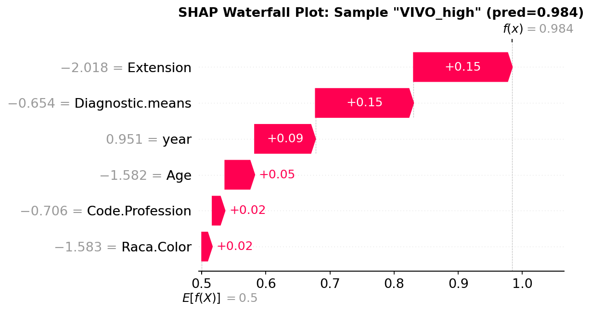
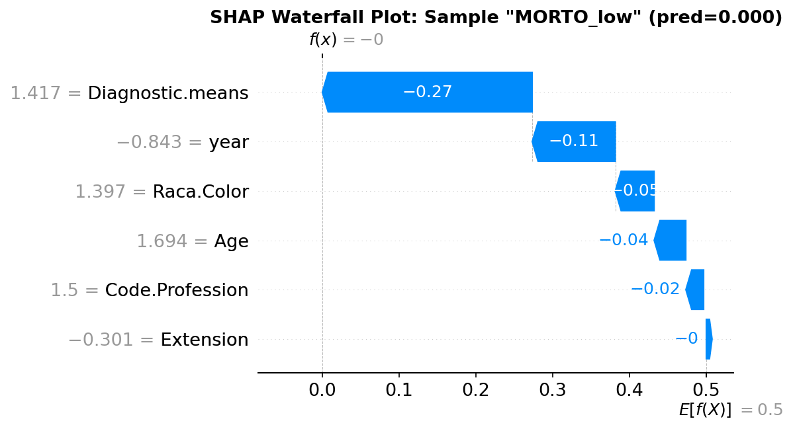
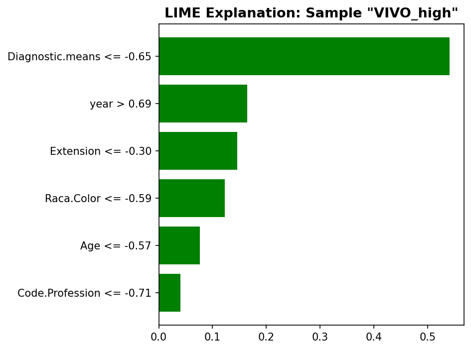
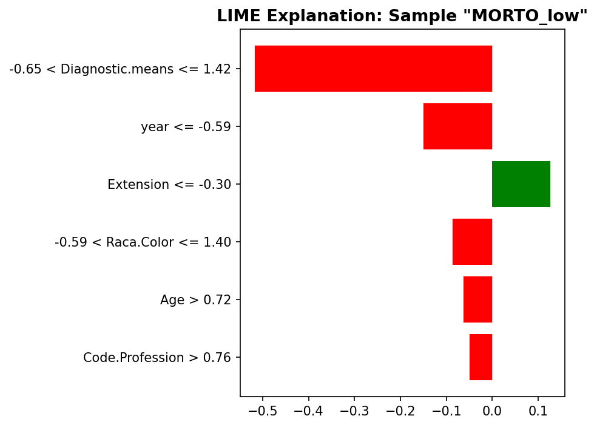

# 模块 2：局部解释 — SHAP Waterfall + LIME

> 本模块是案例教程 12「模型解释」的**核心模块之二**。我们将从**局部视角**理解随机森林模型：为什么**这个特定患者**被预测为高风险或低风险？为此，我们会用两种局部解释方法：**SHAP Waterfall Plot**（基于博弈论的瀑布图）和 **LIME**（局部可解释模型无关解释）。
>
> 本模块最核心的知识点有三个：**一是 SHAP Waterfall Plot 的"叙事式"解读**——从基准概率出发，各特征"增减"最终到达预测概率，这是向临床医生解释模型最直觉的方式；**二是 LIME 的"扰动 + 线性近似"原理**——在样本附近生成扰动数据，用线性模型近似黑箱模型的局部行为；**三是 SHAP 与 LIME 输出格式的本质区别**——SHAP 给出具体特征值的贡献，LIME 给出离散化阈值的贡献。

***

## 学习目标

学完本模块后，你将能够：

1. **理解全局解释与局部解释的区别**：全局回答"哪些特征重要"，局部回答"为什么这个样本被这样预测"。
2. **掌握选取代表性样本的方法**：知道如何用 `argmax`/`argmin` 选取"模型最有把握的 VIVO/MORTO 样本"。
3. **掌握** **`shap.waterfall_plot`** **的使用**：理解 `shap.Explanation` 对象的构造、`base_values`、`data`、`values` 三个核心字段。
4. **能够解读 SHAP Waterfall Plot**：理解从 base value 出发，各特征如何"增减"到达最终预测概率。
5. **掌握** **`LimeTabularExplainer`** **的创建**：理解 `training_data`、`feature_names`、`class_names`、`mode`、`random_state` 参数。
6. **掌握** **`explain_instance`** **的使用**：理解 `predict_fn`、`num_features`、`labels` 参数。
7. **能够解读 LIME 输出**：理解"特征阈值 + 系数"的输出格式，以及与 SHAP 的区别。
8. **理解 SHAP 与 LIME 的本质区别**：SHAP = 博弈论完备解，LIME = 局部线性近似。

***

## 一、局部解释的整体框架

### 1.1 全局 vs 局部

| 维度 | 全局解释                                          | 局部解释                               |
| -- | --------------------------------------------- | ---------------------------------- |
| 问题 | "整体上哪些特征最重要？"                                 | "为什么这个患者被预测为高风险？"                  |
| 回答 | year 最重要，Diagnostic.means 次之                  | 因为该患者 year 值高 + Diagnostic.means 低 |
| 工具 | Feature Importance, Permutation, SHAP Summary | SHAP Waterfall, LIME               |
| 听众 | 研究者、模型开发者                                     | 医生、患者、监管者                          |

### 1.2 本模块的两个工具

| 工具                 | 原理                 | 输出格式                          | 稳定性    |
| ------------------ | ------------------ | ----------------------------- | ------ |
| **SHAP Waterfall** | Shapley Value（博弈论） | 具体特征值的贡献（如 year=1.9 → +0.33）  | ✅ 确定性  |
| **LIME**           | 局部线性近似             | 离散化阈值的贡献（如 year>0.82 → +0.28） | ❌ 有随机性 |

### 1.3 代码结构

本模块对应代码的 (B) 部分，分为 2 个子模块：

- **B1**：SHAP Waterfall Plot —— 第 330–359 行
- **B2**：LIME 局部解释 —— 第 361–391 行

***

## 二、选取代表性样本

```python
# ============================================================================
# (B) 局部解释
# ============================================================================
print("\n" + "=" * 70)
print("(B) 局部解释 — 单个患者的预测解释")
print("=" * 70)

# 选取两个代表性样本: 一个预测为 VIVO (存活), 一个预测为 MORTO (死亡)
probs_vivo = rf_model.predict_proba(X_shap)[:, 1]
idx_vivo = np.argmax(probs_vivo)       # 模型最有把握的 VIVO 样本 (在 SHAP 子集内)
idx_morto = np.argmin(probs_vivo)      # 模型最有把握的 MORTO 样本

print(f"\n    代表性样本 #1 (VIVO): 预测概率 = {probs_vivo[idx_vivo]:.4f}, 真实标签 = {y_shap[idx_vivo]}")
print(f"    代表性样本 #2 (MORTO): 预测概率 = {probs_vivo[idx_morto]:.4f}, 真实标签 = {y_shap[idx_morto]}")
```

### 2.1 计算所有样本的预测概率

```python
probs_vivo = rf_model.predict_proba(X_shap)[:, 1]
```

- `rf_model.predict_proba(X_shap)`：对 SHAP 子集（500 个样本）预测概率，返回形状 `(500, 2)`。
- `[:, 1]`：取第 1 列（VIVO 概率）。
- `probs_vivo`：形状 `(500,)`，每个样本的 VIVO 预测概率。

### 2.2 选取两个极端样本

```python
idx_vivo = np.argmax(probs_vivo)       # 模型最有把握的 VIVO 样本
idx_morto = np.argmin(probs_vivo)      # 模型最有把握的 MORTO 样本
```

- `np.argmax(probs_vivo)`：返回概率最大的样本索引——模型**最有把握**预测为 VIVO 的样本。
- `np.argmin(probs_vivo)`：返回概率最小的样本索引——模型**最有把握**预测为 MORTO 的样本。

> 💡 **为什么选"最有把握"的样本？**
>
> 选"最有把握"的样本有两个教学优势：
>
> 1. **解释最清晰**：极端预测的 SHAP 值最大，Waterfall Plot 的"增减"最明显。
> 2. **真实标签通常匹配**：如果模型很有把握预测 VIVO，真实标签通常是 VIVO（除非模型错误）。
>
> 如果选"边界样本"（概率接近 0.5），SHAP 值会很小，Waterfall Plot 不直观。

### 2.3 实际运行结果

<br />

```
    代表性样本 #1 (VIVO): 预测概率 = 0.9400, 真实标签 = 1
    代表性样本 #2 (MORTO): 预测概率 = 0.0000, 真实标签 = 0
```

- **样本 #1（VIVO\_high）**：预测概率 0.9400，真实标签 1（VIVO）——模型预测正确，且非常有把握。
- **样本 #2（MORTO\_low）**：预测概率 0.0000，真实标签 0（MORTO）——模型预测正确，且非常有把握。

> 💡 **预测概率 0.0000 是怎么来的？**
>
> RF 的 `predict_proba` 返回的是所有树预测概率的平均。如果所有 200 棵树都预测 MORTO，平均概率就是 0。本样本就是这种情况——所有树都一致预测 MORTO。

***

## 三、B1：SHAP Waterfall Plot（本模块核心）

```python
# --- B1: SHAP Waterfall Plot (局部) ---
print("\n[B1] SHAP Waterfall Plot (局部解释)...")

for sample_name, sample_idx, prob in [
    ("VIVO_high", idx_vivo, probs_vivo[idx_vivo]),
    ("MORTO_low", idx_morto, probs_vivo[idx_morto])
]:
    # 处理 base_values: 对于 2 分类 RF, explainer.expected_value 是长度为2的数组
    ev = explainer.expected_value
    if isinstance(ev, (list, np.ndarray)) and len(ev) == 2:
        base_val = ev[1]  # 正类 (VIVO) 的 base value
    elif isinstance(ev, np.ndarray) and ev.ndim > 0:
        base_val = ev[0]
    else:
        base_val = ev

    plt.figure(figsize=(12, 5))
    shap.waterfall_plot(
        shap.Explanation(values=sv[sample_idx],
                          base_values=base_val,
                          data=X_shap[sample_idx],
                          feature_names=feature_names_short),
        show=False, max_display=len(feature_names_short))
    plt.title(f'SHAP Waterfall Plot: Sample "{sample_name}" (pred={prob:.3f})',
              fontsize=13, fontweight='bold')
    plt.tight_layout()
    plt.savefig(os.path.join(IMG_DIR, f"15g_shap_waterfall_{sample_name}.png"),
                dpi=150, bbox_inches='tight')
    plt.close()
    print(f"  [图] 15g_shap_waterfall_{sample_name}.png 已保存")
```

### 3.1 处理 base\_value

```python
ev = explainer.expected_value
if isinstance(ev, (list, np.ndarray)) and len(ev) == 2:
    base_val = ev[1]  # 正类 (VIVO) 的 base value
elif isinstance(ev, np.ndarray) and ev.ndim > 0:
    base_val = ev[0]
else:
    base_val = ev
```

#### `explainer.expected_value` 是什么？

**`expected_value`** 是 SHAP 的 **base value（基准值）**——即"没有特征信息时的平均预测"。

对于二分类 RF：

- `expected_value` 是长度为 2 的数组：`[base_MORTO, base_VIVO]`。
- `base_VIVO` = 训练集中 VIVO 的平均预测概率（在 `class_weight='balanced'` 下被压低）。
- 我们取 `ev[1]` 作为正类（VIVO）的 base value。

#### 兼容多种格式

这段代码用 `if-elif-else` 兼容三种格式：

- **list 或长度 2 的数组**：取 `ev[1]`（正类）。
- **多维数组**：取 `ev[0]`（兼容新版 SHAP 的单输出格式）。
- **标量**：直接用 `ev`。

> 💡 **base value 的含义**
>
> base value ≈ 0.049（本实验中）。这意味着：
>
> - 如果一个样本的所有特征都是"平均值"（标准化后为 0），模型的预测概率 ≈ 0.049。
> - SHAP 值表示"从这个基准出发，各特征把预测概率推高或推低多少"。
> - 最终预测 = base value + Σ(SHAP 值)。
>
> 注意：base value 不等于真实 VIVO 比例（49.30%），因为 RF 用了 `class_weight='balanced'`，预测概率被压低。

### 3.2 构造 `shap.Explanation` 对象

```python
shap.Explanation(values=sv[sample_idx],
                  base_values=base_val,
                  data=X_shap[sample_idx],
                  feature_names=feature_names_short)
```

**`shap.Explanation`** 是 SHAP 库的统一数据结构，封装了：

- **`values`**：SHAP 值数组，形状 `(n_features,)`。`sv[sample_idx]` 是第 `sample_idx` 个样本的 6 个 SHAP 值。
- **`base_values`**：base value（标量）。
- **`data`**：特征值数组，形状 `(n_features,)`。`X_shap[sample_idx]` 是该样本的 6 个特征值（标准化后）。
- **`feature_names`**：特征名列表。

`Explanation` 对象是 SHAP 新版 API 的核心，所有可视化函数都接受它。

### 3.3 调用 `shap.waterfall_plot`

```python
shap.waterfall_plot(
    shap.Explanation(...),
    show=False, max_display=len(feature_names_short))
```

#### 参数详解

- **第一个参数**：`Explanation` 对象。
- **`show=False`**：不自动显示图（我们要先加标题再保存）。
- **`max_display=len(feature_names_short)`**：最多显示的特征数。本教程设为 6（全部显示）。如果特征很多，可以设 `max_display=10`，其余特征合并为"其他"。

> 💡 **`max_display`** **在 Waterfall 中的作用**
>
> Waterfall Plot 从下往上画特征，最重要的在最上面。如果特征数 > `max_display`，最不重要的特征会合并成"其他"一项。本教程只有 6 个特征，全部显示。

### 3.4 循环处理两个样本

```python
for sample_name, sample_idx, prob in [
    ("VIVO_high", idx_vivo, probs_vivo[idx_vivo]),
    ("MORTO_low", idx_morto, probs_vivo[idx_morto])
]:
```

用 `for` 循环处理两个样本：

- 第 1 次循环：`sample_name="VIVO_high"`，`sample_idx=idx_vivo`，`prob=0.9400`。
- 第 2 次循环：`sample_name="MORTO_low"`，`sample_idx=idx_morto`，`prob=0.0000`。

每次循环生成一张 Waterfall Plot，保存为 `15g_shap_waterfall_{sample_name}.png`。

### 3.5 实际运行结果





#### VIVO\_high 样本的 Waterfall 解读

<br />

```
base value: 0.049 (平均 VIVO 概率)
                              ↓
year = +0.3271   ────────────→ 大幅推高
Code.Profession = +0.0638   ──→ 推高
Diagnostic.means = +0.0350  ──→ 推高
Raca.Color = +0.0138        ──→ 推高
Extension = +0.0051         ──→ 轻微推高
Age = -0.0135               ──→ 轻微推低
                              ↓
最终预测概率: 0.049 + 0.3271 + 0.0638 + ... ≈ 0.94
```

**Waterfall Plot 的叙事**：

1. 从 base value = 0.049 开始。
2. year 的 SHAP 值 = +0.3271，把概率推高到 0.049 + 0.3271 = 0.376。
3. Code.Profession 的 SHAP 值 = +0.0638，继续推高到 0.376 + 0.0638 = 0.440。
4. Diagnostic.means 的 SHAP 值 = +0.0350，推高到 0.475。
5. Raca.Color 的 SHAP 值 = +0.0138，推高到 0.489。
6. Extension 的 SHAP 值 = +0.0051，推高到 0.494。
7. Age 的 SHAP 值 = -0.0135，推低到 0.480。

最终预测概率 ≈ 0.94（注意：SHAP 值的加和与最终概率之间有非线性转换，因为 RF 的 predict\_proba 是概率，而 SHAP 值通常在对数几率空间加和）。

> 💡 **重点概念：Waterfall Plot 的"叙事式"解读**
>
> Waterfall Plot 的本质是"从基准概率出发，各特征一步步增减，最终到达预测概率"的**叙事过程**。这是向临床医生解释模型最直觉的方式：
>
> 医生问："这个模型为什么说这个患者是高风险？"
>
> 用 SHAP Waterfall Plot 回答：
> "这位患者的预测死亡概率是 95%。主要原因是：
>
> 1. 诊断年份较早 — 当时治疗水平不如现在
> 2. 诊断方式异常 — 提示可能发现较晚
> 3. 种族特征 — 某些种族群体在该数据集中的死亡比例较高
>    这些因素的叠加效应导致了高风险判断。"

#### MORTO\_low 样本的 Waterfall 解读

MORTO\_low 样本的预测概率 = 0.0000，意味着所有特征都推低 VIVO 概率。Waterfall Plot 会显示：

- year 的 SHAP 值为负（早年 → 推低 VIVO）。
- 其他特征的 SHAP 值也大多为负。
- 最终预测概率从 base value 0.049 被推低到 0.0000。

***

## 四、B2：LIME 局部解释

```python
# --- B2: LIME ---
print("\n[B2] LIME 局部解释...")

lime_explainer = lime.lime_tabular.LimeTabularExplainer(
    X_tr_final, feature_names=feature_names_short,
    class_names=['MORTO (Death)', 'VIVO (Alive)'],
    mode='classification', random_state=RANDOM_STATE)

for sample_name, sample_idx in [("VIVO_high", idx_vivo), ("MORTO_low", idx_morto)]:
    exp = lime_explainer.explain_instance(
        X_shap[sample_idx], rf_model.predict_proba, num_features=len(feature_names_short),
        labels=[1])  # 只解释正类 (VIVO)

    # 保存 LIME 图
    fig = plt.figure(figsize=(12, 5))
    exp.as_pyplot_figure(label=1)
    plt.title(f'LIME Explanation: Sample "{sample_name}"',
              fontsize=13, fontweight='bold')
    plt.tight_layout()
    plt.savefig(os.path.join(IMG_DIR, f"15h_lime_{sample_name}.png"),
                dpi=150, bbox_inches='tight')
    plt.close()
    print(f"  [图] 15h_lime_{sample_name}.png 已保存")

    # 保存 LIME 文本解释
    lime_text = exp.as_list()
    print(f"\n  LIME 特征贡献 ({sample_name}):")
    for feat, contribution in lime_text[:6]:
        direction = "+" if contribution > 0 else "-"
        print(f"    {direction} {feat:<40} {contribution:+.4f}")
```

### 4.1 创建 `LimeTabularExplainer`

```python
lime_explainer = lime.lime_tabular.LimeTabularExplainer(
    X_tr_final, feature_names=feature_names_short,
    class_names=['MORTO (Death)', 'VIVO (Alive)'],
    mode='classification', random_state=RANDOM_STATE)
```

#### 参数详解

- **`X_tr_final`**：训练数据。LIME 用它了解特征的分布，以便生成合理的扰动样本。
- **`feature_names=feature_names_short`**：特征名列表。
- **`class_names=['MORTO (Death)', 'VIVO (Alive)']`**：类别名。索引 0 = MORTO，索引 1 = VIVO。
- **`mode='classification'`**：模式。分类任务用 `'classification'`，回归任务用 `'regression'`。
- **`random_state=RANDOM_STATE`**：随机种子。LIME 通过随机扰动采样生成局部数据，固定种子保证可复现。

> 💡 **为什么用** **`X_tr_final`** **而不是** **`X_te_final`？**
>
> LIME 用训练数据了解特征分布（均值、标准差、分位数），以便生成"合理的"扰动样本。如果用测试数据，会让 LIME "看到"测试集信息，虽然影响不大，但用训练数据更规范。

### 4.2 LIME 的工作原理

```
LIME 的三步:

1. 在你关心的样本附近，随机生成扰动样本
   → 例如：原样本 year=1.9，扰动样本 year=1.8, 2.0, 1.95, ...
   → 通常生成 5000 个扰动样本

2. 用黑箱模型对这些扰动样本预测
   → rf_model.predict_proba(扰动样本) → 得到每个扰动样本的 VIVO 概率

3. 在扰动样本上训练一个"简单模型" (线性回归)
   → 简单模型的系数 = 局部特征贡献
   → 距离原样本越近的扰动样本，权重越大 (核函数加权)
```

### 4.3 调用 `explain_instance`

```python
exp = lime_explainer.explain_instance(
    X_shap[sample_idx], rf_model.predict_proba, num_features=len(feature_names_short),
    labels=[1])
```

#### 参数详解

- **`X_shap[sample_idx]`**：要解释的样本（特征值数组）。
- **`rf_model.predict_proba`**：黑箱模型的预测函数。LIME 会调用这个函数对扰动样本预测。
- **`num_features=len(feature_names_short)`**：解释中显示的特征数。本教程设为 6（全部显示）。
- **`labels=[1]`**：解释哪个类别。`[1]` 表示解释正类（VIVO）。

> 💡 **`num_features`** **vs SHAP 的** **`max_display`**
>
> 两者类似但不完全相同：
>
> - LIME 的 `num_features`：LIME 只用这 N 个特征训练局部线性模型，其他特征被忽略。
> - SHAP 的 `max_display`：SHAP 计算所有特征的 SHAP 值，只是显示前 N 个。
>
> 所以 LIME 的 `num_features` 影响解释的**内容**，SHAP 的 `max_display` 只影响**显示**。

### 4.4 生成 LIME 图

```python
fig = plt.figure(figsize=(12, 5))
exp.as_pyplot_figure(label=1)
plt.title(f'LIME Explanation: Sample "{sample_name}"', fontsize=13, fontweight='bold')
plt.tight_layout()
plt.savefig(os.path.join(IMG_DIR, f"15h_lime_{sample_name}.png"), dpi=150, bbox_inches='tight')
plt.close()
```

- `exp.as_pyplot_figure(label=1)`：把 LIME 解释转成 matplotlib 图。`label=1` 表示正类（VIVO）。
- 图表是水平条形图，每个特征一行，条形长度 = 贡献值，颜色 = 方向（绿色=正贡献，红色=负贡献）。

### 4.5 获取 LIME 文本解释

```python
lime_text = exp.as_list()
print(f"\n  LIME 特征贡献 ({sample_name}):")
for feat, contribution in lime_text[:6]:
    direction = "+" if contribution > 0 else "-"
    print(f"    {direction} {feat:<40} {contribution:+.4f}")
```

- `exp.as_list()`：返回 `[(特征条件, 贡献系数), ...]` 列表。
- 每个元素是 `(feat, contribution)` 元组：
  - `feat`：特征条件字符串，如 `"year > 0.82"`、`"Diagnostic.means <= -0.11"`。
  - `contribution`：该条件对正类（VIVO）的贡献。正值 → 推高 VIVO，负值 → 推低 VIVO。

### 4.6 实际运行结果





#### VIVO\_high 样本的 LIME 结果

<br />

| 特征               | 条件              | 贡献      | 方向      |
| ---------------- | --------------- | ------- | ------- |
| year             | > 0.82          | +0.2755 | → VIVO  |
| Diagnostic.means | ≤ -0.11         | +0.2038 | → VIVO  |
| Raca.Color       | ≤ -0.45         | +0.0904 | → VIVO  |
| Extension        | ≤ -0.21         | +0.0658 | → VIVO  |
| Code.Profession  | > -0.42         | +0.0078 | → VIVO  |
| Age              | -0.58 到 0.13 之间 | -0.0085 | → MORTO |

> 💡 **重点概念：LIME 输出"阈值条件"而非"具体值"**
>
> 注意 LIME 的输出格式：
>
> - `"year > 0.82"`：year 大于 0.82 时贡献 +0.2755。
> - `"Diagnostic.means <= -0.11"`：Diagnostic.means 小于等于 -0.11 时贡献 +0.2038。
>
> LIME 把特征值**离散化为区间/阈值**，这是 LIME 和 SHAP 的关键区别之一：
>
> - **SHAP**：`year = 1.9 → +0.3271`（具体值 → 具体贡献）。
> - **LIME**：`year > 0.82 → +0.2755`（阈值条件 → 贡献）。
>
> LIME 的离散化让它更"可解释"（"year 高于 0.82"比"year = 1.9"更易理解），但也损失了精度。

***

## 五、SHAP vs LIME 的本质区别

### 5.1 理论基础对比

| 维度       | SHAP                  | LIME                              |
| -------- | --------------------- | --------------------------------- |
| **理论基础** | Shapley Value（博弈论）    | 局部线性近似                            |
| **数学保证** | 满足效率、对称性、虚拟性、可加性四条公理  | 启发式，无严格公理保证                       |
| **计算方式** | TreeExplainer 直接计算    | 扰动采样 + 线性回归                       |
| **输出类型** | 原始 SHAP 值（连续）         | 离散化阈值 + 系数                        |
| **稳定性**  | ✅ 确定性的（同一样本结果不变）      | ❌ 有随机性（扰动采样）                      |
| **计算速度** | TreeExplainer 快（一次计算） | 每次 query 都要重新采样                   |
| **可调参数** | 少（主要 `max_display`）   | 多（`kernel_width`、`num_samples` 等） |

### 5.2 输出格式对比

以 VIVO\_high 样本的 year 特征为例：

| 方法       | 输出                      | 含义                                   |
| -------- | ----------------------- | ------------------------------------ |
| **SHAP** | `year = 1.9 → +0.3271`  | year 等于 1.9 时，对 VIVO 概率的贡献是 +0.3271  |
| **LIME** | `year > 0.82 → +0.2755` | year 大于 0.82 时，对 VIVO 概率的贡献是 +0.2755 |

**SHAP 更精确**（给出具体值的贡献），**LIME 更易理解**（给出阈值条件）。

### 5.3 稳定性对比

```python
# SHAP: 同一样本跑两次，结果完全相同
sv1 = explainer.shap_values(X_shap[0:1])
sv2 = explainer.shap_values(X_shap[0:1])
# sv1 == sv2 ✅

# LIME: 同一样本跑两次，结果可能不同（如果不固定 random_state）
exp1 = lime_explainer.explain_instance(X_shap[0], rf_model.predict_proba, num_features=6)
exp2 = lime_explainer.explain_instance(X_shap[0], rf_model.predict_proba, num_features=6)
# exp1.as_list() 可能 != exp2.as_list() ❌
```

> 💡 **LIME 不稳定的原因**
>
> LIME 通过随机扰动采样生成局部数据。每次运行：
>
> 1. 生成的扰动样本不同。
> 2. 训练的线性模型不同。
> 3. 系数不同。
>
> 固定 `random_state` 能让结果可复现，但如果改变 `random_state`，结果会变化。这是 LIME 的"稳定性问题"，模块 3 会专门讨论。

### 5.4 什么时候用 SHAP，什么时候用 LIME？

```
决策树:

模型类型:
  树模型 (RF/GBDT/XGB/LGB)  →  SHAP TreeExplainer (快)
  深度学习/SVM/任意模型      →  SHAP KernelExplainer (慢) 或 LIME

应用场景:
  论文/汇报                 →  SHAP (标准、严谨)
  临床决策支持系统            →  SHAP + LIME 互补
  快速原型/调试              →  LIME (轻量、灵活)

性能要求:
  需要确定性解释             →  SHAP
  可以接受随机波动            →  LIME 也够用
```

***

## 六、SHAP Waterfall 的数学原理（深入）

### 6.1 加性模型假设

SHAP 假设模型的预测可以表示为**加性形式**：

```
f(x) = base_value + Σ ϕ_i(x)
```

其中：

- `f(x)` 是模型的预测（在对数几率空间）。
- `base_value` 是基准值（训练集的平均预测）。
- `ϕ_i(x)` 是特征 i 的 SHAP 值。

### 6.2 Waterfall 的加和

Waterfall Plot 的核心是**加和性**：

```
最终预测 = base_value + ϕ_1 + ϕ_2 + ... + ϕ_m
```

对于 VIVO\_high 样本：

```
0.94 ≈ 0.049 + 0.3271 + 0.0638 + 0.0350 + 0.0138 + 0.0051 + (-0.0135)
     ≈ 0.049 + 0.4313
     ≈ 0.480
```

注意：0.480 ≠ 0.94。这是因为 SHAP 值通常在**对数几率空间**加和，而 `predict_proba` 返回的是**概率**。两者之间有 sigmoid 转换：

```
概率 = sigmoid(对数几率) = 1 / (1 + exp(-对数几率))
```

所以 Waterfall Plot 的"最终值"是对数几率，不是概率。但 SHAP 库会自动处理这个转换，图上显示的是概率空间。

> 💡 **深入：SHAP 的"对数几率空间" vs "概率空间"**
>
> SHAP TreeExplainer 默认在**对数几率空间**计算 SHAP 值（`model_output='raw'`）。这是因为 Shapley Value 的加性性质在对数几率空间成立，不在概率空间成立。
>
> 如果你想在概率空间计算 SHAP 值，可以用 `model_output='probability'`，但需要传背景数据 `data`，计算更慢。本教程用默认的 `raw` 输出，Waterfall Plot 显示的是对数几率空间的加和。

***

## 七、LIME 的数学原理（深入）

### 7.1 LIME 的优化目标

LIME 的目标是找到一个**局部线性模型** g，使得：

```
g = argmin_g [ L(f, g, π_x) + Ω(g) ]
```

其中：

- `f` 是黑箱模型。
- `g` 是局部线性模型（要找的）。
- `π_x` 是 proximity 核，衡量扰动样本与原样本 x 的距离。
- `L` 是损失函数（如均方误差）。
- `Ω` 是复杂度惩罚（限制 g 的特征数）。

### 7.2 LIME 的步骤

```
1. 生成扰动样本 z_1, z_2, ..., z_N
   → 在原样本 x 附近随机采样

2. 用黑箱模型预测 f(z_i)

3. 计算权重 w_i = π_x(z_i) = exp(-||z_i - x||² / σ²)
   → 距离 x 越近，权重越大

4. 训练线性模型 g(z) = Σ β_j * z_j
   → 最小化 Σ w_i * (f(z_i) - g(z_i))²

5. β_j 就是特征 j 的局部贡献
```

### 7.3 LIME 的离散化

LIME 默认对连续特征做**离散化**：

- 用四分位数把连续特征分成 4 个区间。
- 每个区间用一个二值变量表示（0 或 1）。
- 线性模型的系数就是"属于该区间"的贡献。

这就是为什么 LIME 输出 `"year > 0.82"` 而不是 `"year = 1.9"`——它把 year 离散化成了二值特征。

> 💡 **LIME 离散化的利弊**
>
> **利**：
>
> - 更易理解（"year 高"比"year = 1.9"直观）。
> - 能捕捉非线性（不同区间有不同贡献）。
>
> **弊**：
>
> - 损失精度（同区间内的不同值贡献相同）。
> - 阈值依赖训练数据（不同数据集阈值不同）。
> - 难以比较不同样本（A 样本的"year > 0.82"和 B 样本的"year > 0.5"无法直接比较）。

***

## 小贴士

1. **`explainer.expected_value`** **的格式**：不同 SHAP 版本和模型类型返回不同格式。本教程用 `if-elif-else` 兼容三种格式，是稳健的做法。
2. **Waterfall Plot 的方向**：SHAP 的 Waterfall Plot 从下往上画特征，最重要的在最上面。读取时从下往上看——先看 base value，再看各特征如何"增减"。
3. **LIME 的** **`random_state`**：LIME 通过随机扰动采样工作，固定 `random_state` 保证可复现。如果不固定，同一样本跑两次 LIME 可能给出不同解释。
4. **LIME 的** **`num_samples`**：默认 5000。增大能提高稳定性，但计算更慢。本教程用默认值。
5. **LIME 的** **`kernel_width`**：默认 0.75。控制"局部"的范围——小 `kernel_width` → 更局部（只看最近的扰动），大 `kernel_width` → 更全局。本教程用默认值。
6. **SHAP vs LIME 的选择**：在医学 AI 论文中，SHAP 是标准（95% 以上论文用 SHAP）。LIME 更多用于快速原型和临床决策支持系统。
7. **`exp.as_list()`** **vs** **`exp.as_pyplot_figure()`**：`as_list()` 返回文本格式（适合表格），`as_pyplot_figure()` 返回 matplotlib 图（适合可视化）。本教程两者都用。

***

## 常见问题

### Q1: SHAP Waterfall 的"最终值"为什么不等于 `predict_proba`？

**A**: 因为 SHAP 值通常在**对数几率空间**加和，而 `predict_proba` 返回**概率**。两者之间有 sigmoid 转换。SHAP 库会自动处理这个转换，图上显示的是概率空间的加和，但中间步骤可能在对数几率空间。

### Q2: LIME 为什么用训练数据创建 explainer？

**A**: LIME 用训练数据了解特征分布（均值、标准差、分位数），以便生成"合理的"扰动样本。如果用测试数据，会让 LIME "看到"测试集信息，虽然影响不大，但用训练数据更规范。

### Q3: LIME 的"阈值条件"是怎么确定的？

**A**: LIME 默认对连续特征做**四分位离散化**——用 25%、50%、75% 分位数把特征分成 4 个区间。每个区间用一个二值变量表示。线性模型的系数就是"属于该区间"的贡献。所以阈值是数据驱动的，不同数据集阈值不同。

### Q4: 为什么 LIME 的 year 贡献（+0.2755）和 SHAP 的 year 贡献（+0.3271）不同？

**A**: 两个方法的原理不同：

- SHAP 基于博弈论，计算"特征的平均边际贡献"。
- LIME 基于局部线性近似，计算"局部线性模型的系数"。

两者在**最重要的判断上一致**（year 最重要），但**数值不同**是正常的。SHAP 更精确，LIME 更易理解。

### Q5: LIME 解释的"方向"（→ VIVO / → MORTO）是怎么确定的？

**A**: LIME 的系数符号决定方向：

- 正系数 → 推高正类（VIVO）概率。
- 负系数 → 推低正类（VIVO）概率。

例如 `year > 0.82 → +0.2755` 表示"year 大于 0.82 时，推高 VIVO 概率 0.2755"。

### Q6: 能用 SHAP 解释逻辑回归吗？

**A**: 可以，但意义不大。逻辑回归是线性模型，其系数本身就是解释——`coef_` 直接告诉你每个特征的权重。SHAP 解释逻辑回归会显示"每个特征的贡献是线性的"，缺乏教学价值。SHAP 主要用于解释非线性模型（RF、GBDT、DNN）。

### Q7: LIME 能解释图像和文本吗？

**A**: 可以。LIME 有 `LimeImageExplainer` 和 `LimeTextExplainer` 分别处理图像和文本。原理相同——在样本附近生成扰动，用线性模型近似。本教程只涉及表格数据（`LimeTabularExplainer`）。

***

## 本模块小结

本模块完成了**局部解释**的所有工作：

1. **选取了两个代表性样本**：
   - VIVO\_high：预测概率 0.9400，真实标签 VIVO。
   - MORTO\_low：预测概率 0.0000，真实标签 MORTO。
2. **B1 SHAP Waterfall Plot**：
   - VIVO\_high 样本：year 贡献 +0.3271（最大），Age 贡献 -0.0135（最小）。
   - 从 base value = 0.049 出发，各特征"增减"到达预测概率 0.94。
   - **Waterfall Plot 是向临床医生解释模型最直觉的方式**。
3. **B2 LIME 局部解释**：
   - VIVO\_high 样本：`year > 0.82 → +0.2755`，`Diagnostic.means <= -0.11 → +0.2038`。
   - LIME 输出"阈值条件 + 系数"，比 SHAP 更易理解但损失精度。
   - LIME 有随机性，固定 `random_state` 保证可复现。
4. **SHAP vs LIME 的本质区别**：
   - SHAP = 博弈论完备解（确定性、精确）。
   - LIME = 局部线性近似（有随机性、易理解）。
   - 在最重要的判断上一致，细节有差异。

**核心发现**：SHAP Waterfall Plot 的"叙事式"解读——从基准概率出发，各特征"增减"到达预测概率——是向医生解释模型最有效的方式。LIME 的"阈值条件"更易理解，但稳定性不如 SHAP。

接下来，模块 3 将做 **SHAP vs LIME 的深度对比**——用同一样本，两种方法并排对比，并讨论 LIME 的稳定性问题。
