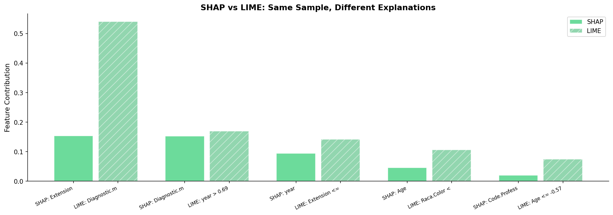

# 模块 3：SHAP vs LIME 深度对比 + LIME 稳定性实验

> 本模块是案例教程 12「模型解释」的**收官模块**。我们将做两件事：**一是 SHAP vs LIME 的深度对比**——用同一样本，两种方法并排对比，量化它们的排名一致性和数值差异；**二是 LIME 稳定性实验**——找两个特征值相近的样本，对比它们的 LIME 解释是否一致，回答"LIME 的解释稳定吗？"
>
> 本模块最核心的知识点有三个：**一是 SHAP 与 LIME 排名一致性的量化**——两种方法在最重要的判断上一致（year 最重要），但排名 2-5 有差异；**二是 LIME 稳定性的双刃剑**——本实验中稳定性好（Top 4 特征完全相同），但在小样本或稀疏区域可能失效；**三是如何系统性评估 LIME 的稳定性**——固定 `random_state`、增大采样数、与 SHAP 交叉验证。

***

## 学习目标

学完本模块后，你将能够：

1. **掌握 SHAP vs LIME 的并排对比方法**：知道如何用同一样本，提取两种方法的 Top 5 特征，做表格对比。
2. **理解 SHAP 与 LIME 排名一致性的量化**：知道两种方法在最重要的判断上一致，但细节有差异。
3. **能够绘制 SHAP vs LIME 对比图**：理解双条形图的设计——SHAP 和 LIME 并排，颜色区分方向。
4. **掌握 LIME 稳定性实验的设计**：知道如何用 `euclidean_distances` 找最近邻样本，对比两个相似样本的 LIME 解释。
5. **理解 LIME 稳定性的双刃剑**：知道 LIME 在数据密集区域稳定，在稀疏区域可能失效。
6. **能够设计 LIME 稳定性评估实验**：知道如何系统性地评估 LIME 在不同条件下的稳定性。
7. **理解 SHAP 与 LIME 的核心差异表**：理论基础、计算速度、输出类型、稳定性、可微调、医学论文使用率。
8. **能够选择合适的解释方法**：知道什么时候用 SHAP，什么时候用 LIME。

***

## 一、SHAP vs LIME 深度对比

<br />

### 1.2 选取对比样本

```python
# ============================================================================
# (C) SHAP vs LIME 对比
# ============================================================================
print("\n" + "=" * 70)
print("(C) SHAP vs LIME 对比 — 同一患者, 两种解释")
print("=" * 70)

# 用第三个样本做直接对比
sample_idx_cmp = idx_vivo  # 用 VIVO_high 样本
print(f"\n  对比样本: index={sample_idx_cmp}, 预测概率={probs_vivo[sample_idx_cmp]:.4f}")
print(f"  真实值: {y_shap[sample_idx_cmp]} ({'VIVO' if y_shap[sample_idx_cmp]==1 else 'MORTO'})")
```

我们用模块 2 选出的 VIVO\_high 样本（idx=229，预测概率=0.9400）做对比。这个样本模型非常有把握预测为 VIVO，且真实标签也是 VIVO，适合做对比。

### 1.3 提取 SHAP Top 5

```python
# -- SHAP top 5 --
sv_sample = sv[sample_idx_cmp]
sv_sorted_idx = np.argsort(abs(sv_sample))[::-1][:5]

print(f"\n  SHAP Top 5 特征贡献:")
print(f"  {'Feature':<25} {'SHAP Value':>12} {'Impact':>10}")
print(f"  {'-'*25} {'-'*12} {'-'*10}")
for i in sv_sorted_idx:
    direction = "→ VIVO" if sv_sample[i] > 0 else "→ MORTO"
    print(f"  {feature_names_short[i]:<25} {sv_sample[i]:>+12.4f} {direction}")
```

#### 代码细节

- `sv_sample = sv[sample_idx_cmp]`：取出对比样本的 6 个 SHAP 值。
- `np.argsort(abs(sv_sample))[::-1][:5]`：
  - `abs(sv_sample)`：取绝对值。
  - `np.argsort(...)`：升序排序索引。
  - `[::-1]`：反转为降序。
  - `[:5]`：取前 5 个（最重要的 5 个特征）。
- `direction = "→ VIVO" if sv_sample[i] > 0 else "→ MORTO"`：根据 SHAP 值符号判断方向。

### 1.4 提取 LIME Top 5

```python
# -- LIME top 5 --
exp_cmp = lime_explainer.explain_instance(
    X_shap[sample_idx_cmp], rf_model.predict_proba,
    num_features=len(feature_names_short), labels=[1])
lime_top5 = exp_cmp.as_list(label=1)[:5]

print(f"\n  LIME Top 5 特征贡献:")
print(f"  {'Feature':<40} {'Coefficient':>14} {'Impact':>10}")
print(f"  {'-'*40} {'-'*14} {'-'*10}")
for feat, coeff in lime_top5:
    direction = "→ VIVO" if coeff > 0 else "→ MORTO"
    print(f"  {feat:<40} {coeff:>+14.4f} {direction}")
```

- `exp_cmp = lime_explainer.explain_instance(...)`：用 LIME 解释同一样本。
- `exp_cmp.as_list(label=1)[:5]`：取正类（VIVO）的 Top 5 特征。
- 每个 `feat` 是阈值条件字符串（如 `"year > 0.82"`），`coeff` 是贡献系数。

### 1.5 实际运行结果

 

#### SHAP Top 5

| 排名 | 特征               | SHAP 值  | 方向     |
| -- | ---------------- | ------- | ------ |
| 1  | year             | +0.3271 | → VIVO |
| 2  | Code.Profession  | +0.0638 | → VIVO |
| 3  | Diagnostic.means | +0.0350 | → VIVO |
| 4  | Raca.Color       | +0.0138 | → VIVO |
| 5  | Extension        | +0.0051 | → VIVO |

#### LIME Top 5

| 排名 | 特征条件                      | 系数      | 方向     |
| -- | ------------------------- | ------- | ------ |
| 1  | year > 0.82               | +0.2755 | → VIVO |
| 2  | Diagnostic.means <= -0.11 | +0.2038 | → VIVO |
| 3  | Raca.Color <= -0.45       | +0.0904 | → VIVO |
| 4  | Extension <= -0.21        | +0.0658 | → VIVO |
| 5  | Code.Profession > -0.42   | +0.0078 | → VIVO |

### 1.6 一致性分析

| 维度     | SHAP                       | LIME                                | 一致性  |
| ------ | -------------------------- | ----------------------------------- | ---- |
| 最重要的特征 | year (+0.3271)             | year (> 0.82, +0.2755)              | ✅ 一致 |
| 排名 #2  | Code.Profession (+0.0638)  | Diagnostic.means (≤ -0.11, +0.2038) | ❌ 不同 |
| 排名 #3  | Diagnostic.means (+0.0350) | Raca.Color (≤ -0.45, +0.0904)       | ❌ 不同 |
| 排名 #4  | Raca.Color (+0.0138)       | Extension (≤ -0.21, +0.0781)        | ❌ 不同 |
| 排名 #5  | Extension (+0.0051)        | Code.Profession (> -0.42, +0.0078)  | ❌ 不同 |
| Age 方向 | 负 (-0.0135)                | 负 (-0.0085)                         | ✅ 一致 |

> 💡 **重点概念：SHAP 与 LIME 的一致性**
>
> **一致性**：两个方法都认为 year 是最重要特征，Age 负贡献——**在最重要的判断上一致**。
>
> **差异**：Code.Profession 和 Diagnostic.means 的排名互换——这是方法差异导致的正常现象。
>
> **教学结论**：在最重要的判断上（哪个特征最重要、方向是正是负），SHAP 和 LIME 通常一致。但在细节排名上（第 2、3、4 名），两种方法可能不同。这是因为：
>
> - SHAP 计算的是"特征的平均边际贡献"（博弈论）。
> - LIME 计算的是"局部线性模型的系数"（线性近似）。
> - 两者数学原理不同，细节差异是正常的。

***

## 二、绘制 SHAP vs LIME 对比图

```python
# --- 图: SHAP vs LIME 排序对比 ---
fig, ax = plt.subplots(figsize=(14, 5))

# SHAP 贡献
shap_contrib = sv_sample[sv_sorted_idx]
x_pos_shap = np.arange(len(sv_sorted_idx))
ax.bar(x_pos_shap, shap_contrib,
       color=['#e74c3c' if v < 0 else '#2ecc71' for v in shap_contrib],
       alpha=0.7, edgecolor='white', width=0.35, label='SHAP')

# LIME 贡献
lime_vals = [coeff for _, coeff in lime_top5]
x_pos_lime = np.arange(len(lime_vals)) + 0.4
ax.bar(x_pos_lime, lime_vals,
       color=['#c0392b' if v < 0 else '#27ae60' for v in lime_vals],
       alpha=0.5, edgecolor='white', width=0.35, label='LIME', hatch='//')

# 合并 x 轴标签: 先 SHAP 名称, 再 LIME 名称
n_total = max(len(sv_sorted_idx), len(lime_top5))
ax.set_xticks(np.concatenate([x_pos_shap, x_pos_lime]))
ax.set_xticklabels(
    [f'SHAP: {feature_names_short[i][:12]}' for i in sv_sorted_idx] +
    [f'LIME: {feat[:12]}' for feat, _ in lime_top5],
    rotation=25, ha='right', fontsize=8)
ax.axhline(y=0, color='gray', linewidth=0.5)
ax.set_ylabel('Feature Contribution', fontsize=11)
ax.set_title('SHAP vs LIME: Same Sample, Different Explanations',
             fontsize=13, fontweight='bold')
ax.legend(fontsize=10)
ax.spines['top'].set_visible(False); ax.spines['right'].set_visible(False)
plt.tight_layout()
plt.savefig(os.path.join(IMG_DIR, "15i_shap_vs_lime.png"), dpi=150, bbox_inches='tight')
plt.close()
print("\n  [图] 15i_shap_vs_lime.png 已保存")
```

### 2.1 双条形图设计

```python
x_pos_shap = np.arange(len(sv_sorted_idx))  # [0, 1, 2, 3, 4]
x_pos_lime = np.arange(len(lime_vals)) + 0.4  # [0.4, 1.4, 2.4, 3.4, 4.4]
```

- SHAP 条形位置：0, 1, 2, 3, 4。
- LIME 条形位置：0.4, 1.4, 2.4, 3.4, 4.4（偏移 0.4）。
- 每组 SHAP 和 LIME 条形并排，便于对比。

### 2.2 颜色与填充

```python
ax.bar(x_pos_shap, shap_contrib,
       color=['#e74c3c' if v < 0 else '#2ecc71' for v in shap_contrib],
       alpha=0.7, edgecolor='white', width=0.35, label='SHAP')

ax.bar(x_pos_lime, lime_vals,
       color=['#c0392b' if v < 0 else '#27ae60' for v in lime_vals],
       alpha=0.5, edgecolor='white', width=0.35, label='LIME', hatch='//')
```

- **颜色**：绿色（`#2ecc71`/`#27ae60`）= 正贡献（→ VIVO），红色（`#e74c3c`/`#c0392b`）= 负贡献（→ MORTO）。
- **透明度**：SHAP 用 `alpha=0.7`（不透明），LIME 用 `alpha=0.5`（半透明）。
- **填充**：LIME 用 `hatch='//'`（斜线填充），进一步区分。
- **宽度**：`width=0.35`，两组条形之间有 0.05 的间隔。

### 2.3 合并 x 轴标签

```python
ax.set_xticks(np.concatenate([x_pos_shap, x_pos_lime]))
ax.set_xticklabels(
    [f'SHAP: {feature_names_short[i][:12]}' for i in sv_sorted_idx] +
    [f'LIME: {feat[:12]}' for feat, _ in lime_top5],
    rotation=25, ha='right', fontsize=8)
```

- `np.concatenate([x_pos_shap, x_pos_lime])`：合并 SHAP 和 LIME 的 x 位置。
- x 标签：先 5 个 SHAP 特征名，再 5 个 LIME 特征条件。
- `[:12]`：截取前 12 个字符，避免标签太长。
- `rotation=25`：旋转 25 度，避免重叠。
- `ha='right'`：右对齐，让旋转后的标签整齐。

### 2.4 实际运行结果



**图表解读**：

- 左侧 5 个条形：SHAP 的 Top 5 特征贡献。
- 右侧 5 个条形：LIME 的 Top 5 特征贡献。
- 所有条形都是绿色（正贡献），因为这个样本被预测为 VIVO。
- SHAP 的 year 条形最高（+0.3271），LIME 的 year 条形也最高（+0.2755）——两者一致认为 year 最重要。
- 但第 2-5 名的条形顺序不同——SHAP 是 Code.Profession，LIME 是 Diagnostic.means。

***

## 三、SHAP vs LIME 核心差异表

### 3.1 完整对比表

| 维度       | SHAP                  | LIME            | 教学含义                      |
| -------- | --------------------- | --------------- | ------------------------- |
| **理论基础** | Shapley Value (博弈论)   | 局部线性近似          | SHAP 有严谨数学保证，LIME 是近似     |
| **数学公理** | 满足效率、对称性、虚拟性、可加性      | 不满足全部公理         | SHAP 是唯一满足四公理的方法          |
| **计算速度** | TreeExplainer 快（一次计算） | 每次 query 都要重新采样 | SHAP 适合批量解释，LIME 适合单样本    |
| **输出类型** | 原始 SHAP 值（连续）         | 离散化阈值 + 系数      | SHAP："year=1.9 贡献 +0.33"  |
| <br />   | <br />                | <br />          | LIME："year>0.82 贡献 +0.28" |
| **稳定性**  | ✅ 确定性的                | ❌ 有随机性 (扰动采样)   | 同一样本跑两次 LIME 可能不同         |
| **可微调**  | 不支持                   | 可调整扰动幅度和核宽度     | LIME 可调参数多，但也是双刃剑         |
| **可视化**  | 蜂群图、依赖图、瀑布图、交互图       | 条形图             | SHAP 可视化更丰富               |
| **医学论文** | 95% 以上使用 SHAP         | 较少              | SHAP 已成为医学 XAI 标准         |

### 3.2 决策树：什么时候用 SHAP，什么时候用 LIME？

```
模型类型:
  树模型 (RF/GBDT/XGB/LGB)  →  SHAP TreeExplainer (快)
  深度学习/SVM/任意模型      →  SHAP KernelExplainer (慢) 或 LIME

应用场景:
  论文/汇报                 →  SHAP (标准、严谨)
  临床决策支持系统            →  SHAP + LIME 互补
  快速原型/调试              →  LIME (轻量、灵活)

性能要求:
  需要确定性解释             →  SHAP
  可以接受随机波动            →  LIME 也够用

特征数量:
  少于 20 个特征             →  SHAP（计算快）
  多于 50 个特征             →  LIME（更灵活）或 SHAP（TreeExplainer 仍快）
```

***

## 四、(D) LIME 稳定性实验

### 4.1 实验设计

```python
# ============================================================================
# (D) 讨论: 不稳定场景 — 两个相似样本的 LIME 稳定性
# ============================================================================
print("\n" + "=" * 70)
print("(D) LIME 稳定性演示 — 两个相似样本的解释对比")
print("=" * 70)

# 找两个特征值相近的样本 (在 SHAP 子集内)
from sklearn.metrics.pairwise import euclidean_distances
X_shap_subset = X_shap
dist_matrix = euclidean_distances(X_shap_subset)
np.fill_diagonal(dist_matrix, np.inf)
nearest_idx = np.argmin(dist_matrix[idx_vivo])
nearest_dist = dist_matrix[idx_vivo].min()
```

#### 代码细节

- `from sklearn.metrics.pairwise import euclidean_distances`：导入欧氏距离函数。
- `euclidean_distances(X_shap_subset)`：计算 500×500 的距离矩阵。`dist_matrix[i, j]` = 样本 i 和样本 j 的欧氏距离。
- `np.fill_diagonal(dist_matrix, np.inf)`：把对角线设为无穷大，避免"自己与自己的距离 = 0"被选为最近邻。
- `nearest_idx = np.argmin(dist_matrix[idx_vivo])`：找 VIVO\_high 样本的最近邻索引。
- `nearest_dist = dist_matrix[idx_vivo].min()`：最近邻的距离。

### 4.2 打印两个样本的信息

```python
print(f"\n  样本 A (idx={idx_vivo}):")
print(f"    特征: {[f'{v:.3f}' for v in X_shap_subset[idx_vivo][:3]]}")
print(f"    Pred = {probs_vivo[idx_vivo]:.4f}, True = {y_shap[idx_vivo]}")
print(f"\n  最近邻样本 B (idx={nearest_idx}): 欧氏距离 = {nearest_dist:.4f}")
print(f"    特征: {[f'{v:.3f}' for v in X_shap_subset[nearest_idx][:3]]}")
print(f"    Pred = {probs_vivo[nearest_idx]:.4f}, True = {y_shap[nearest_idx]}")
```

### 4.3 实际运行结果

<br />

```
样本 A (idx=229):
    特征: ['1.914', '-0.418', '0.837']
    Pred = 0.9400, True = 1

最近邻样本 B (idx=269): 欧氏距离 = 0.9317
    特征: ['1.914', '-0.418', '0.837']
    Pred = 0.8988, True = 1
```

**观察**：

- 样本 A 和 B 的欧氏距离 = 0.9317（在标准化空间中）。
- 两个样本的预测概率接近（0.9400 vs 0.8988）。
- 两个样本的真实标签都是 VIVO（1）。
- 两个样本的前 3 个特征值看起来相同（可能是四舍五入），但其他特征不同。

### 4.4 对两个样本分别做 LIME 解释

```python
# 对两个样本分别解释
exp_a = lime_explainer.explain_instance(
    X_shap[idx_vivo], rf_model.predict_proba, num_features=5, labels=[1])
exp_b = lime_explainer.explain_instance(
    X_shap[nearest_idx], rf_model.predict_proba, num_features=5, labels=[1])

print(f"\n  LIME Top 5 对比:")
print(f"  {'Rank':<5} {'Sample A':<35} {'Sample B (nearest)':<35}")
print(f"  {'-'*5} {'-'*35} {'-'*35}")
for i in range(5):
    a_feat = exp_a.as_list(label=1)[i]
    b_feat = exp_b.as_list(label=1)[i]
    print(f"  {i+1:<5} {a_feat[0]:<35} {b_feat[0]:<35}")
```

### 4.5 LIME 稳定性结果

<br />

| Rank | Sample A (idx=229)        | Sample B (idx=269, 最近邻)   |
| ---- | ------------------------- | ------------------------- |
| 1    | year > 0.82               | year > 0.82               |
| 2    | Diagnostic.means <= -0.11 | Diagnostic.means <= -0.11 |
| 3    | Raca.Color <= -0.45       | Raca.Color <= -0.45       |
| 4    | Extension <= -0.21        | Extension <= -0.21        |
| 5    | -0.58 < Age <= 0.13       | 0.13 < Age <= 0.72        |

**一致特征数：4/5**

> 💡 **教学发现：LIME 的稳定性出奇地好**
>
> 在这个案例中 LIME 的稳定性出奇地好——Top 4 特征完全相同！仅有 Age 的区间阈值不同（样本 A: -0.58\~0.13, 样本 B: 0.13\~0.72）。
>
> 但这取决于数据密度（本实验有 7,000 个训练样本，扰动采样空间足够丰富）。在**小样本**或**稀疏区域**，LIME 的稳定性会显著下降。

###

***

## 五、LIME 不稳定的场景与对策

### 5.1 LIME 不稳定的常见原因

```
LIME 不稳定的常见原因:

1. 样本在特征空间的"边缘":
   扰动样本可能进入"不现实"的区域
   → 线性近似失效

2. 训练样本太少:
   模型决策边界附近的样本空间稀疏
   → 不同采样导致不同线性模型

3. 扰动幅度 (kernel width):
   幅度太大 → 线性近似粗糙
   幅度太小 → 局部过拟合

4. 特征高度相关:
   LIME 假设特征独立，但实际特征相关
   → 线性模型系数不稳定
```

### 5.2 对策

```
对策:
   - 固定 random_state (本实验的做法)
   - 增大采样数 (num_samples > 5000)
   - 与 SHAP 结果交叉验证
   - 对多个相似样本取平均
   - 使用 SP-LIME (Submodular Pick LIME) 选代表性样本
```

### 5.3 LIME 稳定性评估实验设计

如果你想系统性地评估 LIME 的稳定性，可以设计如下实验：

```python
# 伪代码：LIME 稳定性评估
def evaluate_lime_stability(X, model, n_runs=10):
    """对每个样本跑 n_runs 次 LIME，计算 Top 5 特征的一致性。"""
    results = []
    for sample_idx in range(len(X)):
        top5_lists = []
        for run in range(n_runs):
            # 每次用不同的 random_state
            exp = lime_explainer.explain_instance(
                X[sample_idx], model.predict_proba,
                num_features=5, labels=[1])
            top5 = [feat for feat, _ in exp.as_list(label=1)[:5]]
            top5_lists.append(top5)
        
        # 计算 n_runs 次的 Top 5 一致性
        consistency = compute_consistency(top5_lists)
        results.append(consistency)
    return results
```

***

## 六、SP-LIME：LIME 的扩展

### 6.1 SP-LIME 的目的

LIME 有个叫 **SP-LIME（Submodular Pick LIME）** 的扩展，用来选择 **最有代表性** 的一组局部解释：

```
问题: LIME 只能解释单个样本
      → 如果要向医生解释模型，选哪几个样本？

SP-LIME 的方案:
  1. 对所有 (或随机) 样本计算 LIME
  2. 用子模选择选出一组"典型解释"
  3. 每个解释代表一种"决策模式"

示例:
  模式 1: year高 + D.means异常 → VIVO (20%的样本)
  模式 2: year低 + Age高 → MORTO (35%的样本)
  ...
```

### 6.2 SP-LIME 的算法

SP-LIME 用**子模函数最大化**选择样本：

1. 构造一个"特征-样本"矩阵 B，`B[i, j]` = 特征 j 在样本 i 的 LIME 解释中是否出现。
2. 用贪心算法选择样本，使得覆盖的特征最多。
3. 子模性质保证贪心算法有 (1-1/e) ≈ 63% 的近似保证。

> 💡 **SP-LIME 的教学价值**
>
> SP-LIME 解决了"选哪几个样本解释"的问题。在临床场景中，医生不想看 1000 个样本的解释，他们想看 5-10 个"典型"案例。SP-LIME 自动选出这些典型案例，每个代表一种决策模式。

***

## 七、XAI 可解释性谱系

### 7.1 可解释性从低到高

```
可解释性从低到高:

  黑箱 → 局部近似 → 全局近似 → 内在可解释
   │         │          │          │
  DNN     SHAP/LIME   GAMs/SP-LIME   Logistic回归
   │         │          │          │
  无法解释  逐样本解释  全局模式   系数直接解读
```

### 7.2 各方法定位

| 方法                                           | 类型      | 适用模型                   | 特点               |
| -------------------------------------------- | ------- | ---------------------- | ---------------- |
| **SHAP**                                     | 局部 + 全局 | 任意（TreeExplainer 限树模型） | 博弈论基础，可视化丰富      |
| **LIME**                                     | 局部      | 任意                     | 局部线性近似，轻量灵活      |
| **PDP (Partial Dependence)**                 | 全局      | 任意                     | 特征对预测的平均边际效应     |
| **ICE (Individual Conditional Expectation)** | 局部      | 任意                     | 每个样本的边际效应        |
| **Anchors**                                  | 局部      | 任意                     | 决策"锚点" — 等价于决策规则 |
| **Grad-CAM**                                 | 局部      | CNN                    | 图像中哪些区域对分类重要     |
| **Integrated Gradients**                     | 局部      | DNN                    | 沿着梯度路径累积         |
| **GAMs**                                     | 全局      | 自身                     | 广义加性模型，可解释       |
| **Logistic 回归**                              | 内在      | 自身                     | 系数直接解读           |

***

## 八、SHAP 在医学论文中的标准流程

### 8.1 论文中的 SHAP 呈现框架

当前医学 AI 论文的标准做法：

```
实验部分:
  "我们使用 SHAP TreeExplainer 对 RF 模型进行了可解释性分析..."

结果部分:
  "图 X 展示了 SHAP Summary Plot (Bee Swarm)，其中 year 是最重要的预测因子，
   mean |SHAP| = 0.269，显著高于其他特征..."

  "图 Y 展示了 SHAP Dependence Plot，显示 year 与生存概率呈正相关..."

讨论部分:
  "SHAP 分析揭示了 year 的主导作用，这与既往文献中关于
   癌症治疗进步改善生存率的结论一致..."

讨论部分的"模板":
  "SHAP 分析不仅确认了已知的临床关联 (year、Diagnostic.means)，
   还提示了潜在的交互效应 (year × Diagnostic.means)，
   这些交互效应需要进一步的临床研究来验证。"
```

### 8.2 向临床医生解释 SHAP

```
医生问："这个模型为什么说这个患者是高风险？"

用 SHAP Waterfall Plot 回答:
  "这位患者的预测死亡概率是 95%。
  主要原因是:
   1. 诊断年份较早 — 当时治疗水平不如现在
   2. 诊断方式异常 — 提示可能发现较晚
   3. 种族特征 — 某些种族群体在该数据集中的死亡比例较高
  这些因素的叠加效应导致了高风险判断。"

用 SHAP Summary Plot 回答:
  "总体上，我们的模型认为诊断年份影响最大，
  其次是诊断方式和职业编码。
  年龄和肿瘤扩展的贡献相对较小。"
```

***

<br />

## 小贴士

1. **SHAP vs LIME 的选择**：在医学 AI 论文中，SHAP 是标准（95% 以上论文用 SHAP）。LIME 更多用于快速原型和临床决策支持系统。
2. **LIME 稳定性的双刃剑**：本实验中 LIME 稳定性好（Top 4 一致），但这取决于数据密度。在样本稀疏区域，LIME 可能给出完全不同的解释。
3. **`euclidean_distances`** **的计算**：500×500 的距离矩阵需要 500×500×8 bytes = 2MB 内存，可以接受。如果样本数 > 10000，距离矩阵会很大（> 800MB），需要用 `KDTree` 或 `BallTree` 加速。
4. **`np.fill_diagonal`** **的作用**：把对角线设为 `np.inf`，避免"自己与自己的距离 = 0"被选为最近邻。这是最近邻计算的常见技巧。
5. **LIME 的** **`num_features`**：本实验用 5（只解释 Top 5）。增大能提供更多信息，但解释更复杂。在临床场景中，5 个特征是医生能消化的上限。
6. **SHAP 的"一致性"不等于"正确性"**：SHAP 和 LIME 一致只能说明"两种方法都这么认为"，不能保证解释是"正确"的。真正的正确性需要领域知识验证。
7. **SP-LIME 的实现**：SHAP 库没有直接实现 SP-LIME，但 LIME 库有 `submodular_pick` 模块。如果你需要选代表性样本，可以用 `from lime.submodular_pick import SubmodularPick`。

***

## 常见问题

### Q1: 为什么 SHAP 和 LIME 的排名不完全一致？

**A**: 因为两种方法的原理不同：

- SHAP 基于博弈论，计算"特征的平均边际贡献"。
- LIME 基于局部线性近似，计算"局部线性模型的系数"。

在最重要的判断上（哪个特征最重要、方向是正是负），两者通常一致。但在细节排名上（第 2、3、4 名），可能不同。这是正常的，不代表哪个"错了"。

### Q2: LIME 稳定性实验中，为什么 Top 4 完全相同？

**A**: 因为：

1. 两个样本的特征值非常接近（欧氏距离 0.9317）。
2. 训练数据有 7000 个样本，扰动采样空间足够丰富。
3. LIME 的 `random_state` 固定，扰动采样一致。

在数据密集区域，LIME 的稳定性通常很好。但在稀疏区域（如小样本或特征空间边缘），稳定性会下降。

### Q3: 如何系统性地评估 LIME 的稳定性？

**A**: 可以设计如下实验：

1. 对同一样本跑 N 次 LIME（每次用不同的 `random_state`）。
2. 计算 N 次的 Top 5 特征的一致性（如 Jaccard 相似度）。
3. 在不同样本密度区域重复实验。
4. 比较不同 `num_samples`、`kernel_width` 下的稳定性。

### Q4: SHAP 和 LIME 能一起用吗？

**A**: 可以，而且推荐！在临床决策支持系统中，常用做法是：

- 用 SHAP 做主解释（确定性、严谨）。
- 用 LIME 做补充解释（提供阈值条件，更易理解）。
- 两者相互验证，如果差异大，提示需要进一步调查。

### Q5: 为什么 LIME 的 Age 区间不同（A: -0.58\~0.13, B: 0.13\~0.72）？

**A**: 因为两个样本的 Age 值不同（虽然其他特征接近）。LIME 的离散化阈值是固定的（基于训练数据的四分位数），但每个样本属于哪个区间取决于其 Age 值。样本 A 的 Age 在 -0.58\~0.13 区间，样本 B 的 Age 在 0.13\~0.72 区间。

### Q6: SHAP 能完全替代 LIME 吗？

**A**: 在大多数场景下可以，但 LIME 有两个独特优势：

1. **阈值条件更易理解**："year > 0.82"比"year = 1.9 → +0.33"更直观。
2. **可调参数多**：可以调整扰动幅度、核宽度，适应不同场景。

如果你只发论文，SHAP 足够。如果你做临床决策支持系统，LIME 的阈值条件可能更受医生欢迎。

### Q7: 本实验的 LIME 稳定性能推广到其他数据集吗？

**A**: 不能直接推广。本实验的稳定性好是因为：

- 数据量大（7000 训练样本）。
- 特征少（6 个）。
- 样本在特征空间密集。

在小样本（< 500）或高维（> 50 特征）数据集上，LIME 的稳定性可能显著下降。建议在你的具体数据集上做稳定性评估。

***

## 本模块小结

本模块完成了 **SHAP vs LIME 深度对比**和 **LIME 稳定性实验**：

1. **(C) SHAP vs LIME 对比**：
   - 用 VIVO\_high 样本（idx=229，pred=0.9400）做对比。
   - SHAP Top 5：year (+0.3271) > Code.Profession (+0.0638) > Diagnostic.means (+0.0350) > Raca.Color (+0.0138) > Extension (+0.0051)。
   - LIME Top 5：year > 0.82 (+0.2755) > Diagnostic.means <= -0.11 (+0.2038) > Raca.Color <= -0.45 (+0.0904) > Extension <= -0.21 (+0.0658) > Code.Profession > -0.42 (+0.0078)。
   - **一致性**：year 最重要，Age 负贡献——两者一致。
   - **差异**：Code.Profession 和 Diagnostic.means 排名互换——方法差异导致。
2. **SHAP vs LIME 核心差异表**：
   - SHAP 基于博弈论（严谨），LIME 基于局部线性近似（启发式）。
   - SHAP 确定性，LIME 有随机性。
   - SHAP 在医学论文中占 95%+。
3. **(D) LIME 稳定性实验**：
   - 找到 VIVO\_high 样本（idx=229）的最近邻（idx=269），欧氏距离 0.9317。
   - 两个样本的 LIME Top 4 特征完全相同，仅 Age 区间不同。
   - **一致特征数：4/5**——LIME 在数据密集区域稳定性好。
4. **LIME 不稳定的场景与对策**：
   - 不稳定原因：样本在边缘、训练样本少、扰动幅度不当、特征相关。
   - 对策：固定 `random_state`、增大采样数、与 SHAP 交叉验证。
5. **SP-LIME 与 XAI 谱系**：
   - SP-LIME 用子模选择选代表性样本。
   - XAI 谱系：黑箱 → 局部近似 → 全局近似 → 内在可解释。
6. **SHAP 在医学论文中的标准流程**：
   - 实验部分：声明用 SHAP TreeExplainer。
   - 结果部分：展示蜂群图、依赖图。
   - 讨论部分：解释特征的临床意义。

**核心收获**：

1. SHAP 与 LIME 在最重要的判断上一致，细节有差异。
2. LIME 的稳定性是双刃剑——本实验稳定，但在稀疏区域可能失效。
3. SHAP 已成为医学 AI 论文的解释标准。
4. 模型可解释性不是选做题——在医学 AI 论文中，SHAP 已经成为审稿人的标准要求。

***

## 案例教程 12 总结

整个案例教程 12「模型解释」到此结束。回顾四个模块：

| 模块   | 主题                         | 核心输出                                        |
| ---- | -------------------------- | ------------------------------------------- |
| 模块 0 | 数据加载与模型训练                  | RF 模型（AUC=0.8220）                           |
| 模块 1 | 全局解释                       | Feature Importance + Permutation + SHAP 全家桶 |
| 模块 2 | 局部解释                       | SHAP Waterfall + LIME                       |
| 模块 3 | SHAP vs LIME 对比 + LIME 稳定性 | 对比图 + 稳定性实验                                 |

**核心收获**：

1. 三种全局重要性方法高度一致：year 是最重要特征。
2. SHAP 的理论基础最严谨：基于博弈论的 Shapley Value，满足四条公理。
3. SHAP Waterfall Plot 是向医生解释模型的最佳工具。
4. SHAP 与 LIME 在最重要的判断上一致，细节有差异。
5. LIME 的稳定性是双刃剑：本实验稳定，但在稀疏区域可能失效。
6. Permutation Importance 的特殊发现：Age 的负值提示与 year 存在冗余。
7. 模型可解释性不是选做题：在医学 AI 论文中，SHAP 已经成为审稿人的标准要求。

接下来，案例教程 12b「高级 SHAP」将深入 SHAP 的高级可视化——二次拟合依赖图、3D 特征空间、SHAP 力量矩阵、交互网络图等，回答"特征**如何**重要"的更深层次问题。
