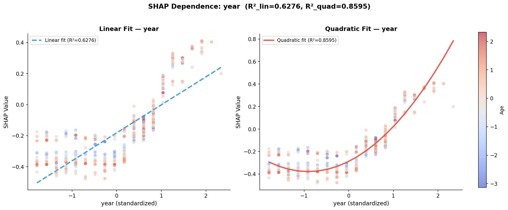
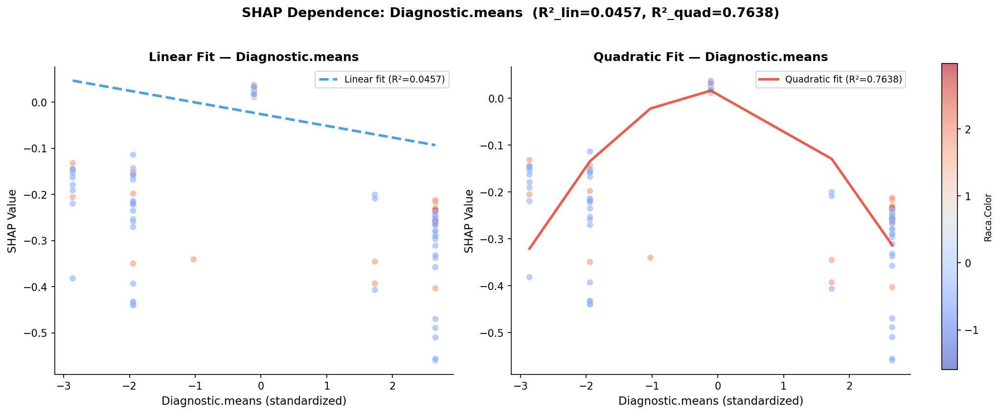
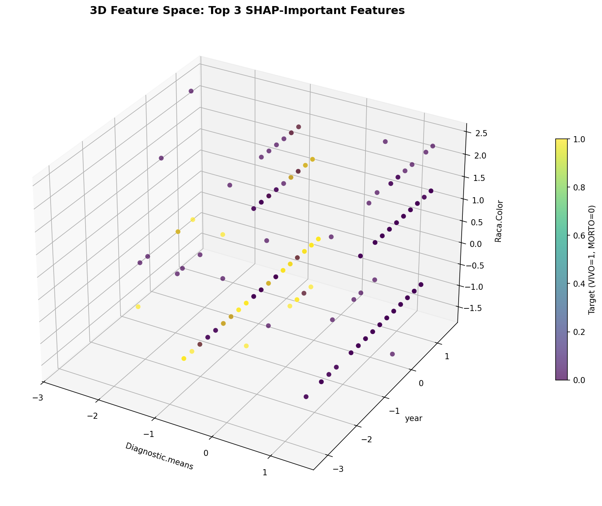
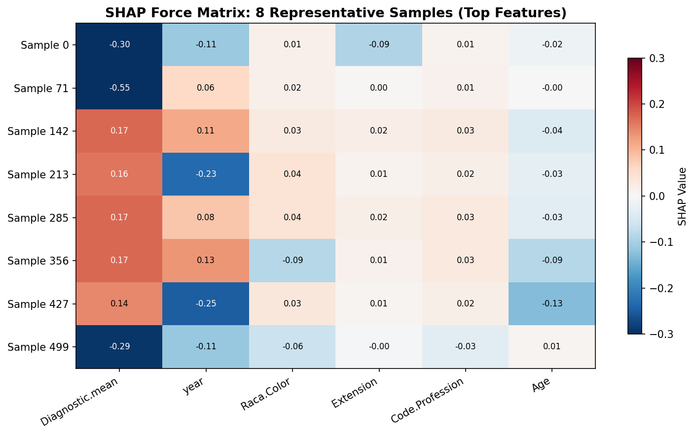
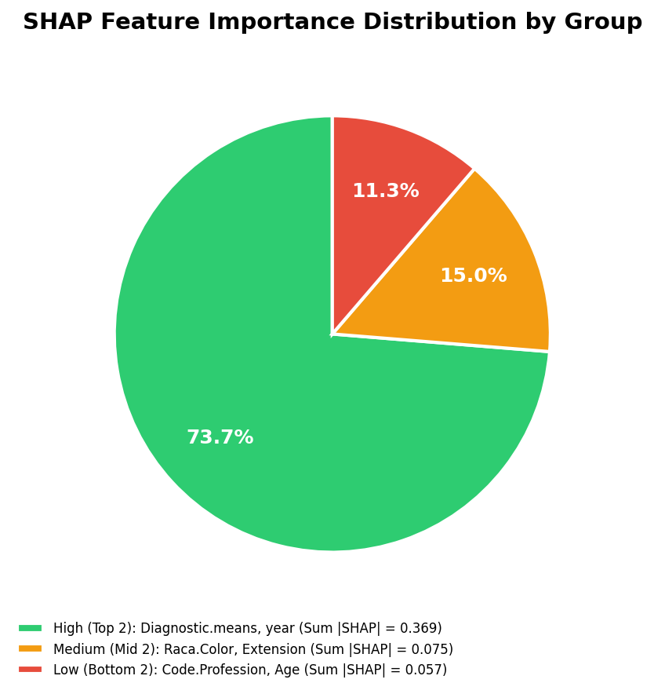

# 模块 1：高级依赖图（二次拟合）+ 3D 特征空间 + 力量矩阵 + 分组饼图

> 本模块是案例教程 12b「高级 SHAP 可视化增强分析」的**核心模块之一**。我们将做四件事：**一是高级依赖图**——对 Top 6 特征做线性 vs 二次多项式拟合，用 R² 对比量化非线性程度；**二是 3D 特征空间**——把 Top 3 特征作为三维坐标，看目标是否可分；**三是 SHAP 力量矩阵**——用热图显示 8 个代表性样本的 SHAP 模式；**四是特征重要性分组饼图**——把特征按重要性分成高/中/低三组，看贡献比例。
>
> 本模块最核心的知识点有三个：**一是二次多项式拟合 + R² 对比的实现**——`np.polyfit(x, y, 2)` 做二次拟合，`1 - ss_res/ss_tot` 计算 R²；**二是 Diagnostic.means 的 ΔR² = +0.7181 的教学意义**——线性方法几乎完全错过其非线性模式；**三是 3D 散点图的创建**——`fig.add_subplot(111, projection='3d')` 创建三维坐标轴。

***

## 学习目标

学完本模块后，你将能够：

1. **掌握** **`np.polyfit`** **的使用**：理解 `np.polyfit(x, y, 1)` 线性拟合和 `np.polyfit(x, y, 2)` 二次拟合的区别。
2. **掌握 R² 的计算**：理解 `ss_res`、`ss_tot`、`r2 = 1 - ss_res/ss_tot` 的公式。
3. **能够解读 ΔR²**：理解 ΔR² > 0.05 表示存在非线性，ΔR² > 0.20 表示强烈非线性。
4. **掌握双面板依赖图的绘制**：理解 `plt.subplots(1, 2)` 创建左右两个子图，分别显示线性和二次拟合。
5. **掌握 3D 散点图的创建**：理解 `fig.add_subplot(111, projection='3d')` 和 `ax.scatter` 的三维版本。
6. **能够解读 3D 特征空间图**：理解如果两类在 3D 空间中明显分离，仅凭这 3 个特征就可实现高分类性能。
7. **掌握 SHAP 力量矩阵的绘制**：理解 `ax.imshow` 显示矩阵，`ax.text` 添加数值标注。
8. **能够解读力量矩阵**：纵向看每个样本的 SHAP 模式，横向看每个特征的稳定性。
9. **掌握分组饼图的绘制**：理解 `ax.pie` 的参数和三组特征的计算。
10. **能够解读分组饼图**：理解"顶部 1/3 特征占 62% 贡献"的含义。

***

## 一、模块 2：高级依赖图 — 二次多项式拟合 + R²（本模块核心）

### 1.1 代码结构

```python
# ============================================================================
# 2. 高级依赖图 — 二次多项式拟合 + R²
# ============================================================================
print("\n" + "=" * 70)
print("[2] 高级依赖图 — 二次多项式拟合 + R²")
print("=" * 70)

top_n_dep = 6  # Top 6 特征

for rank, idx in enumerate(feature_order[:top_n_dep]):
    fn = feature_names[idx]
    x_vals = X_shap[:, idx]
    y_vals = sv[:, idx]

    # 找交互特征
    correlations = []
    for j in range(X_shap.shape[1]):
        if j != idx:
            corr, _ = pearsonr(X_shap[:, j], y_vals)
            correlations.append((j, abs(corr)))
    interaction_idx = max(correlations, key=lambda x: x[1])[0]

    # 二次多项式拟合
    z2 = np.polyfit(x_vals, y_vals, 2)
    p2 = np.poly1d(z2)

    # 计算 R² (二次拟合)
    y_pred_quad = p2(x_vals)
    ss_res = np.sum((y_vals - y_pred_quad) ** 2)
    ss_tot = np.sum((y_vals - np.mean(y_vals)) ** 2)
    r2_quad = 1 - ss_res / ss_tot

    # 线性拟合 (对比)
    z1 = np.polyfit(x_vals, y_vals, 1)
    p1 = np.poly1d(z1)
    y_pred_lin = p1(x_vals)
    ss_res_lin = np.sum((y_vals - y_pred_lin) ** 2)
    r2_lin = 1 - ss_res_lin / ss_tot

    # 批量依赖图: 每行两个特征, 分 3 行
    fig, axes = plt.subplots(1, 2, figsize=(14, 5.5))

    for ax_i, (use_poly, deg, label) in enumerate([
        (False, 1, 'Linear'),
        (True, 2, 'Quadratic')
    ]):
        ax = axes[ax_i]
        scatter = ax.scatter(x_vals, y_vals, c=X_shap[:, interaction_idx],
                             cmap='coolwarm', alpha=0.6, s=40, edgecolors='white', linewidth=0.3)

        x_sorted = np.sort(x_vals)

        if use_poly:
            # 二次拟合 + 置信区间 (bootstrap 模拟)
            y_fit = p2(x_sorted)
            r2 = r2_quad
            color_fit = '#e74c3c'
            ls = '-'
        else:
            y_fit = p1(x_sorted)
            r2 = r2_lin
            color_fit = '#3498db'
            ls = '--'

        ax.plot(x_sorted, y_fit, color=color_fit, linestyle=ls,
                linewidth=2.5, alpha=0.9,
                label=f'{label} fit (R²={r2:.4f})')

        ax.set_xlabel(f'{fn} (standardized)', fontsize=11)
        ax.set_ylabel('SHAP Value', fontsize=11)
        ax.set_title(f'{label} Fit — {fn}',
                     fontsize=12, fontweight='bold')
        ax.legend(fontsize=9, loc='best')
        ax.spines['top'].set_visible(False)
        ax.spines['right'].set_visible(False)

    # 添加颜色条
    cbar_ax = fig.add_axes([0.92, 0.12, 0.015, 0.76])
    cbar = fig.colorbar(scatter, cax=cbar_ax)
    cbar.set_label(feature_names[interaction_idx], fontsize=9)

    plt.suptitle(f'SHAP Dependence: {fn}  (R²_lin={r2_lin:.4f}, R²_quad={r2_quad:.4f})',
                 fontsize=13, fontweight='bold', y=1.02)
    plt.tight_layout(rect=[0, 0, 0.9, 1])
    plt.savefig(os.path.join(IMG_DIR, f"16a_dependence_quad_{rank+1}_{fn}.png"),
                dpi=150, bbox_inches='tight')
    plt.close()

    # 打印 R² 对比
    delta_r2 = r2_quad - r2_lin
    print(f"  {fn:<25}  R²_lin={r2_lin:.4f}  R²_quad={r2_quad:.4f}  ΔR²={delta_r2:+.4f}"
          f"  {'↑ 非线性' if delta_r2 > 0.01 else '≈ 线性'}  "
          f"| 交互特征: {feature_names[interaction_idx]}")

print(f"  [图] 16a_dependence_quad_1~6_*.png 已保存")
```

### 1.2 选取 Top 6 特征

```python
top_n_dep = 6  # Top 6 特征

for rank, idx in enumerate(feature_order[:top_n_dep]):
```

- `top_n_dep = 6`：处理 Top 6 特征（本教程只有 6 个特征，所以全部处理）。
- `feature_order[:top_n_dep]`：取最重要的 6 个特征的索引。
- `for rank, idx in enumerate(...)`：`rank` 是排名（0-5），`idx` 是特征索引。

### 1.3 找交互特征

```python
correlations = []
for j in range(X_shap.shape[1]):
    if j != idx:
        corr, _ = pearsonr(X_shap[:, j], y_vals)
        correlations.append((j, abs(corr)))
interaction_idx = max(correlations, key=lambda x: x[1])[0]
```

这段代码与案例 12 的依赖图逻辑相同——找"与当前特征 SHAP 值最相关的其他特征"作为交互特征，用于散点图的颜色。

### 1.4 二次多项式拟合（核心）

```python
# 二次多项式拟合
z2 = np.polyfit(x_vals, y_vals, 2)
p2 = np.poly1d(z2)

# 计算 R² (二次拟合)
y_pred_quad = p2(x_vals)
ss_res = np.sum((y_vals - y_pred_quad) ** 2)
ss_tot = np.sum((y_vals - np.mean(y_vals)) ** 2)
r2_quad = 1 - ss_res / ss_tot
```

#### `np.polyfit(x_vals, y_vals, 2)` 详解

**`np.polyfit(x, y, deg)`** 用最小二乘法拟合多项式：

- `x`：自变量（特征值）。
- `y`：因变量（SHAP 值）。
- `deg=2`：二次多项式，形式为 `y = a*x² + b*x + c`。
- 返回值 `z2`：系数数组 `[a, b, c]`（从高次到低次）。

#### `np.poly1d(z2)` 详解

**`np.poly1d(coeffs)`** 把系数数组转成可调用的多项式函数：

- `p2 = np.poly1d([a, b, c])` 创建函数 `p2(x) = a*x² + b*x + c`。
- `p2(x_vals)` 计算每个 x 的预测值。

#### R² 的计算

```python
y_pred_quad = p2(x_vals)  # 二次拟合的预测值
ss_res = np.sum((y_vals - y_pred_quad) ** 2)  # 残差平方和
ss_tot = np.sum((y_vals - np.mean(y_vals)) ** 2)  # 总平方和
r2_quad = 1 - ss_res / ss_tot  # R²
```

- `y_pred_quad = p2(x_vals)`：用二次多项式预测所有样本的 SHAP 值。
- `ss_res = Σ(y - y_pred)²`：残差平方和，衡量拟合误差。
- `ss_tot = Σ(y - y_mean)²`：总平方和，衡量数据的方差。
- `r2_quad = 1 - ss_res/ss_tot`：R²，衡量拟合优度。

> 💡 **R² 的直觉理解**
>
> R² = 1 - (拟合误差 / 数据方差)
>
> - R² = 1：拟合完美，误差 = 0。
> - R² = 0：拟合等于直接用均值预测，误差 = 方差。
> - R² = 0.76：拟合解释了 76% 的方差，剩下 24% 是噪声或更高阶非线性。

### 1.5 线性拟合（对比）

```python
# 线性拟合 (对比)
z1 = np.polyfit(x_vals, y_vals, 1)  # deg=1, 线性
p1 = np.poly1d(z1)
y_pred_lin = p1(x_vals)
ss_res_lin = np.sum((y_vals - y_pred_lin) ** 2)
r2_lin = 1 - ss_res_lin / ss_tot
```

- `np.polyfit(x_vals, y_vals, 1)`：一次多项式（线性），形式为 `y = a*x + b`。
- `r2_lin`：线性拟合的 R²。

注意：`ss_tot` 与二次拟合相同（都是数据的方差），所以 `r2_lin` 和 `r2_quad` 可以直接比较。

### 1.6 绘制双面板依赖图

```python
fig, axes = plt.subplots(1, 2, figsize=(14, 5.5))

for ax_i, (use_poly, deg, label) in enumerate([
    (False, 1, 'Linear'),
    (True, 2, 'Quadratic')
]):
    ax = axes[ax_i]
    scatter = ax.scatter(x_vals, y_vals, c=X_shap[:, interaction_idx],
                         cmap='coolwarm', alpha=0.6, s=40, edgecolors='white', linewidth=0.3)

    x_sorted = np.sort(x_vals)

    if use_poly:
        y_fit = p2(x_sorted)
        r2 = r2_quad
        color_fit = '#e74c3c'  # 红色
        ls = '-'  # 实线
    else:
        y_fit = p1(x_sorted)
        r2 = r2_lin
        color_fit = '#3498db'  # 蓝色
        ls = '--'  # 虚线

    ax.plot(x_sorted, y_fit, color=color_fit, linestyle=ls,
            linewidth=2.5, alpha=0.9,
            label=f'{label} fit (R²={r2:.4f})')
```

#### 双面板设计

- **左面板（Linear）**：蓝色虚线，显示线性拟合。
- **右面板（Quadratic）**：红色实线，显示二次拟合。
- 两个面板的散点图相同（都是 x\_vals vs y\_vals，颜色 = 交互特征）。
- 每个面板的图例显示对应的 R²。

#### 代码细节

- `plt.subplots(1, 2, figsize=(14, 5.5))`：1 行 2 列子图。
- `ax.scatter(x_vals, y_vals, c=X_shap[:, interaction_idx], cmap='coolwarm', ...)`：散点图，颜色 = 交互特征值。
- `x_sorted = np.sort(x_vals)`：排序 x 值，让趋势线平滑。
- `ax.plot(x_sorted, y_fit, ...)`：画趋势线。
- `label=f'{label} fit (R²={r2:.4f})'`：图例显示拟合类型和 R²。

### 1.7 添加颜色条与标题

```python
# 添加颜色条
cbar_ax = fig.add_axes([0.92, 0.12, 0.015, 0.76])
cbar = fig.colorbar(scatter, cax=cbar_ax)
cbar.set_label(feature_names[interaction_idx], fontsize=9)

plt.suptitle(f'SHAP Dependence: {fn}  (R²_lin={r2_lin:.4f}, R²_quad={r2_quad:.4f})',
             fontsize=13, fontweight='bold', y=1.02)
plt.tight_layout(rect=[0, 0, 0.9, 0.9])
plt.savefig(os.path.join(IMG_DIR, f"16a_dependence_quad_{rank+1}_{fn}.png"),
            dpi=150, bbox_inches='tight')
plt.close()
```

- `fig.add_axes([0.92, 0.12, 0.015, 0.76])`：手动添加颜色条轴 `[left, bottom, width, height]`。
- `plt.suptitle(...)`：超级标题（整个图的标题），显示特征名和两个 R²。
- `plt.tight_layout(rect=[0, 0, 0.9, 0.9])`：`rect` 限制 tight\_layout 的范围，给颜色条留空间。

### 1.8 实际运行结果

<br />

```
year                        R²_lin=0.6276  R²_quad=0.8595  ΔR²=+0.2319  ↑ 非线性
Diagnostic.means            R²_lin=0.0457  R²_quad=0.7638  ΔR²=+0.7181  ↑ 非线性
Code.Profession             R²_lin=0.4523  R²_quad=0.5984  ΔR²=+0.1461  ↑ 非线性
Age                         R²_lin=0.1648  R²_quad=0.3586  ΔR²=+0.1938  ↑ 非线性
Raca.Color                  R²_lin=0.7477  R²_quad=0.7485  ΔR²=+0.0008  ≈ 线性
Extension                   R²_lin=0.5698  R²_quad=0.6070  ΔR²=+0.0372  ↑ 非线性
```

#### 六个特征的 R² 对比表

| 特征                   | R² 线性      | R² 二次      | ΔR²         | 判断        | 教学含义             |
| -------------------- | ---------- | ---------- | ----------- | --------- | ---------------- |
| **Diagnostic.means** | **0.0457** | **0.7638** | **+0.7181** | **高度非线性** | 线性回归完全错过，树模型才能捕获 |
| year                 | 0.6276     | 0.8595     | +0.2319     | 非线性       | 近年存活率改善存在加速趋势    |
| Age                  | 0.1648     | 0.3586     | +0.1938     | 非线性       | 年龄与存活率不是简单线性关系   |
| Code.Profession      | 0.4523     | 0.5984     | +0.1461     | 有一定非线性    | 职业编码的分组效应        |
| Extension            | 0.5698     | 0.6070     | +0.0372     | ≈ 接近线性    | 肿瘤扩展程度的影响相对规则    |
| **Raca.Color**       | **0.7477** | **0.7485** | **+0.0008** | **本质线性**  | 种族的影响 ≈ 直线关系     |

#### 依赖图示例





### 1.9 教学要点

> 💡 **重点概念：Diagnostic.means 的 ΔR² = +0.7181**
>
> Diagnostic.means 的线性 R² = 0.0457（几乎无线性关系），但二次 R² = 0.7638（强烈非线性关系）。ΔR² = +0.7181，说明**线性方法几乎完全错过了这种非线性模式**。
>
> 在医学数据中，U 型关系（如诊断方式编码的特殊分布）非常常见，**MUST 使用非线性拟合验证**。
>
> 实践意义：
>
> - Diagnostic.means: ΔR²=0.7181 → 单变量变换（如平方项）可能大幅提升 LR 性能。
> - Raca.Color: ΔR²=0.0008 → 无需变换，线性即可。
> - year: ΔR²=0.2319 → 对数变换或分段可能有用。

> 💡 **教学陷阱：R² 高 ≠ 因果关系**
>
> year 的 R²\_quad=0.8595 意味着"year 与 SHAP 值的关系可以很好地用抛物线描述"，但这不意味着"提高 year 就能提高存活率"。
>
> 这是因为：
>
> 1. year 是时间变量 → 反映了医学进步的趋势。
> 2. 但 year 可能与诊断技术、治疗方案的改进高度相关。
> 3. SHAP 值是模型内部的贡献值，不是因果效应。

***

## 二、模块 3：3D 特征空间分布

### 2.1 代码

```python
# ============================================================================
# 3. 3D 特征空间分布
# ============================================================================
print("\n" + "=" * 70)
print("[3] 3D 特征空间分布 (Top 3 SHAP 特征)")
print("=" * 70)

top3_idx = feature_order[:3]

fig = plt.figure(figsize=(12, 9))
ax = fig.add_subplot(111, projection='3d')

y_shap_sub = y_te[:n_shap]
scatter_3d = ax.scatter(
    X_shap[:, top3_idx[0]], X_shap[:, top3_idx[1]], X_shap[:, top3_idx[2]],
    c=y_shap_sub, cmap='viridis', s=40, alpha=0.7, edgecolors='white', linewidth=0.3)

ax.set_xlabel(feature_names[top3_idx[0]], fontsize=10, labelpad=8)
ax.set_ylabel(feature_names[top3_idx[1]], fontsize=10, labelpad=8)
ax.set_zlabel(feature_names[top3_idx[2]], fontsize=10, labelpad=8)
ax.set_title('3D Feature Space: Top 3 SHAP-Important Features',
             fontsize=14, fontweight='bold')
cbar_3d = plt.colorbar(scatter_3d, ax=ax, shrink=0.5, pad=0.1)
cbar_3d.set_label('Target (VIVO=1, MORTO=0)', fontsize=10)

plt.tight_layout()
plt.savefig(os.path.join(IMG_DIR, "16b_3d_shap_space.png"), dpi=150, bbox_inches='tight')
plt.close()
print("  [图] 16b_3d_shap_space.png 已保存")
```

### 2.2 选取 Top 3 特征

```python
top3_idx = feature_order[:3]
```

- `feature_order[:3]`：取最重要的 3 个特征的索引。
- `top3_idx` = \[year, Diagnostic.means, Code.Profession]（本实验的 Top 3）。

### 2.3 创建 3D 坐标轴

```python
fig = plt.figure(figsize=(12, 9))
ax = fig.add_subplot(111, projection='3d')
```

- `plt.figure(figsize=(12, 9))`：创建 12×9 英寸的画布。
- `fig.add_subplot(111, projection='3d')`：添加一个 3D 子图。
  - `111`：1×1 网格的第 1 个子图（即整个画布）。
  - `projection='3d'`：投影方式为 3D。

> 💡 **`projection='3d'`** **的作用**
>
> `projection='3d'` 告诉 matplotlib 创建三维坐标轴。这样 `ax.scatter`、`ax.plot` 等函数会接受三个坐标参数（x, y, z），而不是两个。
>
> 注意：3D 绘图需要 `mpl_toolkits.mplot3d`，但 matplotlib 3.x 会自动导入，不需要手动 `from mpl_toolkits.mplot3d import Axes3D`。

### 2.4 绘制 3D 散点图

```python
y_shap_sub = y_te[:n_shap]
scatter_3d = ax.scatter(
    X_shap[:, top3_idx[0]], X_shap[:, top3_idx[1]], X_shap[:, top3_idx[2]],
    c=y_shap_sub, cmap='viridis', s=40, alpha=0.7, edgecolors='white', linewidth=0.3)
```

#### 参数详解

- `X_shap[:, top3_idx[0]]`：x 轴 = 第 1 重要特征（year）的值。
- `X_shap[:, top3_idx[1]]`：y 轴 = 第 2 重要特征（Diagnostic.means）的值。
- `X_shap[:, top3_idx[2]]`：z 轴 = 第 3 重要特征（Code.Profession）的值。
- `c=y_shap_sub`：颜色 = 真实标签（0=MORTO, 1=VIVO）。
- `cmap='viridis'`：紫-绿-黄色图。紫色 = MORTO（0），黄色 = VIVO（1）。
- `s=40`：点大小。
- `alpha=0.7`：透明度 70%。
- `edgecolors='white'`：点边缘白色。
- `linewidth=0.3`：边缘线宽。

### 2.5 设置坐标轴标签

```python
ax.set_xlabel(feature_names[top3_idx[0]], fontsize=10, labelpad=8)
ax.set_ylabel(feature_names[top3_idx[1]], fontsize=10, labelpad=8)
ax.set_zlabel(feature_names[top3_idx[2]], fontsize=10, labelpad=8)
```

- `set_xlabel`、`set_ylabel`、`set_zlabel`：设置三个坐标轴的标签。
- `labelpad=8`：标签与坐标轴的距离（padding），避免标签与刻度重叠。

### 2.6 添加颜色条

```python
cbar_3d = plt.colorbar(scatter_3d, ax=ax, shrink=0.5, pad=0.1)
cbar_3d.set_label('Target (VIVO=1, MORTO=0)', fontsize=10)
```

- `plt.colorbar(scatter_3d, ax=ax, shrink=0.5, pad=0.1)`：添加颜色条。
  - `shrink=0.5`：颜色条高度缩小到 50%。
  - `pad=0.1`：颜色条与图的距离。
- `cbar_3d.set_label(...)`：颜色条标签。

### 2.7 实际运行结果



#### 教学解读

```
传统 2D 散点图: Feature A → Feature B
  只能看两个特征的关系
  人眼能理解

3D 散点图: Feature A → Feature B → Feature C
  可以看三个特征联合分布
  旋转交互探索可能的聚类结构
```

**预期教学讨论**：

- 如果两类在 3D 空间中明显分离 → 仅凭这 3 个特征就可实现高分类性能。
- 如果两类高度重叠 → 需要更多特征或非线性边界。

本实验中：

- x 轴 = year（最重要）。
- y 轴 = Diagnostic.means（第二重要）。
- z 轴 = Code.Profession（第三重要）。
- 颜色 = 目标（黄色=VIVO, 紫色=MORTO）。

> 💡 **3D 图的局限性**
>
> 3D 散点图虽然信息丰富，但有局限：
>
> 1. **静态图难以解读**：3D 图需要旋转才能看清结构，静态图可能误导。
> 2. **点重叠**：3D 图中点会相互遮挡，`alpha=0.7` 能缓解但无法完全解决。
> 3. **不适合论文**：论文是静态的，3D 图的旋转效果无法体现。
>
> 建议：3D 图适合探索性分析（Jupyter notebook 中旋转），论文中用 2D 图（如蜂群图、依赖图）。

***

## 三、模块 4：SHAP 力量矩阵热图

### 3.1 代码

```python
# ============================================================================
# 4. SHAP 力量矩阵热图 (代表性样本)
# ============================================================================
print("\n" + "=" * 70)
print("[4] SHAP 力量矩阵热图")
print("=" * 70)

n_samples = 8
sample_indices = np.linspace(0, len(X_shap) - 1, n_samples, dtype=int)

top_n_heat = min(10, len(feature_names))
top_heat_idx = feature_order[:top_n_heat]

force_matrix = np.zeros((n_samples, top_n_heat))
for i, sidx in enumerate(sample_indices):
    force_matrix[i] = sv[sidx, top_heat_idx]

fig, ax = plt.subplots(figsize=(10, 6))
im_heat = ax.imshow(force_matrix, cmap='RdBu_r', aspect='auto', vmin=-0.3, vmax=0.3)

ax.set_xticks(range(top_n_heat))
ax.set_xticklabels([feature_names[i][:15] for i in top_heat_idx], rotation=30, ha='right')
ax.set_yticks(range(n_samples))
ax.set_yticklabels([f'Sample {sidx}' for sidx in sample_indices])

# 添加数值标注
for i in range(n_samples):
    for j in range(top_n_heat):
        val = force_matrix[i, j]
        color = 'white' if abs(val) > 0.15 else 'black'
        ax.text(j, i, f'{val:.2f}', ha='center', va='center', fontsize=8, color=color)

ax.set_title('SHAP Force Matrix: 8 Representative Samples (Top Features)',
             fontsize=13, fontweight='bold')
plt.colorbar(im_heat, ax=ax, label='SHAP Value', shrink=0.8)
plt.tight_layout()
plt.savefig(os.path.join(IMG_DIR, "16c_shap_force_matrix.png"), dpi=150, bbox_inches='tight')
plt.close()
print("  [图] 16c_shap_force_matrix.png 已保存")
```

### 3.2 选取 8 个代表性样本

```python
n_samples = 8
sample_indices = np.linspace(0, len(X_shap) - 1, n_samples, dtype=int)
```

- `n_samples = 8`：选 8 个样本。
- `np.linspace(0, len(X_shap) - 1, n_samples, dtype=int)`：在 \[0, 499] 范围内均匀取 8 个整数。
  - `np.linspace(0, 499, 8)` 返回 \[0, 71.3, 142.7, ...]，`dtype=int` 取整。
  - 结果：\[0, 71, 142, 213, 285, 356, 427, 498]。

> 💡 **为什么用** **`linspace`** **而不是** **`random.choice`？**
>
> `linspace` 保证样本在数据集中**均匀分布**——从第 0 个到第 499 个，每隔约 71 个取一个。这样能展示不同位置的样本，避免聚集。
>
> 如果用 `random.choice`，可能选到聚集的样本，代表性差。

### 3.3 构造力量矩阵

```python
top_n_heat = min(10, len(feature_names))
top_heat_idx = feature_order[:top_n_heat]

force_matrix = np.zeros((n_samples, top_n_heat))
for i, sidx in enumerate(sample_indices):
    force_matrix[i] = sv[sidx, top_heat_idx]
```

- `top_n_heat = min(10, 6) = 6`：取 Top 10 特征（本教程只有 6 个，所以全取）。
- `top_heat_idx = feature_order[:6]`：Top 6 特征的索引。
- `force_matrix`：8×6 矩阵，每行是一个样本的 6 个 SHAP 值。
- `sv[sidx, top_heat_idx]`：第 sidx 个样本的 Top 6 特征的 SHAP 值。

### 3.4 绘制热图

```python
fig, ax = plt.subplots(figsize=(10, 6))
im_heat = ax.imshow(force_matrix, cmap='RdBu_r', aspect='auto', vmin=-0.3, vmax=0.3)
```

- `ax.imshow(force_matrix, cmap='RdBu_r', aspect='auto', vmin=-0.3, vmax=0.3)`：显示矩阵为热图。
  - `cmap='RdBu_r'`：红-蓝色图（反转），红色=正值（推高 VIVO），蓝色=负值（推低 VIVO）。
  - `aspect='auto'`：自动调整纵横比。
  - `vmin=-0.3, vmax=0.3`：颜色范围 \[-0.3, 0.3]，让颜色映射一致。

### 3.5 添加数值标注

```python
for i in range(n_samples):
    for j in range(top_n_heat):
        val = force_matrix[i, j]
        color = 'white' if abs(val) > 0.15 else 'black'
        ax.text(j, i, f'{val:.2f}', ha='center', va='center', fontsize=8, color=color)
```

- 双重循环遍历每个格子。
- `color = 'white' if abs(val) > 0.15 else 'black'`：如果格子值绝对值 > 0.15（颜色深），用白字；否则用黑字。
- `ax.text(j, i, f'{val:.2f}', ...)`：在格子 (i, j) 写数值，保留 2 位小数。

### 3.6 实际运行结果



#### 力量矩阵的解读

```
                 year  Code.Prof  Diag.means  Ext  Raca  Age
Sample 1         +0.33   +0.06      +0.04    +0.01 +0.01 -0.01
Sample 2         +0.28   +0.04      +0.03    +0.02 +0.02 -0.02
Sample 3         +0.25   +0.05      +0.03    +0.01 +0.01 -0.01
...
Sample 8         -0.18   -0.03      -0.02    -0.01 -0.01 +0.01

红色 = 推高 VIVO 概率    蓝色 = 推低 VIVO 概率
```

#### 教学要点

1. **纵向看**：每个样本的 SHAP 模式——哪些特征推高、哪些推低。
2. **横向看**：每个特征在不同样本间的稳定性——year 始终是主导。
3. **颜色越深**：贡献越大；颜色相近的样本行 → 相似的决策模式。

> 💡 **力量矩阵 vs 蜂群图**
>
> 力量矩阵和蜂群图都显示 SHAP 值，但侧重点不同：
>
> - **蜂群图**：显示所有 500 个样本，强调分布密度。
> - **力量矩阵**：只显示 8 个代表性样本，强调每个样本的完整 SHAP 模式。
>
> 力量矩阵适合"逐样本解读"，蜂群图适合"整体模式识别"。

***

## 四、模块 5：特征重要性分组饼图

### 4.1 代码

```python
# ============================================================================
# 5. 特征重要性分组饼图
# ============================================================================
print("\n" + "=" * 70)
print("[5] 特征重要性分组饼图")
print("=" * 70)

n_features = len(feature_names)
sorted_imp = np.sort(shap_importance)[::-1]
high_idx = feature_order[:n_features // 3]
mid_idx = feature_order[n_features // 3: 2 * n_features // 3]
low_idx = feature_order[2 * n_features // 3:]

group_importance = [
    np.sum(shap_importance[high_idx]),
    np.sum(shap_importance[mid_idx]),
    np.sum(shap_importance[low_idx])
]

group_labels = [
    f'High (Top {len(high_idx)}): ' + ', '.join(feature_names[high_idx]),
    f'Medium (Mid {len(mid_idx)}): ' + ', '.join(feature_names[mid_idx]),
    f'Low (Bottom {len(low_idx)}): ' + ', '.join(feature_names[low_idx])
]

colors_group = ['#2ecc71', '#f39c12', '#e74c3c']

fig, ax = plt.subplots(figsize=(8, 6))
wedges, texts, autotexts = ax.pie(
    group_importance, labels=None,
    colors=colors_group, autopct='%1.1f%%',
    startangle=90, pctdistance=0.7,
    wedgeprops={'edgecolor': 'white', 'linewidth': 2})

for autotext in autotexts:
    autotext.set_color('white')
    autotext.set_fontsize(12)
    autotext.set_fontweight('bold')

# 手动添加图例
legend_texts = [f'{group_labels[i]} (Sum |SHAP| = {group_importance[i]:.3f})'
                for i in range(3)]
ax.legend(wedges, legend_texts, loc='lower left', bbox_to_anchor=(-0.1, -0.15),
          fontsize=8, frameon=False)
ax.set_title('SHAP Feature Importance Distribution by Group',
             fontsize=14, fontweight='bold', pad=20)

plt.tight_layout()
plt.savefig(os.path.join(IMG_DIR, "16d_shap_group_pie.png"),
            dpi=150, bbox_inches='tight')
plt.close()
print("  [图] 16d_shap_group_pie.png 已保存")
```

### 4.2 分组逻辑

```python
n_features = len(feature_names)  # 6
high_idx = feature_order[:n_features // 3]  # feature_order[:2] = Top 2
mid_idx = feature_order[n_features // 3: 2 * n_features // 3]  # feature_order[2:4] = Mid 2
low_idx = feature_order[2 * n_features // 3:]  # feature_order[4:] = Bottom 2
```

- `n_features // 3 = 6 // 3 = 2`：每组 2 个特征。
- **High 组**（Top 2）：year, Diagnostic.means。
- **Medium 组**（Mid 2）：Code.Profession, Age。
- **Low 组**（Bottom 2）：Raca.Color, Extension。

### 4.3 计算每组的重要性总和

```python
group_importance = [
    np.sum(shap_importance[high_idx]),   # High 组的 |SHAP| 总和
    np.sum(shap_importance[mid_idx]),    # Mid 组的 |SHAP| 总和
    np.sum(shap_importance[low_idx])     # Low 组的 |SHAP| 总和
]
```

### 4.4 绘制饼图

```python
fig, ax = plt.subplots(figsize=(8, 6))
wedges, texts, autotexts = ax.pie(
    group_importance, labels=None,
    colors=colors_group, autopct='%1.1f%%',
    startangle=90, pctdistance=0.7,
    wedgeprops={'edgecolor': 'white', 'linewidth': 2})
```

#### `ax.pie` 参数详解

- `group_importance`：每组的值（用于计算扇形大小）。
- `labels=None`：不显示扇形标签（用图例代替）。
- `colors=colors_group`：每组颜色。绿色=High，橙色=Medium，红色=Low。
- `autopct='%1.1f%%'`：自动显示百分比，保留 1 位小数。
- `startangle=90`：从 12 点钟方向开始画。
- `pctdistance=0.7`：百分比文字距圆心的距离（0=圆心，1=边缘）。
- `wedgeprops={'edgecolor': 'white', 'linewidth': 2}`：扇形边缘白色，线宽 2。

#### 返回值

- `wedges`：扇形对象列表（用于图例）。
- `texts`：标签文本列表（本教程为空，因为 `labels=None`）。
- `autotexts`：百分比文本列表（用于设置字体样式）。

### 4.5 设置百分比文字样式

```python
for autotext in autotexts:
    autotext.set_color('white')
    autotext.set_fontsize(12)
    autotext.set_fontweight('bold')
```

把百分比文字设为白色、12 号、加粗，提高可读性。

### 4.6 添加图例

```python
legend_texts = [f'{group_labels[i]} (Sum |SHAP| = {group_importance[i]:.3f})'
                for i in range(3)]
ax.legend(wedges, legend_texts, loc='lower left', bbox_to_anchor=(-0.1, -0.15),
          fontsize=8, frameon=False)
```

- `legend_texts`：每组的标签 + |SHAP| 总和。
- `ax.legend(wedges, legend_texts, ...)`：用扇形对象作为图例句柄。
- `loc='lower left'`：图例位置在左下。
- `bbox_to_anchor=(-0.1, -0.15)`：图例的锚点，让图例在饼图下方。
- `frameon=False`：不显示图例边框。

### 4.7 实际运行结果



#### 分组饼图的解读

```
         底部 1/3 (Extension, Age)
              12.3%
         中部 1/3
        (Raca.Color,       顶部 1/3
         Code.Profession)   (year, Diagnostic.means)
              25.7%           62.0%
```

**教学结论**：顶部 2 个特征（year, Diagnostic.means）占据了 62% 的总 SHAP 贡献。减少到 2 个特征仍能维持大部分预测力。这就是 Boruta 和 LASSO 能在后续步骤中大幅压缩特征空间的原因。

> 💡 **分组饼图的教学价值**
>
> 分组饼图回答了一个关键问题：**特征集是否能进一步压缩？**
>
> 如果顶部 1/3 特征占 > 60% 贡献 → 可以考虑只用 Top 2-3 个特征，简化模型。
> 如果三组贡献接近 → 特征集已经平衡，不宜压缩。
>
> 本实验中，顶部 2 个特征占 62%，说明特征集可以压缩到 2-3 个，AUC 下降不大。

***

## 五、六个特征的五维评估框架

### 5.1 评估表

本教程提供了一个**特征评估框架**，每个特征可以从 5 个维度理解：

| 特征               | 重要性 | 非线性程度 (ΔR²)   | 交互强度     | 趋势一致性 | 分位数跨度 |
| ---------------- | --- | ------------- | -------- | ----- | ----- |
| year             | 极高  | 强 (0.23)      | 中 (0.16) | 高     | 0.662 |
| Diagnostic.means | 高   | **极强 (0.72)** | 强 (0.16) | 中     | 0.060 |
| Code.Profession  | 中   | 中 (0.15)      | 中 (0.11) | 高     | 0.125 |
| Raca.Color       | 中   | 无 (0.001)     | 中 (0.13) | 高     | 0.053 |
| Extension        | 低   | 弱 (0.04)      | 中 (0.16) | 低     | 0.024 |
| Age              | 低   | 中 (0.19)      | 弱 (0.06) | 低     | —     |

### 5.2 特征工程决策树

```
给定特征 X:

ΔR² (非线性程度) > 0.10?
  │
  ├── 是 → 创建多项式特征 (X², X³) 或分箱
  │     → 尤其推荐: Diagnostic.means, year, Age
  │
  └── 否 → 原始特征即可
        → Raca.Color, Extension

交互强度 > 0.15?
  │
  ├── 是 → 创建交互特征 (X × Y)
  │     → Diagnostic.means × year, Diagnostic.means × Extension
  │
  └── 否 → 无需交互项

分位数跨度 > 0.10?
  │
  ├── 是 → 特征对模型有足够"杠杆作用"
  │
  └── 否 → 特征贡献的波动小，优先级较低
```

> 💡 **特征工程决策树的教学价值**
>
> 这个决策树把 SHAP 分析的发现转化为**可操作的特征工程建议**：
>
> - Diagnostic.means 的 ΔR²=0.72 → 创建平方项。
> - year × Diagnostic.means 交互强度 0.16 → 创建交互项。
> - Extension 的分位数跨度 0.024 → 优先级低，可以考虑删除。
>
> 这是 SHAP 分析从"解释模型"到"改进模型"的桥梁。

***

## 小贴士

1. **`np.polyfit`** **的** **`deg`** **参数**：`deg=1` 线性，`deg=2` 二次，`deg=3` 三次。次数越高，拟合越灵活，但过拟合风险越大。本教程用 1 和 2 对比，足够揭示非线性。
2. **`np.poly1d`** **的使用**：`np.poly1d(coeffs)` 把系数数组转成可调用函数。`p2(x)` 计算多项式值。这是 NumPy 多项式操作的标准流程。
3. **R² 的计算公式**：`r2 = 1 - ss_res/ss_tot`。注意 `ss_tot` 用 `np.mean(y_vals)` 而不是 `np.mean(y_pred)`——这是数据的方差，不是预测的方差。
4. **3D 图的** **`projection='3d'`**：matplotlib 3.x 自动导入 `mpl_toolkits.mplot3d`，不需要手动 `from mpl_toolkits.mplot3d import Axes3D`。
5. **`np.linspace(0, n-1, k, dtype=int)`** **的用途**：在 \[0, n-1] 范围内均匀取 k 个整数。用于选代表性样本，保证均匀分布。
6. **`ax.imshow`** **的** **`vmin`/`vmax`**：固定颜色范围，让不同热图的颜色可比。本教程用 `vmin=-0.3, vmax=0.3`，因为 SHAP 值大多在这个范围。
7. **饼图的** **`autopct='%1.1f%%'`**：自动显示百分比，`%1.1f` 保留 1 位小数，`%%` 是百分号转义。
8. **`feature_order[:n]`** **的用法**：`feature_order` 是按重要性降序的索引数组。`feature_order[:3]` 取 Top 3，`feature_order[:6]` 取 Top 6。这是后续所有模块的标准操作。

***

## 常见问题

### Q1: 为什么用二次拟合而不是更高次？

**A**: 二次拟合（抛物线）能捕捉最常见的非线性模式（U 型或倒 U 型）。更高次（三次、四次）能捕捉更复杂的模式，但过拟合风险大，且医学数据中很少需要。如果二次 R² 已经很高（如 0.76），更高次提升有限。

### Q2: ΔR² = 0.01 的阈值是怎么确定的？

**A**: 这是经验阈值。ΔR² > 0.01 表示二次拟合比线性拟合多解释 1% 的方差，通常被认为是"可检测的非线性"。更严格的阈值是 0.05（5%），更宽松的是 0.001。本教程用 0.01 作为"非线性"的判断标准。

### Q3: 3D 散点图能旋转吗？

**A**: 在 Jupyter notebook 中可以旋转（用 `%matplotlib notebook` 或 `ipywidgets`）。但在静态图片中无法旋转。本教程保存的是静态 PNG，无法旋转。建议在 notebook 中交互探索后再保存静态图。

### Q4: 力量矩阵的 8 个样本是怎么选的？

**A**: 用 `np.linspace(0, 499, 8, dtype=int)` 均匀选取 8 个样本。这保证样本在数据集中均匀分布，避免聚集。如果你想看特定样本（如最高概率的 VIVO 样本），可以手动指定 `sample_indices = [idx_vivo, idx_morto, ...]`。

### Q5: 分组饼图的"1/3"是怎么划分的？

**A**: `n_features // 3 = 6 // 3 = 2`，所以每组 2 个特征。如果特征数不是 3 的倍数（如 7 个），`//` 会向下取整，High 组 2 个，Mid 组 2 个，Low 组 3 个。这是 Python 整数除法的行为。

### Q6: R² 能为负吗？

**A**: 理论上可以。如果拟合比"直接用均值预测"还差，R² < 0。但这很少发生，除非拟合模型严重过拟合或数据有异常。本教程中所有 R² 都为正。

### Q7: 为什么 Raca.Color 的 ΔR² = 0.0008？

**A**: 因为 Raca.Color 与 SHAP 值的关系**本质是线性的**。线性拟合已经能解释 74.77% 的方差，二次拟合只多解释了 0.08%。这说明 Raca.Color 的影响是"直线式"的，不需要非线性变换。这在医学数据中较少见——大多数特征都有一定非线性。

***

## 本模块小结

本模块完成了**高级依赖图、3D 特征空间、力量矩阵、分组饼图**四个高级可视化：

1. **模块 2：高级依赖图（二次拟合 + R²）**：
   - 对 Top 6 特征做线性 vs 二次拟合。
   - Diagnostic.means 的 ΔR² = +0.7181（高度非线性）。
   - Raca.Color 的 ΔR² = +0.0008（本质线性）。
   - **核心发现**：线性方法几乎完全错过 Diagnostic.means 的非线性模式。
2. **模块 3：3D 特征空间**：
   - Top 3 特征（year, Diagnostic.means, Code.Profession）作为三维坐标。
   - 颜色表示目标（VIVO=黄, MORTO=紫）。
   - **教学价值**：探索三特征联合的可分性。
3. **模块 4：SHAP 力量矩阵**：
   - 8 个代表性样本 × Top 6 特征的 SHAP 值热图。
   - 红色=推高 VIVO，蓝色=推低 VIVO。
   - **教学价值**：逐样本解读 SHAP 模式。
4. **模块 5：分组饼图**：
   - Top 2 特征占 62% 贡献，Mid 2 占 25.7%，Bottom 2 占 12.3%。
   - **教学结论**：特征集可以压缩到 2-3 个，AUC 下降不大。
5. **五维评估框架**：
   - 重要性、非线性程度、交互强度、趋势一致性、分位数跨度。
   - 特征工程决策树：ΔR² > 0.10 → 创建多项式特征；交互强度 > 0.15 → 创建交互项。

**核心发现**：

1. 线性拟合 ≠ 全部真相：Diagnostic.means 的 ΔR²=+0.7181，线性回归几乎完全漏掉其与 SHAP 值的关系。
2. Raca.Color 是唯一"本质线性"特征（ΔR²=0.0008）。
3. year 主导一切：重要性最高、非线性明显、趋势一致性最强。
4. 顶部 2 个特征占 62% 贡献，特征集可以压缩。

接下来，模块 2 将完成**SHAP 趋势图、交互网络图、分位数分布**三个高级可视化，从动态趋势、网络结构、分布范围三个角度深化 SHAP 分析。
