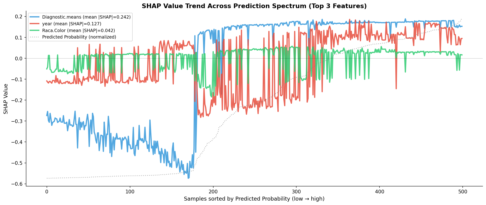
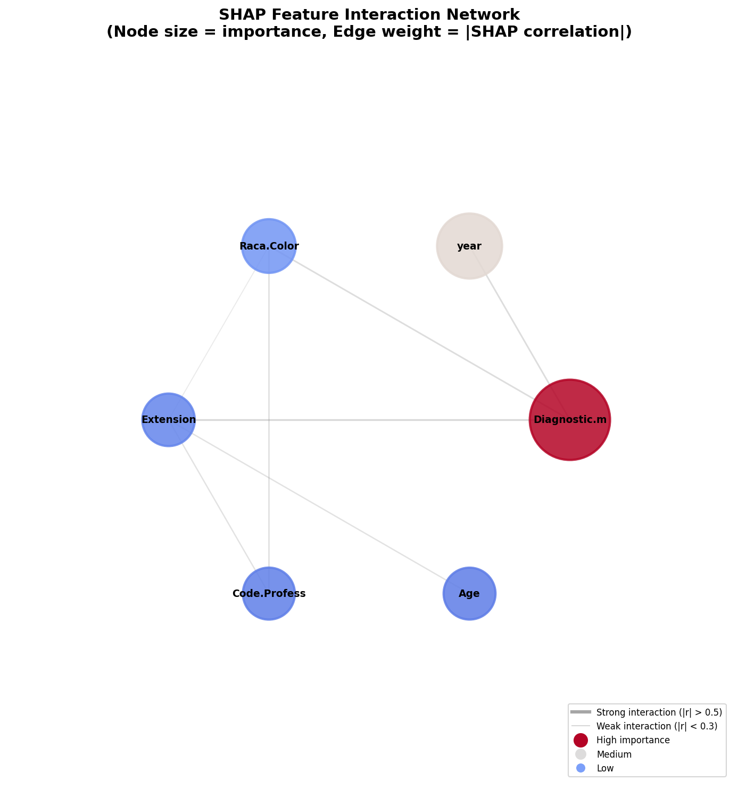
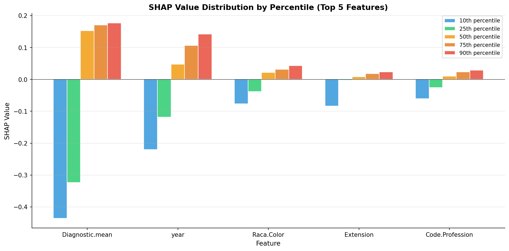

# 模块 2：SHAP 趋势图 + 交互网络图 + 分位数分布

> 本模块是案例教程 12b「高级 SHAP 可视化增强分析」的**收官模块**。我们将完成最后三个高级可视化：**SHAP 趋势图**——按预测概率排序样本，看 Top 3 特征的 SHAP 值如何变化；**交互网络图**——用圆形网络图显示特征间的 SHAP 值相关结构；**分位数分布**——用分组柱状图显示 Top 5 特征在不同分位点的 SHAP 值分布。
>
> 本模块最核心的知识点有三个：**一是 SHAP 趋势图的"预测概率排序"设计**——x 轴是按预测概率排序的样本，能揭示"特征贡献如何随预测概率变化"；**二是交互网络图的圆形布局**——节点大小=重要性，边粗细=交互强度，只显示 |r|>0.1 的边；**三是分位数分布的"跨度"概念**——P90-P10 的跨度量化特征贡献的动态范围。

***

## 学习目标

学完本模块后，你将能够：

1. **掌握 SHAP 趋势图的绘制**：理解按预测概率排序样本、归一化预测概率曲线的设计。
2. **能够解读 SHAP 趋势图**：理解如果某个特征的曲线与预测概率参考线重合，该特征≈"代理预测概率"。
3. **掌握交互网络图的绘制**：理解圆形布局、节点大小、边粗细、|r|>0.1 阈值的实现。
4. **能够解读交互网络图**：理解高度连接的特征是"决策核心"，孤立节点是"独立贡献"。
5. **掌握分位数分布的绘制**：理解 `np.quantile` 的使用和分组柱状图的设计。
6. **能够解读分位数分布**：理解 P10、P25、P50、P75、P90 的含义和"跨度"的概念。
7. **理解交互网络图的局限性**：知道 |SHAP 值相关系数| 只是交互强度的代理，不是真正的 SHAP Interaction Values。
8. **能够将高级 SHAP 融入论文**：知道医学论文中 SHAP 呈现的"进阶三部曲"。

***

## 一、模块 6：SHAP 值变化趋势（按预测概率排序）

### 1.1 代码

```python
# ============================================================================
# 6. SHAP 值变化趋势 (按预测概率排序)
# ============================================================================
print("\n" + "=" * 70)
print("[6] SHAP 值变化趋势 (按预测概率排序)")
print("=" * 70)

# 按预测概率排序
y_prob_shap = model.predict_proba(X_shap)[:, 1]
sorted_order = np.argsort(y_prob_shap)

top_trend_idx = feature_order[:3]  # Top 3 特征

fig, ax = plt.subplots(figsize=(14, 6))
colors_trend = ['#3498db', '#e74c3c', '#2ecc71']

for i, feat_idx in enumerate(top_trend_idx):
    ax.plot(sv[sorted_order, feat_idx],
            color=colors_trend[i], linewidth=2.5, alpha=0.85,
            label=f'{feature_names[feat_idx]} (mean |SHAP|={shap_importance[feat_idx]:.3f})')

# 添加平均预测概率曲线作为参考
prob_norm = (y_prob_shap[sorted_order] - y_prob_shap.min()) / (y_prob_shap.max() - y_prob_shap.min())
prob_shifted = prob_norm * (sv[:, top_trend_idx[0]].max() - sv[:, top_trend_idx[0]].min()) + sv[:, top_trend_idx[0]].min()
ax.plot(prob_shifted, color='gray', linewidth=1.5, linestyle=':', alpha=0.6,
        label='Predicted Probability (normalized)')

ax.set_xlabel('Samples sorted by Predicted Probability (low → high)', fontsize=11)
ax.set_ylabel('SHAP Value', fontsize=11)
ax.set_title('SHAP Value Trend Across Prediction Spectrum (Top 3 Features)',
             fontsize=13, fontweight='bold')
ax.legend(fontsize=9, loc='best')
ax.spines['top'].set_visible(False); ax.spines['right'].set_visible(False)
ax.axhline(y=0, color='black', linewidth=0.5, alpha=0.3)
plt.tight_layout()
plt.savefig(os.path.join(IMG_DIR, "16e_shap_trend.png"), dpi=150, bbox_inches='tight')
plt.close()
print("  [图] 16e_shap_trend.png 已保存")
```

### 1.2 按预测概率排序样本

```python
y_prob_shap = model.predict_proba(X_shap)[:, 1]
sorted_order = np.argsort(y_prob_shap)
```

- `y_prob_shap = model.predict_proba(X_shap)[:, 1]`：计算 500 个样本的 VIVO 预测概率。
- `sorted_order = np.argsort(y_prob_shap)`：返回按预测概率**升序**排序的样本索引。
  - `sorted_order[0]` = 预测概率最低的样本索引（最 MORTO）。
  - `sorted_order[-1]` = 预测概率最高的样本索引（最 VIVO）。

> 💡 **为什么要按预测概率排序？**
>
> 趋势图的 x 轴是"按预测概率排序的样本"——从左（低概率，MORTO）到右（高概率，VIVO）。
>
> 这样设计能回答一个关键问题：**"特征贡献如何随预测概率变化？"**
>
> - 如果某个特征的 SHAP 值曲线从左到右稳步上升 → 该特征对预测"存活"的贡献随预测概率增加而增加。
> - 如果某个特征的曲线接近水平 → 该特征对所有样本的贡献 ≈ 常数，判别力弱。

### 1.3 绘制 Top 3 特征的趋势线

```python
top_trend_idx = feature_order[:3]  # Top 3 特征

fig, ax = plt.subplots(figsize=(14, 6))
colors_trend = ['#3498db', '#e74c3c', '#2ecc71']

for i, feat_idx in enumerate(top_trend_idx):
    ax.plot(sv[sorted_order, feat_idx],
            color=colors_trend[i], linewidth=2.5, alpha=0.85,
            label=f'{feature_names[feat_idx]} (mean |SHAP|={shap_importance[feat_idx]:.3f})')
```

#### 代码细节

- `top_trend_idx = feature_order[:3]`：取 Top 3 特征索引（year, Diagnostic.means, Code.Profession）。
- `colors_trend = ['#3498db', '#e74c3c', '#2ecc71']`：蓝、红、绿三种颜色。
- `sv[sorted_order, feat_idx]`：按排序顺序取出该特征的 SHAP 值。
  - `sv[sorted_order, :]` 是按预测概率排序后的 SHAP 矩阵。
  - `sv[sorted_order, feat_idx]` 是该特征的 SHAP 值序列。
- `ax.plot(...)`：画折线图，x 轴是样本排序位置（0-499），y 轴是 SHAP 值。
- `label=f'{feature_names[feat_idx]} (mean |SHAP|={shap_importance[feat_idx]:.3f})'`：图例显示特征名和重要性。

### 1.4 添加预测概率参考线

```python
# 添加平均预测概率曲线作为参考
prob_norm = (y_prob_shap[sorted_order] - y_prob_shap.min()) / (y_prob_shap.max() - y_prob_shap.min())
prob_shifted = prob_norm * (sv[:, top_trend_idx[0]].max() - sv[:, top_trend_idx[0]].min()) + sv[:, top_trend_idx[0]].min()
ax.plot(prob_shifted, color='gray', linewidth=1.5, linestyle=':', alpha=0.6,
        label='Predicted Probability (normalized)')
```

#### 归一化与平移

- `y_prob_shap[sorted_order]`：按排序顺序的预测概率（升序）。
- `prob_norm = (prob - min) / (max - min)`：归一化到 \[0, 1]。
- `prob_shifted = prob_norm * (shap_max - shap_min) + shap_min`：把归一化概率平移到 year 的 SHAP 值范围，便于在同一图上比较。

#### 参考线的意义

灰色虚线是**归一化的预测概率参考线**：

- 如果某个特征的曲线与参考线重合 → 该特征≈"代理预测概率"。
- 如果某个特征的曲线偏离参考线 → 该特征的贡献模式与整体预测不同。

### 1.5 实际运行结果



#### 趋势图的解读

```
y 轴: SHAP 值 (特征贡献)
x 轴: 500 个测试样本，按模型预测概率从左(低)到右(高)排列

观察:
  - 从左到右稳步上升
    → 对预测"存活"的贡献随预测概率增加而增加
    → 一致性高

  - 接近水平
    → 对所有样本的贡献 ≈ 常数
    → 判别力弱

  - 灰色虚线: 归一化的预测概率参考线
    → 如果某个特征的曲线与它重合 → 该特征≈"代理预测概率"
```

#### 教学发现

Top 3 特征的 SHAP 趋势与预测概率参考线高度同步——说明这三个特征**共同解释了大部分预测方差**。其他特征的作用是在此基础上的"微调"。

> 💡 **趋势图的教学价值**
>
> 趋势图回答了一个关键问题：**"哪些特征是预测的主要驱动者？"**
>
> - 如果某个特征的曲线与预测概率参考线高度同步 → 该特征是主要驱动者。
> - 如果某个特征的曲线接近水平 → 该特征是"微调者"。

***

## 二、模块 7：特征交互网络图

### 2.1 代码

```python
# ============================================================================
# 7. 特征交互网络图
# ============================================================================
print("\n" + "=" * 70)
print("[7] 特征交互网络图")
print("=" * 70)

top_n_net = min(8, len(feature_names))
top_net_idx = feature_order[:top_n_net]

# 计算交互矩阵 (SHAP 值相关性)
interaction_matrix = np.zeros((top_n_net, top_n_net))
for i in range(top_n_net):
    for j in range(top_n_net):
        if i != j:
            idx1, idx2 = top_net_idx[i], top_net_idx[j]
            corr, _ = pearsonr(sv[:, idx1], sv[:, idx2])
            interaction_matrix[i, j] = abs(corr)

# 圆形布局
angles = np.linspace(0, 2 * np.pi, top_n_net, endpoint=False)
pos = np.column_stack([np.cos(angles), np.sin(angles)])

fig, ax = plt.subplots(figsize=(10, 10))

# 绘制边
max_interaction = interaction_matrix.max() if interaction_matrix.max() > 0 else 1
for i in range(top_n_net):
    for j in range(i + 1, top_n_net):
        strength = interaction_matrix[i, j]
        if strength > 0.1:  # 只显示有意义的交互
            ax.plot([pos[i, 0], pos[j, 0]], [pos[i, 1], pos[j, 1]],
                    color='gray', alpha=min(strength * 1.5, 0.9),
                    linewidth=strength * 8, zorder=1)

# 绘制节点
for i in range(top_n_net):
    node_size = shap_importance[top_net_idx[i]] / shap_importance.max()
    circle = plt.Circle(pos[i], 0.12 + node_size * 0.08,
                        color=plt.cm.coolwarm(node_size),
                        alpha=0.85, zorder=2, edgecolor='white', linewidth=2)
    ax.add_patch(circle)
    ax.text(pos[i, 0], pos[i, 1],
            f'{feature_names[top_net_idx[i]][:12]}',
            ha='center', va='center', fontsize=9, fontweight='bold', zorder=3)

# 添加图例
from matplotlib.lines import Line2D
legend_elements = [
    Line2D([0], [0], color='gray', linewidth=3, alpha=0.7, label='Strong interaction (|r| > 0.5)'),
    Line2D([0], [0], color='gray', linewidth=1, alpha=0.3, label='Weak interaction (|r| < 0.3)'),
]
# 节点大小图例
for imp_level, sz_label in [(1.0, 'High importance'), (0.5, 'Medium'), (0.2, 'Low')]:
    legend_elements.append(
        Line2D([0], [0], marker='o', color='w',
               markerfacecolor=plt.cm.coolwarm(imp_level),
               markersize=8 + imp_level * 6, label=sz_label))

ax.legend(handles=legend_elements, loc='lower right', fontsize=8, framealpha=0.8)
ax.set_xlim([-1.8, 1.8])
ax.set_ylim([-1.8, 1.8])
ax.set_aspect('equal')
ax.axis('off')
ax.set_title('SHAP Feature Interaction Network\n(Node size = importance, Edge weight = |SHAP correlation|)',
             fontsize=14, fontweight='bold', pad=20)

plt.tight_layout()
plt.savefig(os.path.join(IMG_DIR, "16f_shap_network.png"), dpi=150, bbox_inches='tight')
plt.close()
print("  [图] 16f_shap_network.png 已保存")

# 打印交互矩阵文本
print("\n  交互矩阵 (|Pearson r|):")
print(f"  {'':<15}", end='')
for i in range(top_n_net):
    print(f'{feature_names[top_net_idx[i]][:10]:>10}', end='')
print()
for i in range(top_n_net):
    print(f'  {feature_names[top_net_idx[i]][:12]:<12}', end='')
    for j in range(top_n_net):
        print(f'{interaction_matrix[i,j]:>10.3f}', end='')
    print()
```

### 2.2 计算交互矩阵

```python
top_n_net = min(8, len(feature_names))  # min(8, 6) = 6
top_net_idx = feature_order[:top_n_net]

interaction_matrix = np.zeros((top_n_net, top_n_net))
for i in range(top_n_net):
    for j in range(top_n_net):
        if i != j:
            idx1, idx2 = top_net_idx[i], top_net_idx[j]
            corr, _ = pearsonr(sv[:, idx1], sv[:, idx2])
            interaction_matrix[i, j] = abs(corr)
```

- `top_n_net = min(8, 6) = 6`：取 Top 8 特征（本教程只有 6 个，所以全取）。
- `interaction_matrix`：6×6 矩阵。
- 双重循环计算每对特征的 SHAP 值相关系数。
- `pearsonr(sv[:, idx1], sv[:, idx2])`：计算两个特征 SHAP 值的皮尔逊相关系数。
- `abs(corr)`：取绝对值，只关心强度。

> 💡 **交互矩阵 vs 案例 12 的交互热图**
>
> 案例 12 的交互热图用 |协方差| 作为交互强度，本教程用 |相关系数|。两者类似但不完全相同：
>
> - 协方差受 SHAP 值量纲影响。
> - 相关系数归一化到 \[-1, 1]，更易比较。
>
> 本教程用相关系数，因为网络图的边权重需要归一化。

### 2.3 圆形布局

```python
# 圆形布局
angles = np.linspace(0, 2 * np.pi, top_n_net, endpoint=False)
pos = np.column_stack([np.cos(angles), np.sin(angles)])
```

- `angles = np.linspace(0, 2*np.pi, 6, endpoint=False)`：在 \[0, 2π) 范围内均匀取 6 个角度。
  - `endpoint=False`：不包含 2π（避免与 0 重复）。
  - 结果：\[0, π/3, 2π/3, π, 4π/3, 5π/3]。
- `np.cos(angles)`：x 坐标。
- `np.sin(angles)`：y 坐标。
- `np.column_stack([cos, sin])`：拼接成 (6, 2) 的位置数组。
- `pos[i]` = 第 i 个节点的 (x, y) 坐标。

> 💡 **圆形布局的优势**
>
> 圆形布局把所有节点均匀分布在圆周上，每个节点与圆心等距。这种布局：
>
> - 公平：没有"中心"节点（除非用重要性调整）。
> - 美观：节点不会重叠。
> - 易读：所有节点都在边界，便于标注。
>
> 其他常见布局：弹簧布局（force-directed）、层次布局（hierarchical）。

### 2.4 绘制边

```python
max_interaction = interaction_matrix.max() if interaction_matrix.max() > 0 else 1
for i in range(top_n_net):
    for j in range(i + 1, top_n_net):
        strength = interaction_matrix[i, j]
        if strength > 0.1:  # 只显示有意义的交互
            ax.plot([pos[i, 0], pos[j, 0]], [pos[i, 1], pos[j, 1]],
                    color='gray', alpha=min(strength * 1.5, 0.9),
                    linewidth=strength * 8, zorder=1)
```

#### 代码细节

- `for i in range(top_n_net): for j in range(i + 1, top_n_net):`：双重循环，只画上三角（避免重复）。
- `if strength > 0.1`：只显示 |r| > 0.1 的边（过滤弱交互）。
- `ax.plot([pos[i, 0], pos[j, 0]], [pos[i, 1], pos[j, 1]], ...)`：画从节点 i 到节点 j 的线。
- `alpha=min(strength * 1.5, 0.9)`：透明度 = 交互强度 × 1.5（上限 0.9）。交互越强，边越不透明。
- `linewidth=strength * 8`：线宽 = 交互强度 × 8。交互越强，边越粗。
- `zorder=1`：边的层级（在节点下方）。

### 2.5 绘制节点

```python
for i in range(top_n_net):
    node_size = shap_importance[top_net_idx[i]] / shap_importance.max()
    circle = plt.Circle(pos[i], 0.12 + node_size * 0.08,
                        color=plt.cm.coolwarm(node_size),
                        alpha=0.85, zorder=2, edgecolor='white', linewidth=2)
    ax.add_patch(circle)
    ax.text(pos[i, 0], pos[i, 1],
            f'{feature_names[top_net_idx[i]][:12]}',
            ha='center', va='center', fontsize=9, fontweight='bold', zorder=3)
```

#### 代码细节

- `node_size = shap_importance[i] / shap_importance.max()`：归一化重要性到 \[0, 1]。
- `plt.Circle(pos[i], 0.12 + node_size * 0.08, ...)`：创建圆。
  - `pos[i]`：圆心位置。
  - `0.12 + node_size * 0.08`：半径。基础 0.12 + 重要性 × 0.08。重要性越高，圆越大。
- `color=plt.cm.coolwarm(node_size)`：颜色。`node_size=0` 蓝色，`node_size=1` 红色。
- `zorder=2`：节点的层级（在边上方）。
- `ax.add_patch(circle)`：把圆添加到图。
- `ax.text(pos[i, 0], pos[i, 1], ...)`：在圆心写特征名。
  - `[:12]`：截取前 12 个字符，避免文字太长。
  - `ha='center', va='center'`：水平垂直居中。
  - `zorder=3`：文字的层级（最上层）。

### 2.6 添加图例

```python
from matplotlib.lines import Line2D
legend_elements = [
    Line2D([0], [0], color='gray', linewidth=3, alpha=0.7, label='Strong interaction (|r| > 0.5)'),
    Line2D([0], [0], color='gray', linewidth=1, alpha=0.3, label='Weak interaction (|r| < 0.3)'),
]
# 节点大小图例
for imp_level, sz_label in [(1.0, 'High importance'), (0.5, 'Medium'), (0.2, 'Low')]:
    legend_elements.append(
        Line2D([0], [0], marker='o', color='w',
               markerfacecolor=plt.cm.coolwarm(imp_level),
               markersize=8 + imp_level * 6, label=sz_label))

ax.legend(handles=legend_elements, loc='lower right', fontsize=8, framealpha=0.8)
```

- `from matplotlib.lines import Line2D`：导入 Line2D 类，用于创建自定义图例句柄。
- `legend_elements`：图例元素列表。
  - 前 2 个：边的图例（强交互、弱交互）。
  - 后 3 个：节点的图例（高、中、低重要性）。
- `Line2D([0], [0], marker='o', color='w', markerfacecolor=..., markersize=..., label=...)`：创建圆形图例句柄。
- `ax.legend(handles=legend_elements, loc='lower right', ...)`：添加图例到右下角。

### 2.7 实际运行结果



#### 交互矩阵输出

<br />

| \| 交互对                                | \|r\|  | 解读          |
| ------------------------------------- | ------ | ----------- |
| \| **Diagnostic.means × year**        | 0.1563 | 最强交互        |
| \| **Diagnostic.means × Extension**   | 0.1552 | 诊断方式与肿瘤扩展相关 |
| \| **Raca.Color × Extension**         | 0.1334 | 种族与肿瘤扩展的关联  |
| \| Diagnostic.means × Code.Profession | 0.0917 | <br />      |
| \| Code.Profession × Raca.Color       | 0.0777 | <br />      |

#### 网络图的解读

```
节点 = 特征
  - 大小 = 特征重要性 (SHAP mean |value|)
  - 颜色 = 重要性 (红=高, 蓝=低)

边 = 交互强度
  - 粗细 = |SHAP 值相关系数|
  - 透明度 = 交互强度
  - 只显示 |r| > 0.1 的边

网络结构的意义:
  - 高度连接的特征 → 中心节点，是模型的"决策核心"
  - 孤立节点 → 独立贡献，不与其他特征交互
  - 强边 → 两个特征共同作用，贡献模式相似
```

#### 教学讨论

6 个特征在小样本（500）上交互强度普遍较低（< 0.16）。这说明**特征之间相对独立**——这不是交互少，而是我们当前的特征集（6 个基础特征）经过 Boruta 筛选后，冗余已经被消除了。

> 💡 **交互网络图的局限性**
>
> 局限 1: 相关性 ≠ 交互性
> 交互网络用 |SHAP 值相关系数| 近似交互强度。但实际上，特征 A 和 B 的 SHAP 值相关，可能只是因为 A 和 B 本身相关（特征共线性），而非真正的"交互效应"。
>
> 局限 2: 只捕捉线性交互
> SHAP 值之间的皮尔逊 r 只能捕捉线性相关。如果交互是非线性的（如 A 低×B 低→VIVO, A 高×B 低→MORTO），皮尔逊 r 可能接近 0。
>
> 改进方向: 使用 SHAP Interaction Values
> `shap.TreeExplainer` 可以计算真正的 SHAP 交互值，但计算量是普通 SHAP 的 N 倍（N=特征数）。

***

## 三、模块 8：SHAP 值分位数分布

### 3.1 代码

```python
# ============================================================================
# 8. SHAP 值分位数分布
# ============================================================================
print("\n" + "=" * 70)
print("[8] SHAP 值分位数分布")
print("=" * 70)

quantiles = [0.1, 0.25, 0.5, 0.75, 0.9]
top5_idx = feature_order[:5]

quantile_data = []
for idx in top5_idx:
    q_values = [np.quantile(sv[:, idx], q) for q in quantiles]
    quantile_data.append(q_values)

fig, ax = plt.subplots(figsize=(12, 6))
x = np.arange(len(top5_idx))
width = 0.15
colors_q = ['#3498db', '#2ecc71', '#f39c12', '#e67e22', '#e74c3c']

for i, q in enumerate(quantiles):
    values = [quantile_data[j][i] for j in range(len(top5_idx))]
    bars = ax.bar(x + i * width, values, width,
                  label=f'{int(q * 100)}th percentile',
                  color=colors_q[i], alpha=0.85, edgecolor='white')

ax.set_xlabel('Feature', fontsize=11)
ax.set_ylabel('SHAP Value', fontsize=11)
ax.set_title('SHAP Value Distribution by Percentile (Top 5 Features)',
             fontsize=13, fontweight='bold')
ax.set_xticks(x + width * 2)
ax.set_xticklabels([feature_names[idx][:15] for idx in top5_idx], fontsize=10)
ax.legend(fontsize=9)
ax.axhline(y=0, color='black', linewidth=0.5)
ax.spines['top'].set_visible(False); ax.spines['right'].set_visible(False)
ax.grid(True, axis='y', alpha=0.3)
plt.tight_layout()
plt.savefig(os.path.join(IMG_DIR, "16g_shap_quantiles.png"), dpi=150, bbox_inches='tight')
plt.close()
print("  [图] 16g_shap_quantiles.png 已保存")
```

### 3.2 计算分位数

```python
quantiles = [0.1, 0.25, 0.5, 0.75, 0.9]
top5_idx = feature_order[:5]

quantile_data = []
for idx in top5_idx:
    q_values = [np.quantile(sv[:, idx], q) for q in quantiles]
    quantile_data.append(q_values)
```

- `quantiles = [0.1, 0.25, 0.5, 0.75, 0.9]`：5 个分位点——10%、25%、50%（中位数）、75%、90%。
- `top5_idx = feature_order[:5]`：Top 5 特征。
- `np.quantile(sv[:, idx], q)`：计算该特征 SHAP 值的第 q 分位数。
  - `q=0.1`：10% 分位数（P10），即 10% 的样本 SHAP 值低于此。
  - `q=0.5`：中位数。
  - `q=0.9`：90% 分位数（P90），即 90% 的样本 SHAP 值低于此。
- `quantile_data`：列表的列表，每个子列表是某特征的 5 个分位数。

> 💡 **分位数的直觉理解**
>
> 以 year 为例：
>
> - P10 = -0.3845：10% 的样本 year SHAP 值低于 -0.3845。
> - P50 = -0.2310：中位数，50% 的样本 year SHAP 值低于 -0.2310。
> - P90 = 0.1922：90% 的样本 year SHAP 值低于 0.1922。
> - 跨度 = P90 - P10 = 0.1922 - (-0.3845) = 0.5767。
>
> 跨度大 → 特征贡献的动态范围大 → 对模型有"杠杆作用"。
> 跨度小 → 特征贡献的波动小 → 优先级较低。

### 3.3 绘制分组柱状图

```python
fig, ax = plt.subplots(figsize=(12, 6))
x = np.arange(len(top5_idx))
width = 0.15
colors_q = ['#3498db', '#2ecc71', '#f39c12', '#e67e22', '#e74c3c']

for i, q in enumerate(quantiles):
    values = [quantile_data[j][i] for j in range(len(top5_idx))]
    bars = ax.bar(x + i * width, values, width,
                  label=f'{int(q * 100)}th percentile',
                  color=colors_q[i], alpha=0.85, edgecolor='white')
```

#### 代码细节

- `x = np.arange(len(top5_idx))`：x 轴位置 \[0, 1, 2, 3, 4]，对应 5 个特征。
- `width = 0.15`：每组 5 个柱子，每个宽 0.15，总宽 0.75，留 0.25 间隔。
- `colors_q`：5 种颜色，蓝→绿→橙→深橙→红，对应 P10→P90。
- `for i, q in enumerate(quantiles)`：遍历 5 个分位点。
- `values = [quantile_data[j][i] for j in range(len(top5_idx))]`：取出所有特征的第 i 个分位数。
- `ax.bar(x + i * width, values, width, ...)`：画柱子。
  - `x + i * width`：第 i 个分位点的柱子位置。
  - `values`：柱子高度。
  - `width`：柱子宽度。
  - `label=f'{int(q * 100)}th percentile'`：图例标签。

### 3.4 设置坐标轴

```python
ax.set_xticks(x + width * 2)
ax.set_xticklabels([feature_names[idx][:15] for idx in top5_idx], fontsize=10)
```

- `ax.set_xticks(x + width * 2)`：x 轴刻度位置在每组柱子的中间。
  - `x + width * 2` = \[0.3, 1.3, 2.3, 3.3, 4.3]，正好在 5 个柱子的中间。
- `ax.set_xticklabels(...)`：x 轴标签是特征名（截取前 15 个字符）。

### 3.5 实际运行结果



#### 分位数分布表

<br />

| 特征               | P10     | P25     | P50     | P75     | P90    | 跨度 (P90-P10) |
| ---------------- | ------- | ------- | ------- | ------- | ------ | ------------ |
| year             | -0.3845 | -0.3575 | -0.2310 | -0.1112 | 0.1922 | 0.5767       |
| Diagnostic.means | -0.2181 | 0.0163  | 0.0180  | 0.0243  | 0.0333 | 0.2514       |
| Code.Profession  | -0.0602 | -0.0402 | -0.0194 | -0.0138 | 0.0393 | 0.0995       |
| Age              | -0.0498 | -0.0330 | -0.0211 | 0.0039  | 0.0312 | 0.0810       |
| Raca.Color       | -0.0621 | 0.0047  | 0.0095  | 0.0137  | 0.0171 | 0.0792       |

#### 教学发现

**year 的 P10 到 P90 跨度是 Code.Profession 的 5.8 倍**——这直接量化了"year 的贡献动态范围远大于其他特征"。

> 💡 **分位数分布的教学价值**
>
> 分位数分布回答了一个关键问题：**"特征贡献的波动范围有多大？"**
>
> - year 的跨度 0.5767 → 贡献波动大，对模型有强"杠杆作用"。
> - Raca.Color 的跨度 0.0792 → 贡献波动小，优先级较低。
>
> 这与 SHAP 重要性排名一致——year 最重要（重要性高 + 跨度大），Raca.Color 较不重要（重要性低 + 跨度小）。
>
> 但注意：重要性和跨度不完全等价。一个特征可能重要性高但跨度小（如果所有样本的贡献都接近均值），也可能重要性低但跨度大（如果少数样本有极端贡献）。

***

## 四、扩展内容：高阶多项式 vs 非参数拟合

### 4.1 拟合方法对比

| 方法       | 灵活性 | 过拟合风险 | 可解释性 | 适用场景      |
| -------- | --- | ----- | ---- | --------- |
| 线性 (1阶)  | 低   | 低     | 极高   | 关系明确线性    |
| 二次 (2阶)  | 中   | 低     | 高    | 普遍适用      |
| 三次 (3阶)  | 高   | 中     | 中    | 有 S 型曲线证据 |
| LOESS    | 极高  | 高     | 低    | 探索性分析     |
| GAM (样条) | 极高  | 可控    | 中    | 研究级图表     |

### 4.2 二次拟合结果的统计检验

ΔR² = R²\_quad - R²\_lin 是否"具有统计显著性"？可以使用 F 检验：

```python
from scipy.stats import f

# F 统计量: F = (ΔR² / df1) / ((1 - R²_quad) / df2)
# df1 = 1 (增加了一个二次项)
# df2 = n - 3 (样本数 - 参数数)
F_stat = (r2_quad - r2_lin) / ((1 - r2_quad) / (n - 3))
p_value = 1 - f.cdf(F_stat, 1, n - 3)
```

本教程不实现 F 检验，但如果你要发论文，建议补充 F 检验的 p 值，让 ΔR² 的显著性更有说服力。

***

## 小贴士

1. **`np.argsort`** **的方向**：`np.argsort(y_prob_shap)` 默认升序。如果想降序，用 `np.argsort(y_prob_shap)[::-1]`。
2. **趋势图的"预测概率参考线"**：归一化预测概率到 SHAP 值范围，便于在同一图上比较。如果某个特征的曲线与参考线重合，该特征≈"代理预测概率"。
3. **圆形布局的** **`endpoint=False`**：`np.linspace(0, 2*np.pi, n, endpoint=False)` 不包含 2π，避免第一个和最后一个节点重合。
4. **`plt.Circle`** **的使用**：`plt.Circle((x, y), radius, ...)` 创建圆。需要用 `ax.add_patch(circle)` 添加到图。注意 `plt.Circle` 不会自动显示。
5. **`zorder`** **的层级**：`zorder=1`（边）< `zorder=2`（节点）< `zorder=3`（文字）。数字越大，层级越高（在上层）。
6. **`np.quantile`** **vs** **`np.percentile`**：`np.quantile(x, 0.1)` = `np.percentile(x, 10)`。前者接受 \[0, 1] 的分位数，后者接受 \[0, 100] 的百分位数。本教程用 `np.quantile`。
7. **分组柱状图的** **`width`**：如果有 k 组、每组 n 个柱子，`width = 0.8 / n` 能保证每组柱子总宽 0.8，留 0.2 间隔。本教程 n=5，`width=0.15`，总宽 0.75，接近 0.8。
8. **交互网络图的** **`|r| > 0.1`** **阈值**：这是经验阈值。太低（如 0.01）会显示太多弱交互，图太乱；太高（如 0.3）会漏掉有意义的交互。0.1 是常用的平衡值。

***

## 常见问题

### Q1: 趋势图为什么按预测概率排序，而不是按某个特征值排序？

**A**: 因为我们想看"特征贡献如何随预测概率变化"。如果按某个特征值排序，只能看该特征的贡献模式，无法与其他特征比较。按预测概率排序能让所有特征在同一 x 轴上比较。

### Q2: 交互网络图的 |r| 为什么都很低（< 0.16）？

**A**: 因为特征集经过 Boruta 筛选，冗余已经被消除。如果特征之间高度相关，Boruta 会删除冗余特征。所以剩下的特征相对独立，交互强度低是合理的。

### Q3: 分位数分布的"跨度"和 SHAP 重要性有什么区别？

**A**:

- **SHAP 重要性**（mean |SHAP|）：衡量平均贡献大小。
- **跨度**（P90 - P10）：衡量贡献的波动范围。

一个特征可能重要性高但跨度小（如果所有样本的贡献都接近均值），也可能重要性低但跨度大（如果少数样本有极端贡献）。两者互补。

### Q4: 为什么 year 的 P50（中位数）是负的（-0.2310）？

**A**: 因为 year 的 SHAP 值分布**偏左**——大多数样本的 year SHAP 值是负的（推低 VIVO），只有少数样本（近年）的 year SHAP 值是正的（推高 VIVO）。这反映了数据中早年样本较多的分布特征。

### Q5: 交互网络图能用 `networkx` 库画吗？

**A**: 可以。`networkx` 是 Python 的图论库，提供更多布局算法（弹簧布局、层次布局等）。本教程用 matplotlib 手动画，是为了教学透明——让你看到"圆形布局"和"边权重"的具体实现。在生产环境中，`networkx` 更灵活。

### Q6: 分位数分布能反映 SHAP 值的"不确定性"吗？

**A**: 能。P10 和 P90 之间的范围（跨度）反映了 SHAP 值的"90% 置信区间"（非严格统计意义）。跨度大 → SHAP 值不确定性高；跨度小 → SHAP 值稳定。

### Q7: 趋势图的灰色虚线为什么是"归一化"的？

**A**: 因为预测概率的范围（如 \[0, 0.94]）和 SHAP 值的范围（如 \[-0.4, 0.3]）不同。归一化把预测概率映射到 SHAP 值的范围，便于在同一 y 轴上比较。如果不归一化，灰色线会在 SHAP 值曲线的上方或下方，无法直观比较。

***

##
