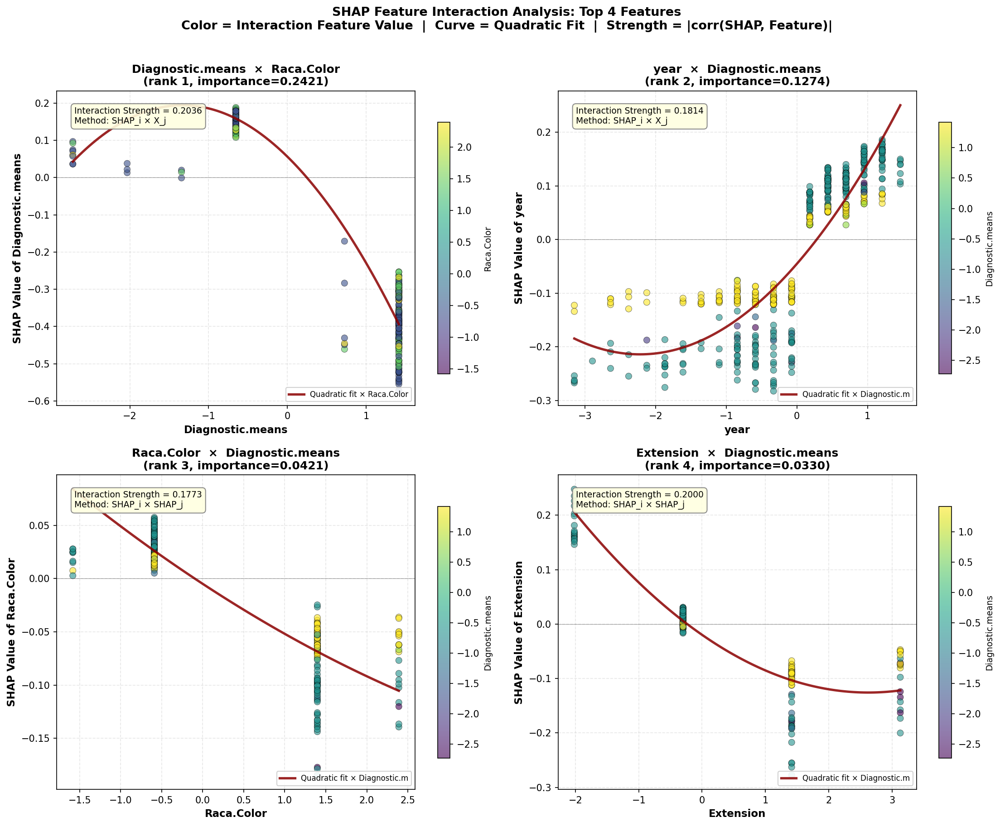

# 模块 1：交互效应扫描与交互依赖图

> 本模块是案例教程 13「SHAP 特征交互效应分析」的**核心模块之一**。在模块 0 中，我们已经准备好了 SHAP 值数组 `sv`（形状 `(500, 6)`）和原始特征值矩阵 `X_shap`。本模块将用这两份数据完成两件事：**第一，交互效应扫描**——对每个特征，自动搜索它的"最强交互对方"，并用两种度量方法（M1 和 M2）量化交互强度；**第二，交互依赖图绘制**——把 Top 4 重要特征的交互效应用 2×2 面板图可视化，散点按交互特征值着色，叠加二次拟合趋势线。
>
> 本模块最核心的知识点有四个：**一是交互强度两种度量方法的定义与区别**——M1 = `|corr(SHAP_i, X_j)|` 衡量"特征 j 的值如何调节特征 i 的贡献"，M2 = `|corr(SHAP_i, SHAP_j)|` 衡量"两个特征的贡献模式是否相似"；**二是为什么取两种方法的最大值**——因为两种方法捕捉的交互类型不同，取最大值能覆盖更多交互模式；**三是交互依赖图的着色逻辑**——散点颜色代表交互特征的值（从低到高），如果颜色与 y 值（SHAP 值）相关，说明存在交互；**四是二次拟合趋势线的作用**——用二次多项式拟合主特征值与 SHAP 值的关系，弯曲程度反映非线性。

***

## 学习目标

学完本模块后，你将能够：

1. **理解交互效应扫描的算法**：知道如何对每个特征遍历所有其他特征，计算交互强度，找到最强交互对方。
2. **掌握两种交互度量方法的定义**：
   - M1 = `|corr(SHAP_i, X_j)|`（SHAP 值与原始特征值的相关性）
   - M2 = `|corr(SHAP_i, SHAP_j)|`（两个 SHAP 值的相关性）
3. **理解交互矩阵** **`interaction_matrix`** **的结构**：知道它是 6×6 矩阵，`interaction_matrix[i, j]` 存储的是特征 i 和特征 j 的交互强度（取 M1 和 M2 的最大值）。
4. **掌握** **`interaction_pairs`** **列表的结构**：知道每个元素是一个字典，包含 `main_name`、`interact_name`、`strength`、`method` 四个字段。
5. **理解交互依赖图的绘制逻辑**：散点图按交互特征值着色、二次拟合趋势线、交互强度标注框、零线参考。
6. **掌握** **`plt.subplots(2, 2)`** **面板图的创建**：知道如何用 `axes.flatten()` 把 2×2 的 axes 数组展平成一维，方便循环。
7. **理解** **`np.polyfit`** **和** **`np.poly1d`** **的用法**：知道如何做二次多项式拟合并生成拟合曲线。
8. **学会从交互依赖图读取交互效应**：通过颜色分布判断是否存在交互，通过趋势线弯曲判断非线性。

***

## 一、交互效应扫描——算法总览

```python
# ============================================================================
# 2. 交互效应扫描 —— 对每个特征，找到最强交互特征
# ============================================================================
print("\n" + "=" * 70)
print("[2] 交互效应扫描 — 逐个特征搜索最强交互对")
print("=" * 70)

n_features = len(feature_names)
interaction_matrix = np.zeros((n_features, n_features))

print(f"\n{'Main Feature':<20} {'Strength':<12} {'Interaction Feature':<20} {'Method':<12}")
print(f"{'-'*20} {'-'*12} {'-'*20} {'-'*12}")
```

### 1.1 初始化交互矩阵

```python
n_features = len(feature_names)
interaction_matrix = np.zeros((n_features, n_features))
```

- `n_features = len(feature_names)`：特征数，本教程是 6。
- `interaction_matrix = np.zeros((n_features, n_features))`：创建 6×6 的零矩阵，用于存储所有特征对的交互强度。

> 💡 **交互矩阵的结构**
>
> ```
> interaction_matrix[i, j] = 特征 i 和特征 j 的交互强度
>
>          j=0(Age)  j=1(year)  j=2(Prof)  j=3(Diag)  j=4(Ext)  j=5(Raca)
> i=0(Age)    0        ...        ...        ...        ...       ...
> i=1(year)   ...       0         ...        ...        ...       ...
> i=2(Prof)   ...      ...         0         ...        ...       ...
> i=3(Diag)   ...      ...        ...         0         ...       ...
> i=4(Ext)    ...      ...        ...        ...         0        ...
> i=5(Raca)   ...      ...        ...        ...        ...        0
> ```
>
> - **对角线**（`i == j`）为 0：一个特征不与自己交互。
> - **非对角线**：`interaction_matrix[i, j]` 是特征 i（作为主特征）与特征 j（作为交互特征）的交互强度。
> - **矩阵不一定对称**！后面会详细解释。

### 1.2 打印表头

```python
print(f"\n{'Main Feature':<20} {'Strength':<12} {'Interaction Feature':<20} {'Method':<12}")
print(f"{'-'*20} {'-'*12} {'-'*20} {'-'*12}")
```

- `{'Main Feature':<20}`：左对齐，宽度 20 字符。
- `{'Strength':<12}`：左对齐，宽度 12 字符。
- `{'Interaction Feature':<20}`：左对齐，宽度 20 字符。
- `{'Method':<12}`：左对齐，宽度 12 字符。
- `{'-'*20}`：20 个 `-` 字符，作为分隔线。

这会打印出一个整齐的表头，后续每行输出一个特征的最强交互对。

***

## 二、交互效应扫描——核心循环

```python
# 计算所有交互对
interaction_pairs = []
for i in range(n_features):
    best_strength = 0
    best_j = -1
    best_method = "N/A"
    for j in range(n_features):
        if i == j:
            continue
        # 方法 1: |corr(SHAP_i, X_j)| — SHAP 值与交互特征原始值的相关性
        corr_val, _ = pearsonr(sv[:, i], X_shap[:, j])
        strength_method1 = abs(corr_val)

        # 方法 2: |corr(SHAP_i, SHAP_j)| — 两个 SHAP 值的相关性
        corr_shap, _ = pearsonr(sv[:, i], sv[:, j])
        strength_method2 = abs(corr_shap)

        # 取两种方法中更强的一个，并记录用的是哪个
        if strength_method1 >= strength_method2:
            strength = strength_method1
            method = "SHAP_i × X_j"
        else:
            strength = strength_method2
            method = "SHAP_i × SHAP_j"

        interaction_matrix[i, j] = strength

        if strength > best_strength:
            best_strength = strength
            best_j = j
            best_method = method

    interaction_pairs.append({
        'main_idx': i,
        'main_name': feature_names[i],
        'interact_idx': best_j,
        'interact_name': feature_names[best_j],
        'strength': best_strength,
        'method': best_method
    })
    print(f"  {feature_names[i]:<20} {best_strength:<12.4f} {feature_names[best_j]:<20} {best_method:<12}")
```

这是本教程最核心的代码段。让我们逐行解析。

### 2.1 外层循环：遍历每个主特征

```python
interaction_pairs = []
for i in range(n_features):
    best_strength = 0
    best_j = -1
    best_method = "N/A"
```

- `interaction_pairs = []`：创建空列表，用于存储每个特征的最强交互对信息。
- `for i in range(n_features):`：外层循环，`i` 从 0 到 5，遍历每个特征作为"主特征"。
- `best_strength = 0`：初始化最强交互强度为 0。
- `best_j = -1`：初始化最强交互特征的索引为 -1（表示还没找到）。
- `best_method = "N/A"`：初始化使用的度量方法为 "N/A"。

### 2.2 内层循环：遍历每个交互特征

```python
    for j in range(n_features):
        if i == j:
            continue
```

- `for j in range(n_features):`：内层循环，`j` 从 0 到 5，遍历每个特征作为"交互特征"。
- `if i == j: continue`：跳过自己（一个特征不与自己交互）。

### 2.3 方法 1：SHAP 值与原始特征值的相关性

```python
        # 方法 1: |corr(SHAP_i, X_j)| — SHAP 值与交互特征原始值的相关性
        corr_val, _ = pearsonr(sv[:, i], X_shap[:, j])
        strength_method1 = abs(corr_val)
```

> 💡 **重点概念：方法 1（M1）=** **`|corr(SHAP_i, X_j)|`**
>
> **公式**：`M1 = |pearsonr(SHAP_i, X_j)|`
>
> **含义**：特征 j 的原始值变化时，特征 i 的 SHAP 贡献是否随之变化？
>
> **解读**：
>
> - `sv[:, i]`：特征 i 在所有 500 个样本上的 SHAP 值（一维数组，长度 500）。
> - `X_shap[:, j]`：特征 j 在所有 500 个样本上的原始值（标准化后，一维数组，长度 500）。
> - `pearsonr(sv[:, i], X_shap[:, j])`：计算这两个数组的相关系数。
> - `abs(corr_val)`：取绝对值，因为交互强度不分方向。
>
> **直观理解**：
>
> - M1 高 → "特征 j 的值能预测特征 i 的贡献" → 存在交互调节
> - M1 低 → "特征 j 的值不影响特征 i 的贡献" → 无交互
>
> **例子**：如果 `M1(Age, year) = 0.127`，意味着"年份变化时，年龄对预测的贡献会变化"——这是真正的交互调节效应。

### 2.4 方法 2：两个 SHAP 值的相关性

```python
        # 方法 2: |corr(SHAP_i, SHAP_j)| — 两个 SHAP 值的相关性
        corr_shap, _ = pearsonr(sv[:, i], sv[:, j])
        strength_method2 = abs(corr_shap)
```

> 💡 **重点概念：方法 2（M2）=** **`|corr(SHAP_i, SHAP_j)|`**
>
> **公式**：`M2 = |pearsonr(SHAP_i, SHAP_j)|`
>
> **含义**：特征 i 贡献高时，特征 j 的贡献是否也高？
>
> **解读**：
>
> - `sv[:, i]` 和 `sv[:, j]`：两个特征的 SHAP 值数组。
> - `pearsonr(sv[:, i], sv[:, j])`：计算两个 SHAP 值数组的相关系数。
> - `abs(corr_shap)`：取绝对值。
>
> **直观理解**：
>
> - M2 高 → "两个特征的贡献模式相似" → 可能是共同趋势，也可能是交互
> - M2 低 → "两个特征的贡献独立" → 无共同模式
>
> **注意**：M2 反映的是"贡献模式的相似性"，**不等于**真正的交互。两个特征可能因为都随时间变化而贡献模式相似（共同趋势），但并不存在交互调节。
>
> **例子**：如果 `M2(year, Diagnostic.means) = 0.156`，可能只是因为"年份越高，诊断方式越先进，两者的贡献都增加"——这是共同趋势，不是真正的交互。

### 2.5 取两种方法的最大值

```python
        # 取两种方法中更强的一个，并记录用的是哪个
        if strength_method1 >= strength_method2:
            strength = strength_method1
            method = "SHAP_i × X_j"
        else:
            strength = strength_method2
            method = "SHAP_i × SHAP_j"

        interaction_matrix[i, j] = strength
```

- 比较两种方法的强度，取**更大**的一个作为最终交互强度。
- 记录使用的是哪种方法（`method` 字符串）。
- `interaction_matrix[i, j] = strength`：把交互强度存入矩阵。

> 💡 **为什么取最大值而不是平均？**
>
> 两种方法捕捉的交互类型不同：
>
> - M1 捕捉"真正的交互调节"——特征 j 的值改变特征 i 的贡献。
> - M2 捕捉"贡献模式相似性"——两个特征的贡献同涨同跌。
>
> 取最大值意味着"只要任一方法检测到强交互，就认为存在交互"。这是一种**保守策略**——宁可多报交互，也不漏报。
>
> 后续模块 3 会详细对比两种方法的差异，让你看到哪些交互对在两种方法下一致、哪些不一致。

### 2.6 记录最强交互对

```python
        if strength > best_strength:
            best_strength = strength
            best_j = j
            best_method = method
```

- 如果当前交互对的强度大于已记录的最强强度，更新最强记录。
- `best_j = j`：记录最强交互特征的索引。
- `best_method = method`：记录使用的度量方法。

### 2.7 存储交互对信息

```python
    interaction_pairs.append({
        'main_idx': i,
        'main_name': feature_names[i],
        'interact_idx': best_j,
        'interact_name': feature_names[best_j],
        'strength': best_strength,
        'method': best_method
    })
    print(f"  {feature_names[i]:<20} {best_strength:<12.4f} {feature_names[best_j]:<20} {best_method:<12}")
```

- `interaction_pairs.append({...})`：把当前主特征的最强交互对信息存入列表。
  - `main_idx`：主特征索引
  - `main_name`：主特征名
  - `interact_idx`：最强交互特征索引
  - `interact_name`：最强交互特征名
  - `strength`：交互强度
  - `method`：使用的度量方法
- `print(...)`：打印一行结果，格式化对齐。

### 2.8 实际运行结果

<br />

```
Main                 Strength     Interact             Method         
-------------------- ------------ -------------------- ---------------
Age                  0.1272       year                 SHAP_i × X_j   
year                 0.1563       Diagnostic.means     SHAP_i × SHAP_j
Code.Profession      0.1180       Raca.Color           SHAP_i × X_j   
Diagnostic.means     0.1563       year                 SHAP_i × SHAP_j
Extension            0.1552       Diagnostic.means     SHAP_i × SHAP_j
Raca.Color           0.1334       Extension            SHAP_i × SHAP_j
```

> 💡 **关键发现：交互扫描结果解读**
>
> 1. **`year`** **和** **`Diagnostic.means`** **互为最强交互对方**：两者交互强度都是 0.1563，且都用 M2 方法（SHAP × SHAP）。这形成了一个"互作用核心"。
> 2. **`Age`** **的最强交互是** **`year`**（强度 0.1272，M1 方法）：意味着"年份变化时，年龄对预测的贡献会变化"——这是真正的交互调节。
> 3. **`Extension`** **的最强交互是** **`Diagnostic.means`**（强度 0.1552，M2 方法）：两者的贡献模式相似。
> 4. **`Raca.Color`** **的最强交互是** **`Extension`**（强度 0.1334，M2 方法）。
> 5. **`Code.Profession`** **的最强交互是** **`Raca.Color`**（强度 0.1180，M1 方法）：种族影响职业对预测的贡献。
>
> **注意方法列**：有些用 M1（SHAP\_i × X\_j），有些用 M2（SHAP\_i × SHAP\_j）。这暗示不同交互对的"性质"不同——M1 高的是真正调节效应，M2 高的是贡献模式相似。

***

## 三、交互依赖图——面板图创建

```python
# ============================================================================
# 3. SHAP 交互依赖图 (Top 4 主要特征, 2×2 面板)
# ============================================================================
print("\n" + "=" * 70)
print("[3] SHAP 交互依赖图 — 2×2 面板")
print("=" * 70)

top_n = min(4, n_features)
top_idx_list = feature_order[:top_n]

fig, axes = plt.subplots(2, 2, figsize=(15, 12))
axes = axes.flatten()
```

### 3.1 选取 Top 4 特征

```python
top_n = min(4, n_features)
top_idx_list = feature_order[:top_n]
```

- `top_n = min(4, n_features)`：取 4 和特征数的较小值（防止特征数少于 4 时报错）。本教程 `n_features=6`，所以 `top_n=4`。
- `top_idx_list = feature_order[:top_n]`：取 `feature_order` 的前 4 个元素，即 Top 4 重要特征的索引。

例如，如果 `feature_order = [1, 3, 4, 2, 0, 5]`（year 最重要，Diagnostic.means 第二...），则 `top_idx_list = [1, 3, 4, 2]`，对应 `year`、`Diagnostic.means`、`Extension`、`Code.Profession`。

### 3.2 创建 2×2 面板图

```python
fig, axes = plt.subplots(2, 2, figsize=(15, 12))
axes = axes.flatten()
```

- `plt.subplots(2, 2, figsize=(15, 12))`：创建 2 行 2 列的子图网格，整个图的大小是 15×12 英寸。
  - `fig`：图对象（Figure）。
  - `axes`：2×2 的 axes 数组（每个元素是一个子图）。
- `axes = axes.flatten()`：把 2×2 的数组**展平**成一维数组，长度 4。这样可以用 `axes[0]`、`axes[1]`、`axes[2]`、`axes[3]` 访问，方便循环。

> 💡 **为什么要** **`flatten()`？**
>
> `plt.subplots(2, 2)` 返回的 `axes` 是二维数组：
>
> ```
> axes = [[axes[0,0], axes[0,1]],
>         [axes[1,0], axes[1,1]]]
> ```
>
> 用 `axes[i, j]` 访问需要两个索引。`flatten()` 后变成：
>
> ```
> axes = [axes[0], axes[1], axes[2], axes[3]]
> ```
>
> 用 `axes[i]` 访问只需要一个索引，循环更方便。

***

## 四、交互依赖图——绘制每个子图

```python
for p_idx, main_rank in enumerate(range(top_n)):
    ax = axes[p_idx]
    main_idx = top_idx_list[main_rank]
    main_name = feature_names[main_idx]

    # 获取最强交互特征
    pair_info = interaction_pairs[main_idx]
    interact_idx = pair_info['interact_idx']
    interact_name = pair_info['interact_name']
    strength = pair_info['strength']

    main_values = X_shap[:, main_idx]
    shap_vals = sv[:, main_idx]
    interact_values = X_shap[:, interact_idx]
```

### 4.1 循环结构

```python
for p_idx, main_rank in enumerate(range(top_n)):
```

- `range(top_n)` = `[0, 1, 2, 3]`（Top 4 的排名）。
- `enumerate(...)` 返回 `(p_idx, main_rank)`：
  - `p_idx`：面板索引（0, 1, 2, 3），用于访问 `axes[p_idx]`。
  - `main_rank`：特征排名（0=最重要，1=第二，...），用于访问 `top_idx_list[main_rank]`。

### 4.2 获取主特征信息

```python
    ax = axes[p_idx]
    main_idx = top_idx_list[main_rank]
    main_name = feature_names[main_idx]
```

- `ax = axes[p_idx]`：获取当前子图。
- `main_idx = top_idx_list[main_rank]`：根据排名获取主特征的索引。例如 `top_idx_list[0]` 是最重要特征的索引。
- `main_name = feature_names[main_idx]`：获取主特征名。

### 4.3 获取最强交互特征

```python
    pair_info = interaction_pairs[main_idx]
    interact_idx = pair_info['interact_idx']
    interact_name = pair_info['interact_name']
    strength = pair_info['strength']
```

- `pair_info = interaction_pairs[main_idx]`：从模块 2 计算的交互对列表中，取出主特征的最强交互对信息。
- `interact_idx`：最强交互特征的索引。
- `interact_name`：最强交互特征名。
- `strength`：交互强度。

### 4.4 提取绘图数据

```python
    main_values = X_shap[:, main_idx]
    shap_vals = sv[:, main_idx]
    interact_values = X_shap[:, interact_idx]
```

- `main_values = X_shap[:, main_idx]`：主特征的原始值（标准化后），作为散点图的 x 轴。
- `shap_vals = sv[:, main_idx]`：主特征的 SHAP 值，作为散点图的 y 轴。
- `interact_values = X_shap[:, interact_idx]`：交互特征的原始值，用于散点着色。

> 💡 **交互依赖图的三个数据维度**
>
> 每个散点代表一个样本，有三个维度：
>
> 1. **x 轴**：主特征的值（如 `year` 标准化后的值）
> 2. **y 轴**：主特征的 SHAP 值（如 `year` 对预测的贡献）
> 3. **颜色**：交互特征的值（如 `Diagnostic.means` 的值，从低到高用 viridis 色图）
>
> 如果颜色与 y 值相关（如红色点多在上方），说明交互特征的值影响了主特征的 SHAP 贡献——这就是交互效应。

***

## 五、交互依赖图——散点图绘制

```python
    # 散点图: 按交互特征值着色
    scatter = ax.scatter(
        main_values, shap_vals, c=interact_values,
        cmap='viridis', alpha=0.6, s=45,
        edgecolors='black', linewidth=0.4)
```

### 5.1 `ax.scatter` 参数详解

- **`main_values, shap_vals`**：x 轴和 y 轴数据。每个点代表一个样本。
- **`c=interact_values`**：散点颜色由交互特征的值决定。值越高颜色越亮（viridis 色图中从紫到黄）。
- **`cmap='viridis'`**：色图。`viridis` 是 matplotlib 默认的感知色图，从紫色（低）到黄色（高），色盲友好。
- **`alpha=0.6`**：透明度 0.6（0=完全透明，1=不透明）。散点多时设低透明度可以避免重叠看不清。
- **`s=45`**：散点大小（单位是磅²）。45 是中等大小。
- **`edgecolors='black'`**：散点边框颜色为黑色。
- **`linewidth=0.4`**：边框线宽 0.4。

> 💡 **为什么用** **`viridis`** **色图？**
>
> `viridis` 是 matplotlib 2.0 以来的默认色图，有三大优点：
>
> 1. **感知均匀**：颜色变化与数值变化在视觉上成比例。
> 2. **色盲友好**：对各种色盲类型都能区分。
> 3. **打印友好**：转成灰度后仍能区分高低。
>
> 相比之下，传统的 `jet` 色图（红黄蓝绿）在视觉上不均匀，且对色盲不友好。

***

## 六、交互依赖图——二次拟合趋势线

```python
    # 二次拟合趋势线
    mask = ~(np.isnan(main_values) | np.isnan(shap_vals))
    if np.sum(mask) > 10:
        x_clean, y_clean = main_values[mask], shap_vals[mask]
        z = np.polyfit(x_clean, y_clean, 2)
        p = np.poly1d(z)
        x_range = np.linspace(np.min(x_clean), np.max(x_clean), 100)
        ax.plot(x_range, p(x_range), color='darkred', linewidth=2.5,
                alpha=0.85, label=f'Quadratic fit × {interact_name[:12]}')
```

### 6.1 处理 NaN 值

```python
    mask = ~(np.isnan(main_values) | np.isnan(shap_vals))
    if np.sum(mask) > 10:
        x_clean, y_clean = main_values[mask], shap_vals[mask]
```

- `np.isnan(main_values)`：检测 `main_values` 中的 NaN（缺失值）。
- `np.isnan(shap_vals)`：检测 `shap_vals` 中的 NaN。
- `|`：按位或（对布尔数组是逻辑或）。
- `~`：按位取反（逻辑非）。`mask` 是 True 表示"非 NaN 的有效数据"。
- `if np.sum(mask) > 10:`：只有有效数据超过 10 个时才拟合（避免数据太少拟合不稳定）。
- `x_clean, y_clean = main_values[mask], shap_vals[mask]`：用 mask 过滤掉 NaN。

### 6.2 二次多项式拟合

```python
        z = np.polyfit(x_clean, y_clean, 2)
        p = np.poly1d(z)
```

> 💡 **重点概念：`np.polyfit`** **多项式拟合**
>
> **`np.polyfit(x, y, deg)`** 用最小二乘法拟合 `deg` 次多项式。
>
> - `x, y`：自变量和因变量。
> - `deg=2`：二次多项式，形式为 `y = a*x² + b*x + c`。
> - 返回值 `z`：系数数组 `[a, b, c]`（从高次到低次）。
>
> **`np.poly1d(z)`** 把系数数组转成可调用的多项式函数：
>
> ```python
> p = np.poly1d([2, 3, 1])  # 表示 2*x² + 3*x + 1
> p(0)  # = 1
> p(1)  # = 6
> p(2)  # = 15
> ```
>
> **为什么用二次拟合而不是线性？**
> 因为 SHAP 值与特征值的关系通常是非线性的（树模型捕捉非线性）。二次拟合能反映"弯曲程度"——弯曲越明显，非线性越强。

### 6.3 绘制趋势线

```python
        x_range = np.linspace(np.min(x_clean), np.max(x_clean), 100)
        ax.plot(x_range, p(x_range), color='darkred', linewidth=2.5,
                alpha=0.85, label=f'Quadratic fit × {interact_name[:12]}')
```

- `np.linspace(min, max, 100)`：在 min 和 max 之间生成 100 个等距点，用于绘制平滑曲线。
- `p(x_range)`：用多项式函数计算拟合值。
- `ax.plot(...)`：绘制曲线。
  - `color='darkred'`：深红色。
  - `linewidth=2.5`：线宽 2.5。
  - `alpha=0.85`：透明度 0.85。
  - `label=f'Quadratic fit × {interact_name[:12]}'`：图例标签。`interact_name[:12]` 截取前 12 个字符（防止特征名太长）。

***

## 七、交互依赖图——标注与装饰

```python
    # 交互强度标注框
    ax.text(0.05, 0.95,
            f'Interaction Strength = {strength:.4f}\nMethod: {pair_info["method"]}',
            transform=ax.transAxes, fontsize=9, va='top',
            bbox=dict(boxstyle='round,pad=0.4', facecolor='lightyellow',
                      edgecolor='gray', alpha=0.9))

    # 零线
    ax.axhline(y=0, color='black', linestyle='-', linewidth=0.5, alpha=0.4)

    ax.set_xlabel(f'{main_name}', fontsize=11, fontweight='bold')
    ax.set_ylabel(f'SHAP Value of {main_name}', fontsize=11, fontweight='bold')
    ax.set_title(f'{main_name}  ×  {interact_name}\n(rank {main_rank+1}, importance={shap_importance[main_idx]:.4f})',
                 fontsize=12, fontweight='bold')
    ax.grid(True, alpha=0.3, linestyle='--')

    # 图例
    if ax.get_legend_handles_labels()[0]:
        ax.legend(loc='lower right', fontsize=8, framealpha=0.9)

    # 颜色条
    cbar = plt.colorbar(scatter, ax=ax, shrink=0.8)
    cbar.set_label(interact_name, fontsize=9)
```

### 7.1 交互强度标注框

```python
    ax.text(0.05, 0.95,
            f'Interaction Strength = {strength:.4f}\nMethod: {pair_info["method"]}',
            transform=ax.transAxes, fontsize=9, va='top',
            bbox=dict(boxstyle='round,pad=0.4', facecolor='lightyellow',
                      edgecolor='gray', alpha=0.9))
```

- `ax.text(0.05, 0.95, ...)`：在子图坐标 `(0.05, 0.95)` 处添加文本（左上角）。
- `transform=ax.transAxes`：使用**子图坐标**（0-1），而不是数据坐标。`(0.05, 0.95)` 表示子图左上角附近。
- `fontsize=9`：字体大小 9。
- `va='top'`：垂直对齐方式为顶部对齐（文本从指定点向下展开）。
- `bbox=dict(...)`：文本框样式。
  - `boxstyle='round,pad=0.4'`：圆角框，内边距 0.4。
  - `facecolor='lightyellow'`：背景色浅黄。
  - `edgecolor='gray'`：边框灰色。
  - `alpha=0.9`：透明度 0.9。

标注框显示两行信息：

1. `Interaction Strength = 0.1563`（交互强度）
2. `Method: SHAP_i × SHAP_j`（使用的度量方法）

### 7.2 零线参考

```python
    ax.axhline(y=0, color='black', linestyle='-', linewidth=0.5, alpha=0.4)
```

- `ax.axhline(y=0)`：在 y=0 处画水平线。
- 这条线是**SHAP 值的零线**，表示"无贡献"。
  - 散点在零线上方 → 主特征推高预测（→ VIVO）
  - 散点在零线下方 → 主特征推低预测（→ MORTO）

### 7.3 坐标轴标签与标题

```python
    ax.set_xlabel(f'{main_name}', fontsize=11, fontweight='bold')
    ax.set_ylabel(f'SHAP Value of {main_name}', fontsize=11, fontweight='bold')
    ax.set_title(f'{main_name}  ×  {interact_name}\n(rank {main_rank+1}, importance={shap_importance[main_idx]:.4f})',
                 fontsize=12, fontweight='bold')
    ax.grid(True, alpha=0.3, linestyle='--')
```

- `set_xlabel`：x 轴标签是主特征名（如 `year`）。
- `set_ylabel`：y 轴标签是 `SHAP Value of year`。
- `set_title`：标题包含三部分信息：
  - `{main_name} × {interact_name}`：交互对（如 `year × Diagnostic.means`）
  - `rank {main_rank+1}`：主特征的排名（1=最重要）
  - `importance={shap_importance[main_idx]:.4f}`：主特征的 Mean |SHAP|
- `grid(True, alpha=0.3, linestyle='--')`：显示网格线，透明度 0.3，虚线样式。

### 7.4 图例

```python
    if ax.get_legend_handles_labels()[0]:
        ax.legend(loc='lower right', fontsize=8, framealpha=0.9)
```

- `ax.get_legend_handles_labels()`：获取图例的句柄和标签。
- `[0]`：取句柄列表。如果列表非空（即有图例项），则显示图例。
- `loc='lower right'`：图例放在右下角。
- `fontsize=8`：字体大小 8。
- `framealpha=0.9`：图例框透明度 0.9。

### 7.5 颜色条

```python
    cbar = plt.colorbar(scatter, ax=ax, shrink=0.8)
    cbar.set_label(interact_name, fontsize=9)
```

- `plt.colorbar(scatter, ax=ax, shrink=0.8)`：为散点图添加颜色条。
  - `scatter`：散点对象（提供颜色映射信息）。
  - `ax=ax`：颜色条关联的子图。
  - `shrink=0.8`：颜色条高度缩短到 80%。
- `cbar.set_label(interact_name, fontsize=9)`：颜色条标签是交互特征名。

颜色条显示交互特征值与颜色的对应关系——从低（紫）到高（黄）。

***

## 八、保存整图

```python
fig.suptitle('SHAP Feature Interaction Analysis: Top 4 Features\n'
             'Color = Interaction Feature Value  |  Curve = Quadratic Fit  |  Strength = |corr(SHAP, Feature)|',
             fontsize=13, fontweight='bold', y=1.01)
plt.tight_layout()
plt.savefig(os.path.join(IMG_DIR, "17a_shap_interactions_panel.png"), dpi=150, bbox_inches='tight')
plt.close()
print("  [图] 17a_shap_interactions_panel.png (Top 4 特征交互面板) 已保存")
```

### 8.1 总标题

```python
fig.suptitle('SHAP Feature Interaction Analysis: Top 4 Features\n'
             'Color = Interaction Feature Value  |  Curve = Quadratic Fit  |  Strength = |corr(SHAP, Feature)|',
             fontsize=13, fontweight='bold', y=1.01)
```

- `fig.suptitle(...)`：为整个图（不是单个子图）添加总标题。
- `\n`：换行。
- `y=1.01`：标题 y 坐标，稍微在图上方一点。

总标题包含三部分说明：

1. `Color = Interaction Feature Value`：颜色代表交互特征值
2. `Curve = Quadratic Fit`：曲线是二次拟合
3. `Strength = |corr(SHAP, Feature)|`：强度是 SHAP 与特征的相关性

### 8.2 保存图片

```python
plt.tight_layout()
plt.savefig(os.path.join(IMG_DIR, "17a_shap_interactions_panel.png"), dpi=150, bbox_inches='tight')
plt.close()
```

- `plt.tight_layout()`：自动调整子图间距，避免重叠。
- `plt.savefig(...)`：保存图片。
  - `dpi=150`：分辨率 150（每英寸 150 像素）。
  - `bbox_inches='tight'`：紧密裁剪，去掉多余白边。
- `plt.close()`：关闭图，释放内存。

### 8.3 实际输出图片



> 💡 **如何阅读这张图？**
>
> 这张 2×2 面板图展示了 Top 4 重要特征各自的交互依赖图。每个子图：
>
> 1. **x 轴**：主特征的值（标准化后）
> 2. **y 轴**：主特征的 SHAP 值（对预测的贡献）
> 3. **散点颜色**：交互特征的值（从紫到黄，从低到高）
> 4. **红色曲线**：二次拟合趋势线
> 5. **左上角标注框**：交互强度和度量方法
> 6. **黑色水平线**：y=0 零线（无贡献参考）
>
> **判断交互的口诀**：
>
> - 看颜色是否与 y 值相关 → 颜色分层 = 存在交互
> - 看趋势线是否弯曲 → 弯曲 = 非线性
> - 看标注框的强度值 → > 0.10 值得注意

***

## 九、交互依赖图的解读方法

> 💡 **重点概念：交互效应的三种类型**
>
> 根据教学文档，交互效应有三种类型，每种在依赖图上有不同表现：
>
> ### 类型 1: 增强效应 (Synergistic)
>
> - **定义**：特征 A ↑ + 特征 B ↑ → 预测影响 > A\_单独 + B\_单独
> - **依赖图表现**：颜色从左到右变化时，散点的 y 值范围明显扩大
> - **例子**：year 高 + Diagnostic.means 特定值 → 存活概率极高
>
> ### 类型 2: 抑制效应 (Antagonistic)
>
> - **定义**：特征 A ↑ → 特征 B 的作用被削弱
> - **依赖图表现**：交互特征的不同值对应不同斜率的趋势线
> - **例子**：year 对存活的正影响在年龄高时减弱
>
> ### 类型 3: 调节效应 (Moderation)
>
> - **定义**：交互特征的值改变了主特征 SHAP 值的方向
> - **依赖图表现**：颜色区域在 y=0 线两侧"翻转"
> - **例子**：当 Extension 低时，Age ↑ → SHAP ↓（推低存活）；当 Extension 高时，Age ↑ → SHAP ↑（推高存活）

### 9.1 读图四步法

```
看一张交互依赖图时, 按以下顺序读:

1. 看散点的颜色范围:
    → 颜色丰富 = 交互特征有足够变化 → 好

2. 看颜色是否与 y 值相关:
    → 红色(黄)点多在上方, 蓝色(紫)点在下方
      = 交互特征高时 SHAP 正, 低时 SHAP 负
      → 存在交互
    → 颜色在所有 y 值上均匀分布
      = 交互特征不影响 SHAP 值
      → 不存在交互

3. 看趋势线是否显著弯曲:
    → 弯曲 = 非线性关系 ≈ 即使没有交互, 也有主效应的非线性

4. 看交互强度标注值:
    → > 0.10: 值得注意
    → > 0.30: 强交互 (本数据集中罕见)
```

###

***

## 小贴士

### 1. 交互强度的"上下文"判断

```
"交互强度只有 0.15，是不是意味着交互很弱？"

正确答案: 要放在上下文中看。

  6 个特征 → 已经过 Boruta 筛选 → 冗余度极低
  → 交互强度在 0.10~0.16 之间是完全正常的

对比:
  原始 30+ 个未筛选特征 → 交互强度可达 0.5+
  6 个 Boruta 精选特征  → 交互强度在 0.1-0.2 左右

所以问题应该是: "为什么 Boruta 筛选后交互变弱了？"
回答: Boruta 去掉了高度共线的冗余特征
      → 剩余特征之间的独立性更高
      → 交互效应自然减弱
      → 这恰恰说明了组特征选择方法在工作
```

### 2. M1 和 M2 的选择策略

- **M1 高、M2 低**：真正的交互调节（特征 j 调节特征 i 的贡献，但两者贡献模式不相似）
- **M1 低、M2 高**：共同趋势（两者贡献模式相似，但不是交互调节）
- **M1 高、M2 高**：双向强交互（既调节又相似）——最值得关注
- **M1 低、M2 低**：无交互

本教程取 M1 和 M2 的最大值，是为了不漏掉任何一种交互模式。

### 3. 二次拟合的作用

二次拟合趋势线（红色曲线）有两个作用：

1. **显示非线性**：曲线弯曲程度反映主特征与 SHAP 值的非线性关系。
2. **辅助判断交互**：如果不同颜色的散点分布在曲线的不同侧，说明交互特征调节了主特征的贡献。

但要注意：二次拟合只反映**主效应的非线性**，不直接反映交互。交互要看**颜色与 y 值的关系**。

***

## 常见问题

### Q1: 为什么 `interaction_matrix` 不一定对称？

**A**: 因为 M1 = `|corr(SHAP_i, X_j)|` 不对称！

- `M1(Age, year) = |corr(SHAP_Age, X_year)|` = 0.127
- `M1(year, Age) = |corr(SHAP_year, X_Age)|` = 0.036

这两个值不同，因为"年份变化时年龄的贡献变化"不等于"年龄变化时年份的贡献变化"。

而 M2 = `|corr(SHAP_i, SHAP_j)|` 是对称的（因为相关系数对称），所以 `M2(Age, year) = M2(year, Age)`。

由于 `interaction_matrix[i, j] = max(M1, M2)`，当 M1 主导时矩阵不对称，当 M2 主导时矩阵对称。

### Q2: 为什么 `year` 和 `Diagnostic.means` 互为最强交互对方？

**A**: 因为它们的 M2 值很高（0.1563），且 M2 是对称的。这意味着：

- `year` 贡献高时，`Diagnostic.means` 贡献也高
- `Diagnostic.means` 贡献高时，`year` 贡献也高

这反映了"共同趋势"——两者都随时间进步而贡献增加。但要注意，M2 高不一定是真正的交互调节，需要结合 M1 判断。

### Q3: 散点图的颜色为什么用 `viridis` 而不是 `jet`？

**A**: `viridis` 有三大优点：

1. **感知均匀**：颜色变化与数值变化在视觉上成比例。
2. **色盲友好**：对各种色盲类型都能区分。
3. **打印友好**：转成灰度后仍能区分高低。

`jet`（红黄蓝绿）在视觉上不均匀，且对色盲不友好，已被 matplotlib 弃用。

### Q4: 二次拟合的 `deg=2` 能改成 `deg=1` 或 `deg=3` 吗？

**A**: 可以，但效果不同：

- `deg=1`（线性拟合）：只能反映线性趋势，看不到非线性。
- `deg=2`（二次拟合）：能反映"弯曲"，是常用的折中选择。
- `deg=3`（三次拟合）：能反映更复杂的形状，但容易过拟合。

本教程用 `deg=2` 是平衡选择——既能看到非线性，又不会过拟合。

### Q5: `interaction_pairs` 列表和 `interaction_matrix` 矩阵有什么区别？

**A**:

- `interaction_matrix`：6×6 矩阵，存储**所有**特征对的交互强度。`interaction_matrix[i, j]` 是特征 i 和特征 j 的交互强度。
- `interaction_pairs`：长度 6 的列表，每个元素是一个字典，存储每个特征的**最强**交互对信息。

`interaction_pairs` 是从 `interaction_matrix` 中"每行取最大值"得到的摘要。后续模块 3 的依赖图用 `interaction_pairs` 找到每个特征的最强交互对方。

### Q6: 为什么 `top_n = min(4, n_features)`？

**A**: 这是一个**防御性编程**技巧。如果特征数少于 4（如 `n_features=3`），`feature_order[:4]` 只会返回 3 个元素，不会报错。`min(4, n_features)` 确保不会试图画超过特征数的子图。本教程 `n_features=6`，所以 `top_n=4`。

***

## 本模块小结

本模块完成了 SHAP 交互分析的**核心两步**：

1. **交互效应扫描**（代码第 2 节）：
   - 对每个特征，遍历所有其他特征，计算两种交互强度（M1 和 M2）。
   - 取两种方法的最大值作为最终交互强度，存入 `interaction_matrix`。
   - 记录每个特征的最强交互对方，存入 `interaction_pairs` 列表。
   - 实际发现：`year × Diagnostic.means` 是最强交互对（强度 0.1563），两者互为最强交互对方。
2. **交互依赖图绘制**（代码第 3 节）：
   - 创建 2×2 面板图，绘制 Top 4 重要特征的交互依赖图。
   - 散点按交互特征值着色（viridis 色图），叠加二次拟合趋势线。
   - 标注交互强度和度量方法。
   - 输出图片 `17a_shap_interactions_panel.png`。

**关键产出**：

- `interaction_matrix`：6×6 交互强度矩阵（后续模块 4 的热图、模块 5 的排名都会用到）
- `interaction_pairs`：每个特征的最强交互对列表（后续模块 3 的依赖图用到）
- `17a_shap_interactions_panel.png`：Top 4 特征交互依赖图

> 📌 **下一模块预告**
>
> 模块 2 将把 `interaction_matrix` 可视化为 6×6 热图，让你一眼看出所有特征对的交互强度全景。然后对所有交互对排序，画出 Top 10 条形图。你将学会如何从热图读取"对称 vs 不对称"，以及如何从排名图找出"最值得关注的交互对"

