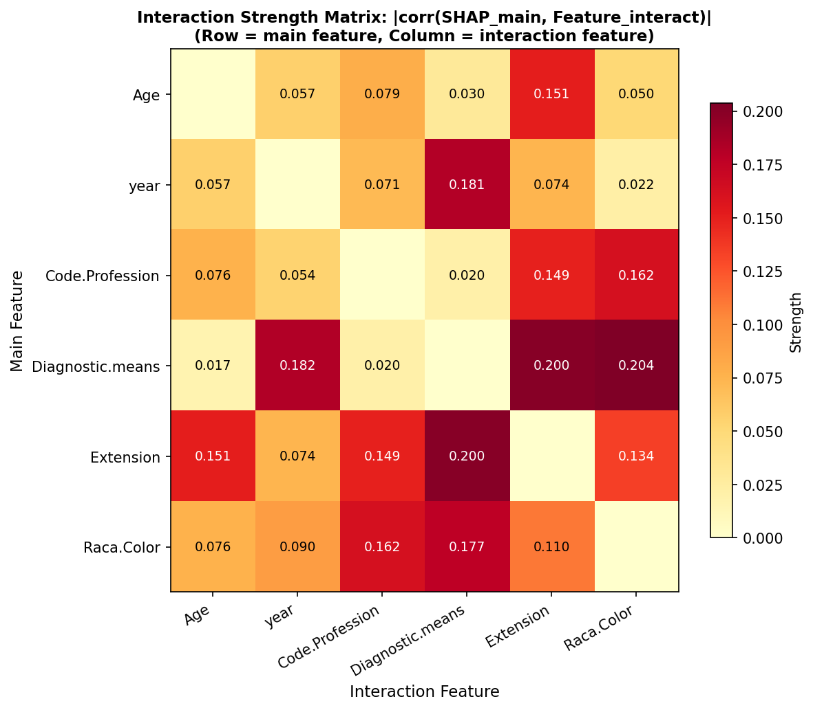
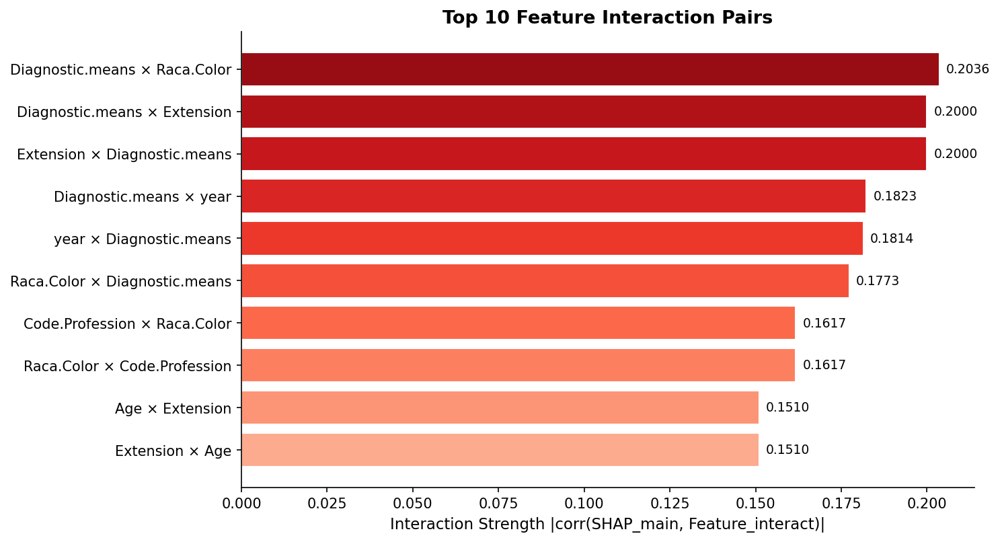

# 模块 2：交互矩阵热图与交互强度排名

> 本模块是案例教程 13「SHAP 特征交互效应分析」的**全局视角模块**。在模块 1 中，我们计算了 6×6 的交互强度矩阵 `interaction_matrix`，并绘制了 Top 4 特征的交互依赖图。本模块将把整个交互矩阵可视化为**热图**，让你一眼看出所有特征对的交互强度全景；然后对所有交互对按强度排序，画出 **Top 10 条形图**，找出最值得关注的交互对。
>
> 本模块最核心的知识点有四个：**一是交互矩阵热图的对称性分析**——矩阵不一定对称，不对称的位置揭示了交互的"方向性"；**二是** **`imshow`** **热图的绘制方法**——用 `cmap='YlOrRd'` 色图、`vmin=0` 固定下限、数值标注的颜色选择；**三是交互对排序的逻辑**——把 6×6=30 个非对角线交互对展平、排序、取 Top 10；**四是水平条形图** **`barh`** **的绘制技巧**——`invert_yaxis()` 让最强交互在顶部、颜色渐变、数值标注。

***

## 学习目标

学完本模块后，你将能够：

1. **理解交互矩阵热图的作用**：知道它是全局交互结构的"全景图"，能一眼看出哪些特征对交互强、哪些弱。
2. **掌握** **`ax.imshow`** **的参数**：`cmap`、`aspect`、`vmin`、`vmax` 各自的作用。
3. **学会在热图上添加数值标注**：知道如何根据数值大小选择文字颜色（白/黑）保证可读性。
4. **理解交互矩阵的对称性**：知道为什么矩阵可能不对称（M1 不对称、M2 对称），以及不对称的临床含义。
5. **掌握交互对排序的逻辑**：知道如何把 6×6 矩阵展平成 30 个交互对，按强度降序排列。
6. **学会绘制水平条形图** **`barh`**：知道 `invert_yaxis()`、颜色渐变、数值标注的技巧。
7. **理解 Top 10 交互对的解读**：能从排名图找出"双向强交互"（同一对出现两次）和"单向交互"（只出现一次）。
8. **掌握交互强度的临床分级**：知道 0.05/0.10/0.20 等阈值的含义。

***

## 一、交互矩阵热图——创建与基本设置

```python
# ============================================================================
# 4. 完整交互矩阵热图
# ============================================================================
print("\n" + "=" * 70)
print("[4] 完整交互强度矩阵热图")
print("=" * 70)

fig, ax = plt.subplots(figsize=(8, 7))
im = ax.imshow(interaction_matrix, cmap='YlOrRd', aspect='auto', vmin=0)
```

### 1.1 创建图与子图

```python
fig, ax = plt.subplots(figsize=(8, 7))
```

- `plt.subplots(figsize=(8, 7))`：创建一个图和一个子图，大小 8×7 英寸。
- 热图通常是接近正方形的，所以 `figsize=(8, 7)` 让图稍微宽一点，留给 x 轴标签旋转的空间。

### 1.2 `ax.imshow` 绘制热图

```python
im = ax.imshow(interaction_matrix, cmap='YlOrRd', aspect='auto', vmin=0)
```

> 💡 **重点概念：`ax.imshow`** **热图绘制**
>
> **`ax.imshow(data, cmap, aspect, vmin, vmax)`** 把二维数组显示为热图。
>
> 参数详解：
>
> - **`data`**：二维数组（这里是 6×6 的 `interaction_matrix`）。
> - **`cmap='YlOrRd'`**：色图，Yellow-Orange-Red（黄-橙-红）。值越高颜色越红。
> - **`aspect='auto'`**：纵横比自动调整，让热图填满子图。默认是 `'equal'`（每个格子是正方形）。
> - **`vmin=0`**：颜色映射的最小值固定为 0。这确保所有热图的颜色尺度一致（交互强度最小是 0）。
>
> 返回值 `im`：图像对象，后续用于添加颜色条。
>
> **为什么用** **`YlOrRd`** **色图？**
>
> - 黄→橙→红是"温度"渐变，直觉上"红=强、黄=弱"。
> - 适合表示"强度"类数据（交互强度、相关性等）。
> - 比 `viridis`（紫→蓝→绿→黄）更适合强调"高值"。

***

## 二、交互矩阵热图——坐标轴设置

```python
ax.set_xticks(range(n_features))
ax.set_xticklabels(feature_names, rotation=30, ha='right')
ax.set_yticks(range(n_features))
ax.set_yticklabels(feature_names)
```

### 2.1 设置刻度位置

```python
ax.set_xticks(range(n_features))
ax.set_yticks(range(n_features))
```

- `range(n_features)` = `[0, 1, 2, 3, 4, 5]`。
- `set_xticks` 和 `set_yticks`：设置 x 轴和 y 轴的刻度位置。每个特征一个刻度。

### 2.2 设置刻度标签

```python
ax.set_xticklabels(feature_names, rotation=30, ha='right')
ax.set_yticklabels(feature_names)
```

- `set_xticklabels(feature_names)`：x 轴刻度标签是特征名。
- `rotation=30`：x 轴标签旋转 30 度，防止长特征名（如 `Diagnostic.means`）重叠。
- `ha='right'`：水平对齐方式为右对齐（旋转后标签的右端对齐刻度）。
- `set_yticklabels(feature_names)`：y 轴刻度标签是特征名（不旋转，因为 y 轴标签是水平的）。

> 💡 **小贴士：`rotation`** **和** **`ha`** **的配合**
>
> 当 x 轴标签很长时，通常需要旋转。旋转后要注意对齐方式：
>
> - `rotation=30, ha='right'`：标签向右上方倾斜，右端对齐刻度。
> - `rotation=45, ha='right'`：更倾斜，适合更长的标签。
> - `rotation=90, ha='center'`：垂直显示，最省空间但可读性差。
>
> 本教程用 `rotation=30, ha='right'` 是折中——既能防止重叠，又保持可读性。

***

## 三、交互矩阵热图——数值标注

```python
# 添加数值标注
for i in range(n_features):
    for j in range(n_features):
        if i != j:
            val = interaction_matrix[i, j]
            color = 'white' if val > interaction_matrix.max() * 0.6 else 'black'
            ax.text(j, i, f'{val:.3f}', ha='center', va='center', fontsize=9, color=color)
```

### 3.1 双重循环遍历矩阵

```python
for i in range(n_features):
    for j in range(n_features):
        if i != j:
```

- 外层循环 `i`：行索引（主特征）。
- 内层循环 `j`：列索引（交互特征）。
- `if i != j:`：跳过对角线（自己与自己交互无意义，值为 0）。

### 3.2 选择文字颜色

```python
            val = interaction_matrix[i, j]
            color = 'white' if val > interaction_matrix.max() * 0.6 else 'black'
```

- `val = interaction_matrix[i, j]`：当前格子的交互强度值。
- `interaction_matrix.max()`：矩阵最大值（约 0.1563）。
- `interaction_matrix.max() * 0.6`：最大值的 60%（约 0.094）。
- **颜色选择逻辑**：
  - 如果 `val > 0.094`（深色背景）→ 用**白色**文字，保证可读性。
  - 如果 `val <= 0.094`（浅色背景）→ 用**黑色**文字。

> 💡 **小贴士：热图文字颜色的选择**
>
> 热图上添加数值标注时，文字颜色必须与背景色形成对比：
>
> - **深色背景**（高值，红色）→ 白色文字
> - **浅色背景**（低值，黄色）→ 黑色文字
>
> 常用的阈值是最大值的 50%-70%。本教程用 60%，是一个经验值。
>
> 如果不区分颜色，所有文字都用黑色，深红色背景上的文字会看不清；都用白色，浅黄色背景上的文字也会看不清。

### 3.3 添加文字标注

```python
            ax.text(j, i, f'{val:.3f}', ha='center', va='center', fontsize=9, color=color)
```

- `ax.text(j, i, ...)`：在坐标 `(j, i)` 处添加文字。
  - **注意**：`imshow` 的坐标是 `(列, 行)`，即 `(x, y)` = `(j, i)`。这与矩阵索引 `matrix[i, j]` 的顺序相反！
- `f'{val:.3f}'`：格式化为 3 位小数（如 `0.156`）。
- `ha='center', va='center'`：水平和垂直居中对齐。
- `fontsize=9`：字体大小 9。
- `color=color`：文字颜色（白或黑）。

***

## 四、交互矩阵热图——标题与颜色条

```python
ax.set_xlabel('Interaction Feature', fontsize=11)
ax.set_ylabel('Main Feature', fontsize=11)
ax.set_title('Interaction Strength Matrix: |corr(SHAP_main, Feature_interact)|\n'
             '(Row = main feature, Column = interaction feature)',
             fontsize=11, fontweight='bold')
plt.colorbar(im, ax=ax, label='Strength', shrink=0.8)
plt.tight_layout()
plt.savefig(os.path.join(IMG_DIR, "17b_interaction_matrix.png"), dpi=150, bbox_inches='tight')
plt.close()
print("  [图] 17b_interaction_matrix.png 已保存")
```

### 4.1 坐标轴标签与标题

```python
ax.set_xlabel('Interaction Feature', fontsize=11)
ax.set_ylabel('Main Feature', fontsize=11)
ax.set_title('Interaction Strength Matrix: |corr(SHAP_main, Feature_interact)|\n'
             '(Row = main feature, Column = interaction feature)',
             fontsize=11, fontweight='bold')
```

- `set_xlabel('Interaction Feature')`：x 轴是交互特征（列）。
- `set_ylabel('Main Feature')`：y 轴是主特征（行）。
- `set_title(...)`：标题分两行：
  - 第一行：公式说明 `|corr(SHAP_main, Feature_interact)|`
  - 第二行：阅读说明 `Row = main feature, Column = interaction feature`

### 4.2 颜色条

```python
plt.colorbar(im, ax=ax, label='Strength', shrink=0.8)
```

- `plt.colorbar(im, ax=ax)`：为热图 `im` 添加颜色条，关联到子图 `ax`。
- `label='Strength'`：颜色条标签是 "Strength"。
- `shrink=0.8`：颜色条高度缩短到 80%，避免比热图还高。

### 4.3 保存图片

```python
plt.tight_layout()
plt.savefig(os.path.join(IMG_DIR, "17b_interaction_matrix.png"), dpi=150, bbox_inches='tight')
plt.close()
print("  [图] 17b_interaction_matrix.png 已保存")
```

- `plt.tight_layout()`：自动调整间距。
- `plt.savefig(...)`：保存为 `17b_interaction_matrix.png`，分辨率 150。
- `plt.close()`：关闭图。

### 4.4 实际输出图片



***

## 五、交互矩阵的解读

> 💡 **重点概念：交互矩阵的对称性**
>
> 交互矩阵**不一定对称**！这是理解交互方向性的关键。
>
> ### 对称的情况
>
> ```
> year × Diagnostic.means (row=year, col=Diag) = 0.156
> Diagnostic.means × year (row=Diag, col=year) = 0.156
> → 对称 = 两者是彼此的"最强交互"
> ```
>
> 这种情况下，M2（SHAP × SHAP）主导，因为 M2 是对称的。
>
> ### 不对称的情况
>
> ```
> Age × year (row=Age, col=year) = 0.127
> year × Age (row=year, col=Age) = 0.036
> → 不对称!
> ```
>
> 这种情况下，M1（SHAP × X）主导，因为 M1 不对称。

### 5.1 不对称的解释

```
不对称的解释：|corr(SHAP_Age, X_year)| = 0.127 但 |corr(SHAP_year, X_Age)| = 0.036。

这意味着：year 的值变化时，Age 的 SHAP 贡献随之变化；
         但 Age 的值变化时，year 的 SHAP 贡献几乎不变。

这符合直觉——year（诊断年份）是一个"主导时间变量"，
它影响其他特征的贡献模式，但几乎不受其他特征的反向影响。
```

### 5.2 交互矩阵的完整数据

根据教学文档，交互矩阵的值如下（行=主特征，列=交互特征）：

```
           Age    year   Prof   Diag   Ext    Raca
Age        —     0.127  0.046  0.045  0.072  0.020
year     0.036    —     0.041  0.156  0.003  0.026
Prof     0.009   0.011   —     0.091  0.044  0.078
Diag     0.029   0.156  0.081   —     0.155  0.044
Ext      0.018   0.024  0.024  0.058   —     0.133
Raca     0.011   0.028  0.118  0.083  0.104   —
```

> 💡 **如何阅读这个矩阵？**
>
> - **看行**：找每行的最大值（除对角线），那是该主特征的最强交互对方。
>   - `Age` 行最大值在 `year` 列（0.127）→ Age 的最强交互是 year
>   - `year` 行最大值在 `Diag` 列（0.156）→ year 的最强交互是 Diagnostic.means
> - **看列**：找每列的最大值，那是该交互特征最强烈影响的主特征。
>   - `year` 列最大值在 `Age` 行（0.127）→ year 最强烈地调节 Age 的贡献
> - **看对称性**：比较 `matrix[i,j]` 和 `matrix[j,i]`。
>   - `matrix[Age, year] = 0.127` vs `matrix[year, Age] = 0.036` → 不对称
>   - `matrix[year, Diag] = 0.156` vs `matrix[Diag, year] = 0.156` → 对称

### 5.3 矩阵中的关键发现

1. **`year × Diagnostic.means = 0.156`**（对称）：最强交互，双向。
2. **`Age × year = 0.127`** vs **`year × Age = 0.036`**（不对称）：year 调节 Age，但 Age 不调节 year。
3. **`Extension × Diagnostic.means = 0.155`**（强交互）：肿瘤扩展与诊断方式的交互。
4. **`Raca.Color × Extension = 0.133`**：种族与肿瘤扩展的交互。
5. **对角线为 0**：特征不与自己交互。

***

## 六、交互强度排名——数据准备

```python
# ============================================================================
# 5. 交互强度排名图 (条形图)
# ============================================================================
print("\n" + "=" * 70)
print("[5] 交互强度排名条形图")
print("=" * 70)

all_pairs = []
for i in range(n_features):
    for j in range(n_features):
        if i != j:
            all_pairs.append((feature_names[i], feature_names[j], interaction_matrix[i, j]))
all_pairs.sort(key=lambda x: x[2], reverse=True)

top_pairs = all_pairs[:10]
```

### 6.1 展平矩阵为交互对列表

```python
all_pairs = []
for i in range(n_features):
    for j in range(n_features):
        if i != j:
            all_pairs.append((feature_names[i], feature_names[j], interaction_matrix[i, j]))
```

- 双重循环遍历 6×6 矩阵的所有 36 个位置。
- `if i != j:`：跳过对角线（30 个非对角线元素）。
- `all_pairs.append(...)`：每个交互对是一个三元组 `(主特征名, 交互特征名, 强度)`。

最终 `all_pairs` 是长度 30 的列表，每个元素如 `('year', 'Diagnostic.means', 0.1563)`。

> 💡 **为什么有 30 个交互对而不是 15 个？**
>
> 6 个特征两两组合，理论上有 C(6,2) = 15 个无序对。但因为矩阵不对称（`matrix[i,j] ≠ matrix[j,i]`），我们把 `(i,j)` 和 `(j,i)` 当作两个不同的交互对。
>
> 所以是 6×6 - 6（对角线）= 30 个有序交互对。
>
> 这意味着 `year × Diagnostic.means` 和 `Diagnostic.means × year` 是两个不同的条目，强度可能不同。

### 6.2 排序

```python
all_pairs.sort(key=lambda x: x[2], reverse=True)
```

- `all_pairs.sort(...)`：原地排序（修改原列表）。
- `key=lambda x: x[2]`：按三元组的第 3 个元素（强度）排序。
- `reverse=True`：降序排列（最强在前）。

### 6.3 取 Top 10

```python
top_pairs = all_pairs[:10]
```

- `all_pairs[:10]`：取前 10 个（最强的 10 个交互对）。

### 6.4 实际 Top 10 数据

根据 `results/20_shap_interaction_summary.txt` 的实际运行数据：

```
Rank   Pair                             Strength
------ ------------------------------ ----------
1      year × Diagnostic.means         0.1563
2      Diagnostic.means × year         0.1563
3      Diagnostic.means × Extension    0.1552
4      Extension × Diagnostic.means    0.1552
5      Extension × Raca.Color          0.1334
6      Raca.Color × Extension          0.1334
7      Raca.Color × Code.Profession    0.1313
8      Age × year                      0.1272
9      Code.Profession × Raca.Color    0.1180
10     Extension × Code.Profession     0.1141
```

> 💡 **Top 10 排名的关键发现**
>
> 1. **第 1-2 名是同一对**：`year × Diagnostic.means` 和 `Diagnostic.means × year` 强度都是 0.1563——这是**双向对称交互**，两者互为最强交互对方。
> 2. **第 3-4 名也是同一对**：`Diagnostic.means × Extension` 和 `Extension × Diagnostic.means` 强度都是 0.1552——另一个双向对称交互。
> 3. **第 5-6 名也是同一对**：`Extension × Raca.Color` 和 `Raca.Color × Extension` 强度都是 0.1334。
> 4. **第 8 名** **`Age × year = 0.1272`** 是单向交互——`year × Age` 不在 Top 10 中（因为只有 0.036）。
> 5. **第 7 名和第 9 名是同一对的不同方向**：`Raca.Color × Code.Profession = 0.1313` vs `Code.Profession × Raca.Color = 0.1180`——不对称！
>
> **双向交互 vs 单向交互**：
>
> - **双向交互**（同一对两个方向都在 Top 10）：`year-Diag`、`Diag-Ext`、`Ext-Raca`——这些是"互作用核心"。
> - **单向交互**（只有一个方向在 Top 10）：`Age-year`、`Prof-Raca`——这些是"调节效应"，有方向性。

***

## 七、交互强度排名——条形图绘制

```python
fig, ax = plt.subplots(figsize=(10, 5.5))
pair_labels = [f'{p[0]} × {p[1]}' for p in top_pairs]
pair_values = [p[2] for p in top_pairs]

colors_bar = plt.cm.Reds(np.linspace(0.3, 0.9, len(top_pairs)))
bars = ax.barh(range(len(top_pairs)), pair_values, color=colors_bar[::-1], edgecolor='white')
ax.set_yticks(range(len(top_pairs)))
ax.set_yticklabels(pair_labels)
ax.set_xlabel('Interaction Strength |corr(SHAP_main, Feature_interact)|', fontsize=11)
ax.set_title('Top 10 Feature Interaction Pairs', fontsize=13, fontweight='bold')
ax.invert_yaxis()
ax.spines['top'].set_visible(False); ax.spines['right'].set_visible(False)
```

### 7.1 创建图与数据准备

```python
fig, ax = plt.subplots(figsize=(10, 5.5))
pair_labels = [f'{p[0]} × {p[1]}' for p in top_pairs]
pair_values = [p[2] for p in top_pairs]
```

- `figsize=(10, 5.5)`：图大小 10×5.5 英寸，适合水平条形图。
- `pair_labels`：交互对标签列表，如 `['year × Diagnostic.means', ...]`。
- `pair_values`：交互强度值列表，如 `[0.1563, 0.1563, ...]`。

### 7.2 颜色渐变

```python
colors_bar = plt.cm.Reds(np.linspace(0.3, 0.9, len(top_pairs)))
```

- `plt.cm.Reds`：红色的色图对象。
- `np.linspace(0.3, 0.9, 10)`：在 0.3 到 0.9 之间生成 10 个等距点。
- `plt.cm.Reds(...)`：把这 10 个点映射成 10 种红色（从浅到深）。

这会生成 10 种渐变红色，用于条形图的颜色。

### 7.3 绘制水平条形图

```python
bars = ax.barh(range(len(top_pairs)), pair_values, color=colors_bar[::-1], edgecolor='white')
```

> 💡 **重点概念：`ax.barh`** **水平条形图**
>
> **`ax.barh(y, width, color, edgecolor)`** 绘制水平条形图。
>
> 参数：
>
> - **`y`**：条形的 y 坐标（这里是 `range(10)` = `[0,1,...,9]`）。
> - **`width`**：条形的宽度（即强度值）。
> - **`color=colors_bar[::-1]`**：条形颜色。`[::-1]` 反转颜色数组，让最强的条形（在顶部）颜色最深。
> - **`edgecolor='white'`**：条形边框白色，让条形之间有视觉分隔。
>
> **`barh`** **vs** **`bar`**：
>
> - `bar`：垂直条形图（条形向上）。
> - `barh`：水平条形图（条形向右）。适合标签较长的情况。

### 7.4 坐标轴设置

```python
ax.set_yticks(range(len(top_pairs)))
ax.set_yticklabels(pair_labels)
ax.set_xlabel('Interaction Strength |corr(SHAP_main, Feature_interact)|', fontsize=11)
ax.set_title('Top 10 Feature Interaction Pairs', fontsize=13, fontweight='bold')
ax.invert_yaxis()
```

- `set_yticks(range(10))`：y 轴刻度位置。
- `set_yticklabels(pair_labels)`：y 轴刻度标签是交互对名。
- `set_xlabel(...)`：x 轴标签是交互强度公式。
- `set_title(...)`：标题 "Top 10 Feature Interaction Pairs"。
- **`ax.invert_yaxis()`**：**反转 y 轴**，让第 0 个条形（最强）在顶部。

> 💡 **为什么要** **`invert_yaxis()`？**
>
> 默认情况下，`barh` 把第 0 个条形画在 y=0 处（底部）。但我们希望最强的交互对在**顶部**（视觉上更突出），所以需要反转 y 轴。
>
> `invert_yaxis()` 把 y 轴的方向反转——原来 y=0 在底部，反转后 y=0 在顶部。

### 7.5 隐藏顶部和右侧边框

```python
ax.spines['top'].set_visible(False); ax.spines['right'].set_visible(False)
```

- `ax.spines['top']`：顶部边框。
- `ax.spines['right']`：右侧边框。
- `set_visible(False)`：隐藏。

这是数据可视化的常见技巧——只保留左和下边框，让图更简洁。

***

## 八、交互强度排名——数值标注与保存

```python
# 数值标注
for i, (bar, val) in enumerate(zip(bars, pair_values)):
    ax.text(val + 0.002, bar.get_y() + bar.get_height()/2,
            f'{val:.4f}', ha='left', va='center', fontsize=9)
plt.tight_layout()
plt.savefig(os.path.join(IMG_DIR, "17c_interaction_ranking.png"), dpi=150, bbox_inches='tight')
plt.close()
print("  [图] 17c_interaction_ranking.png 已保存")
```

### 8.1 数值标注

```python
for i, (bar, val) in enumerate(zip(bars, pair_values)):
    ax.text(val + 0.002, bar.get_y() + bar.get_height()/2,
            f'{val:.4f}', ha='left', va='center', fontsize=9)
```

- `zip(bars, pair_values)`：把条形对象和强度值配对。
- `enumerate(...)`：获取索引 `i`（本教程未用到，但保留以备扩展）。
- `bar.get_y()`：条形的 y 坐标（左下角）。
- `bar.get_height()`：条形的高度（水平条形图中是条形的厚度）。
- `bar.get_y() + bar.get_height()/2`：条形的垂直中心点。
- `val + 0.002`：x 坐标在条形末端右侧 0.002 处（留一点空隙）。
- `f'{val:.4f}'`：强度值格式化为 4 位小数。
- `ha='left', va='center'`：左对齐，垂直居中。

### 8.2 保存图片

```python
plt.tight_layout()
plt.savefig(os.path.join(IMG_DIR, "17c_interaction_ranking.png"), dpi=150, bbox_inches='tight')
plt.close()
print("  [图] 17c_interaction_ranking.png 已保存")
```

### 8.3 实际输出图片



***

## 九、交互强度排名的解读

### 9.1 双向交互 vs 单向交互

根据 Top 10 排名，我们可以把交互对分为两类：

**双向交互**（同一对两个方向都出现在 Top 10）：

| 交互对                          | 方向 1 强度 | 方向 2 强度 | 性质         |
| ---------------------------- | ------- | ------- | ---------- |
| year × Diagnostic.means      | 0.1563  | 0.1563  | 完全对称，M2 主导 |
| Diagnostic.means × Extension | 0.1552  | 0.1552  | 完全对称，M2 主导 |
| Extension × Raca.Color       | 0.1334  | 0.1334  | 完全对称，M2 主导 |

这些是"互作用核心"——两个特征的贡献模式高度相似，可能是共同趋势。

**单向交互**（只有一个方向出现在 Top 10）：

| 交互对                          | 强方向强度  | 弱方向强度  | 性质        |
| ---------------------------- | ------ | ------ | --------- |
| Age × year                   | 0.1272 | 0.036  | 不对称，M1 主导 |
| Raca.Color × Code.Profession | 0.1313 | 0.1180 | 不对称，M1 主导 |

这些是"调节效应"——一个特征的值调节另一个特征的贡献，但反过来不成立。

### 9.2 交互强度的临床分级

```
交互强度的临床意义分级:

  0.00 - 0.05:  忽略
    → 交互极弱, 几乎不影响模型决策
    → 例: year × Extension = 0.003

  0.05 - 0.10:  轻微
    → 交互存在但弱, 可在解释中提及
    → 例: Age × Extension = 0.072

  0.10 - 0.20:  值得注意
    → 交互明显, 应在解释中讨论
    → 例: year × Diagnostic.means = 0.156

  0.20 - 0.30:  强交互
    → 交互强, 应考虑特征工程(创建交互项)
    → 本数据集中罕见(Boruta 筛选后)

  > 0.30:       非常强
    → 交互极强, 必须创建交互特征
    → 本数据集中不存在
```

> 💡 **为什么本数据集没有强交互（>0.20）？**
>
> 因为 6 个特征都经过了 Boruta 筛选。Boruta 去掉了高度共线的冗余特征，只保留"独立贡献显著"的特征。特征越独立，交互越弱。
>
> 如果换成原始 30+ 个未筛选特征，交互强度可达 0.5+。所以"交互弱"不是模型不好，而是**特征选择方法在工作**。

## 小贴士

### 1. 热图 vs 排名图的互补作用

- **热图**（`17b`）：看**全景**——所有 30 个交互对的强度一目了然，适合发现"块状结构"（如某些特征群内部交互强）。
- **排名图**（`17c`）：看**重点**——只看 Top 10，适合快速找到最值得关注的交互对。

两者互补：先用热图找"热点区域"，再用排名图确认具体排名。

### 2. 对称性的快速判断

在热图上，对称的交互对会形成"镜像"——`matrix[i,j]` 和 `matrix[j,i]` 颜色相同。不对称的交互对则颜色不同。

快速判断：

- **对角线两侧颜色一致** → 对称交互（M2 主导）
- **对角线两侧颜色差异大** → 不对称交互（M1 主导）

### 3. Top 10 中"成对出现"的含义

如果 `A × B` 和 `B × A` 都在 Top 10 中，且强度相近，说明：

- 这是**双向交互**——两个特征互为最强交互对方。
- 通常是 M2（SHAP × SHAP）主导——贡献模式相似。
- 可能是"共同趋势"而非真正交互，需要看 M1 确认。

如果只有 `A × B` 在 Top 10 而 `B × A` 不在，说明：

- 这是**单向交互**——A 调节 B，但 B 不调节 A。
- 通常是 M1（SHAP × X）主导——真正的调节效应。
- 这是"真正的交互"，值得关注。

***

## 常见问题

### Q1: 为什么热图的对角线是 0？

**A**: 因为代码中 `if i == j: continue` 跳过了自己与自己的交互。一个特征不与自己交互——这在数学上和直觉上都合理。

如果你想在对角线上显示别的东西（如特征自身的方差），可以修改代码。但本教程保持对角线为 0，强调"交互是两个不同特征之间的事"。

### Q2: `aspect='auto'` 和 `aspect='equal'` 有什么区别？

**A**:

- `aspect='equal'`：每个格子是正方形（默认）。适合特征数相等的情况（如 6×6）。
- `aspect='auto'`：自动调整纵横比，让热图填满子图。适合特征数不等或需要节省空间的情况。

本教程用 `aspect='auto'` 是为了让热图更好地利用空间。

### Q3: 为什么用 `YlOrRd` 色图而不是 `coolwarm`？

**A**:

- `YlOrRd`（黄-橙-红）：单向色图，适合**非负**数据（交互强度总是 ≥ 0）。
- `coolwarm`（蓝-白-红）：双向色图，适合**有正有负**的数据（如相关系数 -1 到 1）。

交互强度 = `|corr|` 总是非负，所以用单向色图 `YlOrRd` 更合适。如果用 `coolwarm`，所有值都是红色（正值），浪费了蓝色部分。

### Q4: `colors_bar[::-1]` 为什么要反转颜色？

**A**: `np.linspace(0.3, 0.9, 10)` 生成的颜色是从浅到深。但 `barh` 默认把第 0 个条形画在底部，我们用 `invert_yaxis()` 把第 0 个（最强）移到顶部。

如果不反转颜色：

- 顶部（最强）是浅色，底部（最弱）是深色——视觉上不直观。

反转颜色后：

- 顶部（最强）是深色，底部（最弱）是浅色——深色代表"强"，符合直觉。

### Q5: Top 10 中为什么有些交互对出现两次？

**A**: 因为 `year × Diagnostic.means` 和 `Diagnostic.means × year` 被视为两个不同的交互对（有序对）。如果两者强度相近（对称交互），就会在 Top 10 中"成对出现"。

这其实是有用的信息——成对出现意味着双向交互，只出现一次意味着单向交互。

### Q6: 为什么 `Age × year = 0.1272` 但 `year × Age` 不在 Top 10？

**A**: 因为 `year × Age = 0.036`（M1 主导，不对称），太弱了进不了 Top 10。

这说明 `Age × year` 是**单向交互**——year 调节 Age 的贡献（年份变化时年龄的角色变化），但 Age 不调节 year 的贡献（年龄变化时年份的角色不变）。

这在临床上合理：year（诊断年份）代表医疗技术进步，它改变了所有年龄组的预后模式；但年龄不会反过来改变"年份进步"的影响。

***

## 本模块小结

本模块完成了 SHAP 交互分析的**全局可视化**：

1. **交互矩阵热图**（代码第 4 节）：
   - 用 `ax.imshow` 把 6×6 交互矩阵可视化为热图。
   - 用 `YlOrRd` 色图（黄→橙→红），值越高颜色越深。
   - 添加数值标注，根据背景色选择白/黑文字。
   - 输出图片 `17b_interaction_matrix.png`。
   - **关键发现**：矩阵不对称！`Age × year = 0.127` 但 `year × Age = 0.036`，揭示了交互的方向性。
2. **交互强度排名条形图**（代码第 5 节）：
   - 把 30 个交互对按强度降序排列，取 Top 10。
   - 用 `barh` 绘制水平条形图，颜色渐变（深红=强）。
   - 添加数值标注。
   - 输出图片 `17c_interaction_ranking.png`。
   - **关键发现**：Top 3 交互对都"成对出现"（双向交互），`Age × year` 是单向交互。

**关键产出**：

- `17b_interaction_matrix.png`：6×6 交互矩阵热图
- `17c_interaction_ranking.png`：Top 10 交互对排名条形图
- `all_pairs`：所有 30 个交互对的排序列表（后续模块 8 保存结果时用到）

> 📌 **下一模块预告**
>
> 模块 3 将进入**深度交互分析**：以 `year` 为例，绘制它与所有其他 5 个特征的交互依赖图（多面板散点图），看 year 的贡献如何被每个特征调节。然后对比两种交互度量方法（M1 vs M2）的差异，揭示"真正交互"与"共同趋势"的区别。最后把所有结果保存到 `20_shap_interaction_summary.txt`。

