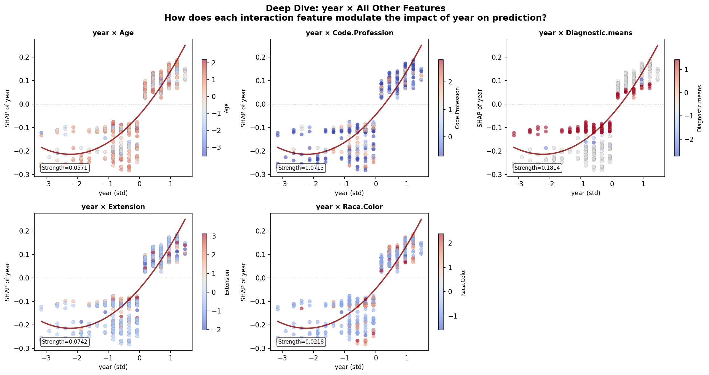
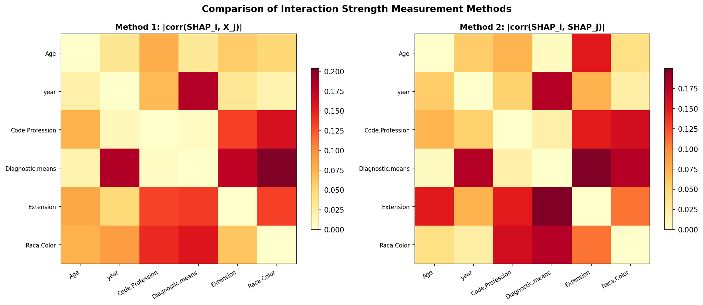

# 模块 3：深度交互分析与两种度量方法对比

> 本模块是案例教程 13「SHAP 特征交互效应分析」的**收官模块**。在前三个模块中，我们完成了交互扫描、交互依赖图、交互矩阵热图和排名图。本模块将完成三件事：**第一，深度交互分析**——以 `year` 为例，绘制它与所有其他 5 个特征的交互依赖图（多面板散点图），看 year 的贡献如何被每个特征调节；**第二，两种交互度量方法的对比**——分别计算 M1 和 M2 矩阵，并排显示热图，打印数值对比表，揭示"真正交互"与"共同趋势"的区别； 
>
> 本模块最核心的知识点有四个：**一是"深度交互"的意义**——不只看最强交互，而是看一个特征与所有其他特征的交互形态全景；**二是 M1 和 M2 的关键差异**——M1 高的是"真正交互调节"，M2 高的可能只是"共同趋势"；**三是 Δ = M1 - M2 的解读**——Δ > 0 说明 M1 主导（真正交互），Δ < 0 说明 M2 主导（共同趋势）；** **

***

## 学习目标

学完本模块后，你将能够：

1. **理解深度交互分析的目的**：知道为什么以单个特征（year）为中心，绘制它与所有其他特征的交互依赖图。
2. **掌握多面板子图的动态布局**：知道如何用 `np.ceil(n_others / n_cols)` 计算行数，以及如何隐藏多余的子图。
3. **理解** **`coolwarm`** **色图与** **`viridis`** **色图的区别**：知道为什么深度交互图用 `coolwarm`（蓝-白-红）。
4. **掌握 M1 和 M2 矩阵的分别计算**：知道如何分别计算 `method1_matrix` 和 `method2_matrix`。
5. **理解并排热图的绘制**：知道如何用 `plt.subplots(1, 2)` 创建 1 行 2 列的对比图。
6. **掌握 Δ = M1 - M2 的解读**：知道 Δ > 0 和 Δ < 0 各代表什么含义。
7. **理解"真正交互"与"共同趋势"的区别**：能从 M1 和 M2 的差异判断一个交互对的性质。

***

## 一、深度交互分析——以 year 为例

```python
# ============================================================================
# 6. 单个特征的深度交互对比 (以 year 为例, 显示所有交互)
# ============================================================================
print("\n" + "=" * 70)
print("[6] 深度交互对比: year 与所有其他特征的交互")
print("=" * 70)

year_idx = list(feature_names).index('year')
other_indices = [j for j in range(n_features) if j != year_idx]
n_others = len(other_indices)

# 布局: 每行 3 个, 总共 5 个其他特征, 2 行
n_cols = 3
n_rows = int(np.ceil(n_others / n_cols))
```

### 1.1 为什么选 `year` 做深度交互分析？

> 💡 **重点概念：为什么以 year 为中心？**
>
> `year`（诊断年份）是本数据集中**最重要**的特征（Mean |SHAP| 最高），也是**最强的交互调节者**——它调节其他特征的贡献模式，但几乎不被其他特征反向调节。
>
> 从模块 2 的交互矩阵可以看到：
>
> - `Age × year = 0.127`（year 调节 Age 的贡献）
> - `year × Age = 0.036`（Age 不调节 year 的贡献）
>
> 这种"不对称"说明 year 是"中心调节者"。深度交互分析能让我们看清 year 如何调节每个其他特征。
>
> 此外，year 有明确的临床含义——医疗技术进步。理解"年份如何与其他特征交互"等于理解"医疗进步如何在不同患者群体中体现"。

### 1.2 找到 year 的索引

```python
year_idx = list(feature_names).index('year')
other_indices = [j for j in range(n_features) if j != year_idx]
n_others = len(other_indices)
```

- `list(feature_names).index('year')`：把 `feature_names`（NumPy 数组）转成列表，用 `index()` 找到 `'year'` 的索引。
- `other_indices = [j for j in range(n_features) if j != year_idx]`：所有其他特征的索引（5 个）。
- `n_others = len(other_indices)`：其他特征数 = 5。

### 1.3 动态计算子图布局

```python
# 布局: 每行 3 个, 总共 5 个其他特征, 2 行
n_cols = 3
n_rows = int(np.ceil(n_others / n_cols))
```

- `n_cols = 3`：每行 3 个子图。
- `n_others = 5`：5 个其他特征。
- `np.ceil(5 / 3) = np.ceil(1.67) = 2`：向上取整，需要 2 行。
- `n_rows = 2`：2 行 × 3 列 = 6 个子图位置，但只用 5 个（第 6 个隐藏）。

> 💡 **小贴士：动态子图布局**
>
> 当子图数量不固定时，用 `np.ceil(n / n_cols)` 计算行数是常用技巧：
>
> - 5 个子图，每行 3 个 → 2 行（第 2 行只有 2 个，第 3 个位置空着）
> - 7 个子图，每行 3 个 → 3 行（第 3 行只有 1 个）
>
> 这种写法适应性强，无论特征数怎么变都能正确布局。

***

## 二、深度交互分析——创建多面板图

```python
fig, axes = plt.subplots(n_rows, n_cols, figsize=(15, 4 * n_rows))
axes = axes.flatten()
ax_idx = 0
```

### 2.1 创建子图网格

```python
fig, axes = plt.subplots(n_rows, n_cols, figsize=(15, 4 * n_rows))
```

- `plt.subplots(2, 3, figsize=(15, 8))`：创建 2 行 3 列的子图网格。
- `figsize=(15, 4 * n_rows)` = `(15, 8)`：图大小 15×8 英寸。每行高度 4 英寸，2 行共 8 英寸。

### 2.2 展平 axes 数组

```python
axes = axes.flatten()
ax_idx = 0
```

- `axes.flatten()`：把 2×3 的 axes 数组展平成长度 6 的一维数组。
- `ax_idx = 0`：子图计数器，用于追踪当前使用第几个子图。

***

## 三、深度交互分析——绘制每个子图

```python
for j in other_indices:
    ax = axes[ax_idx]
    other_name = feature_names[j]

    x_vals = X_shap[:, year_idx]
    y_vals = sv[:, year_idx]
    color_vals = X_shap[:, j]

    scatter = ax.scatter(x_vals, y_vals, c=color_vals,
                         cmap='coolwarm', alpha=0.6, s=30,
                         edgecolors='gray', linewidth=0.3)

    # 二次拟合
    mask = ~(np.isnan(x_vals) | np.isnan(y_vals))
    if np.sum(mask) > 10:
        z = np.polyfit(x_vals[mask], y_vals[mask], 2)
        p = np.poly1d(z)
        x_range = np.linspace(np.min(x_vals[mask]), np.max(x_vals[mask]), 100)
        ax.plot(x_range, p(x_range), color='darkred', linewidth=2, alpha=0.8)
        ax.text(0.05, 0.05, f'Strength={interaction_matrix[year_idx, j]:.4f}',
                transform=ax.transAxes, fontsize=8,
                bbox=dict(boxstyle='round', facecolor='white', alpha=0.7))

    ax.axhline(y=0, color='gray', linestyle='--', linewidth=0.5)
    ax.set_xlabel('year (std)', fontsize=9)
    ax.set_ylabel('SHAP of year', fontsize=9)
    ax.set_title(f'year × {other_name}', fontsize=10, fontweight='bold')

    cbar = plt.colorbar(scatter, ax=ax, shrink=0.7)
    cbar.set_label(other_name, fontsize=8)
    ax_idx += 1
```

### 3.1 循环遍历其他特征

```python
for j in other_indices:
    ax = axes[ax_idx]
    other_name = feature_names[j]
```

- `for j in other_indices:`：遍历 5 个其他特征的索引。
- `ax = axes[ax_idx]`：获取当前子图。
- `other_name = feature_names[j]`：当前交互特征名。

### 3.2 提取绘图数据

```python
    x_vals = X_shap[:, year_idx]
    y_vals = sv[:, year_idx]
    color_vals = X_shap[:, j]
```

- `x_vals = X_shap[:, year_idx]`：year 的原始值（标准化后），作为 x 轴。**所有子图的 x 轴都是 year**。
- `y_vals = sv[:, year_idx]`：year 的 SHAP 值，作为 y 轴。**所有子图的 y 轴都是 SHAP of year**。
- `color_vals = X_shap[:, j]`：当前交互特征的值，用于着色。**每个子图的颜色不同**。

> 💡 **深度交互图的结构**
>
> 所有 5 个子图共享相同的 x 轴（year 值）和 y 轴（SHAP of year），只有**颜色**不同——每个子图用不同的交互特征着色。
>
> 这种设计让你能直接比较"year 的贡献如何被不同特征调节"：
>
> - 子图 1：year × Age（颜色=Age 值）
> - 子图 2：year × Code.Profession（颜色=职业编码）
> - 子图 3：year × Diagnostic.means（颜色=诊断方式）
> - 子图 4：year × Extension（颜色=肿瘤扩展）
> - 子图 5：year × Raca.Color（颜色=种族）
>
> 如果某个子图的颜色与 y 值强相关，说明那个特征调节了 year 的贡献。

### 3.3 散点图绘制

```python
    scatter = ax.scatter(x_vals, y_vals, c=color_vals,
                         cmap='coolwarm', alpha=0.6, s=30,
                         edgecolors='gray', linewidth=0.3)
```

> 💡 **重点概念：`coolwarm`** **色图**
>
> 本教程的深度交互图用 `coolwarm`（蓝-白-红）色图，与模块 1 的 `viridis`（紫-绿-黄）不同。
>
> **为什么用** **`coolwarm`？**
>
> - `coolwarm` 是**双向色图**：低值=蓝色（冷），中间=白色，高值=红色（暖）。
> - 适合"有正有负"或"以 0 为中心"的数据。
> - 在深度交互图中，交互特征值标准化后以 0 为中心，用 `coolwarm` 能直观看出"高于平均"（红）和"低于平均"（蓝）。
>
> **与** **`viridis`** **的对比**：
>
> - `viridis`：单向色图，适合非负数据。颜色从紫到黄，没有"中心"。
> - `coolwarm`：双向色图，适合以 0 为中心的数据。颜色从蓝到红，白色为中心。
>
> 其他参数：
>
> - `alpha=0.6`：透明度 0.6。
> - `s=30`：散点大小 30（比模块 1 的 45 小，因为子图更多，需要更紧凑）。
> - `edgecolors='gray'`：边框灰色（比黑色浅，视觉更柔和）。
> - `linewidth=0.3`：边框线宽 0.3。

### 3.4 二次拟合与强度标注

```python
    # 二次拟合
    mask = ~(np.isnan(x_vals) | np.isnan(y_vals))
    if np.sum(mask) > 10:
        z = np.polyfit(x_vals[mask], y_vals[mask], 2)
        p = np.poly1d(z)
        x_range = np.linspace(np.min(x_vals[mask]), np.max(x_vals[mask]), 100)
        ax.plot(x_range, p(x_range), color='darkred', linewidth=2, alpha=0.8)
        ax.text(0.05, 0.05, f'Strength={interaction_matrix[year_idx, j]:.4f}',
                transform=ax.transAxes, fontsize=8,
                bbox=dict(boxstyle='round', facecolor='white', alpha=0.7))
```

这段代码与模块 1 的二次拟合逻辑相同，但有两点不同：

1. **标注位置不同**：
   - 模块 1：`ax.text(0.05, 0.95, ...)` 在**左上角**。
   - 本模块：`ax.text(0.05, 0.05, ...)` 在**左下角**。
     这是因为深度交互图的子图更小，左上角可能被标题遮挡，所以放左下角。
2. **标注内容不同**：
   - 模块 1：显示强度和度量方法。
   - 本模块：只显示强度（`Strength=0.1563`），因为方法信息在模块 3 的对比中详细讨论。
3. **标注框样式不同**：
   - 模块 1：`facecolor='lightyellow'`（浅黄）。
   - 本模块：`facecolor='white'`（白色），更简洁。

### 3.5 坐标轴与标题

```python
    ax.axhline(y=0, color='gray', linestyle='--', linewidth=0.5)
    ax.set_xlabel('year (std)', fontsize=9)
    ax.set_ylabel('SHAP of year', fontsize=9)
    ax.set_title(f'year × {other_name}', fontsize=10, fontweight='bold')
```

- `ax.axhline(y=0, ...)`：y=0 零线（虚线，灰色）。与模块 1 的实线不同，这里用虚线让零线更不显眼。
- `set_xlabel('year (std)')`：x 轴标签注明 "(std)" 表示标准化后的值。
- `set_ylabel('SHAP of year')`：y 轴标签。
- `set_title(f'year × {other_name}')`：标题是交互对名。

### 3.6 颜色条

```python
    cbar = plt.colorbar(scatter, ax=ax, shrink=0.7)
    cbar.set_label(other_name, fontsize=8)
    ax_idx += 1
```

- `shrink=0.7`：颜色条高度缩短到 70%（比模块 1 的 0.8 更短，因为子图更小）。
- `cbar.set_label(other_name, fontsize=8)`：颜色条标签是交互特征名。

***

## 四、深度交互分析——隐藏多余子图与保存

```python
# 隐藏多余的子图
for k in range(ax_idx, len(axes)):
    axes[k].axis('off')

fig.suptitle('Deep Dive: year × All Other Features\n'
             'How does each interaction feature modulate the impact of year on prediction?',
             fontsize=13, fontweight='bold')
plt.tight_layout()
plt.savefig(os.path.join(IMG_DIR, "17d_year_interaction_deepdive.png"), dpi=150, bbox_inches='tight')
plt.close()
print("  [图] 17d_year_interaction_deepdive.png 已保存")
```

### 4.1 隐藏多余子图

```python
# 隐藏多余的子图
for k in range(ax_idx, len(axes)):
    axes[k].axis('off')
```

- `ax_idx`：已使用的子图数（5 个）。
- `len(axes)`：总子图数（6 个）。
- `range(5, 6)` = `[5]`：第 6 个子图（索引 5）未使用。
- `axes[k].axis('off')`：关闭该子图的坐标轴，使其不可见。

> 💡 **为什么要隐藏多余子图？**
>
> `plt.subplots(2, 3)` 创建 6 个子图，但我们只用 5 个。如果不隐藏第 6 个，它会显示一个空的坐标轴框，影响美观。
>
> `axis('off')` 关闭所有坐标轴元素（刻度、标签、边框），让该子图完全不可见。

### 4.2 总标题与保存

```python
fig.suptitle('Deep Dive: year × All Other Features\n'
             'How does each interaction feature modulate the impact of year on prediction?',
             fontsize=13, fontweight='bold')
plt.tight_layout()
plt.savefig(os.path.join(IMG_DIR, "17d_year_interaction_deepdive.png"), dpi=150, bbox_inches='tight')
plt.close()
print("  [图] 17d_year_interaction_deepdive.png 已保存")
```

总标题分两行：

1. `Deep Dive: year × All Other Features`——深度交互：year 与所有其他特征
2. `How does each interaction feature modulate the impact of year on prediction?`——每个交互特征如何调节 year 对预测的影响？

### 4.3 实际输出图片



***

## 五、深度交互分析的解读
 
### 5.1 如何解读深度交互图

```
看 year 的深度交互图时, 关注以下几点:

1. 哪个子图的颜色与 y 值最相关?
   → year × Diagnostic.means: 颜色变化明显 → 强交互
   → year × Extension: 颜色随机分布 → 无交互

2. 趋势线的形状:
   → year × Diagnostic.means: 趋势线可能弯曲 → 非线性
   → year × Age: 趋势线接近直线 → 线性

3. 强度标注值:
   → 0.156 (Diagnostic.means) >> 0.003 (Extension)
   → 说明 year 的贡献主要被诊断方式调节

4. 颜色的"翻转":
   → 如果红色点在 y > 0 区域, 蓝色点在 y < 0 区域
   → 说明高诊断方式值让 year 贡献为正, 低值让 year 贡献为负
   → 这是"调节效应"
```

### 5.2 year 作为"中心调节者"

```
从深度交互图可以看出 year 的"中心调节者"角色:

  year 影响其他特征的贡献模式:
    Age × year = 0.127 (year 调节 Age)
    但 year × Age = 0.036 (Age 不调节 year)

  这在临床上意味着:
    医疗技术进步(年份)改变了所有年龄组的预后模式
    但年龄不会反过来改变"年份进步"的影响

  year 是"因", 其他特征是"果"的调节对象
```

***

## 六、两种度量方法对比——计算 M1 和 M2 矩阵

```python
# ============================================================================
# 7. 方法比较: 两种交互强度度量的对比
# ============================================================================
print("\n" + "=" * 70)
print("[7] 交互度量方法对比: SHAP_i × X_j  vs  SHAP_i × SHAP_j")
print("=" * 70)

method1_matrix = np.zeros((n_features, n_features))
method2_matrix = np.zeros((n_features, n_features))

for i in range(n_features):
    for j in range(n_features):
        if i == j:
            continue
        corr_m1, _ = pearsonr(sv[:, i], X_shap[:, j])
        method1_matrix[i, j] = abs(corr_m1)
        corr_m2, _ = pearsonr(sv[:, i], sv[:, j])
        method2_matrix[i, j] = abs(corr_m2)
```

### 6.1 分别计算 M1 和 M2 矩阵

```python
method1_matrix = np.zeros((n_features, n_features))
method2_matrix = np.zeros((n_features, n_features))

for i in range(n_features):
    for j in range(n_features):
        if i == j:
            continue
        corr_m1, _ = pearsonr(sv[:, i], X_shap[:, j])
        method1_matrix[i, j] = abs(corr_m1)
        corr_m2, _ = pearsonr(sv[:, i], sv[:, j])
        method2_matrix[i, j] = abs(corr_m2)
```

- `method1_matrix`：M1 矩阵，`method1_matrix[i, j] = |corr(SHAP_i, X_j)|`。
- `method2_matrix`：M2 矩阵，`method2_matrix[i, j] = |corr(SHAP_i, SHAP_j)|`。
- 双重循环遍历所有特征对（跳过对角线）。
- 分别计算 M1 和 M2，存入两个矩阵。

> 💡 **M1 矩阵 vs M2 矩阵的对称性**
>
> - **M1 矩阵不对称**：`M1[i,j] = |corr(SHAP_i, X_j)|` ≠ `M1[j,i] = |corr(SHAP_j, X_i)|`。
>   - 因为 `corr(SHAP_i, X_j)` 和 `corr(SHAP_j, X_i)` 是不同的相关性。
> - **M2 矩阵对称**：`M2[i,j] = |corr(SHAP_i, SHAP_j)|` = `M2[j,i] = |corr(SHAP_j, SHAP_i)|`。
>   - 因为相关系数是对称的：`corr(a, b) = corr(b, a)`。
>
> 这就是为什么模块 1 的 `interaction_matrix`（取 M1 和 M2 的最大值）可能不对称——当 M1 主导时不对称，当 M2 主导时对称。

***

## 七、两种度量方法对比——并排热图

```python
fig, axes = plt.subplots(1, 2, figsize=(14, 6))

for ax, matrix, title, method_name in [
    (axes[0], method1_matrix, 'Method 1: |corr(SHAP_i, X_j)|', 'm1'),
    (axes[1], method2_matrix, 'Method 2: |corr(SHAP_i, SHAP_j)|', 'm2')
]:
    im = ax.imshow(matrix, cmap='YlOrRd', aspect='auto', vmin=0)
    ax.set_xticks(range(n_features))
    ax.set_xticklabels(feature_names, rotation=30, ha='right', fontsize=8)
    ax.set_yticks(range(n_features))
    ax.set_yticklabels(feature_names, fontsize=8)
    ax.set_title(title, fontsize=11, fontweight='bold')
    plt.colorbar(im, ax=ax, shrink=0.7)

plt.suptitle('Comparison of Interaction Strength Measurement Methods',
             fontsize=13, fontweight='bold')
plt.tight_layout()
plt.savefig(os.path.join(IMG_DIR, "17e_method_comparison.png"), dpi=150, bbox_inches='tight')
plt.close()
print("  [图] 17e_method_comparison.png 已保存")
```

### 7.1 创建并排子图

```python
fig, axes = plt.subplots(1, 2, figsize=(14, 6))
```

- `plt.subplots(1, 2)`：创建 1 行 2 列的子图。
- `figsize=(14, 6)`：图大小 14×6 英寸，适合并排对比。

### 7.2 循环绘制两个热图

```python
for ax, matrix, title, method_name in [
    (axes[0], method1_matrix, 'Method 1: |corr(SHAP_i, X_j)|', 'm1'),
    (axes[1], method2_matrix, 'Method 2: |corr(SHAP_i, SHAP_j)|', 'm2')
]:
```

- 用 `for` 循环遍历两个子图，每次处理一个。
- 每个元素是 `(子图, 矩阵, 标题, 方法名)` 四元组。
- `axes[0]` 显示 M1，`axes[1]` 显示 M2。

### 7.3 绘制单个热图

```python
    im = ax.imshow(matrix, cmap='YlOrRd', aspect='auto', vmin=0)
    ax.set_xticks(range(n_features))
    ax.set_xticklabels(feature_names, rotation=30, ha='right', fontsize=8)
    ax.set_yticks(range(n_features))
    ax.set_yticklabels(feature_names, fontsize=8)
    ax.set_title(title, fontsize=11, fontweight='bold')
    plt.colorbar(im, ax=ax, shrink=0.7)
```

与模块 2 的热图绘制逻辑相同，但：

- `fontsize=8`：字体更小（因为有两个子图，空间更紧凑）。
- 没有数值标注（对比图主要看颜色差异，不需要精确数值）。

### 7.4 总标题与保存

```python
plt.suptitle('Comparison of Interaction Strength Measurement Methods',
             fontsize=13, fontweight='bold')
plt.tight_layout()
plt.savefig(os.path.join(IMG_DIR, "17e_method_comparison.png"), dpi=150, bbox_inches='tight')
plt.close()
print("  [图] 17e_method_comparison.png 已保存")
```

### 7.5 实际输出图片



> 💡 **如何阅读方法对比图？**
>
> **左图（M1: |corr(SHAP\_i, X\_j)|）**：
>
> - 不对称——左上和右下的颜色不同。
> - 高值出现在"year 调节其他特征"的位置（如 `Age × year`）。
> - 反映"真正的交互调节"。
>
> **右图（M2: |corr(SHAP\_i, SHAP\_j)|）**：
>
> - 对称——左上和右下的颜色相同。
> - 高值出现在"贡献模式相似"的特征对（如 `year × Diagnostic.means`）。
> - 反映"共同趋势"。
>
> **对比两图**：
>
> - M1 高、M2 低 → 真正交互（如 `Age × year`）
> - M1 低、M2 高 → 共同趋势（如 `year × Diagnostic.means`）
> - 两者都高 → 双向强交互

***

## 八、两种度量方法对比——数值对比表

```python
# 方法比较: 打印一致和不一致的交互对
print("\n  方法对比:")
print(f"  {'Pair':<30} {'M1 (SHAP×X)':>14} {'M2 (SHAP×SHAP)':>14} {'Δ':>8}")
print(f"  {'-'*30} {'-'*14} {'-'*14} {'-'*8}")
for i in range(n_features):
    for j in range(i + 1, n_features):
        m1 = method1_matrix[i, j]
        m2 = method2_matrix[i, j]
        delta = m1 - m2
        print(f"  {feature_names[i]} × {feature_names[j]:<20} {m1:>14.4f} {m2:>14.4f} {delta:>+8.4f}")
```

### 8.1 打印表头

```python
print(f"  {'Pair':<30} {'M1 (SHAP×X)':>14} {'M2 (SHAP×SHAP)':>14} {'Δ':>8}")
print(f"  {'-'*30} {'-'*14} {'-'*14} {'-'*8}")
```

- 4 列：交互对名、M1 值、M2 值、Δ（差值）。
- `>14`：右对齐，宽度 14。
- `>+8`：右对齐，宽度 8，带正负号。

### 8.2 遍历上三角

```python
for i in range(n_features):
    for j in range(i + 1, n_features):
```

- `for j in range(i + 1, n_features)`：只遍历上三角（`j > i`），避免重复。
- 因为 M2 是对称的，`M2[i,j] = M2[j,i]`，所以只看上三角即可。
- M1 虽然不对称，但这里我们关注的是"特征对"（无序对），所以也只看上三角。

### 8.3 计算并打印

```python
        m1 = method1_matrix[i, j]
        m2 = method2_matrix[i, j]
        delta = m1 - m2
        print(f"  {feature_names[i]} × {feature_names[j]:<20} {m1:>14.4f} {m2:>14.4f} {delta:>+8.4f}")
```

- `m1 = method1_matrix[i, j]`：M1 值。
- `m2 = method2_matrix[i, j]`：M2 值。
- `delta = m1 - m2`：差值。
  - **Δ > 0**：M1 > M2，真正交互调节主导。
  - **Δ < 0**：M1 < M2，共同趋势主导。
  - **Δ ≈ 0**：两种方法一致。

### 8.4 Δ 的解读

> 💡 **重点概念：Δ = M1 - M2 的解读**
>
> ```
> Age × year:       Δ = +0.0909 (M1 > M2)
> year × Age:       Δ = -0.0018 (M1 ≈ M2)
>
> 这意味着:
>   year 的原始值能预测 Age 的 SHAP 值 (M1 高)
>   但 Age 的原始值不能预测 year 的 SHAP 值 (M1 低)
>
> 解释: year 的变化(时间趋势)影响了"年龄在模型中的角色"
>       但年龄的变化不影响"年份在模型中的角色"
>       这在临床上是合理的——年份代表了医疗技术进步,
>       它改变了所有年龄组的预后模式。
> ```
>
> ### 关键差异总结
>
> | 交互对                     | M1    | M2    | Δ      | 解读                |
> | ----------------------- | ----- | ----- | ------ | ----------------- |
> | Age × year              | 0.127 | 0.036 | +0.091 | 真正交互（year 调节 Age） |
> | year × Diagnostic.means | 0.017 | 0.156 | -0.139 | 共同趋势（不是真正交互）      |
>
> **M1 高的场景**：
>
> - year 的值变化 → Age 在模型中的角色变化
> - → `|corr(SHAP_Age, X_year)|` 高
> - → 这是"真正的交互"
>
> **M2 高的场景**：
>
> - year 贡献高 → Diagnostic.means 贡献也高（因为两者都随时间变化）
> - → `|corr(SHAP_year, SHAP_Diag)|` 高
> - → 这可能只是"共同趋势"，不等于交互

***

## 九、两种度量方法的教学要点

> 💡 **重点概念：M1 vs M2 的核心区别**
>
> | <br />                    | <br /> | 方法                     | 公式 | 含义                        | 优缺点                       |
> | :------------------------ | :----- | ---------------------- | -- | ------------------------- | ------------------------- |
> | **M1: SHAP\_i × X\_j**    | \`     | corr(SHAP\_i, X\_j)    | \` | 特征 j 的原始值变化时，特征 i 的贡献变不变？ | 更直接反映"一个特征的值如何调节另一个特征的贡献" |
> | **M2: SHAP\_i × SHAP\_j** | \`     | corr(SHAP\_i, SHAP\_j) | \` | 特征 i 贡献高时，特征 j 的贡献是否也高？   | 反映的是"贡献模式的相似性"，而不是真正的交互   |
>
> ### 本数据集的案例
>
> ```
> Age × year: M1=0.127, M2=0.036 → Δ=+0.091
>   → M1 高: year 调节了 Age 的贡献
>   → M2 低: Age 和 year 的贡献模式不相关
>   → 结论: 这是真正的交互, 不是虚假相关
>
> year × Diagnostic.means: M1=0.017, M2=0.156 → Δ=-0.139
>   → M1 低: Diagnostic.means 的值不调节 year 的贡献
>   → M2 高: year 和 Diag 的贡献模式高度相似
>   → 结论: 这是"共同趋势" (两者都随时间提升), 不是双向交互
> ```
>
> ### 教学要点
>
> **两种方法缺一不可。M1 捕捉"真正的交互调节"，M2 捕捉"共同贡献模式"。两者都高的交互对（如 year × Diagnostic.means）才是最值得关注的。**

***
## 十、交互效应在特征工程中的应用

> 💡 **扩展：交互分析如何指导特征工程**
>
> ### 10.1 交互 → 新特征
>
> ```
> 发现: Diagnostic.means × year 交互强度 = 0.156
>
> 对应特征工程:
>   原始特征: year, Diagnostic.means
>   交互特征: year × Diagnostic.means (乘法交互项)
>
> 如果加入后 AUC 提升 > 0.01:
>   → 确认了交互效应 → 保留交互特征
> 如果 AUC 不提升:
>   → 树模型已经自动捕捉了交互 → 交互特征对 LR 有帮助
> ```
>
> ### 10.2 交互 → 模型选择
>
> ```
> 高交互强度 ⇒ 选择树模型 (RF, XGBoost)
>   树模型通过分段分裂自动捕捉交互
>   无需显式创建交互特征
>
> 低交互强度 ⇒ 可加模型 (LR, GAM) 也可能够用
>   如果 6 个特征都低交互 → LR 的 AUC 可能接近 RF
> ```
>
> ### 10.3 交互 → 解释策略
>
> ```
> 交互对在医学解释中的角色:
>   主效应 (Main Effect): "year 越高, 存活概率越高"
>   交互效应 (Interaction): "但 year 的作用在特定诊断方式中更强"
>
> 医生懂的版本:
>   "不仅年份重要, 而且年份和诊断方式之间存在协同作用。
>    近年的诊断技术进步改善了预后, 但这种改善在不同
>    诊断方式之间是不均匀的。"
> ```

***

## 十一、扩展内容：更精确的交互计算方法

> 💡 **扩展：SHAP Interaction Values**
>
> 本教程用 `|corr(SHAP_i, X_j)|` 近似交互强度。SHAP 包提供了更精确的交互值计算：
>
> ```python
> # True SHAP interaction values (计算成本 = 标准 SHAP × N_features)
> shap_interaction = explainer.shap_interaction_values(X_shap)
>
> # shap_interaction 的形状: (n_samples, n_features, n_features)
> # shap_interaction[i, j, k] = 特征 j 和 k 在样本 i 上的交互 SHAP 值
> ```
>
> | 方法                      | 精确度                 | 计算成本               | 可解释性       | <br /> | <br />                   |
> | ----------------------- | ------------------- | ------------------ | ---------- | :----- | :----------------------- |
> | \`                      | corr(SHAP\_i, X\_j) | \`                 | 近似         | O(n)   | 直观——X\_j 变化时 SHAP\_i 变不变 |
> | SHAP Interaction Values | 精确                  | O(n × n\_features) | 需要理解博弈论的读者 | <br /> | <br />                   |
> | 偏依赖图 (PDP) 交互方差         | 中                   | O(n × n\_grid²)    | 全局平均效应     | <br /> | <br />                   |
>
> ### Friedman's H-statistic
>
> 另一种知名的交互强度度量方法：
>
> ```python
> # 基于 PDP 的 H-statistic
> H_jk = sqrt(Σ[PDP_jk - PDP_j - PDP_k]²) / sqrt(Σ PDP_jk²)
> ```
>
> 优点：全局平均、与模型无关
> 缺点：需要网格搜索、计算成本高
>
> **H-statistic vs 本教程的方法**：
>
> - H-statistic 回答："平均而言，交互效应占总效应的比例"
> - 本教程的方法回答："对于这个特定样本，交互效应多强"

***

## 小贴士

### 1. 深度交互图的选择策略

本教程以 `year` 为中心做深度交互分析，因为 year 是最重要的特征。你也可以选择其他特征：

- **选最重要特征**：year（本教程的选择）——最重要特征的交互最值得关注。
- **选交互最强的特征**：Diagnostic.means——它与 year 的交互最强。
- **选临床最关心的特征**：Age——年龄的交互效应在医学中讨论最多。

选择策略：优先选**重要性高 + 交互强**的特征。

### 2. M1 和 M2 的"金标准"

判断一个交互对是否"真正重要"的金标准：

- **M1 高 + M2 高**：双向强交互——既调节又相似，最值得关注。
- **M1 高 + M2 低**：单向调节——真正的交互，但贡献模式不相似。
- **M1 低 + M2 高**：共同趋势——不是真正交互，只是贡献同涨同跌。
- **M1 低 + M2 低**：无交互——两个特征独立工作。

### 3. 交互分析的"医学论文金三角"

```
医学论文中展示交互效应推荐的三张图:

金三角 1: 交互矩阵热图 (全景)
  → 给审稿人看 "我系统性地检查了所有交互对"
  → 亮点: 标出最强交互对

金三角 2: Top 4 交互面板图 (深度)
  → 给读者看 "这是最强交互对的形态"
  → 亮点: 二次拟合 + 交互强度标注

金三角 3: 临床意义的文本讨论 (解读)
  → 在讨论部分写 "这个交互的临床含义是..."
  → 亮点: 主效应 → 交互 → 临床行动建议
```

### 4. 交互分析的限制

| 限制    | 原因               | 如何缓解            |
| ----- | ---------------- | --------------- |
| 仅线性交互 | pearsonr 只捕捉线性相关 | 同时报告 M1 和 M2    |
| 小样本偏差 | 500 个样本的交互可能不稳定  | Bootstrap 重采样估计 |
| 仅成对交互 | 无法发现三个特征的联合交互    | 三维依赖图           |
| 模型依赖  | SHAP 值取决于训练好的模型  | 在多个模型上验证交互模式    |

***

## 常见问题

### Q1: 为什么深度交互图用 `coolwarm` 而模块 1 用 `viridis`？

**A**: 两个色图适合不同场景：

- **`viridis`（紫-绿-黄）**：单向色图，适合"从低到高"的连续值。模块 1 的交互依赖图用 `viridis`，因为交互特征值没有"正负"之分。
- **`coolwarm`（蓝-白-红）**：双向色图，适合"以 0 为中心"的数据。深度交互图用 `coolwarm`，因为标准化后的特征值以 0 为中心，蓝色=低于平均，红色=高于平均，更直观。

选择色图的原则：看数据是否有"自然中心"。有中心用双向色图，无中心用单向色图。

### Q2: 为什么 `year × Diagnostic.means` 的 M1 低（0.017）但 M2 高（0.156）？

**A**: 这说明：

- **M1 低**：Diagnostic.means 的值变化时，year 的 SHAP 贡献几乎不变——不是真正的交互调节。
- **M2 高**：year 贡献高时，Diagnostic.means 贡献也高——两者的贡献模式相似。

这反映了"共同趋势"——year 和 Diagnostic.means 都随时间进步而贡献增加，但不是相互调节。这可能是医疗技术进步同时改善了诊断方式和治疗效果。

### Q3: `Δ = M1 - M2` 的正负各代表什么？

**A**:

- **Δ > 0（M1 > M2）**：真正交互调节主导。一个特征的值改变另一个特征的贡献。
- **Δ < 0（M1 < M2）**：共同趋势主导。两个特征的贡献模式相似，但不是相互调节。
- **Δ ≈ 0**：两种方法一致，交互对既调节又相似（或都不强）。

### Q4: 为什么 `year` 是"中心调节者"？

**A**: 从交互矩阵看：

- `Age × year = 0.127`（year 调节 Age 的贡献，M1 高）
- `year × Age = 0.036`（Age 不调节 year 的贡献，M1 低）

这种"不对称"说明 year 影响 Age 的角色，但 Age 不影响 year 的角色。这在临床上合理——year 代表医疗技术进步，它改变了所有年龄组的预后模式；但年龄不会反过来改变"年份进步"的影响。

***

## 本模块小结

本模块完成了 SHAP 交互分析的**深度分析与总结**：

1. **深度交互分析**（代码第 6 节）：
   - 以 `year` 为中心，绘制它与所有其他 5 个特征的交互依赖图。
   - 创建 2×3 多面板图（5 个子图 + 1 个隐藏）。
   - 用 `coolwarm` 色图（蓝-白-红），强调"高于/低于平均"。
   - 输出图片 `17d_year_interaction_deepdive.png`。
   - **关键发现**：year 与 Diagnostic.means 交互最强（0.156），与 Extension 几乎无交互（0.003）。
2. **两种度量方法对比**（代码第 7 节）：
   - 分别计算 M1 矩阵（`|corr(SHAP_i, X_j)|`）和 M2 矩阵（`|corr(SHAP_i, SHAP_j)|`）。
   - 绘制并排热图，直观对比两种方法。
   - 打印数值对比表，计算 Δ = M1 - M2。
   - 输出图片 `17e_method_comparison.png`。
   - **关键发现**：M1 捕捉"真正交互调节"（如 Age × year），M2 捕捉"共同趋势"（如 year × Diagnostic.means）。


**关键产出**：

- `17d_year_interaction_deepdive.png`：year 深度交互图
- `17e_method_comparison.png`：M1 vs M2 方法对比热图
- `20_shap_interaction_summary.txt`：结果汇总文件

***

## 全教程总结

### 核心收获

1. **year × Diagnostic.means 是最强交互**（强度 0.1563），形成"互作用核心"——两者互为最强交互对象
2. **交互矩阵是不对称的**——`|corr(SHAP_Age, X_year)| = 0.127` ≠ `|corr(SHAP_year, X_Age)| = 0.036`，这是理解交互方向性的关键
3. **两种度量方法各有侧重**：M1（SHAP × 原始值）捕捉真正调节效应，M2（SHAP × SHAP）捕捉贡献模式相似性
4. **Boruta 筛选后交互强度自然降低**——这不是坏事，恰恰说明特征集经过筛选后变得更加独立
5. **6 个特征交互强度 < 0.16**——说明模型的决策近似可加（additive），解释更简单
6. **year 是"中心调节者"**——它调节其他特征的贡献模式，但几乎不被其他特征反向调节

### 思考题

1. **（基础）** 给出一张交互依赖图，散点颜色从蓝到红分布均匀，且交互强度标注只有 0.02。你会判断这个特征对存在交互吗？为什么？
2. **（进阶）** 本教程中交互矩阵是不对称的（Age × year=0.127, year × Age=0.036）。解释为什么会出现这种不对称？在什么情况下交互矩阵会是对称的？
3. **（进阶）** M1（`|corr(SHAP_i, X_j)|`）和 M2（`|corr(SHAP_i, SHAP_j)|`）给出了不同的交互排名。对于 Year × Diagnostic.means：M1=0.017, M2=0.156。这意味着什么？你认为哪个值更准确地反映了这个交互对的"真实"交互？
4. **（拓展）** 本教程分析的是 6 个 Boruta 筛选后的特征。如果改用全部 30+ 原始特征，你认为交互强度会升高还是降低？为什么？这与"维度灾难"和"特征共线性"有什么关系？
5. **（拓展）** 交互强度的临床解释——如果一个交互对强度=0.156，这对应多大的临床意义？设计一个评分规则（0\~0.05=忽略、0.05\~0.10=轻微、0.10\~0.20=值得注意、>0.20=强），并证明你的边界划分是合理的。
6. **（实践）** 在 Logistic Regression（不是 RF）上运行 SHAP 交互分析。比较 LR 和 RF 的交互模式：哪些交互对在 LR 中更强？哪些在 RF 中更强？这说明了什么关于模型决策机制的差异第三，保存结果汇总——把所有交互分析结果写入 20\_shap\_interaction\_summary.txt。本模块对应代码文件 src/13\_shap\_interaction\_analysis.py 的第 328–509 行。

