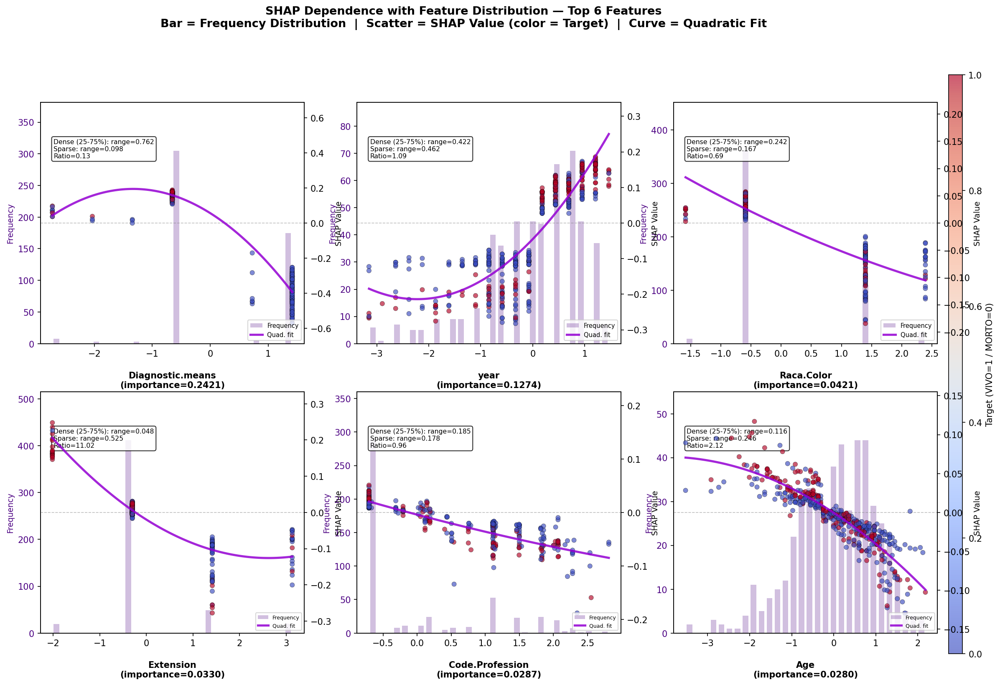

# 模块 2：双轴依赖图——核心可视化模块

> 本模块是案例教程 14「带特征分布的 SHAP 依赖图」的**核心模块**。我们将绘制本教程的主图——**带特征分布的 SHAP 依赖图**（2×3 网格，双 Y 轴）。这张图把三个维度整合在一张图上：**x 轴 = 特征值**、**左 Y 轴 = 特征值频数（直方图，紫色半透明）**、**右 Y 轴 = SHAP 值（散点图，按目标着色）**。此外，每个子图还叠加了**二次多项式拟合曲线**和**密度标注框**（显示 Dense Range、Sparse Range、Ratio）。
>
> 本模块最核心的知识点有三个：**一是双 Y 轴的创建**——`ax1.twinx()` 创建共享 x 轴但独立 y 轴的第二个坐标轴；**二是密集区与稀疏区的定义**——用 25%-75% 分位数定义"密集区"，其余为"稀疏区"，计算两个区域的 SHAP 值极差（range）和它们的比值（Ratio）；**三是 Ratio 的解读**——Ratio < 2 表示模式可信，Ratio > 4 表示稀疏区极端值驱动了模式。

---

## 学习目标

学完本模块后，你将能够：

1. **掌握 2×3 网格子图的创建**：理解 `plt.subplots(2, 3, figsize=(18, 11))` 的参数含义。
2. **掌握双 Y 轴的创建**：理解 `ax1.twinx()` 如何创建共享 x 轴的第二个坐标轴。
3. **掌握直方图的绘制**：理解 `np.histogram()` 和 `ax.bar()` 的参数。
4. **掌握散点图的绘制**：理解 `ax.scatter()` 的 `c`、`cmap`、`alpha`、`s`、`edgecolors` 参数。
5. **掌握二次多项式拟合**：理解 `np.polyfit(x, y, 2)` 和 `np.poly1d()` 的使用。
6. **掌握 R² 的计算**：理解 `ss_res`、`ss_tot`、`r2 = 1 - ss_res/ss_tot` 的公式。
7. **掌握密集区与稀疏区的定义**：理解 25%-75% 分位数的计算和 mask 操作。
8. **掌握 SHAP 值极差的计算**：理解 `np.ptp()` 的含义。
9. **掌握 Ratio 的计算与解读**：理解 `range_ratio = sparse_shap_range / dense_shap_range`。
10. **掌握密度标注框的添加**：理解 `ax.text()` 和 `bbox` 参数。
11. **掌握全局颜色条的添加**：理解 `fig.colorbar()` 和 `cax` 参数。
12. **能够解读双轴依赖图**：理解直方图、散点、拟合曲线、密度标注框的综合解读方法。
13. **能够解读 6 个特征的实际运行结果**：理解 year、Diagnostic.means 等特征的 Ratio 和 Risk。

---

## 一、模块 2：主图——带分布的 SHAP 依赖图

### 1.1 代码结构总览

```python
# ============================================================================
# 2. 主图: 带分布的 SHAP 依赖图 (2×3 网格, 双Y轴)
# ============================================================================
print("\n" + "=" * 70)
print("[2] 生成带分布的 SHAP 依赖图 (2×3 网格)")
print("=" * 70)

fig, axes = plt.subplots(2, 3, figsize=(18, 11))
fig.suptitle(...)

results_text = []

for rank, feat_idx in enumerate(top6_idx):
    row, col = divmod(rank, 3)
    ax1 = axes[row, col]          # 主坐标轴: 直方图
    ax2 = ax1.twinx()             # 共享 x 轴: SHAP 散点图

    # ... 绘制直方图、散点图、拟合曲线、密度标注 ...

# 全局颜色条
fig.subplots_adjust(right=0.92)
cbar_ax = fig.add_axes([0.93, 0.08, 0.012, 0.84])
cbar = fig.colorbar(scatter, cax=cbar_ax)
cbar.set_label('Target (VIVO=1 / MORTO=0)', fontsize=10)

plt.savefig(os.path.join(IMG_DIR, "18a_shap_dependence_with_distribution.png"),
            dpi=150, bbox_inches='tight')
plt.close()
```

整个模块 2 的逻辑：
1. 创建 2×3 网格的子图。
2. 遍历 Top 6 特征，每个特征画一个子图。
3. 每个子图用双 Y 轴：左轴画直方图，右轴画散点图。
4. 叠加二次拟合曲线和密度标注框。
5. 添加全局颜色条。
6. 保存图片。

---

## 二、创建 2×3 网格

### 2.1 创建子图

```python
fig, axes = plt.subplots(2, 3, figsize=(18, 11))
```

- `plt.subplots(2, 3)`：创建 2 行 3 列的子图网格，共 6 个子图。
- `figsize=(18, 11)`：整个图的大小是 18 英寸宽、11 英寸高。每个子图大约 6×5.5 英寸。
- `fig`：Figure 对象，整个图。
- `axes`：2×3 的 NumPy 数组，`axes[row, col]` 访问第 row 行第 col 列的子图。

> 💡 **为什么是 2×3 而不是 3×2 或 1×6？**
>
> 2×3 是宽屏比例（18:11 ≈ 1.64:1，接近 16:9），适合在屏幕和论文中显示。
> - 1×6：太长太窄，每个子图压扁。
> - 3×2：太高太瘦，每个子图也压扁。
> - 2×3：宽高比适中，每个子图接近正方形。

### 2.2 添加总标题

```python
fig.suptitle('SHAP Dependence with Feature Distribution — Top 6 Features\n'
             'Bar = Frequency Distribution  |  Scatter = SHAP Value (color = Target)  |  Curve = Quadratic Fit',
             fontsize=13, fontweight='bold', y=1.02)
```

- `fig.suptitle(...)`：给整个图添加总标题（super title）。
- `'SHAP Dependence with Feature Distribution — Top 6 Features\n'`：第一行标题，`\n` 是换行符。
- `'Bar = Frequency Distribution  |  Scatter = SHAP Value (color = Target)  |  Curve = Quadratic Fit'`：第二行是图例说明，告诉读者每个元素的含义。
- `fontsize=13`：字体大小 13。
- `fontweight='bold'`：加粗。
- `y=1.02`：标题的 y 坐标，1.02 表示在图的上方 2% 处（稍微往上移）。

### 2.3 初始化结果列表

```python
results_text = []
```

`results_text` 是一个列表，用于存储每个特征的计算结果（importance、r2、dense_range、sparse_range、range_ratio）。后续模块 3 会用它打印汇总表和保存结果文件。

---

## 三、遍历 Top 6 特征

```python
for rank, feat_idx in enumerate(top6_idx):
    row, col = divmod(rank, 3)
    ax1 = axes[row, col]          # 主坐标轴: 直方图
    ax2 = ax1.twinx()             # 共享 x 轴: SHAP 散点图

    fn = feature_names[feat_idx]
    x_vals = X_shap[:, feat_idx]
    shap_vals = sv[:, feat_idx]
```

### 3.1 `enumerate(top6_idx)`

`enumerate` 返回 `(rank, feat_idx)` 元组：
- `rank`：0, 1, 2, 3, 4, 5（子图编号）。
- `feat_idx`：特征在原始特征列表中的索引。

例如：
- `rank=0, feat_idx=3`（Diagnostic.means 的索引）→ 第 0 个子图。
- `rank=1, feat_idx=1`（year 的索引）→ 第 1 个子图。
- ...

### 3.2 `row, col = divmod(rank, 3)`

`divmod(rank, 3)` 返回 `(rank // 3, rank % 3)`：
- `rank=0` → `(0, 0)` → 第 0 行第 0 列。
- `rank=1` → `(0, 1)` → 第 0 行第 1 列。
- `rank=2` → `(0, 2)` → 第 0 行第 2 列。
- `rank=3` → `(1, 0)` → 第 1 行第 0 列。
- `rank=4` → `(1, 1)` → 第 1 行第 1 列。
- `rank=5` → `(1, 2)` → 第 1 行第 2 列。

这样 6 个特征按"从左到右、从上到下"的顺序填满 2×3 网格。

### 3.3 创建双 Y 轴

```python
ax1 = axes[row, col]          # 主坐标轴: 直方图
ax2 = ax1.twinx()             # 共享 x 轴: SHAP 散点图
```

- `ax1 = axes[row, col]`：获取当前子图的主坐标轴。
- `ax2 = ax1.twinx()`：创建一个**共享 x 轴**但**独立 y 轴**的第二个坐标轴。`twinx` 的意思是"x 轴双胞胎"——两个坐标轴共享 x 轴，但有各自的 y 轴（左 y 轴和右 y 轴）。

> 💡 **双 Y 轴的设计思想**
>
> 本教程的核心创新是双 Y 轴：
> - **左 Y 轴（ax1）**：特征值频数（Frequency），用于画直方图。
> - **右 Y 轴（ax2）**：SHAP 值，用于画散点图。
>
> 两个 y 轴共享 x 轴（特征值），这样直方图和散点图就叠加在同一张图上，可以一眼看出"特征值密集区域的 SHAP 模式"和"特征值稀疏区域的 SHAP 模式"。

### 3.4 提取当前特征的数据

```python
fn = feature_names[feat_idx]
x_vals = X_shap[:, feat_idx]
shap_vals = sv[:, feat_idx]
```

- `fn = feature_names[feat_idx]`：当前特征的名字（如 'year'）。
- `x_vals = X_shap[:, feat_idx]`：500 个样本的当前特征值，形状 `(500,)`。
- `shap_vals = sv[:, feat_idx]`：500 个样本的当前特征的 SHAP 值，形状 `(500,)`。

---

## 四、左 Y 轴：分布直方图

```python
# === 左Y轴: 分布直方图 ===
counts, bin_edges = np.histogram(x_vals, bins=30)
bin_centers = (bin_edges[:-1] + bin_edges[1:]) / 2
bin_width = bin_edges[1] - bin_edges[0]

ax1.bar(bin_centers, counts, width=bin_width * 0.7,
        align='center', color='#4B0082', alpha=0.25, zorder=0,
        label='Frequency')
ax1.set_ylabel('Frequency', fontsize=9, color='#4B0082')
ax1.set_ylim(0, counts.max() * 1.25)
ax1.tick_params(axis='y', labelcolor='#4B0082')
```

### 4.1 计算直方图

```python
counts, bin_edges = np.histogram(x_vals, bins=30)
```

- `np.histogram(x_vals, bins=30)`：把 `x_vals` 分成 30 个等宽的箱子（bins），返回两个数组：
  - `counts`：每个箱子里的样本数，形状 `(30,)`。
  - `bin_edges`：箱子的边界，形状 `(31,)`（比 bins 多 1）。

例如，如果 `x_vals` 的范围是 [-3, 3]，30 个箱子，每个箱子宽度 = 6/30 = 0.2。`bin_edges = [-3, -2.8, -2.6, ..., 2.8, 3]`。

### 4.2 计算箱子中心和宽度

```python
bin_centers = (bin_edges[:-1] + bin_edges[1:]) / 2
bin_width = bin_edges[1] - bin_edges[0]
```

- `bin_centers`：每个箱子的中心点，形状 `(30,)`。计算方法是相邻两个边界的平均值。
  - `bin_edges[:-1]`：去掉最后一个边界，形状 `(30,)`。
  - `bin_edges[1:]`：去掉第一个边界，形状 `(30,)`。
  - 两者相加除以 2，得到每个箱子的中心。
- `bin_width`：箱子的宽度（所有箱子等宽），等于 `bin_edges[1] - bin_edges[0]`。

### 4.3 绘制柱状图

```python
ax1.bar(bin_centers, counts, width=bin_width * 0.7,
        align='center', color='#4B0082', alpha=0.25, zorder=0,
        label='Frequency')
```

- `ax1.bar(...)`：在 ax1（左 y 轴）上画柱状图。
- `bin_centers`：柱子的 x 坐标（箱子中心）。
- `counts`：柱子的高度（样本数）。
- `width=bin_width * 0.7`：柱子的宽度是箱子宽度的 0.7 倍。这样柱子之间有间隙，看起来更清晰。
- `align='center'`：柱子居中对齐到 `bin_centers`。
- `color='#4B0082'`：柱子的颜色是**靛蓝色**（Indigo，色号 #4B0082）。这是彩虹色"赤橙黄绿青蓝紫"中的"紫"。
- `alpha=0.25`：透明度 25%。半透明是为了不遮挡后面的散点图。
- `zorder=0`：图层顺序，0 表示最底层（散点图在 zorder=2，拟合曲线在 zorder=4）。
- `label='Frequency'`：图例标签。

> 💡 **为什么用半透明（alpha=0.25）？**
>
> 因为直方图是"背景层"，散点图是"前景层"。如果直方图不透明，会遮挡散点图。alpha=0.25 让直方图呈现淡淡的紫色，既能看出分布形状，又不影响散点的可读性。

### 4.4 设置左 Y 轴

```python
ax1.set_ylabel('Frequency', fontsize=9, color='#4B0082')
ax1.set_ylim(0, counts.max() * 1.25)
ax1.tick_params(axis='y', labelcolor='#4B0082')
```

- `ax1.set_ylabel('Frequency', fontsize=9, color='#4B0082')`：左 y 轴的标签是"Frequency"（频数），字体大小 9，颜色与柱子一致（靛蓝色）。
- `ax1.set_ylim(0, counts.max() * 1.25)`：左 y 轴的范围是 [0, 最大频数 × 1.25]。顶部留 25% 的空间，避免柱子顶到图框。
- `ax1.tick_params(axis='y', labelcolor='#4B0082')`：左 y 轴的刻度数字也用靛蓝色，与标签和柱子颜色一致。

> 💡 **为什么左 y 轴的颜色统一用靛蓝色？**
>
> 这是可视化设计的"颜色编码"原则——左 y 轴的所有元素（标签、刻度、柱子）都用同一种颜色，让读者一眼知道"靛蓝色 = 频数"。同理，右 y 轴的 SHAP 散点用 coolwarm 配色，与左轴区分。

---

## 五、右 Y 轴：SHAP 依赖散点图

```python
# === 右Y轴: SHAP 依赖散点图 ===
scatter = ax2.scatter(
    x_vals, shap_vals,
    c=y_shap, cmap='coolwarm', alpha=0.65, s=28,
    edgecolors='black', linewidth=0.3, zorder=2)
```

### 5.1 `ax2.scatter(...)` 参数详解

- `ax2.scatter(...)`：在 ax2（右 y 轴）上画散点图。
- `x_vals`：散点的 x 坐标（特征值）。
- `shap_vals`：散点的 y 坐标（SHAP 值）。
- `c=y_shap`：散点的颜色由 `y_shap`（目标变量，0 或 1）决定。
  - `y_shap=0`（MORTO）→ 冷色（蓝色）。
  - `y_shap=1`（VIVO）→ 暖色（红色）。
- `cmap='coolwarm'`：颜色映射表。`coolwarm` 是"冷-暖"渐变：蓝色（冷）→ 白色 → 红色（暖）。
- `alpha=0.65`：透明度 65%。半透明是为了在散点密集区看出重叠程度。
- `s=28`：散点的大小（面积，单位是磅²）。28 是中等大小。
- `edgecolors='black'`：散点的边缘颜色是黑色。
- `linewidth=0.3`：边缘线宽 0.3（细线）。
- `zorder=2`：图层顺序，2 表示在直方图（zorder=0）之上、拟合曲线（zorder=4）之下。

> 💡 **为什么用 `c=y_shap` 按目标着色？**
>
> 这是本教程的一个关键设计。按目标着色可以回答："在同一个特征值下，VIVO 和 MORTO 样本的 SHAP 值有差异吗？"
>
> - 如果红色点（VIVO）和蓝色点（MORTO）在 y 轴上分离 → 该特征值能区分 VIVO 和 MORTO。
> - 如果红蓝点混在一起 → 该特征值不能区分 VIVO 和 MORTO。
>
> 这种着色方式让依赖图不仅显示"特征值 → SHAP 值"的关系，还显示"特征值 → 目标"的关系。

### 5.2 颜色映射 `coolwarm`

`coolwarm` 是 matplotlib 的发散型颜色映射：
- 0（最小值）→ 蓝色（冷）。
- 0.5（中间值）→ 白色。
- 1（最大值）→ 红色（暖）。

本教程中 `y_shap` 只有 0 和 1 两个值，所以散点要么是蓝色（MORTO），要么是红色（VIVO），没有中间色。

---

## 六、二次多项式拟合

```python
# 二次多项式拟合
if len(x_vals) > 10:
    try:
        # 计算 R²
        z2 = np.polyfit(x_vals, shap_vals, 2)
        p2 = np.poly1d(z2)
        x_range = np.linspace(np.min(x_vals), np.max(x_vals), 100)
        y_pred = p2(x_range)

        # R²
        ss_res = np.sum((shap_vals - p2(x_vals))**2)
        ss_tot = np.sum((shap_vals - np.mean(shap_vals))**2)
        r2 = 1 - ss_res / ss_tot if ss_tot > 0 else 0

        ax2.plot(x_range, y_pred, color='#9400D3',
                 linewidth=2.5, alpha=0.85, zorder=4,
                 label=f'Quad. fit (R²={r2:.3f})')
    except:
        r2 = np.nan
else:
    r2 = np.nan
```

### 6.1 拟合条件

```python
if len(x_vals) > 10:
    try:
        ...
    except:
        r2 = np.nan
else:
    r2 = np.nan
```

- `if len(x_vals) > 10:`：只有当样本数 > 10 时才拟合。样本太少时拟合没有意义。
- `try: ... except: r2 = np.nan`：如果拟合失败（如特征值全相同导致奇异矩阵），用 `np.nan` 表示 R² 缺失。

### 6.2 二次多项式拟合

```python
z2 = np.polyfit(x_vals, shap_vals, 2)
p2 = np.poly1d(z2)
```

- `np.polyfit(x_vals, shap_vals, 2)`：对 `(x_vals, shap_vals)` 做**二次多项式拟合**（degree=2），返回系数 `z2 = [a, b, c]`，使得 `shap_vals ≈ a*x² + b*x + c`。
- `np.poly1d(z2)`：把系数 `z2` 转成一个**多项式函数对象** `p2`，可以像函数一样调用：`p2(x)` 返回多项式在 x 处的值。

> 💡 **为什么用二次多项式而不是线性？**
>
> 二次多项式能拟合"U 形"或"倒 U 形"的非线性关系。如果 SHAP 值与特征值是线性关系，二次拟合的 a 会接近 0，退化为线性。如果 SHAP 值与特征值是非线性关系（如 U 形），二次拟合能捕捉到。
>
> 案例 12b 已经证明，Diagnostic.means 的 SHAP 模式是强烈非线性的（ΔR² = +0.7181），所以本教程用二次拟合。

### 6.3 生成拟合曲线

```python
x_range = np.linspace(np.min(x_vals), np.max(x_vals), 100)
y_pred = p2(x_range)
```

- `np.linspace(min, max, 100)`：在 [min, max] 之间生成 100 个等距的点，用于画平滑的拟合曲线。
- `y_pred = p2(x_range)`：用多项式函数 `p2` 计算这 100 个点对应的 SHAP 值。

### 6.4 计算 R²

```python
ss_res = np.sum((shap_vals - p2(x_vals))**2)
ss_tot = np.sum((shap_vals - np.mean(shap_vals))**2)
r2 = 1 - ss_res / ss_tot if ss_tot > 0 else 0
```

R²（决定系数）衡量拟合的好坏：

- `ss_res`（残差平方和）：实际值与预测值之差的平方和。`shap_vals - p2(x_vals)` 是残差，平方后求和。
- `ss_tot`（总平方和）：实际值与均值之差的平方和。`shap_vals - np.mean(shap_vals)` 是偏差，平方后求和。
- `r2 = 1 - ss_res / ss_tot`：R² = 1 - 残差平方和/总平方和。
  - R² = 1：完美拟合（残差为 0）。
  - R² = 0：拟合等于均值（模型没用）。
  - R² < 0：拟合比均值还差（极少见）。
- `if ss_tot > 0 else 0`：如果 `ss_tot = 0`（所有 SHAP 值相同），R² 设为 0，避免除以 0。

> 💡 **R² 的解读**
>
> - R² > 0.7：拟合很好。
> - R² 0.3-0.7：拟合一般。
> - R² < 0.3：拟合较差（SHAP 值分散，难以用二次曲线拟合）。
>
> **重要提醒**：高 R² 不一定代表可信赖！如果 R² 来自稀疏区极端值的"杠杆效应"，R² 是"虚假高"。本教程的核心创新就是用 Ratio 指标揭示这个问题。

### 6.5 绘制拟合曲线

```python
ax2.plot(x_range, y_pred, color='#9400D3',
         linewidth=2.5, alpha=0.85, zorder=4,
         label=f'Quad. fit (R²={r2:.3f})')
```

- `ax2.plot(...)`：在 ax2（右 y 轴）上画折线图（拟合曲线）。
- `x_range, y_pred`：曲线的 x 和 y 坐标。
- `color='#9400D3'`：曲线颜色是**深紫色**（DarkViolet，色号 #9400D3）。与直方图的靛蓝色（#4B0082）区分。
- `linewidth=2.5`：线宽 2.5（粗线，醒目）。
- `alpha=0.85`：透明度 85%（几乎不透明）。
- `zorder=4`：图层顺序，4 表示最上层（直方图 0、散点 2、拟合曲线 4）。
- `label=f'Quad. fit (R²={r2:.3f})'`：图例标签，显示 R² 值（3 位小数）。

---

## 七、y=0 参考线

```python
# y=0 参考线
ax2.axhline(0, color='gray', linestyle='--', linewidth=0.8, zorder=1, alpha=0.5)
```

- `ax2.axhline(0, ...)`：在 ax2 上画一条水平线（horizontal line），y=0。
- `color='gray'`：灰色。
- `linestyle='--'`：虚线。
- `linewidth=0.8`：线宽 0.8（细线）。
- `zorder=1`：图层顺序，1 表示在直方图（0）之上、散点（2）之下。
- `alpha=0.5`：透明度 50%。

> 💡 **y=0 参考线的意义**
>
> y=0 是 SHAP 值的"中性线"：
> - y > 0：该特征值推高 VIVO 概率。
> - y < 0：该特征值推低 VIVO 概率。
> - y = 0：该特征值对预测没有影响。
>
> 参考线帮助读者快速判断每个散点是"推高"还是"推低"VIVO 概率。

---

## 八、密集区与稀疏区的 SHAP 变化计算

这是本教程的**核心创新**——计算密集区和稀疏区的 SHAP 值极差，并求它们的比值（Ratio）。

```python
# 计算数据密集区和稀疏区的 SHAP 变化
dense_mask = x_vals >= np.percentile(x_vals, 25)
dense_mask &= x_vals <= np.percentile(x_vals, 75)
sparse_mask = ~dense_mask

dense_shap_range = np.ptp(shap_vals[dense_mask]) if dense_mask.sum() > 1 else 0
sparse_shap_range = np.ptp(shap_vals[sparse_mask]) if sparse_mask.sum() > 1 else 0
range_ratio = sparse_shap_range / (dense_shap_range + 1e-8)
```

### 8.1 定义密集区

```python
dense_mask = x_vals >= np.percentile(x_vals, 25)
dense_mask &= x_vals <= np.percentile(x_vals, 75)
```

- `np.percentile(x_vals, 25)`：x_vals 的 25% 分位数（下四分位数 Q1）。
- `np.percentile(x_vals, 75)`：x_vals 的 75% 分位数（上四分位数 Q3）。
- `dense_mask = x_vals >= Q1`：布尔数组，标记 x_vals >= Q1 的样本。
- `dense_mask &= x_vals <= Q3`：用 `&=`（按位与赋值）进一步限制 x_vals <= Q3。

最终 `dense_mask` 是一个布尔数组，True 表示该样本在 [Q1, Q3] 范围内（密集区），False 表示在范围外（稀疏区）。

> 💡 **为什么用 25%-75% 定义密集区？**
>
> 25%-75% 分位数范围（IQR，四分位距）包含 50% 的中间数据。这是统计学中"中间一半数据"的标准定义。
>
> 选择 25%-75% 的原因：
> 1. **稳健性**：不受极端值影响（极端值在 25% 以下或 75% 以上）。
> 2. **代表性**：包含 50% 的样本，足够估计 SHAP 模式。
> 3. **标准性**：IQR 是统计学常用概念，读者容易理解。

### 8.2 定义稀疏区

```python
sparse_mask = ~dense_mask
```

`~dense_mask` 是布尔数组的取反：True 变 False，False 变 True。所以 `sparse_mask` 标记的是不在 [Q1, Q3] 范围内的样本（稀疏区）。

稀疏区包括两部分：
- x_vals < Q1（左尾，25% 的样本）。
- x_vals > Q3（右尾，25% 的样本）。

总共 50% 的样本在稀疏区。

### 8.3 计算 SHAP 值极差

```python
dense_shap_range = np.ptp(shap_vals[dense_mask]) if dense_mask.sum() > 1 else 0
sparse_shap_range = np.ptp(shap_vals[sparse_mask]) if sparse_mask.sum() > 1 else 0
```

- `shap_vals[dense_mask]`：用布尔索引取出密集区样本的 SHAP 值。
- `np.ptp(...)`：**peak to peak**，即最大值减最小值（极差）。`np.ptp([1, 3, 5]) = 5 - 1 = 4`。
- `if dense_mask.sum() > 1 else 0`：如果密集区样本数 > 1，计算极差；否则设为 0（避免空数组报错）。

`dense_shap_range` 是密集区 SHAP 值的极差，`sparse_shap_range` 是稀疏区 SHAP 值的极差。

> 💡 **极差（range）的含义**
>
> 极差 = max - min，衡量 SHAP 值的"波动范围"。
> - 极差大 → SHAP 值波动大 → 该区域特征对预测影响大。
> - 极差小 → SHAP 值波动小 → 该区域特征对预测影响小。
>
> 本教程比较密集区和稀疏区的极差，判断"SHAP 模式是否在两个区域一致"。

### 8.4 计算 Ratio

```python
range_ratio = sparse_shap_range / (dense_shap_range + 1e-8)
```

- `range_ratio = sparse_shap_range / dense_shap_range`：稀疏区极差除以密集区极差。
- `+ 1e-8`：加一个极小的数（10^-8），避免除以 0。如果 `dense_shap_range = 0`（密集区 SHAP 值全相同），`range_ratio` 会是一个很大的数（接近 `sparse_shap_range / 1e-8`），表示"密集区几乎无变化，稀疏区有变化"。

> 💡 **Ratio 的解读规则**
>
> ```
> Ratio = Sparse Range / Dense Range
> 
> Ratio < 2:   Low Risk      → 密集区和稀疏区的 SHAP 变化接近 → 模式可信
> Ratio 2-4:   Medium Risk   → 稀疏区变化略大 → 需交叉验证
> Ratio > 4:   High Risk     → 稀疏区变化远大于密集区 → 极端值驱动，谨慎解读
> ```
>
> **直觉理解**：
> - Ratio = 1：稀疏区和密集区的 SHAP 变化一样大 → 模式在全数据范围一致 → 可信。
> - Ratio = 17：稀疏区的 SHAP 变化是密集区的 17 倍 → 极端值驱动了模式 → 谨慎。

---

## 九、数据密度标注框

```python
# 数据密度标注
ax1.text(0.05, 0.85,
         f'Dense (25-75%): range={dense_shap_range:.3f}\n'
         f'Sparse: range={sparse_shap_range:.3f}\n'
         f'Ratio={range_ratio:.2f}',
         transform=ax1.transAxes, fontsize=7.5, va='top',
         bbox=dict(boxstyle='round,pad=0.3', facecolor='white', alpha=0.8),
         zorder=5)
```

### 9.1 `ax1.text(...)` 参数详解

- `ax1.text(...)`：在 ax1 上添加文本标注。
- `0.05, 0.85`：文本的 x、y 坐标。注意这里用的是**坐标轴相对坐标**（0-1），不是数据坐标。
  - `(0, 0)` 是坐标轴左下角。
  - `(1, 1)` 是坐标轴右上角。
  - `(0.05, 0.85)` 是左上角偏右一点的位置。
- `f'Dense (25-75%): range={dense_shap_range:.3f}\n...'`：文本内容，3 行：
  - 第 1 行：密集区的 SHAP 极差（3 位小数）。
  - 第 2 行：稀疏区的 SHAP 极差（3 位小数）。
  - 第 3 行：Ratio（2 位小数）。
- `transform=ax1.transAxes`：指定坐标系统为"坐标轴相对坐标"（0-1）。如果不指定，默认是"数据坐标"。
- `fontsize=7.5`：字体大小 7.5（小字）。
- `va='top'`：垂直对齐方式，top 表示文本的顶部对齐到 y 坐标。
- `bbox=dict(...)`：文本框样式。
  - `boxstyle='round,pad=0.3'`：圆角矩形，内边距 0.3。
  - `facecolor='white'`：背景白色。
  - `alpha=0.8`：透明度 80%（稍微透明，不遮挡散点）。
- `zorder=5`：图层顺序，5 表示最上层（在拟合曲线 4 之上）。

> 💡 **密度标注框的作用**
>
> 标注框把三个关键数字直接显示在图上：
> 1. **Dense Range**：密集区的 SHAP 极差。
> 2. **Sparse Range**：稀疏区的 SHAP 极差。
> 3. **Ratio**：两者的比值。
>
> 读者不需要查表，直接看图就能判断"这个特征的 SHAP 模式是否可信"。

---

## 十、设置坐标轴标签和范围

```python
ax2.set_ylabel('SHAP Value', fontsize=9)
ax1.set_xlabel(f'\n{fn}\n(importance={shap_importance[feat_idx]:.4f})',
               fontsize=10, fontweight='bold')

# Y 轴范围
y_max = np.abs(shap_vals).max() * 1.2
if y_max > 1e-6:
    ax2.set_ylim(-y_max, y_max)
else:
    ax2.set_ylim(-1, 1)
```

### 10.1 右 Y 轴标签

```python
ax2.set_ylabel('SHAP Value', fontsize=9)
```

右 y 轴的标签是"SHAP Value"（SHAP 值），字体大小 9。

### 10.2 X 轴标签

```python
ax1.set_xlabel(f'\n{fn}\n(importance={shap_importance[feat_idx]:.4f})',
               fontsize=10, fontweight='bold')
```

- `f'\n{fn}\n(importance={shap_importance[feat_idx]:.4f})'`：x 轴标签，3 行：
  - 第 1 行：空行（`\n` 开头，留点空间）。
  - 第 2 行：特征名（如 'year'）。
  - 第 3 行：该特征的重要性（4 位小数）。
- `fontsize=10`：字体大小 10。
- `fontweight='bold'`：加粗。

### 10.3 右 Y 轴范围

```python
y_max = np.abs(shap_vals).max() * 1.2
if y_max > 1e-6:
    ax2.set_ylim(-y_max, y_max)
else:
    ax2.set_ylim(-1, 1)
```

- `np.abs(shap_vals).max()`：SHAP 值绝对值的最大值。
- `* 1.2`：乘以 1.2，顶部和底部各留 20% 的空间。
- `ax2.set_ylim(-y_max, y_max)`：右 y 轴范围是对称的 [-y_max, y_max]。
- `if y_max > 1e-6 else ax2.set_ylim(-1, 1)`：如果 SHAP 值全为 0（y_max 接近 0），设默认范围 [-1, 1]。

> 💡 **为什么 y 轴范围要对称？**
>
> 因为 SHAP 值有正有负（正值推高 VIVO，负值推低 VIVO），对称范围让 0 在中间，方便看正负。y=0 参考线也在中间。

---

## 十一、图例和图层顺序

```python
# 图例 (合并 ax1 + ax2)
h1, l1 = ax1.get_legend_handles_labels()
h2, l2 = ax2.get_legend_handles_labels()
offset_font = 6 if rank >= 3 else 7
ax2.legend(h1 + h2, ['Frequency', 'Quad. fit'],
           loc='lower right', fontsize=offset_font, framealpha=0.8)

# 图层顺序
ax1.set_zorder(0)
ax2.set_zorder(1)
ax2.patch.set_alpha(0)
```

### 11.1 合并图例

```python
h1, l1 = ax1.get_legend_handles_labels()
h2, l2 = ax2.get_legend_handles_labels()
offset_font = 6 if rank >= 3 else 7
ax2.legend(h1 + h2, ['Frequency', 'Quad. fit'],
           loc='lower right', fontsize=offset_font, framealpha=0.8)
```

- `ax1.get_legend_handles_labels()`：获取 ax1 的图例句柄和标签（直方图的 'Frequency'）。
- `ax2.get_legend_handles_labels()`：获取 ax2 的图例句柄和标签（拟合曲线的 'Quad. fit'）。
- `h1 + h2`：合并两个坐标轴的句柄。
- `['Frequency', 'Quad. fit']`：手动指定图例标签（覆盖原始标签）。
- `loc='lower right'`：图例位置在右下角。
- `fontsize=offset_font`：字体大小，`rank >= 3`（第二行）用 6，`rank < 3`（第一行）用 7。第二行字体小一点，因为子图更挤。
- `framealpha=0.8`：图例背景透明度 80%。

### 11.2 图层顺序

```python
ax1.set_zorder(0)
ax2.set_zorder(1)
ax2.patch.set_alpha(0)
```

- `ax1.set_zorder(0)`：ax1（直方图）的图层顺序设为 0（最底层）。
- `ax2.set_zorder(1)`：ax2（散点图）的图层顺序设为 1（在 ax1 之上）。
- `ax2.patch.set_alpha(0)`：把 ax2 的背景透明度设为 0（完全透明）。这样 ax2 的背景不会遮挡 ax1 的直方图。

> 💡 **为什么需要 `ax2.patch.set_alpha(0)`？**
>
> 默认情况下，`twinx()` 创建的 ax2 有一个不透明的背景，会遮挡 ax1 的内容。`set_alpha(0)` 把背景设为透明，让 ax1 的直方图能显示出来。

---

## 十二、存储结果

```python
results_text.append({
    'feature': fn,
    'importance': shap_importance[feat_idx],
    'r2': r2,
    'dense_range': dense_shap_range,
    'sparse_range': sparse_shap_range,
    'range_ratio': range_ratio
})
```

把每个特征的计算结果存入 `results_text` 列表，供模块 3 使用。每个元素是一个字典，包含：
- `feature`：特征名。
- `importance`：mean |SHAP|。
- `r2`：二次拟合的 R²。
- `dense_range`：密集区 SHAP 极差。
- `sparse_range`：稀疏区 SHAP 极差。
- `range_ratio`：Ratio。

---

## 十三、全局颜色条

```python
# 全局颜色条
fig.subplots_adjust(right=0.92)
cbar_ax = fig.add_axes([0.93, 0.08, 0.012, 0.84])
cbar = fig.colorbar(scatter, cax=cbar_ax)
cbar.set_label('Target (VIVO=1 / MORTO=0)', fontsize=10)
```

### 13.1 调整子图布局

```python
fig.subplots_adjust(right=0.92)
```

`fig.subplots_adjust(right=0.92)`：把子图的右边界设为 0.92（默认是 1.0），留出 8% 的空间给颜色条。

### 13.2 添加颜色条

```python
cbar_ax = fig.add_axes([0.93, 0.08, 0.012, 0.84])
cbar = fig.colorbar(scatter, cax=cbar_ax)
cbar.set_label('Target (VIVO=1 / MORTO=0)', fontsize=10)
```

- `fig.add_axes([0.93, 0.08, 0.012, 0.84])`：在图上添加一个新的坐标轴，参数是 [left, bottom, width, height]（相对坐标 0-1）：
  - `left=0.93`：左边在 93% 处。
  - `bottom=0.08`：底部在 8% 处。
  - `width=0.012`：宽度 1.2%（细长）。
  - `height=0.84`：高度 84%。
- `fig.colorbar(scatter, cax=cbar_ax)`：把散点图 `scatter` 的颜色映射画成颜色条，放在 `cbar_ax` 上。
- `cbar.set_label('Target (VIVO=1 / MORTO=0)', fontsize=10)`：颜色条的标签。

> 💡 **为什么用全局颜色条而不是每个子图一个？**
>
> 因为所有 6 个子图用相同的颜色映射（`cmap='coolwarm'`，`c=y_shap`），一个全局颜色条就够了。这样节省空间，也让读者知道"所有子图的颜色含义一致"。

---

## 十四、保存图片

```python
plt.savefig(os.path.join(IMG_DIR, "18a_shap_dependence_with_distribution.png"),
            dpi=150, bbox_inches='tight')
plt.close()
print("  [图] 18a_shap_dependence_with_distribution.png 已保存")
```

- `plt.savefig(...)`：保存图片。
- `os.path.join(IMG_DIR, "18a_shap_dependence_with_distribution.png")`：图片路径。
- `dpi=150`：分辨率 150 DPI（适合屏幕显示和论文排版）。
- `bbox_inches='tight'`：紧凑边界，自动裁剪空白。
- `plt.close()`：关闭图，释放内存。

实际运行输出：

```
  [图] 18a_shap_dependence_with_distribution.png 已保存
```

---

## 十五、实际运行结果与图片解读

### 15.1 生成的图片



### 15.2 图表结构

```
                  紫色半透明柱 = 特征值分布直方图

  Frequency ↑   ██
              ██  ██
              ██  ██  ██                        ● ← 散点
              ██  ██  ██  ██     ● ● ← SHAP 模式
              ██  ██  ██  ██  ██ ● ● ● ● ●
              ██  ██  ██  ██  ██ ● ● ● ● ● ●
             ──────────────────────────→ 特征值
              ● ● ● ● ● ● ● ● ●
   SHAP ↑ → ● ● ● ● ● ● ● ● ●
        ● ● ● ● ● ● ● ● ●
             ──────────────────────────→ 特征值

        密集区 (25%-75%)        稀疏区 (边缘)
```

### 15.3 批量解读指南

> **读图顺序：密度直方图 → SHAP 散点 → 拟合曲线 → 密度标注框**

| 步骤 | 关注点 | 问题 |
|------|--------|------|
| 1 | 直方图的形状 | 数据集中在哪个区域？是否存在长尾？ |
| 2 | 密集区域的 SHAP 模式 | 直方图最高处，散点的 y 值趋势是什么？ |
| 3 | 稀疏区域的 SHAP 模式 | 边缘区域是否有剧烈变化？ |
| 4 | 拟合曲线的弯曲位置 | 弯曲发生在密集区还是稀疏区？ |
| 5 | 密度标注框的 Ratio | 量化评估——稀疏/密集的比例是否合理？ |

### 15.4 6 个特征的实际评估

| 特征 | Importance | R²_quad | Dense Range | Sparse Range | **Ratio** | Risk | 解读 |
|------|-----------|---------|-------------|--------------|-----------|------|------|
| **Diagnostic.means** | 0.2421 | 0.9518 | 0.7619 | 0.0979 | **0.13** | **Low** | ✅ 密集区 SHAP 变化远大于稀疏区，模式可信 |
| **year** | 0.1274 | 0.7618 | 0.4222 | 0.4616 | **1.09** | **Low** | ✅ 跨越全数据范围一致可信 |
| Raca.Color | 0.0421 | 0.8042 | 0.2421 | 0.1673 | 0.69 | Low | 密集区模式为主 |
| **Extension** | 0.0330 | 0.8298 | 0.0477 | 0.5252 | **11.02** | **⚠️ High** | 密集区几乎无变化，稀疏区剧烈变化 |
| Code.Profession | 0.0287 | 0.8028 | 0.1851 | 0.1782 | 0.96 | Low | 全范围一致可信 |
| Age | 0.0280 | 0.7871 | 0.1163 | 0.2462 | 2.12 | Medium | 边缘区波动略大 |

### 15.5 教学陷阱 1：Extension 的 Ratio=11.02

```
Ratio = 11.02 意味着什么？

Dense Range (0.048): 在数据密集的中间 50% 区域，SHAP 值几乎水平
  → 在这个区域，Extension"不重要"
  → SHAP 值在 -0.02 到 +0.02 之间波动

Sparse Range (0.525): 在数据稀疏的边缘区域，SHAP 值剧烈变化
  → 少数几个极端值的 Extension 样本贡献巨大
  → SHAP 值从 -0.25 到 +0.28

教学结论:
  1. Extension 在常规范围内几乎不影响预测
  2. 但在某些特殊值上（可能对应极少数扩展类型），影响非常大
  3. 这种模式可能是真实的（某些罕见扩展方式预后极差/极好）
  4. 但也可能受到少数离群点的影响——需要验证
  5. 验证方法: 去掉极端值后重新计算 AUC
```

### 15.6 教学陷阱 2：高 R² ≠ 可信赖

```
对比 Extension 和 Diagnostic.means:

Extension:
  R²_quad = 0.8298 → 高
  Ratio = 11.02    → 高风险

Diagnostic.means:
  R²_quad = 0.9518 → 更高
  Ratio = 0.13     → 低风险

关键认知:
  R² 高只说明"二次曲线拟合得好"
  但"拟合得好"可能是因为少数极端值的"杠杆效应"
  极端值拉动了拟合曲线，使 R² 出现"虚假高"

所以:
  高 R² + 低 Ratio = 可信的非线性模式
  高 R² + 高 Ratio = 被极端值驱动的模式
```

---

## 小贴士

### 💡 小贴士 1：双 Y 轴的"颜色编码"原则

本教程的双 Y 轴用颜色区分：
- **左 Y 轴（Frequency）**：靛蓝色（#4B0082）——标签、刻度、柱子都是靛蓝色。
- **右 Y 轴（SHAP Value）**：默认黑色标签 + coolwarm 散点。
- **拟合曲线**：深紫色（#9400D3）——与靛蓝色区分。

这种"颜色编码"让读者一眼知道"哪个轴对应哪个元素"，避免混淆。

### 💡 小贴士 2：`zorder` 的图层管理

本教程用了 5 个 zorder 层级：

| zorder | 元素 | 说明 |
|--------|------|------|
| 0 | 直方图柱子 | 最底层（背景） |
| 1 | y=0 参考线 | 在直方图之上 |
| 2 | SHAP 散点 | 在参考线之上 |
| 4 | 拟合曲线 | 在散点之上 |
| 5 | 密度标注框 | 最上层（不遮挡） |

合理的 zorder 让所有元素都可见，不会互相遮挡。

### 💡 小贴士 3：`np.percentile` vs `np.quantile`

两者都计算分位数，但参数不同：
- `np.percentile(x, 25)`：百分位数，参数是 0-100。
- `np.quantile(x, 0.25)`：分位数，参数是 0-1。

本教程用 `np.percentile(x_vals, 25)` 表示 25% 分位数。等价于 `np.quantile(x_vals, 0.25)`。

### 💡 小贴士 4：`np.ptp` 的命名由来

`ptp` 是 "peak to peak" 的缩写，即"峰峰值"。在信号处理中，峰峰值 = 最大值 - 最小值。NumPy 沿用了这个命名。

注意：`np.ptp(x)` 等价于 `x.max() - x.min()`。

### 💡 小贴士 5：为什么用 `1e-8` 而不是 `0` 做分母保护？

```python
range_ratio = sparse_shap_range / (dense_shap_range + 1e-8)
```

`1e-8`（10^-8）是一个极小的数，用作"数值稳定"保护：
- 如果 `dense_shap_range = 0`，加 `1e-8` 后分母是 10^-8，结果是一个很大的数（如 `0.446 / 1e-8 = 4.46e7`）。
- 如果 `dense_shap_range > 0`，加 `1e-8` 几乎不影响结果（如 `0.026 + 1e-8 ≈ 0.026`）。

用 `1e-8` 而不是 `0` 是为了**避免除以 0 的报错**（Python 会抛出 `ZeroDivisionError` 或返回 `inf`）。

---

## 常见问题

### Q1: 为什么直方图用 30 个箱子（bins=30）？

**A**: 30 是一个经验值。箱子太少（如 10）会丢失分布细节；箱子太多（如 100）会让每个箱子的样本太少，直方图锯齿状。对于 500 个样本，30 个箱子平均每个箱子约 17 个样本，足够画出平滑的分布形状。

经验法则：箱子数 ≈ √n，其中 n 是样本数。√500 ≈ 22，所以 30 稍多但可接受。

### Q2: 为什么散点图用 `coolwarm` 而不是 `viridis`？

**A**: `coolwarm` 是**发散型**颜色映射（蓝-白-红），适合表示有"方向"的二元变量（VIVO vs MORTO）。`viridis` 是**顺序型**颜色映射（紫-绿-黄），适合表示连续变量。

本教程中 `y_shap` 是二元变量（0 或 1），用 `coolwarm` 让 VIVO（红）和 MORTO（蓝）形成视觉对比。

### Q3: 为什么拟合曲线用二次而不是更高次？

**A**: 二次多项式（degree=2）能拟合 U 形或倒 U 形，是最简单的非线性拟合。更高次（如 3 次、4 次）能拟合更复杂的形状，但容易过拟合（在数据稀疏区产生剧烈波动）。

案例 12b 已经证明，二次拟合对本数据集足够。更高次的收益递减，风险增加。

### Q4: `dense_mask &= x_vals <= np.percentile(x_vals, 75)` 中的 `&=` 是什么？

**A**: `&=` 是"按位与赋值"运算符，等价于 `dense_mask = dense_mask & (x_vals <= Q3)`。

`&` 是布尔数组的"按位与"（element-wise AND），即两个布尔数组的对应元素都为 True 时结果为 True。

注意：不能用 `and`，因为 `and` 只能操作单个布尔值，不能操作数组。

### Q5: 为什么 `ax1.set_zorder(0)` 和 `ax2.set_zorder(1)` 后还要 `ax2.patch.set_alpha(0)`？

**A**: `set_zorder` 控制图层的**绘制顺序**，但不控制背景透明度。默认情况下，`twinx()` 创建的 ax2 有一个不透明的白色背景，即使 zorder 设为 1，ax2 的背景仍然会遮挡 ax1。

`ax2.patch.set_alpha(0)` 把 ax2 的背景设为完全透明，这样 ax1 的直方图能显示出来。

### Q6: 如果某个特征的 `dense_shap_range = 0`，Ratio 会是多少？

**A**: `range_ratio = sparse_shap_range / (0 + 1e-8) = sparse_shap_range / 1e-8`。

如果 `sparse_shap_range = 0.525`，则 `range_ratio = 0.525 / 1e-8 = 5.25e7`（一个极大的数）。这表示"密集区 SHAP 值完全不变，稀疏区有变化"——极端的"边缘驱动"模式。

Extension 的 Dense Range = 0.0477（接近 0），所以 Ratio = 0.5252 / 0.0477 ≈ 11.02。如果 Dense Range 真的等于 0，Ratio 会是 5.25e7，远大于 11.02。

### Q7: 为什么颜色条用 `fig.add_axes` 而不是 `fig.colorbar(..., ax=axes)`？

**A**: `fig.colorbar(..., ax=axes)` 会自动从所有子图"偷"空间来放颜色条，可能导致子图变形。`fig.add_axes` 手动指定颜色条的位置和大小，更精确控制布局。

本教程用 `fig.add_axes([0.93, 0.08, 0.012, 0.84])` 把颜色条放在右侧 93%-94.2% 处，高度 8%-92%，不占用子图空间。

### Q8: 如何判断一个特征的 SHAP 模式是"线性"还是"非线性"？

**A**: 看拟合曲线的形状：
- **线性**：拟合曲线接近直线 → SHAP 值与特征值是线性关系。
- **非线性（U 形/倒 U 形）**：拟合曲线有明显弯曲 → SHAP 值与特征值是非线性关系。

更定量的方法是看案例 12b 的 ΔR²（二次 R² - 线性 R²）：
- ΔR² > 0.05：存在非线性。
- ΔR² > 0.20：强烈非线性。

本教程的 R² 是二次拟合的 R²，不直接比较线性。要看线性 vs 非线性，参考案例 12b。

### Q9: 为什么 Diagnostic.means 的 Ratio = 0.13（低风险）？

**A**: Diagnostic.means 的 Dense Range = 0.7619，Sparse Range = 0.0979。密集区变化远大于稀疏区（0.098 / 0.762 ≈ 0.13），说明 Diagnostic.means 的 SHAP 模式主要由密集数据驱动，稀疏区的影响很小。这意味着 Diagnostic.means 的 SHAP 模式非常可信——模型在数据密集区域学到的模式比在稀疏区域更显著。

这是"黄金特征"的特征——重要性高（#1）、R² 极高（0.9518）、模式由密集数据驱动（Ratio=0.13）。

### Q10: 为什么 Extension 的 Ratio = 11.02 但重要性只有 0.0330？

**A**: Extension 的 mean |SHAP| = 0.0330（较低），但 Ratio = 11.02（高风险）。这说明：

1. **重要性低**：Extension 对大多数样本的贡献很小（平均绝对 SHAP 值低）。
2. **Ratio 高**：但在少数极端值上，Extension 的 SHAP 值波动很大（稀疏区极差是密集区的 11 倍）。

**教学要点**：如果一个特征重要性低且 Ratio 高，它的重要性可能被少数极端值"虚假抬升"了。这种特征的模型贡献可能不稳定，建议截尾处理或分箱。

---

## 本模块小结

本模块完成了**带分布的 SHAP 依赖图**的绘制——本教程的核心可视化：

1. **创建 2×3 网格**：
   - `plt.subplots(2, 3, figsize=(18, 11))` 创建 6 个子图。
   - 总标题说明三个元素：直方图、散点图、拟合曲线。

2. **遍历 Top 6 特征**：
   - `enumerate(top6_idx)` 遍历 6 个特征。
   - `divmod(rank, 3)` 计算子图的行列位置。
   - 每个特征创建双 Y 轴：`ax1`（直方图）+ `ax2 = ax1.twinx()`（散点图）。

3. **左 Y 轴：分布直方图**：
   - `np.histogram(x_vals, bins=30)` 计算 30 个箱子的频数。
   - `ax1.bar(...)` 画紫色半透明柱状图（alpha=0.25）。
   - 左 y 轴标签、刻度都用靛蓝色（#4B0082）。

4. **右 Y 轴：SHAP 散点图**：
   - `ax2.scatter(...)` 画散点，颜色按目标（`c=y_shap`）。
   - `cmap='coolwarm'`：VIVO=红，MORTO=蓝。
   - `alpha=0.65` 半透明，`s=28` 中等大小。

5. **二次多项式拟合**：
   - `np.polyfit(x, y, 2)` 二次拟合，`np.poly1d` 转成函数。
   - 计算 R² = 1 - ss_res/ss_tot。
   - `ax2.plot(...)` 画深紫色（#9400D3）拟合曲线。

6. **y=0 参考线**：
   - `ax2.axhline(0, ...)` 画灰色虚线，区分正负 SHAP 值。

7. **密集区与稀疏区计算**（核心创新）：
   - `dense_mask`：25%-75% 分位数范围内的样本。
   - `sparse_mask`：范围外的样本。
   - `np.ptp()` 计算两个区域的 SHAP 极差。
   - `range_ratio = sparse / dense` 计算 Ratio。

8. **密度标注框**：
   - `ax1.text(...)` 在左上角显示 Dense Range、Sparse Range、Ratio。
   - 白色半透明背景，不遮挡散点。

9. **全局颜色条**：
   - `fig.add_axes([0.93, 0.08, 0.012, 0.84])` 手动指定位置。
   - 标签 "Target (VIVO=1 / MORTO=0)"。

10. **保存图片**：
    - `18a_shap_dependence_with_distribution.png`，150 DPI。

**实际运行结果**：

| 特征 | Importance | R² | Dense Range | Sparse Range | Ratio | Risk |
|------|-----------|-----|------------|-------------|-------|------|
| Diagnostic.means | 0.2421 | 0.9518 | 0.7619 | 0.0979 | 0.13 | Low |
| year | 0.1274 | 0.7618 | 0.4222 | 0.4616 | 1.09 | Low |
| Raca.Color | 0.0421 | 0.8042 | 0.2421 | 0.1673 | 0.69 | Low |
| Extension | 0.0330 | 0.8298 | 0.0477 | 0.5252 | 11.02 | High |
| Code.Profession | 0.0287 | 0.8028 | 0.1851 | 0.1782 | 0.96 | Low |
| Age | 0.0280 | 0.7871 | 0.1163 | 0.2462 | 2.12 | Medium |

**核心发现**：
1. **Diagnostic.means 是"全范围可信"的特征**（Ratio=0.13）——密集区 SHAP 变化远大于稀疏区，模式由密集数据驱动。
2. **Extension 的 Ratio=11.02**——极端的"密集区平坦，稀疏区剧烈变化"模式。
3. **高 R² ≠ 可信赖**——Extension 的 R²=0.8298（高），但 Ratio=11.02（高风险），R² 是"虚假高"。
4. **数据密度提供了模型解释的"置信度"维度**——每次看到依赖图都要问："这个模式发生在数据集中还是边缘？"

**下一步**：在模块 3 中，我们将把 6 个特征的计算结果整理成汇总表，保存到结果文件，并讨论密度风险对模型解释实践的影响。
