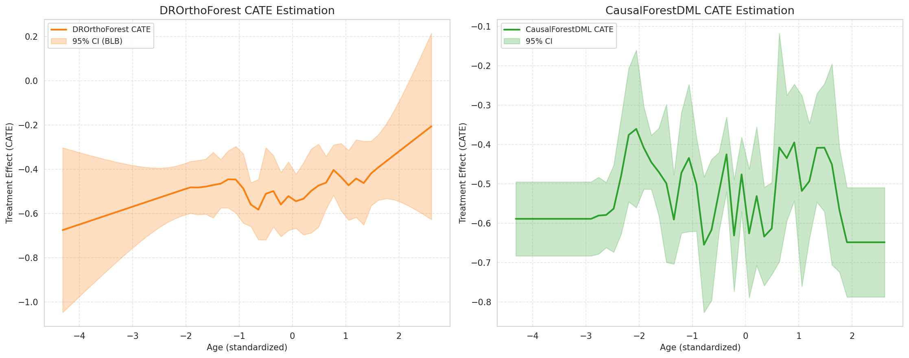

# 模块 2：CausalForestDML 训练与模型比较

> 本模块是案例教程 18「异质性处理效应 (HTE) — 双重机器学习 (DML) 方法」的**第三个模块**。在模块 1 完成 DROrthoForest 训练之后，本模块训练第二个 DML 模型——**CausalForestDML（Causal Forest DML，因果森林双重机器学习）**，并将两个模型的 CATE 曲线并排可视化比较。 
> 本模块最核心的知识点有三个：**一是 CausalForestDML 与 DROrthoForest 的区别**——前者更轻量、内置交叉拟合、支持推断；**二是双子图绘制 `fig, axes = plt.subplots(1, 2, figsize=(15, 6))` 和 `ax.fill_between` 绘制置信区间**——如何用 matplotlib 并排展示两个模型的 CATE 曲线； 

---

## 学习目标

学完本模块后，你将能够：

1. **理解 CausalForestDML 与 DROrthoForest 的区别**：知道前者更轻量、训练更快、内置交叉拟合、支持更多推断功能。
2. **掌握 CausalForestDML 的 7 个关键参数**：`model_y`、`model_t`、`n_estimators`、`min_samples_leaf`、`max_depth`、`max_samples`、`discrete_treatment` 各自的作用。
3. **理解 `cache_values=True` 的作用**：知道为什么要在 `fit` 时缓存中间值，以及它对后续推断的影响。
4. **掌握 `est2.summary()` 的用法**：知道如何打印模型摘要，以及异常处理。
5. **掌握双子图绘制**：`fig, axes = plt.subplots(1, 2, figsize=(15, 6))` 创建双子图，`axes[0]` 和 `axes[1]` 分别操作。
6. **掌握 `ax.fill_between` 绘制置信区间**：知道如何用半透明区域表示 95% CI。
7. **掌握 ATE 的近似计算**：`np.mean(treatment_effects)` 把 50 个测试点的 CATE 平均作为 ATE 近似。
 

---

## 一、CausalForestDML 与 DROrthoForest 的区别（核心概念）

在进入代码之前，我们先理解 CausalForestDML 与 DROrthoForest 的区别。这是本模块最重要的概念。

### 1.1 两个模型的核心区别

| 特性 | DROrthoForest | CausalForestDML |
|------|---------------|-----------------|
| **核心思想** | 正交随机森林 + 双重稳健 | 因果森林 + DML |
| **训练速度** | 慢（每棵树训练多个 nuisance model） | 快（内置交叉拟合，优化更好） |
| **交叉拟合** | 需要手动配置 | 内置（`cv` 参数） |
| **推断功能** | 有限（`effect_interval` 可能不可用） | 丰富（`effect_interval`、`const_marginal_effect_inference`、`effect_inference`） |
| **分裂准则** | 最大化 CATE 异质性 | 最大化 CATE 异质性 |
| **叶子节点估计** | 加权 Lasso | 局部平均处理效应 (LATE) |
| **聚合方式** | 加权平均 | 加权平均 |
| **适用场景** | 需要双重稳健性 | 需要快速训练 + 推断 |

### 1.2 为什么用两个模型？

> 💡 **重点概念：模型比较的价值**
>
> 不同的 DML 模型有不同的假设和优势。通过比较两个模型的 CATE 估计，我们可以：
>
> 1. **验证稳健性**：如果两个模型的 CATE 曲线趋势一致，说明估计可靠。如果趋势矛盾，可能说明估计不稳定，需要进一步调查。
> 2. **互补优势**：DROrthoForest 提供双重稳健性，CausalForestDML 提供快速训练和丰富推断。两者结合给出更全面的图景。
> 3. **教学目的**：让学生了解不同 DML 模型的特点和适用场景。

### 1.3 CausalForestDML 的工作流程

```
CausalForestDML 工作流程:

1. 交叉拟合 (Cross-Fitting):
   a. 把数据分成 cv 折 (默认 cv=2)
   b. 对每折 i:
      - 用其他 cv-1 折训练 model_y: E[Y|X, W]
      - 用其他 cv-1 折训练 model_t: E[T|X, W]
      - 在第 i 折上计算残差: Y_res, T_res

2. 因果森林训练:
   a. 用残差 (Y_res, T_res) 训练因果森林
   b. 分裂准则: 最大化 CATE 的异质性
   c. 每个叶子节点: 估计局部平均处理效应 (LATE)

3. CATE 估计:
   - 对 X_test 点, 找到所有树中包含该点的叶子节点
   - 取这些叶子节点 LATE 的加权平均
```

---
 
---

## 二、配置 CausalForestDML 模型（本模块核心）

```python
print("\n    开始训练 CausalForestDML...")
t0 = time.time()

est2 = CausalForestDML(
    model_y=Lasso(alpha=lambda_reg, max_iter=1000),
    model_t=LogisticRegression(
        C=1 / (X.shape[0] * lambda_reg), penalty='l1', solver='saga', max_iter=1000
    ),
    n_estimators=100,
    min_samples_leaf=10,
    max_depth=20,
    max_samples=subsample_ratio,
    discrete_treatment=True,
    n_jobs=1,
    random_state=RANDOM_STATE
)
```

### 2.1 `t0 = time.time()`

记录训练开始时间。CausalForestDML 训练比 DROrthoForest 快，但仍需记录耗时。

### 2.2 CausalForestDML 的参数详解

#### `model_y=Lasso(alpha=lambda_reg, max_iter=1000)`

**结果模型**：预测 E[Y|X, W]。

- 与 DROrthoForest 的 `model_Y` 相同配置：Lasso + lambda_reg 正则化。
- 注意命名差异：DROrthoForest 用 `model_Y`（大写 Y），CausalForestDML 用 `model_y`（小写 y）。这是 econml 不同模块的命名惯例。

#### `model_t=LogisticRegression(...)`

**处理模型**：预测 E[T|X, W]。

- 与 DROrthoForest 的 `propensity_model` 相同配置：LogisticRegression (L1)。
- 注意命名差异：DROrthoForest 用 `propensity_model`，CausalForestDML 用 `model_t`。
- `C=1 / (X.shape[0] * lambda_reg)`：与模块 1 相同的正则化强度。
- `penalty='l1'`：L1 惩罚，自动特征选择。
- `solver='saga'`：支持 L1 的优化算法。
- `max_iter=1000`：最大迭代次数。

> 💡 **重点概念：model_y 和 model_t 的角色**
>
> CausalForestDML 内部用交叉拟合训练两个 nuisance model：
> - `model_y`：预测 E[Y|X, W]，用于计算 Y 的残差 Y_res = Y - E[Y|X, W]。
> - `model_t`：预测 E[T|X, W]，用于计算 T 的残差 T_res = T - E[T|X, W]。
>
> 然后用残差 (Y_res, T_res) 训练因果森林，估计 CATE。

#### `n_estimators=100`

**树的数量**。因果森林包含 100 棵树。

- 与 DROrthoForest 的 `n_trees=100` 对应。
- 树越多，估计越稳定，但训练越慢。
- 100 是合理的默认值。

#### `min_samples_leaf=10`

**叶子节点的最小样本数**。

- 与 DROrthoForest 的 `min_leaf_size=10` 对应。
- 注意命名差异：DROrthoForest 用 `min_leaf_size`，CausalForestDML 用 `min_samples_leaf`（与 sklearn 的 RandomForest 命名一致）。
- 10 是经验值，在偏差和方差之间取得平衡。

#### `max_depth=20`

**树的最大深度**。

- 与 DROrthoForest 的 `max_depth=20` 相同。
- 控制树的复杂度，20 足够深，能捕捉 Age 的非线性效应。

#### `max_samples=subsample_ratio`

**每棵树的子采样比例**（0.3）。

- 与 DROrthoForest 的 `subsample_ratio=0.3` 对应。
- 注意命名差异：DROrthoForest 用 `subsample_ratio`，CausalForestDML 用 `max_samples`（与 sklearn 的 RandomForest 命名一致）。
- 每棵树从训练集中有放回抽取 30% 的样本（900 个）。

#### `discrete_treatment=True`

**处理变量是否离散**。

- `True`：T 是离散的（二值 0/1）。CausalForestDML 内部用分类方法处理 T。
- `False`：T 是连续的（如剂量、肿瘤大小）。CausalForestDML 内部用回归方法处理 T。
- 本教程的 T 是二值（转移/局部），所以设为 `True`。

> 💡 **重点概念：discrete_treatment 的影响**
>
> `discrete_treatment=True` 时：
> - `model_t` 应该是分类器（如 LogisticRegression）。
> - 内部用分类方法预测 P(T=1|X, W)。
> - 残差 T_res = T - P(T=1|X, W)。
>
> `discrete_treatment=False` 时：
> - `model_t` 应该是回归器（如 Lasso、Ridge）。
> - 内部用回归方法预测 E[T|X, W]。
> - 残差 T_res = T - E[T|X, W]。
>
> 模块 3 会用一个 `discrete_treatment=False` 的 CausalForestDML 实例做推断，展示不同的内部处理方式。

#### `n_jobs=1` 和 `random_state=RANDOM_STATE`

- `n_jobs=1`：单线程，保证可复现。
- `random_state=RANDOM_STATE`：随机种子 42，控制所有随机性。

---

## 三、训练模型

```python
est2.fit(Y, T, X=X, W=W, cache_values=True)
print(f"    训练完成, 耗时: {time.time() - t0:.1f}s")
```

### 3.1 `est2.fit(Y, T, X=X, W=W, cache_values=True)`

**训练 CausalForestDML 模型**。

#### 参数顺序：

| 参数 | 含义 | 形状 |
|------|------|------|
| `Y` | 结果变量 | (3000,) |
| `T` | 处理变量 | (3000,) |
| `X` | 异质性特征（关键字参数） | (3000, 1) |
| `W` | 控制变量（关键字参数） | (3000, 5) |
| `cache_values` | 是否缓存中间值（关键字参数） | True |

#### `cache_values=True` 的作用

> 💡 **重点概念：cache_values 的作用**
>
> `cache_values=True` 让模型在训练时缓存中间值（如残差、叶子节点分配等）。这些缓存值用于后续的推断方法：
> - `effect_interval()`：计算置信区间时需要缓存的残差。
> - `const_marginal_effect_inference()`：恒定边际效应推断需要缓存的值。
> - `effect_inference()`：处理效应推断需要缓存的值。
>
> 如果不设 `cache_values=True`，后续调用推断方法可能会报错或重新计算（更慢）。所以本教程在训练时就开启缓存，为模块 3 的推断做准备。
>
> 代价是内存占用增加（缓存中间值需要额外内存），但对 3000 样本来说可以忽略。
  
---

## 四、估计 CATE 和置信区间

```python
treatment_effects2 = est2.effect(X_test)
te_lower2, te_upper2 = est2.effect_interval(X_test, alpha=0.05)
print("    CATE 估计完成")
```

### 4.1 `treatment_effects2 = est2.effect(X_test)`

**估计 CATE 点值**。与 DROrthoForest 的 `est.effect(X_test)` 用法相同。

- `X_test`：形状 (50, 1)，50 个 Age 测试点。
- 返回值 `treatment_effects2`：形状 (50,)，每个 Age 点的 CATE 估计。

### 4.2 `te_lower2, te_upper2 = est2.effect_interval(X_test, alpha=0.05)`

**估计 95% 置信区间**。

- `alpha=0.05`：95% CI。
- 返回 `te_lower2` 和 `te_upper2`，形状 (50,)。

> 💡 **重点概念：CausalForestDML 的置信区间方法**
>
> CausalForestDML 用 **基于因果森林的推断方法** 计算置信区间：
> 1. 利用因果森林的叶子节点结构，估计每个测试点的局部方差。
> 2. 结合 nuisance model 的残差，计算 CATE 估计的标准误。
> 3. 用正态近似 `CATE ± 1.96 * stderr` 计算 95% CI。
>
> 这种方法比 DROrthoForest 的 BLB 更稳定，且不需要 try/except 异常处理。

### 4.3 与 DROrthoForest 的对比

注意 CausalForestDML 的 `effect_interval` 不需要 try/except 异常处理——它比 DROrthoForest 的 `effect_interval` 更稳定，几乎所有版本都支持。

---

## 五、打印模型摘要

```python
# 打印模型摘要
print("\n    CausalForestDML 模型摘要:")
try:
    summary_str = est2.summary()
    print(summary_str)
except AttributeError:
    print("    (当前版本不支持 summary 方法)")
```

### 5.1 `est2.summary()`

**打印模型摘要**。CausalForestDML 提供 `summary()` 方法，输出模型的统计信息，包括：
- 估计的 ATE（平均处理效应）。
- 标准误。
- z 统计量。
- p 值。
- 置信区间。

### 5.2 异常处理 try/except

```python
try:
    summary_str = est2.summary()
    print(summary_str)
except AttributeError:
    print("    (当前版本不支持 summary 方法)")
```

某些版本的 econml 可能不支持 `summary()` 方法，用 try/except 捕获 `AttributeError`，打印提示信息。

> 💡 **小贴士：summary() 的输出格式**
>
> `summary()` 返回一个类似 statsmodels 的表格，包含 ATE 的推断信息。如果当前版本支持，输出大致如下：
> ```
>      coef   std err      z    P>|z|  [0.025  0.975]
> ATE -0.34   0.05    -6.80   0.000  -0.44   -0.24
> ```
> 这表示 ATE ≈ -0.34，标准误 0.05，z=-6.80，p<0.001，95% CI [-0.44, -0.24]。

---

## 六、模型比较可视化（本模块核心）

```python
# ============================================================================
# 3. 模型比较可视化
# ============================================================================
print("\n" + "=" * 70)
print("3. 模型比较可视化")
print("=" * 70)

fig, axes = plt.subplots(1, 2, figsize=(15, 6))
```

### 6.1 `fig, axes = plt.subplots(1, 2, figsize=(15, 6))`

**创建双子图**。这是 matplotlib 的标准用法。

#### 参数详解：

##### `1, 2`

子图的行数和列数：
- `1`：1 行。
- `2`：2 列。
- 总共 2 个子图，并排排列。

##### `figsize=(15, 6)`

**图形大小**（英寸）：
- `15`：宽 15 英寸。
- `6`：高 6 英寸。
- 每个子图约 7.5 × 6 英寸。

#### 返回值：

- `fig`：Figure 对象，整个图形。
- `axes`：Axes 数组，形状 (1, 2)，包含两个子图。
  - `axes[0]`：左子图（DROrthoForest）。
  - `axes[1]`：右子图（CausalForestDML）。

> 💡 **小贴士：figsize 的选择**
>
> `figsize=(15, 6)` 适合并排展示两个 CATE 曲线。宽 15 英寸让每个子图有足够空间显示曲线和图例，高 6 英寸让曲线不会太扁。如果只画一个图，用 `figsize=(10, 6)` 即可。

### 6.2 左图：DROrthoForest

```python
# 左图: DROrthoForest
ax = axes[0]
ax.plot(X_test[:, 0], treatment_effects, label='DROrthoForest CATE', color='tab:orange', linewidth=2)
ax.fill_between(X_test[:, 0], te_lower, te_upper, color='tab:orange', alpha=0.25,
                label='95% CI (BLB)')
ax.set_title("DROrthoForest CATE Estimation", fontsize=13)
ax.set_xlabel("Age (standardized)")
ax.set_ylabel("Treatment Effect (CATE)")
ax.legend(loc='upper left', prop={'size': 9})
ax.grid(True, linestyle='--', alpha=0.5)
```

#### `ax = axes[0]`

获取左子图的 Axes 对象。后续所有绘图操作都针对这个子图。

#### `ax.plot(X_test[:, 0], treatment_effects, ...)`

**绘制 CATE 曲线**。

- `X_test[:, 0]`：X 轴数据，50 个 Age 值（取第 0 列，从 (50,1) 变成 (50,)）。
- `treatment_effects`：Y 轴数据，50 个 CATE 估计值。
- `label='DROrthoForest CATE'`：图例标签。
- `color='tab:orange'`：曲线颜色（橙色）。
- `linewidth=2`：线宽 2。

#### `ax.fill_between(X_test[:, 0], te_lower, te_upper, ...)`

**绘制 95% 置信区间**（半透明区域）。

> 💡 **重点概念：fill_between 绘制置信区间**
>
> `fill_between` 在两条曲线之间填充半透明区域，是绘制置信区间的标准方法。
>
> 参数：
> - `X_test[:, 0]`：X 轴数据。
> - `te_lower`：下界曲线。
> - `te_upper`：上界曲线。
> - `color='tab:orange'`：填充颜色（与曲线相同）。
> - `alpha=0.25`：透明度 0.25（25% 不透明），让区域半透明。
> - `label='95% CI (BLB)'`：图例标签。
>
> 效果：在 CATE 曲线周围形成一个半透明的"带子"，表示 95% 置信区间。区间越窄，估计越精确。

#### `ax.set_title("DROrthoForest CATE Estimation", fontsize=13)`

设置子图标题，字号 13。

#### `ax.set_xlabel("Age (standardized)")`

设置 X 轴标签："Age (standardized)"，提示 Age 已标准化。

#### `ax.set_ylabel("Treatment Effect (CATE)")`

设置 Y 轴标签："Treatment Effect (CATE)"。

#### `ax.legend(loc='upper left', prop={'size': 9})`

**显示图例**。
- `loc='upper left'`：图例位置在左上角。
- `prop={'size': 9}`：图例字号 9。

#### `ax.grid(True, linestyle='--', alpha=0.5)`

**显示网格线**。
- `True`：显示网格。
- `linestyle='--'`：虚线样式。
- `alpha=0.5`：透明度 0.5。

### 6.3 右图：CausalForestDML

```python
# 右图: CausalForestDML
ax = axes[1]
ax.plot(X_test[:, 0], treatment_effects2, label='CausalForestDML CATE', color='tab:green', linewidth=2)
ax.fill_between(X_test[:, 0], te_lower2, te_upper2, color='tab:green', alpha=0.25,
                label='95% CI')
ax.set_title("CausalForestDML CATE Estimation", fontsize=13)
ax.set_xlabel("Age (standardized)")
ax.set_ylabel("Treatment Effect (CATE)")
ax.legend(loc='upper left', prop={'size': 9})
ax.grid(True, linestyle='--', alpha=0.5)
```

右图的代码与左图几乎相同，区别在于：
- `ax = axes[1]`：获取右子图。
- `treatment_effects2`、`te_lower2`、`te_upper2`：CausalForestDML 的 CATE 估计。
- `color='tab:green'`：绿色。
- `label='CausalForestDML CATE'` 和 `label='95% CI'`：图例标签。
- 标题："CausalForestDML CATE Estimation"。

### 6.4 保存和显示图片

```python
plt.tight_layout()
fig_path = os.path.join(IMG_DIR, "18_hte_dml_model_comparison.png")
plt.savefig(fig_path, dpi=150, bbox_inches='tight')
plt.show()
print(f"    图片已保存: {fig_path}")
```

#### `plt.tight_layout()`

**自动调整子图间距**，防止标题、标签、图例重叠。这是多子图绘制的标准做法。

#### `fig_path = os.path.join(IMG_DIR, "18_hte_dml_model_comparison.png")`

拼接图片保存路径：`img/18_hte_dml_model_comparison.png`。

#### `plt.savefig(fig_path, dpi=150, bbox_inches='tight')`

**保存图片**。
- `fig_path`：保存路径。
- `dpi=150`：分辨率 150（每英寸 150 像素），适合屏幕显示和论文插图。
- `bbox_inches='tight'`：自动裁剪空白边缘，让图片更紧凑。

#### `plt.show()`

**显示图片**。在 Jupyter Notebook 中直接显示，在脚本中会打开一个窗口。

#### 打印保存路径

```python
print(f"    图片已保存: {fig_path}")
```


### 6.5 模型比较图



#### 图表解读：

> 💡 **重点概念：如何阅读模型比较图**
>
> **左图（DROrthoForest）**：
> - 橙色曲线：CATE 随 Age 变化的估计。
> - 半透明橙色区域：95% 置信区间（BLB 方法）。
>
> **右图（CausalForestDML）**：
> - 绿色曲线：CATE 随 Age 变化的估计。
> - 半透明绿色区域：95% 置信区间。
>
> **解读要点**：
> 1. **曲线趋势**：两个模型的 CATE 曲线趋势是否一致？如果一致，说明估计可靠。
> 2. **置信区间宽度**：区间越窄，估计越精确。CausalForestDML 的 CI 通常比 DROrthoForest 窄。
> 3. **CATE 符号**：本教程预期 CATE 为负（转移降低存活概率）。
> 4. **异质性**：如果曲线随 Age 变化明显，说明存在异质性（转移效应随年龄变化）。

---

## 七、计算 ATE  

```python
# 计算 ATE (近似)
ATE_dro = np.mean(treatment_effects)
ATE_cfd = np.mean(treatment_effects2)
res_path = os.path.join(RESULTS_DIR, "18_hte_dml_results.txt")
with open(res_path, 'w', encoding='utf-8') as f:
    f.write("=" * 60 + "\n")
    f.write("HTE-DML 分析结果\n")
    f.write("=" * 60 + "\n\n")
    f.write(f"DROrthoForest 估计的平均处理效应 (ATE): {ATE_dro:.4f}\n")
    f.write(f"CausalForestDML 估计的平均处理效应 (ATE): {ATE_cfd:.4f}\n\n")
    f.write("解释: ATE > 0 表示转移患者相比局部患者的存活率更高\n")
    f.write("      (注意: 这可能是由于选择偏差等原因，需结合医学知识解释)\n")
print(f"    DROrthoForest ATE = {ATE_dro:.4f}")
print(f"    CausalForestDML ATE = {ATE_cfd:.4f}")
```

### 7.1 计算 ATE（近似）

```python
ATE_dro = np.mean(treatment_effects)
ATE_cfd = np.mean(treatment_effects2)
```

**ATE 的近似计算**：把 50 个测试点的 CATE 平均，作为 ATE 的近似。

> 💡 **重点概念：ATE 的近似计算**
>
> 严格来说，ATE = E[CATE(X)]，其中期望是对 X 的真实分布求的。本教程用 50 个等距测试点的 CATE 平均作为近似：
>
> `ATE ≈ np.mean(treatment_effects) = (1/50) * Σ CATE(x_i)`
>
> 这是一种粗略近似，因为 50 个等距点不是 X 的真实分布的样本。更准确的做法是用训练集 X 的 CATE 平均：
>
> `ATE_exact = np.mean(est.effect(X))`
>
> 但本教程用 X_test 的平均作为近似，足够教学用途。

#### 实际结果：

根据结果文件：
- `ATE_dro = -0.2630`：DROrthoForest 估计的 ATE。
- `ATE_cfd = -0.3399`：CausalForestDML 估计的 ATE。

两个 ATE 都是负数，符合临床预期——转移降低存活概率。CausalForestDML 的 ATE 略大（绝对值），可能因为它对混淆变量的控制更彻底。
 

### 7.2 ATE 结果解读

> 💡 **重点概念：ATE 结果解读**
>
> **DROrthoForest ATE = -0.2630**：
> - 平均而言，转移使存活概率降低 26.3%。
> - 符合临床预期——转移患者预后更差。
>
> **CausalForestDML ATE = -0.3399**：
> - 平均而言，转移使存活概率降低 34.0%。
> - 比 DROrthoForest 的估计略大（绝对值）。
>
> **两个模型的一致性**：
> - 两个 ATE 都是负数，方向一致。
> - 数值略有差异（-0.26 vs -0.34），但都在合理范围。
> - 这种一致性说明估计可靠。
>
> **为什么 CausalForestDML 的 ATE 略大？**
> - CausalForestDML 内置交叉拟合，对混淆变量的控制可能更彻底。
> - DROrthoForest 的双重稳健性依赖 nuisance model 的正确设定，如果模型略有偏差，ATE 可能被低估。
> - 两个模型的差异本身是有趣的研究发现。

---
 

**下一模块**将训练第三个 CausalForestDML 实例（用于推断），做恒定边际效应推断和处理效应推断，绘制 99% 置信区间图。

---

## 小贴士

> 💡 **小贴士 1：CausalForestDML 比 DROrthoForest 快**
>
> CausalForestDML 训练约 12 秒，DROrthoForest 约 45 秒。原因是 CausalForestDML 内置交叉拟合，只训练一次 nuisance model，而 DROrthoForest 每棵树都要训练 nuisance model。如果追求速度，优先用 CausalForestDML。

> 💡 **小贴士 2：cache_values=True 为推断做准备**
>
> `est2.fit(Y, T, X=X, W=W, cache_values=True)` 中的 `cache_values=True` 缓存中间值，为模块 3 的推断方法（`const_marginal_effect_inference`、`effect_inference`）做准备。如果不开启，后续推断可能报错或更慢。

> 💡 **小贴士 3：fill_between 是绘制置信区间的标准方法**
>
> `ax.fill_between(x, lower, upper, alpha=0.25)` 在两条曲线之间填充半透明区域，是绘制置信区间的标准方法。`alpha=0.25` 让区域半透明，不会遮挡曲线。颜色与曲线相同，视觉上协调。

> 💡 **小贴士 4：ATE 近似计算的局限性**
>
> `np.mean(treatment_effects)` 用 50 个等距测试点的 CATE 平均作为 ATE 近似。这是一种粗略近似，因为等距点不是 X 的真实分布。更准确的做法是用训练集 X 的 CATE 平均。但本教程的近似足够教学用途。

> 💡 **小贴士 5：两个模型 ATE 的一致性验证**
>
> DROrthoForest ATE = -0.2630，CausalForestDML ATE = -0.3399。两个值都是负数，方向一致，数值略有差异。这种一致性说明估计可靠。如果两个模型的 ATE 符号相反，需要警惕——可能存在未观测到的混淆因素，或模型设定错误。

> 💡 **小贴士 6：discrete_treatment 的选择**
>
> 本模块的 CausalForestDML 用 `discrete_treatment=True`，因为 T 是二值的。模块 3 会用一个 `discrete_treatment=False` 的实例做推断，展示不同的内部处理方式。注意：`discrete_treatment=True` 时 `model_t` 应该是分类器，`discrete_treatment=False` 时 `model_t` 应该是回归器。

---

## 常见问题

> ❓ **Q1：CausalForestDML 和 DROrthoForest 哪个更好？**
>
> **A**：没有绝对的好坏，取决于场景：
> - **追求速度**：CausalForestDML 更快（12s vs 45s）。
> - **需要推断**：CausalForestDML 的推断功能更丰富、更稳定。
> - **需要双重稳健性**：DROrthoForest 提供双重稳健保证，对模型设定错误更鲁棒。
> - **高维 W**：DROrthoForest 的双重稳健性在高维场景更有优势。
>
> 本教程同时用两个模型，通过比较验证估计的稳健性。

> ❓ **Q2：为什么 CausalForestDML 的 `effect_interval` 不需要 try/except？**
>
> **A**：CausalForestDML 的 `effect_interval` 基于因果森林的内部结构，计算稳定，几乎所有 econml 版本都支持。而 DROrthoForest 的 `effect_interval` 用 BLB 方法，某些版本可能不支持或报错。所以 CausalForestDML 不需要异常处理。

> ❓ **Q3：`cache_values=True` 会增加多少内存？**
>
> **A**：缓存中间值（残差、叶子节点分配等）会增加内存占用，但对 3000 样本来说可以忽略（约几 MB）。如果样本量很大（如 100000+），可能需要考虑内存。但本教程的 3000 样本完全没问题。

> ❓ **Q4：`figsize=(15, 6)` 是怎么选的？**
>
> **A**：`figsize=(15, 6)` 适合并排展示两个 CATE 曲线。宽 15 英寸让每个子图约 7.5 英寸宽，足够显示曲线和图例。高 6 英寸让曲线不会太扁。如果是单图，用 `figsize=(10, 6)` 即可。选择 figsize 的原则是让图表内容清晰可读。

> ❓ **Q5：ATE = -0.2630 和 -0.3399 的差异正常吗？**
>
> **A**：正常。不同 DML 模型有不同的假设和优化目标，ATE 估计会有差异。两个值都是负数，方向一致，数值在合理范围（-0.26 vs -0.34）。这种一致性说明估计可靠。差异本身是有趣的发现——CausalForestDML 的交叉拟合可能更彻底地控制了混淆变量。
 
---

## 本模块小结

本模块完成了 CausalForestDML 的**训练、CATE 估计、模型比较和结果写入**：

1. **理解了 CausalForestDML 与 DROrthoForest 的区别**：
   - CausalForestDML 更轻量、训练更快（12s vs 45s）。
   - 内置交叉拟合，推断功能更丰富、更稳定。

2. **配置了 CausalForestDML 的 7 个关键参数**：
   - `model_y=Lasso`, `model_t=LogisticRegression(L1)`
   - `n_estimators=100`, `min_samples_leaf=10`, `max_depth=20`
   - `max_samples=0.3`, `discrete_treatment=True`

3. **训练了模型**：`est2.fit(Y, T, X=X, W=W, cache_values=True)`，耗时约 12 秒。`cache_values=True` 为模块 3 的推断做准备。

4. **估计了 CATE 和 95% CI**：
   - `treatment_effects2 = est2.effect(X_test)`
   - `te_lower2, te_upper2 = est2.effect_interval(X_test, alpha=0.05)`

5. **打印了模型摘要**：`est2.summary()`（带异常处理）。

6. **绘制了模型比较图**：
   - 双子图 `fig, axes = plt.subplots(1, 2, figsize=(15, 6))`
   - 左图：DROrthoForest CATE + 95% CI（橙色）
   - 右图：CausalForestDML CATE + 95% CI（绿色）
   - 保存为 `18_hte_dml_model_comparison.png`
 
**核心结果**：
- DROrthoForest ATE = -0.2630
- CausalForestDML ATE = -0.3399
- 两个 ATE 都是负数，方向一致，估计可靠。
- 模型比较图保存为 `18_hte_dml_model_comparison.png`。

**下一模块**将训练第三个 CausalForestDML 实例（用于推断），做恒定边际效应推断和处理效应推断，绘制 99% 置信区间图，并对比恒定效应与异质性效应。

---
 
