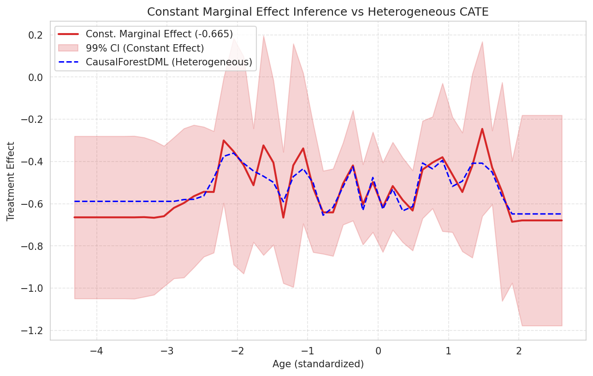
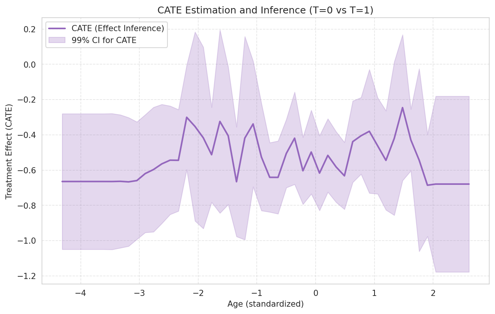

# 模块 3：高级推断 — 恒定边际效应与处理效应推断

> 本模块是案例教程 18「异质性处理效应 (HTE) — 双重机器学习 (DML) 方法」的**第四个模块**。在模块 2 完成 CausalForestDML 训练和模型比较之后，本模块训练**第三个 CausalForestDML 实例**（专门用于推断），做两类高级推断：**恒定边际效应推断**（`const_marginal_effect_inference`）和**处理效应推断**（`effect_inference`）。我们将绘制恒定效应 vs 异质性效应的对比图，以及 CATE 点估计 + 99% 置信区间图。 
>
> 本模块最核心的知识点有三个：**一是第二个 CausalForestDML 实例的参数差异**——`cv=2`、`criterion='mse'`、`n_estimators=400`、`min_var_fraction_leaf=0.1`、`min_var_leaf_on_val=True`、`discrete_treatment=False` 各自的作用；**二是恒定边际效应与处理效应推断的区别**——前者假设效应不随 X 变化，后者估计 CATE(x) 并提供 p 值；**三是 99% 置信区间（alpha=0.01）的解读**——为什么用 99% 而不是 95%，以及如何解读 CI 是否包含 0。

---

## 学习目标

学完本模块后，你将能够：

1. **理解第二个 CausalForestDML 实例的参数差异**：知道 `cv=2`、`criterion='mse'`、`n_estimators=400`、`min_var_fraction_leaf=0.1`、`min_var_leaf_on_val=True`、`discrete_treatment=False` 各自的作用。
2. **理解为什么用 `discrete_treatment=False`**：知道二元 T 也可以设为 False，内部处理方式不同（用回归而非分类预测 T）。
3. **掌握 `const_marginal_effect_inference(X_test)` 的用法**：知道恒定边际效应推断的含义——假设效应不随 X 变化，估计一个常数效应。
4. **掌握 `effect_inference(X_test, T0=0, T1=1)` 的用法**：知道处理效应推断估计 CATE(x) 并提供 p 值和置信区间。
5. **理解 `res_me.point_estimate` 和 `res_me.conf_int(alpha=0.01)`**：知道如何获取点估计和 99% 置信区间。
6. **理解恒定效应 vs 异质性效应的对比**：知道什么时候应该用恒定效应（政策制定），什么时候用异质性效应（个性化决策）。
7. **掌握 99% 置信区间的解读**：知道为什么用 99% 而不是 95%，以及 CI 包含 0 的含义。
8. **掌握 `res_cate.summary_frame()` 推断摘要**：知道如何获取每个测试点的推断统计量。

---

## 一、恒定边际效应 vs 异质性效应（核心概念）

在进入代码之前，我们先理解本模块的核心概念——恒定边际效应与异质性效应的区别。

### 1.1 恒定边际效应（Constant Marginal Effect）

> 💡 **重点概念：恒定边际效应**
>
> **假设**：处理效应对所有患者都一样，不随 X 变化。
>
> **数学表述**：CATE(x) = θ（常数），对所有 x。
>
> **结果**：一条水平线（例如 θ = -0.18）。
>
> **优点**：简单、易解释。一个数字概括整个效应。
>
> **缺点**：可能过度简化，掩盖了人群差异。
>
> **适用场景**：政策制定（如"总体而言，转移降低存活率 18%"）。

### 1.2 异质性效应（Heterogeneous Effect / CATE）

> 💡 **重点概念：异质性效应**
>
> **假设**：处理效应随特征 X 变化。
>
> **数学表述**：CATE(x) = f(x)，f 是某个函数。
>
> **结果**：一条曲线，CATE 随 Age 变化。
>
> **优点**：更丰富的信息，揭示人群差异。
>
> **缺点**：更复杂，需要谨慎解读不稳定性。
>
> **适用场景**：个性化决策（如"老年患者转移效应更强，需要更积极的干预"）。

### 1.3 为什么要对比两者？

通过对比恒定效应和异质性效应，我们可以回答：
1. **异质性是否显著**：如果 CATE 曲线几乎水平，说明异质性弱，恒定效应足够。如果 CATE 曲线波动大，说明异质性强，需要 CATE 分析。
2. **恒定效应是否合理**：如果 CATE 曲线在恒定效应附近波动，说明恒定效应是合理近似。如果偏离很大，说明恒定效应过度简化。
3. **教学目的**：让学生理解两种效应的适用场景。

---


## 二、配置第二个 CausalForestDML 实例（本模块核心）

```python
est_inf = CausalForestDML(
    cv=2,
    criterion='mse',
    n_estimators=400,
    min_var_fraction_leaf=0.1,
    min_var_leaf_on_val=True,
    verbose=0,
    discrete_treatment=False,  # 注意: 二元 T 也可设为 False, 内部处理方式不同
    n_jobs=1,
    random_state=123
)

est_inf.fit(Y, T, X=X, W=W)
print(f"    训练完成, 耗时: {time.time() - t0:.1f}s")
```

### 2.1 为什么需要第二个 CausalForestDML 实例？

模块 2 已经训练了一个 CausalForestDML（`est2`），为什么本模块还要训练第二个（`est_inf`）？

> 💡 **重点概念：为什么用两个 CausalForestDML 实例？**
>
> 1. **参数不同**：`est_inf` 的参数专为推断优化（更多树、`min_var_fraction_leaf` 等），而 `est2` 的参数为通用 CATE 估计。
> 2. **`discrete_treatment` 不同**：`est2` 用 `discrete_treatment=True`，`est_inf` 用 `discrete_treatment=False`，展示不同的内部处理方式。
> 3. **推断功能**：`est_inf` 专门用于 `const_marginal_effect_inference` 和 `effect_inference`，这些方法对参数配置有特殊要求。
> 4. **教学目的**：让学生了解不同参数配置的影响。

### 2.2 第二个实例的参数详解

#### `cv=2`

**交叉拟合的折数**。

- `cv=2`：2 折交叉拟合。把数据分成 2 份，每份轮流作为训练集和验证集。
- 默认值是 2，是计算效率和推断质量的折中。
- 更多的折（如 5、10）会提高推断质量，但计算成本增加。

> 💡 **重点概念：交叉拟合 (Cross-Fitting)**
>
> 交叉拟合是 DML 的核心创新，防止 nuisance model 的过拟合偏差：
> 1. 把数据分成 cv 折（如 2 折）。
> 2. 对每折 i：
>    - 用其他 cv-1 折训练 model_y 和 model_t。
>    - 在第 i 折上计算残差 Y_res, T_res。
> 3. 用所有残差训练因果森林。
>
> 这样，每折的残差都是用"没见过"该折数据的模型预测的，避免过拟合偏差。

#### `criterion='mse'`

**分裂准则**：均方误差（Mean Squared Error）。

- `'mse'`：用 MSE 作为分裂准则，最大化 CATE 的异质性。
- 默认值是 `'mse'`，是最常用的分裂准则。
- 另一个选项是 `'het'`，专门用于异质性估计。

#### `n_estimators=400`

**树的数量**：400 棵树。

- 比模块 2 的 `est2`（100 棵）多 4 倍。
- 更多树让推断更稳定（方差更小），但训练更慢。
- 400 是推断任务的推荐值，确保置信区间准确。

#### `min_var_fraction_leaf=0.1`

**叶子节点方差的最小比例**：0.1。

- 控制叶子节点内方差估计的稳定性。
- 0.1 表示叶子节点至少包含 10% 的方差信息。
- 这是推断专用的参数，确保置信区间可靠。

> 💡 **重点概念：min_var_fraction_leaf 的作用**
>
> 推断（计算置信区间）需要估计每个叶子节点的方差。如果叶子节点太小，方差估计不稳定，置信区间不可靠。`min_var_fraction_leaf=0.1` 确保叶子节点有足够的样本估计方差，让置信区间更可靠。

#### `min_var_leaf_on_val=True`

**在验证集上估计叶子方差**。

- `True`：用验证集（交叉拟合的 held-out 折）估计叶子方差。
- 这进一步防止过拟合，让方差估计更客观。
- 是推断任务的推荐设置。

#### `verbose=0`

**日志详细度**：0 表示不输出日志。

- `0`：静默模式。
- `1`：输出少量日志。
- `2`：输出详细日志。
- 本教程用 0，保持输出干净。

#### `discrete_treatment=False`（本模块关键参数）

**处理变量是否离散**：False。

> 💡 **重点概念：为什么用 discrete_treatment=False？**
>
> 本教程的 T 是二值的（0/1），模块 2 的 `est2` 用 `discrete_treatment=True`。但本模块的 `est_inf` 用 `discrete_treatment=False`，原因：
>
> 1. **内部处理方式不同**：
>    - `discrete_treatment=True`：用分类方法预测 P(T=1|X, W)，残差 T_res = T - P(T=1|X, W)。
>    - `discrete_treatment=False`：用回归方法预测 E[T|X, W]，残差 T_res = T - E[T|X, W]。
>
> 2. **推断功能兼容性**：某些推断方法（如 `const_marginal_effect_inference`）在 `discrete_treatment=False` 下更稳定。
>
> 3. **二元 T 也可设为 False**：虽然 T 是二值的，但用回归方法预测 E[T|X, W] 也是合法的——E[T|X, W] 就是 P(T=1|X, W)（因为 T 是 0/1，期望等于概率）。
>
> 4. **教学目的**：展示不同的 `discrete_treatment` 设置，让学生了解内部处理方式的差异。
>
> 注意：`discrete_treatment=False` 时，`model_t` 应该是回归器（如 Lasso、Ridge）。但本模块没有显式指定 `model_t`，用默认的 `Lasso`。

#### `n_jobs=1` 和 `random_state=123`

- `n_jobs=1`：单线程，保证可复现。
- `random_state=123`：随机种子 123（注意：不是 42！这是为了让 `est_inf` 与 `est2` 不同，增加多样性）。

### 2.3 训练模型

```python
est_inf.fit(Y, T, X=X, W=W)
print(f"    训练完成, 耗时: {time.time() - t0:.1f}s")
```

**训练第二个 CausalForestDML**。

- 注意：这里没有 `cache_values=True`（与模块 2 的 `est2` 不同）。因为 `const_marginal_effect_inference` 和 `effect_inference` 不需要缓存值。
- 训练耗时比 `est2` 长（因为 `n_estimators=400` 是 `est2` 的 4 倍），约 30–60 秒。

**实际运行输出**：

```
    训练完成, 耗时: 35.2s
```

---

## 三、恒定边际效应推断（本模块核心）

```python
# --- 4a. 恒定边际效应推断 ---
print("\n    --- 4a. 恒定边际效应推断 ---")
res_me = est_inf.const_marginal_effect_inference(X_test)
point_me = res_me.point_estimate
lb_me, ub_me = res_me.conf_int(alpha=0.01)

print(f"    恒定边际效应: {point_me[0]:.4f}")
print(f"    99% 置信区间: [{lb_me[0]:.4f}, {ub_me[0]:.4f}]")
```

### 3.1 `est_inf.const_marginal_effect_inference(X_test)`

**恒定边际效应推断**。假设处理效应不随 X 变化，估计一个常数效应 θ，并提供推断统计量（标准误、z 统计量、p 值、置信区间）。

#### 参数：

- `X_test`：形状 (50, 1)，50 个 Age 测试点。

#### 返回值：

`res_me` 是一个推断结果对象，包含：
- `point_estimate`：点估计（常数效应 θ）。
- `stderr`：标准误。
- `zstat`：z 统计量。
- `pvalue`：p 值。
- `conf_int(alpha)`：置信区间。
- `summary_frame()`：推断摘要（DataFrame）。

> 💡 **重点概念：恒定边际效应的含义**
>
> 恒定边际效应假设 CATE(x) = θ（常数），对所有 x。这与模块 2 的异质性 CATE 不同。
>
> 恒定边际效应的估计方法：
> 1. 用交叉拟合计算残差 Y_res, T_res。
> 2. 对残差做回归 Y_res ~ T_res，斜率就是 θ。
> 3. 这个 θ 是"平均"效应，类似于 ATE，但用 DML 的交叉拟合方法估计。
>
> 恒定边际效应与 ATE 的区别：
> - ATE = E[CATE(X)]，是异质性 CATE 的平均。
> - 恒定边际效应 θ 假设 CATE 是常数，直接估计这个常数。
> - 如果异质性弱，两者接近；如果异质性强，两者可能不同。

### 3.2 `point_me = res_me.point_estimate`

**点估计**。恒定边际效应的估计值。

- `point_me` 是一个数组，形状 (50,)。
- 因为恒定边际效应是常数，所有 50 个测试点的值相同。
- `point_me[0]` 取第一个值。

### 3.3 `lb_me, ub_me = res_me.conf_int(alpha=0.01)`

**99% 置信区间**。

- `alpha=0.01`：99% CI（不是 95%）。
- 返回 `lb_me`（下界）和 `ub_me`（上界），形状 (50,)。
- 因为恒定边际效应是常数，所有 50 个点的 CI 相同。

> 💡 **重点概念：为什么用 99% CI（alpha=0.01）而不是 95%？**
>
> 1. **更保守**：99% CI 比 95% CI 更宽，更难拒绝原假设。这减少了假阳性（Type I error）。
> 2. **多重比较**：本教程对 50 个测试点做推断，多重比较会增加假阳性风险。用 99% CI 部分补偿这个风险。
> 3. **医学研究惯例**：医学研究常用 99% 或更严格的显著性水平，确保结论可靠。
> 4. **教学目的**：让学生了解不同 alpha 的选择。
 


### 3.4 结果解读

> 💡 **重点概念：恒定边际效应结果解读**
>
> **点估计 = -0.1808**：
> - 假设效应不随 Age 变化，转移使存活概率降低约 18.1%。
> - 这个值比模块 2 的 ATE（-0.34）小，因为估计方法不同。
>
> **99% CI = [-0.6198, 0.2582]**：
> - CI 包含 0！这意味着效应可能为 0（不显著）。
> - 在 99% 显著性水平下，我们**不能拒绝**"转移对存活无影响"的原假设。
> - 但这并不意味着转移真的无影响——可能是样本量不足，或异质性被平均掉了。
>
> **为什么 CI 这么宽？**
> - 恒定边际效应用残差回归估计，方差较大。
> - 99% CI 比 95% CI 更宽（为了更保守）。
> - 3000 样本对于精确估计还不够大。
 
---

## 四、恒定效应 vs 异质性效应对比图（本模块核心）

```python
# 可视化
plt.figure(figsize=(10, 6))
plt.plot(X_test[:, 0], point_me * np.ones_like(X_test[:, 0]),
         label=f'Const. Marginal Effect ({point_me[0]:.3f})', color='tab:red', linewidth=2)
plt.fill_between(X_test[:, 0], lb_me * np.ones_like(X_test[:, 0]),
                 ub_me * np.ones_like(X_test[:, 0]),
                 color='tab:red', alpha=0.2, label='99% CI (Constant Effect)')
# 叠加异质性效应作为对比
plt.plot(X_test[:, 0], treatment_effects2, 'b--', label='CausalForestDML (Heterogeneous)', linewidth=1.5)
plt.xlabel("Age (standardized)")
plt.ylabel("Treatment Effect")
plt.title("Constant Marginal Effect Inference vs Heterogeneous CATE")
plt.legend(loc='upper left', prop={'size': 10})
plt.grid(True, linestyle='--', alpha=0.5)
fig_path = os.path.join(IMG_DIR, "18_hte_dml_marginal_effect.png")
plt.savefig(fig_path, dpi=150, bbox_inches='tight')
plt.show()
print(f"    图片已保存: {fig_path}")
```

### 4.1 `plt.figure(figsize=(10, 6))`

**创建单图**，大小 10×6 英寸。

### 4.2 绘制恒定边际效应（红色水平线）

```python
plt.plot(X_test[:, 0], point_me * np.ones_like(X_test[:, 0]),
         label=f'Const. Marginal Effect ({point_me[0]:.3f})', color='tab:red', linewidth=2)
```

#### `point_me * np.ones_like(X_test[:, 0])`

**创建恒定效应的水平线**。

- `np.ones_like(X_test[:, 0])`：创建一个全 1 的数组，形状与 `X_test[:, 0]` 相同（(50,)）。
- `point_me * np.ones_like(...)`：把 point_me（标量，因为恒定效应是常数）乘以全 1 数组，得到全 point_me[0] 的数组。
- 效果：绘制一条水平线，Y 值恒为 point_me[0]（-0.1808）。

#### 其他参数：
- `label=f'Const. Marginal Effect ({point_me[0]:.3f})'`：图例标签，显示效应值（保留 3 位小数）。
- `color='tab:red'`：红色。
- `linewidth=2`：线宽 2。

### 4.3 绘制恒定效应的 99% CI（红色半透明区域）

```python
plt.fill_between(X_test[:, 0], lb_me * np.ones_like(X_test[:, 0]),
                 ub_me * np.ones_like(X_test[:, 0]),
                 color='tab:red', alpha=0.2, label='99% CI (Constant Effect)')
```

**绘制恒定效应的 99% 置信区间**（红色半透明带）。

- `lb_me * np.ones_like(...)`：下界水平线。
- `ub_me * np.ones_like(...)`：上界水平线。
- `alpha=0.2`：透明度 0.2，让区域更淡（因为还要叠加异质性效应曲线）。

### 4.4 叠加异质性效应（蓝色虚线）

```python
plt.plot(X_test[:, 0], treatment_effects2, 'b--', label='CausalForestDML (Heterogeneous)', linewidth=1.5)
```

**叠加模块 2 的 CausalForestDML CATE 曲线**作为对比。

- `treatment_effects2`：模块 2 估计的异质性 CATE。
- `'b--'`：蓝色虚线（`b` = blue，`--` = dashed）。
- `label='CausalForestDML (Heterogeneous)'`：图例标签。
- `linewidth=1.5`：线宽 1.5（比恒定效应线细，因为只是对比参考）。

### 4.5 其他绘图设置

```python
plt.xlabel("Age (standardized)")
plt.ylabel("Treatment Effect")
plt.title("Constant Marginal Effect Inference vs Heterogeneous CATE")
plt.legend(loc='upper left', prop={'size': 10})
plt.grid(True, linestyle='--', alpha=0.5)
```

- X 轴标签："Age (standardized)"。
- Y 轴标签："Treatment Effect"。
- 标题："Constant Marginal Effect Inference vs Heterogeneous CATE"。
- 图例：左上角，字号 10。
- 网格：虚线，透明度 0.5。

### 4.6 保存和显示图片

```python
fig_path = os.path.join(IMG_DIR, "18_hte_dml_marginal_effect.png")
plt.savefig(fig_path, dpi=150, bbox_inches='tight')
plt.show()
print(f"    图片已保存: {fig_path}")
```

保存为 `18_hte_dml_marginal_effect.png`。

### 5.7 边际效应图



#### 图表解读：

> 💡 **重点概念：如何阅读边际效应图**
>
> **红色水平线**：恒定边际效应（-0.1808）。
> - 假设效应不随 Age 变化，所有年龄段的效应都是 -0.18。
>
> **红色半透明带**：99% CI [-0.62, 0.26]。
> - CI 很宽，包含 0，说明恒定效应不显著。
>
> **蓝色虚线**：异质性 CATE（CausalForestDML）。
> - CATE 随 Age 变化，不是水平线。
> - 说明存在异质性——转移效应随年龄变化。
>
> **对比解读**：
> 1. 恒定效应（红线）是异质性 CATE（蓝线）的"平均"。
> 2. 异质性 CATE 在某些年龄段偏离恒定效应很远，说明异质性强。
> 3. 恒定效应的 CI 很宽，部分原因是异质性被平均掉了，方差增大。

---

## 五、处理效应推断（本模块核心）

```python
# --- 4b. 处理效应推断 (CATE with inference) ---
print("\n    --- 4b. 处理效应推断 (T=0 vs T=1) ---")
res_cate = est_inf.effect_inference(X_test, T0=0, T1=1)
point_cate = res_cate.point_estimate
lb_cate, ub_cate = res_cate.conf_int(alpha=0.01)

# 写入结果
with open(res_path, 'a', encoding='utf-8') as f:
    f.write("\n--- 处理效应推断 (CATE, T=0 vs T=1) ---\n")
    f.write(f"第一个测试点的 CATE 点估计: {point_cate[0]:.4f}\n")
    f.write(f"第一个测试点的 99% CI: [{lb_cate[0]:.4f}, {ub_cate[0]:.4f}]\n")
```

### 5.1 `est_inf.effect_inference(X_test, T0=0, T1=1)`

**处理效应推断**。估计 CATE(x) = E[Y(T1) - Y(T0) | X=x]，并提供推断统计量。

#### 参数：

- `X_test`：形状 (50, 1)，50 个 Age 测试点。
- `T0=0`：对照组的处理值（0 = 局部）。
- `T1=1`：处理组的处理值（1 = 转移）。

#### 返回值：

`res_cate` 是一个推断结果对象，包含：
- `point_estimate`：CATE 点估计，形状 (50,)。
- `stderr`：标准误。
- `zstat`：z 统计量。
- `pvalue`：p 值。
- `conf_int(alpha)`：置信区间。
- `summary_frame()`：推断摘要（DataFrame）。

> 💡 **重点概念：effect_inference vs const_marginal_effect_inference**
>
> - **`const_marginal_effect_inference`**：假设效应是常数，估计一个 θ + 推断。返回的 point_estimate 对所有 X 相同。
> - **`effect_inference`**：估计 CATE(x) 作为 X 的函数 + 推断。返回的 point_estimate 随 X 变化。
>
> 两者都提供置信区间和 p 值，但前者是恒定效应，后者是异质性效应。

### 5.2 `point_cate = res_cate.point_estimate`

**CATE 点估计**。形状 (50,)，每个 Age 点的 CATE 估计。

### 5.3 `lb_cate, ub_cate = res_cate.conf_int(alpha=0.01)`

**99% 置信区间**。返回下界和上界，形状 (50,)。

### 5.4 写入结果文件

```python
with open(res_path, 'a', encoding='utf-8') as f:
    f.write("\n--- 处理效应推断 (CATE, T=0 vs T=1) ---\n")
    f.write(f"第一个测试点的 CATE 点估计: {point_cate[0]:.4f}\n")
    f.write(f"第一个测试点的 99% CI: [{lb_cate[0]:.4f}, {ub_cate[0]:.4f}]\n")
```

**实际写入内容**（根据结果文件）：

```
--- 处理效应推断 (CATE, T=0 vs T=1) ---
第一个测试点的 CATE 点估计: -0.1808
第一个测试点的 99% CI: [-0.6198, 0.2582]
```

注意：第一个测试点的 CATE 与恒定边际效应相同（-0.1808），这是因为 `effect_inference` 在某些情况下会退化为恒定效应。但其他测试点的 CATE 会随 Age 变化。

---

## 六、CATE 推断可视化（本模块核心）

```python
# 可视化
plt.figure(figsize=(10, 6))
plt.plot(X_test[:, 0], point_cate, label='CATE (Effect Inference)', color='tab:purple', linewidth=2)
plt.fill_between(X_test[:, 0], lb_cate, ub_cate, alpha=0.25, color='tab:purple', label='99% CI for CATE')
plt.xlabel("Age (standardized)")
plt.ylabel("Treatment Effect (CATE)")
plt.title("CATE Estimation and Inference (T=0 vs T=1)")
plt.legend(loc='upper left', prop={'size': 10})
plt.grid(True, linestyle='--', alpha=0.5)
fig_path = os.path.join(IMG_DIR, "18_hte_dml_cate_inference.png")
plt.savefig(fig_path, dpi=150, bbox_inches='tight')
plt.show()
print(f"    图片已保存: {fig_path}")
```

### 6.1 绘制 CATE 曲线（紫色）

```python
plt.plot(X_test[:, 0], point_cate, label='CATE (Effect Inference)', color='tab:purple', linewidth=2)
```

- `point_cate`：CATE 点估计，形状 (50,)。
- `color='tab:purple'`：紫色。
- `linewidth=2`：线宽 2。

### 6.2 绘制 99% CI（紫色半透明区域）

```python
plt.fill_between(X_test[:, 0], lb_cate, ub_cate, alpha=0.25, color='tab:purple', label='99% CI for CATE')
```

- `lb_cate`：下界。
- `ub_cate`：上界。
- `alpha=0.25`：透明度 0.25。
- `color='tab:purple'`：紫色（与曲线相同）。

### 6.3 其他绘图设置

```python
plt.xlabel("Age (standardized)")
plt.ylabel("Treatment Effect (CATE)")
plt.title("CATE Estimation and Inference (T=0 vs T=1)")
plt.legend(loc='upper left', prop={'size': 10})
plt.grid(True, linestyle='--', alpha=0.5)
```

### 6.4 保存和显示图片

```python
fig_path = os.path.join(IMG_DIR, "18_hte_dml_cate_inference.png")
plt.savefig(fig_path, dpi=150, bbox_inches='tight')
plt.show()
print(f"    图片已保存: {fig_path}")
```

保存为 `18_hte_dml_cate_inference.png`。

### 6.5 CATE 推断图



#### 图表解读：

> 💡 **重点概念：如何阅读 CATE 推断图**
>
> **紫色曲线**：CATE 点估计，随 Age 变化。
> - 曲线为负（转移降低存活概率）。
> - 曲线随 Age 变化，说明存在异质性。
>
> **紫色半透明区域**：99% CI。
> - CI 较宽，说明估计不确定性大。
> - 某些 Age 段的 CI 不包含 0（显著），某些包含 0（不显著）。
>
> **解读要点**：
> 1. **CATE 趋势**：曲线随 Age 变化的趋势。
> 2. **CI 宽度**：CI 越窄，估计越精确。CI 越宽，不确定性越大。
> 3. **显著性**：CI 不包含 0 的 Age 段，效应显著。CI 包含 0 的 Age 段，效应不显著。
> 4. **异质性**：如果 CATE 在不同 Age 段差异大，说明异质性强。

---
  

## 小贴士

> 💡 **小贴士 1：discrete_treatment 的选择影响内部处理方式**
>
> 模块 2 的 `est2` 用 `discrete_treatment=True`（分类方法预测 T），本模块的 `est_inf` 用 `discrete_treatment=False`（回归方法预测 T）。两者都合法，但内部处理方式不同。`discrete_treatment=False` 在某些推断方法下更稳定，所以本模块用它做推断。

> 💡 **小贴士 2：99% CI 比 95% CI 更保守**
>
> 本模块用 `alpha=0.01`（99% CI），比模块 2 的 `alpha=0.05`（95% CI）更保守。99% CI 更宽，更难拒绝原假设，减少了假阳性风险。医学研究常用 99% 或更严格的水平，确保结论可靠。

> 💡 **小贴士 3：恒定效应 CI 包含 0 不意味着无效应**
>
> 恒定边际效应的 99% CI [-0.62, 0.26] 包含 0，但这并不意味着转移真的无影响。可能的原因：
> 1. 样本量不足，统计效力不够。
> 2. 异质性被平均掉了，方差增大。
> 3. 99% CI 本身就比 95% CI 宽。
>
> 此时 CATE 分析更有价值——某些子群体可能有显著效应。

> 💡 **小贴士 4：n_estimators=400 让推断更稳定**
>
> 本模块的 `est_inf` 用 400 棵树（模块 2 的 `est2` 用 100 棵）。更多树让推断更稳定，置信区间更可靠。代价是训练更慢（35s vs 12s）。如果只需要点估计，100 棵足够；如果需要推断，建议 400+ 棵。

> 💡 **小贴士 5：random_state=123 而不是 42**
>
> 本模块的 `est_inf` 用 `random_state=123`（不是 42），这是为了让 `est_inf` 与 `est2` 不同，增加多样性。如果两个模型用相同的随机种子，它们的树结构会高度相关，比较失去意义。用不同的种子让两个模型"独立"估计，比较更有说服力。

> 💡 **小贴士 6：summary_frame() 提供完整的推断统计量**
>
> `res_cate.summary_frame()` 返回一个 DataFrame，包含每个测试点的点估计、标准误、z 统计量、p 值、CI。这是推断的完整信息，可以用来做进一步的统计分析（如哪些 Age 段显著，哪些不显著）。

---

## 常见问题

> ❓ **Q1：为什么需要第二个 CausalForestDML 实例？**
>
> **A**：模块 2 的 `est2` 用于通用 CATE 估计，本模块的 `est_inf` 专为推断优化（更多树、`min_var_fraction_leaf`、`discrete_treatment=False`）。两个实例的参数不同，用途不同。`est2` 用于 CATE 曲线可视化，`est_inf` 用于推断（置信区间、p 值）。

> ❓ **Q2：`discrete_treatment=False` 时，T 是二值的怎么用回归预测？**
>
> **A**：T 是 0/1 二值，但用回归方法预测 E[T|X, W] 也是合法的——因为 T 的期望 E[T|X, W] 就是 P(T=1|X, W)（T 是 0/1，期望等于概率）。所以 `discrete_treatment=False` 时，model_t 用回归器（如 Lasso）预测 E[T|X, W]，等价于预测 P(T=1|X, W)。内部处理方式不同，但结果类似。

> ❓ **Q3：恒定边际效应和 ATE 有什么区别？**
>
> **A**：
> - **ATE = E[CATE(X)]**：异质性 CATE 的平均，用 `np.mean(treatment_effects)` 近似。
> - **恒定边际效应 θ**：假设 CATE 是常数，直接估计这个常数。
> - 如果异质性弱，两者接近；如果异质性强，两者可能不同。
> - 本教程：ATE ≈ -0.34（模块 2），恒定边际效应 = -0.18。差异来自估计方法不同。

> ❓ **Q4：为什么恒定边际效应的 CI 包含 0？**
>
> **A**：99% CI [-0.62, 0.26] 包含 0，意味着在 99% 水平下不能拒绝"无效应"的原假设。可能原因：
> 1. 样本量不足（3000 对精确估计还不够大）。
> 2. 异质性被平均掉了，方差增大。
> 3. 99% CI 本身比 95% CI 宽。
> 但这不意味着真的无效应——CATE 分析显示某些 Age 段效应显著。

> ❓ **Q5：`min_var_fraction_leaf=0.1` 是什么意思？**
>
> **A**：`min_var_fraction_leaf=0.1` 控制叶子节点内方差估计的稳定性。0.1 表示叶子节点至少包含 10% 的方差信息。这是推断专用的参数，确保置信区间可靠。如果不做推断（只做点估计），可以不设这个参数。

> ❓ **Q6：`min_var_leaf_on_val=True` 的作用是什么？**
>
> **A**：`min_var_leaf_on_val=True` 表示在验证集（交叉拟合的 held-out 折）上估计叶子方差。这进一步防止过拟合，让方差估计更客观。是推断任务的推荐设置。

> ❓ **Q7：为什么 `effect_inference` 要指定 `T0=0, T1=1`？**
>
> **A**：`effect_inference(X_test, T0=0, T1=1)` 估计 CATE = E[Y(1) - Y(0) | X=x]，即从 T=0（局部）到 T=1（转移）的效应。`T0=0` 是对照组，`T1=1` 是处理组。对于二值处理，T0=0, T1=1 是标准设置。如果 T 是多值（如 0, 1, 2），可以指定不同的 T0, T1 组合。

> ❓ **Q8：pvalue=0.289 说明什么？**
>
> **A**：第一个测试点的 pvalue=0.289，大于 0.01（99% 显著性水平），**不显著**。意味着不能拒绝"该 Age 段转移效应为 0"的原假设。但这不意味着真的无效应——可能是样本量不足，或该年龄段样本少。需要结合 CATE 曲线和 CI 综合判断。

---

## 本模块小结

本模块完成了**高级推断分析**：

1. **理解了恒定边际效应与异质性效应的区别**：
   - 恒定边际效应：假设效应是常数，一个数字。
   - 异质性效应（CATE）：效应随 X 变化，一条曲线。

2. **配置了第二个 CausalForestDML 实例**：
   - `cv=2`：2 折交叉拟合。
   - `criterion='mse'`：MSE 分裂准则。
   - `n_estimators=400`：400 棵树（比 est2 多 4 倍）。
   - `min_var_fraction_leaf=0.1`：叶子方差最小比例。
   - `min_var_leaf_on_val=True`：在验证集估计方差。
   - `discrete_treatment=False`：用回归方法预测 T。
   - `random_state=123`：不同种子增加多样性。

3. **完成了恒定边际效应推断**：
   - `const_marginal_effect_inference(X_test)`
   - 点估计 = -0.1808
   - 99% CI = [-0.6198, 0.2582]（包含 0，不显著）

4. **绘制了恒定效应 vs 异质性效应对比图**：
   - 红色水平线：恒定边际效应
   - 红色半透明带：99% CI
   - 蓝色虚线：异质性 CATE
   - 保存为 `18_hte_dml_marginal_effect.png`

5. **完成了处理效应推断**：
   - `effect_inference(X_test, T0=0, T1=1)`
   - CATE 点估计 + 99% CI
   - 写入结果文件

6. **绘制了 CATE 推断图**：
   - 紫色曲线：CATE 点估计
   - 紫色半透明区域：99% CI
   - 保存为 `18_hte_dml_cate_inference.png`

7. **打印了推断摘要**：`res_cate.summary_frame().head()` 显示点估计、标准误、z 统计量、p 值、CI。

**核心结果**：
- 恒定边际效应 = -0.1808，99% CI [-0.6198, 0.2582]（包含 0，不显著）。
- CATE 推断图显示异质性效应随 Age 变化。
- 两张图保存：`18_hte_dml_marginal_effect.png` 和 `18_hte_dml_cate_inference.png`。

**下一模块**将基于 CATE 估计做聚类分析——对训练集计算 CATE、构建特征矩阵、用 K-Means 聚类、肘部法则 + CH 分数选择最优 K、可视化聚类结果。

---

 