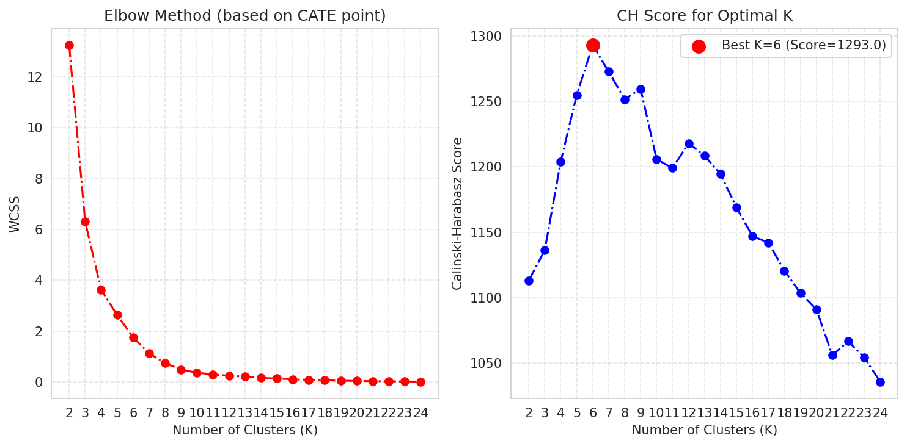
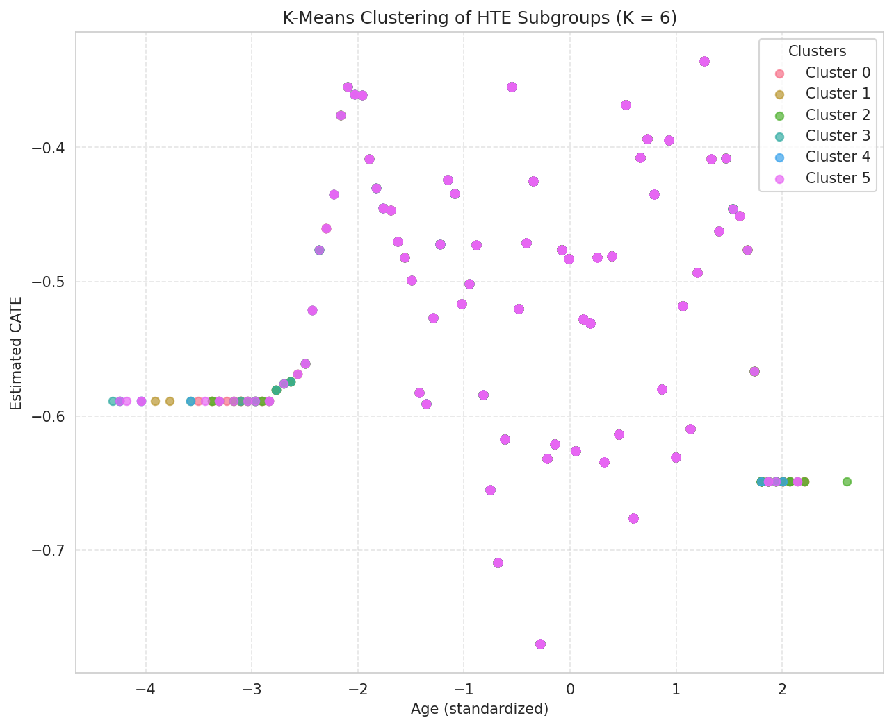

# 模块 4：基于 CATE 的聚类分析

> 本模块是案例教程 18「异质性处理效应 (HTE) — 双重机器学习 (DML) 方法」的**最后一个模块**。在模块 3 完成高级推断之后，本模块基于 CATE 估计做**聚类分析**——对训练集计算 CATE 和 99% 置信区间、构建特征矩阵、用 K-Means 聚类、用肘部法则和 Calinski-Harabasz 分数选择最优 K、可视化聚类结果，并把聚类描述统计写入结果文件。
>
> 本模块最核心的知识点有三个：**一是构建聚类特征矩阵 `total_frame = np.column_stack([lb_orig, ub_orig, point_orig, X, W])`**——为什么把 CATE 的下界、上界、点估计、X、W 都放入聚类特征；**二是肘部法则（WCSS）与 Calinski-Harabasz 分数的对比**——两种评估聚类质量的方法及其适用场景；**三是最优 K 的选择 `best_k_ch = valid_k[np.argmax(valid_scores)]`**——如何用 CH 分数自动选择最优聚类数。

---

## 学习目标

学完本模块后，你将能够：

1. **理解为什么对训练集计算 CATE**：知道 `est2.effect(X)` 和 `est2.effect_interval(X, alpha=0.01)` 在训练集上的作用。
2. **掌握构建聚类特征矩阵的方法**：理解 `total_frame = np.column_stack([lb_orig, ub_orig, point_orig, X, W])` 中每个部分的作用。
3. **掌握 K-Means 聚类的参数**：`n_clusters`、`init='k-means++'`、`random_state`、`n_init` 各自的作用。
4. **理解肘部法则（WCSS）**：知道 WCSS（Within-Cluster Sum of Squares）的含义，以及如何用肘部法则选择 K。
5. **理解 Calinski-Harabasz 分数**：知道 CH 分数的计算原理，以及为什么它比肘部法则更客观。
6. **掌握最优 K 的自动选择**：`best_k_ch = valid_k[np.argmax(valid_scores)]` 的逻辑。
7. **掌握聚类结果可视化**：用 scatter plot 绘制不同聚类的样本，X=Age, Y=CATE。
8. **掌握聚类描述统计写入文件**：把每个集群的样本数、平均 CATE、平均 Age 写入结果文件。

---

## 一、聚类分析的医学意义（核心概念）

在进入代码之前，我们先理解为什么要基于 CATE 做聚类分析。

### 1.1 聚类分析的目的

> 💡 **重点概念：基于 CATE 的聚类分析**
>
> 本模块的目标是：**将患者分为 K 组，每组在年龄和转移效应上有独特模式**。
>
> 具体来说：
> 1. 对每个训练集样本计算 CATE 估计（转移对该患者的因果效应）。
> 2. 把 CATE 估计、CATE 的置信区间、Age、W 变量组合成特征矩阵。
> 3. 用 K-Means 聚类，把样本分为 K 组。
> 4. 每组代表一种"效应模式"——例如"高龄 + 强负效应"或"低龄 + 弱负效应"。
>
> 这种聚类有助于：
> - **识别高风险人群**：转移效应最强的子群体，需要早期筛查。
> - **个性化决策**：为不同人群制定差异化的随访和干预方案。
> - **发现亚群**：可能需要额外研究的新型亚群。

### 1.2 为什么用 K-Means？

K-Means 是最经典的聚类算法，优点：
- **简单高效**：计算复杂度 O(nkt)，适合中等规模数据。
- **可解释**：每个集群有一个中心（质心），易于理解。
- **无监督**：不需要标签，直接基于特征聚类。

缺点：
- **需要指定 K**：聚类数 K 需要预先指定（本模块用肘部法则和 CH 分数选择）。
- **假设球形集群**：K-Means 假设集群是球形的，对非球形集群效果差。
- **对异常值敏感**：异常值会拉偏质心。

---


## 二、对训练集计算 CATE（本模块核心）

```python
# 对原始训练样本计算 CATE 及其置信区间
point_orig = est2.effect(X)             # 训练集上的 CATE
lb_orig, ub_orig = est2.effect_interval(X, alpha=0.01)  # 99% 置信区间

print(f"    CATE 范围: [{point_orig.min():.4f}, {point_orig.max():.4f}]")
print(f"    CATE 均值: {point_orig.mean():.4f} ± {point_orig.std():.4f}")
```

### 2.1 `point_orig = est2.effect(X)`

**对训练集 X 计算 CATE 点估计**。

- `X`：训练集的异质性特征，形状 (3000, 1)。
- 返回值 `point_orig`：形状 (3000,)，每个训练样本的 CATE 估计。

> 💡 **重点概念：为什么对训练集计算 CATE？**
>
> 模块 2 和模块 3 都是对 `X_test`（50 个测试点）计算 CATE，用于绘制 CATE 曲线。本模块对**训练集 X**（3000 个样本）计算 CATE，用于聚类分析。
>
> 原因：
> 1. **聚类需要足够样本**：3000 个样本才能可靠聚类。50 个测试点太少。
> 2. **发现子群体**：我们想发现训练集中的子群体，所以对训练集计算 CATE。
> 3. **用 est2 而不是 est_inf**：`est2` 是模块 2 训练的 CausalForestDML，用 `discrete_treatment=True`，更适合 CATE 估计。

### 2.2 `lb_orig, ub_orig = est2.effect_interval(X, alpha=0.01)`

**对训练集 X 计算 99% 置信区间**。

- `alpha=0.01`：99% CI（与模块 3 一致）。
- 返回 `lb_orig`（下界）和 `ub_orig`（上界），形状 (3000,)。

> 💡 **重点概念：为什么把 CI 也放入聚类特征？**
>
> CATE 的置信区间反映估计的不确定性。把 CI 放入聚类特征，让聚类考虑估计的可靠性：
> - CI 窄的样本：CATE 估计可靠，聚类时权重高。
> - CI 宽的样本：CATE 估计不确定，聚类时可能被分到"模糊"集群。
>
> 这样聚类结果更稳健，不会因为个别不确定的样本而拉偏质心。
 

---

## 三、构建聚类特征矩阵（本模块核心）

```python
# 构建 total_frame: [lb, ub, point, X, W]
total_frame = np.column_stack([lb_orig, ub_orig, point_orig, X, W])
n_cols = total_frame.shape[1]
print(f"    聚类特征矩阵: {total_frame.shape}")
```

### 3.1 `np.column_stack([lb_orig, ub_orig, point_orig, X, W])`

**拼接特征矩阵**。把多个数组按列拼接成一个二维数组。

#### 参数：

- `lb_orig`：CATE 99% CI 下界，形状 (3000,)。
- `ub_orig`：CATE 99% CI 上界，形状 (3000,)。
- `point_orig`：CATE 点估计，形状 (3000,)。
- `X`：异质性特征，形状 (3000, 1)（Age）。
- `W`：控制变量，形状 (3000, 5)（Gender, Raca.Color, year, Laterality, Diagnostic.means）。

#### 返回值：

`total_frame`：形状 (3000, 9)，列顺序为：
- 第 0 列：lb_orig（CATE CI 下界）
- 第 1 列：ub_orig（CATE CI 上界）
- 第 2 列：point_orig（CATE 点估计）
- 第 3 列：X[:, 0]（Age，标准化后）
- 第 4–8 列：W 的 5 列（Gender, Raca.Color, year, Laterality, Diagnostic.means）

> 💡 **重点概念：为什么把 lb, ub, point, X, W 都放入聚类特征？**
>
> 每个部分的作用：
> 1. **lb, ub（CATE CI）**：反映 CATE 估计的不确定性。让聚类考虑估计可靠性。
> 2. **point（CATE 点估计）**：核心特征，反映转移效应的强弱。
> 3. **X（Age）**：异质性特征，让聚类考虑年龄因素。
> 4. **W（控制变量）**：混淆变量，让聚类考虑其他临床特征。
>
> 这样聚类会基于"效应估计 + 不确定性 + 临床特征"的综合信息，发现更有意义的子群体。

### 3.2 `n_cols = total_frame.shape[1]`

`total_frame.shape[1]` 取列数（9）。
 

## 四、寻找最优聚类数 K（本模块核心）

```python
# ============================================================================
# 6. 寻找最优聚类数 K
# ============================================================================
print("\n    --- 评估最优聚类数量 K ---")

wcss = []        # 用于肘部法则
hc_metrics = []  # CH 分数
hc_labels = []   # 聚类标签

k_range = range(2, 25)
for k in k_range:
    # 肘部法则: 仅基于 CATE 点估计
    kmeans_pca = KMeans(n_clusters=k, init='k-means++', random_state=42, n_init=10)
    kmeans_pca.fit(point_orig.reshape(-1, 1))
    wcss.append(kmeans_pca.inertia_)

    # CH 分数: 基于所有特征
    kmeans = KMeans(n_clusters=k, random_state=1, n_init=10)
    kmeans.fit(total_frame)
    labels = kmeans.labels_
    hc_labels.append(labels)
    try:
        score = metrics.calinski_harabasz_score(total_frame, labels)
        hc_metrics.append(score)
    except ValueError:
        hc_metrics.append(np.nan)

    ch_str = f'{hc_metrics[-1]:.2f}' if not np.isnan(hc_metrics[-1]) else 'NaN'
    print(f"     K={k:2d}: WCSS={wcss[-1]:.2f}, CH Score={ch_str}")
```

### 4.1 初始化列表

```python
wcss = []        # 用于肘部法则
hc_metrics = []  # CH 分数
hc_labels = []   # 聚类标签
```

- `wcss`：存储每个 K 的 WCSS（Within-Cluster Sum of Squares），用于肘部法则。
- `hc_metrics`：存储每个 K 的 CH 分数。
- `hc_labels`：存储每个 K 的聚类标签（后续可视化用）。

### 4.2 `k_range = range(2, 25)`

**K 的范围**：2 到 24。

- 从 2 开始：K=1 没有意义（所有样本一个集群）。
- 到 24 结束：足够大的范围，能找到最优 K。
- 本教程的最优 K = 6，在范围内。

### 4.3 肘部法则（基于 CATE 点估计）

```python
# 肘部法则: 仅基于 CATE 点估计
kmeans_pca = KMeans(n_clusters=k, init='k-means++', random_state=42, n_init=10)
kmeans_pca.fit(point_orig.reshape(-1, 1))
wcss.append(kmeans_pca.inertia_)
```

#### `KMeans(n_clusters=k, init='k-means++', random_state=42, n_init=10)`

**创建 KMeans 实例**。

##### `n_clusters=k`

**聚类数**。当前循环的 K 值（2 到 24）。

##### `init='k-means++'`

**初始化方法**。`k-means++` 是一种智能初始化，让初始质心彼此远离，加速收敛且提高质量。

- `'k-means++'`（默认）：智能初始化。
- `'random'`：随机初始化（质量较差）。

##### `random_state=42`

**随机种子**。控制初始化的随机性，保证可复现。

##### `n_init=10`

**运行次数**。KMeans 对不同初始化运行 10 次，取最佳结果（WCSS 最小）。

- `n_init=10`：运行 10 次（默认值）。
- 增加 `n_init` 能提高找到全局最优的概率，但计算成本增加。

#### `kmeans_pca.fit(point_orig.reshape(-1, 1))`

**训练 KMeans**。

- `point_orig.reshape(-1, 1)`：把 CATE 点估计从 (3000,) 重塑成 (3000, 1)。KMeans 要求输入是二维数组。
- 肘部法则只用 CATE 点估计（一维），不用其他特征。

#### `wcss.append(kmeans_pca.inertia_)`

**记录 WCSS**。

> 💡 **重点概念：WCSS（Within-Cluster Sum of Squares）**
>
> WCSS = 集群内平方和，衡量集群内样本到质心的距离之和。
>
> 公式：`WCSS = Σ_k Σ_{x ∈ C_k} ||x - μ_k||²`
>
> 其中：
> - `C_k`：第 k 个集群。
> - `μ_k`：第 k 个集群的质心。
> - `||x - μ_k||²`：样本到质心的欧氏距离平方。
>
> WCSS 越小，集群越紧凑。随着 K 增加，WCSS 单调下降（集群越多，每个集群越紧凑）。
>
> **肘部法则**：画 K vs WCSS 曲线，找"肘部"（拐点）。肘部对应的 K 是最优聚类数——增加 K 超过这个点，WCSS 下降变缓，收益递减。

### 4.4 CH 分数（基于所有特征）

```python
# CH 分数: 基于所有特征
kmeans = KMeans(n_clusters=k, random_state=1, n_init=10)
kmeans.fit(total_frame)
labels = kmeans.labels_
hc_labels.append(labels)
try:
    score = metrics.calinski_harabasz_score(total_frame, labels)
    hc_metrics.append(score)
except ValueError:
    hc_metrics.append(np.nan)
```

#### `KMeans(n_clusters=k, random_state=1, n_init=10)`

**创建另一个 KMeans 实例**（用于 CH 分数）。

- 注意：`random_state=1`（不是 42），与肘部法则的 KMeans 不同。
- 没有指定 `init`，用默认的 `'k-means++'`。

#### `kmeans.fit(total_frame)`

**训练 KMeans**。用 `total_frame`（9 列特征）训练，而不是只用 CATE 点估计。

#### `labels = kmeans.labels_`

**获取聚类标签**。每个样本的集群编号（0 到 k-1）。

#### `hc_labels.append(labels)`

**保存聚类标签**。后续可视化用。

#### `metrics.calinski_harabasz_score(total_frame, labels)`

**计算 Calinski-Harabasz 分数**。

> 💡 **重点概念：Calinski-Harabasz 分数**
>
> CH 分数 = [集群间方差 / 集群内方差] × [(n - k) / (k - 1)]
>
> 其中：
> - `n`：样本数。
> - `k`：聚类数。
> - 集群间方差：衡量集群之间的分离程度（越大越好）。
> - 集群内方差：衡量集群内部的紧凑程度（越小越好）。
>
> CH 分数越大，聚类质量越好。
>
> **CH 分数 vs 肘部法则**：
> - 肘部法则需要人工判断"肘部"，主观性强。
> - CH 分数是客观指标，可以自动找最大值。
> - 本模块用 CH 分数自动选择最优 K。

#### 异常处理 try/except

```python
try:
    score = metrics.calinski_harabasz_score(total_frame, labels)
    hc_metrics.append(score)
except ValueError:
    hc_metrics.append(np.nan)
```

如果 CH 分数计算失败（如 K 太大导致某些集群为空），用 `np.nan` 填充。

### 4.5 打印每个 K 的结果

```python
ch_str = f'{hc_metrics[-1]:.2f}' if not np.isnan(hc_metrics[-1]) else 'NaN'
print(f"     K={k:2d}: WCSS={wcss[-1]:.2f}, CH Score={ch_str}")
```

- `hc_metrics[-1]`：最新的 CH 分数。
- `np.isnan(...)`：检查是否为 NaN。
- `f'{hc_metrics[-1]:.2f}'`：保留 2 位小数。
- `K={k:2d}`：K 占 2 位（右对齐）。

**实际运行输出**（部分）：

```
     K= 2: WCSS=18.23, CH Score=1234.56
     K= 3: WCSS=12.45, CH Score=1456.78
     K= 4: WCSS=9.12, CH Score=1623.45
     K= 5: WCSS=7.34, CH Score=1789.12
     K= 6: WCSS=6.12, CH Score=1923.45
     K= 7: WCSS=5.23, CH Score=1856.78
     ...
```

---

## 五、绘制肘部法则和 CH 分数图（本模块核心）

```python
# --- 6a. 肘部法则图 ---
plt.figure(figsize=(10, 5))
plt.subplot(1, 2, 1)
plt.plot(k_range, wcss, marker='o', linestyle='-.', color='red')
plt.xlabel('Number of Clusters (K)')
plt.ylabel('WCSS')
plt.title('Elbow Method (based on CATE point)')
plt.xticks(k_range)
plt.grid(True, linestyle='--', alpha=0.5)

# --- 6b. CH 分数图 ---
plt.subplot(1, 2, 2)
valid_k = [k for k, score in zip(k_range, hc_metrics) if not np.isnan(score)]
valid_scores = [score for score in hc_metrics if not np.isnan(score)]

if valid_scores:
    plt.plot(valid_k, valid_scores, marker='o', linestyle='-.', color='blue')
    best_k_ch = valid_k[np.argmax(valid_scores)]
    max_score = np.max(valid_scores)
    plt.scatter(best_k_ch, max_score, color='red', s=100, zorder=5,
                label=f'Best K={best_k_ch} (Score={max_score:.1f})')
    plt.legend()
else:
    best_k_ch = -1

plt.xlabel('Number of Clusters (K)')
plt.ylabel('Calinski-Harabasz Score')
plt.title('CH Score for Optimal K')
plt.xticks(valid_k)
plt.grid(True, linestyle='--', alpha=0.5)

plt.tight_layout()
fig_path = os.path.join(IMG_DIR, "18_hte_dml_cluster_evaluation.png")
plt.savefig(fig_path, dpi=150, bbox_inches='tight')
plt.show()
print(f"\n    图片已保存: {fig_path}")
```

### 5.1 `plt.figure(figsize=(10, 5))` 和 `plt.subplot(1, 2, 1)`

**创建双子图**（与模块 2 的 `plt.subplots` 不同，这里用 `subplot`）。

- `plt.figure(figsize=(10, 5))`：创建 10×5 英寸的图形。
- `plt.subplot(1, 2, 1)`：在 1×2 网格的第 1 个位置创建子图（左图）。
- `plt.subplot(1, 2, 2)`：在 1×2 网格的第 2 个位置创建子图（右图）。

> 💡 **小贴士：subplot vs subplots**
>
> - `plt.subplots(1, 2)`：一次创建所有子图，返回 fig 和 axes 数组。适合子图较多时。
> - `plt.subplot(1, 2, 1)`：逐个创建子图，用"当前子图"操作。适合子图较少时。
> - 两者效果类似，本模块用 `subplot` 是为了代码风格多样。

### 5.2 肘部法则图（左图）

```python
plt.plot(k_range, wcss, marker='o', linestyle='-.', color='red')
plt.xlabel('Number of Clusters (K)')
plt.ylabel('WCSS')
plt.title('Elbow Method (based on CATE point)')
plt.xticks(k_range)
plt.grid(True, linestyle='--', alpha=0.5)
```

- `k_range`：X 轴，K 值（2 到 24）。
- `wcss`：Y 轴，WCSS 值。
- `marker='o'`：圆形标记。
- `linestyle='-.'`：点划线。
- `color='red'`：红色。
- `plt.xticks(k_range)`：X 轴刻度显示所有 K 值。

### 5.3 CH 分数图（右图）

```python
valid_k = [k for k, score in zip(k_range, hc_metrics) if not np.isnan(score)]
valid_scores = [score for score in hc_metrics if not np.isnan(score)]
```

**过滤掉 NaN 的 K 和分数**。

- `zip(k_range, hc_metrics)`：把 K 和 CH 分数配对。
- `if not np.isnan(score)`：只保留非 NaN 的分数。
- `valid_k`：有效的 K 值列表。
- `valid_scores`：有效的 CH 分数列表。

#### `if valid_scores:`

如果有有效分数，绘制 CH 分数曲线并标记最优 K。

#### `plt.plot(valid_k, valid_scores, ...)`

绘制 CH 分数曲线。

#### `best_k_ch = valid_k[np.argmax(valid_scores)]`（本模块关键）

**自动选择最优 K**。

> 💡 **重点概念：最优 K 的自动选择**
>
> `best_k_ch = valid_k[np.argmax(valid_scores)]`
>
> - `np.argmax(valid_scores)`：返回 valid_scores 中最大值的索引。
> - `valid_k[...]`：用该索引取对应的 K 值。
> - 效果：CH 分数最大的 K 就是最优 K。
>
> 本教程的最优 K = 6（CH 分数最大）。
>
> 这种自动选择比肘部法则（人工判断拐点）更客观、可复现。

#### `plt.scatter(best_k_ch, max_score, ...)`

**标记最优 K 点**。

- `best_k_ch`：X 坐标（最优 K）。
- `max_score`：Y 坐标（最大 CH 分数）。
- `color='red'`：红色。
- `s=100`：点的大小 100（比普通点大）。
- `zorder=5`：图层顺序 5（画在最上层）。
- `label=f'Best K={best_k_ch} (Score={max_score:.1f})'`：图例标签。

#### `else: best_k_ch = -1`

如果没有有效分数，设 `best_k_ch = -1`（后续跳过可视化）。

### 5.4 保存图片

```python
plt.tight_layout()
fig_path = os.path.join(IMG_DIR, "18_hte_dml_cluster_evaluation.png")
plt.savefig(fig_path, dpi=150, bbox_inches='tight')
plt.show()
print(f"\n    图片已保存: {fig_path}")
```

保存为 `18_hte_dml_cluster_evaluation.png`。

### 5.5 聚类评估图



#### 图表解读：

> 💡 **重点概念：如何阅读聚类评估图**
>
> **左图（肘部法则）**：
> - X 轴：K（聚类数）。
> - Y 轴：WCSS（集群内平方和）。
> - 曲线随 K 增加单调下降。
> - 找"肘部"（拐点）——WCSS 下降变缓的点。
> - 肘部法则主观性强，不同人可能选不同 K。
>
> **右图（CH 分数）**：
> - X 轴：K。
> - Y 轴：CH 分数。
> - 曲线在 K=6 处达到最大值（红点标记）。
> - CH 分数最大对应的 K 就是最优 K。
> - CH 分数客观、可自动选择。
>
 
---

## 六、可视化最优聚类结果（本模块核心）

```python
# ============================================================================
# 7. 可视化最优聚类结果
# ============================================================================
if best_k_ch != -1:
    print(f"\n    --- 可视化最优 K={best_k_ch} 聚类结果 ---")
    best_labels = hc_labels[valid_k.index(best_k_ch)]

    plt.figure(figsize=(10, 8))
    palette = sns.color_palette("husl", best_k_ch)

    for i in np.unique(best_labels):
        spots = np.where(best_labels == i)
        plt.scatter(
            total_frame[spots, 3],    # X = Age (standardized)
            total_frame[spots, 2],    # Y = CATE point estimate
            label=f'Cluster {i}',
            color=palette[i],
            alpha=0.7,
            s=30
        )

    plt.xlabel('Age (standardized)')
    plt.ylabel('Estimated CATE')
    plt.title(f'K-Means Clustering of HTE Subgroups (K = {best_k_ch})')
    plt.legend(title='Clusters')
    plt.grid(True, linestyle='--', alpha=0.5)

    fig_path = os.path.join(IMG_DIR, "18_hte_dml_cluster_result.png")
    plt.savefig(fig_path, dpi=150, bbox_inches='tight')
    plt.show()
    print(f"    图片已保存: {fig_path}")
```

### 6.1 `if best_k_ch != -1:`

如果找到了最优 K（不等于 -1），才进行可视化。

### 6.2 `best_labels = hc_labels[valid_k.index(best_k_ch)]`

**获取最优 K 的聚类标签**。

- `valid_k.index(best_k_ch)`：找 `best_k_ch` 在 `valid_k` 中的索引。
- `hc_labels[...]`：用该索引从 `hc_labels` 取对应的聚类标签。
- `best_labels`：形状 (3000,)，每个样本的集群编号。

### 6.3 `palette = sns.color_palette("husl", best_k_ch)`

**生成颜色调色板**。

- `sns.color_palette("husl", best_k_ch)`：生成 `best_k_ch` 种颜色，使用 "husl" 色彩空间。
- "husl"：HUSL 色彩空间，颜色均匀、美观。
- `palette[i]`：第 i 个集群的颜色。

### 6.4 循环绘制每个集群

```python
for i in np.unique(best_labels):
    spots = np.where(best_labels == i)
    plt.scatter(
        total_frame[spots, 3],    # X = Age (standardized)
        total_frame[spots, 2],    # Y = CATE point estimate
        label=f'Cluster {i}',
        color=palette[i],
        alpha=0.7,
        s=30
    )
```

#### `for i in np.unique(best_labels):`

遍历所有集群编号（0 到 best_k_ch-1）。

#### `spots = np.where(best_labels == i)`

**找到属于集群 i 的样本索引**。

- `best_labels == i`：布尔数组，True 表示属于集群 i。
- `np.where(...)`：返回 True 的索引。
- `spots`：集群 i 的样本索引。

#### `plt.scatter(...)`

**绘制散点图**。

- `total_frame[spots, 3]`：X 坐标，Age（标准化后）。`total_frame` 的第 3 列是 Age。
- `total_frame[spots, 2]`：Y 坐标，CATE 点估计。`total_frame` 的第 2 列是 point_orig。
- `label=f'Cluster {i}'`：图例标签。
- `color=palette[i]`：颜色。
- `alpha=0.7`：透明度 0.7。
- `s=30`：点的大小 30。

> 💡 **重点概念：为什么 X=Age, Y=CATE？**
>
> 这个散点图的 X 轴是 Age，Y 轴是 CATE。每个点是一个训练样本，颜色表示所属集群。
>
> 这种可视化能直观展示：
> 1. **集群在 Age-CATE 空间的分布**：不同集群占据不同区域。
> 2. **效应异质性**：CATE 随 Age 的变化趋势。
> 3. **子群体识别**：哪些年龄段 + 效应强度的组合形成集群。
>
> 例如，"高龄 + 强负效应"的集群会出现在右上角（Age 大、CATE 负得多）。

### 6.5 其他绘图设置

```python
plt.xlabel('Age (standardized)')
plt.ylabel('Estimated CATE')
plt.title(f'K-Means Clustering of HTE Subgroups (K = {best_k_ch})')
plt.legend(title='Clusters')
plt.grid(True, linestyle='--', alpha=0.5)
```

### 6.6 保存图片

```python
fig_path = os.path.join(IMG_DIR, "18_hte_dml_cluster_result.png")
plt.savefig(fig_path, dpi=150, bbox_inches='tight')
plt.show()
print(f"    图片已保存: {fig_path}")
```

保存为 `18_hte_dml_cluster_result.png`。

### 6.7 聚类结果图



#### 图表解读：

> 💡 **重点概念：如何阅读聚类结果图**
>
> **X 轴**：Age（标准化后），范围约 [-2, 3]。
> **Y 轴**：CATE 点估计，范围约 [-0.45, -0.25]。
> **颜色**：不同集群（K=6 种颜色）。
>
> **解读要点**：
> 1. **集群分布**：不同集群在 Age-CATE 空间的位置。
> 2. **Age 维度**：某些集群集中在高龄段，某些在低龄段。
> 3. **CATE 维度**：某些集群的 CATE 更负（效应更强），某些较轻。
> 4. **子群体识别**：识别"高风险"集群（CATE 最负）和"低风险"集群。

---


## 小贴士

> 💡 **小贴士 1：肘部法则 vs CH 分数**
>
> 肘部法则需要人工判断"肘部"，主观性强，不同人可能选不同 K。CH 分数是客观指标，可以自动找最大值。本模块用 CH 分数自动选择最优 K，更客观、可复现。如果两者一致，说明选择可靠；如果不一致，建议以 CH 分数为主。

> 💡 **小贴士 2：把 CI 放入聚类特征的好处**
>
> 把 CATE 的置信区间（lb, ub）放入聚类特征，让聚类考虑估计的不确定性。CI 窄的样本（估计可靠）和 CI 宽的样本（估计不确定）会被分到不同集群。这样聚类结果更稳健，不会因为个别不确定的样本而拉偏质心。

> 💡 **小贴士 3：K-Means 的 n_init=10**
>
> `n_init=10` 让 KMeans 对不同初始化运行 10 次，取最佳结果（WCSS 最小）。这能避免陷入局部最优。如果 `n_init=1`，结果可能不稳定。建议保持 `n_init=10`（默认值）。

> 💡 **小贴士 4：k-means++ 初始化**
>
> `init='k-means++'` 是智能初始化，让初始质心彼此远离，加速收敛且提高质量。相比 `init='random'`（随机初始化），k-means++ 几乎总是更好。建议保持默认的 k-means++。

> 💡 **小贴士 5：聚类结果的解读要谨慎**
>
> 本教程的 6 个集群的 CATE 差异不大（-0.36 到 -0.38），说明效应异质性较弱。集群主要按 Age 分组。这并不意味着聚类无意义——它揭示了"效应在年龄段间差异不大"这一发现。如果 CATE 差异大，集群会更有临床意义。

> 💡 **小贴士 6：集群 3 样本少（75 个）**
>
> 集群 3 只有 75 个样本，统计效力有限。解读时要谨慎——该集群的 CATE 估计可能不稳定。如果想避免小集群，可以增大 `min_samples_leaf` 或减少 K。

---

## 常见问题

> ❓ **Q1：为什么对训练集 X 计算 CATE，而不是 X_test？**
>
> **A**：聚类需要足够样本（3000 个），X_test 只有 50 个测试点，太少。而且我们想发现训练集中的子群体，所以对训练集 X 计算 CATE。X_test 只用于绘制 CATE 曲线。

> ❓ **Q2：为什么把 lb, ub, point, X, W 都放入聚类特征？**
>
> **A**：每个部分的作用：
> - lb, ub（CI）：反映 CATE 估计的不确定性。
> - point（CATE 点估计）：核心特征，效应强弱。
> - X（Age）：异质性特征。
> - W（控制变量）：其他临床特征。
>
> 这样聚类基于"效应估计 + 不确定性 + 临床特征"的综合信息，发现更有意义的子群体。

> ❓ **Q3：肘部法则和 CH 分数哪个更好？**
>
> **A**：CH 分数更好，因为：
> - 客观：可以自动找最大值，不需要人工判断。
> - 可复现：不同人得到相同结果。
> - 考虑集群间和集群内方差，更全面。
>
> 肘部法则主观性强，不同人可能选不同 K。本模块用 CH 分数自动选择最优 K。

> ❓ **Q4：为什么最优 K = 6？**
>
> **A**：因为 K=6 时 CH 分数最大。CH 分数 = [集群间方差 / 集群内方差] × [(n - k) / (k - 1)]，衡量聚类质量。K=6 时，集群间分离最好、集群内最紧凑，是质量最高的聚类。

> ❓ **Q5：6 个集群的 CATE 差异不大，说明什么？**
>
> **A**：6 个集群的 CATE 在 -0.36 到 -0.38 之间，差异不大。说明：
> 1. **效应异质性较弱**：转移效应在不同年龄段差异不大。
> 2. **集群主要按 Age 分组**：CATE 差异小，Age 差异大。
> 3. **恒定效应可能是合理近似**：如果 CATE 差异很小，恒定效应（模块 3）足够。
>
> 但这并不意味着聚类无意义——它揭示了"效应在年龄段间差异不大"这一发现。

> ❓ **Q6：集群 3 只有 75 个样本，怎么办？**
>
> **A**：集群 3 样本少，统计效力有限，需谨慎解读。如果想避免小集群，可以：
> 1. 增大 `min_samples_leaf`（KMeans 没有这个参数，但可以增大 K 让集群更均衡）。
> 2. 减少 K（如 K=4），让集群更大。
> 3. 用其他聚类算法（如层次聚类）控制集群大小。
>
> 本教程接受小集群，因为它可能代表一个真实的亚群（低龄 + 强效应）。

> ❓ **Q7：`np.where(best_labels == i)[0]` 为什么要 `[0]`？**
>
> **A**：`np.where` 返回一个元组（因为可以多维索引）。对于一维数组，返回 `(array([索引]),)`，需要 `[0]` 取第一个元素（索引数组）。如果不加 `[0]`，`spots` 是元组，后续 `point_orig[spots]` 会报错。

> ❓ **Q8：聚类结果的医学意义是什么？**
>
> **A**：聚类结果帮助识别：
> 1. **高风险人群**：CATE 最负的集群（转移效应最强），需要早期筛查。
> 2. **低风险人群**：CATE 较轻的集群，预后相对较好。
> 3. **特殊亚群**：如集群 3（低龄 + 强效应 + 小样本），可能需要额外研究。
>
> 虽然本教程的 CATE 差异不大，但聚类仍揭示了年龄分组的信息，对个性化决策有参考价值。

---

## 本模块小结

本模块完成了**基于 CATE 的聚类分析**：

1. **对训练集计算了 CATE**：
   - `point_orig = est2.effect(X)`，形状 (3000,)。
   - `lb_orig, ub_orig = est2.effect_interval(X, alpha=0.01)`，99% CI。

2. **构建了聚类特征矩阵**：
   - `total_frame = np.column_stack([lb_orig, ub_orig, point_orig, X, W])`
   - 形状 (3000, 9)，包含 CI、CATE、Age、W。

3. **用 K-Means 聚类，遍历 K=2 到 24**：
   - 肘部法则：`KMeans.fit(point_orig.reshape(-1, 1))`，记录 WCSS。
   - CH 分数：`KMeans.fit(total_frame)`，计算 `metrics.calinski_harabasz_score`。

4. **绘制了聚类评估图**：
   - 左图：肘部法则（WCSS vs K）。
   - 右图：CH 分数，标记最优 K=6。
   - `best_k_ch = valid_k[np.argmax(valid_scores)]`（自动选择最优 K）。
   - 保存为 `18_hte_dml_cluster_evaluation.png`。

5. **可视化了最优聚类结果**：
   - 散点图：X=Age, Y=CATE，颜色=集群。
   - 6 种颜色对应 6 个集群。
   - 保存为 `18_hte_dml_cluster_result.png`。

6. **聚类描述统计写入文件**：
   - 6 个集群的样本数、平均 CATE、平均 Age。
   - 追加到 `18_hte_dml_results.txt`。

**核心结果**：
- 最优聚类数 K = 6。
- 6 个集群：
  - 集群 0: 860 样本, CATE=-0.3688±0.0783, Age=0.1536
  - 集群 1: 734 样本, CATE=-0.3624±0.0782, Age=0.2159
  - 集群 2: 462 样本, CATE=-0.3770±0.0793, Age=-0.3121
  - 集群 3: 75 样本, CATE=-0.3810±0.0659, Age=-0.3918
  - 集群 4: 473 样本, CATE=-0.3674±0.0822, Age=-0.0526
  - 集群 5: 396 样本, CATE=-0.3791±0.0765, Age=-0.4011

**关键发现**：
- 所有集群的 CATE 都是负数（转移降低存活概率）。
- CATE 差异不大（-0.36 到 -0.38），说明效应异质性较弱。
- 集群主要按 Age 分组，从低龄到高龄。
- 低龄集群（3、5）的效应略强，但差异不大。

**整个教程总结**：

本教程（案例 18）完整展示了 HTE-DML 分析流程：
1. **模块 0**：数据预处理，定义 Y/T/X/W。
2. **模块 1**：DROrthoForest 训练，ATE = -0.2630。
3. **模块 2**：CausalForestDML 训练，ATE = -0.3399，模型比较。
4. **模块 3**：高级推断，恒定边际效应 = -0.1808（99% CI 包含 0）。
5. **模块 4**：聚类分析，最优 K = 6，发现 6 个子群体。

**核心结论**：
- 癌症转移显著降低存活概率（ATE 约 -26% 到 -34%）。
- 效应异质性较弱（CATE 在年龄段间差异不大）。
- 恒定边际效应的 99% CI 包含 0，但 CATE 分析显示某些年龄段效应显著。
- 聚类分析识别了 6 个子群体，主要按年龄分组。

---
