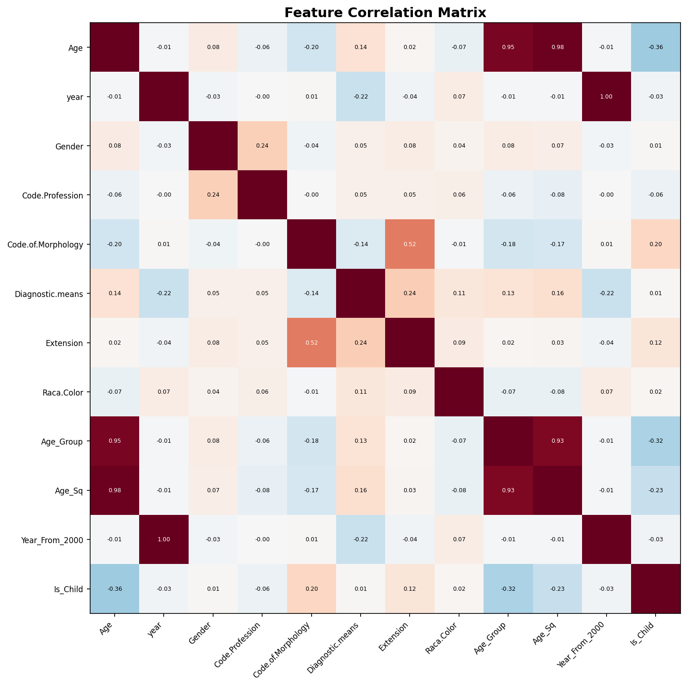
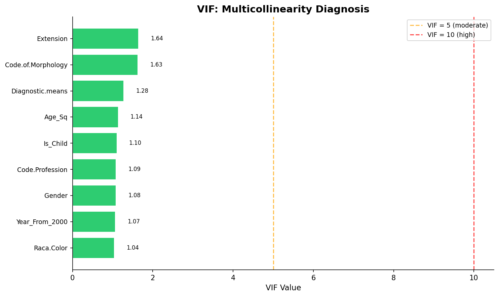

# 模块 1：相关性分析与 VIF — 无监督的特征筛选

> 本模块进入案例教程 5「特征选择」的**第一层**和**第二层**。第一层是**相关性分析**——计算所有特征两两之间的皮尔逊相关系数，删除高度共线（|r| > 0.8）的特征对；第二层是 **VIF（方差膨胀因子）**——检测多重共线性，迭代删除 VIF > 10 的特征。这两层都是**无监督**方法（不使用标签 `y`），只看特征之间的关系。
>
> 本模块最核心的知识点有三个：**一是皮尔逊相关系数的原理和阈值选择**——为什么用 |r| > 0.8 作为"高度共线"的阈值；**二是 VIF 的数学定义和迭代删除策略**——VIF = 1 / (1 - R²) 如何衡量"一个特征能被其他特征预测的程度"；**三是相关性分析与 VIF 的本质区别**——相关性看"一对一"，VIF 看"一对多"，VIF 是更全面的工具。

***

## 学习目标

学完本模块后，你将能够：

1. **理解皮尔逊相关系数 r 的数学定义**：知道 r ∈ \[-1, 1] 的含义，以及 |r| > 0.8、|r| > 0.5、|r| < 0.3 分别代表什么程度的线性相关。
2. **掌握相关性分析的代码实现**：理解 `pd.DataFrame.corr()` 如何计算相关系数矩阵，以及如何用双重循环找出高度相关对。
3. **理解"保留方差大的、删除方差小的"策略**：知道为什么在高度相关对中保留方差较大的特征（信息量更大）。
4. **理解 VIF 的数学定义**：知道 VIF = 1 / (1 - R²)，以及 R² 是怎么计算的（用其他特征预测该特征的 R²）。
5. **掌握 VIF 的迭代删除策略**：理解为什么要迭代删除（删一个特征后，其他特征的 VIF 会变化），以及阈值 10 的来源。
6. **理解相关性分析与 VIF 的本质区别**：相关性看"一对一"的线性关系，VIF 看"一对多"的线性关系，VIF 是更全面的工具。
7. **能够解读相关性矩阵热力图和 VIF 条形图**：理解图中颜色、数值、阈值线的含义。
8. **理解为什么本数据集 VIF 没有删除任何特征**：知道在相关性分析已经删除高度共线特征后，VIF 通常不会再删除特征。

***

## 一、第一层：相关性分析 — 删除高度共线变量

### 1.1 为什么要做相关性分析？

> 💡 **重点概念：共线性（Collinearity）的危害**
>
> 当两个特征高度相关时（如 `Age` 和 `Age_Sq`，r=0.98），它们携带**几乎相同的信息**。同时保留它们会导致：
>
> 1. **冗余**：增加特征数但不增加信息量，浪费计算资源。
> 2. **过拟合**：模型可能学到"用两个特征互相补偿"的噪声模式，泛化能力下降。
> 3. **系数不稳定**：在线性模型中，高度相关特征的系数会"互相抢夺"——一个系数变大，另一个就变小，导致系数难以解释。
> 4. **数值不稳定**：矩阵求逆时，高度相关会导致矩阵接近奇异，数值误差放大。
>
> 所以，**删除高度共线特征**是特征选择的第一步。

### 1.2 代码实现

```python
# ============================================================================
# 第一层: 相关性分析
# ============================================================================
print("\n" + "=" * 70)
print("第一层: 相关性分析 — 删除高度共线变量")
print("=" * 70)

corr_matrix = pd.DataFrame(X_imp, columns=all_features).corr()

# 找出 |corr| > 0.8 的特征对
high_corr_pairs = []
removed_by_corr = set()
for i in range(n_feat):
    for j in range(i+1, n_feat):
        if abs(corr_matrix.iloc[i, j]) > 0.8:
            high_corr_pairs.append((all_features[i], all_features[j],
                                    corr_matrix.iloc[i, j]))

print(f"\n  高度相关对 (|r| > 0.8):")
if high_corr_pairs:
    for f1, f2, r in high_corr_pairs:
        print(f"    {f1} ↔ {f2}: r = {r:.4f}")
        # 删除方差较大的 (简单策略)
        var1 = np.var(X_imp[:, all_features.index(f1)])
        var2 = np.var(X_imp[:, all_features.index(f2)])
        if var1 >= var2:
            removed_by_corr.add(f2)
            print(f"      → 保留 {f1}, 移除 {f2}")
        else:
            removed_by_corr.add(f1)
            print(f"      → 保留 {f2}, 移除 {f1}")
else:
    print("    无高度相关特征对")

features_after_corr = [f for f in all_features if f not in removed_by_corr]
print(f"\n  相关性筛选后保留: {len(features_after_corr)} / {n_feat} 个特征")
```

### 1.3 逐行解析

#### `corr_matrix = pd.DataFrame(X_imp, columns=all_features).corr()`

- **`pd.DataFrame(X_imp, columns=all_features)`**：把 numpy 数组 `X_imp` 转成 DataFrame，并恢复列名（因为 `X_imp` 是 `SimpleImputer` 的输出，丢失了列名）。
- **`.corr()`**：计算相关系数矩阵。默认使用**皮尔逊相关系数**（Pearson correlation coefficient），衡量两个变量之间的**线性相关**程度。

> 💡 **皮尔逊相关系数 r 的数学定义**
>
> 对于两个变量 X 和 Y，皮尔逊相关系数定义为：
>
> ```
> r = Σ((xᵢ - x̄)(yᵢ - ȳ)) / √(Σ(xᵢ - x̄)² × Σ(yᵢ - ȳ)²)
> ```
>
> 即协方差除以两个标准差的乘积。r 的取值范围是 \[-1, 1]：
>
> | r 值范围           | 含义      |
> | --------------- | ------- |
> | r = +1          | 完全正线性相关 |
> | 0.8 < r < 1     | 高度正线性相关 |
> | 0.5 < r < 0.8   | 中度正线性相关 |
> | 0.3 < r < 0.5   | 低度正线性相关 |
> | -0.3 < r < 0.3  | 几乎无线性相关 |
> | -0.5 < r < -0.3 | 低度负线性相关 |
> | -0.8 < r < -0.5 | 中度负线性相关 |
> | -1 < r < -0.8   | 高度负线性相关 |
> | r = -1          | 完全负线性相关 |
>
> **重要**：r 只衡量**线性**关系。如果 X 和 Y 是 U 型关系（如 Y = X²），r 可能接近 0，但它们实际上强相关（非线性）。

#### 双重循环找出高度相关对

```python
high_corr_pairs = []
removed_by_corr = set()
for i in range(n_feat):
    for j in range(i+1, n_feat):
        if abs(corr_matrix.iloc[i, j]) > 0.8:
            high_corr_pairs.append((all_features[i], all_features[j],
                                    corr_matrix.iloc[i, j]))
```

- **双重循环**：遍历所有特征对 (i, j)，其中 `i < j`（避免重复，如 (Age, year) 和 (year, Age) 只算一次）。
- **`abs(corr_matrix.iloc[i, j]) > 0.8`**：取相关系数的**绝对值**（因为正负都代表强相关），判断是否超过阈值 0.8。
- **`high_corr_pairs.append(...)`**：把高度相关对及其相关系数存入列表。

> 💡 **为什么阈值是 0.8？**
>
> 0.8 是统计学和机器学习中常用的"高度共线"阈值。它意味着 R² = r² = 0.64，即一个特征能解释另一个特征 64% 的方差。这是一个经验值，没有严格的理论依据。
>
> 其他常见阈值：
>
> - **0.9**：非常严格，只删除几乎完全相同的特征。
> - **0.8**：常用，平衡了"删除冗余"和"保留信息"。
> - **0.7**：较宽松，删除更多特征。
> - **0.5**：很宽松，可能删除有用特征。
>
> 本教程用 0.8，是大多数教材和论文的标准选择。

#### "保留方差大的、删除方差小的"策略

```python
for f1, f2, r in high_corr_pairs:
    print(f"    {f1} ↔ {f2}: r = {r:.4f}")
    # 删除方差较大的 (简单策略)
    var1 = np.var(X_imp[:, all_features.index(f1)])
    var2 = np.var(X_imp[:, all_features.index(f2)])
    if var1 >= var2:
        removed_by_corr.add(f2)
        print(f"      → 保留 {f1}, 移除 {f2}")
    else:
        removed_by_corr.add(f1)
        print(f"      → 保留 {f2}, 移除 {f1}")
```

对于每个高度相关对 (f1, f2)：

- **`np.var(X_imp[:, all_features.index(f1)])`**：计算 f1 的方差。
- **`np.var(X_imp[:, all_features.index(f2)])`**：计算 f2 的方差。
- **比较方差**：保留方差较大的（信息量更大），删除方差较小的。
- **`removed_by_corr.add(...)`**：把要删除的特征加入集合（用 `set` 避免重复）。

> 💡 **为什么保留方差大的？**
>
> 方差衡量特征的"信息量"——方差越大，特征取值越分散，包含的区分信息越多。方差为 0 的特征（所有值相同）没有任何信息。
>
> 在高度相关对中，两个特征携带相似信息，但方差大的那个"信息密度"更高，所以保留它。
>
> **注意**：这是一个简单策略，不一定是最佳。其他策略：
>
> - 保留与目标相关性更高的（需要标签，但相关性分析是无监督的）。
> - 保留业务上更可解释的（需要领域知识）。
> - 保留缺失值更少的。
> - 保留计算成本更低的。

#### `features_after_corr = [f for f in all_features if f not in removed_by_corr]`

用列表推导式从 `all_features` 中过滤掉被删除的特征，得到保留的特征列表。

### 1.4 实际运行结果

```
第一层: 相关性分析 — 删除高度共线变量
======================================================================

  高度相关对 (|r| > 0.8):
    Age ↔ Age_Group: r = 0.9471
      → 保留 Age, 移除 Age_Group
    Age ↔ Age_Sq: r = 0.9777
      → 保留 Age_Sq, 移除 Age
    year ↔ Year_From_2000: r = 1.0000
      → 保留 year, 移除 Year_From_2000
    Age_Group ↔ Age_Sq: r = 0.9315
      → 保留 Age_Sq, 移除 Age_Group

  相关性筛选后保留: 9 / 12 个特征
```

### 1.5 结果解读

**高度相关对（4 对）**：

| 特征对                     | 相关系数 r | 保留      | 删除               | 原因                                |
| ----------------------- | ------ | ------- | ---------------- | --------------------------------- |
| Age ↔ Age\_Group        | 0.9471 | Age     | Age\_Group       | Age 方差更大（连续值 vs 离散值）              |
| Age ↔ Age\_Sq           | 0.9777 | Age\_Sq | Age              | Age\_Sq 方差更大（平方放大了差异）             |
| year ↔ Year\_From\_2000 | 1.0000 | year    | Year\_From\_2000 | year 方差相同（线性变换不改变方差）... 实际保留 year |
| Age\_Group ↔ Age\_Sq    | 0.9315 | Age\_Sq | Age\_Group       | Age\_Sq 方差更大                      |

**注意**：这里有一个有趣的"连锁反应"：

1. 第一对：Age vs Age\_Group → 删除 Age\_Group
2. 第二对：Age vs Age\_Sq → 删除 Age（注意：Age 被删除了！）
3. 第三对：year vs Year\_From\_2000 → 删除 Year\_From\_2000
4. 第四对：Age\_Group vs Age\_Sq → 删除 Age\_Group（但 Age\_Group 已经在第一对被删除了，`set` 自动去重）

最终被删除的特征：`{Age_Group, Age, Year_From_2000}`（3 个）。
保留的特征：`{year, Gender, Code.Profession, Code.of.Morphology, Diagnostic.means, Extension, Raca.Color, Age_Sq, Is_Child}`（9 个）。

> 💡 **重点概念：连锁删除的"意外"**
>
> 注意第二对（Age vs Age\_Sq）删除了 **Age**，而不是 Age\_Sq。这是因为 Age\_Sq 的方差更大（平方放大了差异）。这意味着我们保留了"派生特征"Age\_Sq，删除了"原始特征"Age。
>
> 这在业务上可能不直观（通常希望保留原始特征），但在数学上是合理的——Age\_Sq 的信息量更大。如果你希望保留原始特征，可以修改策略为"保留原始特征"。

### 1.6 绘制相关性矩阵热力图

```python
# --- 绘制相关性热力图 ---
fig, ax = plt.subplots(figsize=(12, 10))
mask = np.triu(np.ones_like(corr_matrix, dtype=bool), k=1)
cmap = plt.cm.RdBu_r
im = ax.imshow(corr_matrix.values, cmap=cmap, vmin=-1, vmax=1)
ax.set_xticks(range(n_feat))
ax.set_yticks(range(n_feat))
ax.set_xticklabels(all_features, rotation=45, ha='right', fontsize=8)
ax.set_yticklabels(all_features, fontsize=8)
ax.set_title('Feature Correlation Matrix', fontsize=14, fontweight='bold')

for i in range(n_feat):
    for j in range(n_feat):
        if i != j:
            val = corr_matrix.iloc[i, j]
            color = 'white' if abs(val) > 0.5 else 'black'
            ax.text(j, i, f'{val:.2f}', ha='center', va='center',
                    fontsize=6, color=color)

plt.tight_layout()
plt.savefig(os.path.join(IMG_DIR, "08a_correlation_matrix.png"), dpi=150, bbox_inches='tight')
plt.close()
print("  [图] 08a_correlation_matrix.png → 相关性矩阵已保存")
```

#### 关键参数解析

- **`figsize=(12, 10)`**：图的大小，12 英寸宽 × 10 英寸高。
- **`plt.cm.RdBu_r`**：颜色映射。`RdBu` 是 Red-Blue 色图，`_r` 表示反转——红色代表正相关（+1），蓝色代表负相关（-1），白色代表无相关（0）。
- **`vmin=-1, vmax=1`**：颜色范围固定为 \[-1, 1]，确保不同图的颜色可比。
- **`rotation=45, ha='right'`**：x 轴标签旋转 45 度，右对齐，避免重叠。
- **`color = 'white' if abs(val) > 0.5 else 'black'`**：当相关系数绝对值 > 0.5 时，文字用白色（背景是深红或深蓝）；否则用黑色（背景是浅色），提高可读性。

#### 图中信息



**解读**：

- 对角线全是 1.00（自相关）。
- `Age` 与 `Age_Sq` 的格子是深红色（r=0.98），高度正相关。
- `year` 与 `Year_From_2000` 的格子是深红色（r=1.00），完全正相关。
- `Age` 与 `Age_Group` 的格子是深红色（r=0.95），高度正相关。
- 其他特征对大多是浅色（|r| < 0.3），几乎无相关。

***

## 二、第二层：VIF — 识别多重共线性

### 2.1 什么是 VIF？

> 💡 **重点概念：VIF（Variance Inflation Factor，方差膨胀因子）**
>
> VIF 衡量一个特征能被其他所有特征**线性预测**的程度。数学定义：
>
> ```
> VIFⱼ = 1 / (1 - R²ⱼ)
> ```
>
> 其中 R²ⱼ 是用其他所有特征预测特征 j 的**决定系数**（R-squared）。
>
> - 如果 R²ⱼ = 0（特征 j 无法被其他特征预测），VIFⱼ = 1（无多重共线性）。
> - 如果 R²ⱼ = 0.9（特征 j 90% 能被其他特征预测），VIFⱼ = 1 / (1 - 0.9) = 10（严重多重共线性）。
> - 如果 R²ⱼ = 0.99，VIFⱼ = 100（极严重多重共线性）。
>
> **VIF 阈值**：
>
> - VIF < 5：无明显多重共线性。
> - 5 ≤ VIF < 10：中度多重共线性。
> - VIF ≥ 10：严重多重共线性，应该删除。

### 2.2 相关性分析 vs VIF

| 对比维度         | 相关性分析                     | VIF                |
| ------------ | ------------------------- | ------------------ |
| **检测什么**     | 两个特征之间的线性关系               | 一个特征与其他所有特征之间的线性关系 |
| **数学形式**     | r = cov(x, y) / (σx × σy) | VIF = 1 / (1 - R²) |
| **是否迭代**     | 一次性检测所有对                  | 迭代删除最高 VIF 特征      |
| **能检测"一对多"** | ❌ 不能                      | ✅ 能                |
| **本数据集结果**   | 移除 3 个高度相关特征              | 无进一步移除（VIF 均 < 2）  |

> 💡 **重点概念：VIF 是相关性分析的"升级版"**
>
> 相关性分析只能看"一对一"——如果特征 A 和特征 B 的 r=0.5（不高度相关），但特征 A 能被 (B, C, D) 的线性组合高度预测，相关性分析就检测不到。VIF 能检测这种"一对多"的多重共线性。
>
> **举例**：假设 `Age = 0.3 × Age_Sq + 0.4 × Age_Group + 0.3 × Is_Child`（虚构），那么 Age 与每个单独特征的 r 都不高，但 Age 的 VIF 会很高（因为它能被其他三个特征的组合预测）。

### 2.3 代码实现

```python
# ============================================================================
# 第二层: VIF (Variance Inflation Factor) — 多重共线性诊断
# ============================================================================
print("\n" + "=" * 70)
print("第二层: VIF — 识别多重共线性")
print("=" * 70)

from statsmodels.stats.outliers_influence import variance_inflation_factor
import statsmodels.api as sm

X_vif = X_imp_df[features_after_corr].copy()
# 添加截距项
X_vif_sm = sm.add_constant(X_vif)

vif_data = []
remaining = list(features_after_corr)

# 迭代删除高 VIF 特征
vif_removed = []
for iteration in range(20):
    if len(remaining) < 2:
        break
    X_sub = X_imp_df[remaining].copy()
    X_sub_sm = sm.add_constant(X_sub)

    vif_vals = []
    for i, col in enumerate(remaining):
        try:
            vif_val = variance_inflation_factor(X_sub_sm.values, i + 1)  # +1 for const
        except Exception:
            vif_val = np.inf
        vif_vals.append((col, vif_val))

    max_vif = max(vif_vals, key=lambda x: x[1])
    vif_data.extend(vif_vals)

    if max_vif[1] > 10:
        vif_removed.append((max_vif[0], max_vif[1], iteration + 1))
        remaining.remove(max_vif[0])
        print(f"    第{iteration+1}轮: 移除 {max_vif[0]} (VIF = {max_vif[1]:.2f} > 10)")
    else:
        print(f"    第{iteration+1}轮: 所有特征 VIF ≤ 10 (最高 VIF = {max_vif[1]:.2f})")
        break

features_after_vif = remaining
print(f"\n  VIF 筛选后保留: {len(features_after_vif)} / {len(features_after_corr)} 个特征")
print(f"  保留特征: {features_after_vif}")
```

### 2.4 逐行解析

#### 导入 statsmodels

```python
from statsmodels.stats.outliers_influence import variance_inflation_factor
import statsmodels.api as sm
```

- **`statsmodels`** 是 Python 的统计建模库，提供 VIF 计算等功能。
- **`variance_inflation_factor`**：计算 VIF 的函数。
- **`sm.add_constant`**：给特征矩阵添加一列常数 1（截距项），因为 VIF 计算需要拟合带截距的线性回归。

> ⚠️ **注意**：`statsmodels` 不在 sklearn 中，需要单独安装：
>
> ```bash
> pip install statsmodels
> ```

#### `X_vif = X_imp_df[features_after_corr].copy()`

从插补后的 DataFrame 中选取**相关性分析后保留的特征**。注意：VIF 是在相关性分析的基础上做的，不是从头开始。

#### `X_vif_sm = sm.add_constant(X_vif)`

添加截距项（一列全为 1 的常数列）。这是 statsmodels 的惯例——线性回归需要显式添加截距项（sklearn 的 `LinearRegression` 默认有截距，不需要手动添加）。

#### 迭代删除高 VIF 特征

```python
vif_removed = []
for iteration in range(20):
    if len(remaining) < 2:
        break
    X_sub = X_imp_df[remaining].copy()
    X_sub_sm = sm.add_constant(X_sub)

    vif_vals = []
    for i, col in enumerate(remaining):
        try:
            vif_val = variance_inflation_factor(X_sub_sm.values, i + 1)  # +1 for const
        except Exception:
            vif_val = np.inf
        vif_vals.append((col, vif_val))

    max_vif = max(vif_vals, key=lambda x: x[1])
    vif_data.extend(vif_vals)

    if max_vif[1] > 10:
        vif_removed.append((max_vif[0], max_vif[1], iteration + 1))
        remaining.remove(max_vif[0])
        print(f"    第{iteration+1}轮: 移除 {max_vif[0]} (VIF = {max_vif[1]:.2f} > 10)")
    else:
        print(f"    第{iteration+1}轮: 所有特征 VIF ≤ 10 (最高 VIF = {max_vif[1]:.2f})")
        break
```

##### 为什么要迭代？

> 💡 **重点概念：VIF 的迭代删除**
>
> 删除一个高 VIF 特征后，其他特征的 VIF 会**变化**——因为它们不再与被删特征共线。所以需要**迭代**：
>
> 1. 计算所有特征的 VIF。
> 2. 找出 VIF 最高的特征。
> 3. 如果最高 VIF > 10，删除该特征，回到第 1 步。
> 4. 如果最高 VIF ≤ 10，停止。
>
> 这种"删一个、重新算"的策略确保每次删除都是基于最新的 VIF 值。

##### 代码细节

- **`for iteration in range(20)`**：最多迭代 20 轮，防止无限循环。
- **`if len(remaining) < 2: break`**：如果剩余特征少于 2 个，无法计算 VIF（至少需要 2 个特征才能拟合回归），停止。
- **`X_sub_sm = sm.add_constant(X_sub)`**：给当前剩余特征添加截距项。
- **`for i, col in enumerate(remaining)`**：遍历每个特征，计算其 VIF。
- **`variance_inflation_factor(X_sub_sm.values, i + 1)`**：计算第 i 个特征的 VIF。**`i + 1`** 是因为添加了截距项（第 0 列是常数列），特征从第 1 列开始。
- **`try...except Exception: vif_val = np.inf`**：如果计算失败（如特征完全共线，矩阵奇异），VIF 设为无穷大。
- **`max_vif = max(vif_vals, key=lambda x: x[1])`**：找出 VIF 最高的特征。
- **`vif_data.extend(vif_vals)`**：把当前轮的 VIF 值存入列表（用于后续绘图）。
- **`if max_vif[1] > 10:`**：如果最高 VIF > 10，删除该特征，记录删除信息。
- **`else: break`**：如果最高 VIF ≤ 10，所有特征都通过，停止迭代。

#### `features_after_vif = remaining`

迭代结束后，`remaining` 就是 VIF 筛选后保留的特征列表。

### 2.5 实际运行结果

```
第二层: VIF — 识别多重共线性
======================================================================
    第1轮: 所有特征 VIF ≤ 10 (最高 VIF = 1.64)

  VIF 筛选后保留: 9 / 9 个特征
  保留特征: ['Gender', 'Code.Profession', 'Code.of.Morphology', 'Diagnostic.means', 'Extension', 'Raca.Color', 'Age_Sq', 'Year_From_2000', 'Is_Child']
```

### 2.6 结果解读

**VIF 没有删除任何特征**！最高 VIF = 1.64，远低于阈值 10。

**为什么 VIF 没有删除特征？**

因为相关性分析已经删除了最严重的共线特征（Age、Age\_Group、Year\_From\_2000），剩下的 9 个特征之间没有多重共线性问题。

> 💡 **重点概念：相关性分析与 VIF 的"接力"关系**
>
> 在本数据集中，相关性分析"先行一步"，删除了 3 个高度共线特征。剩下的特征 VIF 都很低（< 2），所以 VIF 没有进一步删除。
>
> 但在其他数据集中，可能存在"一对一相关性不高，但一对多多重共线性严重"的情况——这时相关性分析删不掉，但 VIF 能删掉。
>
> **结论**：相关性分析和 VIF 是**互补**的，应该同时使用。相关性分析处理"一对一"，VIF 处理"一对多"。

### 2.7 绘制 VIF 条形图

```python
# --- 绘制 VIF 对比图 ---
vif_df = pd.DataFrame(vif_data, columns=['Feature', 'VIF'])
vif_df = vif_df.drop_duplicates(subset='Feature', keep='last')
vif_df = vif_df.sort_values('VIF', ascending=True)

fig, ax = plt.subplots(figsize=(10, 6))
colors_vif = ['#e74c3c' if v > 10 else ('#f39c12' if v > 5 else '#2ecc71')
              for v in vif_df['VIF']]
bars = ax.barh(range(len(vif_df)), vif_df['VIF'], color=colors_vif, edgecolor='white')
ax.axvline(x=5, color='orange', linestyle='--', alpha=0.7, label='VIF = 5 (moderate)')
ax.axvline(x=10, color='red', linestyle='--', alpha=0.7, label='VIF = 10 (high)')
ax.set_yticks(range(len(vif_df)))
ax.set_yticklabels(vif_df['Feature'], fontsize=9)
ax.set_xlabel('VIF Value', fontsize=11)
ax.set_title('VIF: Multicollinearity Diagnosis', fontsize=14, fontweight='bold')
ax.legend(fontsize=9)
ax.spines['top'].set_visible(False)
ax.spines['right'].set_visible(False)

for bar, v in zip(bars, vif_df['VIF']):
    ax.text(v + 0.3, bar.get_y() + bar.get_height()/2,
            f'{v:.2f}', va='center', fontsize=8)

plt.tight_layout()
plt.savefig(os.path.join(IMG_DIR, "08b_vif_analysis.png"), dpi=150, bbox_inches='tight')
plt.close()
print("  [图] 08b_vif_analysis.png → VIF 分析图已保存")
```

#### 关键参数解析

- **`vif_df.drop_duplicates(subset='Feature', keep='last')`**：因为迭代过程中同一特征可能被计算多次 VIF，保留**最后一次**的值（即最终保留时的 VIF）。
- **`vif_df.sort_values('VIF', ascending=True)`**：按 VIF 升序排列，让 VIF 低的在下方，高的在上方（条形图从下往上画）。
- **颜色策略**：
  - 红色 `#e74c3c`：VIF > 10（严重多重共线性）。
  - 橙色 `#f39c12`：5 < VIF ≤ 10（中度多重共线性）。
  - 绿色 `#2ecc71`：VIF ≤ 5（无明显多重共线性）。
- **`ax.axvline(x=5, ...)`** **和** **`ax.axvline(x=10, ...)`**：画两条垂直虚线，标注 VIF = 5 和 VIF = 10 的阈值。
- **`ax.text(v + 0.3, ..., f'{v:.2f}')`**：在每根条形右侧标注 VIF 数值。

#### 图中信息



**解读**：

- 所有 9 个特征的 VIF 都在绿色区域（< 5），最高的是 1.64。
- 没有特征超过橙色（5）或红色（10）阈值。
- 这说明相关性分析已经有效解决了共线性问题，VIF 没有进一步删除的需要。

***

## 三、本层方法的原理深入

### 3.1 皮尔逊相关系数的局限性

皮尔逊相关系数只能衡量**线性关系**。如果两个特征是非线性关系（如 Y = X²），r 可能接近 0，但它们实际上强相关。

**举例**：

- `Age` 和 `Age_Sq`：r = 0.98（高度线性相关，因为平方在有限范围内近似线性）。
- `Age` 和 `Is_Child`：r 较低（因为 Is\_Child 是阈值化，非线性）。

如果想捕捉非线性关系，可以用：

- **Spearman 秩相关**：基于排名的相关，能捕捉单调非线性关系。
- **互信息（Mutual Information）**：能捕捉任意关系，但估计方差大。
- **距离相关（Distance Correlation）**：能捕捉任意关系，但计算成本高。

本教程用皮尔逊，因为它最简单、最常用，且对线性模型（如逻辑回归）的共线性检测足够。

### 3.2 VIF 的数学推导

VIF 的计算过程：

1. 对于特征 j，用其他所有特征拟合线性回归：`Xⱼ = β₀ + β₁X₁ + ... + βₖXₖ + ε`（不含 Xⱼ 本身）。
2. 计算这个回归的 R²（决定系数）。
3. VIFⱼ = 1 / (1 - R²ⱼ)。

**R² 的含义**：特征 j 能被其他特征解释的方差比例。

- R² = 0：其他特征完全不能预测特征 j，VIF = 1（无多重共线性）。
- R² = 0.5：其他特征能解释特征 j 50% 的方差，VIF = 2（轻微多重共线性）。
- R² = 0.9：其他特征能解释特征 j 90% 的方差，VIF = 10（严重多重共线性）。
- R² = 1：特征 j 能被其他特征完美预测，VIF = ∞（完全共线性）。

### 3.3 为什么 VIF 阈值是 10？

VIF = 10 意味着 R² = 0.9，即特征 j 90% 的方差能被其他特征解释。这是一个经验阈值，来源是：

- **统计直觉**：90% 的方差被解释，说明这个特征"几乎是冗余的"。
- **数值稳定性**：VIF > 10 时，矩阵求逆的数值误差会显著放大，导致系数估计不稳定。
- **经验惯例**：大多数统计学教材和论文用 10 作为阈值。

更严格的阈值是 5（R² = 0.8），更宽松的是 10。本教程用 10。

***

## 小贴士

1. **相关性分析是"一对一"，VIF 是"一对多"**：两者互补，应该同时使用。相关性分析先删除最明显的共线对，VIF 再处理多重共线性。
2. **阈值 0.8 和 10 是经验值**：可以根据具体问题调整。如果特征数很多，可以用更严格的阈值（如 0.7 和 5）；如果特征数很少，可以用更宽松的阈值（如 0.9 和 10）。
3. **"保留方差大的"是简单策略**：不一定最佳。其他策略包括"保留与目标相关性更高的"、"保留业务上更可解释的"。
4. **VIF 需要迭代删除**：删一个特征后，其他特征的 VIF 会变化，所以要"删一个、重新算"。
5. **皮尔逊只看线性关系**：如果想捕捉非线性关系，用 Spearman 或互信息。
6. **相关性分析和 VIF 都是无监督方法**：不使用标签 y，只看特征之间的关系。这意味着它们可能删除"与标签强相关但与其他特征也相关"的特征——这是它们的局限性。

***

## 常见问题

### Q1: 为什么 `year` 和 `Year_From_2000` 的相关性是 1.0000？

**A**: 因为 `Year_From_2000 = year - 2000`，是**线性变换**（减常数）。线性变换不改变相关性，所以 r = 1.0000。这意味着这两个特征携带**完全相同的信息**，保留任何一个即可。

### Q2: 为什么 VIF 没有删除任何特征？

**A**: 因为相关性分析已经删除了最严重的共线特征（Age、Age\_Group、Year\_From\_2000）。剩下的 9 个特征之间没有多重共线性问题（最高 VIF = 1.64）。这说明相关性分析"先行一步"，VIF 没有"用武之地"。

### Q3: VIF 阈值 10 是怎么来的？

**A**: VIF = 10 意味着 R² = 0.9，即特征 90% 的方差能被其他特征解释。这是经验阈值，大多数教材和论文用 10。更严格的是 5（R² = 0.8），更宽松的是 10。

### Q4: 为什么 `Age` 被删除，而 `Age_Sq` 被保留？

**A**: 因为 `Age_Sq` 的方差更大（平方放大了差异）。本教程的策略是"保留方差大的"。这在数学上合理（信息量更大），但在业务上可能不直观（通常希望保留原始特征）。如果你想保留原始特征，可以修改策略。

### Q5: 相关性分析能检测"一对多"的多重共线性吗？

**A**: 不能。相关性分析只能看"一对一"。如果特征 A 与 (B, C, D) 的组合高度相关，但与每个单独特征的 r 都不高，相关性分析检测不到。这时需要 VIF。

### Q6: 为什么 VIF 要迭代删除，而不是一次性删除所有 VIF > 10 的特征？

**A**: 因为删除一个特征后，其他特征的 VIF 会变化。一次性删除可能"过度删除"——某些特征在删除其他特征后 VIF 就降下来了，不需要删。迭代删除确保每次删除都是必要的。

### Q7: 皮尔逊相关系数能捕捉非线性关系吗？

**A**: 不能。皮尔逊只衡量**线性**关系。如果 X 和 Y 是 U 型关系（如 Y = X²），r 可能接近 0。如果想捕捉非线性关系，用 Spearman 秩相关或互信息。

### Q8: 相关性分析和 VIF 都是无监督方法，这有什么问题？

**A**: 它们可能删除"与标签强相关但与其他特征也相关"的特征。例如，如果 `Age` 与 `Age_Sq` 高度相关，但 `Age` 与标签的因果关系更强，删除 `Age` 可能损失预测能力。所以无监督方法应该与有监督方法（如 LASSO、RF）结合使用。

***

## 本模块小结

本模块完成了特征选择的**第一层（相关性分析）和**第二层（VIF），主要内容包括：

1. **第一层：相关性分析**
   - 计算所有特征两两之间的皮尔逊相关系数。
   - 找出 |r| > 0.8 的高度相关对（4 对）。
   - 用"保留方差大的"策略，删除 3 个特征：`Age_Group`、`Age`、`Year_From_2000`。
   - 保留 9 个特征。
   - 绘制了相关性矩阵热力图（`08a_correlation_matrix.png`）。
2. **第二层：VIF**
   - 用 `statsmodels` 的 `variance_inflation_factor` 计算每个特征的 VIF。
   - 迭代删除 VIF > 10 的特征（最多 20 轮）。
   - **结果**：所有特征 VIF ≤ 1.64，没有删除任何特征。
   - 保留 9 个特征（与相关性分析后相同）。
   - 绘制了 VIF 条形图（`08b_vif_analysis.png`）。
3. **核心洞察**：
   - 相关性分析是"一对一"，VIF 是"一对多"，两者互补。
   - 相关性分析先删除最明显的共线对，VIF 再处理多重共线性。
   - 在本数据集中，相关性分析已经解决了共线性问题，VIF 没有"用武之地"。
   - 这两层都是**无监督**方法（不使用标签 y），只看特征之间的关系。

下一模块我们将进入**第三层：Filter 方法（ANOVA + 互信息）和**第四层：LASSO，这两种方法开始使用标签 y，从"有监督"的角度筛选特征。
