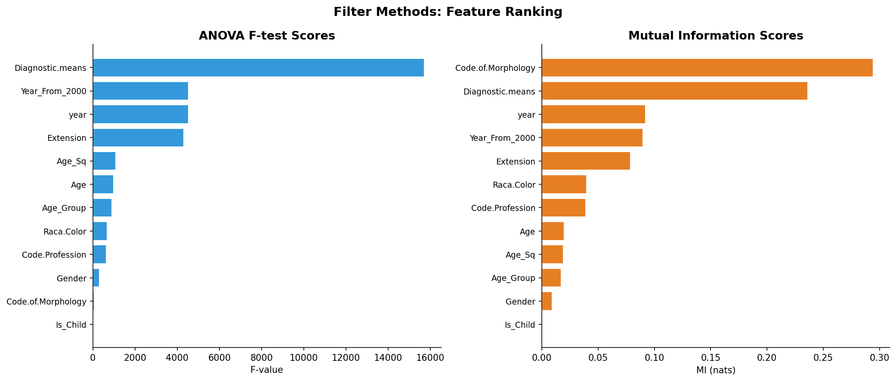
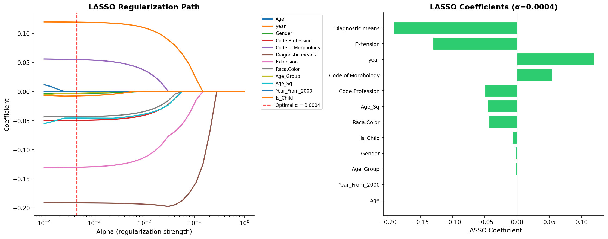

# 模块 2：Filter 方法与 LASSO — 有监督的特征筛选

> 本模块进入案例教程 5「特征选择」的**第三层**和**第四层**。第三层是 **Filter 方法**——用 ANOVA F 检验和互信息（MI）两种单变量方法评估每个特征与目标的关联强度，取平均排名 Top 60% 的特征；第四层是 **LASSO（L1 正则化）**——用交叉验证选择最优正则化强度 α，分析哪些特征的系数被压缩至 0。这两种方法都是**有监督**的（使用标签 y），从"特征与目标的关系"角度筛选。
>
> 本模块最核心的知识点有三个：**一是 ANOVA F 检验与互信息的本质区别**——F 检验看线性关系，MI 看任意关系，两者互补；**二是 LASSO 的 L1 正则化原理**——为什么 L1 能把系数压缩至 0，而 L2 不能；**三是 LASSO 正则化路径图的解读**——随着 α 增大，特征系数如何被逐步压缩。

***

## 学习目标

学完本模块后，你将能够：

1. **理解 ANOVA F 检验的数学原理**：知道 F 统计量 = 组间方差 / 组内方差，F 越大特征区分能力越强。
2. **理解互信息（MI）的数学原理**：知道 MI 衡量两个变量的"共享信息量"，能捕捉非线性关系。
3. **掌握** **`SelectKBest`** **和** **`mutual_info_classif`** **的用法**：理解 `k='all'`、`random_state` 等参数的含义。
4. **理解"平均排名"融合策略**：知道为什么用排名而不是原始分数做融合（因为 F 和 MI 的量纲不同）。
5. **理解 LASSO 的 L1 正则化原理**：知道损失函数 `MSE + α × Σ|wᵢ|`，以及为什么 L1 能把系数压缩至 0。
6. **掌握** **`LassoCV`** **的参数**：理解 `cv=5`、`max_iter=10000`、`alphas=np.logspace(-4, 0, 50)` 的含义。
7. **能够解读 LASSO 正则化路径图**：理解 α 从小到大变化时，特征系数如何被逐步压缩至 0。
8. **理解 LASSO 不仅仅做特征选择，还是特征重要性排序器**：被最后压缩到零的特征最重要。

***

## 一、第三层：Filter 方法 — ANOVA + Mutual Information

### 1.1 什么是 Filter 方法？

> 💡 **重点概念：Filter 方法**
>
> Filter 方法是特征选择的三大类之一（另外两类是 Wrapper 和 Embedded）。它的特点是：
>
> - **单变量**：每个特征独立评估，不考虑特征间的交互。
> - **不依赖模型**：直接用统计量（如 F 值、MI）评分，不训练模型。
> - **计算快**：适合高维数据的初步筛选。
> - **缺点**：忽略特征间的交互效应——两个特征单独看可能不重要，但组合起来可能很强。
>
> 本教程用两种 Filter 方法：
>
> - **ANOVA F 检验**：线性视角，衡量特征对不同目标组的区分能力。
> - **互信息（MI）**：信息论视角，衡量特征与目标的共享信息量。

### 1.2 ANOVA F 检验的数学原理

> 💡 **重点概念：ANOVA F 检验**
>
> ANOVA（Analysis of Variance，方差分析）F 检验用于检验"一个特征的均值在不同目标组之间是否有显著差异"。
>
> **F 统计量**：
>
> ```
> F = 组间方差 / 组内方差
> ```
>
> - **组间方差**：不同目标组（如 VIVO 和 MORTO）的特征均值差异。
> - **组内方差**：同一组内特征的变异程度。
>
> **直觉**：如果一个特征能很好地区分 VIVO 和 MORTO，那么两组的均值差异大（组间方差大），组内变异小（组内方差小），F 值就大。
>
> **F 越大，特征的区分能力越强**。

### 1.3 互信息（MI）的数学原理

> 💡 **重点概念：互信息（Mutual Information）**
>
> 互信息衡量两个变量之间的"共享信息量"，数学定义：
>
> ```
> MI(X, Y) = H(X) + H(Y) - H(X, Y)
> ```
>
> 其中 H 是信息熵，H(X, Y) 是联合熵。
>
> **直觉**：知道 X 后，Y 的不确定性减少了多少。如果 X 和 Y 独立，MI = 0；如果 X 完全决定 Y，MI = H(Y)。
>
> **MI 的优势**：
>
> - 能捕捉**任意关系**（线性、非线性、离散、连续）。
> - 不假设关系形式。
>
> **MI 的劣势**：
>
> - 估计方差大（需要足够样本）。
> - 计算比 F 检验慢。
> - 单位是 nat（自然对数），不如 F 值直观。

### 1.4 ANOVA vs MI

| 对比维度          | ANOVA F 检验                 | 互信息 MI                         |
| ------------- | -------------------------- | ------------------------------ |
| **能捕捉的关系**    | 仅线性                        | 任意（线性、非线性）                     |
| **数学基础**      | 方差分析                       | 信息论                            |
| **单位**        | F 值（无量纲）                   | nat（自然对数单位）                    |
| **计算速度**      | 快                          | 慢                              |
| **估计稳定性**     | 高                          | 低（需要足够样本）                      |
| **本数据集最重要特征** | Diagnostic.means (F=15725) | Code.of.Morphology (MI=0.2944) |

> 💡 **为什么本教程同时用两种？**
>
> 因为它们互补：
>
> - ANOVA 给出稳定的线性排名。
> - MI 补充非线性关系。
>
> 用"平均排名"融合两种方法的结果，得到更全面的特征排序。

### 1.5 代码实现

```python
# ============================================================================
# 第三层: Filter 方法 — ANOVA + Mutual Information
# ============================================================================
print("\n" + "=" * 70)
print("第三层: Filter 方法 — ANOVA F-test + Mutual Information")
print("=" * 70)

# ANOVA F-test
anova_selector = SelectKBest(f_classif, k='all')
anova_selector.fit(X_train_s, y_train)
anova_scores = anova_selector.scores_

# Mutual Information
mi_scores = mutual_info_classif(X_train, y_train, random_state=RANDOM_STATE)

# 合并结果
filter_df = pd.DataFrame({
    'Feature': all_features,
    'ANOVA_F': anova_scores,
    'ANOVA_Rank': np.argsort(np.argsort(-anova_scores)) + 1,
    'MI': mi_scores,
    'MI_Rank': np.argsort(np.argsort(-mi_scores)) + 1,
    'Avg_Rank': (np.argsort(np.argsort(-anova_scores)) +
                  np.argsort(np.argsort(-mi_scores))) / 2 + 1
}).sort_values('Avg_Rank')

print(f"\n  {'特征':<22} {'ANOVA F':>10} {'ANOVA排名':>8} {'MI':>10} {'MI排名':>6} {'平均排名':>8}")
print(f"  {'-'*22} {'-'*10} {'-'*8} {'-'*10} {'-'*6} {'-'*8}")
for _, row in filter_df.iterrows():
    print(f"  {row['Feature']:<22} {row['ANOVA_F']:>10.1f} {int(row['ANOVA_Rank']):>8} "
          f"{row['MI']:>10.4f} {int(row['MI_Rank']):>6} {row['Avg_Rank']:>6.1f}")

top_filter_features = filter_df.head(int(np.ceil(n_feat * 0.6)))['Feature'].tolist()
print(f"\n  Filter 筛选 Top 60%: {top_filter_features}")
```

### 1.6 逐行解析

#### ANOVA F 检验

```python
anova_selector = SelectKBest(f_classif, k='all')
anova_selector.fit(X_train_s, y_train)
anova_scores = anova_selector.scores_
```

- **`SelectKBest(f_classif, k='all')`**：创建一个 SelectKBest 选择器。
  - **`f_classif`**：评分函数，使用 ANOVA F 检验。其他选项：`chi2`（卡方检验，要求非负）、`mutual_info_classif`（互信息）。
  - **`k='all'`**：保留所有特征（不筛选），只计算分数。这样我们可以看到所有特征的分数，自己决定阈值。
- **`anova_selector.fit(X_train_s, y_train)`**：在**训练集**上拟合（注意：用标准化数据 `X_train_s`，虽然 F 检验理论上尺度无关，但用标准化数据更稳妥）。
- **`anova_selector.scores_`**：获取所有特征的 F 值。

> ⚠️ **注意**：F 检验用 `X_train_s`（标准化数据），但 F 值本身是尺度无关的（因为是方差比）。用标准化或未标准化数据，F 值相同。

#### 互信息

```python
mi_scores = mutual_info_classif(X_train, y_train, random_state=RANDOM_STATE)
```

- **`mutual_info_classif`**：直接计算每个特征与目标的互信息（不需要 SelectKBest 包装）。
- **`X_train`**：用**未标准化**数据。MI 估计基于 KNN（K-近邻），对尺度敏感，所以用原始数据。
- **`y_train`**：标签。
- **`random_state=RANDOM_STATE`**：固定随机种子。MI 估计有随机性（KNN 的随机性），固定种子确保可复现。

> 💡 **为什么 MI 用未标准化数据，ANOVA 用标准化数据？**
>
> - ANOVA F 检验是**尺度无关**的（方差比），用标准化或未标准化数据，F 值相同。本教程用标准化数据是习惯。
> - MI 估计基于 KNN，**对尺度敏感**——如果特征量纲差异大，KNN 的距离会被大量纲特征主导。所以用未标准化数据时，每个特征的 MI 独立计算（不涉及多特征距离），反而更合理。
>
> 实际上，`mutual_info_classif` 是对每个特征单独计算 MI，不涉及多特征距离，所以用标准化或未标准化数据，MI 值应该相同（除了数值精度差异）。本教程用未标准化数据是代码风格。

#### 合并结果

```python
filter_df = pd.DataFrame({
    'Feature': all_features,
    'ANOVA_F': anova_scores,
    'ANOVA_Rank': np.argsort(np.argsort(-anova_scores)) + 1,
    'MI': mi_scores,
    'MI_Rank': np.argsort(np.argsort(-mi_scores)) + 1,
    'Avg_Rank': (np.argsort(np.argsort(-anova_scores)) +
                  np.argsort(np.argsort(-mi_scores))) / 2 + 1
}).sort_values('Avg_Rank')
```

这段代码计算每个特征的 ANOVA 排名、MI 排名，以及平均排名。

##### `np.argsort(np.argsort(-anova_scores)) + 1` 的原理

这是一个计算排名的技巧：

- **`-anova_scores`**：取负，让大的变小、小的变大（因为 argsort 默认升序）。
- **`np.argsort(-anova_scores)`**：返回排序后的索引。例如 `[100, 200, 50]` → argsort → `[2, 0, 1]`（50 最小，索引 2 排第一）。
- **`np.argsort(np.argsort(-anova_scores))`**：再 argsort 一次，得到排名。`[2, 0, 1]` → argsort → `[1, 2, 0]`，意思是原数组中索引 0 排第 1（最大）、索引 1 排第 2、索引 2 排第 0（最小）。
- **`+ 1`**：把排名从 0-based 改成 1-based。

##### 平均排名

```python
'Avg_Rank': (np.argsort(np.argsort(-anova_scores)) +
              np.argsort(np.argsort(-mi_scores))) / 2 + 1
```

把 ANOVA 排名和 MI 排名相加，除以 2，得到平均排名。

> 💡 **为什么用排名而不是原始分数做融合？**
>
> 因为 ANOVA F 值和 MI 的**量纲不同**——F 值可能从 6 到 15725，MI 从 0.0005 到 0.2944。直接相加或相加平均，F 值会完全主导结果。
>
> 用排名做融合，两种方法权重相同，更公平。

#### 选取 Top 60%

```python
top_filter_features = filter_df.head(int(np.ceil(n_feat * 0.6)))['Feature'].tolist()
print(f"\n  Filter 筛选 Top 60%: {top_filter_features}")
```

- **`n_feat * 0.6`**：12 × 0.6 = 7.2。
- **`np.ceil(7.2)`**：向上取整 = 8。
- **`filter_df.head(8)`**：取平均排名前 8 的特征。
- **`['Feature'].tolist()`**：把特征名转成列表。

> 💡 **为什么选 Top 60%？**
>
> 这是一个经验阈值。选太少（如 Top 30%）可能丢失重要特征；选太多（如 Top 90%）筛选效果不明显。60% 是一个平衡点。
>
> 其他常见策略：
>
> - **Top-K**：固定数量（如 Top 5）。
> - **阈值**：分数超过某个值（如 F > 100）。
> - **肘部法**：观察分数排序图，找"肘部"。

### 1.7 实际运行结果

```
第三层: Filter 方法 — ANOVA F-test + Mutual Information
======================================================================

  特征                       ANOVA F  ANOVA排名         MI   MI排名    平均排名
  ---------------------- ---------- -------- ---------- ------ --------
  Diagnostic.means           15725.1        1     0.2361      2      1.5
  year                        4535.2        2     0.0923      3      2.5
  Year_From_2000              4535.2        3     0.0899      4      3.5
  Extension                   4303.8        4     0.0789      5      4.5
  Code.of.Morphology            62.9        5     0.2944      1      3.0
  Age                          978.0        6     0.0198      7      6.5
  Raca.Color                   685.0        7     0.0399      6      6.5
  Age_Sq                      1096.5        8     0.0191      8      8.0
  Code.Profession              647.9        9     0.0389      9      9.0
  Age_Group                    897.7       10     0.0172     10     10.0
  Gender                       305.8       11     0.0093     11     11.0
  Is_Child                       6.2       12     0.0005     12     12.0

  Filter 筛选 Top 60%: ['Diagnostic.means', 'year', 'Year_From_2000', 'Extension', 'Code.of.Morphology', 'Age', 'Raca.Color', 'Age_Sq']
```

### 1.8 结果解读

**ANOVA F 检验排名（线性视角）**：

1. Diagnostic.means (F=15725) — 诊断手段对存活区分能力最强
2. year (F=4535) — 诊断年份
3. Year\_From\_2000 (F=4535) — 与 year 完全相同（线性变换）
4. Extension (F=4304) — 肿瘤扩散程度
5. Code.of.Morphology (F=63) — 肿瘤形态学

**互信息排名（非线性视角）**：

1. Code.of.Morphology (MI=0.2944) — 形态学信息量最大
2. Diagnostic.means (MI=0.2361)
3. year (MI=0.0923)
4. Year\_From\_2000 (MI=0.0899)
5. Extension (MI=0.0789)

**关键发现**：

- ANOVA 认为 `Diagnostic.means` 最重要，MI 认为 `Code.of.Morphology` 最重要。
- `Code.of.Morphology` 在 ANOVA 中只排第 5（F=63），但在 MI 中排第 1（MI=0.2944）——这说明它与目标的关系是**非线性**的，F 检验低估了它。
- `Is_Child` 在两种方法中都排最后（F=6.2, MI=0.0005），是最不重要的特征。

**Filter 筛选 Top 60%（8 个特征）**：

- 保留：Diagnostic.means, year, Year\_From\_2000, Extension, Code.of.Morphology, Age, Raca.Color, Age\_Sq
- 删除：Code.Profession, Age\_Group, Gender, Is\_Child

### 1.9 绘制 Filter 分数对比图

```python
# --- 绘制 Filter 分数对比图 ---
fig, axes = plt.subplots(1, 2, figsize=(14, 6))

ax = axes[0]
sorted_anova = filter_df.sort_values('ANOVA_F', ascending=True)
colors_a = ['#3498db'] * len(sorted_anova)
ax.barh(range(len(sorted_anova)), sorted_anova['ANOVA_F'], color='#3498db', edgecolor='white')
ax.set_yticks(range(len(sorted_anova)))
ax.set_yticklabels(sorted_anova['Feature'], fontsize=9)
ax.set_title('ANOVA F-test Scores', fontsize=13, fontweight='bold')
ax.set_xlabel('F-value')
ax.spines['top'].set_visible(False)
ax.spines['right'].set_visible(False)

ax = axes[1]
sorted_mi = filter_df.sort_values('MI', ascending=True)
ax.barh(range(len(sorted_mi)), sorted_mi['MI'], color='#e67e22', edgecolor='white')
ax.set_yticks(range(len(sorted_mi)))
ax.set_yticklabels(sorted_mi['Feature'], fontsize=9)
ax.set_title('Mutual Information Scores', fontsize=13, fontweight='bold')
ax.set_xlabel('MI (nats)')
ax.spines['top'].set_visible(False)
ax.spines['right'].set_visible(False)

plt.suptitle('Filter Methods: Feature Ranking', fontsize=14, fontweight='bold')
plt.tight_layout()
plt.savefig(os.path.join(IMG_DIR, "08c_filter_methods.png"), dpi=150, bbox_inches='tight')
plt.close()
print("  [图] 08c_filter_methods.png → Filter 方法对比图已保存")
```

#### 图中信息



**解读**：

- 左图（ANOVA F 值）：`Diagnostic.means` 的条形最长（F=15725），远超其他特征。`year` 和 `Year_From_2000` 并列第二（F=4535）。
- 右图（MI）：`Code.of.Morphology` 的条形最长（MI=0.2944），`Diagnostic.means` 第二（MI=0.2361）。
- 两张图的排序不同，说明 ANOVA 和 MI 给出不同的"最重要特征"。

***

## 二、第四层：LASSO — 分析被压缩至 0 的变量

### 2.1 什么是 LASSO？

> 💡 **重点概念：LASSO（Least Absolute Shrinkage and Selection Operator）**
>
> LASSO 是一种带 **L1 正则化**的线性回归。它的损失函数：
>
> ```
> Loss = MSE + α × Σ|wᵢ|
> ```
>
> 其中：
>
> - **MSE**：均方误差（模型预测与真实值的差异）。
> - **α**：正则化强度（越大，惩罚越强）。
> - **Σ|wᵢ|**：所有系数绝对值之和（L1 范数）。
>
> **L1 正则化的几何直觉**：
>
> L1 范数的约束区域是**菱形**（diamond-shaped），而 L2 范数的约束区域是**圆形**。当优化路径与约束区域相交时：
>
> - L1（菱形）：交点常在菱形的**顶点**（即某些系数为 0），实现特征选择。
> - L2（圆形）：交点很少在坐标轴上，系数被缩小但不为 0。
>
> 这就是为什么 **L1 能做特征选择，L2 不能**。

### 2.2 LASSO vs Ridge vs Elastic Net

| 方法              | 正则化项                             | 能否把系数压至 0 | 适用场景       |
| --------------- | -------------------------------- | --------- | ---------- |
| **LASSO (L1)**  | α × Σ\|wᵢ\|                      | ✅ 能       | 特征选择       |
| **Ridge (L2)**  | α × Σwᵢ²                         | ❌ 不能（只缩小） | 处理共线性      |
| **Elastic Net** | α × (ρ × Σ\|wᵢ\| + (1-ρ) × Σwᵢ²) | ✅ 能（部分）   | 特征选择 + 共线性 |

> 💡 **为什么本教程用 LASSO 而不是 Ridge？**
>
> 因为本教程的目标是**特征选择**——把不重要特征的系数压缩至 0。LASSO 能做到，Ridge 不能。

### 2.3 代码实现

```python
# ============================================================================
# 第四层: LASSO (L1 Regularization)
# ============================================================================
print("\n" + "=" * 70)
print("第四层: LASSO — 分析被压缩至0的变量")
print("=" * 70)

# 使用交叉验证选择最优 alpha
lasso_cv = LassoCV(
    cv=5,
    max_iter=10000,
    random_state=RANDOM_STATE,
    alphas=np.logspace(-4, 0, 50)
)
lasso_cv.fit(X_train_s, y_train)
best_alpha = lasso_cv.alpha_

# 用最优 alpha 重新训练
from sklearn.linear_model import Lasso
lasso = Lasso(alpha=best_alpha, max_iter=10000, random_state=RANDOM_STATE)
lasso.fit(X_train_s, y_train)

lasso_coef = pd.DataFrame({
    'Feature': all_features,
    'Coefficient': lasso.coef_,
    'Abs_Coef': np.abs(lasso.coef_)
}).sort_values('Abs_Coef', ascending=False)

lasso_zero = lasso_coef[lasso_coef['Coefficient'] == 0]
lasso_nonzero = lasso_coef[lasso_coef['Coefficient'] != 0]

print(f"\n  最优 alpha (CV): {best_alpha:.6f}")
print(f"  被压缩为 0 的变量: {len(lasso_zero)} / {n_feat}")
for _, row in lasso_zero.iterrows():
    print(f"    — {row['Feature']}")
print(f"\n  非零系数的变量: {len(lasso_nonzero)} / {n_feat}")
for _, row in lasso_nonzero.iterrows():
    print(f"    + {row['Feature']:<22} coef = {row['Coefficient']:.6f}")

features_lasso = lasso_nonzero['Feature'].tolist()
```

### 2.4 逐行解析

#### `LassoCV` 参数详解

```python
lasso_cv = LassoCV(
    cv=5,
    max_iter=10000,
    random_state=RANDOM_STATE,
    alphas=np.logspace(-4, 0, 50)
)
```

- **`cv=5`**：5 折交叉验证。把训练集分成 5 份，每次用 4 份训练、1 份验证，循环 5 次，取平均验证误差。这是选择最优 α 的标准方法。
- **`max_iter=10000`**：最大迭代次数。LASSO 用坐标下降法求解，可能需要很多次迭代才能收敛。默认 1000 可能不够，设为 10000 更稳妥。
- **`random_state=RANDOM_STATE`**：固定随机种子，确保交叉验证的划分可复现。
- **`alphas=np.logspace(-4, 0, 50)`**：候选 α 值列表。
  - **`np.logspace(-4, 0, 50)`**：在 \[10⁻⁴, 10⁰] = \[0.0001, 1] 范围内，按对数刻度生成 50 个值。
  - **为什么用对数刻度？** 因为 α 的影响是对数级的——α 从 0.001 到 0.01 的影响，与从 0.01 到 0.1 的影响类似。对数刻度能均匀覆盖不同量级。
  - **为什么 50 个？** 太少可能错过最优值，太多计算量大。50 是平衡点。

> 💡 **重点概念：α 的物理意义**
>
> α 是正则化强度：
>
> - **α → 0**：无正则化，LASSO 退化为普通线性回归，所有系数都不为 0。
> - **α → ∞**：强正则化，所有系数都被压至 0，只剩截距。
> - **最优 α**：在"欠拟合"（α 太小）和"过拟合"（α 太大）之间找到平衡。
>
> `LassoCV` 用交叉验证自动找最优 α：对每个候选 α，计算 5 抔 CV 的平均验证误差，选误差最小的 α。

#### `lasso_cv.fit(X_train_s, y_train)`

在**标准化训练集**上拟合 LassoCV。

> ⚠️ **重要：LASSO 必须用标准化数据！**
>
> L1 正则化对所有系数施加**相同**的惩罚 `α × |wᵢ|`。如果特征量纲不同：
>
> - 大量纲特征（如 Age，0–120）的系数天然很小，惩罚影响小。
> - 小量纲特征（如 Gender，0–1）的系数天然很大，惩罚影响大。
>
> 这会导致"不公平"——大量纲特征"逃避"惩罚，小量纲特征被过度惩罚。
>
> 标准化后，所有特征的尺度相同（均值 0、标准差 1），系数大小反映"相对重要性"，惩罚才公平。

#### `best_alpha = lasso_cv.alpha_`

获取交叉验证选出的最优 α。

#### 用最优 α 重新训练

```python
from sklearn.linear_model import Lasso
lasso = Lasso(alpha=best_alpha, max_iter=10000, random_state=RANDOM_STATE)
lasso.fit(X_train_s, y_train)
```

- **`Lasso`**（不带 CV）：用指定 α 训练 LASSO。
- **为什么不用** **`LassoCV`** **的结果？** `LassoCV` 内部已经训练了模型，但为了代码清晰，本教程用最优 α 重新训练一个 `Lasso`。实际上 `lasso_cv.coef_` 就是最终系数，两者结果相同。

#### 整理系数

```python
lasso_coef = pd.DataFrame({
    'Feature': all_features,
    'Coefficient': lasso.coef_,
    'Abs_Coef': np.abs(lasso.coef_)
}).sort_values('Abs_Coef', ascending=False)
```

- **`lasso.coef_`**：LASSO 学到的系数（12 个）。
- **`Abs_Coef`**：系数的绝对值，用于排序（绝对值越大，特征越重要）。
- **`sort_values('Abs_Coef', ascending=False)`**：按绝对值降序排列，最重要的在前。

#### 区分零和非零系数

```python
lasso_zero = lasso_coef[lasso_coef['Coefficient'] == 0]
lasso_nonzero = lasso_coef[lasso_coef['Coefficient'] != 0]
```

- **`lasso_zero`**：系数为 0 的特征（被 LASSO 删除）。
- **`lasso_nonzero`**：系数不为 0 的特征（被 LASSO 保留）。

> ⚠️ **注意**：浮点数比较 `== 0` 可能有精度问题。但 LASSO 的坐标下降法会把系数**精确**压至 0（不是接近 0），所以 `== 0` 是安全的。

### 2.5 实际运行结果

```
第四层: LASSO — 分析被压缩至0的变量
======================================================================

  最优 alpha (CV): 0.0004
  被压缩为 0 的变量: 1 / 12
    — Age

  非零系数的变量: 11 / 12
    + Diagnostic.means       coef = -0.191430
    + Extension              coef = -0.130189
    + year                   coef = 0.119443
    + Code.of.Morphology     coef = 0.055030
    + Code.Profession        coef = -0.049555
    + Age_Sq                 coef = -0.045601
    + Raca.Color             coef = -0.043240
    + Is_Child               coef = -0.007589
    + Gender                 coef = -0.002845
    + Age_Group              coef = -0.002630
    + Year_From_2000         coef = 0.000027
```

### 2.6 结果解读

**最优 α = 0.0004**：

- 这是一个很小的 α，说明正则化强度较弱。
- 因为数据样本量大（35,000 条），不需要强正则化就能得到稳定模型。

**被压缩为 0 的特征（1 个）**：

- `Age`：被 LASSO 删除。

**为什么 Age 被删除？**

- 因为 `Age` 与 `Age_Sq`、`Age_Group` 高度共线（r > 0.95）。
- LASSO 在共线特征中会"随机"选一个保留，其他压至 0。
- 这里保留了 `Age_Sq`（系数 -0.046）和 `Age_Group`（系数 -0.003），把 `Age` 压至 0。

**非零系数的特征（11 个）**：

- 最重要：`Diagnostic.means`（系数 -0.191）——诊断手段越强（数值越大），存活概率越低。
- 第二：`Extension`（系数 -0.130）——肿瘤扩散程度越高，存活概率越低。
- 第三：`year`（系数 +0.119）——诊断年份越晚，存活概率越高（医疗进步）。
- 最不重要（但非零）：`Year_From_2000`（系数 0.000027）——几乎为 0，但没被完全压至 0。

> 💡 **重点概念：LASSO 不仅仅是特征选择，还是特征重要性排序器**
>
> 按系数绝对值排序：
>
> 1. Diagnostic.means (|coef|=0.191) — 最重要
> 2. Extension (|coef|=0.130)
> 3. year (|coef|=0.119)
> 4. Code.of.Morphology (|coef|=0.055)
> 5. Code.Profession (|coef|=0.050)
> 6. Age\_Sq (|coef|=0.046)
> 7. Raca.Color (|coef|=0.043)
> 8. Is\_Child (|coef|=0.008)
> 9. Gender (|coef|=0.003)
> 10. Age\_Group (|coef|=0.003)
> 11. Year\_From\_2000 (|coef|=0.00003) — 几乎为 0
> 12. Age (coef=0) — 被删除
>
> **被最后压缩到零的特征，就是最重要的特征**——因为 α 增大时，最不重要的先被压至 0。

### 2.7 绘制 LASSO 路径图

```python
# --- 绘制 LASSO 路径图 ---
# 用不同的 alpha 展示系数变化路径
alphas_path = np.logspace(-4, 0, 30)
coef_path = []
for a in alphas_path:
    lasso_a = Lasso(alpha=a, max_iter=10000, random_state=RANDOM_STATE)
    lasso_a.fit(X_train_s, y_train)
    coef_path.append(lasso_a.coef_)

coef_path = np.array(coef_path)

fig, axes = plt.subplots(1, 2, figsize=(15, 6))

ax = axes[0]
for i, feat in enumerate(all_features):
    ax.plot(alphas_path, coef_path[:, i], label=feat, linewidth=2)
ax.set_xscale('log')
ax.axvline(x=best_alpha, color='red', linestyle='--', alpha=0.7,
           label=f'Optimal α = {best_alpha:.4f}')
ax.set_xlabel('Alpha (regularization strength)', fontsize=11)
ax.set_ylabel('Coefficient', fontsize=11)
ax.set_title('LASSO Regularization Path', fontsize=13, fontweight='bold')
ax.legend(fontsize=8, bbox_to_anchor=(1.02, 1))
ax.spines['top'].set_visible(False)
ax.spines['right'].set_visible(False)

ax = axes[1]
features_sorted = lasso_coef.sort_values('Abs_Coef', ascending=True)
colors_l = ['#e74c3c' if c == 0 else '#2ecc71' for c in features_sorted['Coefficient']]
bars = ax.barh(range(len(features_sorted)), features_sorted['Coefficient'],
               color=colors_l, edgecolor='white')
ax.axvline(x=0, color='black', linewidth=0.5)
ax.set_yticks(range(len(features_sorted)))
ax.set_yticklabels(features_sorted['Feature'], fontsize=9)
ax.set_xlabel('LASSO Coefficient', fontsize=11)
ax.set_title(f'LASSO Coefficients (α={best_alpha:.4f})', fontsize=13, fontweight='bold')
ax.spines['top'].set_visible(False)
ax.spines['right'].set_visible(False)

plt.tight_layout()
plt.savefig(os.path.join(IMG_DIR, "08d_lasso_analysis.png"), dpi=150, bbox_inches='tight')
plt.close()
print("  [图] 08d_lasso_analysis.png → LASSO 分析图已保存")
```

#### 路径图的原理

```python
alphas_path = np.logspace(-4, 0, 30)
coef_path = []
for a in alphas_path:
    lasso_a = Lasso(alpha=a, max_iter=10000, random_state=RANDOM_STATE)
    lasso_a.fit(X_train_s, y_train)
    coef_path.append(lasso_a.coef_)
```

- 用 30 个不同的 α 值（从 0.0001 到 1，对数刻度）训练 LASSO。
- 记录每个 α 下所有特征的系数。
- 绘制"α vs 系数"曲线，展示系数如何随 α 变化。

#### 关键参数解析

- **`ax.set_xscale('log')`**：x 轴用对数刻度，因为 α 跨度大（0.0001 到 1）。
- **`ax.axvline(x=best_alpha, ...)`**：画一条红色虚线，标注最优 α 的位置。
- **颜色策略**（右图）：
  - 绿色 `#2ecc71`：系数不为 0（被保留）。
  - 红色 `#e74c3c`：系数为 0（被删除）。

#### 图中信息



**解读左图（正则化路径）**：

- **α 很小（左侧）**：所有特征的系数都接近"普通线性回归"的解，曲线分散。
- **α 增大（向右）**：最不重要的特征系数先被压至 0（曲线降到 0）。
- **最优 α = 0.0004**（红色虚线）：此时只有 `Age` 被压至 0，其余 11 个特征保留。
- **α 继续增大**：更多特征被压至 0，曲线陆续降到 0。
- **α → ∞（右侧）**：所有系数为 0，只剩截距。

**解读右图（系数条形图）**：

- 绿色条形：非零系数（11 个特征）。
- 红色条形：零系数（`Age`，被删除）。
- 最长的是 `Diagnostic.means`（系数 -0.191），最重要。
- 最短的非零条形是 `Year_From_2000`（系数 0.000027），几乎为 0。

> 💡 **重点概念：LASSO 路径图的教学价值**
>
> LASSO 路径图不仅给出"选中了谁"，还展示"谁先被淘汰"。被最后压缩到零的特征，就是最重要的特征——因为 α 增大时，最不重要的先被压至 0。
>
> 从路径图可以看出特征的"重要性顺序"：
>
> 1. 最先被压至 0 的（最不重要）：通常是最右边的曲线。
> 2. 最后被压至 0 的（最重要）：通常是最左边的曲线。
>
> 这让 LASSO 不仅仅是一个特征选择工具，还是一个**特征重要性排序器**。

***

## 三、本层方法的原理深入

### 3.1 ANOVA F 检验的假设

ANOVA F 检验有以下假设：

1. **正态性**：每组内的特征值服从正态分布。
2. **方差齐性**：各组的方差相等。
3. **独立性**：样本之间独立。

如果这些假设不满足，F 检验的结果可能不可靠。但在大样本下（如本教程的 35,000 条），中心极限定理让 F 检验相对鲁棒。

### 3.2 互信息的估计方法

`mutual_info_classif` 用 KNN（K-近邻）方法估计互信息：

1. 对每个特征，找到每个样本的 K 个近邻。
2. 用近邻距离估计"局部体积"。
3. 基于局部体积估计熵和互信息。

这种方法能捕捉非线性关系，但估计方差较大（需要足够样本）。

### 3.3 LASSO 的坐标下降法

LASSO 用**坐标下降法**（Coordinate Descent）求解：

1. 初始化所有系数为 0。
2. 对每个系数 wᵢ，固定其他系数，优化 wᵢ 使损失最小。
3. 重复步骤 2，直到收敛。

每次优化 wᵢ 时，L1 正则化会产生**软阈值**（soft thresholding）：

- 如果 |wᵢ| < α，把 wᵢ 压至 0。
- 否则，把 wᵢ 缩小 α。

这就是 LASSO 能把系数精确压至 0 的原因。

### 3.4 为什么 LASSO 只删除了 1 个特征？

在本教程中，LASSO 只把 `Age` 压至 0，保留了 11 个特征。这是因为：

1. **最优 α 很小（0.0004）**：正则化强度弱，只删除最不重要的特征。
2. **数据样本量大（35,000 条）**：大样本下，模型不容易过拟合，不需要强正则化。
3. **特征数少（12 个）**：特征数远小于样本数，不需要激进的特征选择。

如果增大 α（如 α=0.1），会有更多特征被压至 0。但 `LassoCV` 选择的最优 α 是基于交叉验证的，0.0004 是"刚刚好"的强度。

***

## 小贴士

1. **ANOVA 看线性，MI 看非线性**：两者互补，用"平均排名"融合。用排名而不是原始分数，因为量纲不同。
2. **LASSO 必须用标准化数据**：L1 正则化对所有系数施加相同惩罚，标准化确保公平。
3. **`LassoCV`** **自动选最优 α**：用 5 抔交叉验证，从候选 α 列表中选验证误差最小的。
4. **LASSO 不仅仅是特征选择，还是特征重要性排序器**：按系数绝对值排序，最重要的在前；被最后压缩到零的最重要。
5. **LASSO 在共线特征中"随机"选一个**：如果 `Age` 和 `Age_Sq` 高度共线，LASSO 可能保留 `Age_Sq`、删除 `Age`，反之亦然。这是 LASSO 的局限性——对共线特征不稳定。可以用 Elastic Net（L1 + L2）改善。
6. **Filter 方法忽略特征交互**：两个特征单独看可能不重要，但组合起来可能很强。Filter 方法检测不到这种交互，需要用 Wrapper 或 Embedded 方法。
7. **`np.logspace(-4, 0, 50)`** **生成对数刻度的 α**：因为 α 的影响是对数级的，对数刻度能均匀覆盖不同量级。

***

## 常见问题

### Q1: 为什么 ANOVA 认为 `Diagnostic.means` 最重要，而 MI 认为 `Code.of.Morphology` 最重要？

**A**: 因为它们看的关系不同：

- ANOVA F 检验看**线性关系**——`Diagnostic.means` 在 VIVO 和 MORTO 两组的均值差异最大（F=15725）。
- MI 看**任意关系**——`Code.of.Morphology` 与目标的共享信息最多（MI=0.2944），可能是非线性关系。

`Code.of.Morphology` 在 ANOVA 中只排第 5（F=63），说明它与目标的线性关系不强；但在 MI 中排第 1，说明它有强非线性关系。

### Q2: 为什么 LASSO 只删除了 `Age`，而不是 `Age_Sq` 或 `Age_Group`？

**A**: 因为 `Age`、`Age_Sq`、`Age_Group` 三者高度共线（r > 0.95）。LASSO 在共线特征中会"随机"选一个保留，其他压至 0。这里保留了 `Age_Sq` 和 `Age_Group`，把 `Age` 压至 0。

这种"随机"选择是 LASSO 的局限性——对共线特征不稳定。如果数据稍有变化，可能保留的是 `Age` 而不是 `Age_Sq`。可以用 Elastic Net（L1 + L2）改善。

### Q3: 最优 α = 0.0004 很小，为什么？

**A**: 因为数据样本量大（35,000 条），模型不容易过拟合，不需要强正则化。`LassoCV` 用交叉验证选 α，0.0004 是"刚刚好"的强度——只删除最不重要的特征（`Age`），保留其余 11 个。

如果数据量小（如 100 条），最优 α 会更大，删除更多特征。

### Q4: 为什么 `Year_From_2000` 的系数几乎为 0（0.000027），但没被完全压至 0？

**A**: 因为 `Year_From_2000` 与 `year` 完全共线（r=1.0）。LASSO 在完全共线特征中会"分配"系数——可能给 `year` 0.119，给 `Year_From_2000` 0.000027，总和保持一致。0.000027 几乎为 0，但没被完全压至 0，是因为 α=0.0004 太小，惩罚不够强。

如果 α 稍大，`Year_From_2000` 会被完全压至 0。

### Q5: `mutual_info_classif` 的 `random_state` 参数有什么用？

**A**: MI 估计基于 KNN，KNN 的某些实现有随机性（如随机选择近邻）。`random_state` 固定随机种子，确保 MI 估计可复现。

### Q6: 为什么用 `SelectKBest(k='all')` 而不是 `k=8`？

**A**: 因为 `k='all'` 保留所有特征，只计算分数。这样我们可以看到所有特征的分数，自己决定阈值（本教程用 Top 60%）。如果用 `k=8`，`SelectKBest` 会直接返回 Top 8 特征，但丢失其他特征的分数信息。

### Q7: LASSO 路径图有什么用？

**A**: LASSO 路径图展示系数随 α 变化的轨迹，能看出：

1. **特征重要性顺序**：最先被压至 0 的最不重要，最后被压至 0 的最重要。
2. **最优 α 的位置**：红色虚线标注，可以看出在该 α 下哪些特征被保留、哪些被删除。
3. **特征的稳定性**：系数变化平缓的特征更稳定，变化剧烈的可能对数据敏感。

### Q8: Filter 方法和 LASSO 都是"有监督"方法，有什么区别？

**A**:

- **Filter 方法**（ANOVA/MI）：单变量，每个特征独立评估，不考虑特征间的交互。计算快，但可能漏掉交互效应。
- **LASSO**（Embedded 方法）：多变量，所有特征一起训练，考虑特征间的交互（通过线性组合）。计算稍慢，但更全面。

LASSO 是"Embedded"方法——特征选择嵌入在模型训练中，而不是独立的预处理步骤。

***

## 本模块小结

本模块完成了特征选择的**第三层（Filter 方法）和**第四层（LASSO），主要内容包括：

1. **第三层：Filter 方法（ANOVA + MI）**
   - 用 `SelectKBest(f_classif)` 计算 ANOVA F 值。
   - 用 `mutual_info_classif` 计算互信息。
   - 用"平均排名"融合两种方法的结果。
   - 选取 Top 60%（8 个特征）：Diagnostic.means, year, Year\_From\_2000, Extension, Code.of.Morphology, Age, Raca.Color, Age\_Sq。
   - 删除 4 个特征：Code.Profession, Age\_Group, Gender, Is\_Child。
   - 绘制了 Filter 分数对比图（`08c_filter_methods.png`）。
2. **第四层：LASSO**
   - 用 `LassoCV(cv=5)` 交叉验证选择最优 α = 0.0004。
   - 用最优 α 训练 LASSO，分析系数。
   - **结果**：只把 `Age` 压至 0，保留 11 个特征。
   - 按系数绝对值排序：Diagnostic.means 最重要（|coef|=0.191），Year\_From\_2000 最不重要（|coef|=0.00003）。
   - 绘制了 LASSO 正则化路径图（`08d_lasso_analysis.png`）。
3. **核心洞察**：
   - ANOVA 看线性关系，MI 看任意关系，两者互补。
   - `Code.of.Morphology` 在 ANOVA 中排第 5，但在 MI 中排第 1——说明它与目标有强非线性关系。
   - LASSO 只删除 1 个特征（`Age`），因为最优 α 很小（0.0004），数据样本量大。
   - LASSO 在共线特征中"随机"选一个保留，这是它的局限性。
   - LASSO 不仅仅是特征选择，还是特征重要性排序器。

下一模块我们将进入**第五层：Random Forest Importance**和**第六层：Boruta**，这两种方法都基于树模型，能捕捉特征间的交互效应和非线性关系。
