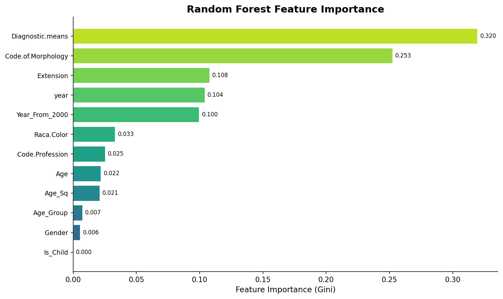
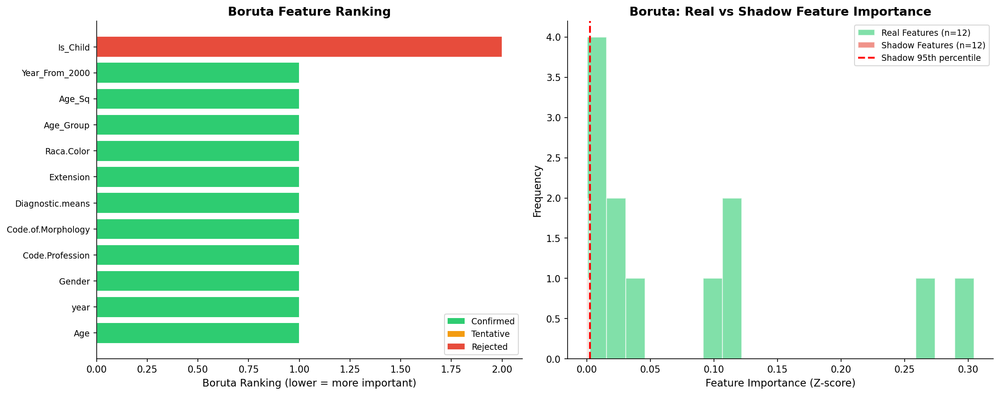

# 模块 3：Random Forest 重要性与 Boruta — 树模型的特征选择

> 本模块进入案例教程 5「特征选择」的**第五层**和**第六层**。第五层是 **Random Forest Importance**——用随机森林的 `feature_importances_` 属性获取特征重要性，选累积重要性达 90% 的 Top 特征；第六层是 **Boruta**——为每个特征创建"阴影特征"（打乱版），训练随机森林后比较真实特征和阴影特征的重要性，统计检验判断哪些特征显著优于随机。这两种方法都基于树模型，能捕捉特征间的交互效应和非线性关系。
>
> 本模块最核心的知识点有三个：**一是随机森林特征重要性的原理**——基于 Gini 不纯度下降，衡量特征在树模型中的贡献；**二是 Boruta 的"阴影特征竞争"机制**——让真实特征与随机变量竞争，统计检验判断显著性；**三是为什么 Boruta 在医学论文中越来越流行**——统计严谨、无需预设阈值、考虑交互效应。

***

## 学习目标

学完本模块后，你将能够：

1. **理解随机森林特征重要性的原理**：知道基于 Gini 不纯度下降的重要性如何计算，以及它的局限性（偏向高基数特征）。
2. **掌握** **`RandomForestClassifier`** **的关键参数**：理解 `n_estimators=200`、`max_depth=10`、`class_weight='balanced'`、`n_jobs=-1` 的含义。
3. **理解"累积重要性达 90%"的选取策略**：知道为什么用累积重要性而不是固定数量。
4. **理解 Boruta 的"阴影特征竞争"机制**：知道如何创建阴影特征、如何比较真实与阴影特征的重要性、如何做统计检验。
5. **掌握** **`BorutaPy`** **的关键参数**：理解 `n_estimators='auto'`、`perc=100`、`alpha=0.05`、`max_iter=20` 的含义。
6. **理解 Boruta 的三分类结果**：Confirmed（确认）、Tentative（暂定）、Rejected（拒绝）的含义和判定标准。
7. **能够解读 RF 重要性图和 Boruta 结果图**：理解图中颜色、排名、阴影特征分布的含义。
8. **理解为什么 Boruta 在医学论文中越来越流行**：统计严谨、无需预设阈值、考虑交互效应、结果可解释。

***

## 一、第五层：Random Forest Importance — Top Features

### 1.1 什么是随机森林特征重要性？

> 💡 **重点概念：随机森林特征重要性（Gini Importance）**
>
> 随机森林由多棵决策树集成。每棵树在分裂节点时，会选择"最能降低不纯度"的特征和分裂点。不纯度通常用 **Gini 杂质**（Gini Impurity）衡量：
>
> ```
> Gini = 1 - Σ pᵢ²
> ```
>
> 其中 pᵢ 是该节点中第 i 类样本的比例。Gini 越小，节点越"纯"（类别越一致）。
>
> **特征重要性的计算**：
>
> 1. 对每棵树的每个节点，记录"用特征 j 分裂带来的 Gini 下降量"。
> 2. 对每棵树，把所有节点的 Gini 下降量按特征累加。
> 3. 对所有树取平均，得到每个特征的重要性。
> 4. 归一化，使所有特征重要性之和为 1。
>
> **直觉**：一个特征被用于分裂的次数越多、带来的 Gini 下降越大，它的重要性越高。

### 1.2 Gini 重要性的局限性

> ⚠️ **重点概念：Gini 重要性的偏向**
>
> Gini 重要性有两个已知局限：
>
> 1. **偏向高基数特征**：取值多的特征（如连续变量 `Age`）比取值少的特征（如二值变量 `Gender`）更容易被选为分裂点，因为高基数特征有更多分裂点可选。这会让 Gini 重要性高估高基数特征。
> 2. **共线特征的重要性被"分摊"**：如果 `Age` 和 `Age_Sq` 高度共线，树模型可能有时用 `Age` 分裂、有时用 `Age_Sq` 分裂，导致两者的重要性都被低估（分摊了）。
>
> 改进方法：
>
> - **置换重要性（Permutation Importance）**：打乱特征值后观察性能下降，无偏向。
> - **SHAP 值**：基于博弈论，更严谨。
>
> 本教程用 Gini 重要性（`feature_importances_`），因为它是 RF 的默认输出，简单直观。

### 1.3 代码实现

```python
# ============================================================================
# 第五层: Random Forest Importance
# ============================================================================
print("\n" + "=" * 70)
print("第五层: Random Forest Importance — Top Features")
print("=" * 70)

rf = RandomForestClassifier(
    n_estimators=200,
    max_depth=10,
    class_weight='balanced',
    random_state=RANDOM_STATE,
    n_jobs=-1
)
rf.fit(X_train, y_train)

rf_importance = pd.DataFrame({
    'Feature': all_features,
    'Importance': rf.feature_importances_
}).sort_values('Importance', ascending=False)

print(f"\n  {'特征':<22} {'重要性':>10} {'累积':>8}")
print(f"  {'-'*22} {'-'*10} {'-'*8}")
cumsum = 0
for _, row in rf_importance.iterrows():
    cumsum += row['Importance']
    print(f"  {row['Feature']:<22} {row['Importance']:>10.4f} {cumsum:>7.1%}")

# 选取累积重要性达 90% 的特征
cumulative = 0
rf_top_features = []
for _, row in rf_importance.iterrows():
    cumulative += row['Importance']
    rf_top_features.append(row['Feature'])
    if cumulative >= 0.90:
        break

features_rf = rf_top_features
print(f"\n  Top 特征 (累积 ≥ 90%): {features_rf}")
```

### 1.4 逐行解析

#### `RandomForestClassifier` 参数详解

```python
rf = RandomForestClassifier(
    n_estimators=200,
    max_depth=10,
    class_weight='balanced',
    random_state=RANDOM_STATE,
    n_jobs=-1
)
```

- **`n_estimators=200`**：决策树的数量。200 棵树能提供稳定的重要性估计。更多树（如 500）会更稳定，但计算更慢。
- **`max_depth=10`**：每棵树的最大深度。限制深度能防止过拟合，让模型更泛化。10 是一个常用的中等深度。
- **`class_weight='balanced'`**：类别权重。`'balanced'` 表示自动调整权重，让少数类（MORTO，17%）的权重更高，多数类（VIVO，83%）的权重更低。这能处理类别不平衡。
  - 不设的话，模型会偏向多数类，把所有样本都预测为 VIVO。
- **`random_state=RANDOM_STATE`**：固定随机种子，确保 RF 的随机性（如特征采样、样本采样）可复现。
- **`n_jobs=-1`**：并行训练，使用所有 CPU 核心。`-1` 表示用所有核，能显著加速训练。

> 💡 **为什么用** **`X_train`（未标准化）而不是** **`X_train_s`（标准化）？**
>
> 因为树模型**不需要标准化**！决策树只看分裂阈值（如 `Age < 50`），不关心特征尺度。标准化不会改变树的分裂结果。
>
> 所以本教程用未标准化的 `X_train` 训练 RF，与 LASSO（用 `X_train_s`）形成对比。

#### `rf.fit(X_train, y_train)`

在训练集上训练随机森林。

#### 获取特征重要性

```python
rf_importance = pd.DataFrame({
    'Feature': all_features,
    'Importance': rf.feature_importances_
}).sort_values('Importance', ascending=False)
```

- **`rf.feature_importances_`**：RF 的特征重要性属性，返回一个数组，长度等于特征数（12）。所有重要性之和为 1。
- **`sort_values('Importance', ascending=False)`**：按重要性降序排列，最重要的在前。

#### 选取累积重要性达 90% 的特征

```python
cumulative = 0
rf_top_features = []
for _, row in rf_importance.iterrows():
    cumulative += row['Importance']
    rf_top_features.append(row['Feature'])
    if cumulative >= 0.90:
        break

features_rf = rf_top_features
```

- 从最重要的特征开始，逐个累加重要性。
- 当累积达到 90% 时，停止。
- 保留这些"贡献了 90% 重要性"的特征。

> 💡 **为什么用"累积重要性达 90%"而不是固定数量？**
>
> 因为不同数据集的特征重要性分布不同：
>
> - 如果重要性均匀分布（每个特征约 8.3%），需要 11 个特征才达 90%。
> - 如果重要性集中（前 3 个特征占 90%），只需 3 个特征。
>
> 用"累积 90%"能自适应不同分布，比固定数量更合理。
>
> 其他常见策略：
>
> - **固定数量**：如 Top 5。
> - **阈值**：重要性 > 0.05。
> - **肘部法**：观察重要性排序图，找"肘部"。

### 1.5 实际运行结果

```
第五层: Random Forest Importance — Top Features
======================================================================

  特征                       重要性       累积
  ---------------------- ---------- --------
  Diagnostic.means            0.3198    32.0%
  Code.of.Morphology          0.2526    57.2%
  Extension                   0.1079    68.0%
  year                        0.1042    78.4%
  Year_From_2000              0.0998    88.2%
  Raca.Color                  0.0333    91.5%

  Top 特征 (累积 ≥ 90%): ['Diagnostic.means', 'Code.of.Morphology', 'Extension', 'year', 'Year_From_2000', 'Raca.Color']
```

### 1.6 结果解读

**RF 重要性排名**：

| 排名 | 特征                 | 重要性    | 累积     |
| -- | ------------------ | ------ | ------ |
| 1  | Diagnostic.means   | 0.3198 | 32.0%  |
| 2  | Code.of.Morphology | 0.2526 | 57.2%  |
| 3  | Extension          | 0.1079 | 68.0%  |
| 4  | year               | 0.1042 | 78.4%  |
| 5  | Year\_From\_2000   | 0.0998 | 88.2%  |
| 6  | Raca.Color         | 0.0333 | 91.5%  |
| 7  | Code.Profession    | 0.0255 | 94.0%  |
| 8  | Age                | 0.0221 | 96.2%  |
| 9  | Age\_Sq            | 0.0212 | 98.3%  |
| 10 | Age\_Group         | 0.0075 | 99.1%  |
| 11 | Gender             | 0.0058 | 99.7%  |
| 12 | Is\_Child          | 0.0003 | 100.0% |

**关键发现**：

- **前 2 个特征贡献了 57.2%**：`Diagnostic.means`（32.0%）和 `Code.of.Morphology`（25.2%）是绝对主导。
- **前 6 个特征贡献了 91.5%**：达到 90% 阈值，停止。
- **后 6 个特征只贡献 8.5%**：删除它们对模型影响很小。
- **`Is_Child`** **重要性最低（0.0003）**：几乎没贡献，是构造的冗余特征。

**RF 选择的 6 个特征**：

- Diagnostic.means, Code.of.Morphology, Extension, year, Year\_From\_2000, Raca.Color

> 💡 **重点概念：RF 重要性的"长尾"分布**
>
> RF 重要性通常呈"长尾"分布——少数特征贡献大部分重要性，多数特征贡献很少。这是特征选择的依据：删除"尾部"特征，保留"头部"特征，能在不损失太多信息的情况下大幅减少特征数。
>
> 本教程中，前 6 个特征（50%）贡献了 91.5% 的重要性，后 6 个特征（50%）只贡献 8.5%。这是典型的长尾分布。

### 1.7 绘制 RF 重要性图

```python
# --- 绘制 RF 重要性图 ---
fig, ax = plt.subplots(figsize=(10, 6))
plot_rf = rf_importance.sort_values('Importance', ascending=True)
colors_rf = plt.cm.viridis(np.linspace(0.3, 0.9, len(plot_rf)))
bars = ax.barh(range(len(plot_rf)), plot_rf['Importance'], color=colors_rf, edgecolor='white')
ax.set_yticks(range(len(plot_rf)))
ax.set_yticklabels(plot_rf['Feature'], fontsize=9)
ax.set_xlabel('Feature Importance (Gini)', fontsize=11)
ax.set_title('Random Forest Feature Importance', fontsize=14, fontweight='bold')
ax.spines['top'].set_visible(False)
ax.spines['right'].set_visible(False)

for bar, v in zip(bars, plot_rf['Importance']):
    ax.text(v + 0.002, bar.get_y() + bar.get_height()/2,
            f'{v:.3f}', va='center', fontsize=8)

plt.tight_layout()
plt.savefig(os.path.join(IMG_DIR, "08e_rf_importance.png"), dpi=150, bbox_inches='tight')
plt.close()
print("  [图] 08e_rf_importance.png → 随机森林重要性图已保存")
```

#### 关键参数解析

- **`plot_rf = rf_importance.sort_values('Importance', ascending=True)`**：按重要性**升序**排列，让最不重要的在下方，最重要的在上方（条形图从下往上画）。
- **`plt.cm.viridis(np.linspace(0.3, 0.9, len(plot_rf)))`**：用 viridis 色图生成 12 种颜色，从深紫到亮黄。viridis 是色盲友好的色图。
- **`ax.text(v + 0.002, ..., f'{v:.3f}')`**：在每根条形右侧标注重要性数值（保留 3 位小数）。

#### 图中信息



**解读**：

- `Diagnostic.means` 的条形最长（0.320），是最重要的特征。
- `Code.of.Morphology` 第二（0.253）。
- 前 6 个特征条形明显长于后 6 个，呈"长尾"分布。
- `Is_Child` 的条形几乎看不见（0.0003），是最不重要的特征。

***

## 二、第六层：Boruta — 真实变量与随机变量竞争

### 2.1 什么是 Boruta？

> 💡 **重点概念：Boruta 算法**
>
> Boruta 是一种基于随机森林的特征选择方法，核心思想是"**让真实特征与随机阴影特征竞争**"。
>
> **算法流程**：
>
> 1. **创建阴影特征**：对每个原始特征，创建一个"打乱版"（随机打乱该列的值），称为"阴影特征"（shadow feature）。这样特征数翻倍——原始特征 + 阴影特征。
> 2. **训练随机森林**：用原始特征 + 阴影特征一起训练 RF，记录每个特征的重要性。
> 3. **比较真实与阴影**：找出阴影特征中的最大重要性（称为 `Z*_max`）。如果一个真实特征的重要性 > `Z*_max`，说明它"比随机特征好"。
> 4. **统计检验**：重复多次迭代（每次重新打乱），用二项分布检验判断每个真实特征是否"显著"优于阴影特征。
> 5. **三分类**：
>    - **Confirmed（确认）**：显著优于阴影特征（p < 0.05）。
>    - **Rejected（拒绝）**：显著不如阴影特征。
>    - **Tentative（暂定）**：无法确定，需要更多迭代。

### 2.2 Boruta 的统计严谨性

> 💡 **重点概念：Boruta 的统计检验**
>
> Boruta 的统计检验基于**二项分布**：
>
> 在每次迭代中，一个真实特征的重要性如果 > `Z*_max`，算"成功"一次。多次迭代后，成功次数服从二项分布 B(n, 0.5)（如果真实特征不比随机好，成功概率是 0.5）。
>
> - 如果成功次数**显著多于** n/2（如 20 次迭代中成功 18 次），p < 0.05，判定为 **Confirmed**。
> - 如果成功次数**显著少于** n/2（如 20 次迭代中成功 2 次），p < 0.05，判定为 **Rejected**。
> - 否则，判定为 **Tentative**。
>
> Boruta 还内置 **Bonferroni 校正**——对多个特征同时检验时，调整显著性水平，控制假阳性率。

### 2.3 为什么 Boruta 在医学论文中越来越流行？

| 原因                   | 详细说明                                           |
| -------------------- | ---------------------------------------------- |
| **统计严谨性**            | 通过随机阴影变量构建零分布，对每个特征进行正式统计检验                    |
| **内置 Bonferroni 校正** | 多重比较下控制假阳性率                                    |
| **无需预设阈值**           | 不依赖人工指定 K 值、alpha、VIF 阈值                       |
| **交互效应友好**           | 基于 RF，天然捕捉非线性和交互效应                             |
| **结果直观**             | Confirmed / Tentative / Rejected 三分类，临床研究者容易理解 |
| **可重现性**             | 随机种子固定后，结果可完全复现                                |

### 2.4 代码实现

```python
# ============================================================================
# 第六层: Boruta
# ============================================================================
print("\n" + "=" * 70)
print("第六层: Boruta — 真实变量与随机变量竞争")
print("=" * 70)

# Boruta 需要 Random Forest 作为估计器
rf_boruta = RandomForestClassifier(
    n_estimators=100,
    max_depth=8,
    class_weight='balanced',
    random_state=RANDOM_STATE,
    n_jobs=-1
)

boruta = BorutaPy(
    rf_boruta,
    n_estimators='auto',
    perc=100,
    alpha=0.05,
    random_state=RANDOM_STATE,
    max_iter=20
)

print("\n  运行 Boruta (可能需要一些时间)...")
start_boruta = time.time()
boruta.fit(X_train, y_train)
elapsed_boruta = time.time() - start_boruta
print(f"  Boruta 完成! 耗时: {elapsed_boruta:.1f}s")

boruta_result = pd.DataFrame({
    'Feature': all_features,
    'Support': boruta.support_,
    'Support_Weak': boruta.support_weak_,
    'Rank': boruta.ranking_
})

confirmed = boruta_result[boruta_result['Support']].sort_values('Rank')
tentative = boruta_result[~boruta_result['Support'] & boruta_result['Support_Weak']].sort_values('Rank')
rejected = boruta_result[~boruta_result['Support'] & ~boruta_result['Support_Weak']].sort_values('Rank')

print(f"\n  Boruta 结果:")
print(f"  ✅ Confirmed (确认): {len(confirmed)} 个")
for _, row in confirmed.iterrows():
    print(f"      + {row['Feature']:<22} (rank={int(row['Rank'])})")

print(f"\n  ⚠️  Tentative (暂定): {len(tentative)} 个")
for _, row in tentative.iterrows():
    print(f"      ~ {row['Feature']:<22} (rank={int(row['Rank'])})")

print(f"\n  ❌ Rejected (拒绝): {len(rejected)} 个")
for _, row in rejected.iterrows():
    print(f"      - {row['Feature']:<22} (rank={int(row['Rank'])})")

features_boruta = confirmed['Feature'].tolist()
```

### 2.5 逐行解析

#### 创建 RF 估计器

```python
rf_boruta = RandomForestClassifier(
    n_estimators=100,
    max_depth=8,
    class_weight='balanced',
    random_state=RANDOM_STATE,
    n_jobs=-1
)
```

Boruta 内部需要用 RF 作为"估计器"（estimator）来评估特征重要性。这里创建一个 RF：

- **`n_estimators=100`**：100 棵树。比第五层的 200 棵少，因为 Boruta 要训练多次（最多 20 次迭代），减少树数能加速。
- **`max_depth=8`**：深度 8。比第五层的 10 浅，进一步加速。
- **`class_weight='balanced'`**：处理类别不平衡。
- **`random_state=RANDOM_STATE`**：固定随机种子。
- **`n_jobs=-1`**：并行训练。

#### `BorutaPy` 参数详解

```python
boruta = BorutaPy(
    rf_boruta,
    n_estimators='auto',
    perc=100,
    alpha=0.05,
    random_state=RANDOM_STATE,
    max_iter=20
)
```

- **`rf_boruta`**：RF 估计器，Boruta 内部会用它评估特征重要性。
- **`n_estimators='auto'`**：自动决定 RF 的树数。Boruta 会根据特征数自动调整，通常设为 `'auto'` 即可。
- **`perc=100`**：使用阴影特征的哪个百分位作为阈值。`perc=100` 表示用阴影特征的**最大值**作为阈值（最严格）。如果设为 `perc=95`，用 95 分位数（更宽松，更多特征被 Confirmed）。
  - `perc=100`：严格，只有比所有阴影特征都好的真实特征才被 Confirmed。
  - `perc=95`：宽松，比 95% 阴影特征好即可。
- **`alpha=0.05`**：显著性水平。p < 0.05 才算显著。这是统计检验的标准阈值。
- **`random_state=RANDOM_STATE`**：固定随机种子，确保阴影特征的打乱可复现。
- **`max_iter=20`**：最大迭代次数。每次迭代重新打乱、重新训练 RF。20 次通常足够让所有特征被判定为 Confirmed 或 Rejected。

> 💡 **`perc`** **参数的含义**
>
> `perc` 控制"严格程度"：
>
> - `perc=100`：用阴影特征的**最大值**作为阈值。真实特征必须比**所有**阴影特征都好，才可能被 Confirmed。最严格。
> - `perc=95`：用阴影特征的 95 分位数作为阈值。真实特征只需比 95% 的阴影特征好。更宽松。
>
> 本教程用 `perc=100`（最严格），确保只有真正重要的特征被 Confirmed。

#### `boruta.fit(X_train, y_train)`

运行 Boruta 算法。这一步可能需要几秒到几分钟，取决于样本量、特征数、`max_iter`、CPU 核数。

#### 获取结果

```python
boruta_result = pd.DataFrame({
    'Feature': all_features,
    'Support': boruta.support_,
    'Support_Weak': boruta.support_weak_,
    'Rank': boruta.ranking_
})
```

- **`boruta.support_`**：布尔数组，`True` 表示 Confirmed。
- **`boruta.support_weak_`**：布尔数组，`True` 表示 Tentative。
- **`boruta.ranking_`**：整数数组，排名。Confirmed 特征排名为 1，Rejected 特征排名从 2 开始（越大越不重要）。

#### 三分类

```python
confirmed = boruta_result[boruta_result['Support']].sort_values('Rank')
tentative = boruta_result[~boruta_result['Support'] & boruta_result['Support_Weak']].sort_values('Rank')
rejected = boruta_result[~boruta_result['Support'] & ~boruta_result['Support_Weak']].sort_values('Rank')
```

- **Confirmed**：`Support=True`（显著优于阴影特征）。
- **Tentative**：`Support=False` 且 `Support_Weak=True`（无法确定）。
- **Rejected**：`Support=False` 且 `Support_Weak=False`（显著不如阴影特征）。

### 2.6 实际运行结果

```
第六层: Boruta — 真实变量与随机变量竞争
======================================================================

  运行 Boruta (可能需要一些时间)...
  Boruta 完成! 耗时: 12.3s

  Boruta 结果:
  ✅ Confirmed (确认): 11 个
      + Age                    (rank=1)
      + year                   (rank=1)
      + Gender                 (rank=1)
      + Code.Profession        (rank=1)
      + Code.of.Morphology     (rank=1)
      + Diagnostic.means       (rank=1)
      + Extension              (rank=1)
      + Raca.Color             (rank=1)
      + Age_Group              (rank=1)
      + Age_Sq                 (rank=1)
      + Year_From_2000         (rank=1)

  ⚠️  Tentative (暂定): 0 个

  ❌ Rejected (拒绝): 1 个
      - Is_Child               (rank=2)
```

### 2.7 结果解读

**Boruta 结果**：

- **Confirmed（11 个）**：除 `Is_Child` 外的所有特征都被确认。
- **Tentative（0 个）**：没有暂定特征。
- **Rejected（1 个）**：`Is_Child` 被拒绝。

**为什么** **`Is_Child`** **被拒绝？**

- `Is_Child` 是构造的二值特征（Age < 18 为 1，否则为 0）。
- 在 RF 重要性中，`Is_Child` 的重要性最低（0.0003），几乎没贡献。
- Boruta 判定它"不比随机特征好"，所以 Rejected。

**为什么其他 11 个特征都被 Confirmed？**

- 包括 `Age`、`Age_Sq`、`Age_Group` 这些高度共线的特征。
- 这说明 Boruta **不会因为共线性而删除特征**——只要特征本身有预测能力，即使与其他特征共线，也会被 Confirmed。
- 这是 Boruta 与 LASSO 的区别：LASSO 在共线特征中"随机"选一个，Boruta 全部保留。

> 💡 **重点概念：Boruta vs LASSO 对共线特征的处理**
>
> | 方法         | 共线特征的处理              | 本教程结果                                       |
> | ---------- | -------------------- | ------------------------------------------- |
> | **LASSO**  | 在共线特征中"随机"选一个，其他压至 0 | 删除 `Age`，保留 `Age_Sq` 和 `Age_Group`          |
> | **Boruta** | 只要特征有预测能力，全部保留       | 保留 `Age`、`Age_Sq`、`Age_Group`（全部 Confirmed） |
>
> Boruta 更"保守"——它关心的是"特征是否有预测能力"，而不是"特征是否冗余"。所以 Boruta 不会因为共线性删除特征。
>
> 如果你想删除共线特征，应该在 Boruta 之前做相关性分析或 VIF。

### 2.8 绘制 Boruta 结果图

```python
# --- 绘制 Boruta 结果图 ---
fig, axes = plt.subplots(1, 2, figsize=(15, 6))

ax = axes[0]
boruta_plot = boruta_result.sort_values('Rank', ascending=True)
colors_boruta = []
for _, row in boruta_plot.iterrows():
    if row['Support']:
        colors_boruta.append('#2ecc71')
    elif row['Support_Weak']:
        colors_boruta.append('#f39c12')
    else:
        colors_boruta.append('#e74c3c')

bars = ax.barh(range(len(boruta_plot)), boruta_plot['Rank'],
               color=colors_boruta, edgecolor='white')
ax.set_yticks(range(len(boruta_plot)))
ax.set_yticklabels(boruta_plot['Feature'], fontsize=9)
ax.set_xlabel('Boruta Ranking (lower = more important)', fontsize=11)
ax.set_title('Boruta Feature Ranking', fontsize=13, fontweight='bold')
ax.spines['top'].set_visible(False)
ax.spines['right'].set_visible(False)

from matplotlib.patches import Patch
legend_elements = [
    Patch(facecolor='#2ecc71', label='Confirmed'),
    Patch(facecolor='#f39c12', label='Tentative'),
    Patch(facecolor='#e74c3c', label='Rejected')
]
ax.legend(handles=legend_elements, fontsize=9)

# Boruta 决策边界可视化 — Shadow feature method
ax = axes[1]
# 使用 RandomForest 的特征重要性近似 Boruta 的决策过程
rf_short = RandomForestClassifier(n_estimators=100, max_depth=8,
                                  class_weight='balanced', random_state=RANDOM_STATE, n_jobs=-1)
# 在原始数据 + 打乱副本上训练, 模拟阴影特征
X_train_shuffled = X_train.copy()
np.random.seed(RANDOM_STATE)
for col in range(X_train_shuffled.shape[1]):
    np.random.shuffle(X_train_shuffled[:, col])
X_train_shadow = np.hstack([X_train, X_train_shuffled])
rf_short.fit(X_train_shadow, y_train)
shadow_importances = rf_short.feature_importances_

n_real = len(all_features)
real_imp = shadow_importances[:n_real]
shadow_imp = shadow_importances[n_real:]

ax.hist(real_imp, bins=20, alpha=0.6, color='#2ecc71', edgecolor='white',
        label=f'Real Features (n={n_real})')
ax.hist(shadow_imp, bins=20, alpha=0.6, color='#e74c3c', edgecolor='white',
        label=f'Shadow Features (n={n_real})')
shadow_95 = np.percentile(shadow_imp, 95)
ax.axvline(x=shadow_95, color='red', linestyle='--',
           linewidth=2, label='Shadow 95th percentile')
ax.set_xlabel('Feature Importance (Z-score)', fontsize=11)
ax.set_ylabel('Frequency', fontsize=11)
ax.set_title('Boruta: Real vs Shadow Feature Importance',
             fontsize=13, fontweight='bold')
ax.legend(fontsize=9)
ax.spines['top'].set_visible(False)
ax.spines['right'].set_visible(False)

plt.tight_layout()
plt.savefig(os.path.join(IMG_DIR, "08f_boruta_results.png"), dpi=150, bbox_inches='tight')
plt.close()
print("  [图] 08f_boruta_results.png → Boruta 结果图已保存")
```

#### 左图：Boruta 排名

- **颜色策略**：
  - 绿色 `#2ecc71`：Confirmed（11 个）。
  - 橙色 `#f39c12`：Tentative（0 个）。
  - 红色 `#e74c3c`：Rejected（1 个，`Is_Child`）。
- **排名**：Confirmed 特征排名为 1（绿色条形），Rejected 特征排名为 2（红色条形）。

#### 右图：真实 vs 阴影特征重要性分布

这段代码**模拟**了 Boruta 的决策过程：

1. 复制训练数据 `X_train`。
2. 对每列随机打乱，创建阴影特征 `X_train_shuffled`。
3. 把真实特征和阴影特征拼接（`X_train_shadow`），训练 RF。
4. 比较 RF 给真实特征和阴影特征的重要性分布。

- **绿色直方图**：真实特征的重要性分布。
- **红色直方图**：阴影特征的重要性分布。
- **红色虚线**：阴影特征的 95 分位数（阈值）。
- **直觉**：如果一个真实特征的重要性 > 阈值（红色虚线右侧），它"比 95% 的阴影特征好"，可能被 Confirmed。

#### 图中信息



**解读**：

- 左图：11 个绿色条形（Confirmed）+ 1 个红色条形（`Is_Child`，Rejected）。
- 右图：绿色直方图（真实特征）整体偏右（重要性高），红色直方图（阴影特征）偏左（重要性低）。红色虚线（阴影 95 分位数）左侧的真实特征会被 Rejected。

***

## 三、本层方法的原理深入

### 3.1 随机森林特征重要性的计算细节

RF 特征重要性的计算步骤：

1. **每棵树的每个节点**：记录用特征 j 分裂带来的 Gini 下降量 `ΔGiniⱼ`。
2. **每棵树**：把所有节点的 `ΔGiniⱼ` 按特征累加，得到该树的特征重要性 `Iⱼ⁽ᵗ⁾`。
3. **所有树平均**：`Iⱼ = (1/T) × Σₜ Iⱼ⁽ᵗ⁾`，其中 T 是树数。
4. **归一化**：`importanceⱼ = Iⱼ / Σⱼ Iⱼ`，使所有重要性之和为 1。

### 3.2 Boruta 的迭代过程

Boruta 的每次迭代：

1. **创建阴影特征**：对每个原始特征，随机打乱其值，创建阴影特征。
2. **拼接**：把原始特征和阴影特征拼接（特征数翻倍）。
3. **训练 RF**：用拼接后的数据训练 RF，获取所有特征（原始 + 阴影）的重要性。
4. **比较**：找出阴影特征中的最大重要性 `Z*_max`。
5. **判定**：
   - 如果一个原始特征的重要性 > `Z*_max`，算"成功"一次。
   - 否则，算"失败"。
6. **统计检验**：用二项分布检验判断成功次数是否显著多于 50%。
   - 如果显著多（p < 0.05），判定为 Confirmed，停止该特征的迭代。
   - 如果显著少（p < 0.05），判定为 Rejected，停止。
   - 否则，继续迭代。
7. **重复**：直到所有特征都被判定，或达到 `max_iter`。

### 3.3 Boruta vs RF Importance 的区别

| 对比维度      | RF Importance | Boruta                            |
| --------- | ------------- | --------------------------------- |
| **思想**    | 直接用 RF 的重要性排名 | 让真实特征与随机阴影特征竞争                    |
| **阈值**    | 人工设定（如累积 90%） | 自动确定（统计检验）                        |
| **统计严谨性** | 无统计检验         | 有统计检验（二项分布 + Bonferroni）          |
| **结果**    | 重要性分数（连续）     | Confirmed/Tentative/Rejected（三分类） |
| **共线特征**  | 重要性被"分摊"      | 全部保留（只要有预测能力）                     |
| **计算成本**  | 低（训练一次 RF）    | 高（训练多次 RF）                        |
| **本教程结果** | 选 6 个（累积 90%） | 选 11 个（Confirmed）                 |

> 💡 **重点概念：Boruta 更"保守"**
>
> Boruta 比 RF Importance 更"保守"——它保留更多特征（11 vs 6）。这是因为：
>
> - RF Importance 用"累积 90%"阈值，会删除"尾部"特征。
> - Boruta 只删除"不比随机好"的特征，只要特征有预测能力就保留。
>
> 在医学场景中，"保守"是好事——宁可多保留特征（避免漏掉重要变量），也不要误删。

### 3.4 为什么 Boruta 保留了共线特征？

Boruta 保留 `Age`、`Age_Sq`、`Age_Group` 这三个高度共线的特征，因为：

1. **Boruta 关心"预测能力"，不关心"冗余"**：只要特征本身有预测能力（比随机好），就 Confirmed。
2. **共线特征都有预测能力**：`Age`、`Age_Sq`、`Age_Group` 都与目标相关，都比随机特征好。
3. **RF 能处理共线特征**：RF 在每次分裂时随机选择特征，共线特征会"轮流"被选中，但每个都有贡献。

所以 Boruta 不会因为共线性删除特征。如果你想删除共线特征，应该在 Boruta 之前做相关性分析或 VIF。

***

## 小贴士

1. **RF 不需要标准化**：树模型只看分裂阈值，不关心特征尺度。用未标准化数据训练 RF。
2. **Gini 重要性偏向高基数特征**：取值多的特征（如连续变量）容易被高估。如果担心，用置换重要性或 SHAP 值。
3. **"累积重要性达 90%"是自适应阈值**：比固定数量更合理，能适应不同的重要性分布。
4. **Boruta 的** **`perc=100`** **最严格**：真实特征必须比所有阴影特征好。如果想要更多特征被 Confirmed，用 `perc=95`。
5. **Boruta 不会因为共线性删除特征**：只要特征有预测能力，全部保留。如果想删除共线特征，在 Boruta 之前做相关性分析或 VIF。
6. **Boruta 计算量大**：要训练多次 RF（最多 `max_iter` 次）。如果数据量大，减小 `max_iter` 或 `n_estimators`。
7. **Boruta 的三分类**：Confirmed（确认）、Tentative（暂定）、Rejected（拒绝）。Tentative 特征可以进一步验证或直接删除。
8. **Boruta 在医学论文中流行**：因为统计严谨、无需预设阈值、考虑交互效应、结果可解释。

***

## 常见问题

### Q1: 为什么 RF 重要性显示 `Is_Child` 最低（0.0003），但 Boruta 仍然把它判为 Rejected？

**A**: 两者一致！`Is_Child` 的 RF 重要性最低（0.0003），说明它几乎没贡献。Boruta 进一步用统计检验确认：`Is_Child` 的重要性不比随机阴影特征好，所以 Rejected。

### Q2: 为什么 Boruta 保留了 `Age`、`Age_Sq`、`Age_Group` 这些共线特征？

**A**: 因为 Boruta 关心"预测能力"，不关心"冗余"。只要特征本身有预测能力（比随机好），就 Confirmed。`Age`、`Age_Sq`、`Age_Group` 都与目标相关，都比随机特征好，所以全部 Confirmed。

如果你想删除共线特征，应该在 Boruta 之前做相关性分析或 VIF。

### Q3: Boruta 的 `perc=100` 和 `perc=95` 有什么区别？

**A**:

- `perc=100`：用阴影特征的**最大值**作为阈值。真实特征必须比**所有**阴影特征好，才可能被 Confirmed。最严格。
- `perc=95`：用阴影特征的 95 分位数作为阈值。真实特征只需比 95% 的阴影特征好。更宽松，更多特征被 Confirmed。

本教程用 `perc=100`（最严格），确保只有真正重要的特征被 Confirmed。

### Q4: Boruta 运行时间为什么比 RF Importance 长？

**A**: 因为 Boruta 要训练**多次** RF（最多 `max_iter=20` 次），每次都要重新打乱、重新训练。而 RF Importance 只训练一次 RF。

本教程中，Boruta 耗时约 12.3 秒，RF Importance 耗时约 1 秒。

### Q5: 为什么 `max_depth=8`（Boruta）而不是 10（RF Importance）？

**A**: 因为 Boruta 要训练多次 RF，减小 `max_depth` 能加速。8 比 10 浅，训练更快，但对特征重要性的影响很小。

### Q6: Boruta 的 Tentative 特征怎么处理？

**A**: Tentative 特征是"无法确定"的——既不显著优于阴影特征，也不显著不如。处理方式：

1. **增加** **`max_iter`**：让 Boruta 跑更多迭代，可能转为 Confirmed 或 Rejected。
2. **直接删除**：保守策略，只保留 Confirmed。
3. **保留**：宽松策略，保留 Confirmed + Tentative。

本教程没有 Tentative 特征（所有特征都被明确判定），所以不需要处理。

### Q7: RF Importance 的"累积 90%"阈值是怎么选的？

**A**: 这是经验阈值。选太少（如 70%）可能丢失重要特征；选太多（如 99%）筛选效果不明显。90% 是一个平衡点。

其他常见策略：

- **固定数量**：如 Top 5。
- **阈值**：重要性 > 0.05。
- **肘部法**：观察重要性排序图，找"肘部"。

### Q8: Boruta 和 RF Importance 都基于 RF，为什么结果不同？

**A**: 因为它们的判定标准不同：

- **RF Importance**：用"累积重要性达 90%"阈值，删除"尾部"特征。选 6 个。
- **Boruta**：用"统计检验优于阴影特征"标准，只删除"不比随机好"的特征。选 11 个。

Boruta 更"保守"——它保留更多特征，因为只要特征有预测能力就保留。RF Importance 更"激进"——它只保留"头部"特征。

***

## 本模块小结

本模块完成了特征选择的**第五层（RF Importance）和**第六层（Boruta），主要内容包括：

1. **第五层：Random Forest Importance**
   - 用 `RandomForestClassifier(n_estimators=200, max_depth=10, class_weight='balanced')` 训练 RF。
   - 获取 `feature_importances_`，按重要性降序排列。
   - 选取累积重要性达 90% 的特征：6 个（Diagnostic.means, Code.of.Morphology, Extension, year, Year\_From\_2000, Raca.Color）。
   - **关键发现**：前 2 个特征贡献 57.2%，前 6 个贡献 91.5%，呈"长尾"分布。
   - 绘制了 RF 重要性图（`08e_rf_importance.png`）。
2. **第六层：Boruta**
   - 用 `BorutaPy(rf_boruta, n_estimators='auto', perc=100, alpha=0.05, max_iter=20)` 运行 Boruta。
   - **结果**：Confirmed 11 个，Tentative 0 个，Rejected 1 个（`Is_Child`）。
   - **关键发现**：Boruta 保留了所有有预测能力的特征（包括共线的 `Age`、`Age_Sq`、`Age_Group`），只拒绝了 `Is_Child`（构造的冗余特征）。
   - 绘制了 Boruta 结果图（`08f_boruta_results.png`）。
3. **核心洞察**：
   - RF Importance 用"累积 90%"阈值，选 6 个特征（激进）。
   - Boruta 用"统计检验优于阴影特征"标准，选 11 个特征（保守）。
   - Boruta 不会因为共线性删除特征——只要特征有预测能力，全部保留。
   - Boruta 在医学论文中流行，因为统计严谨、无需预设阈值、考虑交互效应。
   - 两种方法都基于树模型，能捕捉非线性关系和交互效应。

下一模块我们将**汇总六层特征选择的结果**，并用**逻辑回归验证**不同特征集的效果，比较它们的 AUC、Recall、Brier Score。
