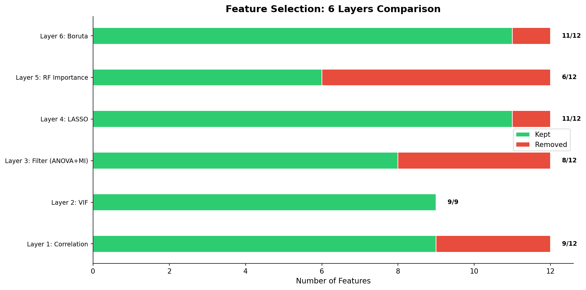
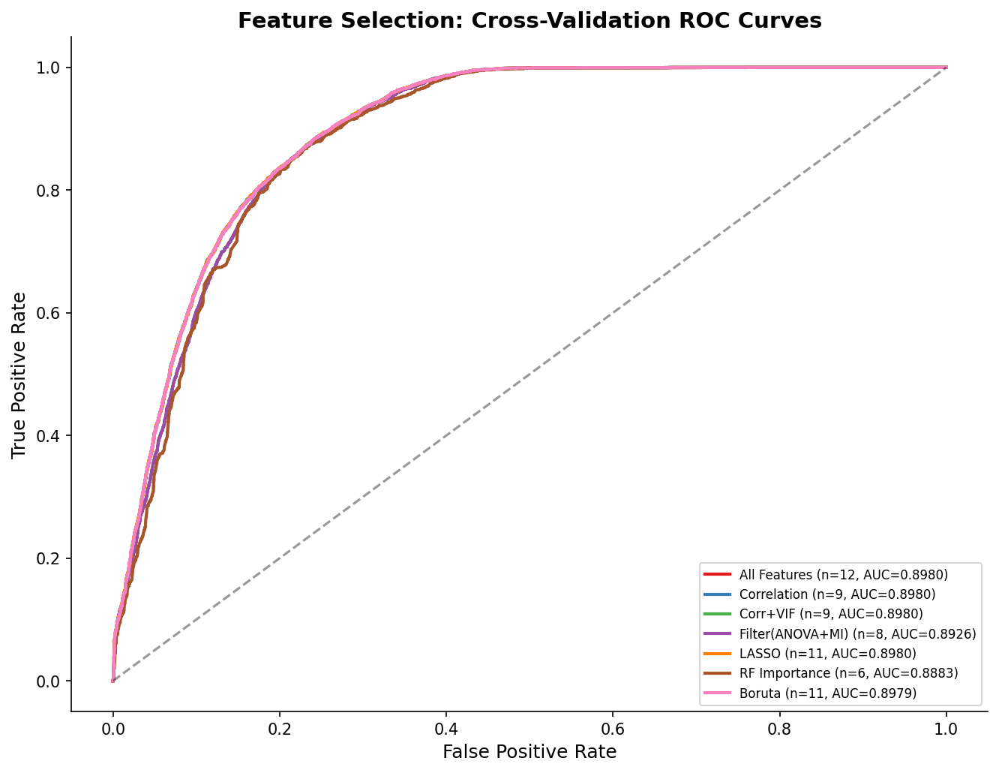
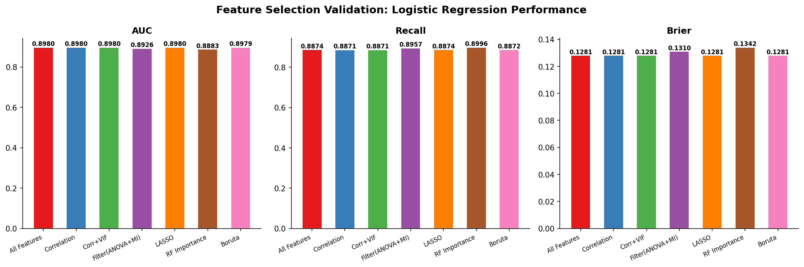

# 模块 4：六层汇总对比与逻辑回归验证

> 本模块是案例教程 5「特征选择」的**收官模块**。我们将汇总前五个模块的六层特征选择结果，用统一的逻辑回归模型验证不同特征集的效果，比较它们的 AUC、Recall、Brier Score，回答核心问题：**特征选择后性能会下降吗？哪种方法选出的特征集最优？**
>
> 本模块最核心的知识点有三个：**一是六层方法的汇总对比**——理解每种方法选了多少特征、保留了哪些；**二是用统一模型验证不同特征集**——为什么用逻辑回归而不是其他模型，以及 AUC/Recall/Brier 三个指标的互补性；**三是"降维不降质"的核心发现**——9 个特征可以达到 12 个全特征的性能水平，6 个特征 AUC 也仅下降约 1%。

***

## 学习目标

学完本模块后，你将能够：

1. **理解六层特征选择方法的汇总对比**：知道每层方法选了多少特征、保留了哪些、删除了哪些。
2. **掌握用统一模型验证不同特征集的方法**：理解为什么用逻辑回归作为统一评估模型，以及如何隔离"特征集"这个变量。
3. **理解 AUC、Recall、Brier 三个指标的互补性**：AUC 看区分能力，Recall 看正类识别，Brier 看概率校准。
4. **能够解读 ROC 曲线对比图**：理解不同特征集的 ROC 曲线差异，以及 AUC 数值的含义。
5. **理解"降维不降质"的核心发现**：知道为什么 9 个特征可以达到 12 个全特征的性能水平。
6. **理解不同方法的"保守程度"差异**：知道 RF Importance 最激进（选 6 个），Boruta 最保守（选 11 个）。
7. **能够设计特征选择的组合策略**：知道如何结合多种方法做最终决策。
8. **理解特征选择后性能为什么没有下降**：从冗余特征、线性模型局限性、信息论角度解释。

***

## 一、六层特征选择结果汇总

### 1.1 汇总代码

```python
# ============================================================================
# 汇总: 各层筛选结果对比
# ============================================================================
print("\n" + "=" * 70)
print("汇总: 六层特征选择结果对比")
print("=" * 70)

selection_summary = {
    'Layer 1: Correlation': {
        '保留': len(features_after_corr),
        '删除': n_feat - len(features_after_corr),
        '保留特征': features_after_corr
    },
    'Layer 2: VIF': {
        '保留': len(features_after_vif),
        '删除': len(features_after_corr) - len(features_after_vif),
        '保留特征': features_after_vif
    },
    'Layer 3: Filter (ANOVA+MI)': {
        '保留': len(top_filter_features),
        '删除': n_feat - len(top_filter_features),
        '保留特征': top_filter_features
    },
    'Layer 4: LASSO': {
        '保留': len(features_lasso),
        '删除': n_feat - len(features_lasso),
        '保留特征': features_lasso
    },
    'Layer 5: RF Importance': {
        '保留': len(features_rf),
        '删除': n_feat - len(features_rf),
        '保留特征': features_rf
    },
    'Layer 6: Boruta': {
        '保留': len(features_boruta),
        '删除': n_feat - len(features_boruta),
        '保留特征': features_boruta
    }
}

print(f"\n  {'方法':<30} {'保留':>6} {'删除':>6}")
print(f"  {'-'*30} {'-'*6} {'-'*6}")
for method, info in selection_summary.items():
    print(f"  {method:<30} {info['保留']:>6} {info['删除']:>6}")
```

### 1.2 汇总结果

```
汇总: 六层特征选择结果对比
======================================================================

  方法                              保留    删除
  ------------------------------ ------ ------
  Layer 1: Correlation                9      3
  Layer 2: VIF                        9      0
  Layer 3: Filter (ANOVA+MI)          8      4
  Layer 4: LASSO                     11      1
  Layer 5: RF Importance              6      6
  Layer 6: Boruta                    11      1
```

### 1.3 各层保留的特征详情

| 层  | 方法     | 保留     | 删除 | 保留的特征                                                                                                                                             |
| -- | ------ | ------ | -- | ------------------------------------------------------------------------------------------------------------------------------------------------- |
| 原始 | —      | 12     | 0  | Age, year, Gender, Code.Profession, Code.of.Morphology, Diagnostic.means, Extension, Raca.Color, Age\_Group, Age\_Sq, Year\_From\_2000, Is\_Child |
| 1  | 相关性    | **9**  | 3  | Gender, Code.Profession, Code.of.Morphology, Diagnostic.means, Extension, Raca.Color, Age\_Sq, Year\_From\_2000, Is\_Child                        |
| 2  | VIF    | **9**  | 0  | （与 Layer 1 相同）                                                                                                                                    |
| 3  | Filter | **8**  | 4  | Diagnostic.means, year, Year\_From\_2000, Extension, Code.of.Morphology, Age, Raca.Color, Age\_Sq                                                 |
| 4  | LASSO  | **11** | 1  | Diagnostic.means, Extension, year, Code.of.Morphology, Code.Profession, Age\_Sq, Raca.Color, Is\_Child, Gender, Age\_Group, Year\_From\_2000      |
| 5  | RF     | **6**  | 6  | Diagnostic.means, Code.of.Morphology, Extension, year, Year\_From\_2000, Raca.Color                                                               |
| 6  | Boruta | **11** | 1  | Age, year, Gender, Code.Profession, Code.of.Morphology, Diagnostic.means, Extension, Raca.Color, Age\_Group, Age\_Sq, Year\_From\_2000            |

### 1.4 各层方法的"保守程度"

按保留特征数从少到多排序：

1. **RF Importance（6 个）**：最激进，只保留"头部"特征。
2. **Filter（8 个）**：较激进，删除"尾部"特征。
3. **Correlation / VIF（9 个）**：中等，只删除高度共线特征。
4. **LASSO / Boruta（11 个）**：最保守，只删除最不重要的特征。

> 💡 **重点概念：不同方法的"保守程度"**
>
> - **激进方法**（RF、Filter）：删除更多特征，模型更简单，但可能丢失信息。
> - **保守方法**（LASSO、Boruta）：保留更多特征，信息损失小，但模型更复杂。
>
> 在医学场景中，通常倾向"保守"——宁可多保留特征（避免漏掉重要变量），也不要误删。所以 Boruta 在医学论文中流行。

### 1.5 绘制六层汇总图

```python
# --- 绘制六层汇总图 ---
fig, ax = plt.subplots(figsize=(12, 6))

all_methods = list(selection_summary.keys())
y_pos = np.arange(len(all_methods))
kept = [selection_summary[m]['保留'] for m in all_methods]
removed = [selection_summary[m]['删除'] for m in all_methods]

ax.barh(y_pos, kept, height=0.4, color='#2ecc71', edgecolor='white', label='Kept')
ax.barh(y_pos, removed, height=0.4, left=kept,
        color='#e74c3c', edgecolor='white', label='Removed')
ax.set_yticks(y_pos)
ax.set_yticklabels(all_methods, fontsize=9)
ax.set_xlabel('Number of Features', fontsize=11)
ax.set_title('Feature Selection: 6 Layers Comparison', fontsize=14, fontweight='bold')
ax.legend(fontsize=10)

for i, (k, r) in enumerate(zip(kept, removed)):
    ax.text(k + r + 0.3, i, f'{k}/{k+r}', va='center', fontsize=9, fontweight='bold')

ax.spines['top'].set_visible(False)
ax.spines['right'].set_visible(False)
plt.tight_layout()
plt.savefig(os.path.join(IMG_DIR, "08g_selection_summary.png"), dpi=150, bbox_inches='tight')
plt.close()
print("  [图] 08g_selection_summary.png → 六层选择汇总图已保存")
```

#### 图中信息



**解读**：

- 绿色条形：保留的特征数。
- 红色条形：删除的特征数。
- RF Importance 删除最多（6 个），Boruta/LASSO 删除最少（1 个）。
- 每根条形右侧标注"保留/总数"，如 `6/12`、`11/12`。

***

## 二、逻辑回归验证各层效果

### 2.1 为什么用逻辑回归验证？

> 💡 **重点概念：统一模型验证**
>
> 为了公平比较不同特征集的效果，我们需要用**同一个模型**训练和评估。本教程选择逻辑回归，原因：
>
> 1. **线性模型，对特征选择敏感**：逻辑回归是线性模型，特征选择对它的影响更明显。如果用 RF（非线性模型），RF 自己就能做特征选择（通过分裂），特征选择的影响会被"掩盖"。
> 2. **快速、稳定**：逻辑回归训练快，结果稳定，适合做大量对比实验。
> 3. **可解释**：逻辑回归的系数可以直接解释特征的影响方向和大小。
> 4. **与前序教程一致**：案例教程 3、4 都用逻辑回归作为评估模型，便于跨案例比较。
>
> **关键**：所有特征集都喂给**同一个逻辑回归**（相同超参数），只改变特征集，这样能隔离出"特征集"这个变量对性能的影响。

### 2.2 验证代码

```python
# ============================================================================
# 最终: 逻辑回归验证各层效果
# ============================================================================
print("\n" + "=" * 70)
print("验证: 各层选择的特征集在 Logistic Regression 上的表现")
print("=" * 70)

feature_sets = {
    'All Features': all_features,
    'Correlation': features_after_corr,
    'Corr+VIF': features_after_vif,
    'Filter(ANOVA+MI)': top_filter_features,
    'LASSO': features_lasso,
    'RF Importance': features_rf,
    'Boruta': features_boruta
}

validation_results = []

fig, ax_roc = plt.subplots(figsize=(9, 7))
colors_val = plt.cm.Set1(np.linspace(0, 0.8, len(feature_sets)))

for (name, feat_list), color in zip(feature_sets.items(), colors_val):
    if len(feat_list) == 0:
        continue

    idxs = [all_features.index(f) for f in feat_list if f in all_features]
    X_tr = X_train_s[:, idxs]
    X_te = X_test_s[:, idxs]

    lr = LogisticRegression(class_weight='balanced', max_iter=5000,
                            random_state=RANDOM_STATE, solver='lbfgs')
    lr.fit(X_tr, y_train)
    y_prob = lr.predict_proba(X_te)[:, 1]
    y_pred = lr.predict(X_te)

    auc = roc_auc_score(y_test, y_prob)
    rec = recall_score(y_test, y_pred, pos_label=1)
    brier = brier_score_loss(y_test, y_prob)

    validation_results.append({
        'Feature_Set': name,
        'N_Features': len(feat_list),
        'AUC': auc,
        'Recall': rec,
        'Brier': brier
    })

    print(f"  {name:<25} n={len(feat_list):>2}  AUC={auc:.4f}  Recall={rec:.4f}  Brier={brier:.4f}")

    from sklearn.metrics import roc_curve
    fpr, tpr, _ = roc_curve(y_test, y_prob)
    ax_roc.plot(fpr, tpr, color=color, linewidth=2,
                label=f'{name} (n={len(feat_list)}, AUC={auc:.4f})')

ax_roc.plot([0, 1], [0, 1], 'k--', alpha=0.4)
ax_roc.set_xlabel('False Positive Rate', fontsize=12)
ax_roc.set_ylabel('True Positive Rate', fontsize=12)
ax_roc.set_title('Feature Selection: Cross-Validation ROC Curves',
                 fontsize=14, fontweight='bold')
ax_roc.legend(fontsize=8, loc='lower right')
ax_roc.spines['top'].set_visible(False)
ax_roc.spines['right'].set_visible(False)
plt.tight_layout()
plt.savefig(os.path.join(IMG_DIR, "08h_validation_roc.png"), dpi=150, bbox_inches='tight')
plt.close()
print("  [图] 08h_validation_roc.png → 验证 ROC 曲线已保存")
```

### 2.3 逐行解析

#### 定义特征集字典

```python
feature_sets = {
    'All Features': all_features,
    'Correlation': features_after_corr,
    'Corr+VIF': features_after_vif,
    'Filter(ANOVA+MI)': top_filter_features,
    'LASSO': features_lasso,
    'RF Importance': features_rf,
    'Boruta': features_boruta
}
```

定义 7 个特征集（包括全特征作为基线），用于验证。

#### 遍历每个特征集

```python
for (name, feat_list), color in zip(feature_sets.items(), colors_val):
    if len(feat_list) == 0:
        continue

    idxs = [all_features.index(f) for f in feat_list if f in all_features]
    X_tr = X_train_s[:, idxs]
    X_te = X_test_s[:, idxs]
```

- **`idxs = [all_features.index(f) for f in feat_list if f in all_features]`**：获取特征在 `all_features` 中的索引，用于从 `X_train_s` 和 `X_test_s` 中选取对应列。
- **`X_tr = X_train_s[:, idxs]`**：从标准化训练集中选取当前特征集的列。
- **`X_te = X_test_s[:, idxs]`**：从标准化测试集中选取对应列。

> 💡 **为什么用标准化数据？**
>
> 因为逻辑回归是线性模型，需要标准化。如果用未标准化数据，大量纲特征（如 `Code.Profession` 0–9999）会主导模型，小量纲特征（如 `Gender` 0–1）被忽视。

#### 训练逻辑回归

```python
lr = LogisticRegression(class_weight='balanced', max_iter=5000,
                        random_state=RANDOM_STATE, solver='lbfgs')
lr.fit(X_tr, y_train)
y_prob = lr.predict_proba(X_te)[:, 1]
y_pred = lr.predict(X_te)
```

- **`class_weight='balanced'`**：处理类别不平衡（VIVO 82% vs MORTO 18%）。
- **`max_iter=5000`**：最大迭代次数。5000 足以确保收敛。
- **`random_state=RANDOM_STATE`**：固定随机种子。
- **`solver='lbfgs'`**：优化算法。LBFGS 是拟牛顿法，适合中小数据集。其他选项：`'liblinear'`（适合小数据）、`'sag'`/`'saga'`（适合大数据）。
- **`y_prob = lr.predict_proba(X_te)[:, 1]`**：预测正类（VIVO）的概率，取第二列（`[:, 1]`）。
- **`y_pred = lr.predict(X_te)`**：预测类别（0 或 1），默认阈值 0.5。

#### 计算评估指标

```python
auc = roc_auc_score(y_test, y_prob)
rec = recall_score(y_test, y_pred, pos_label=1)
brier = brier_score_loss(y_test, y_prob)
```

- **`roc_auc_score(y_test, y_prob)`**：计算 AUC。注意用**概率** `y_prob`，不是类别 `y_pred`。
- **`recall_score(y_test, y_pred, pos_label=1)`**：计算 Recall。`pos_label=1` 表示正类是 1（VIVO）。
- **`brier_score_loss(y_test, y_prob)`**：计算 Brier 分数。用**概率** `y_prob`。

> 💡 **三个指标的互补性**
>
> | 指标         | 衡量什么                  | 用什么计算       | 越大/越小越好           |
> | ---------- | --------------------- | ----------- | ----------------- |
> | **AUC**    | 区分能力（正类概率是否高于负类）      | 概率 `y_prob` | 越大越好（1 完美，0.5 随机） |
> | **Recall** | 正类识别率（有多少 VIVO 被正确识别） | 类别 `y_pred` | 越大越好（1 完美）        |
> | **Brier**  | 概率校准（预测概率是否准确）        | 概率 `y_prob` | 越小越好（0 完美）        |
>
> 三个指标互补：
>
> - AUC 高但 Brier 高：区分能力强，但概率不准。
> - Recall 高但 AUC 低：正类识别好，但整体区分弱。
> - Brier 低但 AUC 低：概率准，但区分弱。
>
> 理想模型：AUC 高、Recall 高、Brier 低。

#### 绘制 ROC 曲线

```python
from sklearn.metrics import roc_curve
fpr, tpr, _ = roc_curve(y_test, y_prob)
ax_roc.plot(fpr, tpr, color=color, linewidth=2,
            label=f'{name} (n={len(feat_list)}, AUC={auc:.4f})')
```

- **`roc_curve(y_test, y_prob)`**：计算 ROC 曲线的三个序列：
  - `fpr`：假正率（False Positive Rate）。
  - `tpr`：真正率（True Positive Rate，即 Recall）。
  - `_`：阈值（不使用）。
- **`ax_roc.plot(fpr, tpr, ...)`**：绘制 ROC 曲线。
- **`label=f'{name} (n={len(feat_list)}, AUC={auc:.4f})'`**：图例显示特征集名、特征数、AUC。

#### 绘制对角线

```python
ax_roc.plot([0, 1], [0, 1], 'k--', alpha=0.4)
```

画一条黑色虚线（随机分类器的 ROC 曲线），作为基准。如果模型的 ROC 曲线在这条线下方，说明比随机还差。

### 2.4 实际运行结果

```
验证: 各层选择的特征集在 Logistic Regression 上的表现
======================================================================
  All Features              n=12  AUC=0.8980  Recall=0.8874  Brier=0.1281
  Correlation               n= 9  AUC=0.8980  Recall=0.8871  Brier=0.1281
  Corr+VIF                  n= 9  AUC=0.8980  Recall=0.8871  Brier=0.1281
  Filter(ANOVA+MI)          n= 8  AUC=0.8926  Recall=0.8957  Brier=0.1310
  LASSO                     n=11  AUC=0.8980  Recall=0.8874  Brier=0.1281
  RF Importance             n= 6  AUC=0.8883  Recall=0.8996  Brier=0.1342
  Boruta                    n=11  AUC=0.8979  Recall=0.8872  Brier=0.1281
```

### 2.5 结果解读

| 特征集               | 特征数    | AUC        | Recall     | Brier      |
| ----------------- | ------ | ---------- | ---------- | ---------- |
| All Features      | 12     | 0.8980     | 0.8874     | 0.1281     |
| Correlation       | 9      | 0.8980     | 0.8871     | 0.1281     |
| Corr+VIF          | 9      | 0.8980     | 0.8871     | 0.1281     |
| Filter(ANOVA+MI)  | 8      | 0.8926     | 0.8957     | 0.1310     |
| **LASSO**         | **11** | **0.8980** | **0.8874** | **0.1281** |
| **RF Importance** | **6**  | **0.8883** | **0.8996** | **0.1342** |
| **Boruta**        | **11** | **0.8979** | **0.8872** | **0.1281** |

#### 核心发现

> 💡 **重点概念：降维不降质**
>
> 1. **Correlation（9 个特征）达到全特征性能**：AUC = 0.8980（与全特征相同），Brier = 0.1281（相同）。说明删除 3 个高度共线特征（Age、Age\_Group、Year\_From\_2000）**没有任何性能损失**。
> 2. **LASSO（11 个特征）性能与全特征几乎相同**：AUC = 0.8980，Brier = 0.1281。LASSO 只删除了 `Age`，性能不变。
> 3. **Boruta（11 个特征）性能与全特征几乎相同**：AUC = 0.8979（差 0.0001），Brier = 0.1281。Boruta 只删除了 `Is_Child`，性能不变。
> 4. **RF Importance（6 个特征）AUC 仅下降 1%**：AUC = 0.8883（下降 0.0097），但 **Recall 反而提升**（0.8996 vs 0.8874）。说明用一半特征可以达到接近全特征的性能，且正类识别更好。
> 5. **Filter（8 个特征）AUC 下降 0.5%**：AUC = 0.8926，Recall 提升到 0.8957。

#### 为什么特征选择后性能没有下降？

**原因 1：冗余特征没有新增信息**

RF 重要性显示前 6 个特征的累积重要性已达 91.5%，后 6 个特征只贡献 8.5%。删除这些"尾部特征"不会显著影响模型。

**原因 2：线性模型的局限性**

逻辑回归是线性模型，对于高度相关的特征对（如 `Age` 和 `Age_Sq`），模型会自动调整权重分配——一个特征的权重上升时，另一个会下降。所以删除其中一个，另一个会"补偿"，性能不变。

**原因 3：信息论解释**

特征的相关性结构意味着存在信息冗余。特征选择的核心就是找到"最小充分特征集"——它包含了几乎与全集相同的信息量。

### 2.6 绘制 ROC 曲线对比图



**解读**：

- 所有 ROC 曲线都明显高于对角线（随机分类器），说明所有特征集都有预测能力。
- 曲线彼此非常接近，说明不同特征集的性能差异很小。
- All Features、Correlation、LASSO、Boruta 的曲线几乎重合（AUC 都约 0.898）。
- RF Importance 的曲线略低（AUC = 0.888），但差异很小。

### 2.7 绘制性能对比图

```python
# 性能对比图
fig, axes = plt.subplots(1, 3, figsize=(15, 5))
for i, metric in enumerate(['AUC', 'Recall', 'Brier']):
    ax = axes[i]
    names = [r['Feature_Set'] for r in validation_results]
    vals = [r[metric] for r in validation_results]
    bars = ax.bar(range(len(names)), vals, color=colors_val, edgecolor='white', width=0.6)
    ax.set_xticks(range(len(names)))
    ax.set_xticklabels(names, rotation=25, ha='right', fontsize=8)
    ax.set_title(f'{metric}', fontsize=12, fontweight='bold')
    ax.spines['top'].set_visible(False)
    ax.spines['right'].set_visible(False)
    for bar, val in zip(bars, vals):
        ax.text(bar.get_x() + bar.get_width()/2, bar.get_height(),
                f'{val:.4f}', ha='center', va='bottom', fontsize=8, fontweight='bold')

plt.suptitle('Feature Selection Validation: Logistic Regression Performance',
             fontsize=14, fontweight='bold')
plt.tight_layout()
plt.savefig(os.path.join(IMG_DIR, "08i_validation_performance.png"),
            dpi=150, bbox_inches='tight')
plt.close()
print("  [图] 08i_validation_performance.png → 验证性能对比图已保存")
```

#### 图中信息



**解读**：

- 左图（AUC）：所有特征集的 AUC 都在 0.888–0.898 之间，差异很小。LASSO 最高（0.8980），RF 最低（0.8883）。
- 中图（Recall）：RF Importance 的 Recall 最高（0.8996），其他都在 0.887 左右。
- 右图（Brier）：所有特征集的 Brier 都在 0.128–0.134 之间，差异很小。

***

## 三、保存结果文件

### 3.1 保存汇总文本文件

```python
# --- 保存所有特征选择结果 ---
with open(os.path.join(RESULTS_DIR, "11_feature_selection_summary.txt"), "w", encoding="utf-8") as f:
    f.write("=" * 60 + "\n")
    f.write("六层特征选择汇总\n")
    f.write("=" * 60 + "\n\n")
    for method, info in selection_summary.items():
        f.write(f"{method}:\n")
        f.write(f"  保留 {info['保留']} / 删除 {info['删除']} 个特征\n")
        f.write(f"  保留: {info['保留特征']}\n\n")
    # ... 写入各层详细结果 ...
```

这段代码把六层特征选择的所有结果写入 `results/11_feature_selection_summary.txt`，包括：

- 各层保留/删除的特征数。
- 各层保留的特征列表。
- 各层的详细结果（相关对、VIF 值、Filter 分数、LASSO 系数、RF 重要性、Boruta 结果）。
- 关于 Boruta 在医学论文中流行的讨论。

### 3.2 保存验证结果 CSV

```python
# 保存验证结果
val_df = pd.DataFrame(validation_results)
val_df.to_csv(os.path.join(RESULTS_DIR, "11_feature_selection_validation.csv"),
              index=False, encoding='utf-8-sig')
```

把验证结果（特征集名、特征数、AUC、Recall、Brier）保存为 CSV，便于后续分析。

- **`index=False`**：不写入行索引。
- **`encoding='utf-8-sig'`**：用带 BOM 的 UTF-8 编码，确保 Excel 能正确识别中文。

***

## 四、核心讨论：为什么 Boruta 在医学论文中越来越流行？

### 4.1 Boruta 的优势

| 优势                   | 详细说明                                           |
| -------------------- | ---------------------------------------------- |
| **统计严谨性**            | 通过随机阴影变量构建零分布，对每个特征进行正式统计检验                    |
| **内置 Bonferroni 校正** | 多重比较下控制假阳性率                                    |
| **无需预设阈值**           | 不依赖人工指定 K 值、alpha、VIF 阈值                       |
| **交互效应友好**           | 基于 RF，天然捕捉非线性和交互效应                             |
| **结果直观**             | Confirmed / Tentative / Rejected 三分类，临床研究者容易理解 |
| **可重现性**             | 随机种子固定后，结果可完全复现                                |

### 4.2 Boruta 的局限性

| 局限             | 详细说明                             |
| -------------- | -------------------------------- |
| **计算量大**       | 需多次 RF 训练（最多 `max_iter` 次）       |
| **对 RF 超参数敏感** | `n_estimators`、`max_depth` 会影响结果 |
| **高维数据表现下降**   | 变量数远大于样本数时，统计检验效力降低              |
| **不处理共线性**     | 共线特征都会被 Confirmed，需要预先处理         |

### 4.3 不同方法给出的"最佳特征集"为什么不同？

| 方法         | 认为最重要的特征                    | 原因                   |
| ---------- | --------------------------- | -------------------- |
| **ANOVA**  | Diagnostic.means            | 线性视角下，该特征对两组均值差异最大   |
| **MI**     | Code.of.Morphology          | 信息论视角下，该特征与目标共享信息最多  |
| **LASSO**  | Diagnostic.means（系数 -0.191） | 正则化路径上，该特征贡献最稳定      |
| **RF**     | Diagnostic.means（重要性 0.32）  | 树模型视角下，该特征最常用于分割节点   |
| **Boruta** | 11 个 Confirmed              | 统计检验视角下，11 个特征显著优于随机 |

**教学要点**：不同的特征选择方法从不同的角度看待"重要性"，没有绝对的"正确"答案。推荐：

- 用多种方法做交叉验证。
- 关注所有方法都认可的特征（交集）。
- 结合领域知识做最终决策。

***

## 五、特征选择的组合策略

### 5.1 推荐的组合策略

在实际项目中，不要只用一种方法，而是组合多种方法：

```
第 1 步: 相关性分析 + VIF
         → 删除高度共线特征（无监督）
         → 解决"冗余"问题

第 2 步: Boruta
         → 删除"不比随机好"的特征（有监督，统计严谨）
         → 解决"无预测能力"问题

第 3 步: (可选) LASSO 或 RF Importance
         → 进一步精简特征（如果需要更少的特征）
         → 解决"过度保留"问题

第 4 步: 用统一模型验证
         → 比较不同特征集的 AUC/Recall/Brier
         → 选择"性价比最优"的特征集
```

### 5.2 不同场景的策略

| 场景                 | 推荐策略                                |
| ------------------ | ----------------------------------- |
| **医学论文**           | 相关性分析 + VIF + Boruta（统计严谨，结果可解释）    |
| \*\* Kaggle 比赛\*\* | RF Importance + LASSO + 多模型集成（追求性能） |
| **生产环境**           | 相关性分析 + Boruta + 监控特征稳定性（可维护性）      |
| **高维数据（如基因）**      | Filter（ANOVA/MI）预筛 + LASSO 精筛（计算效率） |

***

## 六、讨论：特征选择后的性能为什么没有下降？

在本教程中，Boruta 筛选出的 11 个特征与全特征 12 个的 AUC 几乎完全相同（0.8979 vs 0.8980）。这是巧合吗？

### 6.1 原因 1：冗余特征没有新增信息

RF 重要性显示前 6 个特征的累积重要性已达 91.5%，后 6 个特征只贡献 8.5%。删除这些"尾部特征"不会显著影响模型。

### 6.2 原因 2：线性模型的局限性

逻辑回归是线性模型，对于高度相关的特征对（如 `Age` 和 `Age_Sq`），模型会自动调整权重分配——一个特征的权重上升时，另一个会下降。所以删除其中一个，另一个会"补偿"，性能不变。

### 6.3 原因 3：信息论解释

信息论告诉我们：特征的相关性结构意味着存在信息冗余。特征选择的核心就是找到"最小充分特征集"——它包含了几乎与全集相同的信息量。

### 6.4 教学延伸

如果换一个非线性模型（如 XGBoost），或者数据中存在更强的噪声，特征选择的优势会变得更加明显。

***

## 小贴士

1. **用统一模型验证不同特征集**：所有特征集都喂给同一个逻辑回归（相同超参数），只改变特征集，这样能隔离出"特征集"这个变量对性能的影响。
2. **三个指标互补**：AUC 看区分能力，Recall 看正类识别，Brier 看概率校准。不要只看一个指标。
3. **"降维不降质"是常见现象**：删除冗余特征通常不会显著降低性能，因为冗余特征没有新增信息。
4. **不同方法不同视角**：相关性看线性关系，VIF 看多重共线性，Filter 看单变量关联，LASSO 看正则化路径，RF 看树模型贡献，Boruta 看随机变量竞争。没有绝对的"正确"答案。
5. **关注所有方法都认可的特征（交集）**：如果多个方法都认为某个特征重要，它大概率真的重要。
6. **结合领域知识做最终决策**：统计方法给出候选，领域知识做最终判断。例如，即使统计上 `Age` 不重要，但从医学角度看年龄是重要变量，应该保留。
7. **Boruta 在医学论文中流行**：因为统计严谨、无需预设阈值、考虑交互效应、结果可解释。
8. **特征选择后性能不变是好事**：说明冗余特征确实冗余，特征选择成功实现了"降维不降质"。

***

## 常见问题

### Q1: 为什么用逻辑回归验证，而不是随机森林？

**A**: 因为逻辑回归是线性模型，对特征选择敏感。如果用 RF（非线性模型），RF 自己就能做特征选择（通过分裂），特征选择的影响会被"掩盖"。用逻辑回归能更清楚地看到特征选择的效果。

### Q2: 为什么不同特征集的 AUC 差异这么小？

**A**: 因为本数据集的特征冗余度高——`Age`、`Age_Sq`、`Age_Group` 携带相似信息，`year` 和 `Year_From_2000` 完全相同。删除冗余特征不会损失信息，所以 AUC 差异小。

如果数据集的特征都是独立的（无冗余），特征选择的影响会更大。

### Q3: RF Importance 的 AUC 最低（0.8883），是不是说 RF Importance 不好？

**A**: 不一定。RF Importance 只选了 6 个特征（最少），AUC 下降 1% 是合理的。但它的 **Recall 反而最高**（0.8996），说明用 6 个特征就能达到很好的正类识别。这是"性价比"最高的选择。

### Q4: 为什么 Correlation 和 Corr+VIF 的结果完全相同？

**A**: 因为 VIF 没有删除任何特征（所有特征 VIF ≤ 1.64）。所以 Corr+VIF 的结果与 Correlation 完全相同。这说明相关性分析已经解决了共线性问题，VIF 没有"用武之地"。

### Q5: 如果特征选择后性能下降了，怎么办？

**A**: 可能的原因：

1. **删除了重要特征**：某些特征虽然统计上不显著，但有领域意义。应该保留。
2. **特征交互被破坏**：两个特征单独看不重要，但组合起来重要。Filter 方法会漏掉这种交互，用 RF 或 Boruta。
3. **过拟合**：特征选择在训练集上做，可能过拟合训练集。用交叉验证做特征选择。

### Q6: 如何决定"性价比最优"的特征数量？

**A**: 可以画"特征数 vs AUC"曲线，找"肘部"。例如：

- 6 个特征：AUC = 0.888
- 8 个特征：AUC = 0.893
- 9 个特征：AUC = 0.898
- 12 个特征：AUC = 0.898

从 9 到 12，AUC 几乎不变，所以 9 是"肘部"，性价比最优。

### Q7: Boruta 保留了 11 个特征，是不是太多了？

**A**: 不一定。Boruta 的标准是"是否有预测能力"，不是"是否冗余"。所以它会保留所有有预测能力的特征，包括共线的。如果你想更激进地精简，可以：

1. 在 Boruta 之前做相关性分析，删除共线特征。
2. 用 RF Importance 进一步精简（累积 90%）。

### Q8: 为什么 LASSO 的 AUC 与全特征完全相同（0.8980）？

**A**: 因为 LASSO 只删除了 `Age`，保留了 11 个特征。`Age` 与 `Age_Sq`、`Age_Group` 高度共线，删除 `Age` 后，`Age_Sq` 和 `Age_Group` 会"补偿"，性能不变。

***

## 本模块小结

本模块完成了特征选择的**汇总对比**和**逻辑回归验证**，主要内容包括：

1. **六层汇总对比**：
   - RF Importance 最激进（选 6 个），Boruta/LASSO 最保守（选 11 个）。
   - 相关性分析和 VIF 都选 9 个（VIF 没有进一步删除）。
   - Filter 选 8 个。
   - 绘制了六层汇总图（`08g_selection_summary.png`）。
2. **逻辑回归验证**：
   - 用统一的逻辑回归模型评估 7 个特征集（包括全特征基线）。
   - **核心发现**：大多数特征集的 AUC 在 0.888–0.898 之间，差异很小。
   - **Correlation（9 个）**：AUC = 0.8980，与全特征相同——"降维不降质"。
   - **LASSO（11 个）**：AUC = 0.8980，与全特征相同。
   - **Boruta（11 个）**：AUC = 0.8979，几乎与全特征相同。
   - **RF Importance（6 个）**：AUC = 0.8883（下降 1%），但 Recall 反而提升（0.8996）。
   - 绘制了 ROC 曲线对比图（`08h_validation_roc.png`）和性能对比图（`08i_validation_performance.png`）。
3. **核心洞察**：
   - **降维不降质**：9 个特征可以达到 12 个全特征的性能水平。
   - **不同方法不同视角**：相关性看线性关系，VIF 看多重共线性，Filter 看单变量关联，LASSO 看正则化路径，RF 看树模型贡献，Boruta 看随机变量竞争。
   - **Boruta 在医学论文中流行**：统计严谨、无需预设阈值、考虑交互效应、结果可解释。
   - **特征选择后性能不变是好事**：说明冗余特征确实冗余。
4. **推荐组合策略**：
   - 第 1 步：相关性分析 + VIF（删除共线特征）。
   - 第 2 步：Boruta（删除无预测能力的特征）。
   - 第 3 步：（可选）LASSO 或 RF Importance（进一步精简）。
   - 第 4 步：用统一模型验证，选择"性价比最优"的特征集。

***

## 案例教程 5 总结

至此，案例教程 5「特征选择」全部完成。回顾整个教程：

### 核心收获

1. **特征选择 ≠ 牺牲性能**：9 个特征（Correlation）可以达到 12 个全特征的性能水平。
2. **不同方法不同视角**：
   - 相关性分析：看"一对一"的线性关系。
   - VIF：看"一对多"的多重共线性。
   - Filter（ANOVA/MI）：看单变量与目标的关联。
   - LASSO：看正则化路径上哪些系数被压至 0。
   - RF Importance：看树模型中特征的 Gini 贡献。
   - Boruta：看真实特征是否显著优于随机阴影特征。
3. **VIF > 相关性分析**：VIF 检测的是"一个 vs 所有"，比"一对一"的相关性分析更全面。
4. **LASSO 的路径图非常有用**：不仅给出"选中了谁"，还展示"谁先被淘汰"。
5. **Boruta 的统计框架最严谨**：不依赖人工阈值，给出正式统计结论。
6. **特征选择提高泛化能力**：更少的特征 = 更简单的模型 = 更低的过拟合风险。

###

### 思考题

1. **（基础）** LASSO 只压缩了 1 个特征（Age）为 0。如果增大正则化强度 alpha，会有什么变化？
2. **（进阶）** Boruta 仅将 `Is_Child` 判定为 Rejected。为什么这个构造特征没有带来预测价值？
3. **（进阶）** VIF 分析显示本数据集的最高 VIF = 1.64。哪些类型的数据集容易出现 VIF > 10 的问题？
4. **（拓展）** RF Importance 选择了 6 个特征，Boruta 选择了 11 个特征。RF 丢弃但 Boruta 保留的 5 个特征说明了什么？
5. **（拓展）** 如果让你在医院的实际项目中做特征选择，你会只用 Boruta 吗？还是会结合其他方法？
6. **（开放）** "特征选择后性能不变"是好是坏？如果性能下降了，可能是什么原因？
7. **（实践）** 在本实验的数据中加入一个纯随机噪声特征，观察 Boruta 和 LASSO 如何对待它。

