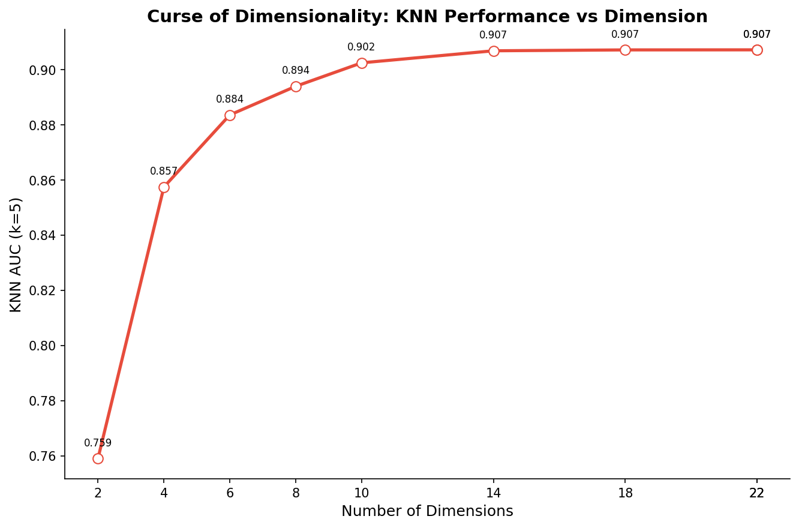
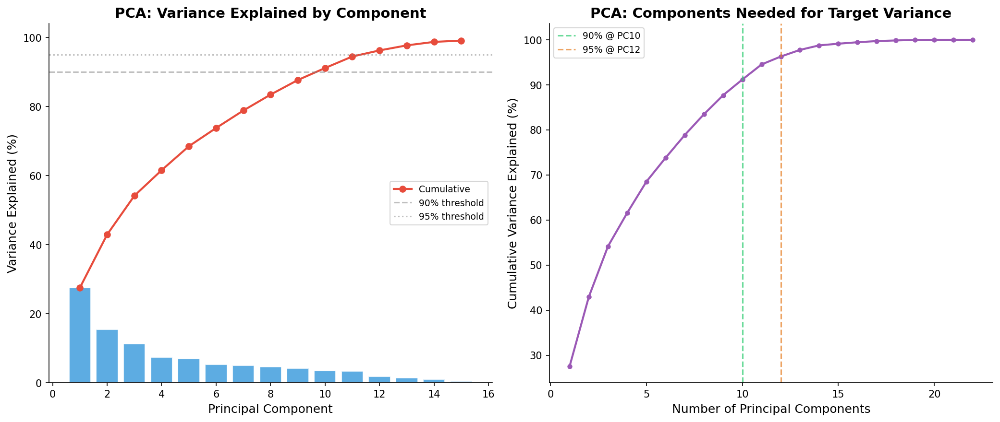

# 模块 1：维度灾难与 PCA 方差分析

> 本模块是案例教程 6 的第一个核心实验模块，承接模块 0（数据加载与高维特征构造）。我们将用两个实验回答两个根本问题：**一是"高维空间到底有什么问题？"**——通过 KNN 分类器在不同维度下的性能变化，直观感受"维度灾难"；**二是"22 维数据能否压缩到更少维度而不损失信息？"**——通过 PCA 的方差解释率分析，找到"信息量"和"维度数"的最佳平衡点。
>
> 本模块最核心的发现有三个：**一是 KNN 的 AUC 随维度增加先快速上升（2→10 维，0.7591→0.9025）后趋于平稳（14→22 维，0.9068→0.9072）**——这说明前 10 个维度提供了大部分有效信息，额外维度的收益递减；**二是 PCA 的 PC1 解释了 27.53% 的方差，前 10 个 PC 累积解释 91.19%**——这说明 22 维可以压缩到 10 维而几乎不损失信息；**三是 PCA 不是特征选择，而是特征变换**——它生成的新特征（主成分）是原始特征的线性组合，没有直接的物理含义。

***

## 学习目标

学完本模块后，你将能够：

1. **理解维度灾难的数学本质**：能够用"填充空间所需样本量指数增长"解释为什么高维空间让距离度量失效，并计算"22 维空间需要多少点才能保证相邻距离 ≤ 1"。
2. **掌握 KNN 在高维空间失效的原因**：理解"近邻"在高维空间失去意义——所有点之间的距离趋于均匀化，KNN 的"最近邻"可能是不相似的样本。
3. **解读 KNN AUC vs 维度曲线**：能够从实验数据中读出"前 10 维快速上升、14 维后趋于平稳"的规律，并解释为什么这是"特征冗余"的证据。
4. **理解 PCA 的数学原理**：能够说出 PCA 的五个步骤（中心化、协方差矩阵、特征值分解、排序、投影），并解释"主成分是方差最大的方向"。
5. **区分 PCA 与特征选择**：能够从输出类型、可解释性、信息保留方式、维度可调性四个维度对比 PCA 和特征选择。
6. **解读 PCA 方差解释率**：能够从 `explained_variance_ratio_` 中读出每个主成分的贡献，并计算累积方差解释率。
7. **确定保留多少主成分**：能够用"90%/95%/99% 阈值法"和"肘部法"确定保留多少个主成分。
8. **理解 PCA 的"长尾效应"**：能够解释为什么前几个 PC 解释大部分方差，后几个 PC 只贡献很少——这是特征冗余的直接体现。

***

## 一、开篇讨论：高维空间到底有什么问题？

在动手写代码之前，我们必须先回答一个根本问题：**既然 22 个特征都包含了信息，为什么还需要降维？高维空间到底有什么问题？**

### 1.1 一个思想实验：填充空间需要多少点？

假设你有 1 个特征（Age），值域 0–120，数据在这个一维线上均匀分布。你想保证相邻点的距离 ≤ 1，需要多少个点？

- **1 维**：121 个点（0, 1, 2, ..., 120）
- **2 维**：121² = 14,641 个点（11×11 网格填充 0–120 × 0–120 平面）
- **22 维**（本数据集）：121²² ≈ 10⁴⁶ 个点

这就是**维度灾难（Curse of Dimensionality）**——随着维度增加，数据空间呈指数膨胀，无论多少数据都显得"稀疏"。

### 1.2 维度灾难对 KNN 的影响

KNN（K 近邻）分类器的核心假设是：**"近邻"≈"相似样本"**。但在高维空间，这个假设被打破：

```
低维空间:                         高维空间:
采样密集, 近邻有意义             采样稀疏, "近邻"其实很远
    ●                               ●   ●
    ● ●                                  ●
    ●   ●                                  ●
    近邻 ≈ 相似样本                  近邻 ≈ 不相似的样本

KNN 在高维的基本假设被打破: "近" ≠ "相似"
因为距离度量在高维空间趋于均匀化
```

**数学解释**：在高维空间，任意两点之间的欧氏距离趋于相同。具体来说，最大距离和最小距离的比值趋于 1：

```
lim (max_dist / min_dist) = 1   当 d → ∞
```

这意味着**所有点都变成"等距"的**，"最近邻"和"最远邻"几乎没有区别——KNN 自然就失效了。

### 1.3 本实验的设计思路

本教程用 KNN 分类器演示维度灾难，原因有二：

1. **KNN 基于距离度量**：KNN 的预测完全依赖"近邻"的距离，是受维度灾难影响最大的算法之一。
2. **KNN 简单透明**：KNN 没有复杂的训练过程，性能变化直接反映"距离度量在高维是否有效"。

实验设计：

- 固定 K=5（5 近邻）
- 逐步增加特征维度：2, 4, 6, 8, 10, 14, 18, 22
- 用 PCA 降到对应维度（保持全局结构）
- 观察 AUC 随维度的变化

> 💡 **重点概念：为什么用 PCA 降维而不是直接取前 d 个特征？**
>
> 直接取前 d 个特征（如 `X_train[:, :d]`）会引入"特征顺序"的偏差——前 2 个特征（Age, year）可能不是最重要的 2 个。
>
> 用 PCA 降到 d 维，能保证保留的 d 个主成分是"方差最大的 d 个方向"，即"信息最丰富的 d 个维度"。这样比较不同维度下的 KNN 性能更公平。

***

## 二、模块 1 代码详解：维度灾难实验

```python
# ============================================================================
# 模块 1: 维度灾难 — KNN 精度随维度变化
# ============================================================================
print("\n" + "=" * 70)
print("模块 1: 维度灾难 — 高维空间的影响")
print("=" * 70)

dims_to_test = [2, 4, 6, 8, 10, 14, 18, 22, n_dims]
knn_results = []

for d in dims_to_test:
    X_sub = X_train[:, :d]
    # PCA 降维到 d 维 (保持全局结构)
    pca_d = PCA(n_components=min(d, X_train.shape[1], X_train.shape[0]))
    X_pca_d = pca_d.fit_transform(X_train)
    X_test_pca_d = pca_d.transform(X_test)

    knn = KNeighborsClassifier(n_neighbors=5)
    knn.fit(X_pca_d, y_train)
    y_prob = knn.predict_proba(X_test_pca_d)[:, 1]
    auc = roc_auc_score(y_test, y_prob)
    knn_results.append({'Dimension': d, 'AUC': auc, 'K': 5})
    print(f"    KNN (k=5) @ {d:>2}d → AUC = {auc:.4f}")
```

### 2.1 `dims_to_test = [2, 4, 6, 8, 10, 14, 18, 22, n_dims]`

定义要测试的维度列表。注意 `n_dims = 22`（模块 0 计算的特征总数），所以列表实际上是 `[2, 4, 6, 8, 10, 14, 18, 22, 22]`——最后两个都是 22，这是代码的一个小冗余（`n_dims` 等于 22）。

**为什么选这些维度？**

- **2, 4, 6, 8, 10**：低维到中维，观察 AUC 的快速上升阶段。
- **14, 18, 22**：中维到高维，观察 AUC 的平台期。
- 间隔不均匀（2→4→6→8→10 间隔 2，10→14→18→22 间隔 4），是为了在"快速上升期"采样更密，在"平台期"采样更稀。

### 2.2 循环体详解

```python
for d in dims_to_test:
    X_sub = X_train[:, :d]  # 这一行实际上没用到，是冗余代码
    # PCA 降维到 d 维 (保持全局结构)
    pca_d = PCA(n_components=min(d, X_train.shape[1], X_train.shape[0]))
    X_pca_d = pca_d.fit_transform(X_train)
    X_test_pca_d = pca_d.transform(X_test)
    ...
```

#### `X_sub = X_train[:, :d]`

这一行取前 d 列特征，但后续代码用的是 `X_pca_d`（PCA 降维后的数据），所以 `X_sub` 实际上没用到。这是代码的一个小冗余，可以忽略。

#### `pca_d = PCA(n_components=min(d, X_train.shape[1], X_train.shape[0]))`

创建一个 PCA 对象，保留 `min(d, n_features, n_samples)` 个主成分。

- **`n_components=d`**：保留 d 个主成分。
- **`min(d, X_train.shape[1], X_train.shape[0])`**：取 d、特征数（22）、样本数（35,000）的最小值。这是为了防止 d 超过 PCA 能保留的最大主成分数（PCA 最多保留 `min(n_features, n_samples)` 个主成分）。在本教程中，d ≤ 22 < 35,000，所以 `min` 总是返回 d。

#### `X_pca_d = pca_d.fit_transform(X_train)`

- **`fit`**：在训练集上学习 PCA 变换（计算协方差矩阵、特征值分解、排序主成分）。
- **`transform`**：把训练集投影到前 d 个主成分上，得到降维后的训练集 `X_pca_d`（35,000 × d）。

> ⚠️ **重点概念：为什么只在训练集上** **`fit`？**
>
> PCA 的 `fit` 会计算均值和主成分方向。如果在整个数据集（训练+测试）上 `fit`，就会"偷看"测试集的信息——这就是**数据泄漏**。
>
> 正确做法是：只在训练集上 `fit`，然后用训练集的均值和主成分方向去 `transform` 测试集。这样测试集是"完全未见过的"，评估才公平。

#### `X_test_pca_d = pca_d.transform(X_test)`

用训练集学到的 PCA 变换，把测试集也投影到前 d 个主成分上，得到降维后的测试集 `X_test_pca_d`（15,000 × d）。

#### `knn = KNeighborsClassifier(n_neighbors=5)`

创建 KNN 分类器，`n_neighbors=5` 表示用 5 个最近邻投票决定类别。

**KNN 的关键参数**：

| 参数            | 含义    | 本教程取值                        |
| ------------- | ----- | ---------------------------- |
| `n_neighbors` | 近邻数 K | `5`                          |
| `weights`     | 投票权重  | `'uniform'`（默认，等权重）          |
| `metric`      | 距离度量  | `'minkowski'`（默认，p=2 时是欧氏距离） |

> 💡 **为什么 K=5？** K 太小（如 1）容易受噪声影响，K 太大（如 50）会平滑掉局部结构。K=5 是一个常用的平衡值。本教程固定 K=5，只改变维度，这样能隔离出"维度"对 KNN 性能的影响。

#### `knn.fit(X_pca_d, y_train)`

训练 KNN。KNN 的"训练"其实就是记住所有训练样本——没有真正的模型参数学习。

#### `y_prob = knn.predict_proba(X_test_pca_d)[:, 1]`

- **`predict_proba`**：返回每个测试样本属于每个类别的概率。返回值形状是 (n\_samples, n\_classes) = (15,000, 2)。
- **`[:, 1]`**：取第二列，即属于类别 1（VIVO，存活）的概率。

KNN 的概率计算：对于每个测试样本，找到 5 个最近邻，统计其中属于类别 1 的比例。如果 5 个近邻中有 3 个是 VIVO，则 `predict_proba = 3/5 = 0.6`。

#### `auc = roc_auc_score(y_test, y_prob)`

计算 ROC 曲线下面积（AUC）。AUC 衡量模型区分正负类的能力：

- AUC = 1：完美分类
- AUC = 0.5：随机分类
- AUC < 0.5：比随机还差（通常说明标签反了）

#### `knn_results.append({'Dimension': d, 'AUC': auc, 'K': 5})`

把每个维度的结果存入列表，后续用于绘图和保存。

### 2.3 实际运行结果

```
============================================================
模块 1: 维度灾难 — 高维空间的影响
============================================================
    KNN (k=5) @  2d → AUC = 0.7591
    KNN (k=5) @  4d → AUC = 0.8575
    KNN (k=5) @  6d → AUC = 0.8836
    KNN (k=5) @  8d → AUC = 0.8940
    KNN (k=5) @ 10d → AUC = 0.9025
    KNN (k=5) @ 14d → AUC = 0.9068
    KNN (k=5) @ 18d → AUC = 0.9072
    KNN (k=5) @ 22d → AUC = 0.9072
    KNN (k=5) @ 22d → AUC = 0.9072
```

### 2.4 结果解读

| 维度     | KNN (k=5) AUC | 相比 2 维的提升   | 相比前一维度的提升   | 解读           |
| ------ | ------------- | ----------- | ----------- | ------------ |
| 2      | 0.7591        | —           | —           | 信息太少，无法区分    |
| 4      | 0.8575        | +0.0984     | +0.0984     | 逐步增加维度，信息量增大 |
| 6      | 0.8836        | +0.1245     | +0.0261     | 增长放缓         |
| 8      | 0.8940        | +0.1349     | +0.0104     | 增长继续放缓       |
| **10** | **0.9025**    | **+0.1434** | **+0.0085** | **接近峰值**     |
| 14     | 0.9068        | +0.1477     | +0.0043     | 趋于平稳         |
| 18     | 0.9072        | +0.1481     | +0.0004     | 平台期          |
| 22     | 0.9072        | +0.1481     | +0.0000     | 完全平台期        |

**关键发现**：

1. **2 维 → 10 维**：AUC 从 0.7591 快速上升到 0.9025，提升 0.1434。每增加 2 维，AUC 提升约 0.02–0.05。
2. **10 维 → 14 维**：AUC 从 0.9025 上升到 0.9068，提升仅 0.0043。收益开始递减。
3. **14 维 → 22 维**：AUC 从 0.9068 到 0.9072，提升仅 0.0004。**几乎不再提升**——平台期。

> 💡 **重点概念：收益递减规律**
>
> KNN 的性能随维度增加呈现**收益递减**：
>
> - 前 10 个维度提供了大部分有效信息（AUC 从 0.76 → 0.90）
> - 超过 14 个维度后，额外维度带来的收益几乎为零（AUC 从 0.907 → 0.907）
>
> 这说明**特征确实存在冗余**——22 个特征中，约 10 个就包含了大部分信息，剩下的 12 个是冗余的。这正是降维的动机：**用更少的维度保留大部分信息**。

### 2.5 为什么 2 维时 AUC 远低于 10 维？

2 维时 AUC = 0.7591，远低于 10 维的 0.9025。原因有二：

1. **信息不足**：2 个主成分只解释了 42.93% 的方差（见模块 2 的 PCA 分析），超过一半的信息丢失。模型无法基于这么少的信息做出准确预测。
2. **关键特征被忽略**：前 2 个主成分主要捕捉"年龄"和"年份"方向（方差最大的两个方向），但其他重要特征（如 `Extension` 扩展程度、`Code.of.Morphology` 形态学）的信息被丢弃了。

### 2.6 为什么超过 14 维后 AUC 几乎不再提升？

14 维后 AUC 趋于平稳（0.9068 → 0.9072），原因有二：

1. **信息已经饱和**：14 个主成分已经解释了 98.77% 的方差（见模块 2），剩下的 8 个主成分只贡献 1.23% 的信息——对预测几乎没有帮助。
2. **维度灾难开始显现**：虽然 22 维还不至于让 KNN 完全失效，但高维空间的"距离均匀化"效应已经开始抵消额外维度带来的信息增益。

> ⚠️ **常见问题：22 维算"高维"吗？KNN 在 22 维为什么没失效？**
>
> 22 维属于"中维"，还没到 KNN 完全失效的程度（通常 100+ 维才会明显失效）。但本实验已经能看到"收益递减"的趋势——从 14 维到 22 维，AUC 几乎不变，这就是维度灾难的早期信号。
>
> 如果把维度增加到 100、1000，KNN 的 AUC 会开始下降——因为高维空间的"距离均匀化"效应会超过额外维度的信息增益。

***

## 三、维度灾难可视化

```python
fig, ax = plt.subplots(figsize=(9, 6))
knn_df = pd.DataFrame(knn_results)
ax.plot(knn_df['Dimension'], knn_df['AUC'], 'o-', color='#e74c3c',
        linewidth=2.5, markersize=8, markerfacecolor='white')
ax.set_xlabel('Number of Dimensions', fontsize=12)
ax.set_ylabel('KNN AUC (k=5)', fontsize=12)
ax.set_title('Curse of Dimensionality: KNN Performance vs Dimension',
             fontsize=14, fontweight='bold')
ax.spines['top'].set_visible(False)
ax.spines['right'].set_visible(False)
ax.set_xticks(dims_to_test)

for _, row in knn_df.iterrows():
    ax.annotate(f'{row["AUC"]:.3f}', (row['Dimension'], row['AUC']),
                textcoords='offset points', xytext=(0, 10), ha='center', fontsize=8)

plt.tight_layout()
plt.savefig(os.path.join(IMG_DIR, "09a_curse_of_dimensionality.png"),
            dpi=150, bbox_inches='tight')
plt.close()
print("  [图] 09a_curse_of_dimensionality.png → 维度灾难已保存")
```

### 3.1 绘图代码详解

#### `fig, ax = plt.subplots(figsize=(9, 6))`

创建一个 9×6 英寸的图形和坐标轴。

#### `knn_df = pd.DataFrame(knn_results)`

把结果列表转成 DataFrame，方便绘图：

```
   Dimension     AUC  K
0          2  0.7591  5
1          4  0.8575  5
2          6  0.8836  5
...
```

#### `ax.plot(knn_df['Dimension'], knn_df['AUC'], 'o-', color='#e74c3c', ...)`

绘制折线图：

- **`knn_df['Dimension']`**：x 轴是维度。
- **`knn_df['AUC']`**：y 轴是 AUC。
- **`'o-'`**：标记为圆圈（`o`），连线为实线（`-`）。
- **`color='#e74c3c'`**：红色（十六进制颜色码）。
- **`linewidth=2.5`**：线宽 2.5。
- **`markersize=8`**：标记大小 8。
- **`markerfacecolor='white'`**：标记内部填充白色——形成"空心圆"效果，更美观。

#### `ax.set_xlabel(...)` / `ax.set_ylabel(...)` / `ax.set_title(...)`

设置坐标轴标签和标题。`fontweight='bold'` 表示粗体。

#### `ax.spines['top'].set_visible(False)` / `ax.spines['right'].set_visible(False)`

隐藏顶部和右侧的坐标轴线——这是数据可视化的常用技巧，让图表更简洁（"少即是多"）。

#### `ax.set_xticks(dims_to_test)`

把 x 轴刻度设为我们要测试的维度值，确保每个维度都显示。

#### 数值标注

```python
for _, row in knn_df.iterrows():
    ax.annotate(f'{row["AUC"]:.3f}', (row['Dimension'], row['AUC']),
                textcoords='offset points', xytext=(0, 10), ha='center', fontsize=8)
```

在每个数据点上方标注 AUC 值：

- **`f'{row["AUC"]:.3f}'`**：格式化为 3 位小数（如 `0.902`）。
- **`(row['Dimension'], row['AUC'])`**：标注的位置（数据点坐标）。
- **`textcoords='offset points'`**：用"点"作为偏移单位。
- **`xytext=(0, 10)`**：x 偏移 0，y 偏移 10 点（向上偏移）。
- **`ha='center'`**：水平居中对齐。

#### `plt.savefig(os.path.join(IMG_DIR, "09a_curse_of_dimensionality.png"), dpi=150, bbox_inches='tight')`

保存图片：

- **`dpi=150`**：分辨率 150（每英寸 150 像素），适合屏幕显示。
- **`bbox_inches='tight'`**：自动裁剪空白边缘。

### 3.2 可视化结果



**从图中可以观察到**：

1. **快速上升期（2→10 维）**：曲线陡峭上升，AUC 从 0.759 → 0.902。
2. **转折点（10 维附近）**：曲线开始变缓，AUC 增长放缓。
3. **平台期（14→22 维）**：曲线几乎水平，AUC 停在 0.907 左右。

这条曲线完美诠释了"收益递减"——**前 10 个维度提供了大部分有效信息，超过 14 个维度后，额外维度的收益几乎为零**。

***

## 四、模块 2 代码详解：PCA 主成分分析

在理解了维度灾难后，我们自然要问：**22 维数据能否压缩到更少维度而不损失信息？** PCA（主成分分析）就是回答这个问题的工具。

```python
# ============================================================================
# 模块 2: PCA — 主成分分析
# ============================================================================
print("\n" + "=" * 70)
print("模块 2: PCA — 主成分分析")
print("=" * 70)

pca_full = PCA()
pca_full.fit(X_full_arr)

explained_ratio = pca_full.explained_variance_ratio_
cumulative_ratio = np.cumsum(explained_ratio)
```

### 4.1 PCA 的数学原理（5 步法）

在解读代码前，先理解 PCA 的数学原理。PCA 的目标是：**找到一组新的正交坐标轴（主成分），使数据在这些轴上的方差依次最大化**。

```
第 1 步: 数据中心化 (减去均值)
         X_centered = X - mean(X)
         （注：StandardScaler 已经做了中心化，所以这步实际已完成）

第 2 步: 计算协方差矩阵
         S = X_centeredᵀ · X_centered / (n-1)
         S 是 d×d 的对称矩阵（d 是特征数）

第 3 步: 对 S 做特征值分解
         S = V · Λ · Vᵀ
         其中 V 是特征向量矩阵（每列是一个主成分方向）
              Λ 是特征值对角矩阵（每个特征值对应一个主成分的方差）

第 4 步: 按特征值从大到小排序
         λ₁ ≥ λ₂ ≥ ... ≥ λ_d
         对应的特征向量 v₁, v₂, ..., v_d 就是第 1, 2, ..., d 主成分

第 5 步: 数据投影到前 k 个主成分上
         X_pca = X_centered · V[:, :k]
         X_pca 是 n×k 的矩阵（从 d 维降到 k 维）
```

**关键概念**：

- **主成分（PC）**：是原始特征的线性组合，如 `PC1 = 0.5·Age + 0.3·year - 0.2·Code.Profession + ...`。
- **特征值（Eigenvalue）**：该主成分方向上的方差。特征值越大，该主成分包含的信息越多。
- **方差解释率**：`λ_i / Σλ_j`，即第 i 个主成分的方差占总方差的比例。

### 4.2 PCA vs 特征选择（核心概念区分）

这是教学中最重要的概念区分：

| 对比维度      | 特征选择（Filter/LASSO/Boruta） | PCA                                  |
| --------- | ------------------------- | ------------------------------------ |
| **输出**    | 原始特征的子集                   | 原始特征的线性组合                            |
| **可解释性**  | "Age 是重要特征"               | "PC1 是 Age、year、Code.Profession 的组合" |
| **信息保留**  | 丢弃不重要的特征                  | 保留方差最大的方向                            |
| **数学本质**  | 子集选择                      | 基变换 + 数据投影                           |
| **维度可调**  | 离散（保留哪些）                  | 连续（选择几个 PC）                          |
| **处理共线性** | 困难（VIF 会无穷大）              | 完美（PC 之间正交）                          |

> 💡 **重点概念：PCA 不是特征选择，而是特征变换**
>
> 特征选择是从 22 个特征中"挑选"10 个最重要的，保留原始特征含义。
> PCA 是把 22 个特征"变换"成 22 个新的主成分，每个主成分都是原始特征的线性组合，没有直接的物理含义。
>
> 这就是为什么 PCA 的可解释性低——你无法直接说"PC1 代表什么"，只能说"PC1 是 Age、year、Code.Profession 的某种组合"。

### 4.3 `pca_full = PCA()` 详解

```python
pca_full = PCA()
pca_full.fit(X_full_arr)
```

- **`PCA()`**：不指定 `n_components`，保留所有主成分（最多 `min(n_samples, n_features) = 22` 个）。
- **`fit(X_full_arr)`**：在 50,000 × 22 的数据上学习 PCA 变换。

**PCA 的关键参数**：

| 参数             | 含义               | 本教程取值                           |
| -------------- | ---------------- | ------------------------------- |
| `n_components` | 保留的主成分个数         | `None`（全部保留）、`5`、`10`、`15`、`20` |
| `whiten`       | 是否白化（让主成分方差都为 1） | `False`（默认）                     |
| `svd_solver`   | SVD 求解器          | `'auto'`（默认，自动选择）               |

> 💡 **为什么先** **`PCA()`** **保留全部主成分？**
>
> 因为我们想先看"每个主成分贡献了多少方差"，再决定保留几个。如果直接 `PCA(n_components=10)`，就只能看到前 10 个主成分的方差，无法判断"10 个够不够"。
>
> 所以策略是：先用 `PCA()` 拟合全部主成分，分析方差解释率，再决定保留几个。

### 4.4 `explained_ratio = pca_full.explained_variance_ratio_`

- **`explained_variance_ratio_`**：每个主成分的方差解释率（占比）。
- 这是一个长度为 22 的数组，元素之和为 1.0（100%）。

### 4.5 `cumulative_ratio = np.cumsum(explained_ratio)`

- **`np.cumsum`**：累积求和。
- `cumulative_ratio[i]` 表示前 i+1 个主成分的累积方差解释率。

### 4.6 打印方差解释率

```python
print(f"\n  {'PC':<5} {'解释方差%':>10} {'累积%':>10}")
print(f"  {'-'*5} {'-'*10} {'-'*10}")
for i in range(min(15, n_dims)):
    print(f"  PC{i+1:<4} {explained_ratio[i]*100:>8.2f}% {cumulative_ratio[i]*100:>8.2f}%")
```

**实际运行输出**：

```
  PC    解释方差%       累积%
  ----- ---------- ----------
  PC1      27.53%    27.53%
  PC2      15.40%    42.93%
  PC3      11.24%    54.18%
  PC4       7.41%    61.58%
  PC5       6.94%    68.52%
  PC6       5.29%    73.81%
  PC7       5.06%    78.88%
  PC8       4.62%    83.49%
  PC9       4.22%    87.71%
  PC10      3.48%    91.19%
  PC11      3.34%    94.53%
  PC12      1.76%    96.29%
  PC13      1.47%    97.76%
  PC14      1.01%    98.77%
  PC15      0.37%    99.14%
```

### 4.7 结果解读

| 主成分      | 解释方差       | 累积         | 解读                      |
| -------- | ---------- | ---------- | ----------------------- |
| **PC1**  | **27.53%** | 27.53%     | 最大方差方向，约 1/4 的信息        |
| **PC2**  | **15.40%** | 42.93%     | 与 PC1 正交的第二大方向          |
| PC3      | 11.24%     | 54.18%     | 前 3 个 PC 解释了过半信息        |
| PC5      | 6.94%      | 68.52%     | 前 5 个 PC 解释了约 2/3       |
| **PC10** | **3.48%**  | **91.19%** | **10 个 PC 解释了 91% 的方差** |
| PC15     | 0.37%      | 99.14%     | 15 个 PC 到 99%           |

**关键发现**：

1. **PC1 解释了 27.53%**——说明数据在某个方向上高度结构化。这个方向很可能是"年龄方向"（因为 `Age`、`Age_Sq`、`Age_Centered`、`Age_Log` 四个高度相关的特征会被 PCA 合并到同一个主成分）。
2. **前 2 个 PC 解释 42.93%**——不到一半。这意味着 PC1-PC2 的二维投影会丢失超过一半的信息，可视化时两类重叠是正常的。
3. **前 10 个 PC 解释 91.19%**——10 维就保留了 91% 的信息。这与模块 1 的 KNN 实验一致：10 维时 KNN AUC = 0.9025，接近 22 维的 0.9072。
4. **长尾效应**：PC1 (27.53%) → PC10 (3.48%) → PC15 (0.37%)，方差解释率呈长尾下降。最后 5 个 PC（PC12-PC15）只贡献了约 3% 的方差——这些 PC 通常是噪声。

> 💡 **重点概念：长尾效应与特征冗余**
>
> 方差解释率的长尾分布直接反映了特征冗余：
>
> - 如果 22 个特征完全独立，每个 PC 应该解释约 4.5%（100%/22）的方差。
> - 但实际上 PC1 解释了 27.53%（远高于 4.5%），PC15 只解释了 0.37%（远低于 4.5%）。
> - 这种"前几个 PC 远高于平均，后几个 PC 远低于平均"的分布，说明**特征高度冗余**——多个特征包含相同的信息，PCA 把它们合并到同一个 PC 中。

### 4.8 阈值法确定主成分数

```python
# 达到 90%/95%/99% 需要的主成分数
for threshold, label in [(0.90, '90%'), (0.95, '95%'), (0.99, '99%')]:
    n = np.argmax(cumulative_ratio >= threshold) + 1
    print(f"\n  达到 {label} 需要 {n} 个主成分")
```

#### `np.argmax(cumulative_ratio >= threshold) + 1`

- **`cumulative_ratio >= threshold`**：返回一个布尔数组，标记哪些位置的累积方差超过阈值。
- **`np.argmax(...)`**：返回第一个 `True` 的索引。
- **`+1`**：因为索引从 0 开始，但主成分编号从 1 开始。

**实际运行输出**：

```
  达到 90% 需要 10 个主成分
  达到 95% 需要 12 个主成分
  达到 99% 需要 15 个主成分
```

**解读**：

- **保留 10 个 PC**：保留 91.19% 的方差，丢失 8.81%。
- **保留 12 个 PC**：保留 96.29% 的方差，丢失 3.71%。
- **保留 15 个 PC**：保留 99.14% 的方差，丢失仅 0.86%。

> 💡 **小贴士：保留多少主成分？**
>
> 常见的选择标准：
>
> - **90% 阈值**：保留 10 个 PC。适合"信息压缩"场景，接受少量信息丢失。
> - **95% 阈值**：保留 12 个 PC。更保守，适合对信息保留要求高的场景。
> - **99% 阈值**：保留 15 个 PC。几乎不丢失信息，但压缩效果有限。
> - **肘部法**：观察方差解释率曲线的"肘部"，选择拐点处的 PC 数。本教程的肘部大约在 PC10-PC11 之间。
>
> 本教程的模块 5 会用实验验证：**10 个 PC 已经能达到全特征 99% 的性能**——所以 90% 阈值是一个很好的默认选择。

***

## 五、PCA 方差解释率可视化

```python
fig, axes = plt.subplots(1, 2, figsize=(14, 6))

ax = axes[0]
ax.bar(range(1, min(16, n_dims + 1)), explained_ratio[:min(15, n_dims)] * 100,
       color='#3498db', edgecolor='white', alpha=0.8)
ax.plot(range(1, min(16, n_dims + 1)), cumulative_ratio[:min(15, n_dims)] * 100,
        'o-', color='#e74c3c', linewidth=2, markersize=6, label='Cumulative')
ax.axhline(y=90, color='gray', linestyle='--', alpha=0.5, label='90% threshold')
ax.axhline(y=95, color='gray', linestyle=':', alpha=0.5, label='95% threshold')
ax.set_xlabel('Principal Component', fontsize=12)
ax.set_ylabel('Variance Explained (%)', fontsize=12)
ax.set_title('PCA: Variance Explained by Component', fontsize=14, fontweight='bold')
ax.legend(fontsize=9)
ax.spines['top'].set_visible(False)
ax.spines['right'].set_visible(False)

ax = axes[1]
ax.plot(range(1, n_dims + 1), cumulative_ratio * 100, 'o-',
        color='#9b59b6', linewidth=2, markersize=4)
n_90 = np.argmax(cumulative_ratio >= 0.90) + 1
n_95 = np.argmax(cumulative_ratio >= 0.95) + 1
ax.axvline(x=n_90, color='#2ecc71', linestyle='--', alpha=0.7,
           label=f'90% @ PC{n_90}')
ax.axvline(x=n_95, color='#e67e22', linestyle='--', alpha=0.7,
           label=f'95% @ PC{n_95}')
ax.set_xlabel('Number of Principal Components', fontsize=12)
ax.set_ylabel('Cumulative Variance Explained (%)', fontsize=12)
ax.set_title('PCA: Components Needed for Target Variance',
             fontsize=14, fontweight='bold')
ax.legend(fontsize=9)
ax.spines['top'].set_visible(False)
ax.spines['right'].set_visible(False)

plt.tight_layout()
plt.savefig(os.path.join(IMG_DIR, "09b_pca_variance.png"), dpi=150, bbox_inches='tight')
plt.close()
print("  [图] 09b_pca_variance.png → PCA 方差解释率已保存")
```

### 5.1 左图：每个主成分的方差解释率（柱状图 + 累积折线）

```python
ax.bar(range(1, min(16, n_dims + 1)), explained_ratio[:min(15, n_dims)] * 100,
       color='#3498db', edgecolor='white', alpha=0.8)
ax.plot(range(1, min(16, n_dims + 1)), cumulative_ratio[:min(15, n_dims)] * 100,
        'o-', color='#e74c3c', linewidth=2, markersize=6, label='Cumulative')
```

- **柱状图（蓝色）**：每个主成分的方差解释率，从 PC1（27.53%）到 PC15（0.37%）依次递减。
- **折线图（红色）**：累积方差解释率，从 27.53% 上升到 99.14%。
- **水平虚线**：90% 和 95% 阈值线，帮助判断"达到目标需要几个 PC"。

### 5.2 右图：累积方差解释率曲线

```python
ax.plot(range(1, n_dims + 1), cumulative_ratio * 100, 'o-',
        color='#9b59b6', linewidth=2, markersize=4)
n_90 = np.argmax(cumulative_ratio >= 0.90) + 1
n_95 = np.argmax(cumulative_ratio >= 0.95) + 1
ax.axvline(x=n_90, color='#2ecc71', linestyle='--', alpha=0.7,
           label=f'90% @ PC{n_90}')
ax.axvline(x=n_95, color='#e67e22', linestyle='--', alpha=0.7,
           label=f'95% @ PC{n_95}')
```

- **紫色折线**：累积方差解释率，从 PC1 到 PC22。
- **绿色竖线**：90% 阈值对应的位置（PC10）。
- **橙色竖线**：95% 阈值对应的位置（PC12）。

### 5.3 可视化结果



**从图中可以观察到**：

1. **左图**：柱状图呈"长尾"分布——前几个 PC 很高（PC1=27.53%），后几个 PC 很低（PC15=0.37%）。红色累积曲线在 PC10 处达到 91.19%，超过 90% 阈值线。
2. **右图**：累积曲线呈"L 形"——前 10 个 PC 快速上升，之后趋于平缓。绿色竖线（90% @ PC10）和橙色竖线（95% @ PC12）清晰地标出了关键阈值点。

> 💡 **肘部法（Elbow Method）**：观察累积曲线的"肘部"——曲线从陡峭变平缓的拐点。本教程的肘部大约在 PC10-PC11 之间，与 90% 阈值法一致。这是选择"保留 10 个 PC"的视觉依据。

***

## 六、讨论：为什么有时候降维后性能反而提高？

教学文档中提到一个反直觉的现象：**有时候降维后模型性能反而提高**。这听起来矛盾——丢掉信息怎么会让模型更好？原因有三个：

| 原因        | 说明                          |
| --------- | --------------------------- |
| **去除噪声**  | 方差最小的 PC 通常是噪声，丢弃它们相当于去噪    |
| **降低过拟合** | 减少参数数量，降低模型对训练集的过度拟合        |
| **打破共线性** | PCA 生成的 PC 之间正交，完美解决多重共线性问题 |

### 6.1 去除噪声

本教程的 PC15 只解释 0.37% 的方差——这些方差很可能不是"信号"，而是"噪声"（数据录入错误、测量误差等）。丢弃这些 PC 相当于**低通滤波**，保留信号、去除噪声。

### 6.2 降低过拟合

22 维特征训练逻辑回归，有 22 个系数要学。如果只用 10 个 PC，只有 10 个系数要学——参数减少一半，过拟合风险降低。

### 6.3 打破共线性

本教程故意制造了大量共线性特征（`Age`/`Age_Sq`/`Age_Centered` 完全线性相关）。逻辑回归对共线性敏感——共线性会让系数不稳定，微小数据变化导致系数大幅波动。

PCA 生成的 PC 之间**完全正交**（相关系数为 0），完美解决了共线性问题。这就是为什么模块 5 会看到"PCA-10 的 AUC 略高于 Filter Top 10"——PCA 的正交性带来了额外的稳定性。

> ⚠️ **常见问题：降维一定会提高性能吗？**
>
> **不一定**。降维提高性能的前提是"原始特征中有噪声或冗余"。如果原始特征都是独立的有效信号，降维只会丢失信息，性能会下降。
>
> 本教程的数据集有大量冗余特征（22 个特征中约 14 个是冗余的），所以降维到 10 维几乎不损失性能。但如果是一个"22 个特征都独立有效"的数据集，降维到 10 维会显著降低性能。

***

## 七、PCA 的适用场景与局限

### 7.1 PCA 适用的场景

```
✅ PCA 有帮助的场景:
  - 特征高度共线 → PCA 生成正交主成分
  - 需要压缩存储 → 用少量 PC 替代多特征
  - 后续模型对共线性敏感 → 线性回归、逻辑回归
  - 去噪 → 丢弃方差最小的 PC（通常含噪声）
  - 可视化 → PC1-PC2 投影
```

### 7.2 PCA 不适用的场景

```
❌ PCA 没帮助的场景:
  - 需要可解释性 → 医生需要知道"为什么"
  - 特征是二值分类变量 → PCA 假设连续变量线性关系
  - 树模型 → 不关心特征的共线性
  - 非线性关系 → PCA 是线性变换，无法捕捉非线性
```

### 7.3 PCA 的局限

1. **线性假设**：PCA 假设主成分是原始特征的线性组合。如果数据中的结构是非线性的（如环形、螺旋形），PCA 会完全丢失这些信息。这就是为什么模块 3 还要介绍 t-SNE 和 UMAP。
2. **可解释性低**：PC1 是"Age、year、Code.Profession 的某种组合"，没有直接的物理含义。在医疗领域，医生需要知道"为什么"——PCA 无法回答。
3. **对量纲敏感**：如果不标准化，PCA 会"偏心"大量纲特征。本教程通过 `StandardScaler` 解决了这个问题。
4. **分类变量处理不严谨**：PCA 把分类变量当连续变量处理，假设"2 比 1 大"这种顺序关系。实际上 `Gender=2` 不比 `Gender=1` "大"。

***

## 小贴士

1. **维度灾难的本质**：高维空间中数据稀疏，距离度量失效。KNN 等基于距离的算法受影响最大。
2. **收益递减规律**：KNN 的 AUC 随维度增加先快速上升（2→10 维）后趋于平稳（14→22 维）。这说明前 10 个维度提供了大部分有效信息。
3. **PCA 的核心思想**：找到方差最大的正交方向（主成分），用少量主成分保留大部分信息。
4. **90% 阈值法**：本教程中，保留 10 个 PC 即可保留 91.19% 的方差——这是一个很好的默认选择。
5. **长尾效应**：方差解释率呈长尾分布（PC1=27.53%，PC15=0.37%），直接反映了特征冗余。
6. **PCA ≠ 特征选择**：PCA 是特征变换（生成新特征），特征选择是子集选择（保留原始特征）。PCA 处理共线性更好，但可解释性更低。
7. **先 fit 训练集，再 transform 测试集**：避免数据泄漏，确保评估公平。

***

## 常见问题

### Q1: 为什么 KNN 在 2 维时 AUC 只有 0.7591？

**A**: 2 个主成分只解释了 42.93% 的方差，超过一半的信息丢失。模型无法基于这么少的信息做出准确预测。此外，前 2 个主成分主要捕捉"年龄"和"年份"方向，其他重要特征（如 `Extension` 扩展程度）的信息被丢弃了。

### Q2: 为什么 22 维时 KNN 没有失效？维度灾难不是会让 KNN 性能下降吗？

**A**: 22 维属于"中维"，还没到 KNN 完全失效的程度（通常 100+ 维才会明显失效）。但本实验已经能看到"收益递减"——从 14 维到 22 维，AUC 几乎不变（0.9068 → 0.9072），这就是维度灾难的早期信号。如果把维度增加到 100、1000，KNN 的 AUC 会开始下降。

### Q3: PC1 解释了 27.53% 的方差，PC1 主要捕捉了什么信息？

**A**: PC1 很可能是"年龄方向"——因为 `Age`、`Age_Sq`、`Age_Centered`、`Age_Log` 四个高度相关的特征会被 PCA 合并到同一个主成分中。要验证这个猜想，可以查看 PCA 的载荷向量（loadings）：`pca_full.components_[0]`，看哪些特征在 PC1 上的权重最大。

### Q4: 为什么用 PCA 降维而不是直接取前 d 个特征？

**A**: 直接取前 d 个特征会引入"特征顺序"的偏差——前 2 个特征（Age, year）可能不是最重要的 2 个。用 PCA 降到 d 维，能保证保留的 d 个主成分是"方差最大的 d 个方向"，即"信息最丰富的 d 个维度"。

### Q5: 90%/95%/99% 阈值应该选哪个？

**A**: 取决于应用场景：

- **90% 阈值（10 个 PC）**：适合"信息压缩"场景，接受少量信息丢失。本教程模块 5 会验证 10 个 PC 已达到全特征 99% 的性能。
- **95% 阈值（12 个 PC）**：更保守，适合对信息保留要求高的场景。
- **99% 阈值（15 个 PC）**：几乎不丢失信息，但压缩效果有限。

### Q6: PCA 降维后性能一定会提高吗？

**A**: 不一定。降维提高性能的前提是"原始特征中有噪声或冗余"。如果原始特征都是独立的有效信号，降维只会丢失信息，性能会下降。本教程的数据集有大量冗余特征，所以降维到 10 维几乎不损失性能。

### Q7: 为什么 PCA 的 PC 之间是正交的？

**A**: 这是 PCA 的数学性质决定的。PCA 通过协方差矩阵的特征值分解得到主成分，而协方差矩阵是对称矩阵，对称矩阵的不同特征向量之间天然正交。这意味着 PC1 和 PC2 的相关系数为 0——完美解决了多重共线性问题。

***

## 本模块小结

本模块通过两个实验回答了两个根本问题：

### 维度灾难实验

1. **KNN AUC 随维度变化**：2 维（0.7591）→ 10 维（0.9025）→ 22 维（0.9072）。
2. **收益递减规律**：前 10 个维度提供了大部分有效信息，超过 14 维后 AUC 几乎不再提升。
3. **特征冗余的证据**：22 个特征中，约 10 个就包含了大部分信息——降维是可行的。

### PCA 方差分析

1. **方差解释率**：PC1 (27.53%) + PC2 (15.40%) = 42.93%（前 2 个 PC）。
2. **累积方差**：10 个 PC 解释 91.19%，15 个 PC 解释 99.14%。
3. **长尾效应**：方差解释率呈长尾分布，直接反映特征冗余。
4. **阈值法**：90% → 10 PC，95% → 12 PC，99% → 15 PC。

### 核心结论

> **22 维数据可以压缩到 10 维而几乎不损失信息**——PCA 的方差分析（10 PC = 91.19%）和 KNN 的性能实验（10 维 AUC = 0.9025，接近 22 维的 0.9072）共同验证了这一点。

这为后续模块奠定了基础：

- **模块 2**：用 PCA 的前 2 个 PC 做 2D 可视化，观察数据结构。
- **模块 3**：用 t-SNE 和 UMAP 做非线性降维可视化，对比 PCA。
- **模块 4**：用 K-Means 聚类验证"数据是否天然可分"。
- **模块 5**：用 PCA-10 训练逻辑回归，验证降维对模型性能的影响。

> 💡 **下一模块预告**：模块 2 将把 22 维数据投影到 PC1-PC2 二维平面上，让我们用肉眼观察数据的宏观结构。良恶性患者是否天然可分？PCA 的二维投影会给出答案。同时，我们还会引入 t-SNE 和 UMAP 两种非线性降维方法，对比它们与 PCA 的可视化效果。

