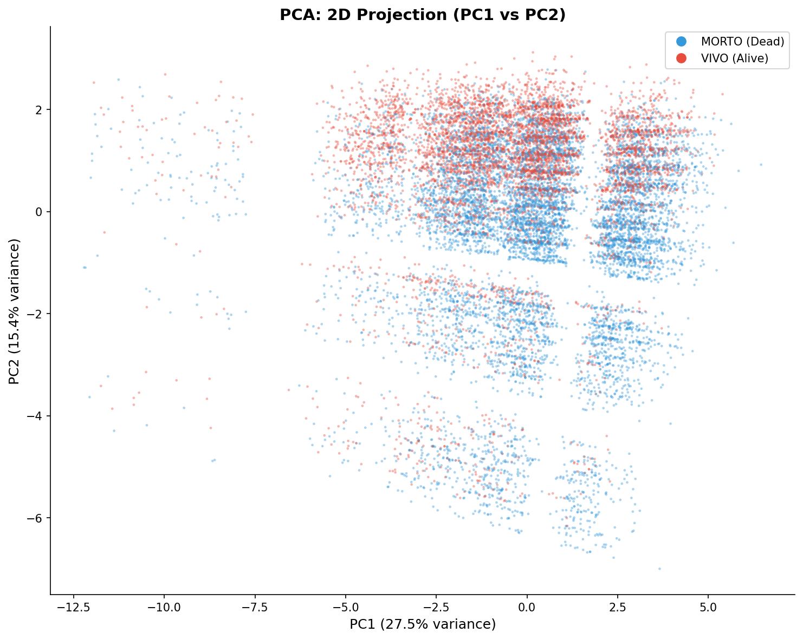
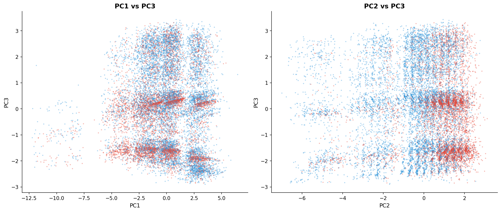
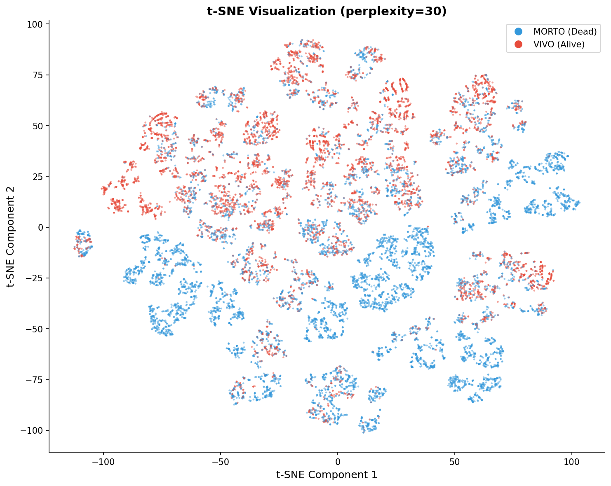
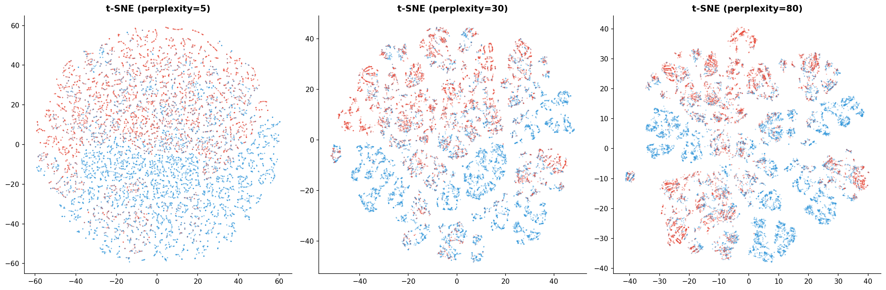
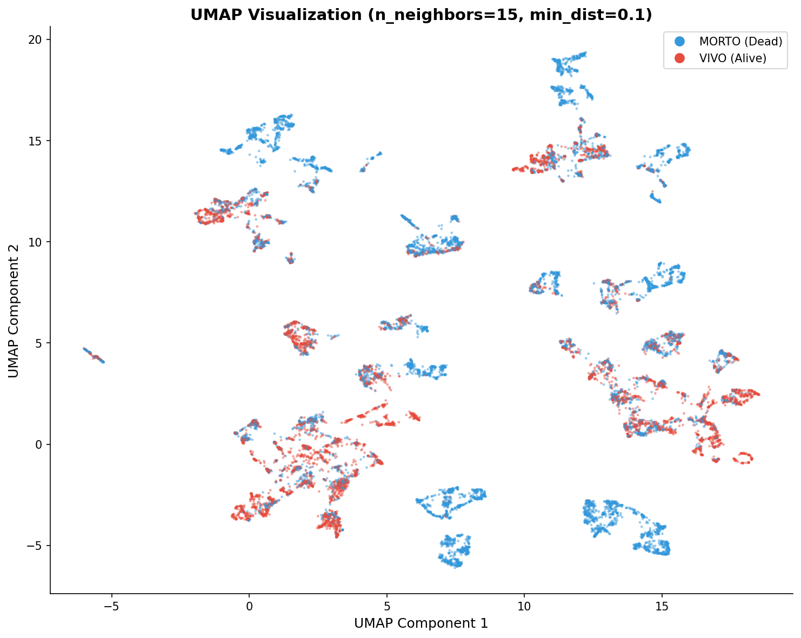
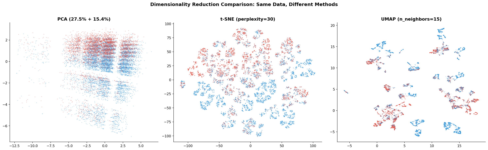

# 模块 2：降维可视化对比 — PCA / t-SNE / UMAP

> 本模块是案例教程 6 的可视化核心模块，承接模块 1（维度灾难与 PCA 方差分析）。在理解了"22 维可以压缩到 10 维"之后，我们进一步问：**能否压缩到 2 维，让我们用肉眼观察数据的宏观结构？** 本模块将用三种降维方法（PCA、t-SNE、UMAP）把 22 维数据投影到 2D 平面，回答三个核心问题：**一是良恶性患者是否天然可分？** **二是不同降维方法的可视化效果有何差异？** **三是 t-SNE 的"视觉分离"是否等于"模型可分"？**  
>
> 本模块最核心的发现有三个：**一是 PCA 的 PC1-PC2 投影中两类有分离趋势但不彻底**——说明存活和死亡患者在宏观线性结构上不是天然可分的；**二是 t-SNE 的视觉分离比 PCA 更明显**——但这不意味着"t-SNE 更好"，而是因为 t-SNE 优化的是"视觉分离"而非"分类准确率"；**三是 t-SNE 对随机种子高度敏感**——三个不同种子给出三种完全不同的布局，所以 t-SNE 不能用于性能评价。

***

## 学习目标

学完本模块后，你将能够：

1. **掌握 PCA 二维可视化的方法**：理解 `pca_full.transform(X_manifold)[:, :2]` 如何把 22 维数据投影到 PC1-PC2 平面，并能解读散点图中两类的分离程度。
2. **理解 PCA 可视化的局限**：明白 PCA 是线性降维，只能捕捉全局线性结构，无法捕捉非线性结构（如环形、螺旋形）。
3. **掌握 t-SNE 的数学原理**：能够说出 t-SNE 的三步流程（高维相似度、低维相似度、KL 散度最小化），并解释"t 分布"的作用。
4. **理解 t-SNE 的** **`perplexity`** **参数**：能够解释 perplexity=5/30/80 的差异，并知道为什么 30 是默认值。
5. **掌握 t-SNE 的常见误区**：理解为什么"t-SNE 分得开 ≠ 模型好"，并能说出 t-SNE 的四个局限（随机性、不保留距离、不保留密度、只是可视化工具）。
6. **理解 UMAP 的优势**：能够对比 t-SNE 和 UMAP 在速度、全局结构、可复现性、参数敏感性四个维度的差异。
7. **解读三种方法的可视化对比图**：能够从 PCA/t-SNE/UMAP 的三图对比中读出每种方法的特点和适用场景。
8. **建立"可视化 ≠ 性能评价"的批判性思维**：能够识别"t-SNE 视觉分离"的误导性，知道什么时候可以用 t-SNE，什么时候不能。

***

## 一、开篇讨论：为什么需要降维可视化？

在模块 1 中，我们用 PCA 分析了方差解释率，发现"10 个 PC 解释 91% 的方差"。但方差解释率是一个**数字**，我们更想**看到**数据的结构——这就是降维可视化的动机。

### 1.1 人类只能看 2D 或 3D

人类视觉系统擅长识别 2D 和 3D 模式，但无法直接观察 4 维以上的数据。所以我们需要把高维数据**投影**到 2D 或 3D 平面：

```
22 维特征空间 (无法观察)
       │
       │  降维
       ▼
2D 平面 (可以画散点图)
       │
       │  人类观察
       ▼
"两类是否分开？" "有没有簇状结构？" "有没有异常点？"
```

### 1.2 三种降维方法的定位

本模块对比三种降维方法，它们的定位不同：

| 方法        | 类型  | 保留的结构          | 适用场景           |
| --------- | --- | -------------- | -------------- |
| **PCA**   | 线性  | 全局线性结构（方差最大方向） | 基线降维、去相关、快速可视化 |
| **t-SNE** | 非线性 | 局部邻域结构（保持邻居关系） | 发现簇状结构、探索性分析   |
| **UMAP**  | 非线性 | 局部 + 全局结构      | 大数据集、需要全局结构的场景 |

> 💡 **重点概念：线性 vs 非线性降维**
>
> - **PCA 是线性的**：主成分是原始特征的线性组合（如 `PC1 = 0.5·Age + 0.3·year`）。PCA 只能捕捉数据中的**全局线性结构**——如果数据是环形、螺旋形等非线性结构，PCA 投影会完全丢失这些信息。
> - **t-SNE 和 UMAP 是非线性的**：它们不假设主成分是线性组合，而是通过保持"邻域关系"来学习非线性映射。这让它们能捕捉 PCA 看不到的非线性结构。

***

## 二、模块 3 代码详解：PCA 二维可视化

```python
# ============================================================================
# 模块 3: PCA 可视化 (PC1 vs PC2)
# ============================================================================
print("\n" + "=" * 70)
print("模块 3: PCA 可视化 — PC1 vs PC2 投影")
print("=" * 70)

X_pca_2d = pca_full.transform(X_manifold)[:, :2]
```

### 2.1 `X_pca_2d = pca_full.transform(X_manifold)[:, :2]`

这行代码是 PCA 可视化的核心：

- **`pca_full.transform(X_manifold)`**：用模块 1 学到的 PCA 变换，把 15,000 × 22 的流形学习样本投影到所有 22 个主成分上，得到 15,000 × 22 的矩阵。
- **`[:, :2]`**：取前 2 列，即 PC1 和 PC2。得到 15,000 × 2 的矩阵 `X_pca_2d`。

> 💡 **重点概念：为什么用** **`X_manifold`** **而不是** **`X_full_arr`？**
>
> `X_manifold` 是模块 0 准备的 15,000 样本小集合，专门用于流形学习。用 15,000 个点画散点图已经足够密集，再多就重叠看不清了。而且 PCA 的 `transform` 是确定性的（没有随机性），用 15,000 还是 50,000 样本，投影方向一样，只是点的数量不同。

### 2.2 绘制 PCA 二维散点图

```python
fig, ax = plt.subplots(figsize=(10, 8))
colors_pca = ['#3498db' if yy == 0 else '#e74c3c' for yy in y_manifold]
ax.scatter(X_pca_2d[:, 0], X_pca_2d[:, 1], c=colors_pca,
           alpha=0.4, s=5, edgecolor='none')
ax.set_xlabel(f'PC1 ({explained_ratio[0]*100:.1f}% variance)', fontsize=12)
ax.set_ylabel(f'PC2 ({explained_ratio[1]*100:.1f}% variance)', fontsize=12)
ax.set_title('PCA: 2D Projection (PC1 vs PC2)', fontsize=14, fontweight='bold')
ax.spines['top'].set_visible(False)
ax.spines['right'].set_visible(False)

from matplotlib.lines import Line2D
legend_elements = [
    Line2D([0], [0], marker='o', color='w', markerfacecolor='#3498db',
           markersize=10, label='MORTO (Dead)'),
    Line2D([0], [0], marker='o', color='w', markerfacecolor='#e74c3c',
           markersize=10, label='VIVO (Alive)')
]
ax.legend(handles=legend_elements, fontsize=10)
plt.tight_layout()
plt.savefig(os.path.join(IMG_DIR, "09c_pca_2d.png"), dpi=150, bbox_inches='tight')
plt.close()
print("  [图] 09c_pca_2d.png → PCA 二维投影已保存")
```

#### `colors_pca = ['#3498db' if yy == 0 else '#e74c3c' for yy in y_manifold]`

为每个样本生成颜色：

- `y_manifold == 0`（MORTO，死亡）→ 蓝色 `#3498db`
- `y_manifold == 1`（VIVO，存活）→ 红色 `#e74c3c`

这是一个列表推导式，遍历 15,000 个样本的标签，生成 15,000 个颜色值。

#### `ax.scatter(X_pca_2d[:, 0], X_pca_2d[:, 1], c=colors_pca, alpha=0.4, s=5, edgecolor='none')`

绘制散点图：

- **`X_pca_2d[:, 0]`**：x 轴是 PC1。
- **`X_pca_2d[:, 1]`**：y 轴是 PC2。
- **`c=colors_pca`**：每个点的颜色由其标签决定。
- **`alpha=0.4`**：透明度 0.4，让重叠的点能看出来（深色区域表示点密集）。
- **`s=5`**：点的大小 5（小点，避免重叠）。
- **`edgecolor='none'`**：无边缘色，让点更简洁。

#### `ax.set_xlabel(f'PC1 ({explained_ratio[0]*100:.1f}% variance)')`

x 轴标签包含 PC1 的方差解释率：`PC1 (27.5% variance)`。这能让读者一眼看出"PC1 保留了 27.5% 的信息"。

#### 图例

```python
from matplotlib.lines import Line2D
legend_elements = [
    Line2D([0], [0], marker='o', color='w', markerfacecolor='#3498db',
           markersize=10, label='MORTO (Dead)'),
    Line2D([0], [0], marker='o', color='w', markerfacecolor='#e74c3c',
           markersize=10, label='VIVO (Alive)')
]
ax.legend(handles=legend_elements, fontsize=10)
```

手动创建图例：

- **`Line2D([0], [0], marker='o', color='w', markerfacecolor='#3498db', ...)`**：创建一个"白色线条 + 蓝色圆点"的图例项，标签为 `MORTO (Dead)`。
- **`ax.legend(handles=legend_elements)`**：把这些图例项添加到图上。

> 💡 **为什么要手动创建图例？** 因为 `scatter` 的 `c` 参数是颜色列表，不是类别标签，matplotlib 不会自动生成图例。我们需要用 `Line2D` 手动创建图例项。

### 2.3 PCA 二维投影结果



**从图中可以观察到**：

1. **分离趋势但不彻底**：MORTO（蓝色）和 VIVO（红色）有部分分离趋势——蓝色点更集中在右侧，红色点更分散在左侧和外围。
2. **中心区域高度重叠**：两类在中心区域（PC1≈0, PC2≈0）高度重叠，无法清晰分开。
3. **PC1 方向的分离更明显**：沿 PC1（x 轴）方向，两类的分布有差异；沿 PC2（y 轴）方向，差异较小。

> 💡 **重点概念：分离趋势意味着什么？**
>
> - 如果 PC1-PC2 能**清晰分开**两类 → 数据在全局线性结构下就可分 → 线性模型（如逻辑回归）效果会很好。
> - 如果**完全重叠** → 线性模型无法区分 → 需要非线性模型或更好的特征。
>
> 本数据集的情况**介于两者之间**：PC1-PC2 可见分离趋势但不彻底。这与模块 5 的实验结果一致——逻辑回归 AUC ≈ 0.90，既不是完美（1.0）也不是随机（0.5）。

### 2.4 PCA 的 PC1/PC2/PC3 组合可视化

```python
# PC3 可视化
X_pca_3d = pca_full.transform(X_manifold)[:, :3]
fig, axes = plt.subplots(1, 2, figsize=(14, 6))
ax = axes[0]
ax.scatter(X_pca_3d[:, 0], X_pca_3d[:, 2], c=colors_pca, alpha=0.4, s=5, edgecolor='none')
ax.set_xlabel('PC1', fontsize=11); ax.set_ylabel('PC3', fontsize=11)
ax.set_title('PC1 vs PC3', fontsize=13, fontweight='bold')
ax.spines['top'].set_visible(False); ax.spines['right'].set_visible(False)

ax = axes[1]
ax.scatter(X_pca_3d[:, 1], X_pca_3d[:, 2], c=colors_pca, alpha=0.4, s=5, edgecolor='none')
ax.set_xlabel('PC2', fontsize=11); ax.set_ylabel('PC3', fontsize=11)
ax.set_title('PC2 vs PC3', fontsize=13, fontweight='bold')
ax.spines['top'].set_visible(False); ax.spines['right'].set_visible(False)

plt.tight_layout()
plt.savefig(os.path.join(IMG_DIR, "09d_pca_pc1_pc3.png"), dpi=150, bbox_inches='tight')
plt.close()
print("  [图] 09d_pca_pc1_pc3.png → PCA PC1/PC2/PC3 组合已保存")
```

#### 为什么要看 PC3？

PC1 + PC2 只解释了 42.93% 的方差，PC3 解释了 11.24%（累积 54.18%）。看 PC1-PC3 和 PC2-PC3 投影，可能发现 PC1-PC2 看不到的结构。

#### 代码逻辑

- **`X_pca_3d = pca_full.transform(X_manifold)[:, :3]`**：取前 3 个主成分。
- **左图**：PC1 vs PC3（`X_pca_3d[:, 0]` vs `X_pca_3d[:, 2]`）。
- **右图**：PC2 vs PC3（`X_pca_3d[:, 1]` vs `X_pca_3d[:, 2]`）。



**观察**：PC1-PC3 和 PC2-PC3 的分离效果与 PC1-PC2 类似——有趋势但不彻底。这说明前 3 个主成分都无法清晰分开两类。

***

## 三、模块 4 代码详解：t-SNE 非线性降维

PCA 是线性的，只能捕捉全局线性结构。如果数据中的聚类结构是非线性的（如环形、螺旋形），PCA 投影会完全丢失这些信息。t-SNE 解决了这个问题。

### 3.1 t-SNE 的数学原理

| 步骤        | 高维空间                           | 低维空间          |
| --------- | ------------------------------ | ------------- |
| **计算相似度** | 高斯分布 → P(ij) = 点 j 是点 i 的邻居的概率 | t 分布 → Q(ij)  |
| **优化目标**  | 最小化 P 和 Q 之间的 KL 散度            | 同左            |
| **结果**    | —                              | 低维嵌入保留了局部邻域结构 |

#### t-SNE 的三步流程

```
第 1 步: 高维空间计算相似度
         对每个点 i，用高斯分布计算它和所有其他点 j 的"邻居概率" P(j|i)
         P(j|i) ∝ exp(-||x_i - x_j||² / 2σ_i²)
         σ_i 由 perplexity 参数控制

第 2 步: 低维空间计算相似度
         对每个点 i，用 t 分布计算它和所有其他点 j 的"邻居概率" Q(j|i)
         Q(j|i) ∝ (1 + ||y_i - y_j||²)^(-1)
         注意：这里用 t 分布（重尾）而不是高斯分布

第 3 步: 最小化 KL 散度
         KL(P || Q) = Σ P(ij) · log(P(ij) / Q(ij))
         用梯度下降调整低维坐标 y_i，使 Q 逼近 P
```

#### 为什么用 t 分布？

> 💡 **重点概念：t 分布的"拥挤问题"解决方案**
>
> 高维空间的距离分布和低维空间不同——高维空间中"中等距离"的点，在低维空间会被"挤"到一起（拥挤问题）。
>
> t 分布是**重尾分布**（比高斯分布的尾巴更长），它会让低维空间中"中等距离"的点被推得更远——这正好缓解了拥挤问题，让簇状结构更清晰。

### 3.2 t-SNE 代码详解

```python
# ============================================================================
# 模块 4: t-SNE
# ============================================================================
print("\n" + "=" * 70)
print("模块 4: t-SNE — 保持局部邻域结构的非线性降维")
print("=" * 70)

print("\n  正在运行 t-SNE (perplexity=30, n_iter=1000)...")
start_tsne = time.time()
tsne = TSNE(n_components=2, perplexity=30, max_iter=1000,
            random_state=RANDOM_STATE, verbose=0)
X_tsne = tsne.fit_transform(X_manifold)
elapsed_tsne = time.time() - start_tsne
print(f"  t-SNE 完成! 耗时: {elapsed_tsne:.1f}s")
```

#### `TSNE(n_components=2, perplexity=30, max_iter=1000, random_state=RANDOM_STATE, verbose=0)`

创建 t-SNE 对象，关键参数：

| 参数             | 含义     | 本教程取值  | 说明                   |
| -------------- | ------ | ------ | -------------------- |
| `n_components` | 输出维度   | `2`    | 二维可视化                |
| `perplexity`   | 困惑度    | `30`   | 控制邻居数量，典型值 5–50      |
| `max_iter`     | 最大迭代次数 | `1000` | 梯度下降的迭代次数            |
| `random_state` | 随机种子   | `42`   | 固定种子（但 t-SNE 仍对种子敏感） |
| `verbose`      | 详细程度   | `0`    | 不输出进度信息              |

#### `perplexity` 参数详解

**`perplexity`** 是 t-SNE 最重要的参数，控制"每个点考虑多少个邻居"：

- **perplexity = 5**：每个点只关注 5 个最近邻 → 过于关注局部，分解了全局结构，出现很多小簇。
- **perplexity = 30**（默认）：平衡局部和全局 → 适中，是大多数场景的默认值。
- **perplexity = 80**：每个点关注 80 个邻居 → 更关注全局，丢失细节，出现更大、更少的簇。

> 💡 **重点概念：perplexity 的数学含义**
>
> perplexity 是信息论中的概念，定义为：
>
> ```
> Perp(P_i) = 2^(H(P_i))
> ```
>
> 其中 H(P\_i) 是分布 P\_i 的熵。直观理解，perplexity ≈ "有效邻居数量"。
>
> - perplexity = 30 意味着每个点的"邻居分布"相当于 30 个等概率的邻居。
> - perplexity 必须小于 n\_samples（样本数）。本教程 15,000 样本，perplexity 最大可设到 14,999，但通常不超过 100。

#### `max_iter=1000` 参数详解

**`max_iter`** 是梯度下降的最大迭代次数：

- **`max_iter=250`**：快速但可能未收敛。
- **`max_iter=1000`**（本教程主图）：充分收敛，结果稳定。
- **`max_iter=5000`**：更充分收敛，但耗时更长。

> ⚠️ **注意**：sklearn 1.2+ 用 `max_iter`，旧版本用 `n_iter`。本教程用 `max_iter=1000`。

#### `X_tsne = tsne.fit_transform(X_manifold)`

- **`fit_transform`**：t-SNE 没有"训练"和"预测"的区分（它不能 `transform` 新数据），所以用 `fit_transform` 一步完成。
- **输入**：15,000 × 22 的 `X_manifold`。
- **输出**：15,000 × 2 的 `X_tsne`（二维嵌入）。

> ⚠️ **t-SNE 的局限：不能 transform 新数据**
>
> t-SNE 没有显式的"变换函数"——它直接优化低维坐标，而不是学习一个变换。所以 t-SNE 不能 `transform` 新数据（测试集）。
>
> 这意味着：如果你想比较训练集和测试集的 t-SNE 投影，必须把它们**拼在一起**做 t-SNE，或者用参数化 t-SNE（Parametric t-SNE）。

#### 运行耗时

```
  正在运行 t-SNE (perplexity=30, n_iter=1000)...
  t-SNE 完成! 耗时: 30.0s
```

15,000 样本的 t-SNE 大约需要 30 秒。这就是模块 0 设计 15,000 小样本的原因——50,000 样本可能需要 5–10 分钟。

### 3.3 t-SNE 可视化

```python
fig, ax = plt.subplots(figsize=(10, 8))
ax.scatter(X_tsne[:, 0], X_tsne[:, 1], c=colors_pca,
           alpha=0.5, s=5, edgecolor='none')
ax.set_xlabel('t-SNE Component 1', fontsize=12)
ax.set_ylabel('t-SNE Component 2', fontsize=12)
ax.set_title('t-SNE Visualization (perplexity=30)', fontsize=14, fontweight='bold')
ax.spines['top'].set_visible(False); ax.spines['right'].set_visible(False)
ax.legend(handles=legend_elements, fontsize=10)
plt.tight_layout()
plt.savefig(os.path.join(IMG_DIR, "09e_tsne.png"), dpi=150, bbox_inches='tight')
plt.close()
print("  [图] 09e_tsne.png → t-SNE 可视化已保存")
```



**从图中可以观察到**：

1. **视觉分离更明显**：与 PCA 相比，t-SNE 的二维投影中两类（VIVO 红色 vs MORTO 蓝色）的分离**更加明显**。
2. **簇状结构**：t-SNE 把数据组织成多个"簇"，每个簇内的点更紧密。
3. **但这不意味着"t-SNE 更好"**：t-SNE 的视觉分离强是因为它优化的是"视觉分离"——把局部邻居聚在一起，把非邻居推远。这创造了更强的视觉对比，但不代表数据真的"更可分"。

> ⚠️ **重点概念：t-SNE 视觉分离 ≠ 模型可分**
>
> t-SNE 的视觉分离强，是因为它**主动优化**"让相似点聚在一起、不相似点推远"。这是一种"视觉增强"，不代表数据在原始空间真的更可分。
>
> 模块 5 的实验会验证：t-SNE 看起来分得很开，但用 PCA-10 训练的逻辑回归 AUC 只有 0.89——并没有比 PC1-PC2 投影暗示的"可分性"更好。

### 3.4 t-SNE 不同 perplexity 对比

```python
# t-SNE 不同 perplexity 对比
print("  运行不同 perplexity 的 t-SNE...")
perplexities = [5, 30, 80]
fig, axes = plt.subplots(1, 3, figsize=(18, 6))
for idx, perp in enumerate(perplexities):
    tsne_p = TSNE(n_components=2, perplexity=perp, max_iter=500,
                  random_state=RANDOM_STATE)
    X_tsne_p = tsne_p.fit_transform(X_manifold)
    ax = axes[idx]
    ax.scatter(X_tsne_p[:, 0], X_tsne_p[:, 1], c=colors_pca,
               alpha=0.4, s=3, edgecolor='none')
    ax.set_title(f't-SNE (perplexity={perp})', fontsize=13, fontweight='bold')
    ax.spines['top'].set_visible(False); ax.spines['right'].set_visible(False)
plt.tight_layout()
plt.savefig(os.path.join(IMG_DIR, "09f_tsne_perplexity.png"), dpi=150, bbox_inches='tight')
plt.close()
print("  [图] 09f_tsne_perplexity.png → t-SNE 不同 perplexity 对比已保存")
```

#### 代码逻辑

- **`perplexities = [5, 30, 80]`**：测试三个 perplexity 值。
- **`max_iter=500`**：为了节省时间，对比实验用更少的迭代次数。
- **`fig, axes = plt.subplots(1, 3, figsize=(18, 6))`**：创建 1×3 的子图布局。
- 循环中，每个 perplexity 跑一次 t-SNE，画一张子图。



**从图中可以观察到**：

| Perplexity | 效果      | 解读             |
| ---------- | ------- | -------------- |
| **5**      | 很多小簇    | 过于关注局部，分解了全局结构 |
| **30**     | 适中      | 默认值，平衡局部和全局    |
| **80**     | 更大、更少的簇 | 更关注全局，丢失细节     |

> 💡 **小贴士：如何选择 perplexity？**
>
> - **经验法则**：perplexity 应该在 5 到 50 之间，且远小于样本数。
> - **默认值 30**：大多数场景的默认选择。
> - **小数据集**（<1000 样本）：用较小的 perplexity（5–10）。
> - **大数据集**（>10,000 样本）：可以用较大的 perplexity（30–50）。
> - **最佳实践**：尝试多个 perplexity，选择"结构最清晰"的那个。

***

## 四、模块 5 代码详解：t-SNE 常见误区

这是最重要的科研训练内容——**t-SNE 不能用于性能评价**。

### 4.1 演示 t-SNE 的随机性

```python
# ============================================================================
# 模块 5: t-SNE 常见误区 — 不能用于性能评价
# ============================================================================
print("\n" + "=" * 70)
print("模块 5: t-SNE 常见误区")
print("=" * 70)

# 演示: t-SNE 的随机性导致每次运行结果不同
print("\n  演示: t-SNE 的随机种子敏感性")
fig, axes = plt.subplots(1, 3, figsize=(18, 6))
for idx, seed in enumerate([0, 42, 99]):
    tsne_r = TSNE(n_components=2, perplexity=30, max_iter=500,
                  random_state=seed)
    X_tsne_r = tsne_r.fit_transform(X_manifold)
    ax = axes[idx]
    ax.scatter(X_tsne_r[:, 0], X_tsne_r[:, 1], c=colors_pca,
               alpha=0.4, s=3, edgecolor='none')
    ax.set_title(f't-SNE (seed={seed})', fontsize=13, fontweight='bold')
    ax.spines['top'].set_visible(False); ax.spines['right'].set_visible(False)
plt.suptitle('t-SNE Instability: Same Data, Different Random Seeds',
             fontsize=14, fontweight='bold', y=1.02)
plt.tight_layout()
plt.savefig(os.path.join(IMG_DIR, "09g_tsne_misconception.png"),
            dpi=150, bbox_inches='tight')
plt.close()
print("  [图] 09g_tsne_misconception.png → t-SNE 随机性演示已保存")
```

#### 代码逻辑

- **`for idx, seed in enumerate([0, 42, 99])`**：用三个不同的随机种子（0, 42, 99）跑 t-SNE。
- 其他参数完全相同（`perplexity=30, max_iter=500`）。
- 画三张子图，对比不同种子的结果。

<br />

### 4.2 为什么 t-SNE 不能用于性能评价？

| 原因               | 说明                             |
| ---------------- | ------------------------------ |
| **t-SNE 随机性**    | 不同随机种子给出不同结果（实验显示了 3 种完全不同的布局） |
| **t-SNE 不保留距离**  | 只保留邻居关系，两点之间的距离没有定量意义          |
| **t-SNE 不保留密度**  | 簇的大小不代表原始空间的密度                 |
| **t-SNE 是可视化工具** | 它优化的是"视觉分离"而不是"分类准确率"          |

#### 4.2.1 t-SNE 随机性

t-SNE 用梯度下降优化低维坐标，初始化是随机的（即使固定 `random_state`，不同版本的 sklearn 也可能不同）。不同初始化会导致不同的局部最优解——这就是为什么三个种子给出三种布局。

#### 4.2.2 t-SNE 不保留距离

t-SNE 只保证"邻居关系"——高维空间的近邻在低维空间也应该是近邻。但**非邻居的距离没有意义**——低维空间中两个点的距离，不能反推它们在高维空间的距离。

#### 4.2.3 t-SNE 不保留密度

t-SNE 会"放大"密集区域，"压缩"稀疏区域。所以低维空间中簇的大小，不代表原始空间的密度——一个大簇可能对应原始空间的小簇，反之亦然。

### 4.3 t-SNE 的正确使用场景

```
✅ 可以做:                        ❌ 不能做:
探索数据结构                    评估模型性能
发现潜在子群                    比较不同模型的优劣
辅助提出假设                    作为特征选择的依据
生成可视化报告                  报告准确率/精确率
```

> ⚠️ **重点概念：t-SNE 误区总结**
>
> 很多学生看到 t-SNE 图中两类明显分开，会兴奋地说："t-SNE 分得很开，模型一定很好！"
>
> **这是完全错误的。** t-SNE 的视觉分离是它"主动优化"的结果，不代表数据真的可分。要评估模型性能，必须用交叉验证、AUC、Recall 等严格的指标，而不是看 t-SNE 图。

***

## 五、模块 6 代码详解：UMAP 高级降维

UMAP（Uniform Manifold Approximation and Projection）是近年来兴起的非线性降维方法，在医学 AI 论文中越来越常见。

### 5.1 UMAP vs t-SNE 对比

| 对比维度      | t-SNE           | UMAP                |
| --------- | --------------- | ------------------- |
| **速度**    | O(n²)，慢         | O(n log n)，快 2–10 倍 |
| **全局结构**  | 只保留局部           | 保留局部 + 全局           |
| **数学框架**  | 概率方法            | 拓扑学（单纯复形）           |
| **可复现性**  | 对随机种子敏感         | 更稳定                 |
| **参数敏感性** | perplexity 影响巨大 | n\_neighbors 更稳健    |

### 5.2 UMAP 代码详解

```python
# ============================================================================
# 模块 6: UMAP
# ============================================================================
print("\n" + "=" * 70)
print("模块 6: UMAP — 保留全局+局部结构")
print("=" * 70)

try:
    import umap
    print("\n  正在运行 UMAP (n_neighbors=15, min_dist=0.1)...")
    start_umap = time.time()
    reducer = umap.UMAP(n_components=2, n_neighbors=15, min_dist=0.1,
                        random_state=RANDOM_STATE)
    X_umap = reducer.fit_transform(X_manifold)
    elapsed_umap = time.time() - start_umap
    print(f"  UMAP 完成! 耗时: {elapsed_umap:.1f}s")
    ...
except ImportError:
    print("  UMAP 未安装, 跳过.")
```

#### `try: import umap` 的容错处理

UMAP 是第三方库（`pip install umap-learn`），不是 sklearn 的一部分。如果用户没安装，代码会优雅地跳过，而不是报错崩溃。

#### `umap.UMAP(n_components=2, n_neighbors=15, min_dist=0.1, random_state=RANDOM_STATE)`

创建 UMAP 对象，关键参数：

| 参数             | 含义   | 本教程取值 | 说明                           |
| -------------- | ---- | ----- | ---------------------------- |
| `n_components` | 输出维度 | `2`   | 二维可视化                        |
| `n_neighbors`  | 邻居数  | `15`  | 控制局部结构，类似 t-SNE 的 perplexity |
| `min_dist`     | 最小距离 | `0.1` | 控制点在低维空间的紧密程度                |
| `random_state` | 随机种子 | `42`  | 固定种子                         |

##### `n_neighbors` 参数详解

- **`n_neighbors=5`**：只关注 5 个最近邻 → 更关注局部细节。
- **`n_neighbors=15`**（默认）：平衡局部和全局。
- **`n_neighbors=50`**：关注 50 个邻居 → 更关注全局结构。

> 💡 **`n_neighbors`** **vs** **`perplexity`**：UMAP 的 `n_neighbors` 和 t-SNE 的 `perplexity` 类似，都控制"邻居数量"。但 UMAP 的 `n_neighbors` 更稳健——小幅变化不会显著影响结果，而 t-SNE 的 `perplexity` 影响巨大。

##### `min_dist` 参数详解

- **`min_dist=0.0`**：点可以非常紧密 → 簇更紧凑。
- **`min_dist=0.1`**（默认）：点之间至少有 0.1 的距离 → 平衡紧凑和分散。
- **`min_dist=0.5`**：点更分散 → 簇更松散。

#### `X_umap = reducer.fit_transform(X_manifold)`

- **`fit_transform`**：UMAP 学习一个变换，可以把高维数据映射到低维。
- **输入**：15,000 × 22 的 `X_manifold`。
- **输出**：15,000 × 2 的 `X_umap`。

> 💡 **UMAP 的优势：可以 transform 新数据**
>
> 与 t-SNE 不同，UMAP 学习了一个显式的变换函数，可以 `transform` 新数据（测试集）。这意味着 UMAP 可以用于"训练集学变换，测试集用同一变换"的流程——这是 t-SNE 做不到的。

### 5.3 UMAP 可视化

```python
fig, ax = plt.subplots(figsize=(10, 8))
ax.scatter(X_umap[:, 0], X_umap[:, 1], c=colors_pca,
           alpha=0.5, s=5, edgecolor='none')
ax.set_xlabel('UMAP Component 1', fontsize=12)
ax.set_ylabel('UMAP Component 2', fontsize=12)
ax.set_title('UMAP Visualization (n_neighbors=15, min_dist=0.1)',
             fontsize=14, fontweight='bold')
ax.spines['top'].set_visible(False); ax.spines['right'].set_visible(False)
ax.legend(handles=legend_elements, fontsize=10)
plt.tight_layout()
plt.savefig(os.path.join(IMG_DIR, "09h_umap.png"), dpi=150, bbox_inches='tight')
plt.close()
print("  [图] 09h_umap.png → UMAP 可视化已保存")
```



**从图中可以观察到**：

1. **保留局部 + 全局结构**：UMAP 的二维投影在保持局部邻域的同时，也展现了更多的全局结构——簇之间的相对位置更有意义。
2. **分离效果介于 PCA 和 t-SNE 之间**：UMAP 的视觉分离没有 t-SNE 那么"夸张"，但比 PCA 更清晰。
3. **更稳定**：UMAP 对随机种子不敏感（相对 t-SNE），结果更可复现。

### 5.4 三方法对比图

```python
# UMAP vs t-SNE vs PCA 三图并排
fig, axes = plt.subplots(1, 3, figsize=(20, 6))
titles = [f'PCA ({explained_ratio[0]*100:.1f}% + {explained_ratio[1]*100:.1f}%)',
          't-SNE (perplexity=30)', 'UMAP (n_neighbors=15)']
datas = [X_pca_2d, X_tsne, X_umap]
for ax, title, data in zip(axes, titles, datas):
    ax.scatter(data[:, 0], data[:, 1], c=colors_pca,
               alpha=0.4, s=3, edgecolor='none')
    ax.set_title(title, fontsize=13, fontweight='bold')
    ax.spines['top'].set_visible(False); ax.spines['right'].set_visible(False)
plt.suptitle('Dimensionality Reduction Comparison: Same Data, Different Methods',
             fontsize=14, fontweight='bold', y=1.02)
plt.tight_layout()
plt.savefig(os.path.join(IMG_DIR, "09i_pca_tsne_umap_comparison.png"),
            dpi=150, bbox_inches='tight')
plt.close()
print("  [图] 09i_pca_tsne_umap_comparison.png → 三方法对比图已保存")
```



### 5.5 三方法对比解读

| 方法        | 视觉分离       | 全局结构     | 局部结构  | 稳定性     | 速度               |
| --------- | ---------- | -------- | ----- | ------- | ---------------- |
| **PCA**   | 弱（趋势但不彻底）  | ✅ 保留（线性） | ❌ 不保留 | ✅ 完全确定  | ⚡ 最快             |
| **t-SNE** | 强（视觉夸张）    | ❌ 不保留    | ✅ 保留  | ❌ 对种子敏感 | 🐢 慢（O(n²)）      |
| **UMAP**  | 中等（清晰但不夸张） | ✅ 保留     | ✅ 保留  | ✅ 较稳定   | 🚀 快（O(n log n)） |

**关键观察**：

1. **PCA**：分离趋势最弱，但保留了全局线性结构。PC1 和 PC2 的方差解释率（27.5% + 15.4% = 42.9%）标注在标题中，提醒读者"这只保留了 43% 的信息"。
2. **t-SNE**：视觉分离最强，但这是"视觉增强"的效果。簇的位置和形状没有全局意义（不同种子会给出不同布局）。
3. **UMAP**：分离效果清晰但不夸张，同时保留了局部和全局结构。这是 UMAP 在医学 AI 论文中越来越流行的原因——它比 t-SNE 更"诚实"。

> 💡 **重点概念：为什么 UMAP 在医学 AI 论文中越来越常见？**
>
> 1. **速度更快**：UMAP 的 O(n log n) 复杂度比 t-SNE 的 O(n²) 快 2–10 倍，适合大数据集。
> 2. **保留全局结构**：UMAP 同时保留局部和全局结构，簇之间的相对位置有意义。
> 3. **可复现性更好**：UMAP 对随机种子不敏感，结果更稳定。
> 4. **可以 transform 新数据**：UMAP 学习了显式变换，可以处理测试集——这是 t-SNE 做不到的。

***

## 六、讨论：良恶性患者是否天然可分？

本模块的三种降维方法都给出了相似的结论：

```
PCA 投影中可见分离趋势 ≠ 天然可分
t-SNE 中视觉分离明显   ≠ 天然可分
UMAP 中分离清晰但不夸张 ≠ 天然可分
```

### 6.1 三种方法的一致结论

1. **有分离趋势**：三种方法都显示 VIVO 和 MORTO 有部分分离——存活和死亡患者在特征空间中确实有差异。
2. **分离不彻底**：三种方法都显示两类在中心区域高度重叠——存活和死亡患者在宏观特征上不是天然可分的。
3. **线性可分性有限**：PCA（线性方法）的分离最弱，说明数据在全局线性结构下可分性有限。逻辑回归 AUC ≈ 0.90 印证了这个判断。

### 6.2 如果两类明显分开意味着什么？

- **如果 PC1-PC2 能清晰分开** → 数据在全局线性结构下就可分 → 线性模型（如逻辑回归）效果会很好。
- **如果完全重叠** → 线性模型无法区分 → 需要非线性模型或更好的特征。

本数据集的情况介于两者之间：PC1-PC2 可见分离趋势但不彻底，逻辑回归 AUC ≈ 0.90 也印证了这个判断。

### 6.3 t-SNE 误区：视觉分离 ≠ 模型可分

t-SNE 的视觉分离最强，但这不意味着"t-SNE 更好"或"模型更可分"。t-SNE 的视觉分离是它"主动优化"的结果——它把局部邻居聚在一起，把非邻居推远，创造了更强的视觉对比。

要评估模型性能，必须用交叉验证、AUC、Recall 等严格的指标，而不是看 t-SNE 图。模块 5 的实验会验证：t-SNE 看起来分得很开，但用 PCA-10 训练的逻辑回归 AUC 只有 0.89——并没有比 PC1-PC2 投影暗示的"可分性"更好。

***

## 七、t-SNE vs UMAP 选择指南

```
┌──────────────────────────────────────┐
│        选择 t-SNE 还是 UMAP?         │
└──────────────────────────────────────┘
                 │
     ┌───────────┴───────────┐
     │                       │
t-SNE 更适合:            UMAP 更适合:
- 数据量 < 10,000        - 数据量 > 10,000
- 需要经典基准对比        - 需要速度
- 教学演示                - 需要全局+局部结构
- 论文中的标准可视化      - 当前论文趋势
```

### 7.1 什么时候用 t-SNE？

- **数据量小**（<10,000）：t-SNE 的 O(n²) 还能接受。
- **需要经典基准**：t-SNE 是 2008 年提出的经典方法，论文中用 t-SNE 更容易被接受。
- **教学演示**：t-SNE 的"视觉夸张"效果适合教学。
- **探索性分析**：想发现数据的簇状结构。

### 7.2 什么时候用 UMAP？

- **数据量大**（>10,000）：UMAP 的 O(n log n) 更快。
- **需要全局结构**：UMAP 保留局部 + 全局，簇之间的相对位置有意义。
- **需要可复现性**：UMAP 对随机种子不敏感。
- **需要 transform 新数据**：UMAP 可以处理测试集。
- **当前论文趋势**：医学 AI 论文中 UMAP 越来越流行。

***

## 小贴士

1. **PCA 是线性降维**：只能捕捉全局线性结构，无法捕捉非线性结构。如果数据是环形、螺旋形，PCA 投影会完全丢失这些信息。
2. **t-SNE 优化视觉分离**：t-SNE 的视觉分离强是因为它"主动优化"让相似点聚在一起、不相似点推远。这不代表数据真的"更可分"。
3. **t-SNE 对随机种子敏感**：三个不同种子给出三种完全不同的布局。所以 t-SNE 不能用于性能评价。
4. **perplexity 是 t-SNE 最重要的参数**：perplexity=5 关注局部，30 平衡，80 关注全局。默认 30 适合大多数场景。
5. **UMAP 保留局部 + 全局结构**：比 t-SNE 更"诚实"，视觉分离没有 t-SNE 那么夸张，但更接近数据的真实结构。
6. **UMAP 比 t-SNE 快 2–10 倍**：UMAP 的 O(n log n) 复杂度比 t-SNE 的 O(n²) 更适合大数据集。
7. **UMAP 可以 transform 新数据**：这是 UMAP 相对于 t-SNE 的重要优势——可以"训练集学变换，测试集用同一变换"。
8. **可视化 ≠ 性能评价**：要评估模型性能，必须用交叉验证、AUC、Recall 等严格指标，而不是看 t-SNE 图。

***

## 常见问题

### Q1: 为什么 t-SNE 的视觉分离比 PCA 强？

**A**: t-SNE 的视觉分离强是因为它**主动优化**"让相似点聚在一起、不相似点推远"。它用 t 分布（重尾分布）把非邻居推得更远，创造了更强的视觉对比。这不代表数据真的"更可分"——t-SNE 是"视觉增强"，不是"性能增强"。

### Q2: t-SNE 的 perplexity 应该选多少？

**A**: 经验法则：perplexity 应该在 5 到 50 之间，且远小于样本数。默认 30 适合大多数场景。小数据集（<1000 样本）用 5–10，大数据集（>10,000 样本）可以用 30–50。最佳实践是尝试多个 perplexity，选择"结构最清晰"的那个。

### Q3: 为什么 t-SNE 不能用于性能评价？

**A**: 四个原因：

1. **随机性**：不同随机种子给出不同结果。
2. **不保留距离**：低维空间的距离没有定量意义。
3. **不保留密度**：簇的大小不代表原始空间的密度。
4. **只是可视化工具**：它优化的是"视觉分离"而不是"分类准确率"。

### Q4: UMAP 比 t-SNE 好吗？

**A**: 不一定"更好"，但更适合某些场景：

- **大数据集**：UMAP 更快（O(n log n) vs O(n²)）。
- **需要全局结构**：UMAP 保留局部 + 全局，t-SNE 只保留局部。
- **需要可复现性**：UMAP 对种子不敏感。
- **需要 transform 新数据**：UMAP 可以，t-SNE 不能。
- **但 t-SNE 更经典**：论文中用 t-SNE 更容易被接受。

### Q5: PCA 的 PC1-PC2 投影中两类重叠，说明什么？

**A**: 说明数据在全局线性结构下可分性有限。如果 PC1-PC2 能清晰分开，线性模型（如逻辑回归）效果会很好；如果完全重叠，需要非线性模型。本数据集的情况介于两者之间——PC1-PC2 可见分离趋势但不彻底，逻辑回归 AUC ≈ 0.90 印证了这个判断。

### Q6: 为什么 t-SNE 不能 transform 新数据？

**A**: t-SNE 没有显式的"变换函数"——它直接优化低维坐标，而不是学习一个变换。所以 t-SNE 不能 `transform` 新数据（测试集）。如果想比较训练集和测试集的 t-SNE 投影，必须把它们拼在一起做 t-SNE，或者用参数化 t-SNE。

### Q7: UMAP 的 `n_neighbors` 和 t-SNE 的 `perplexity` 有什么区别？

**A**: 两者都控制"邻居数量"，但 UMAP 的 `n_neighbors` 更稳健——小幅变化不会显著影响结果，而 t-SNE 的 `perplexity` 影响巨大。`n_neighbors=15` 是 UMAP 的默认值，类似 t-SNE 的 `perplexity=30`。

### Q8: 三种方法中哪种"最好"？

**A**: 没有"最好"，只有"最适合"：

- **PCA**：适合基线降维、去相关、快速可视化。完全确定性，可复现。
- **t-SNE**：适合探索性分析、发现簇状结构。视觉分离强但不能用于性能评价。
- **UMAP**：适合大数据集、需要全局结构、需要可复现性。当前论文趋势。

***

## 本模块小结

本模块通过三种降维方法把 22 维数据投影到 2D 平面，回答了"良恶性患者是否天然可分"：

### PCA 可视化

1. **PC1-PC2 投影**：两类有分离趋势但不彻底，中心区域高度重叠。
2. **方差解释率**：PC1 (27.5%) + PC2 (15.4%) = 42.9%，不到一半。
3. **结论**：数据在全局线性结构下可分性有限。

### t-SNE 可视化

1. **视觉分离更强**：t-SNE 把局部邻居聚在一起，创造了更强的视觉对比。
2. **perplexity 影响**：5（很多小簇）、30（适中）、80（更大簇）。
3. **随机性**：三个不同种子给出三种完全不同的布局。
4. **结论**：t-SNE 是可视化工具，不能用于性能评价。

### UMAP 可视化

1. **保留局部 + 全局结构**：分离清晰但不夸张，更接近数据真实结构。
2. **速度更快**：O(n log n) 比 t-SNE 的 O(n²) 快 2–10 倍。
3. **可复现性更好**：对随机种子不敏感。
4. **结论**：UMAP 是当前论文趋势，适合大数据集和需要全局结构的场景。

### 核心结论

> **良恶性患者有分离趋势但不是天然可分**——三种降维方法都显示两类在中心区域高度重叠。这与模块 4 的聚类实验（K-Means ARI ≈ 0）和模块 5 的建模实验（逻辑回归 AUC ≈ 0.90）一致。

> 💡 **下一模块预告**：模块 3 将用 K-Means 和层次聚类验证"数据是否天然可分"。如果不看标签，能否自动发现良性/恶性群体？K-Means 的 ARI 会给出答案。

