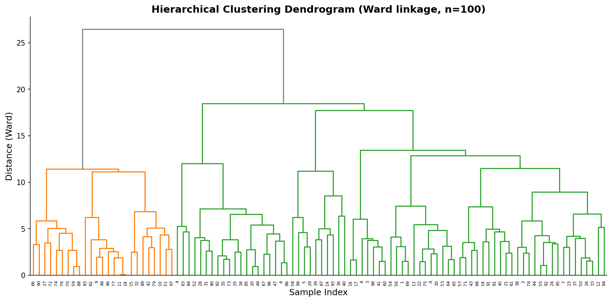
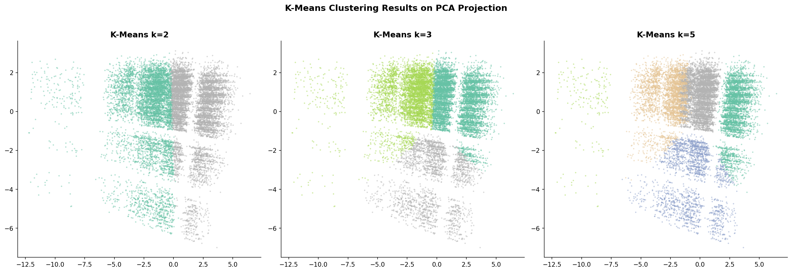
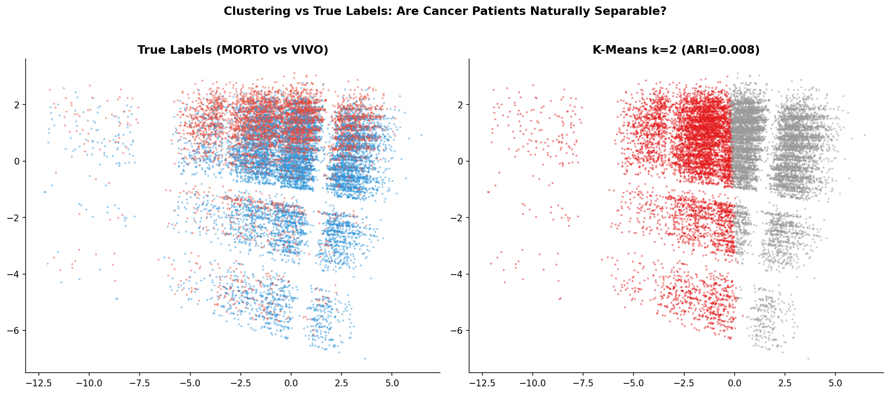

# 模块 3：聚类分析 — K-Means 与层次聚类

> 本模块是案例教程 6 的无监督学习核心模块，承接模块 2（降维可视化）。在用 PCA/t-SNE/UMAP 观察了数据的宏观结构后，我们自然要问：**如果不看标签，能否自动发现良性/恶性群体？** 这是一个特别适合科研训练的问题——**"无监督学习能否发现有监督学习的分类"**。本模块用 K-Means 和层次聚类两种方法，在不使用真实标签的情况下，尝试自动发现数据中的群体结构，然后用 ARI（调整兰德指数）和 Silhouette（轮廓系数）评估聚类结果与真实标签的吻合度。 
>
> 本模块最核心的发现有三个：**一是 K-Means 的 ARI ≈ 0**——聚类结果与真实标签几乎没有重合，说明存活和死亡患者在欧几里得距离下不是天然可分的；**二是 Silhouette ≈ 0.15**——聚类结构存在但不是球形簇，K-Means 的球形假设不成立；**三是无监督聚类无法发现有监督分类**——这印证了模块 2 的可视化结论，也强调了"有监督学习使用标签是关键"。

***

## 学习目标

学完本模块后，你将能够：

1. **理解聚类的本质**：知道聚类是"无监督学习"——不使用真实标签，仅凭特征相似性把样本分组，并能区分聚类与分类的根本差异。
2. **掌握 K-Means 算法的数学原理**：能够说出 K-Means 的四步迭代流程（初始化质心、分配样本、更新质心、收敛判断），并解释"簇内方差最小"的优化目标。
3. **理解 K-Means 的关键参数**：能够解释 `n_clusters`、`random_state`、`n_init` 三个参数的含义，并知道为什么 `n_init=10` 能缓解初始值敏感问题。
4. **掌握 ARI（调整兰德指数）的解读**：能够说出 ARI=1（完美匹配）、ARI=0（等同随机）、ARI<0（比随机还差）的含义，并解读 ARI≈0 的结论。
5. **掌握 Silhouette（轮廓系数）的解读**：能够说出 Silhouette 衡量"簇内紧密、簇间分离"，范围 \[-1, 1]，并解读 Silhouette≈0.15 的结论。
6. **区分 ARI 和 Silhouette**：知道 ARI 需要真实标签（外部评估），Silhouette 不需要真实标签（内部评估），并能说出各自的适用场景。
7. **理解层次聚类与树状图**：能够解释 Ward 连接法的原理，并从树状图中读出"哪些样本先合并、哪些后合并"。
8. **建立"无监督 ≠ 有监督"的批判性思维**：能够从 ARI≈0 的实验结果中得出"存活和死亡不是天然分离的群体"这一结论，并理解为什么有监督学习需要标签。

***

## 一、开篇讨论：不看标签能否发现天然群体？

在模块 2 中，我们用 PCA/t-SNE/UMAP 观察了数据的宏观结构，发现"两类有分离趋势但不彻底"。这引出一个更深层的问题：**如果不看标签，能否自动发现良性/恶性群体？**

### 1.1 有监督 vs 无监督学习

| 对比      | 有监督学习（分类）         | 无监督学习（聚类）    |
| ------- | ----------------- | ------------ |
| **输入**  | 特征 X + 标签 y       | 仅特征 X        |
| **目标**  | 学习 X → y 的映射      | 发现 X 中的自然分组  |
| **评估**  | 用 y 计算 AUC/Recall | 用聚类内部指标或外部标签 |
| **本教程** | 模块 5（LogReg）      | 本模块（K-Means） |

### 1.2 本实验的核心问题

> **如果不用标签，K-Means 能否自动把患者分成"存活组"和"死亡组"？**

这是一个特别适合科研训练的问题——**"无监督学习能否发现有监督学习的分类"**。

如果 K-Means 的聚类结果和真实标签高度吻合（ARI 接近 1），说明存活和死亡患者在特征空间中是天然分离的群体——即使不用标签，也能自动发现。

如果 K-Means 的聚类结果和真实标签几乎无关（ARI 接近 0），说明存活和死亡患者在特征空间中不是天然分离的——必须有标签才能区分。

### 1.3 实验设计

本模块的实验设计：

1. **K-Means 聚类**：用 k=2、3、5 三种簇数，在 15,000 样本上聚类。
2. **ARI 评估**：把聚类结果和真实标签（VIVO/MORTO）对比，计算 ARI。
3. **Silhouette 评估**：计算轮廓系数，评估聚类质量（不需要真实标签）。
4. **层次聚类**：用 Ward 连接法，绘制树状图，观察层次结构。
5. **可视化**：把聚类结果画在 PCA 投影上，对比"聚类分组"和"真实标签"。

***

## 二、K-Means 算法原理

在解读代码前，先理解 K-Means 的数学原理。

### 2.1 K-Means 的优化目标

K-Means 的目标是**最小化簇内方差**（Within-Cluster Sum of Squares, WCSS）：

```
minimize  Σ Σ ||x_i - μ_c||²
         c=1 i∈C_c

其中：
- K 是簇数
- C_c 是第 c 个簇的样本集合
- μ_c 是第 c 个簇的质心（均值）
- ||x_i - μ_c||² 是样本到质心的欧氏距离平方
```

直观理解：让每个簇内的点尽可能"紧密"——离质心近。

### 2.2 K-Means 的四步迭代

```
第 1 步: 初始化质心
         随机选择 K 个样本作为初始质心 μ_1, μ_2, ..., μ_K

第 2 步: 分配样本
         对每个样本 x_i，计算它到所有质心的距离
         把 x_i 分配到最近的质心所在的簇

第 3 步: 更新质心
         对每个簇 c，重新计算质心为该簇所有样本的均值
         μ_c = (1/|C_c|) Σ x_i   (i∈C_c)

第 4 步: 收敛判断
         如果质心不再变化（或变化小于阈值），停止
         否则回到第 2 步
```

### 2.3 K-Means 的假设与局限

| 假设        | 说明                    | 本数据集是否满足                        |
| --------- | --------------------- | ------------------------------- |
| **簇是球形**  | K-Means 用欧氏距离，假设簇是球形的 | ❌ 不满足（数据是椭圆/不规则）                |
| **簇大小相近** | 假设各簇的样本数相近            | ❌ 不满足（VIVO 71.68%，MORTO 28.32%） |
| **簇密度均匀** | 假设各簇的密度相近             | ❌ 可能不满足                         |
| **K 已知**  | 需要预设 K 值              | ✅ 我们测试 k=2、3、5                  |

> ⚠️ **重点概念：K-Means 的球形假设**
>
> K-Means 用欧氏距离度量"相似性"，这隐含假设**簇是球形的**——各向同性，每个方向的方差相近。
>
> 但本数据集的特征高度相关（如 `Age`/`Age_Sq`/`Age_Centered`），数据在特征空间中是**椭圆形**的，不是球形的。K-Means 的球形假设不成立，聚类效果会受影响。
>
> 这就是为什么本模块还会用层次聚类（Ward 连接法）作为补充——它不要求球形假设。

***

## 三、模块 7 代码详解：K-Means 聚类

```python
# ============================================================================
# 模块 7: 聚类分析
# ============================================================================
print("\n" + "=" * 70)
print("模块 7: 聚类分析 — 不看标签能否发现天然群体")
print("=" * 70)

# K-Means
print("\n  正在运行 K-Means (k=2, k=3, k=5)...")
kmeans_results = []
for k in [2, 3, 5]:
    km = KMeans(n_clusters=k, random_state=RANDOM_STATE, n_init=10)
    labels_km = km.fit_predict(X_manifold)
    sil = silhouette_score(X_manifold, labels_km)
    ari = adjusted_rand_score(y_manifold, labels_km)
    kmeans_results.append({'K': k, 'Silhouette': sil, 'ARI': ari})
    print(f"    K-Means k={k}: Silhouette={sil:.4f}, ARI={ari:.4f}")
```

### 3.1 `for k in [2, 3, 5]`

测试三个簇数：

- **k=2**：对应真实标签的两类（VIVO/MORTO）。如果 K-Means 能发现这两类，ARI 应该接近 1。
- **k=3**：测试是否存在第三个隐藏子群。
- **k=5**：测试更细的分组。

### 3.2 `km = KMeans(n_clusters=k, random_state=RANDOM_STATE, n_init=10)`

创建 K-Means 对象，关键参数：

| 参数             | 含义          | 本教程取值       | 说明     |
| -------------- | ----------- | ----------- | ------ |
| `n_clusters`   | 簇数 K        | `2`/`3`/`5` | 需要预设   |
| `random_state` | 随机种子        | `42`        | 固定初始质心 |
| `n_init`       | 用不同初始值运行的次数 | `10`        | 取最优结果  |

#### `n_init=10` 详解

K-Means 对初始质心敏感——不同的初始质心可能导致不同的局部最优解。`n_init=10` 表示：

1. 用 10 组不同的随机初始质心，各跑一次 K-Means。
2. 选择 WCSS（簇内方差）最小的那次作为最终结果。

> 💡 **重点概念：为什么** **`n_init=10`** **能缓解初始值敏感？**
>
> K-Means 是非凸优化——有多个局部最优解。如果只跑一次（`n_init=1`），可能陷入不好的局部最优。
>
> `n_init=10` 跑 10 次，取最优——相当于"多起点搜索"，大大增加了找到全局最优（或接近全局最优）的概率。
>
> sklearn 1.4+ 默认 `n_init='auto'`，会根据 `init` 参数自动选择。本教程显式设为 10，确保结果稳定。

### 3.3 `labels_km = km.fit_predict(X_manifold)`

- **`fit_predict`**：一步完成"训练 + 预测"。
  - `fit`：学习 K 个质心。
  - `predict`：把每个样本分配到最近的质心所在的簇。
- **输入**：15,000 × 22 的 `X_manifold`。
- **输出**：15,000 个簇标签（0, 1, ..., K-1）。

> ⚠️ **注意**：K-Means 的簇标签（0, 1）和真实标签（0=MORTO, 1=VIVO）**没有对应关系**。簇 0 可能对应 MORTO，也可能对应 VIVO，甚至可能是混合的。ARI 会自动处理这种"标签置换"问题。

### 3.4 `sil = silhouette_score(X_manifold, labels_km)`

计算轮廓系数（Silhouette Score），衡量聚类质量。

#### 轮廓系数的数学定义

对每个样本 i，计算：

```
a(i) = 样本 i 到同簇其他样本的平均距离（簇内紧密度）
b(i) = 样本 i 到最近其他簇样本的平均距离（簇间分离度）

s(i) = (b(i) - a(i)) / max(a(i), b(i))
```

轮廓系数 s(i) 的范围是 \[-1, 1]：

- **s(i) ≈ 1**：样本 i 分类正确（簇内紧密、簇间分离）。
- **s(i) ≈ 0**：样本 i 在两个簇的边界上。
- **s(i) ≈ -1**：样本 i 分类错误（应该属于另一个簇）。

整体 Silhouette = 所有样本 s(i) 的平均值。

#### Silhouette 的解读

| Silhouette | 解读      |
| ---------- | ------- |
| 0.7–1.0    | 优秀的聚类结构 |
| 0.5–0.7    | 良好的聚类结构 |
| 0.25–0.5   | 一般的聚类结构 |
| 0–0.25     | 弱的聚类结构  |
| <0         | 聚类错误    |

> 💡 **重点概念：Silhouette 不需要真实标签**
>
> Silhouette 只用特征 X 和聚类标签，不需要真实标签 y。这是**内部评估指标**——评估聚类本身的质量，而不是和真实标签的吻合度。
>
> 适合的场景：没有真实标签，或想评估"聚类结构本身是否紧密"。

### 3.5 `ari = adjusted_rand_score(y_manifold, labels_km)`

计算调整兰德指数（Adjusted Rand Index, ARI），衡量聚类结果与真实标签的吻合度。

#### ARI 的数学定义

ARI 基于"列联表"（contingency table），统计"聚类和真实标签一致的样本对"数量，并做随机校正：

```
ARI = (RI - E[RI]) / (max(RI) - E[RI])

其中：
- RI = 兰德指数 = 一致的样本对比例
- E[RI] = 随机聚类下的期望 RI
- max(RI) = 完美聚类下的最大 RI
```

#### ARI 的解读

| ARI | 解读                |
| --- | ----------------- |
| 1.0 | 完美匹配（聚类和真实标签完全一致） |
| 0.0 | 等同随机（聚类和真实标签无关）   |
| <0  | 比随机还差（通常很少见）      |

> 💡 **重点概念：ARI 需要真实标签**
>
> ARI 用真实标签 y 和聚类标签对比，是**外部评估指标**——评估聚类结果和真实标签的吻合度。
>
> 适合的场景：有真实标签，想评估"聚类是否发现了真实类别"。

### 3.6 ARI vs Silhouette 对比

| 指标             | 需要真实标签 | 评估内容        | 适用场景               |
| -------------- | ------ | ----------- | ------------------ |
| **ARI**        | ✅ 需要   | 聚类与真实标签的吻合度 | 有标签，评估"聚类是否发现真实类别" |
| **Silhouette** | ❌ 不需要  | 簇内紧密、簇间分离   | 无标签，评估"聚类结构本身的质量"  |

本教程同时报告两个指标：

- **ARI** 告诉我们"聚类是否发现了真实类别"。
- **Silhouette** 告诉我们"聚类结构本身是否紧密"。

### 3.7 实际运行结果

```
============================================================
模块 7: 聚类分析 — 不看标签能否发现天然群体
============================================================

  正在运行 K-Means (k=2, k=3, k=5)...
    K-Means k=2: Silhouette=0.1588, ARI=0.0081
    K-Means k=3: Silhouette=0.1673, ARI=0.0135
    K-Means k=5: Silhouette=0.1471, ARI=0.0179
```

### 3.8 结果解读

| 方法            | 指标         | 值          | 解读         |
| ------------- | ---------- | ---------- | ---------- |
| K-Means (k=2) | ARI        | **0.0081** | 与真实标签几乎无关系 |
| K-Means (k=3) | ARI        | 0.0135     | 略有改善但仍极低   |
| K-Means (k=5) | ARI        | 0.0179     | 无实质性改善     |
| K-Means (k=2) | Silhouette | 0.1588     | 结构存在，但非球形簇 |
| K-Means (k=3) | Silhouette | 0.1673     | 略好         |
| K-Means (k=5) | Silhouette | 0.1471     | 略差         |

#### ARI 解读

**ARI ≈ 0** 意味着**聚类结果与真实标签几乎没有重合**。

- k=2 时 ARI=0.0081——K-Means 把 15,000 个样本分成 2 簇，但这个分法和"VIVO/MORTO"的真实分类几乎无关。
- 增加 k（3、5）ARI 略有上升（0.0135、0.0179），但仍极低——说明无论分多少簇，K-Means 都无法发现"存活/死亡"的群体结构。

#### Silhouette 解读

**Silhouette ≈ 0.15** 意味着**聚类结构存在，但很弱**。

- 0.15 在 0–0.25 区间，属于"弱的聚类结构"。
- 这说明数据中确实有一些"聚集"趋势（不是完全随机），但这些聚集不是球形簇——K-Means 的球形假设不成立。

> 💡 **重点概念：ARI≈0 + Silhouette≈0.15 的组合含义**
>
> - **ARI≈0**：聚类结果和真实标签无关——K-Means 没有发现"存活/死亡"群体。
> - **Silhouette≈0.15**：数据中有弱的结构（不是完全随机），但这些结构不是"存活/死亡"的分组。
>
> 这两个指标组合起来告诉我们：**数据中确实有一些结构（可能是年龄、年份等导致的聚集），但这些结构不是"存活/死亡"的天然分界**。

### 3.9 教学结论

> **存活和死亡患者的特征差异不足以在无监督环境下被自动发现。有监督学习（使用标签）是关键。**

这与模块 2 的可视化结论完全一致——PCA/t-SNE/UMAP 都显示两类在中心区域高度重叠。虽然有分离趋势，但重叠度很高，K-Means 无法基于欧氏距离自动分开。

***

## 四、层次聚类与树状图

```python
# 层次聚类 + 绘制前 30 个样本的树状图
print("\n  正在运行 Hierarchical Clustering...")
sample_dendo = 100  # 树状图用小样本
X_dendo = X_manifold[:sample_dendo]
linkage_matrix = linkage(X_dendo, method='ward')

fig, ax = plt.subplots(figsize=(12, 6))
dendrogram(linkage_matrix, color_threshold=0.7 * np.max(linkage_matrix[:, 2]),
           above_threshold_color='gray', leaf_font_size=6, ax=ax)
ax.set_title('Hierarchical Clustering Dendrogram (Ward linkage, n=100)',
             fontsize=14, fontweight='bold')
ax.set_xlabel('Sample Index', fontsize=12)
ax.set_ylabel('Distance (Ward)', fontsize=12)
ax.spines['top'].set_visible(False); ax.spines['right'].set_visible(False)
plt.tight_layout()
plt.savefig(os.path.join(IMG_DIR, "09j_hierarchical_dendrogram.png"),
            dpi=150, bbox_inches='tight')
plt.close()
print("  [图] 09j_hierarchical_dendrogram.png → 层次聚类树状图已保存")
```

### 4.1 层次聚类的原理

层次聚类（Hierarchical Clustering）是一种**自底向上**（Agglomerative）的聚类方法：

```
第 1 步: 每个样本自成一簇（n 个簇）
第 2 步: 找到最相似的两个簇，合并成一个
第 3 步: 重复第 2 步，直到所有样本合并成一个大簇
第 4 步: 绘制树状图（Dendrogram），展示合并过程
```

### 4.2 Ward 连接法

`method='ward'` 是最常用的连接方法，它的合并准则是：**合并后让总簇内方差增加最小**。

```
Ward 距离 = 合并后的 WCSS - 合并前的 WCSS
```

直观理解：Ward 方法倾向于合并"大小相近、方差相近"的簇，避免"大簇吞并小簇"。

> 💡 **Ward vs 其他连接法**：
>
> - **Ward**：合并后簇内方差增加最小。适合球形簇。
> - **single**（单连接）：两簇间最近样本的距离。适合链状簇。
> - **complete**（全连接）：两簇间最远样本的距离。适合紧凑簇。
> - **average**（平均连接）：两簇间所有样本对的平均距离。折中方案。

### 4.3 代码详解

#### `sample_dendo = 100` 和 `X_dendo = X_manifold[:sample_dendo]`

- **为什么只用 100 个样本？** 层次聚类的复杂度是 O(n²)（计算所有样本对的距离），15,000 样本的树状图会非常密集，无法阅读。100 个样本的树状图已经足够展示层次结构。
- **`X_manifold[:100]`**：取前 100 个样本（不是随机采样，是为了可复现）。

#### `linkage_matrix = linkage(X_dendo, method='ward')`

- **`linkage`**：计算层次聚类的连接矩阵。
- **`method='ward'`**：用 Ward 连接法。
- **`linkage_matrix`**：形状是 (n-1, 4) 的矩阵，每行表示一次合并：
  - 列 1：合并的簇 1
  - 列 2：合并的簇 2
  - 列 3：合并时的距离（Ward 距离）
  - 列 4：合并后新簇的样本数

#### `dendrogram(linkage_matrix, color_threshold=0.7 * np.max(linkage_matrix[:, 2]), ...)`

绘制树状图：

- **`color_threshold=0.7 * np.max(linkage_matrix[:, 2])`**：颜色阈值，距离超过 70% 最大距离的合并用灰色，低于的用不同颜色——帮助识别"自然簇数"。
- **`above_threshold_color='gray'`**：超过阈值的合并用灰色。
- **`leaf_font_size=6`**：叶子节点（样本）标签的字体大小。

### 4.4 树状图解读



**从树状图可以观察到**：

1. **层次结构**：树状图从下往上，每个"分叉"表示一次合并。最底层是 100 个独立样本，最顶层是 1 个大簇。
2. **颜色分组**：不同颜色的分支表示不同的簇。颜色阈值（70% 最大距离）把树分成几个主要分支。
3. **合并距离**：y 轴是 Ward 距离——合并发生得越高，说明合并的两个簇越不相似。

> 💡 **小贴士：如何从树状图确定簇数？**
>
> 树状图确定簇数的方法：**画一条水平线，穿过多少条垂直线，就有多少个簇**。
>
> - 如果在 y=较低位置画线 → 簇数多（细粒度分组）。
> - 如果在 y=较高位置画线 → 簇数少（粗粒度分组）。
>
> 本教程用 70% 最大距离作为阈值，这是经验值。实际应用中，可以尝试多个阈值，观察簇数的变化。

***

## 五、K-Means 聚类结果可视化

```python
# K-Means 聚类结果在 PCA 投影上可视化
fig, axes = plt.subplots(1, 3, figsize=(18, 6))
for idx, k in enumerate([2, 3, 5]):
    km = KMeans(n_clusters=k, random_state=RANDOM_STATE, n_init=10)
    labels_km = km.fit_predict(X_manifold)
    ax = axes[idx]
    scatter = ax.scatter(X_pca_2d[:, 0], X_pca_2d[:, 1], c=labels_km,
                         cmap='Set2', alpha=0.5, s=5, edgecolor='none')
    ax.set_title(f'K-Means k={k}', fontsize=13, fontweight='bold')
    ax.spines['top'].set_visible(False); ax.spines['right'].set_visible(False)
plt.suptitle('K-Means Clustering Results on PCA Projection',
             fontsize=14, fontweight='bold', y=1.02)
plt.tight_layout()
plt.savefig(os.path.join(IMG_DIR, "09k_kmeans_clusters.png"),
            dpi=150, bbox_inches='tight')
plt.close()
print("  [图] 09k_kmeans_clusters.png → K-Means 聚类可视化已保存")
```

### 5.1 代码逻辑

- 对 k=2、3、5 各跑一次 K-Means。
- 把聚类结果画在 PCA 二维投影上（`X_pca_2d`）。
- **`c=labels_km`**：用聚类标签上色（不是真实标签）。
- **`cmap='Set2'`**：用 Set2 颜色映射（柔和的分类色）。



### 5.2 可视化解读

**从图中可以观察到**：

1. **k=2**：K-Means 把数据分成两簇，但分界线和"VIVO/MORTO"的真实分界**完全不同**。K-Means 的分界更像是沿 PC1 方向的"水平切割"，而真实标签的分界是"混合的"。
2. **k=3**：分成三簇，多出来的簇主要是 PC1 右侧的"极端点"。
3. **k=5**：分成五簇，更细的分组，但和真实标签依然无关。

> ⚠️ **重点概念：聚类分组 ≠ 真实标签**
>
> 看这张图时，要记住：**颜色是聚类标签，不是真实标签**。K-Means 的分组是基于欧氏距离的"自然聚集"，和"存活/死亡"的真实分类无关。
>
> 这正是 ARI≈0 的可视化体现——K-Means 的分组和真实标签几乎完全不重合。

***

## 六、聚类 vs 真实标签对比

```python
# 聚类 vs 真实标签对比
fig, axes = plt.subplots(1, 2, figsize=(14, 6))
ax = axes[0]
ax.scatter(X_pca_2d[:, 0], X_pca_2d[:, 1], c=colors_pca,
           alpha=0.5, s=5, edgecolor='none')
ax.set_title('True Labels (MORTO vs VIVO)', fontsize=13, fontweight='bold')
ax.spines['top'].set_visible(False); ax.spines['right'].set_visible(False)

km2 = KMeans(n_clusters=2, random_state=RANDOM_STATE, n_init=10)
labels_km2 = km2.fit_predict(X_manifold)
ax = axes[1]
scatter = ax.scatter(X_pca_2d[:, 0], X_pca_2d[:, 1], c=labels_km2,
                     cmap='Set1', alpha=0.5, s=5, edgecolor='none')
ax.set_title(f'K-Means k=2 (ARI={kmeans_results[0]["ARI"]:.3f})',
             fontsize=13, fontweight='bold')
ax.spines['top'].set_visible(False); ax.spines['right'].set_visible(False)
plt.suptitle('Clustering vs True Labels: Are Cancer Patients Naturally Separable?',
             fontsize=13, fontweight='bold', y=1.02)
plt.tight_layout()
plt.savefig(os.path.join(IMG_DIR, "09l_clustering_vs_true.png"),
            dpi=150, bbox_inches='tight')
plt.close()
print("  [图] 09l_clustering_vs_true.png → 聚类 vs 真实标签对比已保存")
```

### 6.1 代码逻辑

- **左图**：用真实标签上色（`colors_pca`，蓝色=MORTO，红色=VIVO）。
- **右图**：用 K-Means k=2 的聚类标签上色（`labels_km2`，Set1 颜色映射）。
- 右图标题包含 ARI 值（0.008），直观显示"吻合度极低"。



### 6.2 对比解读

**从对比图可以观察到**：

1. **左图（真实标签）**：VIVO（红色）和 MORTO（蓝色）在 PCA 投影中高度混合，中心区域重叠严重。
2. **右图（K-Means k=2）**：K-Means 的分界是"沿 PC1 的水平切割"——把 PC1 大的归一类，PC1 小的归另一类。这个分界和真实标签的分界**完全不同**。
3. **ARI=0.008**：标题中的 ARI 值直观显示"聚类结果和真实标签几乎无关"。

> 💡 **重点概念：为什么 K-Means 的分界和真实标签不同？**
>
> K-Means 优化的是"簇内方差最小"，它找到的是"特征空间中自然聚集的方向"。而真实标签（VIVO/MORTO）的分布是"混合的"——存活和死亡患者在特征空间中高度重叠。
>
> K-Means 找到的"自然聚集"主要是沿 PC1（年龄方向）的分组，而不是"存活/死亡"的分组。这就是 ARI≈0 的原因。

***

## 七、讨论：数据天然可分吗？

本模块的实验给出了明确的答案：

```
PCA 投影中可见分离趋势 ≠ 天然可分
t-SNE 中视觉分离明显   ≠ 天然可分
K-Means ARI ≈ 0        = 天然不可分 (在欧几里得距离下)
```

### 7.1 三种证据的一致结论

| 证据              | 来源   | 结论                     |
| --------------- | ---- | ---------------------- |
| PCA 可视化         | 模块 2 | 两类有分离趋势但不彻底，中心区域重叠     |
| t-SNE 可视化       | 模块 2 | 视觉分离强但这是 t-SNE 的"视觉增强" |
| K-Means ARI≈0   | 本模块  | 聚类结果和真实标签几乎无关          |
| Silhouette≈0.15 | 本模块  | 数据有弱结构，但不是"存活/死亡"分组    |

**综合结论**：**存活和死亡患者在欧几里得距离下不是天然可分的群体**。

### 7.2 为什么 K-Means 失败？

K-Means 失败的原因有三个：

1. **数据不是球形簇**：K-Means 假设簇是球形的，但本数据集的特征高度相关，数据是椭圆形的。
2. **两类高度重叠**：VIVO 和 MORTO 在特征空间中高度重叠，没有清晰的"分界线"。
3. **类别不平衡**：VIVO 占 71.68%，MORTO 占 28.32%。K-Means 倾向于生成大小相近的簇，不平衡会让它"分错"。

### 7.3 如果换用其他聚类方法会不同吗？

教学文档中提到，如果换用 Spectral Clustering（谱聚类），结果可能不同。谱聚类基于图论，可以处理非球簇。但即使谱聚类能找到一些结构，ARI 也不会很高——因为存活和死亡患者在特征空间中确实高度重叠。

> 💡 **重点概念：有监督 vs 无监督的根本差异**
>
> 本模块的实验揭示了一个重要事实：**无监督学习（聚类）无法发现有监督学习（分类）的类别**。
>
> - 有监督学习用标签 y 引导模型学习"什么特征导致存活/死亡"。
> - 无监督学习不用标签，只能发现"特征空间中的自然聚集"。
>
> 如果"自然聚集"和"存活/死亡"不一致，无监督学习就找不到存活/死亡的分类。这就是为什么**有监督学习需要标签**——标签提供了"我们关心什么分类"的信息。

***

## 八、聚类方法的扩展

本教程只用了 K-Means 和层次聚类，实际上还有很多聚类方法：

| 方法                      | 特点          | 缺点           | 适用场景        |
| ----------------------- | ----------- | ------------ | ----------- |
| **K-Means**             | 简单快速，假设球形簇  | 需预设 K，对初始值敏感 | 大数据集，球形簇    |
| **层次聚类**                | 树状图直观展示层次结构 | 计算量大，O(n²)   | 小数据集，需要层次结构 |
| **DBSCAN**              | 基于密度，无需预设 K | 对距离阈值敏感      | 任意形状的簇，噪声检测 |
| **Gaussian Mixture**    | 软聚类，概率分配    | 需预设组件数       | 簇是高斯分布      |
| **Spectral Clustering** | 基于图论，可处理非球簇 | 计算量大         | 非球簇，图数据     |

### 8.1 K-Means 的适用场景

```
✅ K-Means 适合:
  - 簇是球形的（各向同性）
  - 簇大小相近
  - 数据量大（K-Means 快）
  - K 已知或可估计

❌ K-Means 不适合:
  - 簇是非球形的（如环形、链状）
  - 簇大小差异大
  - 有大量噪声/离群点
  - K 未知且难以估计
```

### 8.2 本数据集为什么不适合 K-Means？

1. **簇不是球形**：特征高度相关，数据是椭圆形。
2. **簇大小不平衡**：VIVO 71.68%，MORTO 28.32%。
3. **两类高度重叠**：没有清晰的"分界线"。

***

## 小贴士

1. **聚类的本质是无监督学习**：不使用真实标签，仅凭特征相似性分组。与分类（有监督）的根本差异。
2. **K-Means 假设球形簇**：用欧氏距离，隐含假设簇是球形的。如果数据是椭圆形（特征相关），K-Means 效果会受影响。
3. **`n_init=10`** **缓解初始值敏感**：跑 10 次取最优，大大增加找到全局最优的概率。
4. **ARI 需要真实标签**：评估聚类和真实标签的吻合度。ARI=1 完美匹配，ARI=0 等同随机。
5. **Silhouette 不需要真实标签**：评估聚类结构本身的质量。范围 \[-1, 1]，越大越好。
6. **ARI≈0 + Silhouette≈0.15 的组合**：数据有弱结构，但这些结构不是"存活/死亡"的分组。
7. **层次聚类的树状图**：直观展示合并过程，适合小数据集（<1000 样本）。
8. **Ward 连接法**：合并后让簇内方差增加最小，适合球形簇。
9. **无监督 ≠ 有监督**：聚类发现的"自然聚集"可能和"我们关心的分类"完全不同。这就是为什么有监督学习需要标签。

***

## 常见问题

### Q1: 为什么 K-Means 的 ARI≈0？

**A**: 三个原因：

1. **数据不是球形簇**：K-Means 假设球形，但本数据集特征高度相关，数据是椭圆形。
2. **两类高度重叠**：VIVO 和 MORTO 在特征空间中高度重叠，没有清晰分界线。
3. **K-Means 找的是"自然聚集"**：它找到的是沿 PC1（年龄方向）的分组，而不是"存活/死亡"的分组。

### Q2: ARI 和 Silhouette 有什么区别？

**A**:

- **ARI**：需要真实标签（外部评估），衡量"聚类是否发现了真实类别"。ARI=1 完美匹配，ARI=0 等同随机。
- **Silhouette**：不需要真实标签（内部评估），衡量"簇内紧密、簇间分离"。范围 \[-1, 1]，越大越好。

本教程同时报告两个指标：ARI 告诉我们"聚类是否发现了真实类别"，Silhouette 告诉我们"聚类结构本身是否紧密"。

### Q3: 为什么层次聚类只用 100 个样本？

**A**: 层次聚类的复杂度是 O(n²)（计算所有样本对的距离），15,000 样本的树状图会非常密集，无法阅读。100 个样本的树状图已经足够展示层次结构。

### Q4: 如果换用 Spectral Clustering，结果会不同吗？

**A**: 可能略有改善，但不会有质的变化。谱聚类基于图论，可以处理非球簇，但如果两类在特征空间中高度重叠，即使谱聚类也找不到清晰的分界。本数据集的核心问题是"存活和死亡患者在特征空间中重叠"，这不是聚类算法能解决的——需要有监督学习的标签引导。

### Q5: K-Means 的 k 应该选多少？

**A**: 常见方法：

- **肘部法**：画 WCSS vs k 曲线，选拐点。
- **Silhouette 法**：选 Silhouette 最大的 k。
- **业务需求**：如果业务上知道应该有 3 类，就选 k=3。
- 本教程测试 k=2、3、5，发现 k 对 ARI 影响不大（都接近 0）。

### Q6: 为什么 K-Means 的分界和真实标签不同？

**A**: K-Means 优化"簇内方差最小"，找到的是"特征空间中自然聚集的方向"。本数据集中，K-Means 找到的是沿 PC1（年龄方向）的分组，而不是"存活/死亡"的分组。因为"存活/死亡"的分布和"年龄方向"不完全一致——老年患者死亡率高，但不是所有老年患者都死亡，也不是所有年轻患者都存活。

### Q7: Silhouette≈0.15 说明什么？

**A**: 0.15 在 0–0.25 区间，属于"弱的聚类结构"。这说明数据中确实有一些"聚集"趋势（不是完全随机），但这些聚集不是"存活/死亡"的分组——可能是年龄、年份等导致的聚集。

### Q8: 聚类分析有什么实际应用？

**A**: 聚类在医学中的应用：

- **患者分型**：发现疾病的亚型（如糖尿病的 1 型/2 型）。
- **异常检测**：发现"与众不同"的患者（可能是误诊或特殊病例）。
- **基因表达分析**：发现基因表达模式相似的基因组。
- **影像分组**：把相似的医学影像分组。

但本教程的实验显示，对于"存活/死亡"这个二分类问题，聚类无法替代有监督学习。

***

## 本模块小结

本模块用 K-Means 和层次聚类，在不使用真实标签的情况下，尝试自动发现数据中的群体结构：

### K-Means 聚类

1. **ARI 极低**：k=2 时 ARI=0.0081，k=3 时 0.0135，k=5 时 0.0179——聚类结果与真实标签几乎无关。
2. **Silhouette 弱**：0.15 左右，属于"弱的聚类结构"——数据有聚集趋势但不是球形簇。
3. **结论**：K-Means 无法发现"存活/死亡"的群体结构。

### 层次聚类

1. **树状图**：用 100 个样本绘制，展示层次合并过程。
2. **Ward 连接法**：合并后让簇内方差增加最小。
3. **结论**：层次结构存在，但和真实标签无关。

### 可视化对比

1. **聚类 vs 真实标签**：K-Means 的分界（沿 PC1 水平切割）和真实标签的分界（混合的）完全不同。
2. **ARI=0.008**：标题直观显示"吻合度极低"。

### 核心结论

> **存活和死亡患者在欧几里得距离下不是天然可分的群体**——K-Means ARI≈0 印证了模块 2 的可视化结论。这强调了**有监督学习需要标签**——标签提供了"我们关心什么分类"的信息，这是无监督学习无法替代的。

这与模块 2 的可视化结论完全一致：

- PCA 投影中可见分离趋势 ≠ 天然可分
- t-SNE 中视觉分离明显 ≠ 天然可分
- K-Means ARI ≈ 0 = 天然不可分（在欧几里得距离下）

> 💡 **下一模块预告**：模块 4 将用 PCA 降维后的特征训练逻辑回归，验证"降维是否会损失信息"。我们会比较原始 22 维特征和 PCA-5/10/15/20 维特征下的模型性能，回答"PCA 只是画图的，还是也能用于建模"这个问题。同时，我们还会对比 PCA 和特征选择（Filter/RF）在相同维度下的性能差异。

