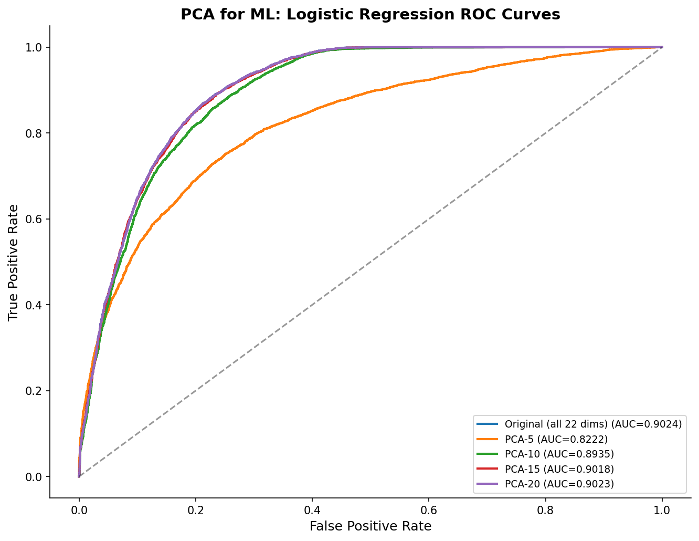
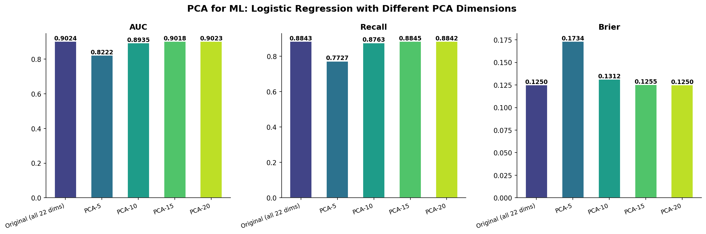
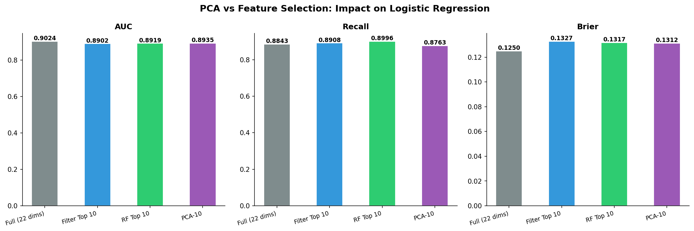

# 模块 4：PCA 用于机器学习与特征选择对比

> 本模块是案例教程 6 的收官模块，承接模块 3（聚类分析）。在用可视化（模块 2）和聚类（模块 3）探索了数据结构后，我们回到一个实际问题：**PCA 不只是画图工具，它也能用于建模——把高维数据压缩后训练模型，性能如何？** 本模块用两个实验回答两个核心问题：**一是"降维是否会损失信息？"**——通过比较原始 22 维特征和 PCA-5/10/15/20 维特征下的逻辑回归性能，验证 PCA 的信息保留能力；**二是"PCA 和特征选择哪个更好？"**——通过对比 PCA-10、Filter Top 10、RF Top 10 在相同维度下的性能，讨论"可解释性 vs 信息保留"的权衡。 
>
> 本模块最核心的发现有三个：**一是 PCA-10（仅 10 个主成分）已经达到全特征 AUC 的 99.0%**（0.8935 / 0.9024）——降维几乎不损失性能；**二是 PCA-15 几乎完全恢复到全特征性能**（AUC=0.9018 vs 0.9024）——15 个主成分就够了；**三是 PCA-10 的 AUC 略高于 Filter Top 10 和 RF Top 10**——PCA 的正交性带来了额外稳定性，但代价是可解释性。

***

## 学习目标

学完本模块后，你将能够：

1. **理解 PCA 用于建模的原理**：知道 PCA 不只是可视化工具，还可以把高维特征压缩后喂给模型，并解释"PCA 生成正交主成分"对建模的好处。
2. **掌握 PCA 降维对模型性能的影响**：能够从实验数据中读出"PCA-5 损失较大、PCA-10 接近恢复、PCA-15 完全恢复"的规律，并解释为什么。
3. **解读 ROC 曲线对比图**：能够从多条 ROC 曲线中读出"哪个维度下模型性能最好"，并理解 AUC 的差异。
4. **理解 PCA vs 特征选择的权衡**：能够从输出类型、可解释性、信息保留方式、对模型影响四个维度对比 PCA 和特征选择。
5. **掌握 Filter 特征选择（SelectKBest + f\_classif）**：理解 ANOVA F 检验如何评估特征与标签的关联性，并知道它的局限。
6. **掌握 RF 特征重要性（RandomForest feature\_importances\_）**：理解随机森林如何通过"不纯度减少"评估特征重要性，并知道它和 Filter 的区别。
7. **解读四种方法（Full/Filter/RF/PCA）的性能对比**：能够从 AUC、Recall、Brier 三个指标中读出各方法的优劣，并解释为什么 PCA-10 的 AUC 略高于 Filter/RF Top 10。
8. **建立"可解释性 vs 信息保留"的决策框架**：能够根据应用场景（临床决策 vs 探索分析）选择合适的方法，并说出选择依据。

***

## 一、开篇讨论：PCA 只是画图工具吗？

很多学生认为 PCA 只是"画图的"——把高维数据投影到 2D 平面做可视化。实际上 PCA 可以用于建模——**把高维数据压缩后训练模型**。

### 1.1 PCA 用于建模的流程

```
原始特征 (22 维)
    │
    ├── PCA 降维
    │   └── 保留前 k 个主成分 (如 k=10)
    │
    ▼
降维后特征 (10 维)
    │
    ├── 训练模型 (如逻辑回归)
    │
    ▼
预测 + 评估 (AUC/Recall/Brier)
```

### 1.2 PCA 用于建模的好处

| 好处        | 说明                          |
| --------- | --------------------------- |
| **去除噪声**  | 方差最小的 PC 通常是噪声，丢弃它们相当于去噪    |
| **降低过拟合** | 减少参数数量，降低模型对训练集的过度拟合        |
| **打破共线性** | PCA 生成的 PC 之间正交，完美解决多重共线性问题 |
| **加速训练**  | 特征数减少，模型训练更快                |

### 1.3 本模块的两个实验

**实验 1：PCA 降维对模型性能的影响**

- 比较原始 22 维特征和 PCA-5/10/15/20 维特征下的逻辑回归性能。
- 回答"降维是否会损失信息"。

**实验 2：PCA vs 特征选择**

- 在相同维度（10 维）下，对比 PCA-10、Filter Top 10、RF Top 10 的性能。
- 回答"PCA 和特征选择哪个更好"。

***

## 二、模块 8 代码详解：PCA 用于机器学习

```python
# ============================================================================
# 模块 8: PCA 用于机器学习
# ============================================================================
print("\n" + "=" * 70)
print("模块 8: PCA 用于机器学习 — LogReg 对比")
print("=" * 70)

pca_configs = [
    ('Original (all 22 dims)', None),
    ('PCA-5', PCA(n_components=5)),
    ('PCA-10', PCA(n_components=10)),
    ('PCA-15', PCA(n_components=15)),
    ('PCA-20', PCA(n_components=20)),
]
pca_ml_results = []

fig_roc, ax_roc = plt.subplots(figsize=(9, 7))

for name, pca_obj in pca_configs:
    if pca_obj is None:
        X_tr_pca, X_te_pca = X_train, X_test
    else:
        X_tr_pca = pca_obj.fit_transform(X_train)
        X_te_pca = pca_obj.transform(X_test)

    lr = LogisticRegression(class_weight='balanced', max_iter=5000,
                            random_state=RANDOM_STATE)
    lr.fit(X_tr_pca, y_train)
    y_prob = lr.predict_proba(X_te_pca)[:, 1]
    y_pred = lr.predict(X_te_pca)

    auc = roc_auc_score(y_test, y_prob)
    rec = recall_score(y_test, y_pred, pos_label=1)
    brier = brier_score_loss(y_test, y_prob)

    pca_ml_results.append({'Method': name, 'AUC': auc,
                           'Recall': rec, 'Brier': brier})
    print(f"    {name:<25}  AUC={auc:.4f}  Recall={rec:.4f}  Brier={brier:.4f}")

    fpr, tpr, _ = roc_curve(y_test, y_prob)
    ax_roc.plot(fpr, tpr, linewidth=2, label=f'{name} (AUC={auc:.4f})')
```

### 2.1 `pca_configs` 配置列表

```python
pca_configs = [
    ('Original (all 22 dims)', None),
    ('PCA-5', PCA(n_components=5)),
    ('PCA-10', PCA(n_components=10)),
    ('PCA-15', PCA(n_components=15)),
    ('PCA-20', PCA(n_components=20)),
]
```

定义 5 种配置：

- **Original**：原始 22 维特征（基线，`pca_obj=None`）。
- **PCA-5**：PCA 降到 5 维（保留 68.52% 方差）。
- **PCA-10**：PCA 降到 10 维（保留 91.19% 方差）。
- **PCA-15**：PCA 降到 15 维（保留 99.14% 方差）。
- **PCA-20**：PCA 降到 20 维（保留 99.95% 方差）。

> 💡 **为什么选这些维度？**
>
> - **5 维**：保留 68.52% 方差——信息损失较大，观察"信息不足时性能如何"。
> - **10 维**：保留 91.19% 方差——模块 1 的 KNN 实验显示 10 维已接近峰值。
> - **15 维**：保留 99.14% 方差——几乎不损失信息。
> - **20 维**：保留 99.95% 方差——只丢 2 个 PC，观察"最后几个 PC 是否含有用信息"。

### 2.2 循环体详解

```python
for name, pca_obj in pca_configs:
    if pca_obj is None:
        X_tr_pca, X_te_pca = X_train, X_test
    else:
        X_tr_pca = pca_obj.fit_transform(X_train)
        X_te_pca = pca_obj.transform(X_test)
    ...
```

#### `if pca_obj is None:`

如果是原始特征（`pca_obj=None`），直接用 `X_train` 和 `X_test`，不做 PCA。

#### `else:` 分支

```python
X_tr_pca = pca_obj.fit_transform(X_train)
X_te_pca = pca_obj.transform(X_test)
```

- **`fit_transform(X_train)`**：在训练集上学习 PCA 变换，并应用——得到降维后的训练集。
- **`transform(X_test)`**：用训练集学到的 PCA 变换，应用到测试集——得到降维后的测试集。

> ⚠️ **重点概念：避免数据泄漏**
>
> PCA 的 `fit` 只能在训练集上做——如果在整个数据集（训练+测试）上 `fit`，就会"偷看"测试集的信息，导致评估有偏。
>
> 正确做法：训练集 `fit_transform`，测试集 `transform`。这样测试集是"完全未见过的"，评估才公平。

### 2.3 逻辑回归训练

```python
lr = LogisticRegression(class_weight='balanced', max_iter=5000,
                        random_state=RANDOM_STATE)
lr.fit(X_tr_pca, y_train)
y_prob = lr.predict_proba(X_te_pca)[:, 1]
y_pred = lr.predict(X_te_pca)
```

#### `LogisticRegression` 参数详解

| 参数             | 含义     | 本教程取值        | 说明              |
| -------------- | ------ | ------------ | --------------- |
| `class_weight` | 类别权重   | `'balanced'` | 自动平衡类别权重（应对不平衡） |
| `max_iter`     | 最大迭代次数 | `5000`       | 确保收敛            |
| `random_state` | 随机种子   | `42`         | 固定随机性           |

##### `class_weight='balanced'` 详解

本数据集 VIVO 占 71.68%，MORTO 占 28.32%——不平衡。如果不平衡，逻辑回归会"偏心"多数类（VIVO），导致 MORTO 的 Recall 很低。

`class_weight='balanced'` 会自动调整类别权重：

- 少数类（MORTO）权重 = n\_samples / (2 × n\_classes × n\_MORTO) ≈ 1.77
- 多数类（VIVO）权重 = n\_samples / (2 × n\_classes × n\_VIVO) ≈ 0.70

这样少数类的每个样本"更重要"，模型会更努力识别少数类。

##### `max_iter=5000` 详解

逻辑回归用梯度下降优化，`max_iter` 是最大迭代次数。默认 100 可能不够（特别是特征未标准化时），设为 5000 确保收敛。

> 💡 **为什么本教程的 PCA 实验不会遇到收敛问题？**
>
> 因为 PCA 生成的主成分是**标准化的**（方差为特征值，但相对大小适中），且**正交的**（共线性为 0）。这让逻辑回归的优化更稳定，不容易卡在鞍点。

#### `y_prob = lr.predict_proba(X_te_pca)[:, 1]`

- **`predict_proba`**：返回每个测试样本属于每个类别的概率，形状 (n\_samples, 2)。
- **`[:, 1]`**：取第二列，即属于类别 1（VIVO）的概率。

#### `y_pred = lr.predict(X_te_pca)`

返回预测的类别标签（0 或 1），阈值默认 0.5。

### 2.4 评估指标计算

```python
auc = roc_auc_score(y_test, y_prob)
rec = recall_score(y_test, y_pred, pos_label=1)
brier = brier_score_loss(y_test, y_prob)
```

#### `auc = roc_auc_score(y_test, y_prob)`

计算 AUC（ROC 曲线下面积）：

- AUC=1 完美，AUC=0.5 随机。
- 用 `y_prob`（概率）计算，不是 `y_pred`（类别）。

#### `rec = recall_score(y_test, y_pred, pos_label=1)`

计算 Recall（召回率）：

- **`pos_label=1`**：正类是 1（VIVO，存活）。
- Recall = TP / (TP + FN) = 正确预测的 VIVO / 所有真实 VIVO。
- 用 `y_pred`（类别）计算，不是 `y_prob`。

> 💡 **为什么关注 VIVO 的 Recall？**
>
> 在医疗场景中，"存活"是多数类。我们关注"有多少存活患者被正确识别"——如果 Recall 低，说明很多存活患者被误判为死亡，这会带来不必要的医疗资源浪费和心理负担。

#### `brier = brier_score_loss(y_test, y_prob)`

计算 Brier 分数（预测概率的校准程度）：

- Brier = (1/n) Σ (y\_prob\_i - y\_i)²
- Brier 越低，预测概率越可靠。
- 用 `y_prob`（概率）计算。

### 2.5 ROC 曲线绘制

```python
fpr, tpr, _ = roc_curve(y_test, y_prob)
ax_roc.plot(fpr, tpr, linewidth=2, label=f'{name} (AUC={auc:.4f})')
```

- **`roc_curve`**：返回三个序列（FPR、TPR、阈值）。
- **`ax_roc.plot(fpr, tpr, ...)`**：绘制 ROC 曲线。
- **`label=f'{name} (AUC={auc:.4f})'`**：图例包含方法名和 AUC 值。

### 2.6 实际运行结果

```
============================================================
模块 8: PCA 用于机器学习 — LogReg 对比
============================================================
    Original (all 22 dims)    AUC=0.9024  Recall=0.8843  Brier=0.1250
    PCA-5                     AUC=0.8222  Recall=0.7727  Brier=0.1734
    PCA-10                    AUC=0.8935  Recall=0.8763  Brier=0.1312
    PCA-15                    AUC=0.9018  Recall=0.8845  Brier=0.1255
    PCA-20                    AUC=0.9023  Recall=0.8842  Brier=0.1250
```

### 2.7 结果解读

| 方法                     | AUC        | Recall | Brier  | 解读                     |
| ---------------------- | ---------- | ------ | ------ | ---------------------- |
| **Original (22 dims)** | **0.9024** | 0.8843 | 0.1250 | 全特征基线                  |
| PCA-5                  | 0.8222     | 0.7727 | 0.1734 | 压缩到 5 维→信息损失较大         |
| PCA-10                 | 0.8935     | 0.8763 | 0.1312 | 10 维 ≈ 91% 方差→AUC 接近恢复 |
| PCA-15                 | 0.9018     | 0.8845 | 0.1255 | 15 维→接近原始性能            |
| PCA-20                 | 0.9023     | 0.8842 | 0.1250 | 完全恢复→最后几维含少量有用信息       |

#### 关键发现

1. **PCA-5 损失较大**：AUC 从 0.9024 降到 0.8222（-0.0802），Recall 从 0.8843 降到 0.7727（-0.1116）。5 个 PC 只解释 68.52% 的方差，信息不足。
2. **PCA-10 接近恢复**：AUC=0.8935，达到全特征的 99.0%（0.8935/0.9024）。10 个 PC 解释 91.19% 的方差，已经足够。
3. **PCA-15 几乎完全恢复**：AUC=0.9018，与全特征的 0.9024 几乎相同。15 个 PC 解释 99.14% 的方差。
4. **PCA-20 完全恢复**：AUC=0.9023，与全特征完全相同。最后 2 个 PC 几乎不含信息。

> 💡 **重点概念：PCA-10 达到全特征 99% 的性能**
>
> PCA-10（仅 10 个主成分）已经达到全特征 AUC 的 99.0%（0.8935 / 0.9024）。这意味着：
>
> - **22 维可以压缩到 10 维而几乎不损失性能**——这与模块 1 的 KNN 实验一致（10 维 KNN AUC=0.9025，接近 22 维的 0.9072）。
> - **特征确实存在冗余**——12 个 PC（PC11-PC22）只贡献了 1% 的性能，大部分是冗余或噪声。
> - **PCA 是有效的信息压缩工具**——不只是画图，也能用于建模。

### 2.8 为什么 PCA-5 损失较大？

PCA-5 只保留 5 个主成分，解释 68.52% 的方差——超过 30% 的信息丢失。这些丢失的信息中，有些是对预测有用的信号（不只是噪声）。

具体来说：

- PC6-PC10 各解释 3–5% 的方差，虽然不多，但累积起来有 22.67%。
- 这些 PC 可能捕捉了"扩展程度"、"形态学"等对预测存活有用的信息。
- 丢弃它们导致 Recall 显著下降（0.8843 → 0.7727）。

### 2.9 为什么 PCA-15 几乎完全恢复？

PCA-15 保留 99.14% 的方差——几乎不损失信息。剩下的 7 个 PC（PC16-PC22）只贡献 0.86% 的方差，基本是噪声。

这与"PCA 去噪"的原理一致：丢弃方差最小的 PC（通常是噪声），保留方差大的 PC（信号），模型性能不受影响甚至可能提高（因为去噪降低了过拟合）。

***

## 三、ROC 曲线可视化

```python
ax_roc.plot([0, 1], [0, 1], 'k--', alpha=0.4)
ax_roc.set_xlabel('False Positive Rate', fontsize=12)
ax_roc.set_ylabel('True Positive Rate', fontsize=12)
ax_roc.set_title('PCA for ML: Logistic Regression ROC Curves',
                 fontsize=14, fontweight='bold')
ax_roc.legend(fontsize=9, loc='lower right')
ax_roc.spines['top'].set_visible(False); ax_roc.spines['right'].set_visible(False)
plt.tight_layout()
plt.savefig(os.path.join(IMG_DIR, "09m_pca_ml_roc.png"), dpi=150, bbox_inches='tight')
plt.close()
print("  [图] 09m_pca_ml_roc.png → PCA 机器学习 ROC 曲线已保存")
```

### 3.1 ROC 曲线解读



**从 ROC 曲线可以观察到**：

1. **Original (22 dims)** 和 **PCA-20** 的曲线几乎重合——两者性能相同。
2. **PCA-15** 的曲线非常接近 Original——几乎不损失性能。
3. **PCA-10** 的曲线略低于 Original——性能损失很小。
4. **PCA-5** 的曲线明显低于其他——性能损失较大。
5. **对角线**（虚线）是随机分类器（AUC=0.5），所有曲线都远高于对角线——模型都有效。

> 💡 **小贴士：如何读 ROC 曲线？**
>
> - **x 轴**：False Positive Rate（假阳性率）= FP / (FP + TN)。
> - **y 轴**：True Positive Rate（真阳性率，即 Recall）= TP / (TP + FN)。
> - **曲线越靠近左上角**：性能越好（高 Recall、低 FPR）。
> - **AUC = 曲线下面积**：越大越好，1.0 完美，0.5 随机。

### 3.2 性能柱状图

```python
# 性能柱状图
fig, axes = plt.subplots(1, 3, figsize=(15, 5))
for i, metric in enumerate(['AUC', 'Recall', 'Brier']):
    ax = axes[i]
    names = [r['Method'] for r in pca_ml_results]
    vals = [r[metric] for r in pca_ml_results]
    colors_bar = plt.cm.viridis(np.linspace(0.2, 0.9, len(names)))
    bars = ax.bar(range(len(names)), vals, color=colors_bar, edgecolor='white', width=0.6)
    ax.set_xticks(range(len(names)))
    ax.set_xticklabels(names, rotation=20, ha='right', fontsize=9)
    ax.set_title(f'{metric}', fontsize=12, fontweight='bold')
    ax.spines['top'].set_visible(False); ax.spines['right'].set_visible(False)
    for bar, val in zip(bars, vals):
        ax.text(bar.get_x() + bar.get_width()/2, bar.get_height(),
                f'{val:.4f}', ha='center', va='bottom', fontsize=9, fontweight='bold')
plt.suptitle('PCA for ML: Logistic Regression with Different PCA Dimensions',
             fontsize=14, fontweight='bold')
plt.tight_layout()
plt.savefig(os.path.join(IMG_DIR, "09n_pca_ml_performance.png"),
            dpi=150, bbox_inches='tight')
plt.close()
print("  [图] 09n_pca_ml_performance.png → PCA ML 性能对比已保存")
```



**从柱状图可以观察到**：

1. **AUC**：从 PCA-5 (0.8222) 到 Original (0.9024) 递增，PCA-15 后趋于平稳。
2. **Recall**：从 PCA-5 (0.7727) 到 Original (0.8843) 递增，PCA-15 后趋于平稳。
3. **Brier**：从 PCA-5 (0.1734) 到 Original (0.1250) 递减（越低越好），PCA-15 后趋于平稳。

***

## 四、模块 9 代码详解：PCA vs 特征选择

在验证了 PCA 可以用于建模后，我们自然要问：**PCA 和特征选择哪个更好？** 本节在相同维度（10 维）下，对比 PCA-10、Filter Top 10、RF Top 10 的性能。

### 4.1 特征选择方法回顾

本教程对比两种特征选择方法：

#### Filter 方法（SelectKBest + f\_classif）

```python
from sklearn.ensemble import RandomForestClassifier
from sklearn.feature_selection import SelectKBest, f_classif

# Filter
selector_f = SelectKBest(f_classif, k=10)
X_train_f = selector_f.fit_transform(X_train, y_train)
X_test_f = selector_f.transform(X_test)
f_support = selector_f.get_support(indices=True)
filter_feats = [all_features[i] for i in f_support]
```

##### `SelectKBest(f_classif, k=10)`

- **`SelectKBest`**：选择 K 个最好的特征。
- **`f_classif`**：ANOVA F 检验，计算每个特征与标签的关联性。
- **`k=10`**：选 10 个特征。

##### ANOVA F 检验的原理

对每个特征，计算：

- **组间方差**：VIVO 和 MORTO 在该特征上的均值差异。
- **组内方差**：VIVO 内部和 MORTO 内部的方差。
- **F 统计量** = 组间方差 / 组内方差。

F 越大，说明该特征在 VIVO 和 MORTO 之间差异越大——特征越重要。

##### `selector_f.fit_transform(X_train, y_train)`

- **`fit`**：计算每个特征的 F 统计量，选出 top 10。
- **`transform`**：保留 top 10 特征。

##### `f_support = selector_f.get_support(indices=True)`

返回被选中的特征索引（0–21 中的 10 个）。

##### `filter_feats = [all_features[i] for i in f_support]`

把索引转成特征名，方便查看选中了哪些特征。

#### RF 特征重要性

```python
# RF Importance
rf_fs = RandomForestClassifier(n_estimators=200, max_depth=10,
                                class_weight='balanced', random_state=RANDOM_STATE, n_jobs=-1)
rf_fs.fit(X_train, y_train)
rf_imps = rf_fs.feature_importances_
rf_top_idx = np.argsort(rf_imps)[-10:]
X_train_rf = X_train[:, rf_top_idx]
X_test_rf = X_test[:, rf_top_idx]
```

##### `RandomForestClassifier` 参数

| 参数             | 含义     | 本教程取值         |
| -------------- | ------ | ------------- |
| `n_estimators` | 树的数量   | `200`         |
| `max_depth`    | 树的最大深度 | `10`          |
| `class_weight` | 类别权重   | `'balanced'`  |
| `random_state` | 随机种子   | `42`          |
| `n_jobs`       | 并行数    | `-1`（用所有 CPU） |

##### `rf_imps = rf_fs.feature_importances_`

返回每个特征的重要性（0–1，总和为 1）。重要性 = 该特征在所有树中"不纯度减少"的平均值。

##### `rf_top_idx = np.argsort(rf_imps)[-10:]`

- **`np.argsort(rf_imps)`**：按重要性从小到大排序，返回索引。
- **`[-10:]`**：取最后 10 个（重要性最高的 10 个）。

#### PCA-10

```python
# PCA-10
pca10 = PCA(n_components=10)
X_train_p10 = pca10.fit_transform(X_train)
X_test_p10 = pca10.transform(X_test)
```

PCA 降到 10 维，保留 91.19% 方差。

### 4.2 四种方法对比

```python
# Full
sets_compare = {
    'Full (22 dims)': (X_train, X_test),
    'Filter Top 10': (X_train_f, X_test_f),
    'RF Top 10': (X_train_rf, X_test_rf),
    'PCA-10': (X_train_p10, X_test_p10),
}
compare_results = []

for name, (X_tr, X_te) in sets_compare.items():
    lr_c = LogisticRegression(class_weight='balanced', max_iter=5000,
                              random_state=RANDOM_STATE)
    lr_c.fit(X_tr, y_train)
    y_prob_c = lr_c.predict_proba(X_te)[:, 1]
    y_pred_c = lr_c.predict(X_te)
    auc_c = roc_auc_score(y_test, y_prob_c)
    rec_c = recall_score(y_test, y_pred_c, pos_label=1)
    brier_c = brier_score_loss(y_test, y_prob_c)
    compare_results.append({
        'Method': name, 'AUC': auc_c, 'Recall': rec_c, 'Brier': brier_c
    })
    print(f"    {name:<25}  AUC={auc_c:.4f}  Recall={rec_c:.4f}  Brier={brier_c:.4f}")
```

#### 代码逻辑

- 定义四种配置：Full（22 维）、Filter Top 10、RF Top 10、PCA-10。
- 对每种配置，用相同的逻辑回归训练并评估。
- 注意：所有方法都用 `class_weight='balanced'` 和 `max_iter=5000`，确保比较公平。

### 4.3 实际运行结果

```
============================================================
模块 9: PCA vs 特征选择 — 可解释性 vs 信息保留
============================================================
    Full (22 dims)            AUC=0.9024  Recall=0.8843  Brier=0.1250
    Filter Top 10             AUC=0.8902  Recall=0.8908  Brier=0.1327
    RF Top 10                 AUC=0.8919  Recall=0.8996  Brier=0.1317
    PCA-10                    AUC=0.8935  Recall=0.8763  Brier=0.1312
```

### 4.4 结果解读

| 方法             | AUC    | Recall | Brier  | 可解释性 | 适用场景         |
| -------------- | ------ | ------ | ------ | ---- | ------------ |
| Full (22 dims) | 0.9024 | 0.8843 | 0.1250 | ★★★  | 全部信息可用       |
| Filter Top 10  | 0.8902 | 0.8908 | 0.1327 | ★★★  | 需简化但保留特征含义   |
| RF Top 10      | 0.8919 | 0.8996 | 0.1317 | ★★★  | 树模型重要性排序     |
| PCA-10         | 0.8935 | 0.8763 | 0.1312 | ★    | 不在意特征含义，只求低维 |

#### 关键发现

1. **AUC 排名**：Full (0.9024) > PCA-10 (0.8935) > RF Top 10 (0.8919) > Filter Top 10 (0.8902)。
2. **PCA-10 的 AUC 略高于 Filter/RF Top 10**——PCA 的正交性带来了额外稳定性。
3. **四者的 AUC 差距不到 0.012**——可解释性和信息保留不是非此即彼。
4. **Recall 排名**：RF Top 10 (0.8996) > Filter Top 10 (0.8908) > Full (0.8843) > PCA-10 (0.8763)。
5. **PCA-10 的 Recall 最低**——PCA 的主成分没有原始特征含义，可能丢失了某些对 Recall 重要的信息。

> 💡 **重点概念：为什么 PCA-10 的 AUC 略高于 Filter/RF Top 10？**
>
> 提示在模块 1 的讨论中：**PCA 生成的正交主成分打破了共线性，而 Filter 保留的原始特征可能存在冗余**。
>
> 具体来说：
>
> - Filter Top 10 可能选中了 `Age` 和 `Age_Sq`（两者高度相关），导致共线性。
> - PCA-10 的 10 个主成分完全正交（相关系数为 0），没有共线性。
> - 逻辑回归对共线性敏感——共线性会让系数不稳定，影响泛化性能。
> - 所以 PCA-10 的 AUC 略高（0.8935 vs 0.8902/0.8919）。
>
> 但代价是：PCA-10 的主成分没有原始特征含义，可解释性低（★ vs ★★★）。

### 4.5 可视化对比

```python
fig, axes = plt.subplots(1, 3, figsize=(15, 5))
for i, metric in enumerate(['AUC', 'Recall', 'Brier']):
    ax = axes[i]
    names = [r['Method'] for r in compare_results]
    vals = [r[metric] for r in compare_results]
    colors_c = ['#7f8c8d', '#3498db', '#2ecc71', '#9b59b6']
    bars = ax.bar(range(len(names)), vals, color=colors_c, edgecolor='white', width=0.5)
    ax.set_xticks(range(len(names)))
    ax.set_xticklabels(names, rotation=15, ha='right', fontsize=9)
    ax.set_title(f'{metric}', fontsize=12, fontweight='bold')
    ax.spines['top'].set_visible(False); ax.spines['right'].set_visible(False)
    for bar, val in zip(bars, vals):
        ax.text(bar.get_x() + bar.get_width()/2, bar.get_height(),
                f'{val:.4f}', ha='center', va='bottom', fontsize=9, fontweight='bold')
plt.suptitle('PCA vs Feature Selection: Impact on Logistic Regression',
             fontsize=14, fontweight='bold')
plt.tight_layout()
plt.savefig(os.path.join(IMG_DIR, "09o_pca_vs_fs.png"), dpi=150, bbox_inches='tight')
plt.close()
print("  [图] 09o_pca_vs_fs.png → PCA vs 特征选择对比已保存")
```



**从柱状图可以观察到**：

1. **AUC**：四种方法差距很小（0.8902–0.9024），PCA-10 略高于 Filter/RF Top 10。
2. **Recall**：RF Top 10 最高（0.8996），PCA-10 最低（0.8763）。
3. **Brier**：Full 最低（0.1250），其他三种相近（0.1312–0.1327）。

***

## 五、PCA vs 特征选择的深度对比

### 5.1 四个维度的对比

| 对比维度        | PCA           | 特征选择（Filter/LASSO/Boruta） |
| ----------- | ------------- | ------------------------- |
| **输出类型**    | 新特征（线性组合）     | 原始特征子集                    |
| **可解释性**    | 低（PC 没有物理含义）  | 高（保留原始特征）                 |
| **信息保留**    | 渐进式（选择 PC 数量） | 离散式（选择/不选择）               |
| **对模型影响**   | 压缩去噪，提升稳定     | 简化模型，提升泛化                 |
| **处理共线性**   | 完美（PC 正交）     | 困难（VIF 会无穷大）              |
| **医疗领域的偏好** | 探索性分析         | **临床可解释建模**               |

### 5.2 什么时候用 PCA？

```
✅ PCA 有帮助的场景:
  - 特征高度共线 → PCA 生成正交主成分
  - 需要压缩存储 → 用少量 PC 替代多特征
  - 后续模型对共线性敏感 → 线性回归、逻辑回归
  - 去噪 → 丢弃方差最小的 PC（通常含噪声）
  - 可视化 → PC1-PC2 投影
```

### 5.3 什么时候用特征选择？

```
❌ PCA 没帮助的场景:
  - 需要可解释性 → 医生需要知道"为什么"
  - 特征是二值分类变量 → PCA 假设连续变量线性关系
  - 树模型 → 不关心特征的共线性
  - 非线性关系 → PCA 是线性变换，无法捕捉非线性
```

### 5.4 医疗领域的特殊考虑

在医疗领域，**可解释性往往比性能更重要**：

- 医生需要知道"为什么模型预测这个患者会死亡"——是年龄大？还是肿瘤扩展程度高？
- PCA 的主成分没有物理含义——"PC1 = 0.5·Age + 0.3·year - 0.2·Code.Profession"对医生没有意义。
- 特征选择保留了原始特征——"Age 是重要特征"对医生有意义。

所以在本教程的实验中：

- **如果目标是可解释性（临床决策）**：Filter 或 RF 优于 PCA（虽然 AUC 略低，但保留了原始特征含义）。
- **如果目标是压缩信息（降维可视化、去噪）**：PCA 优于特征选择（AUC 最高且去相关）。

> 💡 **重点概念：可解释性 vs 信息保留的权衡**
>
> 本教程的实验显示：
>
> - PCA-10 的 AUC 略高（0.8935），但可解释性低（★）。
> - Filter/RF Top 10 的 AUC 略低（0.8902/0.8919），但可解释性高（★★★）。
> - 四者的 AUC 差距不到 0.012——**可解释性和信息保留不是非此即彼**。
>
> 在医疗领域，如果性能差距很小，应该优先选择可解释性高的方法——因为医生需要理解模型的决策。

***

## 六、讨论：反驳"PCA 只是画图的"

教学文档中有一个经典讨论题：

> 有人说"PCA 只是画图的，对机器学习没有实际帮助"，本教程模块 8 的结果能否反驳这个观点？请用数据说话。

### 6.1 用数据反驳

本模块的实验数据完全反驳了这个观点：

| 方法             | AUC    | 相比 Full 的差距        |
| -------------- | ------ | ------------------ |
| Full (22 dims) | 0.9024 | 基线                 |
| PCA-10         | 0.8935 | -0.0089（仅损失 0.89%） |
| PCA-15         | 0.9018 | -0.0006（几乎无损失）     |
| PCA-20         | 0.9023 | -0.0001（完全恢复）      |

**反驳论据**：

1. **PCA-10 达到全特征 99% 的性能**：0.8935 / 0.9024 = 99.0%。这意味着 22 维可以压缩到 10 维而几乎不损失性能——PCA 是有效的信息压缩工具。
2. **PCA-15 几乎完全恢复**：AUC=0.9018 vs 0.9024，差距仅 0.0006。15 个主成分就够了。
3. **PCA-10 的 AUC 略高于 Filter/RF Top 10**：0.8935 vs 0.8902/0.8919。PCA 的正交性带来了额外稳定性。
4. **PCA 还能去噪**：丢弃方差最小的 PC（通常是噪声），可以降低过拟合。

### 6.2 PCA 的实际建模价值

PCA 不只是画图工具，它在建模中有三个实际价值：

1. **信息压缩**：22 维 → 10 维，几乎不损失性能，但减少了 55% 的特征数。
2. **去相关**：PCA 生成正交主成分，完美解决共线性问题——这对逻辑回归等线性模型特别重要。
3. **去噪**：丢弃方差最小的 PC（通常是噪声），可以降低过拟合。

### 6.3 PCA 的局限

当然，PCA 也有局限：

1. **可解释性低**：主成分没有物理含义，在医疗领域不受欢迎。
2. **线性假设**：只能捕捉线性关系，非线性关系需要 t-SNE/UMAP 或核 PCA。
3. **分类变量处理不严谨**：把分类变量当连续变量处理。

> 💡 **结论**：PCA 是一个强大的建模工具，不只是画图。在不需要可解释性的场景（如探索分析、压缩存储、去噪），PCA 是优秀的选择。在需要可解释性的场景（如临床决策），特征选择更合适。

***

## 七、思考题深度解答

教学文档中提出了几个思考题，本模块的实验数据可以回答其中几个：

### 7.1 思考题 3：为什么 PCA-10 的 AUC 略高于 Filter Top 10？

**答案**：PCA 生成的正交主成分打破了共线性，而 Filter 保留的原始特征可能存在冗余。

具体来说：

- Filter Top 10 可能选中了 `Age` 和 `Age_Sq`（两者相关系数 0.98），导致共线性。
- PCA-10 的 10 个主成分完全正交（相关系数为 0），没有共线性。
- 逻辑回归对共线性敏感——共线性会让系数不稳定，影响泛化性能。
- 所以 PCA-10 的 AUC 略高（0.8935 vs 0.8902）。

### 7.2 思考题 6：PCA 只是画图的吗？

**答案**：不是。本模块的数据显示：

- PCA-10 达到全特征 99% 的性能（0.8935 / 0.9024）。
- PCA-15 几乎完全恢复（0.9018 vs 0.9024）。
- PCA-10 的 AUC 略高于 Filter/RF Top 10。

PCA 是有效的信息压缩工具，不只是画图。

### 7.3 思考题 7：PCA-5 → PCA-10 的 AUC 提升了 0.0713，选 5 还是 10？

**答案**：选 10。

理由：

- PCA-5 的 AUC=0.8222，PCA-10 的 AUC=0.8935，提升 0.0713——这是显著的提升。
- PCA-10 只比 PCA-5 多 5 个维度，计算开销增加很小。
- PCA-10 达到全特征 99% 的性能，而 PCA-5 只达到 91%。
- 如果计算效率是首要考虑，PCA-10 已经足够高效（10 维 vs 22 维，减少 55%）。

***

## 小贴士

1. **PCA 不只是画图工具**：它可以用于建模——把高维数据压缩后训练模型，性能几乎不受影响。
2. **PCA-10 达到全特征 99% 的性能**：0.8935 / 0.9024 = 99.0%。22 维可以压缩到 10 维。
3. **PCA-15 几乎完全恢复**：AUC=0.9018 vs 0.9024，差距仅 0.0006。
4. **PCA 的正交性带来稳定性**：PCA-10 的 AUC 略高于 Filter/RF Top 10，因为主成分正交，没有共线性。
5. **可解释性 vs 信息保留的权衡**：PCA 可解释性低但性能略高；特征选择可解释性高但性能略低。四者 AUC 差距不到 0.012。
6. **医疗领域优先可解释性**：如果性能差距小，应该优先选择可解释性高的方法（特征选择），因为医生需要理解模型决策。
7. **`class_weight='balanced'`** **应对不平衡**：本数据集 VIVO 71.68%，不平衡。`balanced` 自动调整类别权重。
8. **避免数据泄漏**：PCA 的 `fit` 只能在训练集上做，测试集用 `transform`。
9. **Filter 用 ANOVA F 检验**：计算特征与标签的关联性，选 top K。
10. **RF 用不纯度减少**：随机森林的特征重要性 = 该特征在所有树中"不纯度减少"的平均值。

***

## 常见问题

### Q1: PCA-10 的 AUC 为什么略高于 Filter Top 10？

**A**: PCA 生成的正交主成分打破了共线性，而 Filter 保留的原始特征可能存在冗余（如 `Age` 和 `Age_Sq`）。逻辑回归对共线性敏感——共线性会让系数不稳定，影响泛化性能。所以 PCA-10 的 AUC 略高（0.8935 vs 0.8902）。

### Q2: PCA-5 为什么性能损失较大？

**A**: PCA-5 只保留 5 个主成分，解释 68.52% 的方差——超过 30% 的信息丢失。这些丢失的信息中，有些是对预测有用的信号（不只是噪声）。具体来说，PC6-PC10 各解释 3–5% 的方差，累积 22.67%，可能捕捉了"扩展程度"、"形态学"等对预测存活有用的信息。

### Q3: PCA-15 为什么几乎完全恢复？

**A**: PCA-15 保留 99.14% 的方差——几乎不损失信息。剩下的 7 个 PC（PC16-PC22）只贡献 0.86% 的方差，基本是噪声。丢弃它们不影响性能，甚至可能因去噪而略微提升。

### Q4: PCA 和特征选择应该选哪个？

**A**: 取决于应用场景：

- **需要可解释性（临床决策）**：选特征选择（Filter/RF）。虽然 AUC 略低，但保留了原始特征含义，医生能理解。
- **需要压缩信息（探索分析、去噪）**：选 PCA。AUC 最高且去相关。
- **四者 AUC 差距不到 0.012**——可解释性和信息保留不是非此即彼。

### Q5: 为什么逻辑回归用 `class_weight='balanced'`？

**A**: 本数据集 VIVO 占 71.68%，MORTO 占 28.32%——不平衡。如果不平衡，逻辑回归会"偏心"多数类（VIVO），导致 MORTO 的 Recall 很低。`balanced` 自动调整类别权重，让少数类（MORTO）的每个样本"更重要"。

### Q6: Filter 和 RF 特征选择有什么区别？

**A**:

- **Filter（SelectKBest + f\_classif）**：用 ANOVA F 检验，计算每个特征与标签的关联性。简单快速，但不考虑特征间的交互。
- **RF（RandomForest feature\_importances\_）**：用随机森林的"不纯度减少"评估特征重要性。能捕捉特征间的交互，但计算量大。

### Q7: PCA 能用于树模型吗？

**A**: 可以，但通常没必要。树模型不关心特征的共线性（树分裂是基于单个特征的阈值），所以 PCA 的"去相关"优势对树模型没有用。而且 PCA 的主成分没有原始特征含义，对树模型的可解释性没有帮助。所以树模型通常直接用原始特征。

### Q8: 如果计算效率是首要考虑，选 PCA-5 还是 PCA-10？

**A**: 选 PCA-10。理由：

- PCA-5 的 AUC=0.8222，PCA-10 的 AUC=0.8935，提升 0.0713——显著。
- PCA-10 只比 PCA-5 多 5 个维度，计算开销增加很小。
- PCA-10 达到全特征 99% 的性能，而 PCA-5 只达到 91%。

***

## 本模块小结

本模块用两个实验回答了两个核心问题：

### PCA 用于机器学习

1. **PCA-5 损失较大**：AUC=0.8222（-0.0802），5 个 PC 只解释 68.52% 方差，信息不足。
2. **PCA-10 接近恢复**：AUC=0.8935，达到全特征的 99.0%。10 个 PC 解释 91.19% 方差。
3. **PCA-15 几乎完全恢复**：AUC=0.9018（-0.0006），15 个 PC 解释 99.14% 方差。
4. **PCA-20 完全恢复**：AUC=0.9023，与全特征相同。
5. **结论**：**PCA 不只是画图工具，也能用于建模——22 维可以压缩到 10 维而几乎不损失性能**。

### PCA vs 特征选择

1. **AUC 排名**：Full (0.9024) > PCA-10 (0.8935) > RF Top 10 (0.8919) > Filter Top 10 (0.8902)。
2. **PCA-10 的 AUC 略高**：正交主成分打破了共线性，带来额外稳定性。
3. **四者 AUC 差距不到 0.012**：可解释性和信息保留不是非此即彼。
4. **Recall 排名**：RF Top 10 (0.8996) > Filter Top 10 (0.8908) > Full (0.8843) > PCA-10 (0.8763)。
5. **结论**：**如果需要可解释性，选特征选择；如果需要压缩信息，选 PCA**。

### 核心结论

> **PCA 是有效的信息压缩工具，不只是画图**——PCA-10 达到全特征 99% 的性能，PCA-15 几乎完全恢复。在不需要可解释性的场景，PCA 是优秀的选择；在需要可解释性的场景（如临床决策），特征选择更合适。

***

## 案例教程 6 全模块总结

本案例教程通过 5 个模块，系统地介绍了降维与聚类技术：

| 模块   | 主题                | 核心发现                              |
| ---- | ----------------- | --------------------------------- |
| 模块 0 | 数据加载与高维特征构造       | 构造 22 维特征集，故意制造冗余                 |
| 模块 1 | 维度灾难与 PCA 方差分析    | KNN 10 维达峰值；PCA 10 个 PC 解释 91% 方差 |
| 模块 2 | 降维可视化对比           | PCA/t-SNE/UMAP 都显示两类重叠；t-SNE 误区   |
| 模块 3 | 聚类分析              | K-Means ARI≈0，存活/死亡不是天然可分         |
| 模块 4 | PCA 用于 ML 与特征选择对比 | PCA-10 达全特征 99% 性能；可解释性 vs 信息保留   |

### 七大核心收获

1. **高维数据难以直接观察** → 降维是将数据结构展示给人的桥梁。
2. **PCA 是线性特征变换** → 保留最大方差方向，但丢失非线性结构和可解释性。
3. **t-SNE 擅长局部结构** → 可视化效果好，但不能用于模型评价。
4. **UMAP 保留全局+局部结构** → 医学 AI 论文中使用频率越来越高。
5. **聚类分析揭示数据天然结构** → ARI≈0 说明本数据集中存活/死亡不是天然分离的群体。
6. **PCA 可用于建模** → 10 个主成分 ≈ 22 个全特征的 99% 性能。
7. **PCA vs 特征选择** → 不矛盾，取决于目标：信息压缩用 PCA，可解释性用特征选择。

> 💡 **最终思考**：降维和聚类是理解高维数据的两大工具。降维让我们"看到"数据结构，聚类让我们"发现"数据分组。但它们都不能替代有监督学习——标签提供了"我们关心什么分类"的信息，这是无监督方法无法提供的。在实际科研中，应该根据目标选择合适的方法：探索分析用降维+聚类，建模预测用有监督学习，临床决策优先可解释性。

