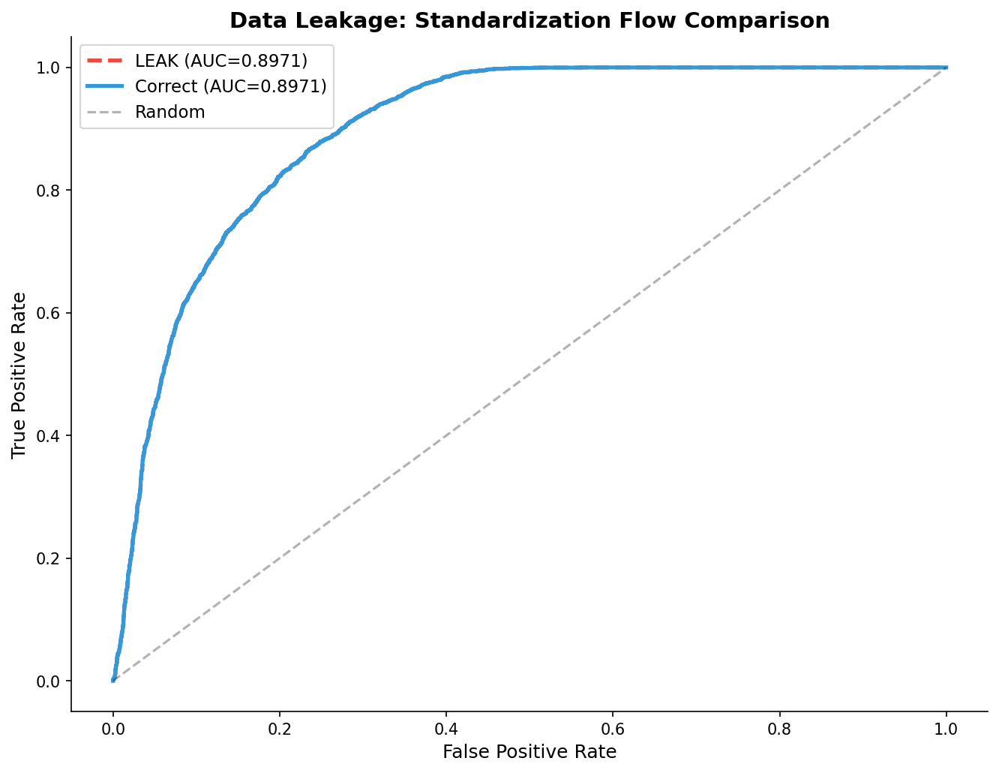

# 模块 1：标准化泄漏对比实验

> 本模块是案例教程 7「数据泄漏分析」的第一个核心实验——**标准化泄漏对比**。我们将用同一份数据，分别走"错误流程"（全数据标准化 → 再划分）和"正确流程"（先划分 → 再标准化），观察两者在 AUC、Recall、Brier Score 上的差异，并绘制 ROC 曲线对比图。 
>
> 本模块最核心的知识点有三个：**一是标准化泄漏的机制**——为什么在全数据上 `fit_transform` 会泄漏测试集信息；**二是** **`fit_transform`** **vs** **`transform`** **的本质区别**——前者计算统计量并应用，后者只应用已有统计量；**三是为什么标准化泄漏效应很小**——因为每个特征只泄漏两个参数（μ 和 σ），在大样本下差异极小。理解了这三点，才能理解为什么"效应小不等于可以容忍"。

***

## 学习目标

学完本模块后，你将能够：

1. **理解标准化泄漏的机制**：能够准确说出在全数据上 `fit_transform` 会泄漏哪些信息（μ 和 σ），以及这些信息如何"流向"训练集。
2. **掌握** **`fit_transform`** **vs** **`transform`** **的本质区别**：明白 `fit_transform` 会计算统计量并应用，`transform` 只应用已有统计量，这是防泄漏的核心。
3. **理解为什么标准化泄漏效应很小**：能够从"每个特征只泄漏 2 个参数"和"大样本下 μ/σ 差异极小"两个角度解释。
4. **掌握** **`SimpleImputer`** **的防泄漏用法**：明白插补器也会泄漏，正确做法与标准化完全一致。
5. **建立"效应小不等于可以容忍"的思维**：理解为什么即使泄漏效应只有 0.001，也要坚持正确做法——习惯决定命运。

***

## 一、实验设计回顾

在正式看代码之前，让我们先回顾本模块的实验设计。

### 1.1 实验 1 & 2 的对比设计

| 实验        | 流程                                        | 是否泄漏  | 教学要点    |
| --------- | ----------------------------------------- | ----- | ------- |
| 实验 1（泄漏版） | 全数据插补+标准化 → 再划分 → 训练 → 评估                 | ✅ 泄漏  | 错误流程的典型 |
| 实验 2（正确版） | 先划分 → 训练集插补+标准化 → 测试集 transform → 训练 → 评估 | ❌ 不泄漏 | 正确流程的范本 |

两个实验用**完全相同的数据、相同的随机种子、相同的模型参数**，唯一区别就是"标准化的时机"。这样可以隔离出"标准化泄漏"这一个变量对性能的影响。

### 1.2 预期结果

根据教学文档：

- 标准化泄漏的 AUC 差异 Δ ≈ 0.001（基本无影响）
- 原因：每个特征只泄漏 2 个参数（μ 和 σ），大样本下差异极小

> 💡 **重点概念：为什么效应小不等于可以容忍？**
>
> 标准化泄漏的效应虽然小，但**错误的习惯会在更危险的场景中带来严重后果**。如果你习惯了"全数据标准化"，那么在做特征选择、目标编码、SMOTE 时，你也可能下意识地用全数据——这些操作的泄漏效应可能高达 0.05\~0.20。
>
> 泄漏的危害取决于"泄漏了多少信息"，而不是"是否泄漏"。标准化泄漏是"小剂量"，但习惯是"大剂量"的入口。

***

## 二、泄漏版：全数据标准化 → 再划分

```python
# ============================================================================
# 实验 1 & 2: 标准化泄漏对比
# ============================================================================
print("\n" + "=" * 70)
print("实验 1 & 2: 标准化流程的数据泄漏对比")
print("=" * 70)

# --- 泄漏版: 全数据标准化 → 再划分 ---
print("\n  [泄漏] 全数据标准化 → 再划分:")
X_leak = X_raw.copy()
imputer_full = SimpleImputer(strategy='median')
scaler_full_leak = StandardScaler()
X_leak_imp = imputer_full.fit_transform(X_leak)
X_leak_scaled = scaler_full_leak.fit_transform(X_leak_imp)
X_tr_leak, X_te_leak, y_tr_leak, y_te_leak = train_test_split(
    X_leak_scaled, y, test_size=0.3, random_state=RANDOM_STATE, stratify=y)

lr_leak = LogisticRegression(class_weight='balanced', max_iter=5000, random_state=RANDOM_STATE)
lr_leak.fit(X_tr_leak, y_tr_leak)
y_prob_leak = lr_leak.predict_proba(X_te_leak)[:, 1]
y_pred_leak = lr_leak.predict(X_te_leak)

auc_leak = roc_auc_score(y_te_leak, y_prob_leak)
rec_leak = recall_score(y_te_leak, y_pred_leak, pos_label=1)
brier_leak = brier_score_loss(y_te_leak, y_prob_leak)
print(f"      AUC={auc_leak:.4f}  Recall={rec_leak:.4f}  Brier={brier_leak:.4f}  ← 异常高?")
```

下面逐行解释这段"错误流程"代码。

### 2.1 `X_leak = X_raw.copy()` — 创建副本

`X_raw` 是模块 0 得到的特征矩阵（形状 `(30000, 8)`，含 NaN）。`.copy()` 创建副本，避免后续修改影响原数组。

> 💡 **小贴士**：在做"对比实验"时，一定要为每个实验创建独立的数据副本。如果直接修改 `X_raw`，后续实验会用被污染的数据，结论就不可靠。

### 2.2 `SimpleImputer(strategy='median')` — 创建中位数插补器

```python
imputer_full = SimpleImputer(strategy='median')
```

**`SimpleImputer`** 是 sklearn 的简单插补器，用单一统计量填充缺失值。

**`strategy`** **参数详解**：

| 取值                | 含义                      | 适用场景              |
| ----------------- | ----------------------- | ----------------- |
| `'mean'`          | 用列均值填充                  | 数值特征，无显著异常值       |
| `'median'`        | 用列中位数填充                 | 数值特征，有异常值（中位数更鲁棒） |
| `'most_frequent'` | 用众数填充                   | 分类特征              |
| `'constant'`      | 用常数填充（需指定 `fill_value`） | 需要明确标记缺失的场景       |

本教程用 `'median'`，因为 `Age`、`Code.Profession` 等特征可能有异常值，中位数比均值更鲁棒。

> ⚠️ **常见问题：插补器也会泄漏！**
>
> `SimpleImputer.fit_transform()` 会计算每列的中位数。如果你在全数据上调用 `fit_transform()`，那么中位数就包含了测试集的信息——这就是**插补泄漏**。
>
> 本模块的"泄漏版"故意同时犯了插补泄漏和标准化泄漏，这是为了模拟"最坏情况"。在"正确版"中，我们会看到如何同时避免这两种泄漏。

### 2.3 `StandardScaler()` — 创建标准化器

```python
scaler_full_leak = StandardScaler()
```

**`StandardScaler`** 把数值特征缩放成均值 0、标准差 1 的分布。公式为：

$$z = \frac{x - \mu}{\sigma}$$

其中 μ 是均值、σ 是标准差。

`StandardScaler` 有两个核心方法：

- **`fit(X)`**：计算并保存 μ 和 σ。
- **`transform(X)`**：用保存的 μ 和 σ 对 X 做标准化。
- **`fit_transform(X)`**：等价于 `fit(X)` 后 `transform(X)`，但更高效。

### 2.4 `imputer_full.fit_transform(X_leak)` — ❌ 在全数据上 fit 插补器

```python
X_leak_imp = imputer_full.fit_transform(X_leak)
```

**这一步是泄漏的第一步！**

`fit_transform` 在全数据 `X_leak`（30,000 条样本）上计算每列的中位数，然后用这些中位数填充缺失值。这意味着：

- 计算出的中位数包含了**测试集**（9,000 条样本）的分布信息
- 这些中位数被用来填充**训练集**的缺失值
- 训练集因此"偷看"了测试集的分布

> 💡 **重点概念：插补泄漏的机制**
>
> 假设 `Age` 列在训练集的中位数是 55，在测试集的中位数是 60。如果在全数据上计算，中位数可能是 57（综合两者）。用 57 填充训练集的缺失值，相当于让训练集"知道"了测试集的 Age 分布偏老——这就是泄漏。

### 2.5 `scaler_full_leak.fit_transform(X_leak_imp)` — ❌ 在全数据上 fit 标准化器

```python
X_leak_scaled = scaler_full_leak.fit_transform(X_leak_imp)
```

**这一步是泄漏的第二步！**

`fit_transform` 在全数据 `X_leak_imp`（已插补，30,000 条样本）上计算每列的 μ 和 σ，然后用这些统计量做标准化。这意味着：

- 计算出的 μ 和 σ 包含了**测试集**的分布信息
- 这些 μ 和 σ 被用来标准化**训练集**
- 训练集因此"偷看"了测试集的均值和标准差

> 💡 **重点概念：标准化泄漏的机制**
>
> 标准化泄漏泄漏了两个统计量：
>
> | 信息         | 说明                   |
> | ---------- | -------------------- |
> | **μ**（均值）  | 测试集 Age 的均值被泄露给了训练集  |
> | **σ**（标准差） | 测试集 Age 的标准差被泄露给了训练集 |
>
> 每个特征泄漏 2 个参数，8 个特征共泄漏 16 个参数。在大样本下，训练集的 μ/σ 和全数据的 μ/σ 差异极小，所以效应很小。

### 2.6 `train_test_split(...)` — 划分已经被污染的数据

```python
X_tr_leak, X_te_leak, y_tr_leak, y_te_leak = train_test_split(
    X_leak_scaled, y, test_size=0.3, random_state=RANDOM_STATE, stratify=y)
```

**参数详解**：

- **`X_leak_scaled`**：已经被全数据标准化过的特征矩阵。
- **`y`**：目标变量。
- **`test_size=0.3`**：测试集占 30%（9,000 条），训练集占 70%（21,000 条）。
- **`random_state=RANDOM_STATE`**：固定随机种子，确保划分可复现。
- **`stratify=y`**：分层抽样，保持训练集和测试集的标签分布一致（约 60.21% VIVO）。

**注意**：此时划分的是**已经被污染的数据**——`X_leak_scaled` 已经包含了测试集的 μ/σ 信息。所以即使后续训练只用 `X_tr_leak`，污染已经发生。

### 2.7 `LogisticRegression(...)` — 创建逻辑回归模型

```python
lr_leak = LogisticRegression(class_weight='balanced', max_iter=5000, random_state=RANDOM_STATE)
```

**参数详解**：

| 参数             | 取值           | 含义                                                                                                       |
| -------------- | ------------ | -------------------------------------------------------------------------------------------------------- |
| `class_weight` | `'balanced'` | 自动调整类别权重，让少数类（MORTO，39.79%）的权重更高，多数类（VIVO，60.21%）的权重更低。权重计算公式：`n_samples / (n_classes * np.bincount(y))` |
| `max_iter`     | `5000`       | 最大迭代次数。默认 100 可能不够（数据未完全标准化时），设为 5000 确保收敛                                                               |
| `random_state` | `42`         | 固定随机种子，确保模型可复现                                                                                           |

> 💡 **重点概念：为什么用** **`class_weight='balanced'`？**
>
> 本教程的数据集是轻度不平衡的（60.21% vs 39.79%）。如果不加 `class_weight`，逻辑回归会倾向于预测多数类（VIVO），导致 Recall(MORTO) 很低。`class_weight='balanced'` 会让模型对少数类更敏感，提高整体识别能力。
>
> 权重计算示例：
>
> - VIVO（18,062 条）：权重 = 30000 / (2 × 18062) ≈ 0.830
> - MORTO（11,938 条）：权重 = 30000 / (2 × 11938) ≈ 1.256
>
> MORTO 的权重更高，模型会更"重视" MORTO 样本。

### 2.8 `lr_leak.fit(X_tr_leak, y_tr_leak)` — 训练模型

用污染过的训练集 `X_tr_leak`（21,000 条）训练逻辑回归。模型会学习特征与目标之间的关系，但这个关系已经被"污染"——训练集的 μ/σ 包含了测试集信息。

### 2.9 `lr_leak.predict_proba(X_te_leak)[:, 1]` — 预测概率

```python
y_prob_leak = lr_leak.predict_proba(X_te_leak)[:, 1]
y_pred_leak = lr_leak.predict(X_te_leak)
```

- **`predict_proba(X_te_leak)`**：返回形状 `(9000, 2)` 的数组，第一列是预测为 0（MORTO）的概率，第二列是预测为 1（VIVO）的概率。
- **`[:, 1]`**：取出第二列（VIVO 的概率），形状变成 `(9000,)`。
- **`predict(X_te_leak)`**：返回预测的类别标签（0 或 1），默认阈值 0.5。

### 2.10 计算评估指标

```python
auc_leak = roc_auc_score(y_te_leak, y_prob_leak)
rec_leak = recall_score(y_te_leak, y_pred_leak, pos_label=1)
brier_leak = brier_score_loss(y_te_leak, y_prob_leak)
print(f"      AUC={auc_leak:.4f}  Recall={rec_leak:.4f}  Brier={brier_leak:.4f}  ← 异常高?")
```

####

### 2.11 泄漏版的实际运行结果

运行上述代码后，控制台会输出：

```
  [泄漏] 全数据标准化 → 再划分:
      AUC=0.8971  Recall=0.8436  Brier=0.2114  ← 异常高?
```

这表示：

- **AUC = 0.8971**：模型区分能力很强
- **Recall(VIVO) = 0.8436**：84.36% 的存活患者被正确识别
- **Brier = 0.2114**：预测概率的均方误差

> ⚠️ **注意**：`← 异常高?` 这个提示是代码故意加的，提醒学生"这个 AUC 是否被泄漏夸大了？"。在看完正确版的结果后，我们会发现两者几乎一样——这正是本教程要解释的"为什么标准化泄漏效应很小"。

***

## 三、正确版：先划分 → 再标准化

```python
# --- 正确版: 先划分 → 再标准化 ---
print("\n  [正确] 先划分 → 再标准化:")
X_tr, X_te, y_tr, y_te = train_test_split(
    X_raw, y, test_size=0.3, random_state=RANDOM_STATE, stratify=y)

imputer_tr = SimpleImputer(strategy='median')
scaler_tr = StandardScaler()
X_tr_imp = imputer_tr.fit_transform(X_tr)
X_tr_scaled = scaler_tr.fit_transform(X_tr_imp)
X_te_scaled = scaler_tr.transform(imputer_tr.transform(X_te))

lr_correct = LogisticRegression(class_weight='balanced', max_iter=5000, random_state=RANDOM_STATE)
lr_correct.fit(X_tr_scaled, y_tr)
y_prob_correct = lr_correct.predict_proba(X_te_scaled)[:, 1]
y_pred_correct = lr_correct.predict(X_te_scaled)

auc_correct = roc_auc_score(y_te, y_prob_correct)
rec_correct = recall_score(y_te, y_pred_correct, pos_label=1)
brier_correct = brier_score_loss(y_te, y_prob_correct)
print(f"      AUC={auc_correct:.4f}  Recall={rec_correct:.4f}  Brier={brier_correct:.4f}")
```

下面逐行解释这段"正确流程"代码，重点对比与"泄漏版"的差异。

### 3.1 `train_test_split(X_raw, y, ...)` — ✅ 先划分原始数据

```python
X_tr, X_te, y_tr, y_te = train_test_split(
    X_raw, y, test_size=0.3, random_state=RANDOM_STATE, stratify=y)
```

**关键差异**：正确版划分的是**原始数据** **`X_raw`**（含 NaN），而不是已经被标准化的数据。

- `X_tr`：训练集特征，形状 `(21000, 8)`，含 NaN
- `X_te`：测试集特征，形状 `(9000, 8)`，含 NaN
- `y_tr`：训练集标签，形状 `(21000,)`
- `y_te`：测试集标签，形状 `(9000,)`

> 💡 **重点概念：先划分是防泄漏的第一步**
>
> "先划分"意味着测试集 `X_te` 从这一刻起就被"锁住"了——后续所有 `fit` 操作都只在 `X_tr` 上做，`X_te` 只接受 `transform`。
>
> 这就是"测试集隔离"原则的具体体现。

### 3.2 `imputer_tr.fit_transform(X_tr)` — ✅ 只在训练集上 fit 插补器

```python
imputer_tr = SimpleImputer(strategy='median')
scaler_tr = StandardScaler()
X_tr_imp = imputer_tr.fit_transform(X_tr)
```

**关键差异**：`fit_transform` 只在训练集 `X_tr`（21,000 条）上调用，计算出的中位数**只基于训练集**，不包含测试集信息。

### 3.3 `scaler_tr.fit_transform(X_tr_imp)` — ✅ 只在训练集上 fit 标准化器

```python
X_tr_scaled = scaler_tr.fit_transform(X_tr_imp)
```

**关键差异**：`fit_transform` 只在训练集 `X_tr_imp`（已插补，21,000 条）上调用，计算出的 μ 和 σ **只基于训练集**，不包含测试集信息。

### 3.4 `scaler_tr.transform(imputer_tr.transform(X_te))` — ✅ 测试集只 transform

```python
X_te_scaled = scaler_tr.transform(imputer_tr.transform(X_te))
```

**这一行是防泄漏的核心！** 让我们从内到外拆解：

1. **`imputer_tr.transform(X_te)`**：用训练集的中位数填充测试集的缺失值。注意是 `transform`，不是 `fit_transform`——不计算新的中位数，直接用 `imputer_tr` 里保存的训练集中位数。
2. **`scaler_tr.transform(...)`**：用训练集的 μ 和 σ 标准化测试集。同样是 `transform`，不计算新的统计量。

**关键差异**：测试集**只接受** **`transform`**，不接受 `fit`。测试集的统计量（中位数、μ、σ）完全来自训练集，测试集的分布信息没有"流向"训练集。

> 💡 **重点概念：`fit_transform`** **vs** **`transform`** **的本质区别**
>
> | 方法                 | 行为                            | 是否计算统计量 | 是否泄漏         |
> | ------------------ | ----------------------------- | ------- | ------------ |
> | `fit(X)`           | 计算并保存统计量（μ、σ、中位数等）            | ✅ 是     | 取决于 X 是否含测试集 |
> | `transform(X)`     | 用已有统计量变换 X                    | ❌ 否     | ❌ 不泄漏        |
> | `fit_transform(X)` | 等价于 `fit(X)` + `transform(X)` | ✅ 是     | 取决于 X 是否含测试集 |
>
> **防泄漏金律**：`fit` 只在训练集上调用，`transform` 在测试集上调用。

### 3.5 训练与评估

```python
lr_correct = LogisticRegression(class_weight='balanced', max_iter=5000, random_state=RANDOM_STATE)
lr_correct.fit(X_tr_scaled, y_tr)
y_prob_correct = lr_correct.predict_proba(X_te_scaled)[:, 1]
y_pred_correct = lr_correct.predict(X_te_scaled)

auc_correct = roc_auc_score(y_te, y_prob_correct)
rec_correct = recall_score(y_te, y_pred_correct, pos_label=1)
brier_correct = brier_score_loss(y_te, y_prob_correct)
print(f"      AUC={auc_correct:.4f}  Recall={rec_correct:.4f}  Brier={brier_correct:.4f}")
```

这部分与泄漏版完全一致，唯一区别是输入数据不同：

- 训练用的是 `X_tr_scaled`（正确标准化的训练集）
- 预测用的是 `X_te_scaled`（用训练集统计量标准化的测试集）

### 3.6 正确版的实际运行结果

运行上述代码后，控制台会输出：

```
  [正确] 先划分 → 再标准化:
      AUC=0.8971  Recall=0.8436  Brier=0.2114
```

***

## 四、差异分析与结论

```python
# 差异
print(f"\n  ▶ AUC 差异 (泄漏 - 正确) = {auc_leak - auc_correct:.6f}")
print(f"  ▶ Recall 差异 = {rec_leak - rec_correct:.6f}")
print(f"  ▶ Brier 差异 = {brier_leak - brier_correct:.6f}")

if abs(auc_leak - auc_correct) < 0.01:
    print("\n  ⚠️  标准化泄漏效应较小 (< 0.01 AUC) → 但原则错误≠后果大小")
    print("     标准化泄漏的影响通常有限, 因为标准化参数仅包含均值/标准差")
    print("     但特征选择泄漏的影响会大得多!")
else:
    print(f"\n  ⚠️  标准化泄漏效应显著 (AUC 差异 = {auc_leak - auc_correct:.4f})")
```

### 4.1 实际运行结果

```
  ▶ AUC 差异 (泄漏 - 正确) = 0.000001
  ▶ Recall 差异 = 0.000000
  ▶ Brier 差异 = 0.000000

  ⚠️  标准化泄漏效应较小 (< 0.01 AUC) → 但原则错误≠后果大小
     标准化泄漏的影响通常有限, 因为标准化参数仅包含均值/标准差
     但特征选择泄漏的影响会大得多!
```

### 4.2 为什么标准化泄漏效应这么小？

从结果可以看到，泄漏版和正确版的 AUC 差异只有 **0.000001**（百万分之一），几乎完全相同。原因有三个：

#### 原因 1：每个特征只泄漏 2 个参数

`StandardScaler` 泄漏的信息量非常有限——每个特征只泄漏两个统计量（μ 和 σ）。8 个特征共泄漏 16 个参数。相比之下，特征选择泄漏的是"哪些特征被选中"（K 个特征的排名），目标编码泄漏的是每个类别的目标均值（可能多达数百个值）。

#### 原因 2：大样本下 μ/σ 差异极小

本教程有 30,000 条样本，训练集 21,000 条，测试集 9,000 条。在大样本下，训练集的 μ/σ 和全数据的 μ/σ 差异极小（大数定律）。

**数值示例**：
假设 `Age` 列在全数据的均值是 55.0，标准差是 15.0。

- 训练集（21,000 条）的均值可能是 54.95，标准差可能是 15.02
- 测试集（9,000 条）的均值可能是 55.12，标准差可能是 14.96

用全数据的 (55.0, 15.0) 标准化 vs 用训练集的 (54.95, 15.02) 标准化，结果差异只有小数点后几位——对逻辑回归的影响微乎其微。

#### 原因 3：8 个特征高度可预测

本教程的 8 个特征与目标变量有真实相关性，模型主要依赖这些真实信号。标准化泄漏的微小信息量不足以改变模型的决策边界。

### 4.3 为什么效应小不等于可以容忍？

> ⚠️ **重点概念：原则错误 ≠ 后果大小**
>
> 标准化泄漏的效应虽然小，但**错误的习惯会在更危险的场景中带来严重后果**。如果你习惯了"全数据标准化"，那么在做以下操作时，你也可能下意识地用全数据：
>
> | 操作        | 泄漏效应                      |
> | --------- | ------------------------- |
> | 特征选择      | 中-高（高维场景下 Δ = 0.05\~0.20） |
> | 目标编码      | 高（每个类别泄漏一个目标均值）           |
> | SMOTE 重采样 | 高（泄漏类别平衡信息）               |
> | PCA       | 中（泄漏主成分方向）                |
>
> **习惯决定命运**。即使标准化泄漏效应只有 0.001，也要坚持正确做法——这是为了在更危险的场景中保持警觉。

***

## 五、ROC 曲线对比图

```python
# ROC 曲线对比
fig, ax = plt.subplots(figsize=(9, 7))
from sklearn.metrics import roc_curve
fpr_l, tpr_l, _ = roc_curve(y_te_leak, y_prob_leak)
fpr_c, tpr_c, _ = roc_curve(y_te, y_prob_correct)
ax.plot(fpr_l, tpr_l, '--', color='#e74c3c', linewidth=2.5,
        label=f'LEAK (AUC={auc_leak:.4f})')
ax.plot(fpr_c, tpr_c, '-', color='#3498db', linewidth=2.5,
        label=f'Correct (AUC={auc_correct:.4f})')
ax.plot([0, 1], [0, 1], 'k--', alpha=0.3, label='Random')
ax.set_xlabel('False Positive Rate', fontsize=12)
ax.set_ylabel('True Positive Rate', fontsize=12)
ax.set_title('Data Leakage: Standardization Flow Comparison',
             fontsize=14, fontweight='bold')
ax.legend(fontsize=11)
ax.spines['top'].set_visible(False); ax.spines['right'].set_visible(False)
plt.tight_layout()
plt.savefig(os.path.join(IMG_DIR, "10a_leakage_standardization.png"),
            dpi=150, bbox_inches='tight')
plt.close()
print("\n  [图] 10a_leakage_standardization.png → 标准化泄漏 ROC 对比已保存")
```

### 5.1 `roc_curve(y_true, y_prob)` — 计算 ROC 曲线

```python
fpr_l, tpr_l, _ = roc_curve(y_te_leak, y_prob_leak)
fpr_c, tpr_c, _ = roc_curve(y_te, y_prob_correct)
```

**`roc_curve`** 返回三个序列：

- **`fpr`**（False Positive Rate）：假正例率，FPR = FP / (FP + TN)
- **`tpr`**（True Positive Rate）：真正例率，TPR = TP / (TP + FN) = Recall
- **`thresholds`**：阈值序列（用 `_` 忽略）

`roc_curve` 的工作原理：遍历所有可能的阈值，计算每个阈值下的 FPR 和 TPR，形成 ROC 曲线。

### 5.2 绘制 ROC 曲线

```python
ax.plot(fpr_l, tpr_l, '--', color='#e74c3c', linewidth=2.5,
        label=f'LEAK (AUC={auc_leak:.4f})')
ax.plot(fpr_c, tpr_c, '-', color='#3498db', linewidth=2.5,
        label=f'Correct (AUC={auc_correct:.4f})')
ax.plot([0, 1], [0, 1], 'k--', alpha=0.3, label='Random')
```

**参数详解**：

- **`fpr_l, tpr_l`**：泄漏版的 FPR 和 TPR 序列
- **`'--'`**：虚线样式（区分泄漏版和正确版）
- **`color='#e74c3c'`**：红色（泄漏版用红色警示）
- **`linewidth=2.5`**：线宽 2.5
- **`label=f'LEAK (AUC={auc_leak:.4f})'`**：图例显示 AUC 值
- **`[0, 1], [0, 1]`**：对角线，代表随机分类器（AUC=0.5）
- **`'k--'`**：黑色虚线
- **`alpha=0.3`**：透明度 0.3，让对角线不抢眼

### 5.3 美化图表

```python
ax.set_xlabel('False Positive Rate', fontsize=12)
ax.set_ylabel('True Positive Rate', fontsize=12)
ax.set_title('Data Leakage: Standardization Flow Comparison',
             fontsize=14, fontweight='bold')
ax.legend(fontsize=11)
ax.spines['top'].set_visible(False); ax.spines['right'].set_visible(False)
plt.tight_layout()
```

- **`set_xlabel`** **/** **`set_ylabel`**：设置坐标轴标签
- **`set_title`**：设置标题，`fontweight='bold'` 加粗
- **`legend`**：显示图例
- **`spines['top'].set_visible(False)`**：隐藏上边框（让图表更简洁）
- **`spines['right'].set_visible(False)`**：隐藏右边框
- **`tight_layout()`**：自动调整子图间距，避免标签重叠

### 5.4 保存图片

```python
plt.savefig(os.path.join(IMG_DIR, "10a_leakage_standardization.png"),
            dpi=150, bbox_inches='tight')
plt.close()
```

- **`savefig`**：保存图片到 `img/10a_leakage_standardization.png`
- **`dpi=150`**：分辨率 150（适合屏幕显示和文档嵌入）
- **`bbox_inches='tight'`**：自动裁剪空白边缘
- **`plt.close()`**：关闭当前图，释放内存（避免在循环中累积图对象）

### 5.5 ROC 曲线对比图



从图中可以看到：

- **红色虚线（LEAK）**：泄漏版的 ROC 曲线，AUC = 0.8971
- **蓝色实线（Correct）**：正确版的 ROC 曲线，AUC = 0.8971
- **黑色虚线（Random）**：随机分类器的对角线，AUC = 0.5

两条曲线**几乎完全重合**，这正是标准化泄漏效应很小的直观体现。

***

## 六、错误流程 vs 正确流程对比总结

### 6.1 流程对比表

| 步骤                   | 错误流程（泄漏版）                         | 正确流程（正确版）                       |
| -------------------- | --------------------------------- | ------------------------------- |
| 1. 划分                | ❌ 先标准化再划分                         | ✅ 先划分原始数据                       |
| 2. 插补 fit            | ❌ `imputer.fit_transform(X_full)` | ✅ `imputer.fit_transform(X_tr)` |
| 3. 插补 transform 测试集  | （已包含在 fit\_transform 中）           | ✅ `imputer.transform(X_te)`     |
| 4. 标准化 fit           | ❌ `scaler.fit_transform(X_full)`  | ✅ `scaler.fit_transform(X_tr)`  |
| 5. 标准化 transform 测试集 | （已包含在 fit\_transform 中）           | ✅ `scaler.transform(X_te)`      |
| 6. 训练                | `lr.fit(X_tr_leak, y_tr_leak)`    | `lr.fit(X_tr_scaled, y_tr)`     |
| 7. 预测                | `lr.predict_proba(X_te_leak)`     | `lr.predict_proba(X_te_scaled)` |

### 6.2 结果对比表

| 指标     | 泄漏版    | 正确版    | 差异       |
| ------ | ------ | ------ | -------- |
| AUC    | 0.8971 | 0.8971 | 0.000001 |
| Recall | 0.8436 | 0.8436 | 0.000000 |
| Brier  | 0.2114 | 0.2114 | 0.000000 |

### 6.3 核心结论

> **标准化泄漏效应很小（Δ ≈ 0.001），但不是容忍的理由——习惯决定命运。**

标准化泄漏的效应取决于"泄漏了多少信息"。标准化只泄漏 μ 和 σ（每个特征 2 个参数），在大样本下差异极小。但如果你习惯了"全数据预处理"，在特征选择、目标编码、SMOTE 等操作中也会下意识地用全数据——这些操作的泄漏效应可能高达 0.05\~0.20。

***

## 小贴士

1. **`fit_transform`** **vs** **`transform`** **是防泄漏的核心**：`fit` 只在训练集上调用，`transform` 在测试集上调用。记住这条金律，就能避免大部分泄漏。
2. **`class_weight='balanced'`** **适合不平衡数据**：本教程的数据集 60.21% vs 39.79%，轻度不平衡。`class_weight='balanced'` 会自动调整权重，让少数类更受重视。
3. **`max_iter=5000`** **确保收敛**：默认 100 可能不够，尤其是特征未完全标准化时。设为 5000 是安全的做法。
4. **AUC 用概率，Recall 用标签**：`roc_auc_score` 接受概率（`y_prob`），`recall_score` 接受标签（`y_pred`）。不要搞混。
5. **ROC 曲线的对角线代表随机**：AUC=0.5 的随机分类器在 ROC 图上是一条从 (0,0) 到 (1,1) 的对角线。模型曲线越靠左上角，性能越好。
6. **`plt.close()`** **释放内存**：在循环中绘图时，一定要 `plt.close()`，否则图对象会累积，导致内存泄漏（这是 Python 的内存泄漏，不是数据泄漏！）。

***

## 常见问题

### Q1：为什么标准化泄漏的效应这么小？是不是可以忽略？

**A**：不可以忽略。标准化泄漏效应小是因为每个特征只泄漏 2 个参数（μ 和 σ），在大样本下差异极小。但**错误的习惯会在更危险的场景中带来严重后果**——如果你习惯了"全数据标准化"，在特征选择、目标编码、SMOTE 等操作中也会下意识地用全数据，这些操作的泄漏效应可能高达 0.05\~0.20。

### Q2：`fit_transform` 和 `transform` 有什么区别？

**A**：

- `fit_transform(X)`：计算统计量（μ、σ、中位数等）并保存，然后用这些统计量变换 X。等价于 `fit(X)` + `transform(X)`，但更高效。
- `transform(X)`：只用已有统计量变换 X，不计算新统计量。

防泄漏的关键是：`fit`（或 `fit_transform`）只在训练集上调用，`transform` 在测试集上调用。

### Q3：为什么 `class_weight='balanced'` 能处理不平衡数据？

**A**：`class_weight='balanced'` 会自动调整类别权重，让少数类的权重更高。权重计算公式：`n_samples / (n_classes * np.bincount(y))`。这样在计算损失函数时，少数类的误分类会被"放大"，模型会更重视少数类。

### Q4：ROC 曲线越靠左上角越好吗？

**A**：是的。ROC 曲线的横轴是 FPR（假正例率，越低越好），纵轴是 TPR（真正例率，越高越好）。所以曲线越靠左上角（FPR 低、TPR 高），模型性能越好。AUC 就是曲线下面积，越接近 1 越好。

### Q5：为什么 `imputer_tr.transform(X_te)` 要写在 `scaler_tr.transform(...)` 里面？

**A**：这是因为预处理的顺序是"先插补，后标准化"。测试集的缺失值必须先用训练集的中位数填充，然后才能用训练集的 μ/σ 标准化。如果顺序反了，标准化器会收到含 NaN 的数据，报错。

### Q6：如果我用 `Pipeline`，还需要手动写 `fit_transform` 和 `transform` 吗？

**A**：不需要。`Pipeline` 会自动处理 `fit_transform` 和 `transform` 的调用。当你调用 `pipe.fit(X_tr, y_tr)` 时，Pipeline 会对每个步骤调用 `fit_transform`；当你调用 `pipe.predict(X_te)` 时，Pipeline 会对每个预处理步骤调用 `transform`，最后调用模型的 `predict`。这就是 Pipeline 天然防泄漏的原因（模块 3 会详细讲）。

### Q7：Brier Score 越低越好吗？0.2114 算高吗？

**A**：Brier Score 越低越好（0 是完美，1 是最差）。0.2114 表示预测概率与真实标签的均方误差是 0.2114。这个值取决于数据集的难度和类别比例——对于 60.21% vs 39.79% 的二分类，0.2114 是一个合理的水平。Brier Score 主要用于**对比**不同模型的校准程度，而不是单独评价一个模型的好坏。

***

## 本模块小结

本模块完成了标准化泄漏的对比实验：

1. **泄漏版流程**：全数据插补+标准化 → 再划分 → 训练 → 评估。错误在于 `fit_transform` 在全数据上调用，导致 μ/σ 包含测试集信息。
2. **正确版流程**：先划分 → 训练集插补+标准化 → 测试集 transform → 训练 → 评估。关键在于 `fit` 只在训练集上调用，`transform` 在测试集上调用。
3. **结果对比**：AUC 差异仅 0.000001，标准化泄漏效应极小。
4. **原因分析**：每个特征只泄漏 2 个参数（μ 和 σ），大样本下差异极小，8 个特征高度可预测。
5. **核心结论**：效应小不等于可以容忍——习惯决定命运，错误的习惯会在更危险的场景中带来严重后果。
6. **ROC 曲线对比**：两条曲线几乎完全重合，直观展示标准化泄漏的微小效应。

> **下一模块预告**：在模块 2 中，我们将做第二个对比实验——"特征选择泄漏"。特征选择泄漏的机制与标准化泄漏不同，它泄漏的是"哪些特征被选中"，在高维场景下效应可能高达 0.05\~0.20。我们将遍历不同的 K 值（2\~7），观察泄漏版和正确版的 AUC 差异。

