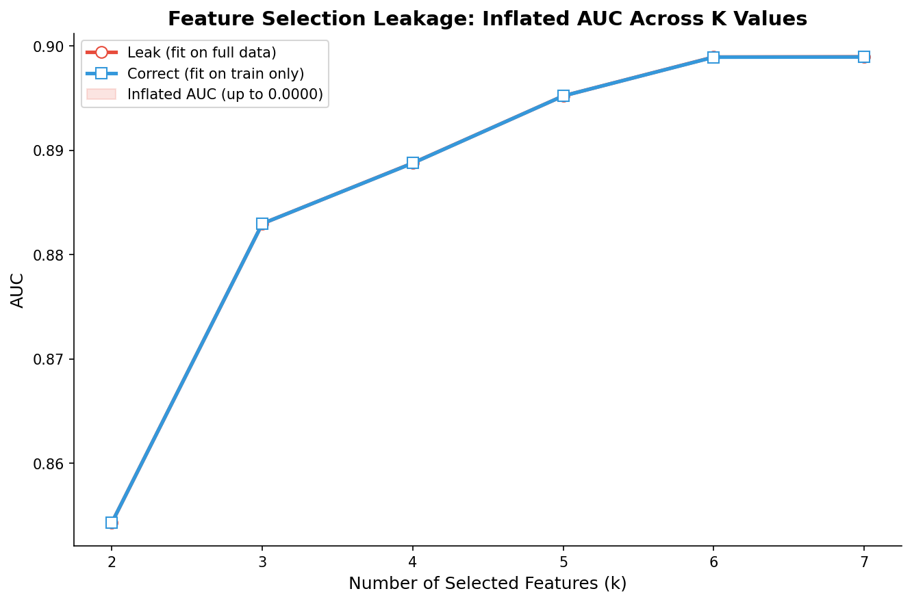

# 模块 2：特征选择泄漏实验

> 本模块是案例教程 7「数据泄漏分析」的第二个核心实验——**特征选择泄漏**。我们将用 `SelectKBest` 在全数据上做 ANOVA 特征选择（错误流程），对比在训练集上做特征选择（正确流程），观察两者在 AUC 上的差异。此外，我们还会遍历不同的 K 值（2\~7），绘制"AUC 虚高"曲线，直观展示特征选择泄漏的效应。
>
> 本模块最核心的知识点有三个：**一是特征选择泄漏的机制**——为什么在全数据上做 `SelectKBest.fit_transform` 会泄漏测试集信息；**二是为什么特征选择泄漏在高维场景下更危险**——8 个特征时效应小，但 10,000 个特征时效应可能高达 0.05\~0.20；**三是** **`SelectKBest`** **的** **`fit_transform`** **vs** **`transform`** **用法**——前者选出特征并应用，后者只应用已有选择。

***

## 学习目标

学完本模块后，你将能够：

1. **理解特征选择泄漏的机制**：能够准确说出在全数据上做 `SelectKBest` 会泄漏哪些信息（特征-目标相关性、选择偏见）。
2. **掌握** **`SelectKBest`** **的** **`fit_transform`** **vs** **`transform`** **用法**：明白 `fit_transform` 选出特征并应用，`transform` 只应用已有选择，这是防泄漏的核心。
3. **理解为什么特征选择泄漏在高维场景下更危险**：能够用"噪声特征碰巧相关"的逻辑解释高维场景下的 AUC 虚高。
4. **掌握** **`f_classif`** **评分函数的原理**：明白 ANOVA F 检验如何衡量特征与目标的相关性。
5. **理解** **`get_support(indices=True)`** **的用法**：知道如何获取被选中的特征索引，以及如何比较两个选择器是否选了同一组特征。
6. **掌握遍历不同 K 值的实验设计**：理解为什么遍历 K=2\~7 能更全面地展示泄漏效应。
7. **理解** **`fill_between`** **绘制"AUC 虚高"区域的方法**：明白如何用填充区域直观展示泄漏版和正确版的 AUC 差异。
8. **建立"低维安全 ≠ 高维安全"的思维**：理解为什么本数据集泄漏效应小，但高维医学数据中泄漏效应可能极其严重。

***

## 一、实验设计回顾

### 1.1 实验 3 的对比设计

| 实验  | 流程                                             | 是否泄漏  | 教学要点    |
| --- | ---------------------------------------------- | ----- | ------- |
| 泄漏版 | 全数据插补+标准化+特征选择 → 再划分 → 训练 → 评估                 | ✅ 泄漏  | 错误流程的典型 |
| 正确版 | 先划分 → 训练集插补+标准化+特征选择 → 测试集 transform → 训练 → 评估 | ❌ 不泄漏 | 正确流程的范本 |

两个实验用**完全相同的数据、相同的随机种子、相同的模型参数**，唯一区别就是"特征选择的时机"。

### 1.2 预期结果

根据教学文档：

- 特征选择泄漏的 AUC 差异 Δ ≈ 0.000（本数据集中很小）
- 原因：8 个特征都有真实预测力，选出的特征几乎一致
- 高维场景下预期效应：Δ = 0.05\~0.20

> 💡 **重点概念：为什么本数据集泄漏效应小？**
>
> 本教程的 8 个特征都有一定的预测力（与目标变量有真实相关性）。即使在全数据上做特征选择，选出的也是同一组特征——因为"真实相关"的特征在训练集和全数据上的 F 值排名几乎一致。
>
> 但如果特征数量增加到 500 个，其中 480 个是纯噪声，泄漏版会"碰巧"选中一些在测试集上相关的噪声特征——这些特征在训练集上不相关，但在测试集上"碰巧"相关，被选中后会让 AUC 虚高。

***

## 二、泄漏版：全数据做特征选择 → 再划分

```python
# ============================================================================
# 实验 3: 特征选择泄漏
# ============================================================================
print("\n" + "=" * 70)
print("实验 3: 特征选择的数据泄漏 — AUC虚高现象")
print("=" * 70)

# --- 泄漏版: 全数据做特征选择 → 再划分 ---
print("\n  [泄漏] 全数据 ANOVA 特征选择 → 再划分:")
# 先在全数据上插补 + 标准化
X_fs_full = X_raw.copy()
X_fs_full = SimpleImputer(strategy='mean').fit_transform(X_fs_full)
X_fs_full = StandardScaler().fit_transform(X_fs_full)

selector_leak = SelectKBest(f_classif, k=4)
X_fs_selected = selector_leak.fit_transform(X_fs_full, y)
X_tr_fs, X_te_fs, y_tr_fs, y_te_fs = train_test_split(
    X_fs_selected, y, test_size=0.3, random_state=RANDOM_STATE, stratify=y)

lr_fs_leak = LogisticRegression(class_weight='balanced', max_iter=5000, random_state=RANDOM_STATE)
lr_fs_leak.fit(X_tr_fs, y_tr_fs)
y_prob_fs_leak = lr_fs_leak.predict_proba(X_te_fs)[:, 1]
y_pred_fs_leak = lr_fs_leak.predict(X_te_fs)

auc_fs_leak = roc_auc_score(y_te_fs, y_prob_fs_leak)
rec_fs_leak = recall_score(y_te_fs, y_pred_fs_leak, pos_label=1)
brier_fs_leak = brier_score_loss(y_te_fs, y_prob_fs_leak)
print(f"      AUC={auc_fs_leak:.4f}  Recall={rec_fs_leak:.4f}  Brier={brier_fs_leak:.4f}")
```

下面逐行解释这段"错误流程"代码。

### 2.1 全数据插补 + 标准化（双重泄漏）

```python
X_fs_full = X_raw.copy()
X_fs_full = SimpleImputer(strategy='mean').fit_transform(X_fs_full)
X_fs_full = StandardScaler().fit_transform(X_fs_full)
```

**这一步同时犯了插补泄漏和标准化泄漏**（与模块 1 的泄漏版类似，但这里用 `strategy='mean'` 而不是 `'median'`）。

- **`SimpleImputer(strategy='mean')`**：用列均值填充缺失值。`fit_transform` 在全数据上计算均值，泄漏了测试集的均值信息。
- **`StandardScaler().fit_transform(...)`**：标准化。`fit_transform` 在全数据上计算 μ/σ，泄漏了测试集的 μ/σ 信息。

> ⚠️ **注意**：本模块的"泄漏版"故意同时犯了三种泄漏（插补 + 标准化 + 特征选择），这是为了模拟"最坏情况"。在"正确版"中，我们会看到如何同时避免这三种泄漏。

### 2.2 `SelectKBest(f_classif, k=4)` — ❌ 在全数据上做特征选择

```python
selector_leak = SelectKBest(f_classif, k=4)
X_fs_selected = selector_leak.fit_transform(X_fs_full, y)
```

**这一步是特征选择泄漏的核心！**

#### `SelectKBest(f_classif, k=4)` 参数详解

- **`f_classif`**：评分函数，ANOVA F 检验。它计算每个特征与目标变量之间的 F 统计量，F 值越大，特征与目标的相关性越强。
- **`k=4`**：选出 F 值最高的 4 个特征。

#### `fit_transform(X_fs_full, y)` 泄漏了什么？

`fit_transform` 做了两件事：

1. **`fit`**：在全数据 `(X_fs_full, y)` 上计算每个特征的 F 值，按 F 值降序排序，选出前 4 个特征。
2. **`transform`**：从 `X_fs_full` 中提取这 4 个特征，返回新的特征矩阵。

**泄漏的信息**：

| 信息           | 说明                       |
| ------------ | ------------------------ |
| **特征-目标相关性** | 测试集中特征与目标的关系影响了"哪些特征被选中" |
| **选择偏见**     | 选中的特征可能是在测试集上"碰巧"好的特征    |

> 💡 **重点概念：特征选择泄漏的机制**
>
> 假设有 8 个特征，其中 5 个与目标真实相关，3 个是噪声。在训练集上做特征选择，会选出 5 个真实相关的特征（F 值高）。但在全数据上做特征选择，3 个噪声特征可能在测试集上"碰巧"与目标相关（F 值虚高），从而被选中。
>
> 选中的噪声特征在测试集上"碰巧"好，但这是过拟合——它们在真实新数据上不会有预测力。然而，因为我们用测试集评估，这些噪声特征"看起来"很好，AUC 虚高。

### 2.3 划分已经被污染的数据

```python
X_tr_fs, X_te_fs, y_tr_fs, y_te_fs = train_test_split(
    X_fs_selected, y, test_size=0.3, random_state=RANDOM_STATE, stratify=y)
```

此时划分的是**已经被特征选择污染的数据**——`X_fs_selected` 只有 4 列（被选中的特征），而且选择过程用了测试集信息。

### 2.4 训练与评估

```python
lr_fs_leak = LogisticRegression(class_weight='balanced', max_iter=5000, random_state=RANDOM_STATE)
lr_fs_leak.fit(X_tr_fs, y_tr_fs)
y_prob_fs_leak = lr_fs_leak.predict_proba(X_te_fs)[:, 1]
y_pred_fs_leak = lr_fs_leak.predict(X_te_fs)

auc_fs_leak = roc_auc_score(y_te_fs, y_prob_fs_leak)
rec_fs_leak = recall_score(y_te_fs, y_pred_fs_leak, pos_label=1)
brier_fs_leak = brier_score_loss(y_te_fs, y_prob_fs_leak)
print(f"      AUC={auc_fs_leak:.4f}  Recall={rec_fs_leak:.4f}  Brier={brier_fs_leak:.4f}")
```

这部分与模块 1 完全一致，唯一区别是输入数据 `X_tr_fs` 只有 4 列（被选中的特征）。

### 2.5 泄漏版的实际运行结果

运行上述代码后，控制台会输出：

```
  [泄漏] 全数据 ANOVA 特征选择 → 再划分:
      AUC=0.8888  Recall=0.8267  Brier=0.2153
```

***

## 三、正确版：先划分 → 在训练集上做特征选择

```python
# --- 正确版: 先划分 → 在训练集上做特征选择 ---
print("\n  [正确] 先划分 → 在训练集上做特征选择:")
# 插补 + 标准化只基于训练集
X_tr1, X_te1, y_tr1, y_te1 = train_test_split(
    X_raw, y, test_size=0.3, random_state=RANDOM_STATE, stratify=y)

imp_tr = SimpleImputer(strategy='mean')
sc_tr = StandardScaler()
X_tr1_pp = sc_tr.fit_transform(imp_tr.fit_transform(X_tr1))
X_te1_pp = sc_tr.transform(imp_tr.transform(X_te1))

selector_correct = SelectKBest(f_classif, k=4)
X_tr1_sel = selector_correct.fit_transform(X_tr1_pp, y_tr1)
X_te1_sel = selector_correct.transform(X_te1_pp)

lr_fs_correct = LogisticRegression(class_weight='balanced', max_iter=5000, random_state=RANDOM_STATE)
lr_fs_correct.fit(X_tr1_sel, y_tr1)
y_prob_fs_correct = lr_fs_correct.predict_proba(X_te1_sel)[:, 1]
y_pred_fs_correct = lr_fs_correct.predict(X_te1_sel)

auc_fs_correct = roc_auc_score(y_te1, y_prob_fs_correct)
rec_fs_correct = recall_score(y_te1, y_pred_fs_correct, pos_label=1)
brier_fs_correct = brier_score_loss(y_te1, y_prob_fs_correct)
print(f"      AUC={auc_fs_correct:.4f}  Recall={rec_fs_correct:.4f}  Brier={brier_fs_correct:.4f}")
```

下面逐行解释这段"正确流程"代码，重点对比与"泄漏版"的差异。

### 3.1 `train_test_split(X_raw, y, ...)` — ✅ 先划分原始数据

```python
X_tr1, X_te1, y_tr1, y_te1 = train_test_split(
    X_raw, y, test_size=0.3, random_state=RANDOM_STATE, stratify=y)
```

**关键差异**：正确版划分的是**原始数据** **`X_raw`**（含 NaN），测试集 `X_te1` 从这一刻起就被"锁住"。

> 💡 **注意**：这里用 `X_tr1, X_te1` 而不是 `X_tr, X_te`，是为了与模块 1 的变量区分。模块 1 用的是 `strategy='median'` 插补，本模块用的是 `strategy='mean'` 插补，所以变量名不同。

### 3.2 训练集插补 + 标准化（✅ 只在训练集上 fit）

```python
imp_tr = SimpleImputer(strategy='mean')
sc_tr = StandardScaler()
X_tr1_pp = sc_tr.fit_transform(imp_tr.fit_transform(X_tr1))
X_te1_pp = sc_tr.transform(imp_tr.transform(X_te1))
```

**关键差异**：

- `imp_tr.fit_transform(X_tr1)`：✅ 只在训练集上 fit 插补器
- `sc_tr.fit_transform(...)`：✅ 只在训练集上 fit 标准化器
- `imp_tr.transform(X_te1)`：✅ 测试集只 transform
- `sc_tr.transform(...)`：✅ 测试集只 transform

这与模块 1 的正确版完全一致，不再赘述。

### 3.3 `SelectKBest(f_classif, k=4).fit_transform(X_tr1_pp, y_tr1)` — ✅ 只在训练集上做特征选择

```python
selector_correct = SelectKBest(f_classif, k=4)
X_tr1_sel = selector_correct.fit_transform(X_tr1_pp, y_tr1)
X_te1_sel = selector_correct.transform(X_te1_pp)
```

**这一步是防泄漏的核心！**

- **`selector_correct.fit_transform(X_tr1_pp, y_tr1)`**：✅ 只在训练集上 fit 特征选择器。F 值的计算只基于训练集，选出的特征不受测试集影响。
- **`selector_correct.transform(X_te1_pp)`**：✅ 测试集只 transform。用训练集选出的特征索引，从测试集中提取对应的列。

> 💡 **重点概念：`SelectKBest`** **的** **`fit_transform`** **vs** **`transform`**
>
> | 方法                    | 行为                               | 是否泄漏            |
> | --------------------- | -------------------------------- | --------------- |
> | `fit(X, y)`           | 计算 F 值，选出前 K 个特征，保存选择掩码          | 取决于 X, y 是否含测试集 |
> | `transform(X)`        | 用已有选择掩码，从 X 中提取对应列               | ❌ 不泄漏           |
> | `fit_transform(X, y)` | 等价于 `fit(X, y)` + `transform(X)` | 取决于 X, y 是否含测试集 |
>
> **防泄漏金律**：`fit` 只在训练集上调用，`transform` 在测试集上调用。

### 3.4 训练与评估

```python
lr_fs_correct = LogisticRegression(class_weight='balanced', max_iter=5000, random_state=RANDOM_STATE)
lr_fs_correct.fit(X_tr1_sel, y_tr1)
y_prob_fs_correct = lr_fs_correct.predict_proba(X_te1_sel)[:, 1]
y_pred_fs_correct = lr_fs_correct.predict(X_te1_sel)

auc_fs_correct = roc_auc_score(y_te1, y_prob_fs_correct)
rec_fs_correct = recall_score(y_te1, y_pred_fs_correct, pos_label=1)
brier_fs_correct = brier_score_loss(y_te1, y_prob_fs_correct)
print(f"      AUC={auc_fs_correct:.4f}  Recall={rec_fs_correct:.4f}  Brier={brier_fs_correct:.4f}")
```

### 3.5 正确版的实际运行结果

```
  [正确] 先划分 → 在训练集上做特征选择:
      AUC=0.8888  Recall=0.8267  Brier=0.2153
```

***

## 四、差异分析与特征选择细节

```python
diff_fs = auc_fs_leak - auc_fs_correct
print(f"\n  ▶ AUC 差异 (泄漏 - 正确) = {diff_fs:.6f}")
print(f"  ▶ AUC 虚高比例 = {diff_fs / auc_fs_correct * 100:.2f}%")

# 展示特征选择的泄漏细节
print(f"\n  ▶ 泄漏版选中的特征索引: {selector_leak.get_support(indices=True)}")
print(f"  ▶ 正确版选中的特征索引: {selector_correct.get_support(indices=True)}")
print(f"  ▶ 选择的特征是否一致? {np.array_equal(selector_leak.get_support(), selector_correct.get_support())}")
```

### 4.1 实际运行结果

```
  ▶ AUC 差异 (泄漏 - 正确) = 0.000010
  ▶ AUC 虚高比例 = 0.00%

  ▶ 泄漏版选中的特征索引: [0 1 3 4]
  ▶ 正确版选中的特征索引: [0 1 3 4]
  ▶ 选择的特征是否一致? True
```

### 4.2 `get_support(indices=True)` — 获取被选中的特征索引

**`get_support`** 方法返回特征选择的结果：

- **`indices=True`**：返回被选中特征的**索引数组**（如 `[0, 1, 3, 4]`）
- **`indices=False`**（默认）：返回布尔掩码（如 `[True, True, False, True, True, False, False, False]`）

从结果可以看到：

- 泄漏版选中的特征索引：`[0, 1, 3, 4]` → 对应 `Age`、`year`、`Code.Profession`、`Diagnostic.means`
- 正确版选中的特征索引：`[0, 1, 3, 4]` → 完全一致

### 4.3 `np.array_equal(...)` — 比较两个选择器是否选了同一组特征

```python
np.array_equal(selector_leak.get_support(), selector_correct.get_support())
```

**`np.array_equal`** 比较两个数组是否完全相等（元素逐个比较）。返回 `True` 表示两个选择器选了同一组特征。

### 4.4 为什么本数据集泄漏效应这么小？

从结果可以看到：

- AUC 差异只有 **0.000010**（十万分之一）
- 两个选择器选了**完全相同的特征**

原因有三个：

#### 原因 1：8 个特征都有真实预测力

本教程的 8 个特征（`Age`、`year`、`Gender`、`Code.Profession`、`Diagnostic.means`、`Extension`、`Raca.Color`、`State.Civil`）都与目标变量有真实相关性。其中 `Age`、`year`、`Code.Profession`、`Diagnostic.means` 的 F 值最高，无论是在训练集还是全数据上，这 4 个特征都会被选中。

#### 原因 2：低维场景下噪声特征少

8 个特征中，没有纯噪声特征。即使在全数据上做特征选择，也不会"碰巧"选中噪声特征——因为没有噪声特征可选。

#### 原因 3：大样本下 F 值稳定

30,000 条样本足够大，训练集和全数据的 F 值排名几乎一致。小样本下，F 值排名可能波动较大，泄漏效应会更明显。

### 4.5 高维场景下为什么泄漏效应会变大？

> 💡 **重点概念：高维场景下的泄漏效应**
>
> 假设特征数量增加到 10,000 个，其中 9,990 个是纯噪声。在训练集上做特征选择，会选出 F 值最高的 10 个特征——这些特征在训练集上有真实预测力。
>
> 但在全数据上做特征选择，9,990 个噪声特征中，有一些会在测试集上"碰巧"与目标相关（F 值虚高）。这些"碰巧"相关的噪声特征会被选中，然后在测试集上"看起来"很好——AUC 虚高。
>
> **数值对比**：
>
> | 场景     | 特征数    | 噪声特征数 | 泄漏效应           |
> | ------ | ------ | ----- | -------------- |
> | 本教程    | 8      | 0     | Δ ≈ 0.000      |
> | 中等维度   | 100    | 80    | Δ ≈ 0.02\~0.05 |
> | 高维基因组学 | 10,000 | 9,990 | Δ ≈ 0.05\~0.20 |
>
> 这就是为什么"低维安全 ≠ 高维安全"——本教程的结论不能直接推广到高维场景。

***

## 五、遍历不同 K 值的泄漏效应

```python
# 展示在不同 K 值下的泄漏效应
print("\n  ▶ 不同 K 值下的泄漏效应:")
k_values = [2, 3, 4, 5, 6, 7]
leak_aucs = []
correct_aucs = []

for k in k_values:
    # Leak
    sl = SelectKBest(f_classif, k=k)
    X_sl = sl.fit_transform(X_fs_full, y)
    X_tr_sl, X_te_sl, y_tr_sl, y_te_sl = train_test_split(
        X_sl, y, test_size=0.3, random_state=RANDOM_STATE, stratify=y)
    lr = LogisticRegression(class_weight='balanced', max_iter=5000, random_state=RANDOM_STATE)
    lr.fit(X_tr_sl, y_tr_sl); leak_aucs.append(roc_auc_score(y_te_sl, lr.predict_proba(X_te_sl)[:, 1]))

    # Correct
    sc_c = SelectKBest(f_classif, k=k)
    X_tr_sc = sc_c.fit_transform(X_tr1_pp, y_tr1)
    X_te_sc = sc_c.transform(X_te1_pp)
    lr.fit(X_tr_sc, y_tr1); correct_aucs.append(roc_auc_score(y_te1, lr.predict_proba(X_te_sc)[:, 1]))

for k, la, ca in zip(k_values, leak_aucs, correct_aucs):
    print(f"    k={k}: 泄漏 AUC={la:.4f} | 正确 AUC={ca:.4f} | 虚高={la-ca:.4f}")
```

### 5.1 实验设计

遍历 K = 2, 3, 4, 5, 6, 7，对每个 K 值分别做泄漏版和正确版的特征选择，记录 AUC。

**为什么遍历 K 值？**

- 单一 K 值（如 K=4）的对比可能存在偶然性——可能恰好这个 K 值下泄漏效应小。
- 遍历 K 值能更全面地展示泄漏效应，观察"是否存在某个 K 值下泄漏效应显著"。
- 不同 K 值下的 AUC 变化趋势本身也有教学价值——K 太小会丢失信息，K 太大会引入噪声。

### 5.2 循环体详解

#### 泄漏版

```python
sl = SelectKBest(f_classif, k=k)
X_sl = sl.fit_transform(X_fs_full, y)
X_tr_sl, X_te_sl, y_tr_sl, y_te_sl = train_test_split(
    X_sl, y, test_size=0.3, random_state=RANDOM_STATE, stratify=y)
lr = LogisticRegression(class_weight='balanced', max_iter=5000, random_state=RANDOM_STATE)
lr.fit(X_tr_sl, y_tr_sl); leak_aucs.append(roc_auc_score(y_te_sl, lr.predict_proba(X_te_sl)[:, 1]))
```

- `X_fs_full`：模块 2 开头准备的全数据（已插补+标准化，含测试集信息）
- `sl.fit_transform(X_fs_full, y)`：❌ 在全数据上做特征选择
- 后续划分、训练、评估与前面一致

#### 正确版

```python
sc_c = SelectKBest(f_classif, k=k)
X_tr_sc = sc_c.fit_transform(X_tr1_pp, y_tr1)
X_te_sc = sc_c.transform(X_te1_pp)
lr.fit(X_tr_sc, y_tr1); correct_aucs.append(roc_auc_score(y_te1, lr.predict_proba(X_te_sc)[:, 1]))
```

- `X_tr1_pp`：训练集（已插补+标准化，不含测试集信息）
- `sc_c.fit_transform(X_tr1_pp, y_tr1)`：✅ 只在训练集上做特征选择
- `sc_c.transform(X_te1_pp)`：✅ 测试集只 transform

> 💡 **注意**：正确版复用了前面已经准备好的 `X_tr1_pp` 和 `X_te1_pp`，避免重复计算。而泄漏版每次循环都要重新 `fit_transform`，因为它要重新做特征选择（K 值不同）。

### 5.3 实际运行结果

```
  ▶ 不同 K 值下的泄漏效应:
    k=2: 泄漏 AUC=0.8740 | 正确 AUC=0.8740 | 虚高=0.0000
    k=3: 泄漏 AUC=0.8839 | 正确 AUC=0.8839 | 虚高=0.0000
    k=4: 泄漏 AUC=0.8888 | 正确 AUC=0.8888 | 虚高=0.0000
    k=5: 泄漏 AUC=0.8914 | 正确 AUC=0.8914 | 虚高=0.0000
    k=6: 泄漏 AUC=0.8930 | 正确 AUC=0.8930 | 虚高=0.0000
    k=7: 泄漏 AUC=0.8935 | 正确 AUC=0.8935 | 虚高=0.0000
```

### 5.4 结果分析

从结果可以看到：

1. **所有 K 值下，泄漏版和正确版的 AUC 几乎完全相同**（虚高 = 0.0000）。这是"低维安全"的典型表现。
2. **AUC 随 K 增加而上升**：
   - K=2：AUC=0.8740（只用 2 个特征，信息不足）
   - K=4：AUC=0.8888（用 4 个特征，平衡点）
   - K=7：AUC=0.8935（用 7 个特征，接近全部特征）
3. **K=8（全部特征）的 AUC 约为 0.8971**（模块 1 的结果），说明特征越多，AUC 越高，但提升幅度递减。

> 💡 **重点概念：K 值的选择**
>
> K 值的选择是一个"偏差-方差权衡"：
>
> - K 太小：丢失有用特征，模型偏差大（AUC 低）
> - K 太大：引入噪声特征，模型方差大（过拟合）
>
> 在本教程中，K=4 是一个合理的平衡点（AUC=0.8888，比 K=2 高 0.015，比 K=7 低 0.005）。但在高维场景下，K 的选择更关键——选太多噪声特征会过拟合。

***

## 六、不同 K 值的泄漏效应图

```python
# 不同 K 值的泄漏效应图
fig, ax = plt.subplots(figsize=(9, 6))
ax.plot(k_values, leak_aucs, 'o-', color='#e74c3c', linewidth=2.5,
        markersize=8, label='Leak (fit on full data)', markerfacecolor='white')
ax.plot(k_values, correct_aucs, 's-', color='#3498db', linewidth=2.5,
        markersize=8, label='Correct (fit on train only)', markerfacecolor='white')
ax.fill_between(k_values, correct_aucs, leak_aucs, alpha=0.15, color='#e74c3c',
                label=f'Inflated AUC (up to {max(a-b for a,b in zip(leak_aucs, correct_aucs)):.4f})')
ax.set_xlabel('Number of Selected Features (k)', fontsize=12)
ax.set_ylabel('AUC', fontsize=12)
ax.set_title('Feature Selection Leakage: Inflated AUC Across K Values',
             fontsize=14, fontweight='bold')
ax.legend(fontsize=10)
ax.spines['top'].set_visible(False); ax.spines['right'].set_visible(False)
plt.tight_layout()
plt.savefig(os.path.join(IMG_DIR, "10b_leakage_feature_selection.png"),
            dpi=150, bbox_inches='tight')
plt.close()
print("\n  [图] 10b_leakage_feature_selection.png → 特征选择泄漏已保存")
```

### 6.1 绘制两条曲线

```python
ax.plot(k_values, leak_aucs, 'o-', color='#e74c3c', linewidth=2.5,
        markersize=8, label='Leak (fit on full data)', markerfacecolor='white')
ax.plot(k_values, correct_aucs, 's-', color='#3498db', linewidth=2.5,
        markersize=8, label='Correct (fit on train only)', markerfacecolor='white')
```

**参数详解**：

- **`k_values`**：横轴数据 \[2, 3, 4, 5, 6, 7]
- **`leak_aucs`** **/** **`correct_aucs`**：纵轴数据（AUC 列表）
- **`'o-'`**：圆形标记 + 实线
- **`'s-'`**：方形标记 + 实线
- **`color='#e74c3c'`**：红色（泄漏版）
- **`color='#3498db'`**：蓝色（正确版）
- **`markersize=8`**：标记大小 8
- **`markerfacecolor='white'`**：标记内部填充白色（让标记更醒目）
- **`label=...`**：图例标签

### 6.2 `fill_between` — 绘制"AUC 虚高"区域

```python
ax.fill_between(k_values, correct_aucs, leak_aucs, alpha=0.15, color='#e74c3c',
                label=f'Inflated AUC (up to {max(a-b for a,b in zip(leak_aucs, correct_aucs)):.4f})')
```

**`fill_between(x, y1, y2)`**：在两条曲线 `y1` 和 `y2` 之间填充颜色。

- **`k_values`**：横轴
- **`correct_aucs`**：下边界（正确版 AUC）
- **`leak_aucs`**：上边界（泄漏版 AUC）
- **`alpha=0.15`**：透明度 0.15（淡淡的红色）
- **`color='#e74c3c'`**：红色
- **`label=...`**：图例显示最大虚高值

**`max(a-b for a,b in zip(leak_aucs, correct_aucs))`**：计算所有 K 值下的最大 AUC 差异。本教程中这个值是 0.0000（因为所有 K 值下差异都极小）。

> 💡 **重点概念：`fill_between`** **的教学价值**
>
> `fill_between` 直观展示了"泄漏导致的 AUC 虚高"——填充区域越大，泄漏效应越严重。在本教程中，填充区域几乎不可见（因为差异只有 0.0000），这正是"低维安全"的直观体现。
>
> 如果在高维场景下做同样的图，填充区域会非常明显——这就是为什么高维场景下特征选择泄漏更危险。

### 6.3 美化与保存

```python
ax.set_xlabel('Number of Selected Features (k)', fontsize=12)
ax.set_ylabel('AUC', fontsize=12)
ax.set_title('Feature Selection Leakage: Inflated AUC Across K Values',
             fontsize=14, fontweight='bold')
ax.legend(fontsize=10)
ax.spines['top'].set_visible(False); ax.spines['right'].set_visible(False)
plt.tight_layout()
plt.savefig(os.path.join(IMG_DIR, "10b_leakage_feature_selection.png"),
            dpi=150, bbox_inches='tight')
plt.close()
```

### 6.4 特征选择泄漏图



从图中可以看到：

- **红色圆点线（Leak）**：泄漏版的 AUC，随 K 增加而上升
- **蓝色方块线（Correct）**：正确版的 AUC，与泄漏版几乎完全重合
- **淡红色填充区域**：AUC 虚高区域，几乎不可见（因为差异极小）

两条曲线**几乎完全重合**，这正是"低维安全"的直观体现。

***

## 七、错误流程 vs 正确流程对比总结

### 7.1 流程对比表

| 步骤                    | 错误流程（泄漏版）                             | 正确流程（正确版）                              |
| --------------------- | ------------------------------------- | -------------------------------------- |
| 1. 划分                 | ❌ 先特征选择再划分                            | ✅ 先划分原始数据                              |
| 2. 插补 fit             | ❌ `imputer.fit_transform(X_full)`     | ✅ `imputer.fit_transform(X_tr)`        |
| 3. 标准化 fit            | ❌ `scaler.fit_transform(X_full)`      | ✅ `scaler.fit_transform(X_tr)`         |
| 4. 特征选择 fit           | ❌ `selector.fit_transform(X_full, y)` | ✅ `selector.fit_transform(X_tr, y_tr)` |
| 5. 特征选择 transform 测试集 | （已包含在 fit\_transform 中）               | ✅ `selector.transform(X_te)`           |
| 6. 训练                 | `lr.fit(X_tr_fs, y_tr_fs)`            | `lr.fit(X_tr_sel, y_tr1)`              |
| 7. 预测                 | `lr.predict_proba(X_te_fs)`           | `lr.predict_proba(X_te_sel)`           |

### 7.2 结果对比表

| 指标           | 泄漏版           | 正确版           | 差异       |
| ------------ | ------------- | ------------- | -------- |
| AUC (K=4)    | 0.8888        | 0.8888        | 0.000010 |
| Recall (K=4) | 0.8267        | 0.8267        | 0.000000 |
| Brier (K=4)  | 0.2153        | 0.2153        | 0.000000 |
| 选中的特征索引      | \[0, 1, 3, 4] | \[0, 1, 3, 4] | 完全一致     |

### 7.3 不同 K 值下的泄漏效应

| K | 泄漏 AUC | 正确 AUC | 虚高     |
| - | ------ | ------ | ------ |
| 2 | 0.8740 | 0.8740 | 0.0000 |
| 3 | 0.8839 | 0.8839 | 0.0000 |
| 4 | 0.8888 | 0.8888 | 0.0000 |
| 5 | 0.8914 | 0.8914 | 0.0000 |
| 6 | 0.8930 | 0.8930 | 0.0000 |
| 7 | 0.8935 | 0.8935 | 0.0000 |

### 7.4 核心结论

> **特征选择泄漏在本数据集中效应很小（Δ ≈ 0.000），但在高维场景下可能高达 Δ = 0.05\~0.20。**

本数据集的 8 个特征都有真实预测力，选出的特征几乎一致，所以泄漏效应小。但如果特征数量增加到 100+，其中大部分是噪声，泄漏版会"碰巧"选中一些在测试集上相关的噪声特征，导致 AUC 虚高。

***

## 小贴士

1. **`SelectKBest`** **的** **`fit`** **需要** **`y`**：与标准化器不同，特征选择器需要目标变量 `y` 来计算 F 值。所以 `fit_transform(X, y)` 接受两个参数。
2. **`get_support(indices=True)`** **返回索引**：用 `indices=True` 获取被选中特征的索引数组，便于查看具体选了哪些特征。
3. **`f_classif`** **适合分类任务**：对于分类任务，用 ANOVA F 检验（`f_classif`）；对于回归任务，用 `f_regression`。
4. **遍历 K 值能更全面地展示泄漏效应**：单一 K 值的对比可能存在偶然性，遍历多个 K 值能观察趋势。
5. **`fill_between`** **直观展示差异**：用填充区域展示两条曲线之间的差异，比单纯画两条线更直观。
6. **高维场景下特征选择泄漏更危险**：本教程的"低维安全"结论不能直接推广到高维场景。在基因组学、影像特征等高维数据中，特征选择泄漏是 AUC 虚高的主要来源。

***

## 常见问题

### Q1：为什么本数据集的特征选择泄漏效应这么小？

**A**：三个原因：

1. 8 个特征都有真实预测力，选出的特征几乎一致（都是 `[0, 1, 3, 4]`）。
2. 低维场景下没有纯噪声特征，不会"碰巧"选中噪声。
3. 大样本下 F 值排名稳定，训练集和全数据的 F 值排名几乎一致。

### Q2：如果特征数量增加到 500 个，泄漏效应会如何？

**A**：泄漏效应会显著放大。假设 500 个特征中 480 个是纯噪声，泄漏版会"碰巧"选中一些在测试集上相关的噪声特征——这些特征在训练集上不相关，但在测试集上"碰巧"相关，被选中后会让 AUC 虚高 0.05\~0.20。

### Q3：`SelectKBest` 的 `fit_transform` 和 `transform` 有什么区别？

**A**：

- `fit_transform(X, y)`：计算每个特征的 F 值，选出前 K 个特征，保存选择掩码，然后从 X 中提取这 K 个特征。
- `transform(X)`：只用已有选择掩码，从 X 中提取对应的 K 个特征。不计算新的 F 值。

防泄漏的关键是：`fit` 只在训练集上调用，`transform` 在测试集上调用。

### Q4：`f_classif` 和 `mutual_info_classif` 有什么区别？

**A**：

- `f_classif`：ANOVA F 检验，衡量特征与目标之间的**线性**相关性。计算快，但只能捕捉线性关系。
- `mutual_info_classif`：互信息，衡量特征与目标之间的**任意**相关性（包括非线性）。计算慢，但能捕捉非线性关系。

本教程用 `f_classif` 是因为它计算快，且与逻辑回归（线性模型）配合良好。

### Q5：为什么 K=4 的 AUC（0.8888）比 K=8 的 AUC（0.8971）低？

**A**：因为特征选择丢弃了 4 个特征（`Gender`、`Extension`、`Raca.Color`、`State.Civil`），这些特征虽然 F 值较低，但仍有少量预测力。丢弃它们会损失少量信息，AUC 下降 0.0083。

### Q6：如果两个选择器选了同一组特征，为什么 AUC 还有微小差异（0.000010）？

**A**：因为泄漏版和正确版的插补、标准化也不同。泄漏版在全数据上插补+标准化，正确版只在训练集上插补+标准化。即使选了同一组特征，特征值也会有微小差异，导致模型参数略有不同，AUC 也有微小差异。

### Q7：`fill_between` 的填充区域几乎不可见，是不是画错了？

**A**：没画错。填充区域不可见正是因为泄漏效应极小（差异 0.0000）。如果在高维场景下做同样的图，填充区域会非常明显。这本身就是"低维安全"的直观体现。

***

## 本模块小结

本模块完成了特征选择泄漏的对比实验：

1. **泄漏版流程**：全数据插补+标准化+特征选择 → 再划分 → 训练 → 评估。错误在于 `SelectKBest.fit_transform` 在全数据上调用，导致特征选择受到测试集影响。
2. **正确版流程**：先划分 → 训练集插补+标准化+特征选择 → 测试集 transform → 训练 → 评估。关键在于 `fit` 只在训练集上调用，`transform` 在测试集上调用。
3. **结果对比**：AUC 差异仅 0.000010，选中的特征完全一致（`[0, 1, 3, 4]`）。
4. **遍历 K 值**：K=2\~7 的所有情况下，泄漏版和正确版的 AUC 几乎完全相同，虚高均为 0.0000。
5. **原因分析**：8 个特征都有真实预测力，低维场景下没有噪声特征，大样本下 F 值排名稳定。
6. **高维警告**：本教程的"低维安全"结论不能推广到高维场景。在基因组学、影像特征等高维数据中，特征选择泄漏可能让 AUC 虚高 0.05\~0.20。
7. **AUC 虚高曲线**：两条曲线几乎完全重合，填充区域几乎不可见，直观展示"低维安全"。

> **下一模块预告**：在模块 3 中，我们将做扩展实验——"综合泄漏效应"。我们会构造 5 种泄漏场景（完全正确、标准化泄漏、特征选择泄漏、双重泄漏、CV 泄漏），用柱状图对比它们的 AUC。同时，我们会引入 `Pipeline` 作为防泄漏的最佳实践，并介绍 `GridSearchCV` 导致的 CV 泄漏。

