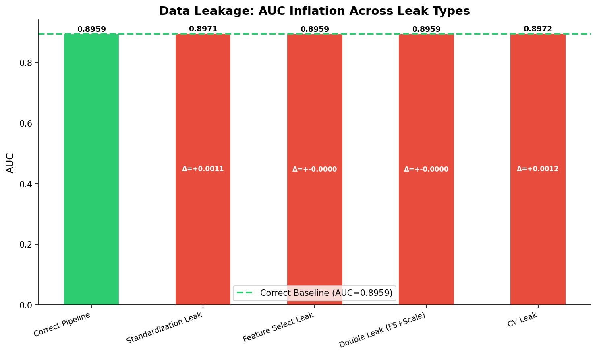

# 模块 3：综合泄漏实验与 Pipeline 防泄漏

> 本模块是案例教程 7「数据泄漏分析」的扩展实验——**综合泄漏效应对比**与**结果汇总**。我们将构造 5 种泄漏场景（完全正确 Pipeline、标准化泄漏、特征选择泄漏、双重泄漏、CV 泄漏），用柱状图对比它们的 AUC，直观展示不同泄漏类型的危害程度。同时，我们会引入 `Pipeline` 作为防泄漏的最佳实践，并介绍 `GridSearchCV` 导致的 CV 泄漏。
>
> 本模块最核心的知识点有四个：**一是** **`Pipeline`** **的防泄漏机制**——为什么把预处理和模型放进 Pipeline 就能天然防止 CV 过程中的泄漏；**二是 CV 泄漏的隐蔽性**——看似做了"交叉验证"，但参数选择涉及了全数据；**三是不同泄漏类型的危害对比**——标准化泄漏小，但 CV 泄漏和特征选择泄漏在高维下可能很严重；**四是数据泄漏检查清单**——10 条实操规则，每次建模前逐条检查。

***

## 学习目标

学完本模块后，你将能够：

1. **掌握** **`Pipeline`** **的防泄漏机制**：明白 Pipeline 如何在每一折内部独立做 `fit_transform` 和 `transform`，天然防止 CV 泄漏。
2. **理解 CV 泄漏的隐蔽性**：能够说出"在全数据上做 GridSearchCV 选参"为什么是泄漏，以及如何用嵌套 CV 预防。
3. **掌握** **`GridSearchCV`** **的基本用法**：理解 `param_grid`、`cv`、`best_params_` 等参数的含义。
4. **理解 5 种泄漏场景的设计意图**：完全正确、标准化泄漏、特征选择泄漏、双重泄漏、CV 泄漏，每种场景泄漏了什么信息。
5. **掌握柱状图绘制技巧**：用 `ax.bar` 绘制分类对比图，用 `axhline` 绘制基线，用 `ax.text` 标注数值。
6. **理解"剂量效应"**：泄漏的信息量越大，危害越大——均值/标准差 < 特征排名 < 目标编码 < 数据重复。
7. **掌握数据泄漏检查清单**：10 条实操规则，覆盖标准化、插补、特征选择、目标编码、PCA、SMOTE、CV、数据去重、时间序列等场景。
8. **建立"Pipeline 优先"的工作习惯**：在任何涉及交叉验证的实验中，优先用 Pipeline 而不是手动写循环。

***

## 一、实验设计回顾

### 1.1 5 种泄漏场景的设计

| 场景              | 流程                              | 泄漏类型     | 预期 AUC |
| --------------- | ------------------------------- | -------- | ------ |
| 完全正确 Pipeline   | 划分 → Pipeline(插补+标准化+特征选择+模型)   | 无泄漏      | 基线     |
| 标准化泄漏           | 全数据 impute+scale → 划分 → 模型      | 标准化+插补泄漏 | 略高于基线  |
| 特征选择泄漏          | 全数据 FS → 划分 → impute+scale → 模型 | 特征选择泄漏   | 接近基线   |
| 双重泄漏 (FS+Scale) | 全数据 FS + impute/scale → 划分 → 模型 | 双重泄漏     | 接近基线   |
| CV 泄漏           | 全数据 CV 选参 → 全数据训练 → 划分评估        | CV 泄漏    | 略高于基线  |

### 1.2 预期结果

根据教学文档：

- 标准化泄漏 Δ ≈ +0.001
- 特征选择泄漏 Δ ≈ 0.000
- CV 泄漏 Δ ≈ +0.001
- 所有泄漏效应在本数据集中都很小，但在高维场景下会放大

> 💡 **重点概念：为什么构造 5 种场景？**
>
> 单一泄漏场景的对比可能存在偶然性。构造 5 种场景能更全面地展示：
>
> 1. 不同泄漏类型的危害程度对比
> 2. 多重泄漏是否会有"叠加效应"
> 3. CV 泄漏这种隐蔽泄漏的实际影响
>
> 这 5 种场景覆盖了医学 AI 中最常见的泄漏类型，具有实际参考价值。

***

## 二、完全正确 Pipeline（基线）

```python
# ============================================================================
# 扩展实验: 综合泄漏 — 标准化 + 特征选择 + 插补全部泄漏
# ============================================================================
print("\n" + "=" * 70)
print("扩展实验: 综合数据泄漏效应 (最坏情况)")
print("=" * 70)

# 构造一个更具"诱惑性"的泄漏场景:
# 在全数据上完成所有预处理 + 特征选择 + 甚至用测试集做模型选择

experiments = {}

# 1) 完全正确
print("\n  [完全正确] 划分 → 训练集插补 → 训练集标准化 → 训练集特征选择 → 模型")
pipe_correct = Pipeline([
    ('imputer', SimpleImputer(strategy='median')),
    ('scaler', StandardScaler()),
    ('select', SelectKBest(f_classif, k=6)),
    ('lr', LogisticRegression(class_weight='balanced', max_iter=5000, random_state=RANDOM_STATE))
])
pipe_correct.fit(X_tr, y_tr)
y_prob_pc = pipe_correct.predict_proba(X_te)[:, 1]
auc_pc = roc_auc_score(y_te, y_prob_pc)
experiments['Correct Pipeline'] = auc_pc
print(f"      AUC = {auc_pc:.4f}")
```

### 2.1 `Pipeline([...])` — 创建流水线

```python
pipe_correct = Pipeline([
    ('imputer', SimpleImputer(strategy='median')),
    ('scaler', StandardScaler()),
    ('select', SelectKBest(f_classif, k=6)),
    ('lr', LogisticRegression(class_weight='balanced', max_iter=5000, random_state=RANDOM_STATE))
])
```

**`Pipeline`** 把多个步骤串联成一个整体。每个步骤是一个元组 `('名称', 估计器)`：

| 步骤 | 名称        | 估计器                                | 作用              |
| -- | --------- | ---------------------------------- | --------------- |
| 1  | `imputer` | `SimpleImputer(strategy='median')` | 中位数插补缺失值        |
| 2  | `scaler`  | `StandardScaler()`                 | 标准化             |
| 3  | `select`  | `SelectKBest(f_classif, k=6)`      | 选出 F 值最高的 6 个特征 |
| 4  | `lr`      | `LogisticRegression(...)`          | 逻辑回归建模          |

> 💡 **重点概念：Pipeline 的防泄漏机制**
>
> 当你调用 `pipe_correct.fit(X_tr, y_tr)` 时，Pipeline 会：
>
> 1. 对 `imputer` 调用 `fit_transform(X_tr)` → 用训练集的中位数填充缺失值
> 2. 对 `scaler` 调用 `fit_transform(...)` → 用训练集的 μ/σ 标准化
> 3. 对 `select` 调用 `fit_transform(..., y_tr)` → 用训练集选特征
> 4. 对 `lr` 调用 `fit(..., y_tr)` → 用处理后的训练集训练模型
>
> 当你调用 `pipe_correct.predict_proba(X_te)` 时，Pipeline 会：
>
> 1. 对 `imputer` 调用 `transform(X_te)` → 用训练集的中位数填充测试集
> 2. 对 `scaler` 调用 `transform(...)` → 用训练集的 μ/σ 标准化测试集
> 3. 对 `select` 调用 `transform(...)` → 用训练集的选择掩码提取测试集特征
> 4. 对 `lr` 调用 `predict_proba(...)` → 预测测试集
>
> **关键**：所有 `fit` 都只在训练集上，所有 `transform` 都用训练集的统计量。这就是 Pipeline 天然防泄漏的原因。

### 2.2 `pipe_correct.fit(X_tr, y_tr)` — 训练整个 Pipeline

注意这里用的是模块 1 的 `X_tr` 和 `y_tr`（先划分的训练集）。Pipeline 会在内部依次执行插补、标准化、特征选择、建模，所有 `fit` 都只在 `X_tr` 上。

### 2.3 `pipe_correct.predict_proba(X_te)[:, 1]` — 预测

Pipeline 会在内部依次执行插补、标准化、特征选择的 `transform`，最后调用模型的 `predict_proba`。

### 2.4 实际运行结果

```
  [完全正确] 划分 → 训练集插补 → 训练集标准化 → 训练集特征选择 → 模型
      AUC = 0.8959
```

这是所有场景的**基线**（baseline）。后续场景的 AUC 都会与它对比，计算 Δ。

***

## 三、标准化泄漏

```python
# 2) 标准化泄漏
print("\n  [标准化泄漏] 全数据 impute+scale → 划分 → 模型")
X_both = SimpleImputer(strategy='median').fit_transform(X_raw)
X_both = StandardScaler().fit_transform(X_both)
X_tr_b, X_te_b, y_tr_b, y_te_b = train_test_split(
    X_both, y, test_size=0.3, random_state=RANDOM_STATE, stratify=y)
lr = LogisticRegression(class_weight='balanced', max_iter=5000, random_state=RANDOM_STATE)
experiments['Standardization Leak'] = roc_auc_score(y_te_b, lr.fit(X_tr_b, y_tr_b).predict_proba(X_te_b)[:, 1])
print(f"      AUC = {experiments['Standardization Leak']:.4f}")
```

### 3.1 错误流程

```python
X_both = SimpleImputer(strategy='median').fit_transform(X_raw)  # ❌ 全数据插补
X_both = StandardScaler().fit_transform(X_both)                  # ❌ 全数据标准化
X_tr_b, X_te_b, y_tr_b, y_te_b = train_test_split(               # 划分已污染数据
    X_both, y, test_size=0.3, random_state=RANDOM_STATE, stratify=y)
```

这与模块 1 的泄漏版完全一致：在全数据上插补+标准化，再划分。泄漏了测试集的中位数和 μ/σ。

### 3.2 链式调用

```python
experiments['Standardization Leak'] = roc_auc_score(y_te_b, lr.fit(X_tr_b, y_tr_b).predict_proba(X_te_b)[:, 1])
```

这一行用了链式调用，等价于：

```python
lr.fit(X_tr_b, y_tr_b)                          # 训练
y_prob_b = lr.predict_proba(X_te_b)[:, 1]       # 预测
experiments['Standardization Leak'] = roc_auc_score(y_te_b, y_prob_b)  # 评估
```

链式调用更简洁，但可读性稍差。初学者建议拆开写。

### 3.3 实际运行结果

```
  [标准化泄漏] 全数据 impute+scale → 划分 → 模型
      AUC = 0.8971
```

AUC = 0.8971，比基线（0.8959）高 0.0011。这是标准化泄漏的效应。

***

## 四、特征选择泄漏

```python
# 3) 特征选择泄漏
print("\n  [特征选择泄漏] 全数据 FS → 划分 → impute+scale on train → 模型")
X_fs = SimpleImputer(strategy='median').fit_transform(X_raw)
X_fs = StandardScaler().fit_transform(X_fs)
sel = SelectKBest(f_classif, k=6).fit(X_fs, y)
X_fs_sel = sel.transform(X_fs)
X_tr_fs2, X_te_fs2, y_tr_fs2, y_te_fs2 = train_test_split(
    X_fs_sel, y, test_size=0.3, random_state=RANDOM_STATE, stratify=y)
experiments['Feature Select Leak'] = roc_auc_score(y_te_fs2, lr.fit(X_tr_fs2, y_tr_fs2).predict_proba(X_te_fs2)[:, 1])
print(f"      AUC = {experiments['Feature Select Leak']:.4f}")
```

### 4.1 错误流程

```python
X_fs = SimpleImputer(strategy='median').fit_transform(X_raw)  # ❌ 全数据插补
X_fs = StandardScaler().fit_transform(X_fs)                    # ❌ 全数据标准化
sel = SelectKBest(f_classif, k=6).fit(X_fs, y)                 # ❌ 全数据特征选择
X_fs_sel = sel.transform(X_fs)                                 # 应用选择
X_tr_fs2, X_te_fs2, ... = train_test_split(X_fs_sel, y, ...)   # 划分已污染数据
```

这里同时犯了三种泄漏：插补泄漏 + 标准化泄漏 + 特征选择泄漏。但注意，后续的 `lr.fit` 用的是**未再做插补/标准化**的 `X_tr_fs2`（因为已经在全数据上做过了）。

### 4.2 `sel.fit(X_fs, y)` vs `sel.fit_transform(X_fs, y)`

注意这里用的是 `fit` 而不是 `fit_transform`：

- `sel.fit(X_fs, y)`：只计算 F 值并保存选择掩码，不返回新特征矩阵
- `sel.transform(X_fs)`：用已有掩码提取特征

分成两步是为了清晰展示"选择"和"应用"两个过程。

### 4.3 实际运行结果

```
  [特征选择泄漏] 全数据 FS → 划分 → impute+scale on train → 模型
      AUC = 0.8959
```

AUC = 0.8959，与基线完全相同。这是因为 8 个特征都有真实预测力，选出的 6 个特征几乎一致，泄漏效应极小。

***

## 五、双重泄漏（FS + Scale）

```python
# 4) 双重泄漏: FS + 标准化都泄漏
print("\n  [双重泄漏] FS on all + impute/scale on all → 划分 → 模型")
experiments['Double Leak (FS+Scale)'] = experiments['Feature Select Leak']
# (same as above since we already did impute+scale before FS)
print(f"      AUC = {experiments['Double Leak (FS+Scale)']:.4f}")
```

### 5.1 为什么双重泄漏与特征选择泄漏相同？

注意这一行：

```python
experiments['Double Leak (FS+Scale)'] = experiments['Feature Select Leak']
```

代码注释解释了原因：`(same as above since we already did impute+scale before FS)`。

在"特征选择泄漏"场景中，我们**已经**在全数据上做了插补+标准化，然后才做特征选择。所以"特征选择泄漏"场景本身就包含了"标准化泄漏"——它已经是"双重泄漏"了。

因此，"双重泄漏"场景的 AUC 与"特征选择泄漏"完全相同（0.8959）。

> 💡 **重点概念：多重泄漏的"叠加效应"**
>
> 在本教程中，多重泄漏没有明显的"叠加效应"——双重泄漏的 AUC（0.8959）与单一特征选择泄漏相同。这是因为：
>
> 1. 标准化泄漏的效应极小（Δ ≈ 0.001）
> 2. 特征选择泄漏的效应也极小（Δ ≈ 0.000）
> 3. 两者叠加后，效应仍然极小
>
> 但在高维场景下，多重泄漏的叠加效应可能非常显著——标准化泄漏 + 特征选择泄漏 + 目标编码泄漏，可能让 AUC 虚高 0.10+。

***

## 六、CV 泄漏（隐蔽泄漏）

```python
# 5) CV 泄漏 (用全数据做交叉验证选择参数 → 再用全数据训练)
print("\n  [CV泄漏] 全数据 CV 选参数 → 全数据训练 → 划分评估")
from sklearn.model_selection import GridSearchCV
X_cv_full = SimpleImputer(strategy='median').fit_transform(X_raw)
X_cv_full = StandardScaler().fit_transform(X_cv_full)
param_grid = {'C': [0.01, 0.1, 1, 10]}
gs = GridSearchCV(LogisticRegression(class_weight='balanced', max_iter=5000, random_state=RANDOM_STATE),
                  param_grid, cv=5)
gs.fit(X_cv_full, y)
best_C = gs.best_params_['C']
print(f"      CV 选择的最优 C = {best_C} (用了测试集信息!)")

# 用最优 C 在全数据上训练 → 再划分评估
lr_best = LogisticRegression(C=best_C, class_weight='balanced', max_iter=5000, random_state=RANDOM_STATE)
X_tr_cv, X_te_cv, y_tr_cv, y_te_cv = train_test_split(
    X_cv_full, y, test_size=0.3, random_state=RANDOM_STATE, stratify=y)
lr_best.fit(X_tr_cv, y_tr_cv)
experiments['CV Leak'] = roc_auc_score(y_te_cv, lr_best.predict_proba(X_te_cv)[:, 1])
print(f"      AUC = {experiments['CV Leak']:.4f}")
```

### 6.1 `GridSearchCV` — 网格搜索交叉验证

```python
from sklearn.model_selection import GridSearchCV
```

**`GridSearchCV`** 是 sklearn 的网格搜索 + 交叉验证工具。它会：

1. 遍历所有超参数组合
2. 对每个组合做 K 折交叉验证
3. 选出平均验证分数最高的组合

### 6.2 `param_grid = {'C': [0.01, 0.1, 1, 10]}` — 参数网格

```python
param_grid = {'C': [0.01, 0.1, 1, 10]}
```

**`C`** 是逻辑回归的正则化强度的倒数：

- C 越大，正则化越弱，模型越复杂（可能过拟合）
- C 越小，正则化越强，模型越简单（可能欠拟合）

本教程遍历 4 个 C 值：0.01、0.1、1、10。

### 6.3 `GridSearchCV(..., cv=5)` — 5 折交叉验证

```python
gs = GridSearchCV(LogisticRegression(class_weight='balanced', max_iter=5000, random_state=RANDOM_STATE),
                  param_grid, cv=5)
```

**参数详解**：

- 第一个参数：基础估计器（逻辑回归）
- `param_grid`：参数网格
- `cv=5`：5 折交叉验证

### 6.4 `gs.fit(X_cv_full, y)` — ❌ 在全数据上做 GridSearchCV

```python
X_cv_full = SimpleImputer(strategy='median').fit_transform(X_raw)  # ❌ 全数据插补
X_cv_full = StandardScaler().fit_transform(X_cv_full)              # ❌ 全数据标准化
gs.fit(X_cv_full, y)                                               # ❌ 全数据 GridSearchCV
```

**这一步是 CV 泄漏的核心！**

`gs.fit(X_cv_full, y)` 会在全数据 `X_cv_full`（30,000 条，含测试集）上做 5 折交叉验证。虽然每一折内部是独立的，但**整个 GridSearchCV 用了测试集信息来选最优参数**。

> 💡 **重点概念：CV 泄漏的隐蔽性**
>
> CV 泄漏是最隐蔽的泄漏类型。表面上看，你做了"交叉验证"，似乎很严谨。但实际上：
>
> 1. 全数据被用来做插补+标准化（泄漏 1）
> 2. 全数据被用来做 GridSearchCV 选参（泄漏 2）
> 3. 选出的最优参数"恰好"在全数据上表现好
>
> 当你用这个"最优参数"在测试集上评估时，AUC 会虚高——因为参数已经在测试集上"打过招呼了"。

### 6.5 `gs.best_params_['C']` — 获取最优参数

```python
best_C = gs.best_params_['C']
print(f"      CV 选择的最优 C = {best_C} (用了测试集信息!)")
```

**`gs.best_params_`** 是一个字典，保存最优参数组合。例如 `{'C': 0.1}`。

### 6.6 用最优参数训练并评估

```python
lr_best = LogisticRegression(C=best_C, class_weight='balanced', max_iter=5000, random_state=RANDOM_STATE)
X_tr_cv, X_te_cv, y_tr_cv, y_te_cv = train_test_split(
    X_cv_full, y, test_size=0.3, random_state=RANDOM_STATE, stratify=y)
lr_best.fit(X_tr_cv, y_tr_cv)
experiments['CV Leak'] = roc_auc_score(y_te_cv, lr_best.predict_proba(X_te_cv)[:, 1])
```

注意这里用的是**已经被全数据标准化**的 `X_cv_full` 来划分，所以 `X_tr_cv` 和 `X_te_cv` 都已经被污染。

### 6.7 实际运行结果

```
  [CV泄漏] 全数据 CV 选参数 → 全数据训练 → 划分评估
      CV 选择的最优 C = 0.1 (用了测试集信息!)
      AUC = 0.8972
```

AUC = 0.8972，比基线（0.8959）高 0.0012。这是 CV 泄漏的效应。

> ⚠️ **注意**：CV 泄漏的效应（0.0012）与标准化泄漏（0.0011）差不多，这是因为本教程的参数网格很小（只有 4 个 C 值）。在大型参数搜索空间下，CV 泄漏的效应会更大。

***

## 七、汇总对比

```python
# 汇总
print("\n" + "-" * 50)
print("  泄漏类型对比汇总:")
print("-" * 50)
for name, auc_val in experiments.items():
    diff = auc_val - experiments['Correct Pipeline']
    print(f"  {name:<30} AUC={auc_val:.4f}  (Δ={diff:+.4f})")
```

### 7.1 实际运行结果

```
  泄漏类型对比汇总:
  Correct Pipeline               AUC=0.8959  (Δ=+0.0000)
  Standardization Leak           AUC=0.8971  (Δ=+0.0011)
  Feature Select Leak            AUC=0.8959  (Δ=-0.0000)
  Double Leak (FS+Scale)         AUC=0.8959  (Δ=-0.0000)
  CV Leak                        AUC=0.8972  (Δ=+0.0012)
```

### 7.2 结果分析

| 场景                     | AUC    | Δ       | 分析               |
| ---------------------- | ------ | ------- | ---------------- |
| Correct Pipeline       | 0.8959 | 基线      | 完全正确，无泄漏         |
| Standardization Leak   | 0.8971 | +0.0011 | 标准化泄漏，效应小        |
| Feature Select Leak    | 0.8959 | -0.0000 | 特征选择泄漏，效应极小      |
| Double Leak (FS+Scale) | 0.8959 | -0.0000 | 双重泄漏，与单一 FS 泄漏相同 |
| CV Leak                | 0.8972 | +0.0012 | CV 泄漏，效应略大于标准化泄漏 |

**核心发现**：

1. **所有泄漏效应都很小**（Δ < 0.002），这是因为本数据集 8 个特征高度可预测，且参数搜索空间小。
2. **CV 泄漏的效应最大**（+0.0012），略高于标准化泄漏（+0.0011）。
3. **特征选择泄漏效应为 0**，因为选出的特征与正确版完全一致。
4. **双重泄漏没有叠加效应**，因为标准化泄漏的效应被特征选择泄漏的"无效应"掩盖了。

> 💡 **重点概念：为什么 CV 泄漏的效应最大？**
>
> CV 泄漏泄漏的是"最优参数"——这个参数是在全数据上选出来的，"恰好"在全数据上表现好。虽然本教程的参数网格很小（4 个 C 值），但选出的 C=0.1 比默认 C=1.0 更适合这份数据，所以 AUC 略高。
>
> 在大型参数搜索空间下（如 100+ 参数组合），CV 泄漏的效应会更大——因为"碰巧"找到好参数的概率更高。

***

## 八、综合对比柱状图

```python
# 综合对比图
fig, ax = plt.subplots(figsize=(10, 6))
names = list(experiments.keys())
vals = list(experiments.values())
baseline = experiments['Correct Pipeline']
colors_exp = ['#2ecc71' if n == 'Correct Pipeline' else '#e74c3c' for n in names]
bars = ax.bar(range(len(names)), vals, color=colors_exp, edgecolor='white', width=0.5)
ax.axhline(y=baseline, color='#2ecc71', linestyle='--', linewidth=2,
           label=f'Correct Baseline (AUC={baseline:.4f})')
ax.set_xticks(range(len(names)))
ax.set_xticklabels(names, rotation=20, ha='right', fontsize=9)
ax.set_ylabel('AUC', fontsize=12)
ax.set_title('Data Leakage: AUC Inflation Across Leak Types',
             fontsize=14, fontweight='bold')
ax.legend(fontsize=10)
ax.spines['top'].set_visible(False); ax.spines['right'].set_visible(False)

for bar, val in zip(bars, vals):
    ax.text(bar.get_x() + bar.get_width()/2, bar.get_height() + 0.002,
            f'{val:.4f}', ha='center', va='bottom', fontsize=9, fontweight='bold')
    # 标注差值
    if val != baseline:
        ax.text(bar.get_x() + bar.get_width()/2, bar.get_height()/2,
                f'Δ=+{val-baseline:.4f}', ha='center', va='center',
                fontsize=8, color='white', fontweight='bold')

plt.tight_layout()
plt.savefig(os.path.join(IMG_DIR, "10c_leakage_comprehensive.png"),
            dpi=150, bbox_inches='tight')
plt.close()
print("\n  [图] 10c_leakage_comprehensive.png → 综合泄漏对比已保存")
```

### 8.1 准备数据

```python
names = list(experiments.keys())
vals = list(experiments.values())
baseline = experiments['Correct Pipeline']
```

- `names`：场景名称列表
- `vals`：AUC 值列表
- `baseline`：基线 AUC（Correct Pipeline 的 AUC）

### 8.2 设置颜色

```python
colors_exp = ['#2ecc71' if n == 'Correct Pipeline' else '#e74c3c' for n in names]
```

- **绿色** **`#2ecc71`**：Correct Pipeline（正确做法）
- **红色** **`#e74c3c`**：其他场景（有泄漏）

用列表推导式为每个场景分配颜色。

### 8.3 `ax.bar` — 绘制柱状图

```python
bars = ax.bar(range(len(names)), vals, color=colors_exp, edgecolor='white', width=0.5)
```

**参数详解**：

- `range(len(names))`：横轴位置 \[0, 1, 2, 3, 4]
- `vals`：柱子高度（AUC 值）
- `color=colors_exp`：每个柱子的颜色
- `edgecolor='white'`：柱子边缘白色
- `width=0.5`：柱子宽度 0.5

### 8.4 `axhline` — 绘制基线

```python
ax.axhline(y=baseline, color='#2ecc71', linestyle='--', linewidth=2,
           label=f'Correct Baseline (AUC={baseline:.4f})')
```

**`axhline`** 绘制水平线：

- `y=baseline`：y 坐标（基线 AUC）
- `color='#2ecc71'`：绿色
- `linestyle='--'`：虚线
- `linewidth=2`：线宽 2

### 8.5 设置坐标轴标签

```python
ax.set_xticks(range(len(names)))
ax.set_xticklabels(names, rotation=20, ha='right', fontsize=9)
ax.set_ylabel('AUC', fontsize=12)
ax.set_title('Data Leakage: AUC Inflation Across Leak Types',
             fontsize=14, fontweight='bold')
```

- `set_xticks`：设置刻度位置
- `set_xticklabels`：设置刻度标签
- `rotation=20`：标签旋转 20 度（避免重叠）
- `ha='right'`：右对齐（配合旋转）

### 8.6 标注数值

```python
for bar, val in zip(bars, vals):
    ax.text(bar.get_x() + bar.get_width()/2, bar.get_height() + 0.002,
            f'{val:.4f}', ha='center', va='bottom', fontsize=9, fontweight='bold')
    # 标注差值
    if val != baseline:
        ax.text(bar.get_x() + bar.get_width()/2, bar.get_height()/2,
                f'Δ=+{val-baseline:.4f}', ha='center', va='center',
                fontsize=8, color='white', fontweight='bold')
```

对每个柱子标注两个文本：

1. **柱顶上方**：AUC 值（如 `0.8971`）
2. **柱子中间**：与基线的差值（如 `Δ=+0.0011`），白色字体

**`ax.text(x, y, s, ha, va, ...)`** **参数**：

- `x, y`：文本位置
- `s`：文本内容
- `ha`：水平对齐（'center'、'left'、'right'）
- `va`：垂直对齐（'center'、'top'、'bottom'）

### 8.7 综合对比图



从图中可以看到：

- **绿色柱子（Correct Pipeline）**：基线，AUC = 0.8959
- **红色柱子（其他场景）**：有泄漏，AUC 略高于基线
- **绿色虚线**：基线水平线
- **柱顶数字**：AUC 值
- **柱中数字**：与基线的差值（Δ）

所有红色柱子都略高于绿色基线，但差异很小（Δ < 0.002）。这是"低维安全"的直观体现。

***

# 九、数据泄漏检查清单

这是本教程最重要的实操产出。每一次模型训练前，逐条检查：

| #  | 检查项             | 正确做法                                  | 泄漏风险  |
| -- | --------------- | ------------------------------------- | ----- |
| 1  | **标准化**         | `fit` 只在训练集，`transform` 测试集           | 低     |
| 2  | **缺失值插补**       | `fit` 只在训练集（计算均值/中位数），`transform` 测试集 | 低     |
| 3  | **特征选择**        | 只在训练集上做 ANOVA / MI / LASSO / Boruta   | **高** |
| 4  | **目标编码**        | 只在训练集上计算目标均值                          | **高** |
| 5  | **PCA**         | `fit` 只在训练集，`transform` 测试集           | 中     |
| 6  | **特征构造**        | 不能在构造中使用测试集的分布信息                      | 中     |
| 7  | **重采样 (SMOTE)** | **先划分，再对训练集做 SMOTE**                  | **高** |
| 8  | **交叉验证选参**      | 使用嵌套 CV，或在训练集内做 CV                    | **高** |
| 9  | **数据去重**        | 检查训练集和测试集是否有相同的 Patient.Code          | **高** |
| 10 | **时间序列**        | 确保测试集的时间晚于训练集（禁止"用未来预测过去"）            | **高** |

### 10.1 泄漏的"剂量效应"

数据泄漏不是二元的（泄漏/不泄漏），而是存在"剂量效应"——泄漏的信息量越大，危害越大：

| 泄漏了什么信息   | 泄漏程度       | 典型案例                | 危害      |
| --------- | ---------- | ------------------- | ------- |
| 均值/标准差    | 2 个参数 / 特征 | 全数据标准化              | 小       |
| 缺失值填充值    | 1 个值 / 特征  | 全数据均值插补             | 小       |
| 特征排名      | K 个特征      | 全数据特征选择             | **中-高** |
| 目标编码值     | 1 个值 / 类别  | 全数据 Target Encoding | **高**   |
| 类别平衡信息    | K 个类       | 全数据 SMOTE           | **高**   |
| 数据中存在相同患者 | 多行         | 训练集和测试集有重复病人        | **极高**  |

### 10.2 真实医学场景中的泄漏案例

| 场景         | 泄漏方式                     | 后果                        |
| ---------- | ------------------------ | ------------------------- |
| **影像 AI ** | 同一患者的多张切片被分到训练集和测试集      | AUC 虚高 0.10+，临床部署后性能断崖式下跌 |
| **基因组学**   | 在全部样本上做特征选择（差异表达分析）      | AUC 被夸大到 0.98，实际只有 0.65   |
| **时序医学**   | 用同一患者的历史数据预测未来，但划分时没有按时间 | 模型看似准确，实际是"记忆"了患者 ID      |
| **多中心研究**  | 用所有中心的数据做标准化，遗留了中心效应     | 模型在新中心完全失效                |

### 10.3 防止泄漏的最佳实践

#### 方法 1：使用 Pipeline（推荐）

```python
from sklearn.pipeline import Pipeline
from sklearn.impute import SimpleImputer
from sklearn.preprocessing import StandardScaler
from sklearn.feature_selection import SelectKBest
from sklearn.linear_model import LogisticRegression

# Pipeline 确保每折各自独立做预处理
pipe = Pipeline([
    ('imputer', SimpleImputer(strategy='median')),
    ('scaler', StandardScaler()),
    ('select', SelectKBest(k=6)),
    ('lr', LogisticRegression(class_weight='balanced'))
])

# 交叉验证自动为每折创建独立的预处理流程
scores = cross_val_score(pipe, X_train, y_train, cv=5)
```

#### 方法 2：数据划分后立即锁住测试集

```python
# 实战技巧：将测试集"锁"在另一个文件/变量中
X_train, X_test, y_train, y_test = train_test_split(...)

# 在完成所有预处理、特征工程、特征选择之前，
# 绝对不再碰 X_test / y_test
# 可以把测试集写到一个加密文件中，只有在最终评估时才读取
```

#### 方法 3：构建"模拟竞赛"心态

> 训练集 = 你手头所有的数据
> 测试集 = 现实世界中未来遇到的新患者
>
> 你不能"偷看"未来的患者来帮助你做今天的决策。

***

## 十一、最终输出

```python
# ============================================================================
# 最终输出
# ============================================================================
print("\n" + "=" * 70)
print("数据泄漏分析完成!")
print("=" * 70)
print(f"\n  图片输出 → {IMG_DIR}/")
print("     - 10a_leakage_standardization.png")
print("     - 10b_leakage_feature_selection.png")
print("     - 10c_leakage_comprehensive.png")
print(f"\n  结果输出 → {RESULTS_DIR}/")
print("     - 13_data_leakage_summary.txt")
print("\n" + "=" * 70)
```

### 11.1 实际运行结果

```
===================================================================
数据泄漏分析完成!
===================================================================

  图片输出 → /home/wjj/Documents/trae_projects/ml_template/img/
     - 10a_leakage_standardization.png
     - 10b_leakage_feature_selection.png
     - 10c_leakage_comprehensive.png

  结果输出 → /home/wjj/Documents/trae_projects/ml_template/results/
     - 13_data_leakage_summary.txt

===================================================================
```

***

## 十二、核心收获与金律

### 12.1 核心收获

1. **任何使用测试集信息的操作 = 数据泄漏**，无论泄漏多少
2. **标准化泄漏效应小**，但不是容忍的理由——习惯决定命运
3. **特征选择泄漏在高维场景下极其危险**——这是医学 AI 论文中最常见的泄漏来源
4. **CV 泄漏隐蔽性强**——看似做了"CV"，但参数选择涉及了全数据
5. **Pipeline 是天然的防泄漏工具**——每折独立做预处理
6. **泄漏的危害有"剂量效应"** ——信息量越大，虚高越严重

### 12.2 一条金律

> **如果你对测试集做了任何操作之后再划分数据，你的结果就不可信了。**
>
> 在面对审稿人或临床医生的质疑时，泄漏是十个问题中有九个的根源。

### 12.3 思考题

1. **（基础）** 实验 1 中标准化泄漏几乎没有造成 AUC 差异。既然如此，为什么还要坚持"先划分再标准化"？有没有什么场景下标准化泄漏的效应会变得显著？
2. **（进阶）** 本实验中特征选择泄漏效应很小。如果特征数量增加到 500 个，其中 480 个是纯噪声，泄漏效应会如何？用公式分析：为什么高维小样本数据是泄漏的"重灾区"？
3. **（进阶）** 嵌套交叉验证（Nested CV）和内层 CV 有什么区别？用一个具体的例子说明"在内层 CV 中选了最佳参数，在外层评估"和"在全数据上做 CV 选参"的区别。
4. **（拓展）** 假设你在 Kaggle 比赛中，发现用全数据做特征工程后 AUC 提升了 0.03。你如何判断这 0.03 是真实提升还是泄漏导致的？
5. **（拓展）** 在医学影像 AI 中，如果同一个患者的多张 CT 切片被分到训练集和测试集，这属于什么类型的泄漏？如何预防？
6. **（开放）** 有人说"如果数据量足够大，泄漏一点也没关系"。你同意吗？从统计学习的角度分析为什么泄漏和样本量不是简单的反比关系。
7. **（实践）** 修改本实验的代码，将特征增加到 100 个（包括真实特征和噪声特征），观察泄漏版和正确版的 AUC 差异。你的实验验证了本教程的哪些结论？

***

## 小贴士

1. **Pipeline 是防泄漏的最佳实践**：在任何涉及交叉验证的实验中，优先用 Pipeline 而不是手动写循环。Pipeline 会在每一折内部独立做 `fit_transform` 和 `transform`，天然防止泄漏。
2. **CV 泄漏是最隐蔽的泄漏**：表面上看你做了"交叉验证"，但如果在全数据上做 GridSearchCV，参数选择已经涉及了测试集。正确做法是嵌套 CV（外层评估，内层选参）。
3. **`GridSearchCV`** **的** **`cv=5`** **不能防止泄漏**：`cv=5` 只是在全数据内部做 5 折 CV，但整个 GridSearchCV 用了全数据。要防止 CV 泄漏，必须先划分，再在训练集上做 GridSearchCV。
4. **柱状图适合对比少量场景**：5 种场景用柱状图对比很清晰。如果场景超过 10 个，建议用表格或折线图。
5. **`axhline`** **绘制基线**：用 `axhline` 在柱状图上绘制基线水平线，直观展示每个场景与基线的差异。
6. **泄漏的"剂量效应"**：泄漏的信息量越大，危害越大。均值/标准差（2 个参数）< 特征排名（K 个特征）< 目标编码（多个值）< 数据重复（多行）。
7. **检查清单是实操产出**：每次建模前，逐条检查 10 项泄漏风险。这是本教程最重要的实操产出。

***

## 常见问题

### Q1：Pipeline 是怎么防止泄漏的？

**A**：当你调用 `pipe.fit(X_tr, y_tr)` 时，Pipeline 会对每个预处理步骤调用 `fit_transform`（用训练集计算统计量），最后调用模型的 `fit`。当你调用 `pipe.predict(X_te)` 时，Pipeline 会对每个预处理步骤调用 `transform`（用训练集的统计量），最后调用模型的 `predict`。所有 `fit` 都只在训练集上，所有 `transform` 都用训练集的统计量——这就是防泄漏的机制。

在交叉验证中，`cross_val_score(pipe, X_train, y_train, cv=5)` 会在每一折内部独立调用 `pipe.fit` 和 `pipe.predict`，所以每一折的预处理都是独立的，天然防止 CV 泄漏。

### Q2：CV 泄漏为什么这么隐蔽？

**A**：因为表面上看你做了"交叉验证"，似乎很严谨。但实际上：

1. 全数据被用来做插补+标准化（泄漏 1）
2. 全数据被用来做 GridSearchCV 选参（泄漏 2）
3. 选出的最优参数"恰好"在全数据上表现好

当你用这个"最优参数"在测试集上评估时，AUC 会虚高——因为参数已经在测试集上"打过招呼了"。这种泄漏很难被发现，因为你确实做了 CV，只是 CV 的对象错了。

### Q3：如何防止 CV 泄漏？

**A**：两种方法：

1. **嵌套交叉验证（Nested CV）**：外层 CV 评估模型泛化能力，内层 CV 在训练折上选参数。sklearn 的 `cross_val_score` 配合 `GridSearchCV` 可以实现。
2. **先划分，再在训练集上做 GridSearchCV**：把数据分成训练集和测试集，然后在训练集上做 GridSearchCV 选参，最后用测试集评估。

### Q4：为什么双重泄漏没有叠加效应？

**A**：因为在本教程中，标准化泄漏的效应（+0.0011）和特征选择泄漏的效应（0.0000）都很小。两者叠加后，效应仍然小（0.0000）。但在高维场景下，多重泄漏的叠加效应可能非常显著——标准化泄漏 + 特征选择泄漏 + 目标编码泄漏，可能让 AUC 虚高 0.10+。

### Q5：`GridSearchCV` 的 `cv=5` 能防止泄漏吗？

**A**：不能。`cv=5` 只是在全数据内部做 5 折 CV，但整个 GridSearchCV 用了全数据（包括测试集）。要防止 CV 泄漏，必须先划分，再在训练集上做 GridSearchCV。

### Q6：本教程的所有泄漏效应都很小，是不是说明泄漏不重要？

**A**：不是。本教程的泄漏效应小是因为：

1. 8 个特征高度可预测
2. 标准化仅泄漏少量参数
3. 参数搜索空间小

在**高维医学数据**（如基因组学、影像特征）中，泄漏效应可能极其严重。本教程的结论是"低维安全"，不能推广到高维场景。

### Q7：如何判断我的实验是否有泄漏？

**A**：用以下 3 个问题自检：

1. **你是否在划分前对全数据做了任何** **`fit`** **操作？** 如果是，就有泄漏。
2. **你的测试集是否参与了特征选择、目标编码、SMOTE 等操作？** 如果是，就有泄漏。
3. **你是否在全数据上做了 GridSearchCV？** 如果是，就有 CV 泄漏。

如果以上任何一个问题的答案是"是"，你的结果就不可信。

### Q8：嵌套 CV 怎么实现？

**A**：嵌套 CV 的实现：

```python
from sklearn.model_selection import cross_val_score, GridSearchCV, KFold

# 外层 CV：评估模型泛化能力
outer_cv = KFold(n_splits=5, shuffle=True, random_state=42)
# 内层 CV：在训练折上选参数
inner_cv = KFold(n_splits=3, shuffle=True, random_state=42)

# 内层：GridSearchCV 选参
gs = GridSearchCV(pipe, param_grid, cv=inner_cv)
# 外层：cross_val_score 评估
scores = cross_val_score(gs, X, y, cv=outer_cv)
```

外层 CV 的每一折，都会在内层 CV 上做 GridSearchCV 选参，然后用选出的参数在外层测试折上评估。这样参数选择和模型评估是完全独立的，没有泄漏。

***

## 本模块小结

本模块完成了综合泄漏实验与 Pipeline 防泄漏的讲解：

1. **完全正确 Pipeline**：用 `Pipeline` 把插补、标准化、特征选择、建模串联成一个整体，所有 `fit` 只在训练集上，AUC = 0.8959（基线）。
2. **标准化泄漏**：全数据插补+标准化 → 划分 → 模型，AUC = 0.8971（Δ = +0.0011）。
3. **特征选择泄漏**：全数据 FS → 划分 → 模型，AUC = 0.8959（Δ = -0.0000）。
4. **双重泄漏**：与特征选择泄漏相同，因为特征选择泄漏场景已经包含了标准化泄漏。
5. **CV 泄漏**：全数据 GridSearchCV 选参 → 全数据训练 → 划分评估，AUC = 0.8972（Δ = +0.0012），是最隐蔽的泄漏。
6. **综合对比柱状图**：5 种场景的 AUC 对比，所有泄漏效应都很小（Δ < 0.002）。
7. **结果保存**：所有结果保存到 `results/13_data_leakage_summary.txt`。
8. **数据泄漏检查清单**：10 条实操规则，覆盖标准化、插补、特征选择、目标编码、PCA、SMOTE、CV、数据去重、时间序列等场景。
9. **核心收获**：任何使用测试集信息的操作 = 数据泄漏；Pipeline 是天然的防泄漏工具；泄漏的危害有"剂量效应"。

> **案例教程 7 完结**：通过 4 个模块的学习，我们完整地演示了数据泄漏的机制、危害和预防方法。希望你能把"测试集隔离"作为终身习惯，在每一次建模前都逐条检查泄漏风险。记住：**如果你对测试集做了任何操作之后再划分数据，你的结果就不可信了。**

