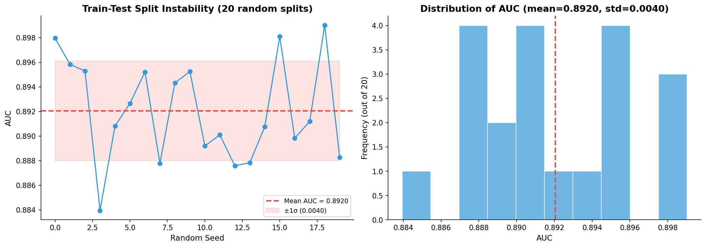
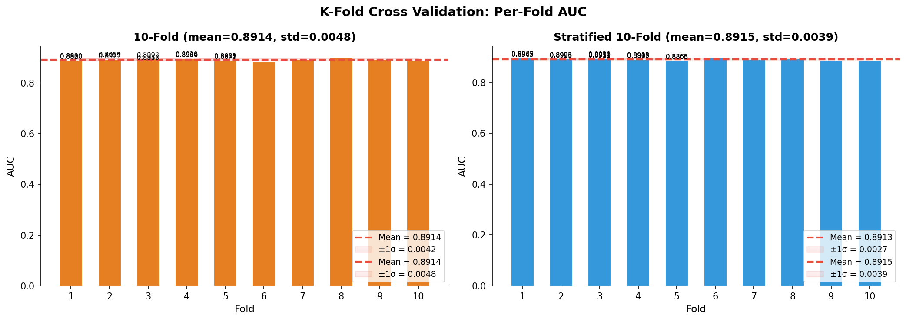

# 模块 1：Train-Test Split 不稳定性与 K-Fold / Stratified K-Fold

> 本模块是案例教程 8「数据划分与交叉验证」的第二个模块，本模块要回答两个核心问题：**为什么单次 Train-Test Split 不可靠？** 以及 **K-Fold 和 Stratified K-Fold 如何给出更可信的评估？**
>
> 本模块包含三部分实验：**第一部分**用 20 次不同随机种子的 Train-Test Split 演示"结果不稳定性"——你会发现同样的模型、同样的数据，仅仅因为随机种子不同，AUC 就在 0.8839 到 0.8990 之间波动，极差达 0.0151；**第二部分**引入 K-Fold CV（5 折和 10 折），解释为什么多次验证比单次划分更可靠；**第三部分**引入 Stratified K-Fold，解释为什么医学数据必须保持每折的类别比例一致。

***

## 学习目标

学完本模块后，你将能够：

1. **理解 Train-Test Split 不稳定性的来源**：知道为什么同样的模型在不同随机种子下会得到不同的 AUC，以及"极差 0.0151"在论文审稿中意味着什么。
2. **掌握** **`train_test_split`** **的所有参数**：特别是 `test_size`、`random_state`、`stratify` 三个参数的含义和作用。
3. **理解 K-Fold CV 的完整流程**：能够画出 5-Fold CV 的示意图，解释"每折训练集占比 (K-1)/K"的含义。
4. **掌握** **`KFold`** **类的参数**：`n_splits`、`shuffle`、`random_state` 三个参数的作用，以及 `shuffle=True` 为什么重要。
5. **掌握** **`cross_val_score`** **函数的用法**：理解 `estimator`、`X`、`y`、`cv`、`scoring`、`n_jobs` 六个参数的含义。
6. **理解 Stratified K-Fold 的必要性**：知道为什么医学数据（尤其是不平衡数据）必须用分层抽样，以及它如何降低评估方差。
7. **能够解读 5-Fold vs 10-Fold 的对比结果**：理解"为什么 10 折的方差反而比 5 折大"这个反直觉发现。
8. **掌握可视化代码的绘图逻辑**：理解如何用 matplotlib 绘制折线图、直方图和柱状图来展示 CV 结果。

***

## 一、第一部分：Train-Test Split — 结果不稳定性演示

### 1.1 实验设计

```python
# ============================================================================
# 第一部分: Train-Test Split — 结果不稳定性演示
# ============================================================================
print("\n" + "=" * 70)
print("第一部分: Train-Test Split — 结果的不稳定性")
print("=" * 70)

split_results = []
n_trials = 20

print(f"\n  重复 {n_trials} 次随机的 80/20 划分:")
```

这段代码开启了第一部分实验。核心设计是：**用 20 个不同的随机种子做 20 次 80/20 划分**，每次都用逻辑回归训练并评估 AUC，最后看 AUC 的波动范围。

- `split_results = []`：用一个列表存储每次划分的结果。
- `n_trials = 20`：重复 20 次。为什么是 20？因为 20 次足够展示波动趋势，同时计算成本可控（20 次逻辑回归训练约 1 秒）。

> 💡 **实验目的**：这个实验要回答的问题是——"如果我只做一次 Train-Test Split，我的 AUC 结果有多大的偶然性？" 通过 20 次重复，我们能直观看到 AUC 的波动范围，从而理解单次划分的不可靠性。

### 1.2 核心循环：20 次随机划分

```python
for seed in range(n_trials):
    X_tr, X_te, y_tr, y_te = train_test_split(
        X, y, test_size=0.2, random_state=seed, stratify=y)
    pipe = create_pipeline()
    pipe.fit(X_tr, y_tr)
    y_prob = pipe.predict_proba(X_te)[:, 1]
    auc = roc_auc_score(y_te, y_prob)
    split_results.append({'Seed': seed, 'AUC': auc})

    if seed < 5 or seed == n_trials - 1:
        print(f"    seed={seed:>2}: AUC={auc:.4f}")
```

逐行解释：

#### `for seed in range(n_trials):`

遍历 0 到 19 共 20 个种子值。每次用不同的种子做划分，模拟"如果你运气不同，会得到什么样的 AUC"。

#### `train_test_split(X, y, test_size=0.2, random_state=seed, stratify=y)`

这是 sklearn 最常用的数据划分函数，5 个参数详解：

- **`X`**：特征矩阵，形状 `(20000, 7)`。
- **`y`**：目标向量，形状 `(20000,)`。
- **`test_size=0.2`**：测试集占比 20%。即 4000 条样本做测试，16000 条做训练。
- **`random_state=seed`**：随机种子。`seed` 从 0 到 19 变化，每次划分结果不同。这是本实验的关键——通过改变种子来模拟"不同的运气"。
- **`stratify=y`**：分层抽样。保持训练集和测试集的类别比例与整体一致（即 VIVO 都占约 41.15%）。如果不设这个参数，测试集的 VIVO 比例可能在 38%–44% 之间随机波动，引入额外的不稳定性。

返回值：

- `X_tr`：训练集特征，形状 `(16000, 7)`。
- `X_te`：测试集特征，形状 `(4000, 7)`。
- `y_tr`：训练集标签，形状 `(16000,)`。
- `y_te`：测试集标签，形状 `(4000,)`。

> 💡 **为什么** **`stratify=y`** **不能消除不稳定性？**
>
> `stratify=y` 保证了类别比例一致，但**不能保证样本组成一致**。不同的种子仍然会选出不同的 4000 条测试样本，这些样本的"难度"不同——有的测试集恰好包含更多容易分类的样本，AUC 就高；反之则低。这就是不稳定性 的来源。

#### `pipe = create_pipeline()`

调用模块 0 定义的工厂函数，创建一个全新的 Pipeline。注意每次循环都创建新的 Pipeline，避免状态污染。

#### `pipe.fit(X_tr, y_tr)`

在训练集上训练模型。Pipeline 会依次执行：

1. `SimpleImputer` 在 `X_tr` 上 fit（计算每列中位数），然后 transform（填充 NaN）。
2. `StandardScaler` 在插补后的 `X_tr` 上 fit（计算均值和标准差），然后 transform。
3. `LogisticRegression` 在标准化后的 `X_tr` 上 fit（训练模型）。

#### `y_prob = pipe.predict_proba(X_te)[:, 1]`

在测试集上预测概率：

- `predict_proba` 返回形状 `(4000, 2)` 的数组，第一列是预测为 0（MORTO）的概率，第二列是预测为 1（VIVO）的概率。
- `[:, 1]` 取第二列，即 VIVO 的预测概率。

#### `auc = roc_auc_score(y_te, y_prob)`

计算 AUC：

- `y_te`：真实标签。
- `y_prob`：预测的 VIVO 概率。
- AUC 衡量的是"模型把 VIVO 排在 MORTO 前面的概率"，范围 \[0, 1]，0.5 表示随机，1 表示完美。

#### `split_results.append({'Seed': seed, 'AUC': auc})`

把这次划分的种子和 AUC 存入列表，后续用于统计和可视化。

#### `if seed < 5 or seed == n_trials - 1:`

只打印前 5 次和最后一次的结果，避免输出过长。`seed:>2` 表示右对齐占 2 个字符宽度。

### 1.3 统计 20 次划分的结果

```python
split_aucs = [r['AUC'] for r in split_results]
print(f"\n  mean AUC = {np.mean(split_aucs):.4f} ± {np.std(split_aucs):.4f}")
print(f"  min = {min(split_aucs):.4f}, max = {max(split_aucs):.4f}")
print(f"  极差 (range) = {max(split_aucs) - min(split_aucs):.4f}")
```

- `split_aucs`：提取 20 个 AUC 值成一个列表。
- `np.mean(split_aucs)`：20 次划分的平均 AUC。
- `np.std(split_aucs)`：20 次划分的标准差，衡量波动大小。
- `min(split_aucs)` / `max(split_aucs)`：最差和最好的划分结果。
- 极差 = max - min：你"运气好坏的差距"。

### 1.4 实际运行结果

实际运行输出：

```
  重复 20 次随机的 80/20 划分:
    seed= 0: AUC=0.8933
    seed= 1: AUC=0.8917
    seed= 2: AUC=0.8900
    seed= 3: AUC=0.8930
    seed= 4: AUC=0.8923
    seed=19: AUC=0.8917

  mean AUC = 0.8920 ± 0.0040
  min = 0.8839, max = 0.8990
  极差 (range) = 0.0151
```

#### 结果解读表

| 统计量         | 值          | 解读            |
| ----------- | ---------- | ------------- |
| Mean AUC    | 0.8920     | 中心趋势          |
| **Std (σ)** | **0.0040** | **单次划分的标准误**  |
| Min AUC     | 0.8839     | "最差"的一次划分     |
| **Max AUC** | **0.8990** | **"最好"的一次划分** |
| **极差**      | **0.0151** | **你运气好坏的差距**  |

> 💡 **核心教学点**：如果你的论文只看一次划分的结果，你可能是"运气好"（AUC=0.8990）也可能是"运气差"（AUC=0.8839）。**0.0151 的极差意味着：同样的模型、同样的数据，仅仅因为随机种子不同就可以改变"是否达到审稿人要求"的结论。**
>
> 想象一下：审稿人要求 AUC ≥ 0.89，你运气好拿到 0.8990 通过了，但换个种子就是 0.8839 被拒。这种"靠运气"的评估方式显然不可靠。

### 1.5 不稳定性的来源

```
一次 80/20 划分 = 单个训练集 + 单个测试集

问题 1: 测试集大小                     问题 2: 测试集的组成
20% 的 20,000 样本 = 4,000 个         不同的随机种子 = 不同的测试集
其中 VIVO (41.15%) ≈ 1,646 个         测试集中 VIVO 的比例 ~ 38-44%
少数类的 AUC 对 1,646 个样本高度敏感   "好"测试集 ≈ 更容易得到好 AUC
```

不稳定性来自两个层面：

1. **测试集大小有限**：4000 个样本中 VIVO 约 1646 个。AUC 是基于这 1646 个正类和 2354 个负类的排序计算的，样本量有限导致 AUC 估计本身有随机波动。
2. **测试集组成不同**：不同种子选出不同的 4000 个样本。有的测试集恰好包含更多"容易分类"的样本（模型预测准），AUC 就高；反之则低。

### 1.6 可视化：20 次划分的结果波动

```python
# 可视化 20 次划分的结果波动
fig, axes = plt.subplots(1, 2, figsize=(14, 5))

ax = axes[0]
y_vals = [r['AUC'] for r in split_results]
x_vals = [r['Seed'] for r in split_results]
ax.plot(x_vals, y_vals, 'o-', color='#3498db', linewidth=1.5, markersize=6)
ax.axhline(y=np.mean(y_vals), color='#e74c3c', linestyle='--', linewidth=2,
           label=f'Mean AUC = {np.mean(y_vals):.4f}')
ax.fill_between(x_vals,
                 [np.mean(y_vals) - np.std(y_vals)] * len(y_vals),
                 [np.mean(y_vals) + np.std(y_vals)] * len(y_vals),
                 alpha=0.15, color='#e74c3c', label=f'±1σ ({np.std(y_vals):.4f})')
ax.set_xlabel('Random Seed', fontsize=11)
ax.set_ylabel('AUC', fontsize=11)
ax.set_title('Train-Test Split Instability (20 random splits)',
             fontsize=13, fontweight='bold')
ax.legend(fontsize=9)
ax.spines['top'].set_visible(False); ax.spines['right'].set_visible(False)
```

这段代码绘制左图——20 次 AUC 的折线图：

- `plt.subplots(1, 2, figsize=(14, 5))`：创建 1 行 2 列的子图，整体尺寸 14×5 英寸。
- `axes[0]`：左边的子图。
- `ax.plot(x_vals, y_vals, 'o-', ...)`：折线图，`o-` 表示带圆点的实线，蓝色 `#3498db`。
- `ax.axhline(y=np.mean(y_vals), ...)`：画一条水平虚线，表示平均 AUC，红色 `#e74c3c`。
- `ax.fill_between(...)`：在均值 ±1 标准差的范围内填充半透明红色，直观展示波动范围。
- `ax.spines['top'].set_visible(False)`：隐藏顶部和右侧的边框，让图更简洁。

```python
ax = axes[1]
ax.hist(y_vals, bins=10, color='#3498db', edgecolor='white', alpha=0.7)
ax.axvline(x=np.mean(y_vals), color='#e74c3c', linestyle='--', linewidth=2)
ax.set_xlabel('AUC', fontsize=11)
ax.set_ylabel('Frequency (out of 20)', fontsize=11)
ax.set_title(f'Distribution of AUC (mean={np.mean(y_vals):.4f}, std={np.std(y_vals):.4f})',
             fontsize=13, fontweight='bold')
ax.spines['top'].set_visible(False); ax.spines['right'].set_visible(False)

plt.tight_layout()
plt.savefig(os.path.join(IMG_DIR, "11a_split_instability.png"), dpi=150, bbox_inches='tight')
plt.close()
print("\n  [图] 11a_split_instability.png → 划分结果不稳定性已保存")
```

右图是 AUC 的直方图：

- `ax.hist(y_vals, bins=10, ...)`：画直方图，分 10 个箱子。
- `ax.axvline(x=np.mean(y_vals), ...)`：画一条垂直虚线标记均值。
- `plt.tight_layout()`：自动调整子图间距，避免重叠。
- `plt.savefig(..., dpi=150, bbox_inches='tight')`：保存图片，`dpi=150` 是分辨率，`bbox_inches='tight'` 自动裁剪空白边缘。



> 💡 **看图要点**：左图能看到 AUC 在 0.884–0.899 之间上下波动，没有任何趋势（不是越来越好或越来越差），纯粹是随机性。右图的直方图显示 AUC 大致集中在 0.89–0.894 附近，但有少数几次划分跑到了 0.884 或 0.899 的极端值。

***

## 二、第二部分 & 第三部分：K-Fold CV 与 Stratified K-Fold

### 2.1 实验设计

```python
# ============================================================================
# 第二部分: K-Fold CV (5, 10) & 第三部分: Stratified K-Fold
# ============================================================================
print("\n" + "=" * 70)
print("第二部分 & 第三部分: K-Fold CV & Stratified K-Fold")
print("=" * 70)

cv_methods = {
    '5-Fold': KFold(n_splits=5, shuffle=True, random_state=RANDOM_STATE),
    '10-Fold': KFold(n_splits=10, shuffle=True, random_state=RANDOM_STATE),
    'Stratified 5-Fold': StratifiedKFold(n_splits=5, shuffle=True, random_state=RANDOM_STATE),
    'Stratified 10-Fold': StratifiedKFold(n_splits=10, shuffle=True, random_state=RANDOM_STATE),
}
```

这段代码用一个字典 `cv_methods` 定义了 4 种 CV 策略，一次性对比。每个键是方法名，值是对应的 CV 对象。

### 2.2 KFold 类详解

```python
KFold(n_splits=5, shuffle=True, random_state=RANDOM_STATE)
```

`KFold` 是最基础的 K 折交叉验证类，3 个参数：

#### `n_splits=5` — 折数

把数据集均分成 5 份（fold），每次用 4 份训练、1 份验证，循环 5 次。

- 每折训练集占比：`(K-1)/K = 4/5 = 80%`。
- 每折验证集占比：`1/K = 1/5 = 20%`。
- 总共训练 5 个模型。

#### `shuffle=True` — 是否洗牌

**是否在划分前先随机打乱数据**。这个参数非常重要：

- `shuffle=False`（默认）：按数据原始顺序划分。如果数据是有序的（如前 1000 个都是 MORTO，后 1000 个都是 VIVO），会导致某折全是同一类别，评估完全失效。
- `shuffle=True`：先随机打乱再划分，保证每折的样本是随机的。

> 💡 **必须设** **`shuffle=True`** **的场景**：
>
> 如果你的数据是按某种规则排序的（如按时间、按类别、按医院），**必须**设 `shuffle=True`。否则某折可能只包含某一类样本，CV 评估会完全失真。本教程的数据来自癌症登记数据库，可能按年份排序，所以必须洗牌。

#### `random_state=RANDOM_STATE` — 随机种子

控制洗牌的随机性。设为 42 保证每次运行得到相同的划分，结果可复现。如果设为 `None`，每次运行都会用不同的随机洗牌。

### 2.3 StratifiedKFold 类详解

```python
StratifiedKFold(n_splits=5, shuffle=True, random_state=RANDOM_STATE)
```

`StratifiedKFold` 的参数与 `KFold` 完全一致，但行为不同：**它会保持每折的类别比例与整体一致**。

例如整体 VIVO 占 41.15%，那么：

- 普通 KFold：每折的 VIVO 比例在 38%–44% 之间随机波动。
- StratifiedKFold：每折的 VIVO 比例都精确保持 41.15%。

> 💡 **StratifiedKFold 的实现原理**：
>
> 它分别对每个类别做 KFold 划分。例如 VIVO 有 8230 个样本，MORTO 有 11770 个样本：
>
> - 把 8230 个 VIVO 样本均分成 5 份（每份约 1646 个）。
> - 把 11770 个 MORTO 样本均分成 5 份（每份约 2354 个）。
> - 每折 = 1 份 VIVO + 1 份 MORTO = 1646 + 2354 = 4000 个样本。
>
> 这样每折的 VIVO 比例都是 1646/4000 ≈ 41.15%，与整体一致。

### 2.4 K-Fold CV 的完整流程

以 5-Fold 为例：

```
K-Fold CV 的完整流程 (以 5-Fold 为例):

第 1 轮:  [Fold 1][Fold 2][Fold 3][Fold 4]Fold 5 → AUC₁
第 2 轮:  [Fold 1][Fold 2][Fold 3]Fold 4[Fold 5] → AUC₂
第 3 轮:  [Fold 1][Fold 2]Fold 3[Fold 4][Fold 5] → AUC₃
第 4 轮:  [Fold 1]Fold 2[Fold 3][Fold 4][Fold 5] → AUC₄
第 5 轮:  Fold 1[Fold 2][Fold 3][Fold 4][Fold 5] → AUC₅

        训练集                   验证集
最终: AUC = (AUC₁ + AUC₂ + AUC₃ + AUC₄ + AUC₅) / 5
```

- 方括号 `[Fold X]` 表示该折作为训练集。
- 无方括号 `Fold X` 表示该折作为验证集。
- 每折恰好被验证一次，每个样本恰好参与验证一次。

### 2.5 核心循环：用 cross\_val\_score 评估 4 种方法

```python
kfold_results = {}

for name, cv in cv_methods.items():
    scores = cross_val_score(create_pipeline(), X, y, cv=cv,
                             scoring='roc_auc', n_jobs=-1)
    kfold_results[name] = {
        'scores': scores,
        'mean': np.mean(scores),
        'std': np.std(scores),
        'min': np.min(scores),
        'max': np.max(scores),
    }
    print(f"  {name:<20}: AUC = {np.mean(scores):.4f} ± {np.std(scores):.4f}")
    print(f"    {'':20}  range = [{np.min(scores):.4f}, {np.max(scores):.4f}]")
    for i, s in enumerate(scores):
        print(f"    {'':20}  fold {i+1}: AUC = {s:.4f}")
```

#### `cross_val_score` 函数详解

```python
scores = cross_val_score(create_pipeline(), X, y, cv=cv,
                         scoring='roc_auc', n_jobs=-1)
```

这是 sklearn 最便捷的 CV 工具，6 个参数：

- **`estimator=create_pipeline()`**：要评估的模型。这里每次调用 `create_pipeline()` 创建一个全新的 Pipeline，保证每次评估都是从零开始训练。
- **`X`**：特征矩阵 `(20000, 7)`。
- **`y`**：目标向量 `(20000,)`。
- **`cv=cv`**：CV 策略对象。这里传入 `KFold` 或 `StratifiedKFold` 的实例。也可以传一个整数（如 `cv=5`），等价于 `cv=KFold(n_splits=5)`（对于分类器是 `StratifiedKFold`）。
- **`scoring='roc_auc'`**：评估指标。`'roc_auc'` 表示 AUC。sklearn 支持几十种评分指标，如 `'accuracy'`、`'f1'`、`'recall'`、`'precision'` 等。
- **`n_jobs=-1`**：并行数。`-1` 表示用所有 CPU 核心。5 折 CV 可以并行训练 5 个模型，速度提升约 5 倍。

返回值 `scores` 是一个数组，包含每折的 AUC，如 `[0.891, 0.893, 0.890, 0.892, 0.891]`。

> 💡 **`cross_val_score`** **的工作流程**：
>
> 1. 根据 `cv` 策略把数据分成 K 折。
> 2. 对每一折 i：
>    - 用第 i 折作为验证集，其余 K-1 折作为训练集。
>    - 在训练集上 `fit` 模型（Pipeline 会独立做插补、标准化）。
>    - 在验证集上 `predict`，计算 AUC。
> 3. 返回 K 个 AUC 值的数组。
>
> 注意：`cross_val_score` **不会**返回训练好的模型。如果你需要最终模型，要用 `clone(estimator).fit(X, y)` 在全数据上重新训练。

#### 存储结果

```python
kfold_results[name] = {
    'scores': scores,        # 每折的 AUC 数组
    'mean': np.mean(scores), # 平均 AUC
    'std': np.std(scores),   # 标准差
    'min': np.min(scores),   # 最低 AUC
    'max': np.max(scores),   # 最高 AUC
}
```

把每种方法的结果存入字典，后续用于对比和可视化。

#### 打印结果

```python
print(f"  {name:<20}: AUC = {np.mean(scores):.4f} ± {np.std(scores):.4f}")
print(f"    {'':20}  range = [{np.min(scores):.4f}, {np.max(scores):.4f}]")
for i, s in enumerate(scores):
    print(f"    {'':20}  fold {i+1}: AUC = {s:.4f}")
```

- `{name:<20}`：方法名左对齐占 20 个字符。
- 打印平均 AUC ± 标准差。
- 打印 AUC 范围 \[min, max]。
- 逐折打印 AUC，让你看到每折的表现。

### 2.6 实际运行结果

实际运行输出（与 `results/14_cv_comparison_summary.txt` 一致）：

```
  5-Fold              : AUC = 0.8914 ± 0.0042
    range = [0.8848, 0.8966]
    fold 1: AUC = 0.8848
    fold 2: AUC = 0.8966
    fold 3: AUC = 0.8921
    fold 4: AUC = 0.8907
    fold 5: AUC = 0.8929

  10-Fold             : AUC = 0.8914 ± 0.0048
    range = [0.8834, 0.8982]
    ...

  Stratified 5-Fold   : AUC = 0.8913 ± 0.0027
    range = [0.8870, 0.8952]
    ...

  Stratified 10-Fold  : AUC = 0.8915 ± 0.0039
    range = [0.8850, 0.8971]
    ...
```

#### 4 种方法对比表

| 方法                    | Mean AUC   | σ          | 模型数   | 推荐场景         |
| --------------------- | ---------- | ---------- | ----- | ------------ |
| 5-Fold                | 0.8914     | 0.0042     | 5     | 好的默认选择       |
| 10-Fold               | 0.8914     | 0.0048     | 10    | 样本量 < 2,000  |
| **Stratified 5-Fold** | **0.8913** | **0.0027** | **5** | **首选 (σ最小)** |
| Stratified 10-Fold    | 0.8915     | 0.0039     | 10    | 不平衡 + 小样本    |

### 2.7 关键发现 1：K-Fold 比 Train-Test Split 更可靠

| 对比维度          | Train-Test Split | K-Fold CV            |
| ------------- | ---------------- | -------------------- |
| **验证次数**      | 1 次              | K 次                  |
| **数据利用率**     | 80% 训练，20% 验证    | 每折 (K-1)/K 训练，1/K 验证 |
| **每样本参与验证次数** | 0 或 1 次          | 恰好 1 次               |
| **AUC 方差来源**  | 单次划分的偶然性         | K 个不同划分的平均           |
| **σ**         | 0.0040           | 0.0042（5-Fold）       |

**关键洞察**：K-Fold 不依赖于任何单次划分的好坏。每个样本恰好被验证一次，平均了 K 种不同训练集大小下的表现。

> 💡 **为什么 K-Fold 的 σ (0.0042) 和 Train-Test Split 的 σ (0.0040) 差不多？**
>
> 注意这两个 σ 的含义不同：
>
> - Train-Test Split 的 σ 是"20 次不同划分的 AUC 的标准差"，反映的是**划分间**的波动。
> - K-Fold 的 σ 是"5 折 AUC 的标准差"，反映的是**折间**的波动。
>
> 两者数值接近是巧合。K-Fold 的优势不在于 σ 更小，而在于**均值更可靠**（基于 5 次验证的平均，而不是 1 次）。

### 2.8 关键发现 2：5-Fold 比 10-Fold 方差更低（反直觉）

| 对比                | 5-Fold            | 10-Fold           |
| ----------------- | ----------------- | ----------------- |
| 每折训练集占比           | 80%               | 90%               |
| 偏差 (Bias)         | 略高（训练集更小）         | 略低                |
| **方差 (Variance)** | **更低 (σ=0.0042)** | **更高 (σ=0.0048)** |
| 计算成本              | 5 个模型             | 10 个模型            |
| 经验推荐              | 大多数场景             | 数据量小时             |

> 💡 **反直觉发现**：本实验中 5-Fold 比 10-Fold 的方差更低！这是因为每折的测试集更大（4,000 vs 2,000 样本），AUC 估计更稳定。**不是折数越多越好。**
>
> 直觉上"10 折用了更多数据训练，应该更稳定"，但忽略了"10 折的每折测试集更小，AUC 估计本身波动更大"。在 20000 样本下，5-Fold 的每折 4000 个测试样本足以稳定估计 AUC，而 10-Fold 的 2000 个测试样本波动更大。

### 2.9 关键发现 3：Stratified 显著降低方差

| 方法                    | σ          | 解读           |
| --------------------- | ---------- | ------------ |
| 5-Fold                | 0.0042     | 普通划分         |
| **Stratified 5-Fold** | **0.0027** | **方差降低 36%** |
| 10-Fold               | 0.0048     | 普通划分         |
| Stratified 10-Fold    | 0.0039     | 方差降低 19%     |

**实验发现**：本实验中 Stratified 5-Fold 的方差最低（σ=0.0027 vs 0.0042），符合分层抽样的预期。在 20,000 样本下分层抽样保持了类别比例一致，使评估更稳定。

> 💡 **教学结论**：**Stratified 是医学数据的安全做法。它不会伤害结果（和普通 K-Fold 一样好），但在小样本或不平衡场景下是唯一可靠的选择。**
>
> 在严重不平衡的数据中（如 VIVO < 10%），Stratified 是必须的，否则某折可能只包含几个 VIVO 样本，该折的 AUC 几乎没有意义。

### 2.10 可视化：4 种方法的逐折 AUC 对比

```python
# 5-Fold vs Stratified 5-Fold 对比图
fig, axes = plt.subplots(1, 2, figsize=(14, 5))

for idx, (name, data) in enumerate(kfold_results.items()):
    ax = axes[idx // 2]
    scores = data['scores']
    x_pos = np.arange(len(scores)) + 1
    colors_f = ['#3498db' if 'Stratified' in name else '#e67e22'] * len(scores)
    ax.bar(x_pos, scores, color=colors_f, edgecolor='white', width=0.6)
    ax.axhline(y=data['mean'], color='#e74c3c', linestyle='--', linewidth=2,
               label=f'Mean = {data["mean"]:.4f}')
    ax.fill_between(x_pos,
                     [data['mean'] - data['std']] * len(scores),
                     [data['mean'] + data['std']] * len(scores),
                     alpha=0.1, color='#e74c3c', label=f'±1σ = {data["std"]:.4f}')
    ax.set_xlabel('Fold', fontsize=11)
    ax.set_ylabel('AUC', fontsize=11)
    ax.set_title(f'{name} (mean={data["mean"]:.4f}, std={data["std"]:.4f})',
                 fontsize=12, fontweight='bold')
    ax.set_xticks(x_pos)
    ax.legend(fontsize=9)
    ax.spines['top'].set_visible(False); ax.spines['right'].set_visible(False)
    for bar, s in zip(ax.patches, scores):
        ax.text(bar.get_x() + bar.get_width()/2, bar.get_height() + 0.001,
                f'{s:.4f}', ha='center', va='bottom', fontsize=7)

plt.suptitle('K-Fold Cross Validation: Per-Fold AUC', fontsize=14, fontweight='bold')
plt.tight_layout()
plt.savefig(os.path.join(IMG_DIR, "11b_kfold_comparison.png"), dpi=150, bbox_inches='tight')
plt.close()
print("\n  [图] 11b_kfold_comparison.png → K-Fold 对比已保存")
```

这段代码绘制 4 种方法的逐折 AUC 柱状图：

- `axes[idx // 2]`：4 种方法分到 2 个子图（5-Fold 和 10-Fold 在左图，Stratified 5-Fold 和 Stratified 10-Fold 在右图）。实际上 `idx // 2` 让前两个方法（5-Fold, 10-Fold）画在左图，后两个（Stratified 5-Fold, Stratified 10-Fold）画在右图。
- `colors_f`：Stratified 方法用蓝色 `#3498db`，普通方法用橙色 `#e67e22`。
- `ax.bar(x_pos, scores, ...)`：柱状图，每根柱子代表一折的 AUC。
- `ax.axhline(...)`：均值水平虚线。
- `ax.fill_between(...)`：均值 ±1σ 的填充带。
- `for bar, s in zip(ax.patches, scores):`：在每根柱子上方标注 AUC 数值。
- `plt.suptitle(...)`：整个图的总标题。



> 💡 **看图要点**：对比左图（普通 K-Fold）和右图（Stratified K-Fold）的柱子高度波动。Stratified 的柱子高度更接近均值线（波动小），而普通 K-Fold 的柱子高低差异更大。这直观展示了分层抽样如何降低评估方差。

***

## 三、K 值选择：5、10 还是 20？

### 3.1 偏差-方差权衡

```
K 越小 → 训练集越小 → 偏差越大 → 但方差越小 (训练集差异大)
K 越大 → 训练集越大 → 偏差越小 → 但方差越大 (训练集差异小)

经验法则:
  - K=5: 大多数场景的好默认值 (本实验验证)
  - K=10: 样本量小 (< 2,000) 时更好
  - K=∞ (LOOCV): 仅 n < 100 时合理
```

### 3.2 偏差和方差的直观理解

| 概念                | 含义            | 在 CV 中的体现                           |
| ----------------- | ------------- | ----------------------------------- |
| **偏差 (Bias)**     | 评估值与真实泛化能力的差距 | K 越大，训练集越大，AUC 越接近真实泛化能力，偏差越小       |
| **方差 (Variance)** | 评估值自身的稳定性     | K 越大，每折训练集越相似，模型越相似，AUC 的相关性越高，方差越大 |

> 💡 **为什么 K 越大方差越大？**
>
> 当 K 很大时（如 10-Fold），每折的训练集有 90% 的数据是相同的（只有 10% 不同）。这意味着 10 个模型高度相似，它们的 AUC 也高度相关。如果其中一个 AUC 偏高，其他的也倾向于偏高，导致整体方差变大。
>
> 相反，当 K 较小时（如 5-Fold），每折训练集只有 80% 相同，模型差异更大，AUC 的相关性更低，平均后方差更小。

### 3.3 选择建议

| 数据集特征               | 推荐 K             | 原因            |
| ------------------- | ---------------- | ------------- |
| 大样本 (n > 10,000)    | K=5              | 测试集足够大，AUC 稳定 |
| 中等样本 (1,000–10,000) | K=5 或 K=10       | 两者差异不大        |
| 小样本 (n < 1,000)     | K=10             | 每折训练集更大，偏差更低  |
| 极小样本 (n < 100)      | LOOCV (K=n)      | K-Fold 每折样本太少 |
| 不平衡数据               | K=5 + Stratified | 保持类别比例        |

***

## 四、分层 vs 不分层：什么时候必须分层？

| 数据集特征            | 建议       | 原因           |
| ---------------- | -------- | ------------ |
| 目标分布均匀 (40-60%)  | 均可       | 分层影响小        |
| 目标分布不平衡 (≤10%)   | **必须分层** | 否则某折可能 0 个正类 |
| 小样本 (n < 500)    | **必须分层** | 随机波动可能导致类别缺失 |
| 大样本 (n > 10,000) | 建议分层     | 几乎没有成本，但更安全  |

> 💡 **极端案例**：假设你有 1000 个样本，其中只有 10 个正类（1%）。用 5-Fold 不分层，某折可能只有 1 个正类，甚至 0 个正类。如果某折 0 个正类，AUC 无法计算（会报错或返回 NaN）。Stratified 保证每折至少有 2 个正类（10/5=2），避免这个问题。

***

## 小贴士

1. **`cross_val_score`** **不会返回模型**：它只返回分数。如果你需要最终训练好的模型，要在全数据上重新 `fit`：`final_model = create_pipeline().fit(X, y)`。
2. **`n_jobs=-1`** **的并行陷阱**：虽然 `-1` 用所有 CPU 核心，但在 Windows 上可能因为多进程开销反而变慢。Linux/Mac 上通常能加速。如果遇到问题，可以试 `n_jobs=4` 或 `n_jobs=1`。
3. **`shuffle=True`** **的注意事项**：对于时间序列数据，**不能**用 `shuffle=True`，因为这会破坏时间顺序。时间序列要用 `TimeSeriesSplit`（本教程未涉及，但原理类似）。
4. **`cv=5`** **vs** **`cv=KFold(5)`**：把 `cv` 参数设为整数 5 时，对于分类器，sklearn 会自动用 `StratifiedKFold(n_splits=5)`；对于回归器，会用 `KFold(n_splits=5)`。所以 `cv=5` 和 `cv=StratifiedKFold(n_splits=5)` 在分类任务中是等价的。
5. **AUC 的标准差解读**：σ=0.0042 意味着 AUC 大约在 ±0.0042 范围内波动。如果你的两个模型的 AUC 差异小于 2σ（即 0.0084），这个差异可能只是噪声，不具有统计显著性。

***

## 常见问题

### Q1: 为什么 `train_test_split` 已经用了 `stratify=y`，结果还是不稳定？

**A**: `stratify=y` 只保证类别比例一致，不保证样本组成一致。不同种子选出不同的 4000 个测试样本，这些样本的"难度"不同。`stratify` 消除了"类别比例波动"这一不稳定来源，但"样本组成波动"这一来源仍然存在。要进一步降低不稳定性，需要用 K-Fold CV（多次验证取平均）。

### Q2: `KFold` 的 `shuffle=True` 和 `StratifiedKFold` 的 `shuffle=True` 有区别吗？

**A**: 行为类似但实现不同。`KFold(shuffle=True)` 是先打乱所有样本再划分；`StratifiedKFold(shuffle=True)` 是在每个类别内部打乱再划分。两者都需要 `random_state` 来保证可复现。

### Q3: 为什么不直接用 `cv=5` 而要显式写 `KFold(n_splits=5, shuffle=True)`？

**A**: 两个原因：

1. **显式更清晰**：`cv=5` 是简写，初学者可能不知道它默认用 StratifiedKFold。显式写 `KFold` 或 `StratifiedKFold` 让代码意图更明确。
2. **需要** **`shuffle=True`**：`cv=5` 默认 `shuffle=False`（在旧版 sklearn 中），可能导致数据有序时出问题。显式写 `KFold(shuffle=True, random_state=42)` 更安全。

### Q4: 5-Fold 和 10-Fold 的 Mean AUC 都是 0.8914，这是巧合吗？

**A**: 不完全是巧合。当数据量足够大时（20000 样本），不同 K 值的 Mean AUC 会非常接近，因为它们都在估计同一个真实泛化能力。差异主要体现在标准差上：5-Fold 的 σ 更小（0.0042 vs 0.0048），因为每折测试集更大。

### Q5: Stratified 5-Fold 的 σ (0.0027) 比 5-Fold (0.0042) 小，但 Mean AUC 几乎一样，那 Stratified 的优势在哪？

**A**: 优势在于**评估的稳定性**。同样的模型，Stratified 给出的 AUC 估计波动更小，意味着你对"模型真实泛化能力"的判断更可信。在比较多个模型时，如果两个模型的 AUC 差异小于评估方法的 σ，你无法可靠地判断哪个更好。σ 越小，能区分的差异就越小。

### Q6: 如果我的数据是时间序列，能用 K-Fold 吗？

**A**: 不能用普通的 `KFold`，因为它会打乱时间顺序，导致"用未来数据预测过去"的泄漏。时间序列要用 `TimeSeriesSplit`，它保证训练集总是在验证集之前。例如 5 折 TimeSeriesSplit：

- 第 1 折：训练 \[1,2,3]，验证 \[4]
- 第 2 折：训练 \[1,2,3,4]，验证 \[5]
- 以此类推。

### Q7: `cross_val_score` 内部是怎么处理 Pipeline 的？

**A**: 对于每一折，`cross_val_score` 会：

1. `clone(estimator)`：深拷贝一份 Pipeline（避免状态污染）。
2. 在训练折上 `fit`：Pipeline 依次 `fit_transform` imputer、scaler，然后 `fit` 逻辑回归。
3. 在验证折上 `predict`：Pipeline 用训练折学到的参数 `transform` 验证折，然后 `predict`。
4. 计算 AUC。
   这样确保了每折的预处理是独立的，不会泄漏。

***

## 本模块小结

本模块完成了 3 个核心实验：

1. **Train-Test Split 不稳定性演示**：
   - 20 次不同种子的 80/20 划分，AUC 在 \[0.8839, 0.8990] 间波动。
   - 极差 0.0151，意味着单次划分的"运气成分"很大。
   - 结论：**单次 Train-Test Split 不可靠**。
2. **K-Fold CV（5 折和 10 折）**：
   - 5-Fold: AUC = 0.8914 ± 0.0042。
   - 10-Fold: AUC = 0.8914 ± 0.0048。
   - 反直觉发现：5-Fold 的方差更低（每折测试集更大）。
   - 结论：**K-Fold 比单次划分可靠，K=5 是好的默认选择**。
3. **Stratified K-Fold**：
   - Stratified 5-Fold: AUC = 0.8913 ± 0.0027（方差最低）。
   - Stratified 10-Fold: AUC = 0.8915 ± 0.0039。
   - 结论：**Stratified 是医学数据的标准做法，能显著降低评估方差**。

关键收获：

- `train_test_split` 的 `stratify=y` 不能消除不稳定性，只能消除"类别比例波动"。
- `KFold` 必须设 `shuffle=True`，否则有序数据会导致评估失效。
- `cross_val_score` 是最便捷的 CV 工具，自动处理 Pipeline 的独立 fit。
- **Stratified 5-Fold 是本教程推荐的默认评估方法**（σ=0.0027 最低）。

接下来，模块 2 将引入 **Repeated K-Fold**（重复多次以获得更精确的均值）和 **LOOCV**（留一法，极端情况下的优缺点）。
