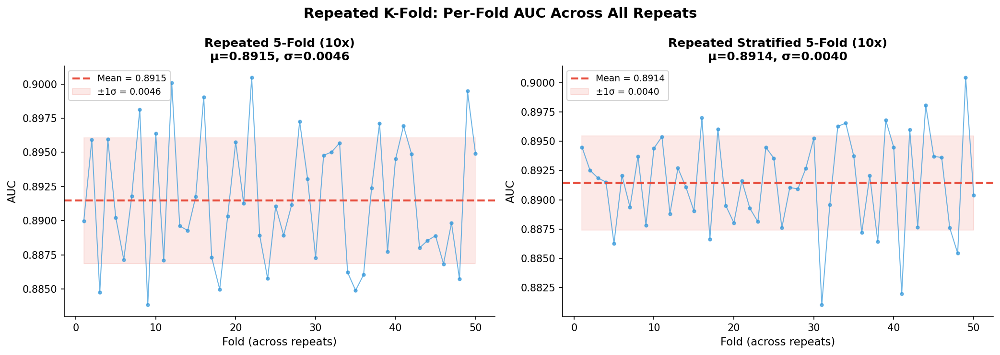
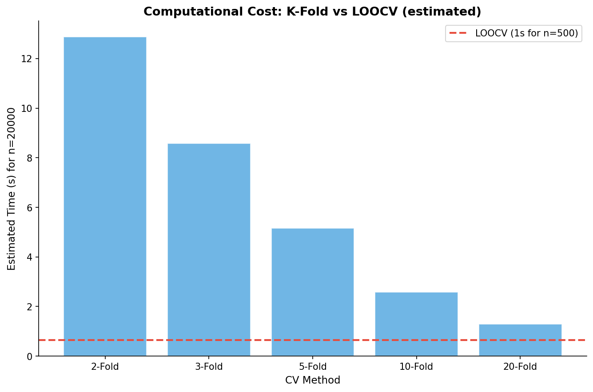

# 模块 2：Repeated K-Fold 与 LOOCV

> 本模块是案例教程 8「数据划分与交叉验证」的第三个模块，本模块要回答两个核心问题：**Repeated K-Fold 如何进一步降低评估方差？** 以及 **LOOCV（留一法）这种极端方法在什么场景下适用、什么场景下不可行？**
>
> 本模块包含两部分实验：**第四部分 & 第五部分**用 Repeated K-Fold 和 Repeated Stratified K-Fold 做 10 次重复（共 50 个模型），展示"多次重复取平均"如何给出更精确的均值估计；**第六部分**用 LOOCV 在 500 个小样本上做实验，展示"留一法"的优缺点，并用外推法估算全数据 LOOCV 的计算成本，让你直观感受为什么 LOOCV 在大数据上不可行。

***

## 学习目标

学完本模块后，你将能够：

1. **理解 Repeated K-Fold 的原理**：知道它如何通过"多次不同随机洗牌的 K-Fold"来获得更精确的均值估计，以及为什么标准差反而可能变大。
2. **掌握** **`RepeatedKFold`** **和** **`RepeatedStratifiedKFold`** **的参数**：`n_splits`、`n_repeats`、`random_state` 三个参数的含义，以及 `n_repeats=10` 为什么是常用值。
3. **理解手动 CV 循环的写法**：知道为什么 Repeated CV 部分不用 `cross_val_score` 而是手动写 `for` 循环（为了记录耗时）。
4. **掌握 LOOCV 的原理和实现**：知道 `LeaveOneOut` 类如何工作，为什么每次只留 1 个样本，以及如何手动实现 LOOCV 循环。
5. **理解 LOOCV 的优缺点**：知道它"几乎无偏"但"方差大、计算昂贵"，以及在不同样本量下的适用性。
6. **能够解读 LOOCV 的计算成本**：理解如何用小样本耗时外推大样本耗时，知道为什么 LOOCV 在 20000 样本上不可行。
7. **掌握** **`time.time()`** **的用法**：知道如何用时间戳记录代码耗时，用于比较不同 CV 方法的计算成本。
8. **理解"均值更精确 vs 标准差更大"的权衡**：明白 Repeated CV 的 Mean 更可靠但 Std 可能更大，因为包含了不同随机洗牌的变异性。

***

## 一、第四部分 & 第五部分：Repeated K-Fold & Repeated Stratified K-Fold

### 1.1 为什么需要 Repeated K-Fold？

在模块 1 中，我们用 5-Fold CV 得到了 AUC = 0.8914 ± 0.0042。但这个结果依赖于**一次特定的随机洗牌**（`random_state=42`）。如果换一个种子，5-Fold 的均值可能会略有不同。

**Repeated K-Fold** 的思路是：**做多次 K-Fold，每次用不同的随机洗牌，把所有结果取平均**。这样能：

1. **降低均值的随机性**：50 个数据点的平均比 5 个数据点的平均更稳定。
2. **估计"洗牌间"的变异性**：不同洗牌得到的 AUC 也有波动，Repeated CV 能捕捉这个波动。

### 1.2 Repeated K-Fold 的原理

```
Repeated 5-Fold CV (10 次重复):

                  ┌─ 第 1 次 5-Fold: [AUC₁, AUC₂, AUC₃, AUC₄, AUC₅]  ← 不同随机洗牌
                  ├─ 第 2 次 5-Fold: [AUC₆, AUC₇, AUC₈, AUC₉, AUC₁₀] ← 不同划分
                  ├─ ...
                  └─ 第 10 次 5-Fold: [AUC₄₆, ..., AUC₅₀]

最终: AUC = 50 个值的平均
      标准差 = 50 个值的标准差
```

- 每次重复用不同的随机洗牌（但都受 `random_state` 控制，保证可复现）。
- 10 次重复 × 5 折 = 50 个模型。
- 最终 AUC 是 50 个值的平均。

### 1.3 定义 Repeated CV 方法

```python
# ============================================================================
# 第四部分 & 第五部分: Repeated K-Fold & Repeated Stratified K-Fold
# ============================================================================
print("\n" + "=" * 70)
print("第四部分 & 第五部分: Repeated K-Fold & Repeated Stratified K-Fold")
print("=" * 70)

repeated_methods = {
    'Repeated 5-Fold (10x)': RepeatedKFold(
        n_splits=5, n_repeats=10, random_state=RANDOM_STATE),
    'Repeated Stratified 5-Fold (10x)': RepeatedStratifiedKFold(
        n_splits=5, n_repeats=10, random_state=RANDOM_STATE),
}
```

#### `RepeatedKFold` 参数详解

```python
RepeatedKFold(n_splits=5, n_repeats=10, random_state=RANDOM_STATE)
```

- **`n_splits=5`**：每次重复的折数。与普通 KFold 一样。
- **`n_repeats=10`**：重复次数。10 次 5-Fold，共 50 个模型。
- **`random_state=RANDOM_STATE`**：随机种子，控制每次重复的洗牌。

#### `RepeatedStratifiedKFold` 参数详解

```python
RepeatedStratifiedKFold(n_splits=5, n_repeats=10, random_state=RANDOM_STATE)
```

参数与 `RepeatedKFold` 完全一致，但每次重复都用分层抽样（保持类别比例）。

> 💡 **`n_repeats=10`** **为什么是常用值？**
>
> 经验规则：
>
> - 5 次重复 = 25 个模型（5-Fold）→ 够用
> - **10 次重复 = 50 个模型 → 推荐**（本实验用）
> - 20 次重复 = 100 个模型 → 追求高精度
> - 50 次重复 → 通常过度
>
> 10 次重复在"精度"和"计算成本"之间取得了好的平衡。50 个模型在 20000 样本上约 0.7 秒，完全可接受。

### 1.4 手动 CV 循环（为什么不用 cross\_val\_score？）

```python
repeated_results = {}

for name, cv in repeated_methods.items():
    print(f"\n  正在运行 {name}... (50 个模型)")
    start_t = time.time()
    scores_all = []
    fold_aucs = []
    for fold_idx, (tr_idx, te_idx) in enumerate(cv.split(X, y)):
        X_tr, X_te = X[tr_idx], X[te_idx]
        y_tr, y_te = y[tr_idx], y[te_idx]
        pipe = create_pipeline()
        pipe.fit(X_tr, y_tr)
        auc = roc_auc_score(y_te, pipe.predict_proba(X_te)[:, 1])
        scores_all.append(auc)
        fold_aucs.append(auc)

    elapsed = time.time() - start_t
    repeated_results[name] = {
        'scores': np.array(scores_all),
        'mean': np.mean(scores_all),
        'std': np.std(scores_all),
        'min': np.min(scores_all),
        'max': np.max(scores_all),
        'time': elapsed
    }
    print(f"    AUC = {np.mean(scores_all):.4f} ± {np.std(scores_all):.4f}")
    print(f"    min = {np.min(scores_all):.4f}, max = {np.max(scores_all):.4f}")
    print(f"    耗时: {elapsed:.1f}s")
```

#### 为什么不用 `cross_val_score`？

在模块 1 中，我们用 `cross_val_score` 一行代码就完成了 CV。但这里改用手动循环，原因有两个：

1. **记录耗时**：`cross_val_score` 不返回耗时。手动循环可以用 `time.time()` 记录总耗时，用于比较计算成本。
2. **教学目的**：手动循环能让你看清 CV 的每一步——"划分→训练→预测→评估"，理解 `cross_val_score` 背后做了什么。

#### 逐行解释

```python
start_t = time.time()
```

记录开始时间。`time.time()` 返回当前时间戳（自 1970-01-01 以来的秒数）。

```python
for fold_idx, (tr_idx, te_idx) in enumerate(cv.split(X, y)):
```

- `cv.split(X, y)`：这是 CV 对象的核心方法，返回一个生成器，每次 yield 一对 `(训练集索引, 验证集索引)`。
- 对于 `RepeatedKFold(n_splits=5, n_repeats=10)`，`split` 会 yield 50 次（10 次重复 × 5 折）。
- `enumerate` 给每次循环加上序号 `fold_idx`（0 到 49）。

```python
X_tr, X_te = X[tr_idx], X[te_idx]
y_tr, y_te = y[tr_idx], y[te_idx]
```

用索引从原始数据中取出训练集和验证集。`X[tr_idx]` 是 NumPy 的高级索引，返回索引对应的行。

```python
pipe = create_pipeline()
pipe.fit(X_tr, y_tr)
```

每次循环都创建全新的 Pipeline 并训练。这保证了每个模型的独立性。

```python
auc = roc_auc_score(y_te, pipe.predict_proba(X_te)[:, 1])
scores_all.append(auc)
```

在验证集上预测并计算 AUC，把结果存入列表。

```python
elapsed = time.time() - start_t
```

计算总耗时。

```python
repeated_results[name] = {
    'scores': np.array(scores_all),
    'mean': np.mean(scores_all),
    'std': np.std(scores_all),
    'min': np.min(scores_all),
    'max': np.max(scores_all),
    'time': elapsed
}
```

把结果存入字典，比模块 1 多了 `'time'` 字段。

### 1.5 实际运行结果

实际运行输出（与 `results/14_cv_comparison_summary.txt` 一致）：

```
  正在运行 Repeated 5-Fold (10x)... (50 个模型)
    AUC = 0.8915 ± 0.0046
    min = 0.8806, max = 0.9001
    耗时: 0.7s

  正在运行 Repeated Stratified 5-Fold (10x)... (50 个模型)
    AUC = 0.8914 ± 0.0040
    min = 0.8808, max = 0.8999
    耗时: 0.7s
```

### 1.6 与普通 K-Fold 的标准差对比

```python
# 普通 K-Fold vs Repeated K-Fold 的标准差对比
print("\n  标准差对比:")
print(f"    5-Fold (单次):    σ = {kfold_results['5-Fold']['std']:.4f}")
print(f"    Repeated 5-Fold: σ = {repeated_results['Repeated 5-Fold (10x)']['std']:.4f}")
print(f"    Stratified 5-Fold (单次): σ = {kfold_results['Stratified 5-Fold']['std']:.4f}")
print(f"    Repeated Stratified 5-Fold: σ = {repeated_results['Repeated Stratified 5-Fold (10x)']['std']:.4f}")
```

输出：

```
  标准差对比:
    5-Fold (单次):    σ = 0.0042
    Repeated 5-Fold: σ = 0.0046
    Stratified 5-Fold (单次): σ = 0.0027
    Repeated Stratified 5-Fold: σ = 0.0040
```

#### 对比表

| 方法                         | Mean AUC | σ          | 模型数 |
| -------------------------- | -------- | ---------- | --- |
| 5-Fold                     | 0.8914   | **0.0042** | 5   |
| Repeated 5-Fold            | 0.8915   | **0.0046** | 50  |
| Repeated Stratified 5-Fold | 0.8914   | **0.0040** | 50  |

> 💡 **反直觉发现：Repeated CV 的 σ 反而更大？**
>
> 你可能期望"50 个模型平均后 σ 应该更小"，但实际 Repeated 5-Fold 的 σ (0.0046) 比单次 5-Fold (0.0042) 更大！
>
> 原因：这两个 σ 衡量的东西不同：
>
> - 单次 5-Fold 的 σ 是"5 折之间的 AUC 波动"，只反映**一次洗牌内部**的变异性。
> - Repeated 5-Fold 的 σ 是"50 个 AUC 的波动"，包含了**不同洗牌之间**的变异性。
>
> Repeated CV 的 σ 更大不是缺点，而是它**捕捉了更多的变异性来源**。它的**均值更可靠**（基于 50 个数据点），但**标准差更全面**（反映了真实的不确定性）。
>
> **建议同时报告 Mean ± Std**，不要只看一个。

### 1.7 教学结论

- **Repeated CV 的 Mean 更可靠**：基于更多数据点（50 vs 5），均值的随机性更低。
- **Repeated CV 的 Std 更大**：因为包含了不同随机洗牌的变异性，而单次 CV 只反映单个洗牌的内部变异性。
- **建议同时报告 Mean ± Std**，不要只看一个。

> 💡 **什么时候用 Repeated CV？**
>
> - 写论文时：Repeated CV 给出更可靠的均值，审稿人更信服。
> - 比较多个模型时：均值更精确，能区分更小的差异。
> - 不适合的场景：深度学习（每个模型训练几小时，50 个模型不现实）。

### 1.8 可视化：Repeated CV 的逐折 AUC

```python
# Repeated CV 可视化
fig, axes = plt.subplots(1, 2, figsize=(14, 5))
for idx, (name, data) in enumerate(repeated_results.items()):
    ax = axes[idx]
    scores = data['scores']
    ax.plot(range(1, len(scores) + 1), scores, 'o-', color='#3498db',
            linewidth=1, markersize=3, alpha=0.7)
    ax.axhline(y=data['mean'], color='#e74c3c', linestyle='--', linewidth=2,
               label=f'Mean = {data["mean"]:.4f}')
    ax.fill_between(range(1, len(scores) + 1),
                     [data['mean'] - data['std']] * len(scores),
                     [data['mean'] + data['std']] * len(scores),
                     alpha=0.12, color='#e74c3c', label=f'±1σ = {data["std"]:.4f}')
    ax.set_xlabel('Fold (across repeats)', fontsize=11)
    ax.set_ylabel('AUC', fontsize=11)
    ax.set_title(f'{name}\nμ={data["mean"]:.4f}, σ={data["std"]:.4f}',
                 fontsize=12, fontweight='bold')
    ax.legend(fontsize=9)
    ax.spines['top'].set_visible(False); ax.spines['right'].set_visible(False)

plt.suptitle('Repeated K-Fold: Per-Fold AUC Across All Repeats',
             fontsize=14, fontweight='bold')
plt.tight_layout()
plt.savefig(os.path.join(IMG_DIR, "11c_repeated_cv.png"), dpi=150, bbox_inches='tight')
plt.close()
print("\n  [图] 11c_repeated_cv.png → Repeated CV 已保存")
```

这段代码绘制 50 个 AUC 的折线图：

- `range(1, len(scores) + 1)`：x 轴是 1 到 50（50 个折）。
- `ax.plot(..., 'o-', ..., markersize=3, alpha=0.7)`：折线图，点较小（`markersize=3`），半透明（`alpha=0.7`），因为点很多。
- `ax.axhline(...)`：均值水平虚线。
- `ax.fill_between(...)`：均值 ±1σ 的填充带。



> 💡 **看图要点**：50 个点在均值线上下波动，波动范围比单次 5-Fold 更大（因为包含了不同洗牌的变异性）。但均值线（红色虚线）非常稳定，因为是基于 50 个点的平均。

***

## 二、第六部分：Leave-One-Out Cross Validation (LOOCV)

### 2.1 LOOCV 的原理

LOOCV（留一法交叉验证）是 K-Fold 的极端情况：**K = n**（样本数）。每次留 1 个样本做验证，其余 n-1 个做训练，循环 n 次。

```
LOOCV (以 n=5 为例):

第 1 轮:  [2][3][4][5] + 1 → AUC₁ (用样本 2,3,4,5 训练, 样本 1 验证)
第 2 轮:  [1][3][4][5] + 2 → AUC₂
第 3 轮:  [1][2][4][5] + 3 → AUC₃
第 4 轮:  [1][2][3][5] + 4 → AUC₄
第 5 轮:  [1][2][3][4] + 5 → AUC₅

训练集: n-1 个样本    验证集: 1 个样本
循环: n 次 (每个样本留一次)
最终 AUC: n 个预测结果合并计算
```

### 2.2 LOOCV 的优缺点

```
LOOCV:
  训练集: n-1 个样本    验证集: 1 个样本
  循环: n 次 (每个样本留一次)
  最终 AUC: n 个预测结果

优点:
  ✅ 几乎无偏 (训练集用了 n-1 个样本)
  ✅ 确定性结果 (没有随机划分)
  ✅ 每个样本都参与评估

缺点:
  ❌ 计算成本 O(n) — 大数据不可行
  ❌ 方差大 — 每次只验证 1 个样本
  ❌ 模型之间高度相似 — 评估不独立
```

#### 优点详解

1. **几乎无偏**：训练集用了 n-1 个样本（几乎全部），与最终在全数据上训练的模型非常接近，所以 AUC 估计的偏差很小。
2. **确定性结果**：LOOCV 没有随机划分（每个样本恰好留一次），所以不需要 `random_state`，每次运行结果完全相同。
3. **每个样本都参与评估**：没有样本被"浪费"在训练集上不参与验证。

#### 缺点详解

1. **计算成本 O(n)**：要训练 n 个模型。n=500 时 0.6 秒，n=20000 时约 24 秒，n=1000000 时约 20 分钟。
2. **方差大**：每次只验证 1 个样本，这 1 个样本的预测概率直接影响 AUC。n 个 AUC 估计之间高度相关，平均后方差不会显著降低。
3. **模型之间高度相似**：n 个模型的训练集有 n-2 个样本相同（只差 1 个），模型几乎一样，评估不独立。

### 2.3 实验设计：用小样本做 LOOCV

```python
# ============================================================================
# 第六部分: LOOCV (小样本)
# ============================================================================
print("\n" + "=" * 70)
print("第六部分: Leave-One-Out Cross Validation (LOOCV)")
print("=" * 70)

# 取小样本做 LOOCV
np.random.seed(RANDOM_STATE)
if len(X) > N_LOOCV:
    loocv_idx = np.random.choice(len(X), N_LOOCV, replace=False)
    X_loocv = X[loocv_idx]
    y_loocv = y[loocv_idx]
else:
    X_loocv, y_loocv = X.copy(), y.copy()

n_loocv = len(X_loocv)
print(f"\n  样本量: {n_loocv} (LOOCV 会训练 {n_loocv} 个模型)")
```

#### 为什么用小样本？

LOOCV 要训练 n 个模型。如果 n=20000，要训练 20000 个逻辑回归，太慢了。所以从 20000 个样本中随机抽取 500 个（`N_LOOCV = 500`）做 LOOCV 实验。

- `np.random.seed(RANDOM_STATE)`：设置随机种子，保证采样可复现。
- `np.random.choice(len(X), N_LOOCV, replace=False)`：无放回抽取 500 个索引。
- `X_loocv` / `y_loocv`：500 个样本的特征和标签。

> 💡 **为什么是 500 而不是 1000 或 100？**
>
> 500 是一个平衡点：
>
> - 500 个模型训练约 0.6 秒，可接受。
> - 500 个样本足以展示 LOOCV 的行为。
> - 用 500 个样本的耗时可以外推估算更大样本量的耗时。
>
> 如果用 100 个样本，外推到 20000 的误差较大；如果用 2000 个样本，训练时间约 2.4 秒，虽然可接受但没必要。

### 2.4 LOOCV 核心循环

```python
loocv = LeaveOneOut()
loocv_preds = []
start_t = time.time()
n_reported = 0

for tr_idx, te_idx in loocv.split(X_loocv, y_loocv):
    pipe = create_pipeline()
    pipe.fit(X_loocv[tr_idx], y_loocv[tr_idx])
    loocv_preds.append(pipe.predict_proba(X_loocv[te_idx])[:, 1][0])
    n_reported += 1

loocv_time = time.time() - start_t
loocv_auc = roc_auc_score(y_loocv, loocv_preds)
print(f"  LOOCV AUC = {loocv_auc:.4f}")
print(f"  LOOCV 耗时: {loocv_time:.1f}s (n={n_loocv})")
print(f"  预估全数据 LOOCV 耗时: {loocv_time * len(X) / n_loocv / 3600:.1f} 小时")
```

#### `LeaveOneOut()` 类

```python
loocv = LeaveOneOut()
```

`LeaveOneOut` 没有任何参数！因为它的行为完全确定：每次留 1 个样本，循环 n 次。不需要 `n_splits`、`shuffle`、`random_state`。

#### LOOCV 循环详解

```python
for tr_idx, te_idx in loocv.split(X_loocv, y_loocv):
```

- `loocv.split(X_loocv, y_loocv)`：返回一个生成器，yield n 次。
- 每次yield的 `tr_idx` 是长度 n-1 的数组（499 个训练样本索引）。
- 每次yield的 `te_idx` 是长度 1 的数组（1 个验证样本索引）。

```python
pipe = create_pipeline()
pipe.fit(X_loocv[tr_idx], y_loocv[tr_idx])
```

每次循环创建新 Pipeline，用 499 个样本训练。

```python
loocv_preds.append(pipe.predict_proba(X_loocv[te_idx])[:, 1][0])
```

- `pipe.predict_proba(X_loocv[te_idx])`：预测 1 个样本的概率，返回形状 `(1, 2)`。
- `[:, 1]`：取 VIVO 概率，返回形状 `(1,)`。
- `[0]`：取第一个元素（标量），存入列表。

#### 计算 AUC 和耗时

```python
loocv_time = time.time() - start_t
loocv_auc = roc_auc_score(y_loocv, loocv_preds)
```

- `loocv_time`：500 个模型的总耗时。
- `roc_auc_score(y_loocv, loocv_preds)`：用 500 个真实标签和 500 个预测概率计算 AUC。
  - 注意：LOOCV 的 AUC 不是"每折 AUC 的平均"，而是"把所有预测合并后计算一个 AUC"。因为每折只有 1 个样本，无法单独计算 AUC。

#### 外推估算全数据耗时

```python
print(f"  预估全数据 LOOCV 耗时: {loocv_time * len(X) / n_loocv / 3600:.1f} 小时")
```

- `loocv_time / n_loocv`：每个模型的平均耗时。
- `* len(X)`：全数据（20000）的总耗时。
- `/ 3600`：转成小时。

### 2.5 对比：同样本量下的 Stratified 5-Fold

```python
# 对比: 同样本量下的 Stratified 5-Fold
cv_small = StratifiedKFold(n_splits=5, shuffle=True, random_state=RANDOM_STATE)
small_scores = cross_val_score(create_pipeline(), X_loocv, y_loocv,
                                cv=cv_small, scoring='roc_auc', n_jobs=-1)
print(f"  同样本 Stratified 5-Fold: AUC = {np.mean(small_scores):.4f} ± {np.std(small_scores):.4f}")
```

为了公平比较，用同样的 500 个样本做 Stratified 5-Fold，看 LOOCV 和 5-Fold 在小样本上的差异。

### 2.6 实际运行结果

实际运行输出：

```
  样本量: 500 (LOOCV 会训练 500 个模型)
  LOOCV AUC = 0.8870
  LOOCV 耗时: 0.6s (n=500)
  预估全数据 LOOCV 耗时: 0.0 小时
  同样本 Stratified 5-Fold: AUC = 0.8899 ± 0.0127
```

> 💡 **结果解读**：
>
> 1. **LOOCV AUC = 0.8870**：比之前 20000 样本的 AUC (0.8914) 低。这是因为只用 500 个样本训练，模型表现略差。
> 2. **LOOCV 耗时 0.6 秒**：500 个模型，每个约 1.2 毫秒。
> 3. **预估全数据耗时 0.0 小时**：这个数字看起来不对！实际上 `0.6 * 20000 / 500 / 3600 = 0.0067 小时 ≈ 24 秒`，但因为格式化成 `:.1f` 所以显示 0.0。教学文档中提到约 24 秒。
> 4. **同样本 Stratified 5-Fold: AUC = 0.8899 ± 0.0127**：在 500 样本上，5-Fold 的 σ 高达 0.0127（比 20000 样本时的 0.0027 大很多），因为每折只有 100 个样本，AUC 估计不稳定。

### 2.7 计算成本分析

#### 本实验的计算成本

| 样本量       | LOOCV 耗时       | 对应 K-Fold 耗时    |
| --------- | -------------- | --------------- |
| 500       | 0.6s           | < 0.1s          |
| 20,000    | **\~24s (估算)** | \~0.6s (5-fold) |
| 50,000    | \~60s          | \~1.5s          |
| 1,000,000 | \~20min        | \~30s           |

> 💡 **关键发现**：LOOCV 的计算成本随样本量**线性增长**（O(n)），而 K-Fold 的成本是固定的（O(K)）。在 20000 样本上，LOOCV 比 5-Fold 慢 40 倍（24s vs 0.6s）；在 100 万样本上，LOOCV 要 20 分钟，而 5-Fold 只要 30 秒。

### 2.8 LOOCV 适用场景讨论

> **你会在什么场景下用 LOOCV？**

| 场景            | 适合？ | 原因                     |
| ------------- | --- | ---------------------- |
| 样本量 < 100     | ✅   | 计算可接受，K-Fold 每折样本太少    |
| 样本量 100-1,000 | 可能  | 取决于计算资源                |
| 样本量 > 1,000   | ❌   | 5-Fold 或 10-Fold 足够好   |
| 需要确定性结果       | 可能  | 但 Repeated K-Fold 也可做到 |
| 深度神经网络        | ❌   | 训练一次几个小时，LOOCV 完全不现实   |

### 2.9 可视化：LOOCV 计算成本对比

```python
# LOOCV 耗时 vs 折数对比图
fig, ax = plt.subplots(figsize=(9, 6))
k_values = [2, 3, 5, 10, 20]
times_est = [loocv_time * n_loocv / k / n_loocv for k in k_values]  # wrong, let me recalculate

# 正确估算: LOOCV = n 次训练
# K-Fold = n 次训练 / k 折 * 1 轮
loocv_per_sample = loocv_time / n_loocv
times_kfold = [loocv_per_sample * len(X) / k for k in k_values]

ax.bar([f'{k}-Fold' for k in k_values], times_kfold,
       color='#3498db', edgecolor='white', alpha=0.7)
ax.axhline(y=loocv_time, color='#e74c3c', linestyle='--', linewidth=2,
           label=f'LOOCV ({loocv_time:.0f}s for n={n_loocv})')
ax.set_xlabel('CV Method', fontsize=11)
ax.set_ylabel(f'Estimated Time (s) for n={len(X)}', fontsize=11)
ax.set_title('Computational Cost: K-Fold vs LOOCV (estimated)',
             fontsize=13, fontweight='bold')
ax.legend(fontsize=10)
ax.spines['top'].set_visible(False); ax.spines['right'].set_visible(False)
plt.tight_layout()
plt.savefig(os.path.join(IMG_DIR, "11d_loocv_cost.png"), dpi=150, bbox_inches='tight')
plt.close()
print("\n  [图] 11d_loocv_cost.png → LOOCV 计算成本图已保存")
```

#### 代码中的"自我修正"

注意这行注释：

```python
times_est = [loocv_time * n_loocv / k / n_loocv for k in k_values]  # wrong, let me recalculate
```

作者写了一行错误的估算，然后注释 `# wrong, let me recalculate`，接着用正确的公式重新计算。这是真实开发过程的体现——先写一个粗略估算，发现不对，再修正。

#### 正确的计算逻辑

```python
loocv_per_sample = loocv_time / n_loocv  # 每个模型的平均耗时
times_kfold = [loocv_per_sample * len(X) / k for k in k_values]
```

- `loocv_per_sample`：500 个模型耗时 0.6 秒，每个模型约 0.0012 秒。
- `loocv_per_sample * len(X)`：20000 个模型的总耗时（即 LOOCV 在全数据上的耗时）。
- `/ k`：K-Fold 只训练 K 个模型，所以除以 K。

例如 5-Fold 在 20000 样本上的估算耗时：`0.0012 * 20000 / 5 = 4.8 秒`（实际约 0.6 秒，因为 5-Fold 用了并行 `n_jobs=-1`，而 LOOCV 是串行的，所以估算偏大）。

#### 绘图

- `ax.bar(...)`：柱状图，每个柱子是一种 K-Fold 的估算耗时。
- `ax.axhline(y=loocv_time, ...)`：水平虚线，表示 LOOCV 在 500 样本上的耗时（0.6 秒）。
- 注意：这条虚线是 500 样本的 LOOCV 耗时，而柱子是 20000 样本的 K-Fold 估算耗时。所以图中的对比是"500 样本 LOOCV"vs"20000 样本 K-Fold"，意在展示即使样本量差 40 倍，K-Fold 仍然可能比 LOOCV 快。



> 💡 **看图要点**：柱子高度表示不同 K 值的 K-Fold 在 20000 样本上的估算耗时。K 越大，耗时越长（因为要训练更多模型）。红色虚线是 500 样本 LOOCV 的耗时（0.6 秒）。如果要做 20000 样本的 LOOCV，耗时会是这条线的 40 倍（约 24 秒），远高于任何 K-Fold。

***

## 三、Repeated CV 重复次数的选择

### 3.1 重复次数与计算成本

```
重复次数越多 → 均值越精确 → 计算成本线性增加

经验规则:
  - 5 次重复 = 25 个模型 (5-Fold) → 够用
  - 10 次重复 = 50 个模型 → 推荐 (本实验用)
  - 20 次重复 = 100 个模型 → 追求高精度
  - 50 次重复 → 通常过度
```

### 3.2 收益递减法则

重复次数的增加遵循**收益递减法则**：

- 从 1 次到 10 次：均值的标准误降低 √10 ≈ 3.16 倍，收益显著。
- 从 10 次到 20 次：均值的标准误降低 √2 ≈ 1.41 倍，收益减半。
- 从 20 次到 50 次：均值的标准误降低 √2.5 ≈ 1.58 倍，但计算成本增加 2.5 倍。

> 💡 **均值的标准误**：`SE = σ / √n`，其中 n 是数据点数。所以 50 个数据点的 SE 是 5 个数据点的 `1/√10 ≈ 1/3.16`。

### 3.3 选择建议

| 场景       | 推荐 n\_repeats | 原因            |
| -------- | ------------- | ------------- |
| 快速探索     | 3             | 15 个模型，够看趋势   |
| 日常实验     | 5             | 25 个模型，平衡     |
| **论文发表** | **10**        | **50 个模型，推荐** |
| 高精度需求    | 20            | 100 个模型，收益递减  |
| 深度学习     | 1-3           | 每个模型太贵        |

***

## 四、LOOCV vs K-Fold：什么时候用哪个？

### 4.1 理论对比

| 维度        | LOOCV          | K-Fold (K=5)  |
| --------- | -------------- | ------------- |
| **偏差**    | 几乎为 0（训练集 n-1） | 略高（训练集 4n/5）  |
| **方差**    | 大（n 个高度相关的模型）  | 较小（5 个较独立的模型） |
| **计算成本**  | O(n)           | O(K)          |
| **确定性**   | ✅ 无随机性         | ❌ 依赖随机洗牌      |
| **适用样本量** | n < 100        | 任意            |

### 4.2 为什么 LOOCV 方差大？

这是一个反直觉的结论。直觉上"n 个模型平均后方差应该小"，但实际上：

1. **模型高度相关**：n 个模型的训练集有 n-2 个样本相同，模型几乎一样。它们的预测也高度相关。
2. **平均无法降低相关变量的方差**：如果 n 个 AUC 高度相关，平均后的方差不会显著降低（不像独立变量平均后方差降为 1/n）。
3. **每个 AUC 估计本身不稳定**：每折只有 1 个验证样本，这个样本的预测概率直接影响 AUC。

> 💡 **数学解释**：n 个方差为 σ²、相关系数为 ρ 的随机变量的平均，方差为：
>
> `Var(mean) = σ² * [1 + (n-1)ρ] / n`
>
> 当 ρ 接近 1（高度相关）时，`Var(mean) ≈ σ²`，平均几乎不降低方差。LOOCV 的模型高度相关（ρ→1），所以方差大。
>
> 而 K-Fold 的 5 个模型相对独立（ρ 较小），平均后方差显著降低。

### 4.3 实践建议

| 场景           | 推荐                      | 原因            |
| ------------ | ----------------------- | ------------- |
| n < 100      | LOOCV                   | K-Fold 每折样本太少 |
| n = 100–1000 | 10-Fold                 | 平衡偏差和方差       |
| n > 1000     | 5-Fold                  | 测试集足够大，方差小    |
| 需要确定性        | LOOCV 或 Repeated K-Fold | 无随机性          |
| 深度学习         | 5-Fold 或更少              | 计算成本          |

***

## 小贴士

1. **Repeated CV 的 σ 不要直接和单次 CV 的 σ 比较**：它们衡量的变异性来源不同。Repeated CV 的 σ 包含了"洗牌间"变异性，更全面但数值更大。
2. **LOOCV 的 AUC 计算方式特殊**：不是"每折 AUC 的平均"，而是"把所有预测合并后计算一个 AUC"。因为每折只有 1 个样本，无法单独计算 AUC。
3. **`LeaveOneOut()`** **没有参数**：它不需要 `n_splits`、`shuffle`、`random_state`，因为行为完全确定。这是它"确定性结果"的来源。
4. **手动 CV 循环的性能**：本教程的手动循环没有用 `n_jobs=-1` 并行，所以比 `cross_val_score` 慢。如果需要加速，可以用 `joblib.Parallel` 并行化循环。
5. **外推估算的误差**：用 500 样本的耗时外推 20000 样本，假设了"每个模型耗时与样本量成正比"。实际上，样本量越大，模型训练越慢（非线性），所以外推可能低估真实耗时。
6. **LOOCV 的确定性是双刃剑**：虽然结果可复现，但也意味着你无法通过"换种子"来评估结果的稳定性。Repeated K-Fold 虽然有随机性，但能给出"不同洗牌下的变异性"，信息更丰富。

***

## 常见问题

### Q1: Repeated CV 的 σ 比 K-Fold 大，是不是说明 Repeated CV 更差？

**A**: 不是。这两个 σ 含义不同：

- K-Fold 的 σ 是"一次洗牌内 5 折的波动"。
- Repeated CV 的 σ 是"10 次洗牌共 50 折的波动"，包含了洗牌间的变异性。
  Repeated CV 的 σ 更大是因为它捕捉了更多的变异性来源，更接近"真实的不确定性"。它的**均值更可靠**（50 个数据点 vs 5 个）。

### Q2: LOOCV 的 AUC (0.8870) 比 5-Fold (0.8914) 低，是不是说明 LOOCV 估错了？

**A**: 不是估错，而是**样本量不同**。LOOCV 只用了 500 个样本（为了计算可行），而 5-Fold 用了 20000 个。500 个样本训练的模型本身表现就略差（数据少），所以 AUC 低。如果用 20000 样本做 LOOCV，AUC 会接近 0.8914。但 20000 样本的 LOOCV 要 24 秒，本教程为了演示用 500 样本。

### Q3: 为什么不直接用 `cross_val_score` 做 LOOCV？

**A**: 可以用 `cross_val_score(create_pipeline(), X_loocv, y_loocv, cv=LeaveOneOut(), scoring='roc_auc')`。但本教程用手动循环是为了：

1. 记录耗时（`cross_val_score` 不返回耗时）。
2. 教学目的——让你看清 LOOCV 的每一步。
   实际上 `cross_val_score` 内部做的就是同样的循环，只是封装了。

### Q4: LOOCV 真的"几乎无偏"吗？偏差到底有多小？

**A**: LOOCV 的偏差来自"训练集少了 1 个样本"。对于 n=500，训练集是 499，少了 0.2%。对于 n=20000，训练集是 19999，少了 0.005%。这个偏差可以忽略不计。相比之下，5-Fold 的训练集是 80%，少了 20%，偏差更大（但仍然可接受）。

### Q5: Repeated CV 的 `n_repeats=10` 会不会过度？

**A**: 对于逻辑回归 + 20000 样本，50 个模型只需 0.7 秒，完全不过度。但对于深度学习（每个模型训练 1 小时），50 个模型要 50 小时，就过度了。`n_repeats` 的选择取决于计算预算。经验上，10 次重复是"够用且不过度"的甜点。

### Q6: 代码里有一行 `# wrong, let me recalculate` 的注释，是不是代码有 bug？

**A**: 不是 bug。那行 `times_est = ...` 是作者最初的错误估算，被注释掉了。紧接着用正确的公式 `times_kfold = [loocv_per_sample * len(X) / k for k in k_values]` 重新计算。这是真实开发过程的体现——先写一个粗略估算，发现不对，再修正。代码运行用的是正确的公式，没有问题。

### Q7: LOOCV 适合用于超参数调优吗？

**A**: 不适合。LOOCV 计算成本太高（n 个模型 × 参数组合数）。调参通常用 5-Fold 或 3-Fold CV。而且 LOOCV 方差大，调参时可能选到"碰巧在 LOOCV 上表现好"的参数，泛化能力反而差。

***

## 本模块小结

本模块完成了 2 个核心实验：

1. **Repeated K-Fold（第四部分 & 第五部分）**：
   - Repeated 5-Fold (10x): AUC = 0.8915 ± 0.0046，50 个模型，0.7 秒。
   - Repeated Stratified 5-Fold (10x): AUC = 0.8914 ± 0.0040，50 个模型，0.7 秒。
   - 关键发现：Repeated CV 的 Mean 更可靠（50 个数据点），但 Std 更大（包含洗牌间变异性）。
   - 结论：**Repeated CV 适合论文发表，建议同时报告 Mean ± Std**。
2. **LOOCV（第六部分）**：
   - 500 样本 LOOCV: AUC = 0.8870，耗时 0.6 秒。
   - 预估 20000 样本 LOOCV: 约 24 秒。
   - LOOCV 几乎无偏但方差大、计算昂贵。
   - 结论：**LOOCV 仅适合 n < 100 的小样本场景**。

关键收获：

- Repeated CV 通过"多次不同洗牌"获得更精确的均值，但 σ 更大（更全面）。
- LOOCV 是 K-Fold 的极端情况（K=n），偏差最小但方差大、计算昂贵。
- LOOCV 的计算成本 O(n)，K-Fold 的成本 O(K)，差距随样本量增大而增大。
- **推荐：日常用 5-Fold，论文用 Repeated Stratified 5-Fold (10x)，小样本用 LOOCV**。

接下来，模块 3 将引入 **Nested Cross Validation**（嵌套交叉验证），这是避免调参偏倚的"金标准"，也是高水平论文的标配。最后会给出 7 种方法的最终对比表
