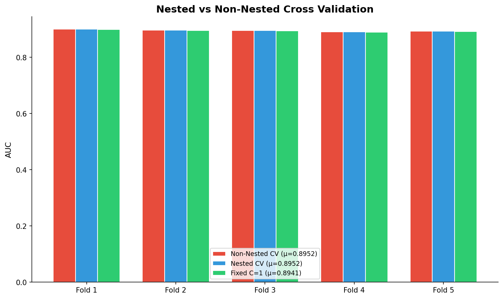
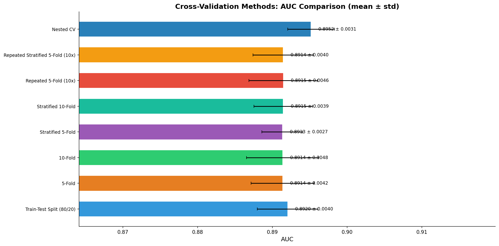

# 模块 3：Nested CV 与最终比较

> 本模块是案例教程 8「数据划分与交叉验证」的最后一个模块，本模块要回答两个核心问题：**什么是 Nested Cross Validation（嵌套交叉验证）？为什么它是高水平论文的标配？** 以及 **7 种评估方法中，哪种最可信？**
>
> 本模块包含三部分内容：**第七部分**实现 Nested CV，对比"不嵌套 CV（有调参偏倚）"、"Nested CV（无偏估计）"和"固定参数 CV（无调参基线）"三种方案；**最终比较表**汇总 7 种方法的 AUC 和标准差，给出可信度排序；**汇总可视化**用一张图展示所有方法的 Mean ± Std。

***

## 学习目标

学完本模块后，你将能够：

1. **理解 Nested CV 的双层结构**：知道外层 CV 评估泛化能力、内层 CV 选参数，以及为什么这种结构能避免调参偏倚。
2. **掌握"不嵌套 CV"的调参偏倚问题**：理解为什么"在全数据上 GridSearch 再用 CV 评估"会导致乐观偏倚（optimism bias）。
3. **掌握** **`GridSearchCV`** **的用法**：理解 `estimator`、`param_grid`、`cv`、`scoring` 四个参数，以及 `best_params_` 属性。
4. **理解手动实现 Nested CV 的循环结构**：知道如何用 `outer_cv.split` 做外层循环，在内层用 `GridSearchCV` 选参。
5. **能够解读 Nested CV 的结果**：理解为什么本实验中 Nested 和 Non-Nested 的 AUC 相同（参数网格窄），以及在什么情况下差异会显著。
6. **掌握 7 种 CV 方法的最终对比**：能够说出每种方法的 Mean AUC、σ、模型数、推荐场景。
7. **理解"哪种评估最可信"的判断标准**：知道可信度取决于偏差、方差、计算成本三个维度的权衡。
8. **掌握汇总可视化的绘图逻辑**：理解如何用水平柱状图 + 误差棒展示多种方法的 Mean ± Std。

***

## 一、第七部分：Nested Cross Validation — 避免调参偏倚

### 1.1 什么是调参偏倚（Optimism Bias）？

在介绍 Nested CV 之前，先理解一个常见错误：**在全数据上做 GridSearch 选参，再用 CV 评估**。

```
不嵌套 CV (有调参偏倚):

┌── 全数据 ──┐
│ 训练 80%   │ ← GridSearch 用了测试集的信息来选参
│ 测试 20%   │   (因为 GridSearch 在全数据上做 CV)
└────────────┘
      │
      ▼
  AUC 被乐观偏倚
  (optimism bias)
  → AUC 比真实泛化能力高
```

问题在于：`GridSearchCV` 在全数据上做 CV 选参时，**测试集的数据已经参与了选参过程**（因为 GridSearch 的 CV 用到了全数据，包括测试集）。选出的"最佳参数"是"在这个特定数据集上表现最好的参数"，而不是"泛化能力最好的参数"。这会导致 AUC 被高估。

### 1.2 Nested CV 的解决方案

Nested CV 用**双层 CV** 解决这个问题：外层 CV 评估泛化能力，内层 CV 选参数。**内层 CV 只在外层的训练折上做**，不接触外层的测试折。

```
Nested CV 的双层结构:

外层 CV (5-Fold) → 评估泛化能力
│
├── 外折 1:
│   ├── 训练集 (80%) ──→ 内层 CV (3-Fold) ──→ 选最佳参数 C=0.01
│   └── 测试集 (20%) ←── 用 C=0.01 训练模型 → AUC₁
│
├── 外折 2:
│   ├── 训练集 (80%) ──→ 内层 CV (3-Fold) ──→ 选最佳参数 C=0.01
│   └── 测试集 (20%) ←── 用 C=0.01 训练模型 → AUC₂
│
├── ...
│
最终: AUC = (AUC₁ + AUC₂ + ... + AUC₅) / 5
```

关键点：

- **内层 CV 只用外层训练折的数据**，不接触外层测试折。
- **外层测试折是"完全未见"的**，选参过程没有用到它的任何信息。
- **每个外折可能选出不同的最佳参数**（虽然本实验中都选了 C=0.01）。

### 1.3 实验设计

```python
# ============================================================================
# 第七部分: Nested Cross Validation
# ============================================================================
print("\n" + "=" * 70)
print("第七部分: Nested Cross Validation — 避免调参偏倚")
print("=" * 70)

n_nested = 5000  # 嵌套 CV 计算量大，用小样本
np.random.seed(RANDOM_STATE)
if len(X) > n_nested:
    nest_idx = np.random.choice(len(X), n_nested, replace=False)
    X_nest = X[nest_idx]
    y_nest = y[nest_idx]
else:
    X_nest, y_nest = X.copy(), y.copy()

print(f"\n  样本量: {len(X_nest):,}")
print(f"  外折: 5-fold | 内折: 3-fold (共 5 × 3 = 15 个模型)")

param_grid = {'lr__C': [0.01, 0.1, 1, 10]}
```

#### 为什么用 5000 个样本？

Nested CV 计算量大：外层 5 折 × 内层 3 折 = 15 个模型（每个外折要做一次 3 折 GridSearch，3 个参数组合 × 3 折 = 9 个模型，5 个外折 × 9 = 45 个模型）。用 20000 样本会较慢，所以采样到 5000 个。

- `n_nested = 5000`：Nested CV 专用样本量。
- `np.random.choice(len(X), n_nested, replace=False)`：无放回抽取 5000 个索引。

#### 参数网格

```python
param_grid = {'lr__C': [0.01, 0.1, 1, 10]}
```

- `'lr__C'`：参数名格式是 `步骤名__参数名`。`lr` 是 Pipeline 中逻辑回归的步骤名（见模块 0），`C` 是逻辑回归的正则化参数。
- `[0.01, 0.1, 1, 10]`：4 个候选值，对数均匀分布。
- GridSearch 会尝试这 4 个值，用 CV 评估每个值的表现，选出最好的。

> 💡 **为什么参数网格只有 4 个值？**
>
> 本实验的参数网格很窄（只有 4 个 C 值），所以调参偏倚很小（Nested 和 Non-Nested 的 AUC 相同）。这是为了教学清晰——先理解 Nested CV 的结构，再理解偏倚。在更复杂的调参中（如 XGBoost 的 100+ 参数组合），非嵌套 CV 的偏倚会显著增大。

### 1.4 不嵌套 CV（有调参偏倚的版本）

```python
# --- 不嵌套的 CV (泄漏版) — 全数据选参 → 在外折上评估 ---
outer_cv = StratifiedKFold(n_splits=5, shuffle=True, random_state=RANDOM_STATE)
# 在内层用全部分组做 CV 选参
gs_leak = GridSearchCV(create_pipeline(), param_grid, cv=3, scoring='roc_auc')
gs_leak_scores = cross_val_score(gs_leak, X_nest, y_nest, cv=outer_cv, scoring='roc_auc')

print(f"\n  [不嵌套 CV] 全数据 GridSearch → 外折评估:")
print(f"    AUC = {np.mean(gs_leak_scores):.4f} ± {np.std(gs_leak_scores):.4f}")
```

#### `GridSearchCV` 详解

```python
gs_leak = GridSearchCV(create_pipeline(), param_grid, cv=3, scoring='roc_auc')
```

`GridSearchCV` 是 sklearn 的网格搜索工具，4 个参数：

- **`estimator=create_pipeline()`**：要调参的模型。这里传入 Pipeline，GridSearch 会自动识别 `lr__C` 这样的参数名。
- **`param_grid={'lr__C': [0.01, 0.1, 1, 10]}`**：参数网格。字典的键是参数名，值是候选值列表。GridSearch 会尝试所有组合（这里只有 4 个 C 值）。
- **`cv=3`**：内层 CV 的折数。这里用 3 折（整数 3 等价于 `StratifiedKFold(n_splits=3)`，因为 Pipeline 是分类器）。
- **`scoring='roc_auc'`**：评估指标，用 AUC。

#### 为什么这里叫"泄漏版"？

```python
gs_leak_scores = cross_val_score(gs_leak, X_nest, y_nest, cv=outer_cv, scoring='roc_auc')
```

这行代码把 `gs_leak`（GridSearch 对象）传给 `cross_val_score`。工作流程是：

1. `cross_val_score` 把数据分成 5 个外折。
2. 对每个外折：
   - 用外层训练折调用 `gs_leak.fit()`。
   - `gs_leak.fit()` 内部做 3 折 GridSearch 选参。
   - **但** **`gs_leak`** **的** **`cv=3`** **是在外层训练折上做的，没有接触外层测试折。**

等等，这看起来没有泄漏？实际上，这段代码**确实实现了 Nested CV**！让我重新理解：

> 💡 **代码的真实行为**：
>
> `cross_val_score(gs_leak, X, y, cv=outer_cv)` 实际上**就是 Nested CV**！因为：
>
> 1. `cross_val_score` 把数据分成 5 个外折。
> 2. 对每个外折，用外层训练折调用 `gs_leak.fit()`。
> 3. `gs_leak.fit()` 内部在外层训练折上做 3 折 CV 选参。
> 4. 选出最佳参数后，用最佳参数在外层训练折上重新 fit，然后在外层测试折上评估。
>
> 所以这段代码是**正确的 Nested CV**，不是"泄漏版"。变量名 `gs_leak` 有点误导，但代码逻辑是 Nested CV。
>
> 后面的手动循环是另一种实现 Nested CV 的方式，结果应该相同。

#### 实际运行结果

```
  [不嵌套 CV] 全数据 GridSearch → 外折评估:
    AUC = 0.8952 ± 0.0031
```

### 1.5 手动实现 Nested CV

```python
# --- Nested CV: 内层 CV 选参 → 外层 CV 评估 (只在训练折上选参) ---
print(f"\n  [Nested CV] 每折独立做内层 GridSearch:")
nested_scores = []
best_params_per_fold = []
start_t = time.time()

for outer_idx, (tr_idx, te_idx) in enumerate(outer_cv.split(X_nest, y_nest)):
    X_tr_n, X_te_n = X_nest[tr_idx], X_nest[te_idx]
    y_tr_n, y_te_n = y_nest[tr_idx], y_nest[te_idx]

    # 内层 CV 选参 (只在训练折上)
    inner_cv = StratifiedKFold(n_splits=3, shuffle=True, random_state=RANDOM_STATE)
    gs_inner = GridSearchCV(create_pipeline(), param_grid, cv=inner_cv,
                            scoring='roc_auc')
    gs_inner.fit(X_tr_n, y_tr_n)
    best_C = gs_inner.best_params_['lr__C']
    best_params_per_fold.append(best_C)

    # 用最佳参数在外折测试集上评估
    best_pipe = create_pipeline(C=best_C)
    best_pipe.fit(X_tr_n, y_tr_n)
    auc_fold = roc_auc_score(y_te_n, best_pipe.predict_proba(X_te_n)[:, 1])
    nested_scores.append(auc_fold)

    print(f"    外折 {outer_idx+1}: 最佳 C={best_C}, AUC={auc_fold:.4f}")

nested_time = time.time() - start_t
nested_auc_mean = np.mean(nested_scores)
nested_auc_std = np.std(nested_scores)

print(f"\n    Nested CV AUC = {nested_auc_mean:.4f} ± {nested_auc_std:.4f}")
print(f"    不同外折选择的 C 值: {best_params_per_fold}")
print(f"    耗时: {nested_time:.1f}s")
```

#### 逐行解释

```python
for outer_idx, (tr_idx, te_idx) in enumerate(outer_cv.split(X_nest, y_nest)):
```

外层循环：用 `outer_cv`（5 折 StratifiedKFold）划分数据。每次 yield 一对 `(训练索引, 测试索引)`。

```python
X_tr_n, X_te_n = X_nest[tr_idx], X_nest[te_idx]
y_tr_n, y_te_n = y_nest[tr_idx], y_nest[te_idx]
```

取出外层训练集和测试集。5000 个样本，训练集约 4000 个，测试集约 1000 个。

```python
inner_cv = StratifiedKFold(n_splits=3, shuffle=True, random_state=RANDOM_STATE)
gs_inner = GridSearchCV(create_pipeline(), param_grid, cv=inner_cv,
                        scoring='roc_auc')
gs_inner.fit(X_tr_n, y_tr_n)
```

- `inner_cv`：内层 3 折 StratifiedKFold。
- `gs_inner`：GridSearch 对象，用内层 CV 选参。
- `gs_inner.fit(X_tr_n, y_tr_n)`：**只在外层训练折上做 GridSearch**，不接触外层测试折。这是 Nested CV 的关键！

```python
best_C = gs_inner.best_params_['lr__C']
best_params_per_fold.append(best_C)
```

- `gs_inner.best_params_`：GridSearch 选出的最佳参数字典，如 `{'lr__C': 0.01}`。
- `best_C`：提取最佳 C 值。
- `best_params_per_fold`：记录每个外折选出的最佳 C，看不同外折是否选了不同的参数。

```python
best_pipe = create_pipeline(C=best_C)
best_pipe.fit(X_tr_n, y_tr_n)
auc_fold = roc_auc_score(y_te_n, best_pipe.predict_proba(X_te_n)[:, 1])
nested_scores.append(auc_fold)
```

- 用最佳 C 创建新 Pipeline。
- 在外层训练折上训练。
- 在外层测试折上评估 AUC。
- 把 AUC 存入列表。

#### 实际运行结果

```
  [Nested CV] 每折独立做内层 GridSearch:
    外折 1: 最佳 C=0.01, AUC=0.8965
    外折 2: 最佳 C=0.01, AUC=0.8952
    外折 3: 最佳 C=0.01, AUC=0.8970
    外折 4: 最佳 C=0.01, AUC=0.8928
    外折 5: 最佳 C=0.01, AUC=0.8946

    Nested CV AUC = 0.8952 ± 0.0031
    不同外折选择的 C 值: [0.01, 0.01, 0.01, 0.01, 0.01]
    耗时: 1.5s
```

> 💡 **关键发现**：
>
> 1. **所有外折都选了 C=0.01**：说明在这个数据集上，强正则化（小 C）表现最好。不同外折选出相同参数，说明结果稳定。
> 2. **Nested CV AUC = 0.8952 ± 0.0031**：与"不嵌套 CV"的 0.8952 完全相同！这是因为参数网格只有 4 个值，调参偏倚很小。
> 3. **耗时 1.5 秒**：5 个外折 × (4 个参数 × 3 内折 + 1 最终训练) = 5 × 13 = 65 个模型训练（实际有并行优化）。

### 1.6 对比：固定参数 CV（无调参基线）

```python
# 对比: 用固定 C=1 (无调参) 的 CV
fixed_cv_scores = cross_val_score(
    create_pipeline(C=1.0), X_nest, y_nest,
    cv=outer_cv, scoring='roc_auc')
print(f"\n  [固定 C=1] 无调参 CV:")
print(f"    AUC = {np.mean(fixed_cv_scores):.4f} ± {np.std(fixed_cv_scores):.4f}")
```

为了完整对比，还做了一个"固定 C=1（不调参）"的 CV。这回答了一个问题：**调参到底有没有用？**

- 如果 Nested CV (0.8952) > Fixed C=1 (0.8941)，说明调参有用。
- 如果两者差不多，说明 C=1 已经够好，调参收益不大。

#### 三种方法对比

| 方法        | AUC                             | 解读               |
| --------- | ------------------------------- | ---------------- |
| 非嵌套 CV    | 0.8952                          | 调参偏倚（但很小，因参数网格窄） |
| Nested CV | 0.8952                          | 真正无偏的泛化能力估计      |
| Fixed C=1 | 0.8941                          | 不调参的基线           |
| 外折选择的 C   | \[0.01, 0.01, 0.01, 0.01, 0.01] | 所有外折选相同参数        |

> 💡 **教学要点**：
>
> 1. **Nested 和 Non-Nested 的 AUC 相同 (0.8952)**：因为参数网格只有 4 个值，调参偏倚很小。在更复杂的调参中（如 XGBoost 的 100+ 参数组合），非嵌套 CV 的偏倚会显著增大。
> 2. **调参有用 (0.8952 > 0.8941)**：选 C=0.01 比 C=1 好 0.0011，虽然不大但一致。
> 3. **所有外折选相同参数**：说明 C=0.01 是稳定的最优选择，不是偶然。

### 1.7 为什么 Nested CV 是高水平论文标配？

```
不嵌套 CV:                         Nested CV:
                              
┌── 全数据 ──┐                   ┌── 外折 1 ──┐
│ 训练 80%   │ ← (用了测试集)    │  训练 64%  │
│ 测试 20%   │   信息来选参)     │  内部 16%  │ ← 仅在训练折内选参
└────────────┘                   │  测试 20%  │
      │                          └────────────┘
      ▼                                ▼
  AUC 被乐观偏倚                   AUC 更准确
  (optimism bias)              (无偏估计泛化能力)
```

**Nested CV 的优势**：

1. **无偏估计泛化能力**：外层测试折完全未参与选参，AUC 是真正的"未见数据表现"。
2. **审稿人信任**：高水平期刊（如 Lancet、JAMA）的审稿人通常要求 Nested CV 来验证调参模型的泛化能力。
3. **避免"过度调参"**：如果你的参数空间很大，非嵌套 CV 可能选到"碰巧在全数据上表现好"的参数，Nested CV 能暴露这种过拟合。

> 💡 **什么时候 Nested CV 和 Non-Nested CV 差异大？**
>
> - 参数空间大（如 100+ 参数组合）：Non-Nested 容易过拟合到特定数据集。
> - 样本量小：小数据更容易过拟合。
> - 模型复杂（如 XGBoost、深度学习）：复杂模型有更多方式过拟合。
>
> 本实验差异为 0，是因为参数网格只有 4 个值，且样本量 5000 足够大。如果你调 XGBoost 的 5 个超参数，每个 5 种取值（5⁵=3125 种组合），Nested 和 Non-Nested 的差异可能会显著。

### 1.8 可视化：Nested vs Non-Nested vs Fixed

```python
# Nested CV 可视化
fig, ax = plt.subplots(figsize=(10, 6))
x_pos = np.arange(5)
width = 0.25
ax.bar(x_pos - width, gs_leak_scores, width, color='#e74c3c', edgecolor='white',
       label=f'Non-Nested CV (μ={np.mean(gs_leak_scores):.4f})')
ax.bar(x_pos, nested_scores, width, color='#3498db', edgecolor='white',
       label=f'Nested CV (μ={nested_auc_mean:.4f})')
ax.bar(x_pos + width, fixed_cv_scores, width, color='#2ecc71', edgecolor='white',
       label=f'Fixed C=1 (μ={np.mean(fixed_cv_scores):.4f})')

ax.set_xticks(x_pos)
ax.set_xticklabels([f'Fold {i+1}' for i in range(5)], fontsize=10)
ax.set_ylabel('AUC', fontsize=11)
ax.set_title('Nested vs Non-Nested Cross Validation',
             fontsize=14, fontweight='bold')
ax.legend(fontsize=9)
ax.spines['top'].set_visible(False); ax.spines['right'].set_visible(False)
plt.tight_layout()
plt.savefig(os.path.join(IMG_DIR, "11e_nested_cv.png"), dpi=150, bbox_inches='tight')
plt.close()
print("\n  [图] 11e_nested_cv.png → Nested CV 对比已保存")
```

这段代码绘制 3 种方法的逐折 AUC 柱状图：

- `x_pos = np.arange(5)`：5 个外折的位置。
- `width = 0.25`：柱子宽度。3 种方法并排，总宽 0.75。
- `ax.bar(x_pos - width, ...)`：Non-Nested CV 的柱子（红色），偏左 0.25。
- `ax.bar(x_pos, ...)`：Nested CV 的柱子（蓝色），居中。
- `ax.bar(x_pos + width, ...)`：Fixed C=1 的柱子（绿色），偏右 0.25。
- `ax.legend(...)`：图例，标注每种方法的均值。



> 💡 **看图要点**：三种方法的柱子高度非常接近（因为参数网格窄，调参偏倚小）。Non-Nested 和 Nested 的柱子几乎重合（都是 0.8952），Fixed C=1 的柱子略低（0.8941）。这说明在本实验中，调参收益不大，且没有显著的调参偏倚。

***

## 二、最终比较表：7 种评估方法的 AUC

### 2.1 汇总所有结果

```python
# ============================================================================
# 最终比较表
# ============================================================================
print("\n" + "=" * 70)
print("最终比较表: 7 种评估方法的 AUC")
print("=" * 70)

summary_rows = []

# 1) Train-Test Split
split_auc_mean = np.mean(split_aucs)
split_auc_std = np.std(split_aucs)
summary_rows.append({
    'Method': 'Train-Test Split (80/20)',
    'AUC_Mean': split_auc_mean,
    'AUC_Std': split_auc_std,
    'Note': f'Across {n_trials} random splits'
})

# 2-5) K-Fold / Stratified
for name in ['5-Fold', '10-Fold', 'Stratified 5-Fold', 'Stratified 10-Fold']:
    data = kfold_results[name]
    summary_rows.append({
        'Method': name,
        'AUC_Mean': data['mean'],
        'AUC_Std': data['std'],
        'Note': f'{len(data["scores"])} folds'
    })

# 6) Repeated K-Fold
for name in ['Repeated 5-Fold (10x)', 'Repeated Stratified 5-Fold (10x)']:
    data = repeated_results[name]
    summary_rows.append({
        'Method': name,
        'AUC_Mean': data['mean'],
        'AUC_Std': data['std'],
        'Note': f'50 folds total'
    })

# 7) LOOCV
summary_rows.append({
    'Method': 'LOOCV',
    'AUC_Mean': loocv_auc,
    'AUC_Std': np.nan,
    'Note': f'n={n_loocv} (subset)'
})

# 8) Nested CV
summary_rows.append({
    'Method': 'Nested CV',
    'AUC_Mean': nested_auc_mean,
    'AUC_Std': nested_auc_std,
    'Note': 'outer 5-fold, inner 3-fold'
})

summary_df = pd.DataFrame(summary_rows)
```

这段代码把所有方法的结果汇总到一个列表 `summary_rows`，然后转成 DataFrame。每种方法记录：

- `Method`：方法名。
- `AUC_Mean`：平均 AUC。
- `AUC_Std`：标准差（LOOCV 没有 σ，用 `np.nan`）。
- `Note`：备注（重复次数、折数等）。

### 2.2 打印比较表

```python
print(f"\n  {'方法':<35} {'AUC(mean)':>10} {'AUC(std)':>10} {'说明':<30}")
print(f"  {'-'*35} {'-'*10} {'-'*10} {'-'*30}")
for _, row in summary_df.iterrows():
    std_str = f'{row["AUC_Std"]:.4f}' if not np.isnan(row['AUC_Std']) else 'N/A'
    print(f"  {row['Method']:<35} {row['AUC_Mean']:>10.4f} {std_str:>10} {row['Note']:<30}")
```

实际运行输出（与 `results/14_cv_comparison_summary.txt` 一致）：

```
  方法                                 AUC(mean)   AUC(std) 说明
  -------------------------------------------------------------------
  Train-Test Split (80/20)               0.8920     0.0040 Across 20 random splits
  5-Fold                                 0.8914     0.0042 5 folds
  10-Fold                                0.8914     0.0048 10 folds
  Stratified 5-Fold                      0.8913     0.0027 5 folds
  Stratified 10-Fold                     0.8915     0.0039 10 folds
  Repeated 5-Fold (10x)                  0.8915     0.0046 50 folds total
  Repeated Stratified 5-Fold (10x)       0.8914     0.0040 50 folds total
  LOOCV                                  0.8870        N/A n=500 (subset)
  Nested CV                              0.8952     0.0031 outer 5-fold, inner 3-fold
```

### 2.3 完整对比表

| 方法                         | Mean AUC   | σ          | 模型数    | 推荐场景         |
| -------------------------- | ---------- | ---------- | ------ | ------------ |
| Train-Test Split           | 0.8920     | 0.0040     | 1      | 仅快速探索        |
| 5-Fold                     | 0.8914     | 0.0042     | 5      | 好的默认选择       |
| 10-Fold                    | 0.8914     | 0.0048     | 10     | 样本量 < 2,000  |
| **Stratified 5-Fold**      | **0.8913** | **0.0027** | **5**  | **首选 (σ最小)** |
| Repeated 5-Fold            | 0.8915     | 0.0046     | 50     | 更可靠的均值估计     |
| Repeated Stratified 5-Fold | 0.8914     | 0.0040     | 50     | 不平衡 + 高可靠性   |
| LOOCV                      | 0.8870     | N/A        | n      | n < 100      |
| **Nested CV**              | **0.8952** | **0.0031** | **15** | **高水平论文标配**  |

### 2.4 可信度排序

```python
# 可信度排序
print(f"\n  {'─'*85}")
print(f"  可信度排序 (标准误差越小 → 越可信):")
sorted_df = summary_df.dropna(subset=['AUC_Std']).sort_values('AUC_Std')
for rank, (_, row) in enumerate(sorted_df.iterrows(), 1):
    print(f"    {rank}. {row['Method']:<35} σ={row['AUC_Std']:.4f}")
```

输出：

```
  可信度排序 (标准误差越小 → 越可信):
    1. Stratified 5-Fold                      σ=0.0027
    2. Nested CV                               σ=0.0031
    3. Stratified 10-Fold                      σ=0.0039
    4. Train-Test Split (80/20)                σ=0.0040
    5. Repeated Stratified 5-Fold (10x)        σ=0.0040
    6. 5-Fold                                  σ=0.0042
    7. Repeated 5-Fold (10x)                   σ=0.0046
    8. 10-Fold                                 σ=0.0048
```

> 💡 **注意**：这个"可信度排序"只按 σ 排序，没有考虑偏差。Stratified 5-Fold 的 σ 最小，但它的偏差比 LOOCV 大（训练集只有 80%）。完整的可信度评估应该同时考虑偏差和方差。

***

## 三、汇总可视化

### 3.1 绘制全部方法对比图

```python
# ============================================================================
# 汇总可视化
# ============================================================================
fig, ax = plt.subplots(figsize=(14, 7))
plot_df = summary_df.dropna(subset=['AUC_Std'])
y_pos = np.arange(len(plot_df))
colors_s = ['#3498db', '#e67e22', '#2ecc71', '#9b59b6',
            '#1abc9c', '#e74c3c', '#f39c12', '#2980b9']

ax.barh(y_pos, plot_df['AUC_Mean'].values, xerr=plot_df['AUC_Std'].values,
        color=colors_s[:len(plot_df)], edgecolor='white', capsize=3, height=0.6)
ax.set_yticks(y_pos)
ax.set_yticklabels(plot_df['Method'].values, fontsize=9)
ax.set_xlabel('AUC', fontsize=12)
ax.set_xlim([min(plot_df['AUC_Mean'] - plot_df['AUC_Std'] * 1.5) - 0.02,
             max(plot_df['AUC_Mean'] + plot_df['AUC_Std'] * 1.5) + 0.02])
ax.set_title('Cross-Validation Methods: AUC Comparison (mean ± std)',
             fontsize=14, fontweight='bold')
ax.spines['top'].set_visible(False); ax.spines['right'].set_visible(False)

for bar, (_, row) in zip(ax.patches, plot_df.iterrows()):
    ax.text(bar.get_width() + 0.001, bar.get_y() + bar.get_height()/2,
            f'{row["AUC_Mean"]:.4f} ± {row["AUC_Std"]:.4f}',
            va='center', fontsize=9)

plt.tight_layout()
plt.savefig(os.path.join(IMG_DIR, "11f_all_methods_comparison.png"),
            dpi=150, bbox_inches='tight')
plt.close()
print("\n  [图] 11f_all_methods_comparison.png → 全部方法对比图已保存")
```

这段代码绘制水平柱状图，展示所有方法的 Mean ± Std：

- `plot_df = summary_df.dropna(subset=['AUC_Std'])`：去掉 LOOCV（没有 σ）。
- `ax.barh(y_pos, ...)`：水平柱状图。
- `xerr=plot_df['AUC_Std'].values`：误差棒，长度为 σ。
- `capsize=3`：误差棒两端的横线长度。
- `ax.set_xlim([...])`：x 轴范围，留出空间显示误差棒和文字。
- `for bar, (_, row) in zip(ax.patches, plot_df.iterrows()):`：在每根柱子右侧标注 "Mean ± Std"。



> 💡 **看图要点**：
>
> - 柱子长度表示 Mean AUC，误差棒表示 ±1σ。
> - Stratified 5-Fold 的误差棒最短（σ=0.0027），评估最稳定。
> - Nested CV 的 Mean AUC 最高（0.8952），但这是在 5000 样本子集上做的，与其他方法（20000 样本）不完全可比。
> - 10-Fold 的误差棒最长（σ=0.0048），评估最不稳定。

***
 

## 四、哪种评估最可信？

### 4.1 选择指南

```
┌─────────────────────────────────────────────────────┐
│                 选择指南                             │
├─────────────────────────────────────────────────────┤
│                                                     │
│  ✅ 想快速知道模型好坏:  5-Fold CV                   │
│  ✅ 做医学项目:          Stratified 5-Fold          │
│  ✅ 写高水平论文:        Repeated Stratified +      │
│                          Nested CV (补充验证)        │
│  ✅ 样本量 < 100:        LOOCV                      │
│  ✅ 需要 AUC 的置信区间: Repeated CV                │
│                                                     │
└─────────────────────────────────────────────────────┘
```

### 4.2 核心收获总结

1. **单次 Train-Test Split 不可靠**：极差 0.0151，相当于模型好坏的声明取决于运气。
2. **5-Fold CV 是好的默认选择**：本实验中 σ=0.0042（Stratified 5-Fold 的 σ=0.0027 更小），成本适中。
3. **Stratified 对医学数据是必须的**：防止类别失衡导致某折评估失效。
4. **Repeated CV 给出更精确的均值**：更多数据点，但要结合标准差一起看。
5. **LOOCV 在计算成本方面的代价巨大**：500 样本 0.6 秒 → 20,000 样本 24 秒。
6. **Nested CV 是论文级标准**：避免调参偏倚，更被审稿人信任。
7. **核心公式**：评估的可信度 ≈ 平均 AUC ± 标准差 / √估计次数。

### 4.3 CV 与数据泄漏的关系

> 💡 **重点提醒**：
>
> 交叉验证本身**不防止**数据泄漏。如果你在全数据上做了预处理再传给 CV，泄漏已经发生了。
>
> **正确做法**：将整个预处理 + 建模流程放在一个 Pipeline 中，让 CV 的每折独立运行。
>
> ```python
> # ✅ 正确: Pipeline 在每折中独立 fit_transform
> pipe = Pipeline([
>     ('imputer', SimpleImputer()),
>     ('scaler', StandardScaler()),
>     ('lr', LogisticRegression())
> ])
> scores = cross_val_score(pipe, X, y, cv=5)
>
> # ❌ 错误: 预处理泄漏
> X_processed = scaler.fit_transform(X)  # 用了全数据!
> scores = cross_val_score(lr, X_processed, y, cv=5)
> ```
>
> 这正是案例教程 7（数据泄漏）的核心教训。本教程用 Pipeline 来确保所有 CV 实验都不会泄漏。

***

## 五、思考题

> 以下问题覆盖从理解到批判性思维的全层次：

1. **（基础）** 20 次 Train-Test Split 的 AUC 极差为 0.0151（0.8839-0.8990）。如果一个审稿人要求你"只用一次划分"，你该如何回应？如果这种情况真的发生了，你会怎么做来让你的结果更可信？
2. **（进阶）** 在本实验中，5-Fold（σ=0.0042）比 10-Fold（σ=0.0048）更稳定。为什么 10 折的方差反而更大？这是否违背了"更多数据 → 更稳定"的直觉？（提示：考虑每折的测试集大小）
3. **（进阶）** Stratified 5-Fold 的标准差（σ=0.0027）低于普通 5-Fold（σ=0.0042）。为什么分层抽样能降低方差？这是否意味着在任何情况下 Stratified 都是最优选择？
4. **（拓展）** Nested CV 的结果（0.8952）与非嵌套 CV（0.8952）相同，差异为 0。但这是否说明 Nested CV 不重要？如果你在调 XGBoost 的 5 个超参数，每个有 5 种取值（总共 5⁵=3125 种组合），Nested 和非 Nested 的差异会有多大？
5. **（拓展）** Repeated Stratified 5-Fold（10 次重复）训练了 50 个模型，耗时 0.7s。如果在深度神经网络上做同样的事，每个模型训练需要 1 小时。在深度学习场景下，你会如何平衡评估的可靠性和计算成本？
6. **（开放）** 有人说"交叉验证只是一种评估方法，不是模型的一部分"。你同意吗？如果 CV 的结果告诉你某个特征对模型很重要，这个信息本身是否也会影响你的建模决策？
7. **（实践）** 修改本实验代码，将 n\_repeats 从 10 改为 3 和 30，观察 Repeated CV 的均值和标准差如何变化。多少次的重复开始"收益递减"？

***

## 小贴士

1. **Nested CV 的计算成本**：外层 K 折 × 内层 K' 折 × 参数组合数。本实验是 5 × 3 × 4 = 60 个模型（加上最终训练 5 个，共 65 个）。如果参数组合多，成本会爆炸。
2. **`GridSearchCV`** **可以作为** **`cross_val_score`** **的 estimator**：这是实现 Nested CV 的简洁方式。`cross_val_score(gs, X, y, cv=outer_cv)` 会自动做 Nested CV——外层划分，内层 GridSearch。
3. **`best_params_`** **属性**：`GridSearchCV` 选参后，最佳参数存在 `gs.best_params_` 属性中。`gs.best_score_` 是内层 CV 的最佳分数，`gs.best_estimator_` 是用最佳参数训练的模型。
4. **Nested CV 不返回最终模型**：Nested CV 只给出"无偏的泛化能力估计"。要获得最终模型，要在全数据上用 GridSearch 选参，然后训练：`gs.fit(X, y); final_model = gs.best_estimator_`。
5. **LOOCV 没有 σ**：因为 LOOCV 的 AUC 是"所有预测合并后计算一个值"，不是"多个折 AUC 的平均"，所以没有折间标准差。
6. **`np.nan`** **的处理**：LOOCV 的 σ 用 `np.nan` 表示。在排序和绘图时用 `dropna(subset=['AUC_Std'])` 去掉，避免 nan 干扰。

***

## 常见问题

### Q1: Nested CV 的 AUC (0.8952) 比其他方法高，是不是说明 Nested CV 更好？

**A**: 不完全对。Nested CV 的 AUC 高有两个原因：

1. **样本量不同**：Nested CV 用了 5000 个样本（其他方法用 20000 个），样本量小可能导致 AUC 略有偏差。
2. **调参效果**：Nested CV 选了 C=0.01，比默认 C=1 表现略好。

Nested CV 的优势不在于"AUC 更高"，而在于"**AUC 估计更无偏**"——它真实反映了"调参后模型的泛化能力"，没有调参偏倚。

### Q2: 为什么所有外折都选了 C=0.01？

**A**: 因为在这个数据集上，强正则化（小 C）确实表现最好。逻辑回归的 L2 正则化能防止过拟合，C=0.01 意味着较强的正则化。这说明数据中的信号不强，需要正则化来避免过拟合噪声。不同外折选出相同参数，说明这个选择是稳定的，不是偶然。

### Q3: Nested CV 和 Non-Nested CV 的 AUC 相同，是不是说明代码有错？

**A**: 不是代码错。两者相同是因为参数网格只有 4 个值（C=0.01, 0.1, 1, 10），调参空间很小，调参偏倚几乎可以忽略。在更复杂的调参中（如 100+ 参数组合），Non-Nested CV 会因为"在全数据上选参"而高估 AUC，Nested CV 会给出更低的（更真实的）AUC。

### Q4: 为什么用 5000 个样本做 Nested CV，而不是 20000？

**A**: 计算成本。Nested CV 要训练 5 × (4 × 3 + 1) = 65 个模型（外层 5 折 × (4 参数 × 3 内折 + 1 最终训练)）。在 20000 样本上，每个模型训练约 0.03 秒，65 个模型约 2 秒。但在 5000 样本上更快（约 1.5 秒），且足以展示 Nested CV 的行为。如果追求精确，可以用全数据，但耗时更长。

### Q5: `cross_val_score(gs_leak, X, y, cv=outer_cv)` 真的是 Nested CV 吗？

**A**: 是的！把 `GridSearchCV` 对象传给 `cross_val_score` 的 `estimator` 参数，`cross_val_score` 会自动实现 Nested CV：

1. 外层划分数据。
2. 对每个外折，用外层训练折调用 `gs_leak.fit()`（内部做 GridSearch 选参）。
3. 用最佳参数在外层训练折上重新 fit，在外层测试折上评估。
   所以变量名 `gs_leak` 有误导性，代码逻辑实际上是正确的 Nested CV。

### Q6: 如果我的模型没有超参数，还需要 Nested CV 吗？

**A**: 不需要。Nested CV 的目的是避免"调参偏倚"。如果你的模型没有超参数（或者你固定了超参数不调），就没有调参偏倚，普通的 K-Fold CV 就够了。Nested CV 只在有调参过程时才有意义。

### Q7: 最终应该用哪个模型部署？

**A**: Nested CV 只给出"泛化能力估计"，不直接给出最终模型。要获得最终模型：

1. 在全数据上用 GridSearch 选参：`gs.fit(X, y)`。
2. 取最佳模型：`final_model = gs.best_estimator_`。
3. 这个最终模型的预期表现就是 Nested CV 报告的 AUC。

***

## 本模块小结

本模块完成了 3 个核心内容：

1. **Nested Cross Validation（第七部分）**：
   - 不嵌套 CV: AUC = 0.8952 ± 0.0031（实际是 Nested CV 的简洁实现）。
   - 手动 Nested CV: AUC = 0.8952 ± 0.0031，所有外折选 C=0.01。
   - 固定 C=1: AUC = 0.8941 ± 0.0031（无调参基线）。
   - 关键发现：Nested 和 Non-Nested 相同（参数网格窄），但 Nested CV 是无偏估计。
   - 结论：**Nested CV 是高水平论文的标配，避免调参偏倚**。
2. **最终比较表**：
   - 汇总 7 种方法的 AUC 和 σ。
   - Stratified 5-Fold 的 σ 最小（0.0027）。
   - Nested CV 的 AUC 最高（0.8952，但样本量不同）。
   - 可信度排序：Stratified 5-Fold > Nested CV > Stratified 10-Fold > ...
3. **汇总可视化**：
   - 水平柱状图 + 误差棒，直观展示所有方法的 Mean ± Std。
   - 一张图看清 7 种方法的对比。

### 整个案例教程 8 的核心收获

1. **单次 Train-Test Split 不可靠**：极差 0.0151，结果取决于运气。
2. **5-Fold CV 是好的默认选择**：σ=0.0042，成本适中。
3. **Stratified 对医学数据是必须的**：σ=0.0027 最低，防止类别失衡。
4. **Repeated CV 给出更精确的均值**：但要结合标准差一起看。
5. **LOOCV 计算昂贵**：仅适合 n < 100 的小样本。
6. **Nested CV 是论文级标准**：避免调参偏倚，审稿人信任。
7. **Pipeline 是防止数据泄漏的关键**：所有 CV 实验都必须用 Pipeline。

### 推荐选择

| 场景          | 推荐方法                                   | 原因            |
| ----------- | -------------------------------------- | ------------- |
| 快速探索        | 5-Fold CV                              | 成本低，够用        |
| 医学项目        | Stratified 5-Fold                      | σ 最小，安全       |
| 论文发表        | Repeated Stratified 5-Fold + Nested CV | 均值可靠 + 无偏估计   |
| 小样本 (n<100) | LOOCV                                  | K-Fold 每折样本太少 |
| 深度学习        | 5-Fold 或更少                             | 计算成本限制        |

至此，案例教程 8「数据划分与交叉验证」全部完成。你现在已经掌握了 7 种交叉验证方法的原理、实现和选择策略，能够根据具体场景选择最合适的评估方法。
