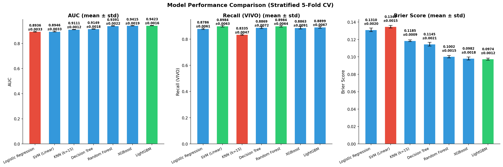
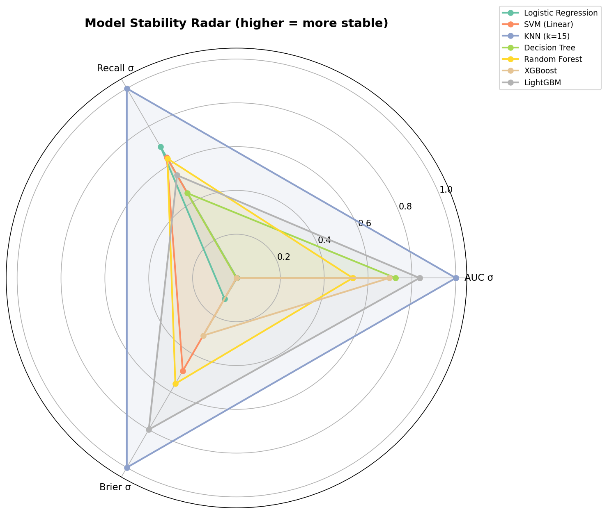
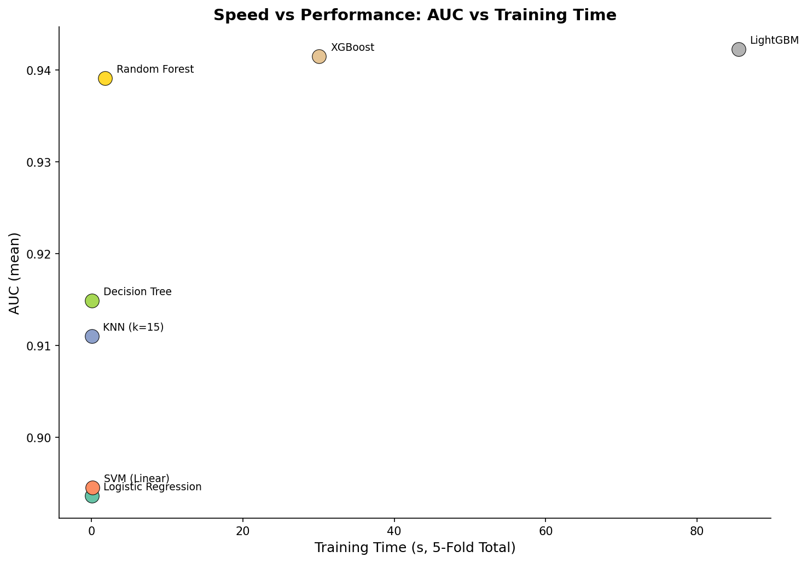
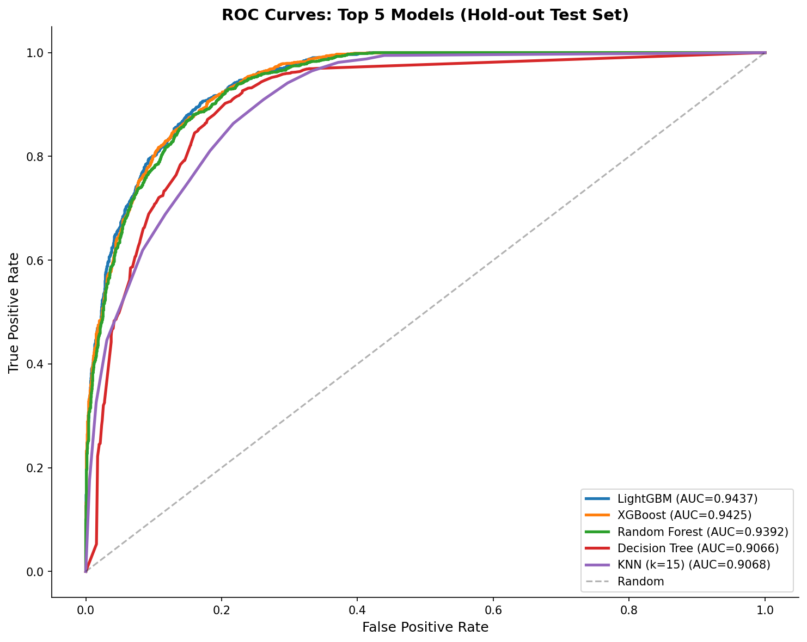
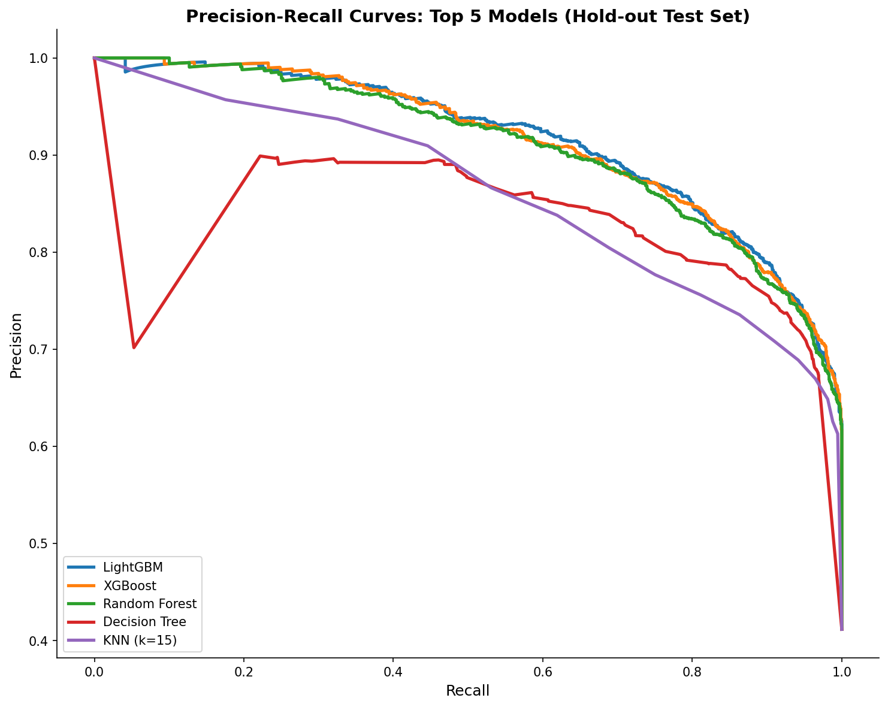
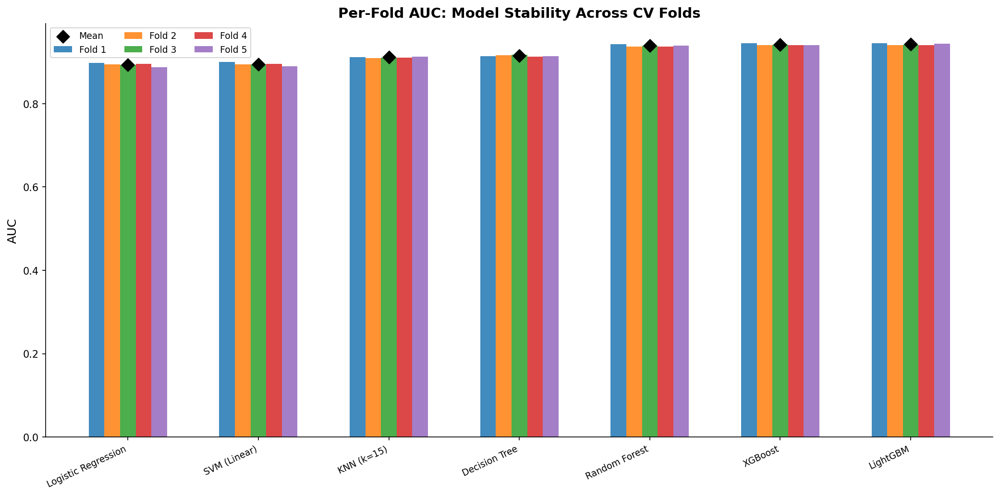

# 模块 4：可视化与结果保存

> 本模块是案例教程 9「机器学习建模 — 7 模型对比」的最后一部分，承接模块 3（训练评估与结果分析）。在得到 7 个模型的评估结果后，本模块生成 6 张可视化图表和 2 个结果文件，把数值结果转化为直观的图形和可分享的文本。
>
> 本模块最核心的知识点有四个：**一是 6 张图的设计意图**——性能条形图（12a）展示三维度对比、稳定性雷达图（12b）展示跨指标稳定性、速度 vs 性能散点图（12c）展示权衡、ROC 曲线（12d）展示排序能力、PR 曲线（12e）展示不平衡数据表现、5 折 AUC 波动图（12f）展示跨折稳定性；**二是颜色编码的设计**——绿色表示最优、红色表示最差、蓝色表示中间，让对比一目了然；**三是 hold-out 测试集绘制 ROC/PR 曲线**——CV 给出稳健指标，hold-out 给出可视化曲线；**四是结果文件的格式**——CSV 用于机器读取、TXT 用于人类阅读。

***

## 学习目标

学完本模块后，你将能够：

1. **理解 6 张图的设计意图**：每张图回答什么问题，如何解读。
2. **掌握 matplotlib 子图布局**：`plt.subplots(1, 3, figsize=(18, 6))` 创建 1×3 子图。
3. **理解颜色编码的设计**：绿色（最优）、红色（最差）、蓝色（中间）的条件表达式。
4. **掌握条形图的误差棒**：`yerr=stds` 显示标准差，`capsize=5` 加帽子。
5. **理解雷达图（极坐标图）的绘制**：`subplot_kw=dict(polar=True)` 创建极坐标子图。
6. **掌握稳定性分数的标准化**：把标准差转成 0–1 的稳定性分数（越高越稳定）。
7. **理解散点图的标注**：`ax.annotate` 给每个点加模型名标签。
8. **掌握 ROC 曲线的绘制**：`roc_curve` 计算 FPR/TPR，`ax.plot` 绘制曲线。
9. **理解 PR 曲线的绘制**：`precision_recall_curve` 计算 Precision/Recall。
10. **掌握分组条形图的绘制**：5 折 AUC 用分组条形图展示，每折一组颜色。

***

## 一、可视化总览

```python
# ============================================================================
# 4. 可视化: 性能 & 稳定性
# ============================================================================
print("\n" + "=" * 70)
print("生成可视化...")
print("=" * 70)

names = [r['name'] for r in all_results]
```

### 1.1 `names = [r['name'] for r in all_results]` — 提取模型名列表

列表推导式，从 `all_results` 中提取所有模型的名称，用于绘图的 x 轴标签。

`names` 的实际内容是：

```python
['Logistic Regression', 'SVM (Linear)', 'KNN (k=15)', 'Decision Tree',
 'Random Forest', 'XGBoost', 'LightGBM']
```

### 1.2 六张图概览

| 图编号 | 文件名                            | 内容                          | 设计意图       |
| --- | ------------------------------ | --------------------------- | ---------- |
| 12a | `12a_model_performance.png`    | 性能条形图（AUC + Recall + Brier） | 三维度并排对比    |
| 12b | `12b_stability_radar.png`      | 稳定性雷达图                      | 跨指标稳定性     |
| 12c | `12c_speed_vs_performance.png` | 速度 vs 性能散点图                 | 性能 vs 速度权衡 |
| 12d | `12d_roc_curves.png`           | ROC 曲线（Top 5）               | 排序能力       |
| 12e | `12e_pr_curves.png`            | PR 曲线（Top 5）                | 不平衡数据表现    |
| 12f | `12f_fold_variance.png`        | 5 折 AUC 波动图                 | 跨折稳定性      |

***

## 二、图 1：性能条形图（12a\_model\_performance.png）

```python
# ---------- 图 1: 性能条形图 (AUC + Recall + Brier) ----------
fig, axes = plt.subplots(1, 3, figsize=(18, 6))
metrics = [
    ('auc_mean', 'auc_std', 'AUC', 'Score ↑', True),
    ('recall_mean', 'recall_std', 'Recall (VIVO)', 'Score ↑', True),
    ('brier_mean', 'brier_std', 'Brier Score', 'Score ↓', False),
]

for idx, (mean_key, std_key, title, _, higher_better) in enumerate(metrics):
    ax = axes[idx]
    means = [r[mean_key] for r in all_results]
    stds = [r[std_key] for r in all_results]

    colors = ['#2ecc71' if v == max(means) else '#e74c3c' if v == min(means) else '#3498db'
              for v in means] if higher_better else ['#2ecc71' if v == min(means) else '#e74c3c' if v == max(means) else '#3498db' for v in means]

    bars = ax.bar(range(len(names)), means, yerr=stds, color=colors,
                  edgecolor='white', capsize=5, width=0.6)
    ax.set_xticks(range(len(names)))
    ax.set_xticklabels(names, rotation=25, ha='right', fontsize=9)
    ax.set_ylabel(title, fontsize=11)
    ax.set_title(f'{title} (mean ± std)', fontsize=13, fontweight='bold')
    ax.spines['top'].set_visible(False); ax.spines['right'].set_visible(False)

    for bar, mean, std in zip(bars, means, stds):
        ax.text(bar.get_x() + bar.get_width()/2, bar.get_height() + 0.005,
                f'{mean:.4f}\n±{std:.4f}',
                ha='center', va='bottom', fontsize=8, fontweight='bold')

plt.suptitle('Model Performance Comparison (Stratified 5-Fold CV)',
             fontsize=14, fontweight='bold')
plt.tight_layout()
plt.savefig(os.path.join(IMG_DIR, "12a_model_performance.png"), dpi=150, bbox_inches='tight')
plt.close()
print("  [图] 12a_model_performance.png")
```

### 2.1 图的设计意图



这张图把 AUC、Recall、Brier 三个指标并排展示，让读者一眼看出每个模型在三个维度上的表现。

### 2.2 代码详解

#### `fig, axes = plt.subplots(1, 3, figsize=(18, 6))` — 创建 1×3 子图

- `1, 3`：1 行 3 列，共 3 个子图。
- `figsize=(18, 6)`：图大小 18×6 英寸，每个子图约 6×6 英寸。
- `axes`：长度为 3 的数组，每个元素是一个子图对象。

#### `metrics` 列表 — 定义三个子图

```python
metrics = [
    ('auc_mean', 'auc_std', 'AUC', 'Score ↑', True),
    ('recall_mean', 'recall_std', 'Recall (VIVO)', 'Score ↑', True),
    ('brier_mean', 'brier_std', 'Brier Score', 'Score ↓', False),
]
```

每个元组包含 5 个元素：

- `mean_key`：结果字典中均值的键（如 `'auc_mean'`）。
- `std_key`：标准差的键（如 `'auc_std'`）。
- `title`：子图标题（如 `'AUC'`）。
- `'Score ↑'` 或 `'Score ↓'`：y 轴标签（↑ 越高越好，↓ 越低越好）。
- `higher_better`：布尔值，True 表示越高越好（AUC、Recall），False 表示越低越好（Brier）。

#### 颜色编码（重点）

```python
colors = ['#2ecc71' if v == max(means) else '#e74c3c' if v == min(means) else '#3498db'
          for v in means] if higher_better else [...]
```

> 💡 **重点概念：颜色编码的设计**
>
> - **绿色** **`#2ecc71`**：最优值（AUC/Recall 最高，或 Brier 最低）。
> - **红色** **`#e74c3c`**：最差值（AUC/Recall 最低，或 Brier 最高）。
> - **蓝色** **`#3498db`**：中间值。
>
> 这种颜色编码让对比一目了然：
>
> - AUC 子图：LightGBM（绿色，0.9423 最高），LR（红色，0.8936 最低）。
> - Recall 子图：SVM/RF（绿色，0.8984 最高），KNN（红色，0.8335 最低）。
> - Brier 子图：LightGBM（绿色，0.0974 最低），SVM（红色，0.1347 最高）。
>
> `higher_better` 控制颜色逻辑：True 时 max 是绿色，False 时 min 是绿色。

#### `bars = ax.bar(...)` — 绘制条形图

- `range(len(names))`：x 轴位置 0–6。
- `means`：条形高度。
- `yerr=stds`：误差棒（标准差）。
- `color=colors`：每个条形的颜色。
- `edgecolor='white'`：条形边缘白色，更美观。
- `capsize=5`：误差棒顶端的帽子宽度。
- `width=0.6`：条形宽度。

#### `ax.set_xticklabels(names, rotation=25, ha='right', fontsize=9)` — x 轴标签

- `rotation=25`：标签旋转 25 度，避免重叠。
- `ha='right'`：右对齐，让旋转后的标签整齐。
- `fontsize=9`：字体大小 9，适合长模型名。

#### `ax.spines['top'].set_visible(False); ax.spines['right'].set_visible(False)` — 隐藏上右边框

去掉上边和右边的坐标轴线，让图更简洁（Tufte 风格）。

#### 数值标注

```python
for bar, mean, std in zip(bars, means, stds):
    ax.text(bar.get_x() + bar.get_width()/2, bar.get_height() + 0.005,
            f'{mean:.4f}\n±{std:.4f}',
            ha='center', va='bottom', fontsize=8, fontweight='bold')
```

在每个条形上方标注"均值 ± 标准差"，如 `0.9423 ± 0.0016`。

- `bar.get_x() + bar.get_width()/2`：条形中心 x 坐标。
- `bar.get_height() + 0.005`：条形顶部上方 0.005 处。
- `f'{mean:.4f}\n±{std:.4f}'`：两行文本，均值和标准差。
- `ha='center'`：水平居中。
- `va='bottom'`：垂直底部对齐（文字在指定点上方）。

#### `plt.suptitle(...)` — 总标题

`suptitle` 是 super title，给整个图（不是单个子图）加标题。

#### `plt.tight_layout()` — 自动调整布局

自动调整子图间距，避免重叠。

#### `plt.savefig(..., dpi=150, bbox_inches='tight')` — 保存

- `dpi=150`：分辨率 150 像素/英寸，清晰且文件不大。
- `bbox_inches='tight'`：裁剪空白边缘，让图更紧凑。

#### `plt.close()` — 关闭图

关闭当前图，释放内存。在循环绘图时必须关闭，否则内存会累积。

***

## 三、图 2：稳定性雷达图（12b\_stability\_radar.png）

```python
# ---------- 图 2: 稳定性雷达图 (CV 标准差) ----------
fig, ax = plt.subplots(figsize=(10, 10), subplot_kw=dict(polar=True))

metric_keys = ['auc_std', 'recall_std', 'brier_std']
metric_labels = ['AUC σ', 'Recall σ', 'Brier σ']
n_metrics = len(metric_keys)

# 标准化: 将 std 转化为稳定性分数 (0=最差, 1=最好)
stability_scores = {}
for key in metric_keys:
    vals = [r[key] for r in all_results]
    vmin, vmax = min(vals), max(vals)
    if vmax - vmin < 1e-8:
        stability_scores[key] = [1.0] * len(vals)
    else:
        stability_scores[key] = [(vmax - v) / (vmax - vmin) for v in vals]

angles = np.linspace(0, 2 * np.pi, n_metrics, endpoint=False).tolist()
angles += angles[:1]

colors_polar = plt.cm.Set2(np.linspace(0, 1, len(names)))
for i, name in enumerate(names):
    values = [stability_scores[k][i] for k in metric_keys]
    values += values[:1]
    ax.plot(angles, values, 'o-', linewidth=2, label=name, color=colors_polar[i])
    ax.fill(angles, values, alpha=0.1, color=colors_polar[i])

ax.set_xticks(angles[:-1])
ax.set_xticklabels(metric_labels, fontsize=11)
ax.set_ylim(0, 1.05)
ax.set_title('Model Stability Radar (higher = more stable)',
             fontsize=14, fontweight='bold', pad=25)
ax.legend(loc='upper right', bbox_to_anchor=(1.3, 1.1), fontsize=9)
plt.tight_layout()
plt.savefig(os.path.join(IMG_DIR, "12b_stability_radar.png"), dpi=150, bbox_inches='tight')
plt.close()
print("  [图] 12b_stability_radar.png")
```

### 3.1 图的设计意图



雷达图（极坐标图）展示每个模型在三个稳定性维度（AUC σ、Recall σ、Brier σ）上的表现。把标准差转成"稳定性分数"（越高越稳定），让雷达图越大越好。

### 3.2 代码详解

#### `subplot_kw=dict(polar=True)` — 创建极坐标子图

`polar=True` 创建极坐标（圆形）子图，适合雷达图。

#### 稳定性分数标准化（重点）

```python
stability_scores[key] = [(vmax - v) / (vmax - vmin) for v in vals]
```

> 💡 **重点概念：把标准差转成稳定性分数**
>
> 标准差越低越稳定，但雷达图"越大越好"。所以需要反转：
>
> $$\text{stability\_score} = \frac{v\_{max} - v}{v\_{max} - v\_{min}}$$
>
> - 标准差最低的模型 → 稳定性分数 = 1（最稳定，雷达图最外圈）。
> - 标准差最高的模型 → 稳定性分数 = 0（最不稳定，雷达图中心）。
> - 中间的模型 → 稳定性分数在 (0, 1) 之间。
>
> 这样雷达图越大，模型越稳定。

#### `angles = np.linspace(0, 2 * np.pi, n_metrics, endpoint=False).tolist()` — 计算角度

- `np.linspace(0, 2*np.pi, 3, endpoint=False)`：生成 3 个角度，均匀分布在 \[0, 2π)。
- `endpoint=False`：不包含终点 2π（因为 2π 和 0 是同一个点）。
- 3 个角度对应 3 个指标（AUC σ、Recall σ、Brier σ）。

#### `angles += angles[:1]` — 闭合雷达图

把第一个角度追加到末尾，让雷达图闭合（首尾相连）。

#### `colors_polar = plt.cm.Set2(np.linspace(0, 1, len(names)))` — 颜色映射

`plt.cm.Set2` 是 Set2 调色板（柔和的 8 色），`np.linspace(0, 1, 7)` 生成 7 个均匀分布的颜色。

#### 绘制每个模型的雷达线

```python
for i, name in enumerate(names):
    values = [stability_scores[k][i] for k in metric_keys]
    values += values[:1]  # 闭合
    ax.plot(angles, values, 'o-', linewidth=2, label=name, color=colors_polar[i])
    ax.fill(angles, values, alpha=0.1, color=colors_polar[i])
```

- `ax.plot`：绘制雷达线（轮廓）。
- `ax.fill`：填充内部，`alpha=0.1` 半透明。
- `'o-'`：圆形标记 + 实线。

#### `ax.set_ylim(0, 1.05)` — y 轴范围

稳定性分数在 \[0, 1]，设 y 轴范围 \[0, 1.05] 留一点边距。

### 3.3 图的解读

- **KNN**：在 AUC σ 上最稳定（接近 1），但 Recall σ 和 Brier σ 一般。
- **LightGBM**：三个维度都比较稳定，雷达图较大。
- **LR/SVM**：三个维度都不稳定，雷达图较小（靠近中心）。

***

## 四、图 3：速度 vs 性能散点图（12c\_speed\_vs\_performance.png）

```python
# ---------- 图 3: 时间 vs AUC 散点图 ----------
fig, ax = plt.subplots(figsize=(10, 7))
for r in all_results:
    ax.scatter(r['time_total'], r['auc_mean'], s=150,
               c=colors_polar[names.index(r['name'])],
               edgecolors='black', linewidths=0.5, zorder=5)
    ax.annotate(r['name'], (r['time_total'], r['auc_mean']),
                textcoords='offset points', xytext=(10, 5), fontsize=9,
                ha='left')

ax.set_xlabel('Training Time (s, 5-Fold Total)', fontsize=12)
ax.set_ylabel('AUC (mean)', fontsize=12)
ax.set_title('Speed vs Performance: AUC vs Training Time',
             fontsize=14, fontweight='bold')
ax.spines['top'].set_visible(False); ax.spines['right'].set_visible(False)
plt.tight_layout()
plt.savefig(os.path.join(IMG_DIR, "12c_speed_vs_performance.png"), dpi=150, bbox_inches='tight')
plt.close()
print("  [图] 12c_speed_vs_performance.png")
```

### 4.1 图的设计意图



散点图展示每个模型的"训练时间（x 轴）vs AUC（y 轴）"。理想区域是左上（快且高性能），右下是差区域（慢且低性能）。

### 4.2 代码详解

#### `ax.scatter(...)` — 绘制散点

- `r['time_total']`：x 坐标（5 折总耗时）。
- `r['auc_mean']`：y 坐标（AUC 均值）。
- `s=150`：点大小 150（较大，醒目）。
- `c=colors_polar[...]`：颜色（复用雷达图的颜色映射）。
- `edgecolors='black'`：黑色边缘，让点更清晰。
- `linewidths=0.5`：边缘线宽。
- `zorder=5`：绘制顺序，5 表示画在前面（不被其他元素遮挡）。

#### `ax.annotate(...)` — 标注模型名

```python
ax.annotate(r['name'], (r['time_total'], r['auc_mean']),
            textcoords='offset points', xytext=(10, 5), fontsize=9,
            ha='left')
```

- `r['name']`：标注文本（模型名）。
- `(r['time_total'], r['auc_mean'])`：标注的锚点（散点位置）。
- `textcoords='offset points'`：文本位置用偏移点表示。
- `xytext=(10, 5)`：文本相对锚点偏移 (10, 5) 点（右上方）。
- `ha='left'`：左对齐。

### 4.3 图的解读

> 💡 **重点概念：速度 vs 性能的权衡**
>
> 散点图清晰地展示了"性能 vs 速度"的权衡：
>
> - **左上（快且高性能）**：LR/KNN（0.06s，AUC 0.89–0.91）——快但性能一般。
> - **中间（中等速度，高性能）**：RF（1.83s，AUC 0.9391）——性价比之王。
> - **右上（慢且高性能）**：XGBoost（22.79s，0.9415）、LightGBM（64.64s，0.9423）——性能冠军但慢。
>
> **RF 是性价比之王**：在 1.83 秒内达到 AUC=0.9391，仅比冠军 LightGBM 低 0.003，但快 35 倍。

***

## 五、图 4：ROC 曲线（12d\_roc\_curves.png）

```python
# ---------- 图 4: 5 个最佳模型的 ROC 曲线 ----------
# 在测试集上绘制
fig, ax = plt.subplots(figsize=(10, 8))

# 选出 AUC 最高的 5 个模型展示 ROC
sorted_results = sorted(all_results, key=lambda r: r['auc_mean'], reverse=True)
top5 = sorted_results[:5]

for r in top5:
    name = r['name']
    # 重建模型
    model_def = None
    for n, m, s in models:
        if n == name:
            model_def = (n, m, s)
            break
    if model_def is None:
        continue
    pipe = build_pipeline(model_def[1], model_def[2])
    pipe.fit(X_train, y_train)

    try:
        y_prob = pipe.predict_proba(X_test)[:, 1]
    except:
        try:
            y_score = pipe.decision_function(X_test)
            y_prob = 1 / (1 + np.exp(-y_score))
        except:
            y_pred = pipe.predict(X_test)
            y_prob = np.clip(y_pred.astype(float), 0, 1)

    fpr, tpr, _ = roc_curve(y_test, y_prob)
    auc = roc_auc_score(y_test, y_prob)
    ax.plot(fpr, tpr, linewidth=2.5, label=f'{name} (AUC={auc:.4f})')

ax.plot([0, 1], [0, 1], 'k--', alpha=0.3, label='Random')
ax.set_xlabel('False Positive Rate', fontsize=12)
ax.set_ylabel('True Positive Rate', fontsize=12)
ax.set_title('ROC Curves: Top 5 Models (Hold-out Test Set)',
             fontsize=14, fontweight='bold')
ax.legend(fontsize=10, loc='lower right')
ax.spines['top'].set_visible(False); ax.spines['right'].set_visible(False)
plt.tight_layout()
plt.savefig(os.path.join(IMG_DIR, "12d_roc_curves.png"), dpi=150, bbox_inches='tight')
plt.close()
print("  [图] 12d_roc_curves.png")
```

### 5.1 图的设计意图



ROC 曲线展示 Top 5 模型在 hold-out 测试集上的排序能力。曲线越靠近左上角，模型越好。

### 5.2 代码详解

#### `sorted_results = sorted(all_results, key=lambda r: r['auc_mean'], reverse=True)` — 按 AUC 排序

- `sorted`：排序函数。
- `key=lambda r: r['auc_mean']`：按 AUC 均值排序。
- `reverse=True`：降序（AUC 高的在前）。

#### `top5 = sorted_results[:5]` — 取前 5 名

只展示 AUC 最高的 5 个模型（LightGBM、XGBoost、RF、DT、KNN），避免 7 条曲线太挤。

#### 重建模型并在 hold-out 测试集上训练

```python
pipe = build_pipeline(model_def[1], model_def[2])
pipe.fit(X_train, y_train)
```

> 💡 **重点概念：为什么用 hold-out 测试集画 ROC？**
>
> CV 给出 5 组 FPR/TPR（每折一组），无法直接画成一条曲线。hold-out 测试集给出唯一一条 ROC 曲线，更适合可视化。
>
> 注意：这里的 AUC 是 hold-out 测试集上的 AUC，和 CV 的 AUC 略有不同（因为数据不同）。但排序应该一致。

#### `fpr, tpr, _ = roc_curve(y_test, y_prob)` — 计算 ROC 曲线

- `y_test`：真实标签。
- `y_prob`：预测概率。
- 返回三个数组：FPR（假阳性率）、TPR（真阳性率）、阈值。

#### `ax.plot(fpr, tpr, linewidth=2.5, label=f'{name} (AUC={auc:.4f})')` — 绘制 ROC 曲线

- `fpr`：x 轴。
- `tpr`：y 轴。
- `linewidth=2.5`：线宽 2.5，较粗醒目。
- `label`：图例标签，包含模型名和 AUC 值。

#### `ax.plot([0, 1], [0, 1], 'k--', alpha=0.3, label='Random')` — 随机基线

画一条从 (0,0) 到 (1,1) 的黑色虚线，表示随机分类器（AUC=0.5）。

### 5.3 图的解读

- **曲线越靠近左上角**：模型越好（高 TPR，低 FPR）。
- **LightGBM/XGBoost/RF**：曲线最靠近左上角，AUC 最高。
- **KNN**：曲线略低，AUC 较低。
- **随机基线**：对角线，AUC=0.5。

***

## 六、图 5：PR 曲线（12e\_pr\_curves.png）

```python
# ---------- 图 5: PR 曲线 ----------
fig, ax = plt.subplots(figsize=(10, 8))
for r in top5:
    name = r['name']
    model_def = None
    for n, m, s in models:
        if n == name:
            model_def = (n, m, s)
            break
    if model_def is None:
        continue
    pipe = build_pipeline(model_def[1], model_def[2])
    pipe.fit(X_train, y_train)

    try:
        y_prob = pipe.predict_proba(X_test)[:, 1]
    except:
        try:
            y_score = pipe.decision_function(X_test)
            y_prob = 1 / (1 + np.exp(-y_score))
        except:
            y_pred = pipe.predict(X_test)
            y_prob = np.clip(y_pred.astype(float), 0, 1)

    prec, rec, _ = precision_recall_curve(y_test, y_prob)
    ax.plot(rec, prec, linewidth=2.5, label=name)

ax.set_xlabel('Recall', fontsize=12)
ax.set_ylabel('Precision', fontsize=12)
ax.set_title('Precision-Recall Curves: Top 5 Models (Hold-out Test Set)',
             fontsize=14, fontweight='bold')
ax.legend(fontsize=10, loc='lower left')
ax.spines['top'].set_visible(False); ax.spines['right'].set_visible(False)
plt.tight_layout()
plt.savefig(os.path.join(IMG_DIR, "12e_pr_curves.png"), dpi=150, bbox_inches='tight')
plt.close()
print("  [图] 12e_pr_curves.png")
```

### 6.1 图的设计意图



PR 曲线展示 Top 5 模型在不平衡数据上的表现。曲线越靠近右上角，模型越好。

### 6.2 代码详解

#### `prec, rec, _ = precision_recall_curve(y_test, y_prob)` — 计算 PR 曲线

- `y_test`：真实标签。
- `y_prob`：预测概率。
- 返回三个数组：Precision（精确率）、Recall（召回率）、阈值。

#### `ax.plot(rec, prec, linewidth=2.5, label=name)` — 绘制 PR 曲线

- `rec`：x 轴（Recall）。
- `prec`：y 轴（Precision）。
- 注意：PR 曲线的 x 轴是 Recall，y 轴是 Precision（和 ROC 相反）。

### 6.3 PR 曲线 vs ROC 曲线

> 💡 **重点概念：PR 曲线 vs ROC 曲线**
>
> | 特性    | ROC 曲线             | PR 曲线          |
> | ----- | ------------------ | -------------- |
> | x 轴   | FPR（假阳性率）          | Recall（召回率）    |
> | y 轴   | TPR（真阳性率，= Recall） | Precision（精确率） |
> | 基线    | 对角线（AUC=0.5）       | 水平线（= 正类比例）    |
> | 不平衡敏感 | 不敏感                | 敏感             |
> | 适用场景  | 平衡数据               | 不平衡数据          |
>
> **PR 曲线对不平衡数据更敏感**：在严重不平衡数据上，ROC 可能看起来很好（因为 TN 多，FPR 低），但 PR 曲线会暴露问题（Precision 低）。本数据集是轻度不平衡，两者结论一致。

***

## 七、图 6：5 折 AUC 波动图（12f\_fold\_variance.png）

```python
# ---------- 图 6: 所有模型在 5 折上的 AUC 波动 ----------
fig, ax = plt.subplots(figsize=(14, 7))
x_pos = np.arange(len(names))
width = 0.12

for fold_i in range(5):
    fold_aucs = [r['aucs'][fold_i] for r in all_results]
    offset = (fold_i - 2) * width
    bars = ax.bar(x_pos + offset, fold_aucs, width,
                  label=f'Fold {fold_i+1}', alpha=0.85)

# Overlay mean
mean_aucs = [r['auc_mean'] for r in all_results]
ax.scatter(x_pos, mean_aucs, color='black', s=80, marker='D',
           zorder=10, label='Mean')

ax.set_xticks(x_pos)
ax.set_xticklabels(names, rotation=25, ha='right', fontsize=9)
ax.set_ylabel('AUC', fontsize=12)
ax.set_title('Per-Fold AUC: Model Stability Across CV Folds',
             fontsize=14, fontweight='bold')
ax.legend(fontsize=9, ncol=3)
ax.spines['top'].set_visible(False); ax.spines['right'].set_visible(False)
plt.tight_layout()
plt.savefig(os.path.join(IMG_DIR, "12f_fold_variance.png"), dpi=150, bbox_inches='tight')
plt.close()
print("  [图] 12f_fold_variance.png")
```

### 7.1 图的设计意图



分组条形图展示每个模型在 5 折上的 AUC，黑色菱形是均值。条形高度差异越小，模型越稳定。

### 7.2 代码详解

#### `x_pos = np.arange(len(names))` — x 轴位置

7 个模型的位置 0–6。

#### `width = 0.12` — 条形宽度

每个模型有 5 个条形（5 折），宽度 0.12，总宽度 0.6，留 0.4 间距。

#### `for fold_i in range(5):` — 5 折循环

```python
fold_aucs = [r['aucs'][fold_i] for r in all_results]
offset = (fold_i - 2) * width
bars = ax.bar(x_pos + offset, fold_aucs, width,
              label=f'Fold {fold_i+1}', alpha=0.85)
```

- `fold_aucs`：所有模型在第 fold\_i 折的 AUC。
- `offset = (fold_i - 2) * width`：每折的 x 轴偏移。fold\_i=0 偏移 -0.24，fold\_i=4 偏移 +0.24，让 5 个条形居中。
- `alpha=0.85`：透明度 0.85，让条形半透明。

#### 均值菱形

```python
mean_aucs = [r['auc_mean'] for r in all_results]
ax.scatter(x_pos, mean_aucs, color='black', s=80, marker='D',
           zorder=10, label='Mean')
```

- `marker='D'`：菱形标记。
- `s=80`：大小 80。
- `zorder=10`：画在最前面。
- 黑色菱形叠加在 5 个条形上方，显示均值。

### 7.3 图的解读

> 💡 **重点概念：5 折 AUC 波动的解读**
>
> - **条形高度差异小**：模型稳定（如 KNN，5 个条形几乎一样高）。
> - **条形高度差异大**：模型不稳定（如 LR/SVM，5 个条形高低不一）。
> - **黑色菱形位置**：均值，反映整体性能。
>
> 这张图直观展示了"稳定性"——不是看均值的绝对值，而是看 5 个条形的离散程度。

***

### 案例教程 9 完整回顾

本案例教程「机器学习建模 — 7 模型对比」通过 5 个模块，完整展示了如何在同一数据集上用同一评估框架比较 7 个模型：

| 模块   | 内容               | 核心输出                                   |
| ---- | ---------------- | -------------------------------------- |
| 模块 0 | 数据加载与预处理         | 20,000 样本、9 特征、41:59 不平衡               |
| 模块 1 | Pipeline 与 CV 框架 | `build_pipeline` + `evaluate_model_cv` |
| 模块 2 | 七个模型定义           | LR/SVM/KNN/DT/RF/XGBoost/LightGBM      |
| 模块 3 | 训练评估与结果分析        | 五大核心发现                                 |
| 模块 4 | 可视化与结果保存         | 6 张图 + 2 个结果文件                         |

### 五大核心发现

1. **LightGBM 性能冠军**：AUC=0.9423，Brier=0.0974（最低）
2. **KNN Recall 最低但不失效**：0.8335，不平衡程度决定 KNN 是否失效
3. **SVM 与 RF Recall 最高**：0.8984 并列，适合"不漏诊"
4. **LightGBM 性能最好但最慢**：64.64s，是 RF 的 35 倍
5. **线性模型最不稳定**：σ=0.0033，是 KNN 的近 3 倍

### 模型选择指南

| 目标     | 推荐模型                                |
| ------ | ----------------------------------- |
| 可解释性优先 | Logistic Regression / Decision Tree |
| 性能优先   | XGBoost / LightGBM                  |
| 稳定性优先  | Random Forest / Logistic Regression |
| 速度优先   | Logistic Regression                 |
| 性价比    | Random Forest                       |
| 医疗论文   | LR（基线）+ LGBM/XGB（主模型）               |

### 教学核心

> 💡 **本教程最核心的教学目标**：
>
> **没有"最好"的模型，只有"最适合目标"的模型。**
>
> 模型选择是可解释性 vs 性能 vs 稳定性 vs 速度的多维权衡。本教程的评估框架（AUC + Recall + Brier + Time + σ 五维度联合解读）提供了做出合理选择的方法论。
>
> 记住：**模型排名不是固定的，它是样本量、特征数、信号噪声比的联合函数**。在不同的数据集上，排名可能完全不同。这就是为什么需要"在同一数据上用同一评估框架比较多个模型"——本教程的核心方法论。

***

**案例教程 9 完！** 接下来的案例教程将进入模型解释（SHAP）、不平衡数据处理、校准与决策曲线分析等高级主题。让我们带着"7 模型对比的方法论"进入下一个教程！

***

